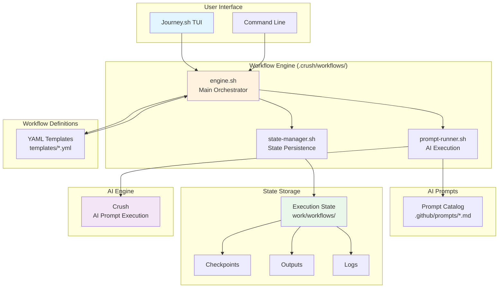
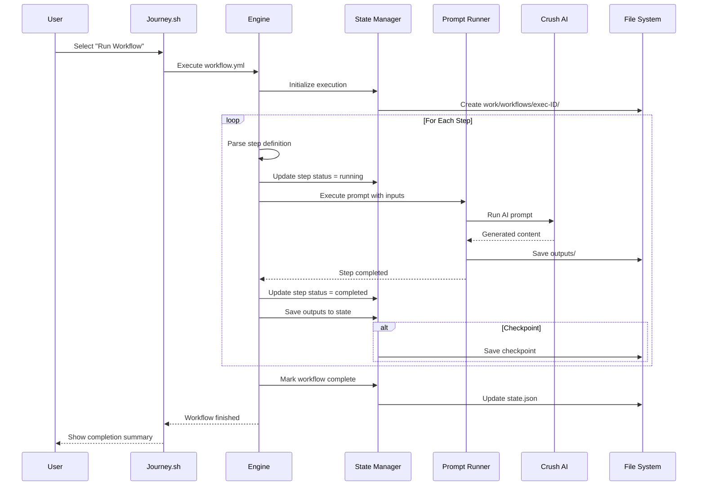
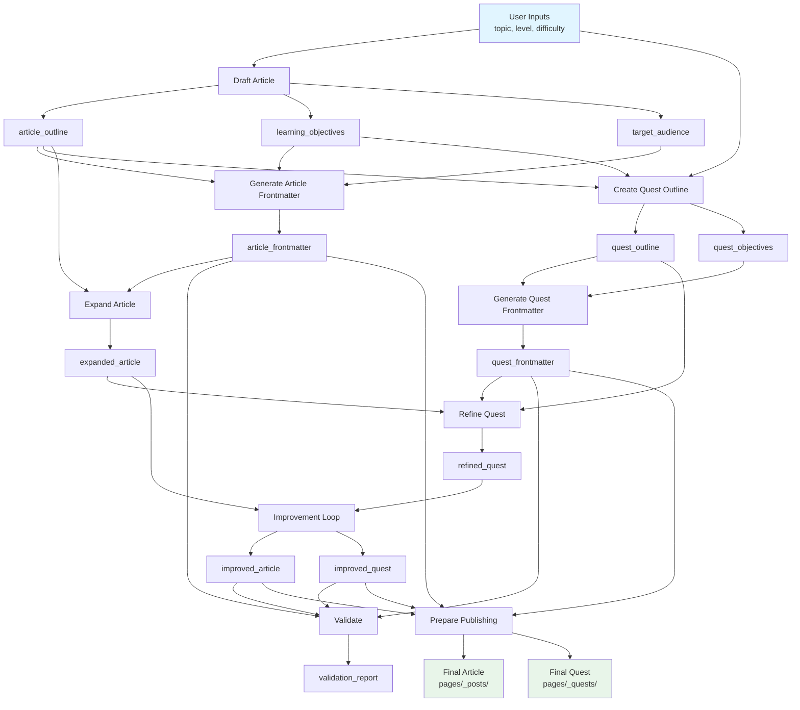
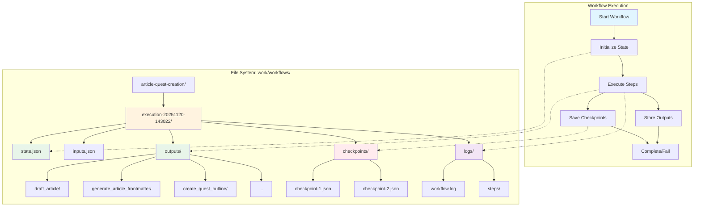
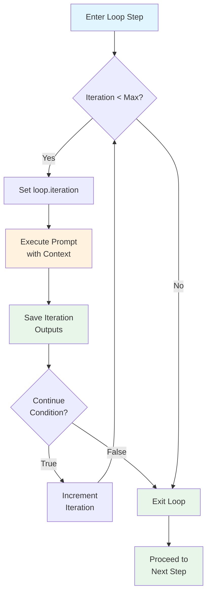
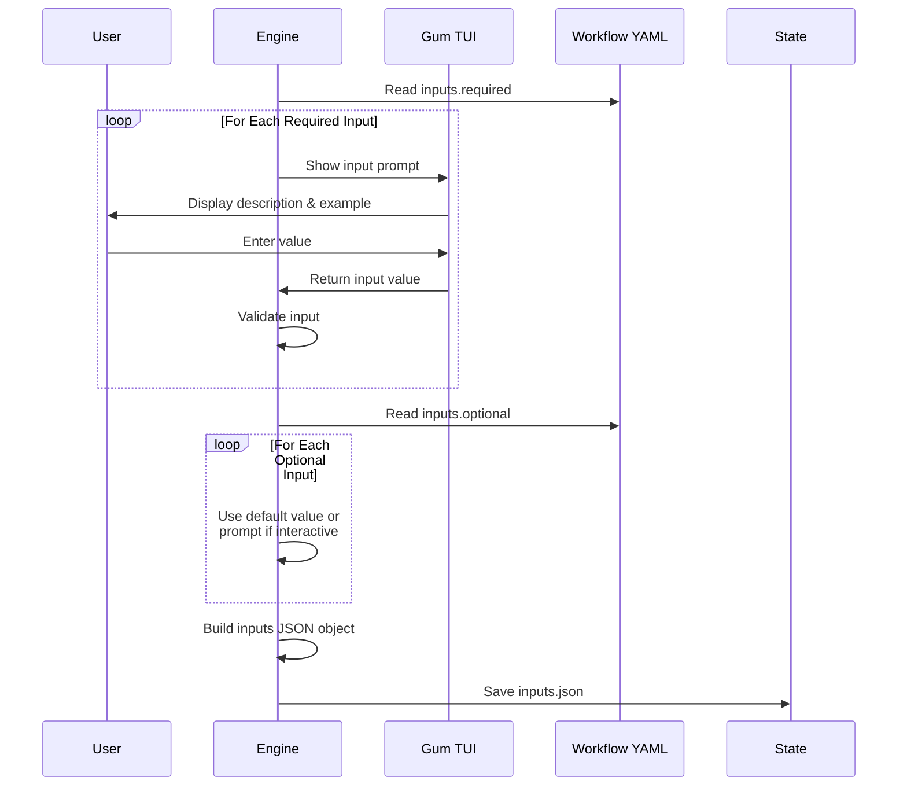
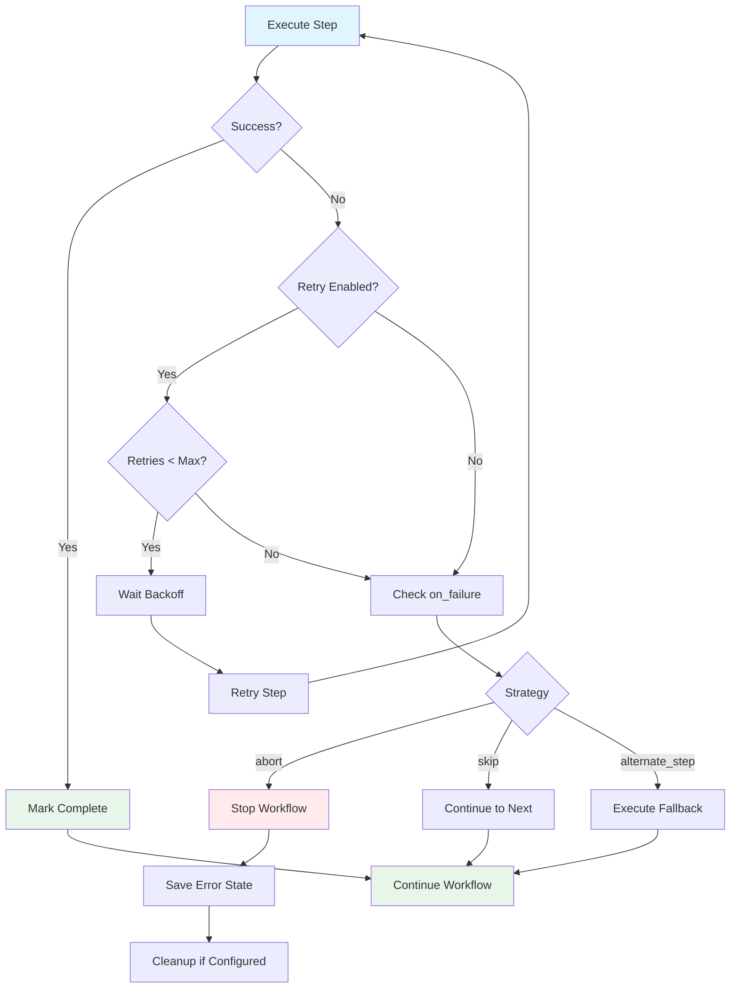

# Crush Workflow System: Visual Architecture Guide

This document provides visual diagrams explaining how the Crush Workflow System operates.

## 🏗️ System Architecture



## 🔄 Workflow Execution Flow



## 📊 Article + Quest Workflow Breakdown



```mermaid
graph LR
    subgraph "Phase 1: Drafting"
        A[Draft Article<br/>Outline] --> B[Generate<br/>Article FM]
        B --> C[Create Quest<br/>Outline]
        C --> D[Generate<br/>Quest FM]
    end
    
    subgraph "Phase 2: Expansion"
        D --> E[Expand Article<br/>with Examples]
        E --> F[Refine Quest<br/>with Challenges]
    end
    
    subgraph "Phase 3: Improvement"
        F --> G[Kaizen Loop<br/>Iteration 1]
        G --> H[Kaizen Loop<br/>Iteration 2]
        H --> I[Kaizen Loop<br/>Iteration 3]
    end
    
    subgraph "Phase 4: Publishing"
        I --> J[Validate<br/>Content]
        J --> K{Pass?}
        K -->|Yes| L[Prepare<br/>Publishing]
        K -->|No| G
        L --> M[Complete &<br/>Summarize]
    end
    
    style A fill:#e3f2fd
    style B fill:#e3f2fd
    style C fill:#e3f2fd
    style D fill:#e3f2fd
    style E fill:#fff3e0
    style F fill:#fff3e0
    style G fill:#f3e5f5
    style H fill:#f3e5f5
    style I fill:#f3e5f5
    style J fill:#ffebee
    style L fill:#e8f5e9
    style M fill:#e8f5e9
```

## 🔀 Data Flow Between Steps



## 💾 State Management Structure



## 🔁 Loop Step Execution



## 🎯 Interactive Input Collection



## 🛠️ Error Handling Flow



## 🎨 Journey.sh Menu Integration

```
┌─────────────────────────────────────────┐
│  🚀 IT-Journey Terminal Interface       │
│  Browse quests, docs, and manage repo   │
└─────────────────────────────────────────┘

Choose your destination:
  📜 Browse Quests
  📖 Read Quickstarts
  📝 View Posts
  📊 View Statistics
> 🎯 Run Content Workflow  ◄── NEW
  🐳 Docker Controls
  🚪 Exit

┌─────────────────────────────────────────┐
│     🔮 Crush Workflow System            │
│  AI-powered content creation pipelines  │
└─────────────────────────────────────────┘

Choose workflow:
> 📝 Article + Quest Creation (Full Pipeline)
  ⚔️ Quest Only
  📰 Article Only
  🔄 Resume Previous Workflow
  📊 View Recent Executions
  🔙 Back to Main Menu
```

## 📈 Workflow Metrics and Monitoring

```mermaid
graph LR
    subgraph "Execution Metrics"
        A[Start Time]
        B[End Time]
        C[Duration]
        D[Step Count]
        E[Iterations]
        F[Checkpoints]
    end
    
    subgraph "Quality Metrics"
        G[Validation Score]
        H[Success Rate]
        I[Retry Count]
        J[Error Rate]
    end
    
    subgraph "Resource Metrics"
        K[AI Tokens Used]
        L[Output Size]
        M[Memory Usage]
        N[Disk Usage]
    end
    
    subgraph "State File: state.json"
        O[metrics: {...}]
    end
    
    A --> O
    B --> O
    C --> O
    D --> O
    E --> O
    F --> O
    G --> O
    H --> O
    I --> O
    J --> O
    K --> O
    L --> O
    M --> O
    N --> O
    
    style O fill:#e8f5e9
```

---

**Diagrams created with Mermaid** - View in GitHub or any Mermaid-compatible renderer for interactive diagrams.

**Related Documentation**:
- [Main README](README.md) - Complete system documentation
- [Quick Start](QUICKSTART.md) - Get started in 5 minutes
- [Summary](../../CRUSH_WORKFLOW_SYSTEM_SUMMARY.md) - Implementation overview
