# Crush Workflow System Quick Start Guide

## 🚀 5-Minute Quick Start

### Step 1: Verify Installation

```bash
# Check dependencies
command -v yq && echo "✓ yq installed" || echo "✗ Install: brew install yq"
command -v jq && echo "✓ jq installed" || echo "✗ Install: brew install jq"
command -v gum && echo "✓ gum installed" || echo "✗ Install: brew install charm/tap/gum"
command -v crush && echo "✓ crush installed" || echo "✗ Install: brew install charm/tap/crush"
```

### Step 2: Explore Available Workflows

```bash
# List workflows
.crush/workflows/engine.sh list

# View workflow details
.crush/workflows/engine.sh info .crush/workflows/templates/article-quest-creation.yml
```

### Step 3: Run Your First Workflow

**Option A: Via Journey.sh (Recommended)**

```bash
./journey.sh
# Select: 🎯 Run Content Workflow
# Choose: 📝 Article + Quest Creation (Full Pipeline)
# Answer prompts interactively
```

**Option B: Direct Command Line**

```bash
# Interactive mode
.crush/workflows/engine.sh run --interactive .crush/workflows/templates/article-quest-creation.yml

# With JSON inputs
.crush/workflows/engine.sh run .crush/workflows/templates/article-quest-creation.yml \
  --input '{
    "topic": "Docker Containerization",
    "level": "0011",
    "difficulty": "intermediate",
    "estimated_time": "2-3 hours"
  }'
```

### Step 4: Monitor Execution

Watch the workflow progress through steps:

```
▶ Executing step: draft_article
ℹ Step: Draft Article Outline
ℹ Running prompt: .github/prompts/draft-article.prompt.md
✓ Step completed: draft_article

▶ Executing step: generate_article_frontmatter
ℹ Step: Generate Article Front Matter
ℹ Running prompt: .github/prompts/generate-frontmatter.prompt.md
✓ Step completed: generate_article_frontmatter
✓ Checkpoint saved after generate_article_frontmatter

▶ Executing step: create_quest_outline
...
```

### Step 5: Review Outputs

```bash
# Navigate to execution directory
cd work/workflows/article-and-quest-creation/execution-YYYYMMDD-HHMMSS/

# View state
cat state.json | jq '.'

# Check outputs
ls -la outputs/

# Read generated content
find outputs/ -name "*.md" -exec glow {} \;
```

## 📊 Example Execution Flow

```mermaid
graph TD
    A[Start Workflow] --> B[Draft Article Outline]
    B --> C[Generate Article Frontmatter]
    C --> D[Create Quest Outline]
    D --> E[Generate Quest Frontmatter]
    E --> F[Checkpoint 1]
    F --> G[Expand Article]
    G --> H[Refine Quest]
    H --> I[Improvement Loop: Iteration 1]
    I --> J[Improvement Loop: Iteration 2]
    J --> K[Improvement Loop: Iteration 3]
    K --> L[Checkpoint 2]
    L --> M[Validate Content]
    M --> N{Validation Pass?}
    N -->|Yes| O[Prepare Publishing]
    N -->|No| I
    O --> P[Complete & Summarize]
    P --> Q[Workflow Complete! 🎉]
    
    style A fill:#e1f5ff
    style F fill:#fff3e0
    style L fill:#fff3e0
    style N fill:#ffebee
    style Q fill:#e8f5e9
```



## 🎯 Common Use Cases

### 1. Create New Article + Quest

**When**: Starting new educational content from scratch

**Command**:
```bash
.crush/workflows/engine.sh run --interactive templates/article-quest-creation.yml
```

**Inputs Needed**:
- Topic (e.g., "Kubernetes Basics")
- Binary level (e.g., "0100")
- Difficulty (beginner/intermediate/advanced)
- Estimated time (e.g., "3-4 hours")

**Outputs**:
- `/pages/_posts/YYYY-MM-DD-kubernetes-basics.md`
- `/pages/_quests/lvl-0100-kubernetes-basics.md`

### 2. Resume Failed Workflow

**When**: Workflow failed mid-execution due to error or timeout

**Command**:
```bash
# List recent executions
.crush/workflows/engine.sh executions --recent 5

# Resume specific execution
.crush/workflows/engine.sh resume work/workflows/article-quest/execution-20251120-143022
```

### 3. View Execution History

**When**: Reviewing past workflow runs

**Command**:
```bash
.crush/workflows/engine.sh executions --recent 10
```

### 4. Create Custom Workflow

**When**: Building a specialized content pipeline

**Steps**:
```bash
# 1. Copy template
cp .crush/workflows/templates/article-quest-creation.yml \
   .crush/workflows/templates/my-workflow.yml

# 2. Edit workflow (see article-quest-creation.yml for syntax)
$EDITOR .crush/workflows/templates/my-workflow.yml

# 3. Validate
.crush/workflows/engine.sh validate templates/my-workflow.yml

# 4. Test
.crush/workflows/engine.sh run --interactive templates/my-workflow.yml
```

## 🔍 Troubleshooting

### Issue: "Missing required dependencies"

```bash
# Install all dependencies
brew install yq jq charm/tap/gum charm/tap/crush glow
```

### Issue: "Workflow file not found"

```bash
# Ensure you're in repo root
cd /path/to/it-journey

# Use absolute or relative path from repo root
.crush/workflows/engine.sh run .crush/workflows/templates/article-quest-creation.yml
```

### Issue: "Step failed"

```bash
# Check logs
cat work/workflows/WORKFLOW_NAME/execution-ID/logs/workflow.log

# Check step-specific logs
cat work/workflows/WORKFLOW_NAME/execution-ID/logs/steps/STEP_ID.log

# Resume with retry
.crush/workflows/engine.sh resume work/workflows/WORKFLOW_NAME/execution-ID
```

### Issue: "Invalid YAML syntax"

```bash
# Validate workflow definition
.crush/workflows/engine.sh validate templates/my-workflow.yml

# Check YAML syntax manually
yq eval '.' templates/my-workflow.yml
```

## 📚 Next Steps

1. **Read Full Documentation**: [.crush/workflows/README.md](.crush/workflows/README.md)
2. **Study Example Workflow**: [templates/article-quest-creation.yml](templates/article-quest-creation.yml)
3. **Explore Prompts**: [.github/prompts/](.github/prompts/)
4. **Review Instructions**: [.github/instructions/](.github/instructions/)
5. **Join Community**: [GitHub Discussions](https://github.com/bamr87/it-journey/discussions)

## 🎓 Learning Path

```
1. Quick Start (This Guide) ────────> Run first workflow
                                      ↓
2. Workflow Concepts ───────────────> Understand structure
                                      ↓
3. Create Custom Workflow ─────────> Build specialized pipeline
                                      ↓
4. Advanced Features ───────────────> Loops, conditions, parallel
                                      ↓
5. Contribute ──────────────────────> Add templates & prompts
```

## 💡 Pro Tips

1. **Use Checkpoints**: Add checkpoints after expensive steps for resumability
2. **Start Small**: Begin with simple 3-4 step workflows before complex pipelines
3. **Validate Early**: Always validate workflow before running: `engine.sh validate`
4. **Log Everything**: Check logs when debugging: `work/workflows/*/logs/`
5. **Reuse Prompts**: Reference existing prompts from `.github/prompts/` instead of creating inline
6. **Test with Mock**: Prompt runner creates mock outputs when Crush unavailable
7. **Iterate Often**: Use improvement loops for quality (3 iterations recommended)

---

**Ready to build your first workflow?** Try the example above or jump into Journey.sh! 🚀

**Need help?** Check [Full Documentation](README.md) or [open an issue](https://github.com/bamr87/it-journey/issues)
