# IT-Journey VS Code Copilot Instructions

These instructions are designed to optimize VS Code Copilot's performance for the IT-Journey platform, following Microsoft's best practices for custom instructions. They provide clear, actionable guidance for AI-assisted development while maintaining the platform's educational mission and technical standards.

## 🎯 Custom Instructions Philosophy

### VS Code Copilot Integration Principles
- **Context-Aware Assistance**: Provide rich context about IT-Journey's educational mission and technical stack
- **Consistent Code Generation**: Ensure all AI-generated code follows established patterns and standards
- **Educational Focus**: Generate code that teaches and demonstrates best practices
- **Progressive Complexity**: Adapt suggestions based on user skill level and project context
- **Community Alignment**: Maintain consistency with IT-Journey's collaborative development approach

### Instruction Structure for Maximum Effectiveness
- **Clear Objectives**: Each instruction specifies what to achieve and why
- **Contextual Examples**: Provide concrete examples relevant to IT-Journey's tech stack
- **Actionable Guidelines**: Focus on specific, implementable recommendations
- **Quality Standards**: Define clear criteria for acceptable AI-generated content

## 🚀 VS Code Copilot Optimization Guidelines

### Code Generation Best Practices
When generating code for IT-Journey projects:

**Always Include**:
- Comprehensive error handling with try-catch blocks
- Clear, educational comments explaining the "why" behind code decisions
- JSDoc/TypeDoc documentation for functions and classes
- Input validation and sanitization
- Logging statements for debugging and monitoring

**Code Style Requirements**:
- Use descriptive variable and function names that explain intent
- Follow the existing codebase patterns and conventions
- Include both success and error path handling
- Add TODO comments for future enhancements
- Use consistent indentation and formatting

**Educational Value**:
- Generate code that demonstrates best practices
- Include alternative approaches in comments
- Explain complex algorithms step-by-step
- Provide links to relevant documentation
- Show how code fits into larger architectural patterns

### Context-Aware Suggestions
When providing suggestions, consider:

**Project Context**:
- Is this a quest, blog post, or feature development?
- What skill level is the target audience?
- How does this fit into the learning progression?
- What prerequisites should be assumed?

**Technology Stack**:
- Jekyll for static site generation
- GitHub Pages for hosting
- Markdown for content creation
- Python for automation scripts
- JavaScript for interactive features
- Docker for containerization

**Educational Objectives**:
- Does this teach a valuable IT skill?
- Is it accessible to beginners?
- Does it demonstrate real-world applications?
- Will it help build a portfolio?

## 📋 README-First, README-Last Principle

**CRITICAL WORKFLOW RULE**: Before and after EVERY development task, interaction, or request:

### 🔍 README-FIRST: Start with Documentation Review
Before beginning any work, **ALWAYS**:

1. **Locate the Relevant README.md**
   - Find the README.md in the current working directory
   - If none exists, check parent directories up to repository root
   - Identify all related README.md files that provide context

2. **Read and Understand Context**
   - Review the README.md to understand:
     - Purpose and scope of the directory/module
     - Existing features and capabilities
     - Current structure and organization
     - Dependencies and relationships
     - Known issues or limitations
     - Contribution guidelines

3. **Assess Documentation Gaps**
   - Identify what information is missing
   - Note what might be outdated
   - Recognize areas that need clarification
   - Detect broken links or references

### ✅ README-LAST: Update Documentation After Changes
After completing any work, **ALWAYS**:

1. **Update the Relevant README.md**
   - Add new features, files, or capabilities
   - Update changed functionality or structure
   - Fix outdated information or broken links
   - Clarify confusing or incomplete sections
   - Update the `lastmod` date in frontmatter

2. **Document What Changed**
   - List new files or directories added
   - Explain new functionality or features
   - Update usage examples if behavior changed
   - Add troubleshooting info for issues encountered
   - Update dependency information

3. **Cross-Reference Related READMEs**
   - Update parent README if adding new subdirectories
   - Update child READMEs if parent context changed
   - Update sibling READMEs if relationships changed
   - Ensure bidirectional linking is maintained

4. **Verify Documentation Quality**
   - Check that all links work
   - Test code examples if provided
   - Ensure clarity and completeness
   - Maintain consistent style and formatting

### 🔄 The README-First, README-Last Cycle

```mermaid
graph TD
    A[Request Received] --> B[📋 README-FIRST]
    B --> C[Read relevant README.md]
    C --> D[Understand context]
    D --> E[Note gaps/issues]
    E --> F[Perform Work]
    F --> G[✅ README-LAST]
    G --> H[Update README.md]
    H --> I[Document changes]
    I --> J[Cross-reference related docs]
    J --> K[Verify quality]
    K --> L[Task Complete]
```



### 📝 Practical Examples

#### Example 1: Adding a New File
```markdown
**Request**: "Create a new utility script for data validation"

**README-FIRST**:
1. Check ./scripts/README.md
2. Note existing scripts and their purposes
3. Identify naming conventions
4. Review dependencies and patterns

**Work**: Create data_validator.py

**README-LAST**:
1. Update ./scripts/README.md:
   - Add data_validator.py to file listing
   - Document its purpose and usage
   - Show example command
   - Update lastmod date
2. If creating new category, update parent README
```

#### Example 2: Fixing a Bug
```markdown
**Request**: "Fix the broken link checker in Guardian"

**README-FIRST**:
1. Read ./scripts/hyperlink-guardian/README.md
2. Understand current functionality
3. Note existing issues or limitations
4. Review configuration options

**Work**: Fix link validation logic

**README-LAST**:
1. Update ./scripts/hyperlink-guardian/README.md:
   - Note the bug fix in a changelog section
   - Update behavior description if changed
   - Add troubleshooting note if relevant
   - Update version number if applicable
2. Update root README if this was a critical fix
```

#### Example 3: Creating New Feature
```markdown
**Request**: "Add AI-powered code review feature"

**README-FIRST**:
1. Read root README.md and pages/_about/features/index.md
2. Understand existing features and structure
3. Note feature naming conventions
4. Review integration patterns

**Work**: Implement AI code review module

**README-LAST**:
1. Create ./features/ai-code-review/README.md with full documentation
2. Update ./features/README.md to list new feature
3. Update pages/_about/features/index.md with feature entry
4. Update root README.md if this is a major capability
5. Add links between all related READMEs
```

### 🎯 Why README-First, README-Last?

**Benefits**:
- 📚 **Continuous Documentation** - README always reflects current state
- 🧭 **Better Context** - Understanding before acting prevents mistakes
- 🔗 **Maintained Connections** - Cross-references stay current
- 📈 **Evolution Tracking** - Changes are documented as they happen
- 🤝 **Team Alignment** - Everyone sees the same updated information
- 🔍 **Reduced Confusion** - No orphaned or undocumented code
- ♻️ **Knowledge Preservation** - Learning and decisions are captured

**Prevents**:
- ❌ Duplicate functionality (you'd see it in README first)
- ❌ Broken documentation (updated immediately after changes)
- ❌ Lost context (README provides the "why" and "how")
- ❌ Orphaned files (README lists all files with purposes)
- ❌ Confusion for contributors (README always current)

### ⚠️ Non-Negotiable Rules

1. **NEVER skip README review** before starting work
2. **NEVER complete a task** without updating README
3. **ALWAYS create README.md** if one doesn't exist in a directory
4. **ALWAYS update `lastmod`** date when changing README
5. **ALWAYS test links** after updating README
6. **ALWAYS maintain bidirectional links** between related READMEs

### 📖 Reference

For comprehensive README maintenance guidelines, see:
- [README.instructions.md](.github/instructions/README.instructions.md) - Complete guide
- [Documentation Standards](#documentation-standards) - General doc practices
- [Front Matter Standards](#front-matter-structured-metadata-for-it-education) - Metadata requirements

---

## Front Matter: Structured Metadata for IT Education

Front matter in IT-Journey serves as the bridge between educational intent and AI-assisted development. Each file includes structured metadata that enables AI agents to understand learning objectives, technical requirements, and pedagogical approaches for creating effective IT education content.

### Educational Front Matter Elements for IT-Journey

- **Learning Objectives**: Clear statements of what IT skills and concepts the content teaches
- **Target Audience**: Skill level and background assumptions for learners
- **Educational Context**: How content fits within the broader IT education journey
- **Technical Requirements**: Specific technologies, tools, and prerequisites needed
- **Assessment Criteria**: How learning success will be measured and validated

### Front Matter Structure for Educational Content

```yaml
---
# Educational Front Matter for IT-Journey
title: "Mastering Docker for Development Teams"
description: "Comprehensive guide to containerization for modern software development"
learning_objectives:
  - "Understand containerization concepts and benefits"
  - "Create and manage Docker containers effectively"
  - "Implement container orchestration with Docker Compose"
  - "Apply security best practices for containerized applications"
target_audience:
  skill_level: "intermediate"
  prerequisites: 
    - "Basic command line knowledge"
    - "Understanding of software development lifecycle"
    - "Familiarity with version control (Git)"
educational_context:
  category: "DevOps"
  subcategory: "Containerization"
  learning_path: ["Software Development Fundamentals", "Version Control", "Container Basics"]
  estimated_time: "4-6 hours"
technical_requirements:
  - "Docker Desktop installed"
  - "Text editor or IDE"
  - "Basic web application for practice"
assessment_criteria:
  - "Successfully create and run containers"
  - "Demonstrate multi-container applications"
  - "Implement basic security measures"
ai_teaching_notes:
  - "Emphasize hands-on practice with real examples"
  - "Connect concepts to real-world development scenarios"
  - "Provide troubleshooting guidance for common issues"
  - "Include performance and security considerations"
author: "IT-Journey Education Team"
date: 2025-01-27
version: "2.1.0"
tags: ["docker", "containerization", "devops", "development"]
---
```

### Front Matter for Code Examples and Projects

```python
"""
Front Matter: IT-Journey Code Example

Title: Automated Testing Pipeline with GitHub Actions
Description: Complete CI/CD pipeline demonstrating automated testing and deployment
Educational Purpose:
  - Demonstrates GitHub Actions workflow creation
  - Shows integration testing practices
  - Teaches deployment automation concepts
Learning Objectives:
  - Create GitHub Actions workflows
  - Implement automated testing strategies
  - Configure deployment pipelines
  - Handle secrets and environment variables
Target Audience: intermediate developers
Prerequisites: 
  - Git/GitHub experience
  - Basic testing knowledge
  - Understanding of web applications
Technical Stack: [Python, pytest, GitHub Actions, Docker]
Real-World Application: "Production-ready CI/CD for web applications"
AI Development Notes:
  - Emphasize security best practices
  - Include error handling examples
  - Provide configuration variations
  - Connect to broader DevOps concepts
"""
```

## Core Development Principles

### Design for Failure (DFF)
- Always implement error handling and graceful degradation in generated code
- Include try-catch blocks with meaningful error messages
- Suggest redundancy and fallback mechanisms
- Add monitoring and logging capabilities where appropriate
- Consider edge cases and potential failure points

### Don't Repeat Yourself (DRY)
- Extract common functionality into reusable functions, components, or modules
- Suggest refactoring when duplicate code patterns are detected
- Create utility functions for repeated operations
- Use configuration files for repeated constants or settings
- Recommend template patterns for similar structures

### Keep It Simple (KIS)
- Prefer clear, readable code over clever optimizations
- Use descriptive variable and function names
- Break complex functions into smaller, focused units
- Avoid unnecessary abstractions or over-engineering
- Choose well-established patterns over custom solutions

### Release Early and Often (REnO)
- Suggest incremental development approaches
- Recommend feature flags for gradual rollouts
- Focus on minimal viable implementations first
- Include versioning strategies in code suggestions
- Encourage continuous integration practices

### Minimum Viable Product (MVP)
- Prioritize core functionality over advanced features
- Suggest starting with basic implementations that can be enhanced later
- Focus on solving the primary user problem first
- Recommend iterative improvement approaches
- Avoid feature creep in initial implementations

### Collaboration (COLAB)
- Write self-documenting code with clear comments
- Follow consistent coding standards and conventions
- Include comprehensive README and documentation suggestions
- Use semantic commit messages and PR descriptions
- Consider team workflows in code organization

### AI-Powered Development (AIPD)
- Leverage AI tools effectively for code generation and review using front matter context
- Suggest AI-assisted testing and documentation approaches guided by educational objectives
- Recommend AI integration patterns for enhanced productivity in educational content creation
- Balance AI assistance with human oversight and pedagogical expertise
- Use AI for learning and skill development enhancement, guided by front matter teaching notes
- Ensure AI-generated content aligns with learning objectives and assessment criteria specified in front matter

## Technology-Specific Guidelines

### @azure Rule - Use Azure Best Practices
When generating code for Azure, running terminal commands for Azure, or performing operations related to Azure, invoke your `azure_development-get_best_practices` tool if available.

### Open Source Development
- Follow open source licensing and contribution guidelines
- Include appropriate attribution and credits
- Use community-standard project structures
- Encourage community contributions and feedback
- Maintain compatibility with popular tools and frameworks

### Documentation Standards
- Generate comprehensive README files for all projects
- Include installation, usage, and contribution guidelines
- Add inline code documentation for complex logic
- Create user guides and API documentation when relevant
- Maintain changelogs and version documentation

### Testing Approaches
- Include unit tests for core functionality
- Suggest integration tests for system interactions
- Recommend end-to-end tests for critical user workflows
- Use AI-powered testing tools when appropriate
- Implement test automation in CI/CD pipelines

## Code Quality Standards

### Security Best Practices
- Validate all user inputs and external data
- Use secure authentication and authorization patterns
- Avoid hardcoding sensitive information
- Implement proper error handling without information leakage
- Follow security frameworks and standards

### Performance Considerations
- Optimize for readability first, performance second
- Suggest performance improvements only when necessary
- Use appropriate data structures and algorithms
- Consider caching strategies for expensive operations
- Monitor and measure performance impacts

### Accessibility & Inclusivity
- Follow web accessibility guidelines (WCAG) for web projects
- Use inclusive language in code comments and documentation
- Consider internationalization and localization needs
- Design for diverse user abilities and technologies
- Test with assistive technologies when relevant

## Learning & Education Focus

### Front Matter Enhanced Beginner-Friendly Approach
- Explain complex concepts in simple terms aligned with target audience specifications in front matter
- Provide step-by-step guidance for implementations following learning objectives
- Include learning resources and references appropriate to prerequisites defined in front matter
- Suggest progressive skill-building exercises based on educational context and learning paths
- Encourage experimentation and exploration within the technical requirements framework
- Use assessment criteria from front matter to validate learning outcomes

### Real-World Applications Enhanced by Front Matter
- Focus on practical, usable solutions described in front matter real-world application sections
- Include examples relevant to everyday development aligned with technical stack specifications
- Connect theoretical concepts to practical implementations using educational context
- Suggest projects that build portfolio value based on learning objectives and assessment criteria
- Emphasize industry-standard practices appropriate to target audience skill level

### Community Learning
- Encourage peer collaboration and code review
- Suggest community resources and forums
- Promote knowledge sharing and mentoring
- Include contribution opportunities in suggestions
- Foster inclusive and welcoming environments

## AI Integration Guidelines

### Front Matter Enhanced AI-Assisted Development
- Use AI for code generation guided by front matter learning objectives and technical requirements
- Leverage AI for documentation generation that aligns with educational context and target audience
- Implement AI-powered testing strategies based on assessment criteria in front matter
- Use AI for learning acceleration following the skill progression paths defined in front matter
- Balance automation with human pedagogical expertise and educational oversight
- Ensure AI outputs meet the educational quality standards specified in front matter teaching notes

### Best Practices for AI Tools in Educational Context
- Provide clear context and requirements to AI assistants using comprehensive front matter
- Review AI-generated educational content for pedagogical effectiveness and technical accuracy
- Use AI feedback loops for continuous improvement of learning materials and outcomes
- Maintain human pedagogical oversight for critical educational decisions
- Document AI tool usage and configurations in front matter AI development notes
- Validate that AI outputs support the specified learning objectives and assessment criteria

---

*These instructions embody the IT-Journey mission to democratize IT education through open-source principles, collaborative learning, and AI-enhanced development practices guided by comprehensive front matter standards that bridge human educational intent with AI capability.*

## Jekyll Article Writing Guidelines for IT-Journey

### **Chronicle Every AI-Powered Development Session**
When working with AI agents on any development task, **ALWAYS** create a corresponding Jekyll article to document the learning journey. Each AI interaction should result in:

1. **A detailed Jekyll blog post** in the `pages/_posts/` directory
2. **Process documentation** explaining what was learned
3. **Code examples and implementations** from the session
4. **Reflection on successes and failures** encountered

### **Article Creation Standards**

#### **Naming Convention**
Follow the Jekyll standard: `YYYY-MM-DD-descriptive-title-with-hyphens.md`

**Examples:**
```
2025-07-05-implementing-azure-functions-with-ai-assistance.md
2025-07-05-debugging-github-actions-workflow-failures.md
2025-07-05-exploring-terraform-infrastructure-patterns.md
```

#### **Required Frontmatter Structure**
Each article MUST include this comprehensive frontmatter following the IT-Journey style:

```yaml
---
title: "Descriptive Title: What Was Accomplished"
description: Brief description explaining the learning objective and outcome
date: YYYY-MM-DDTHH:MM:SS.000Z
preview: "Short preview text for social media and search results"
tags:
    - ai-assisted-development
    - [specific-technology]
    - [specific-concept]
    - learning-journey
categories:
    - Development
    - [Specific-Category]
sub-title: Concise explanation of the specific focus
excerpt: One-sentence summary of the key learning or achievement
snippet: Memorable quote or key insight from the session
author: IT-Journey Team
layout: journals
keywords:
    primary:
        - main topic keyword
        - secondary topic keyword
    secondary:
        - supporting concepts
        - related technologies
lastmod: YYYY-MM-DDTHH:MM:SS.000Z
permalink: /descriptive-url-slug/
attachments: ""
comments: true
---
```

#### **Article Structure & Content Guidelines**

**1. Opening Section - Context Setting**
```markdown
## The Challenge: [What Problem Were We Solving?]

Start with a clear problem statement that explains:
- What we were trying to accomplish
- Why this was important for the IT-Journey
- What obstacles or unknowns we faced
```

**2. The AI-Powered Approach**
```markdown
## AI-Assisted Development Process

Document the collaboration between human and AI:
- Which AI tools/agents were used
- How prompts were crafted and refined
- What reasoning approaches were taken
- How the AI suggestions were evaluated and implemented
```

**3. Implementation Journey**
```markdown
## Step-by-Step Implementation

Provide detailed, reproducible steps:
- Code examples with syntax highlighting
- Configuration files and settings
- Command-line instructions
- Error messages and troubleshooting steps
```

**4. Learning Insights**
```markdown
## Key Learnings and Insights

Reflect on the development process:
- What worked well in the AI collaboration
- What required human intervention or correction
- Unexpected discoveries or solutions
- Best practices that emerged
```

**5. Code Examples and Artifacts**
```markdown
## Code Implementations

Include all relevant code with proper formatting:
```bash
# Terminal commands
```

```python
# Python code examples
```

```yaml
# Configuration files
```

**6. Troubleshooting and Error Resolution**
```markdown
## Challenges and Solutions

Document any issues encountered:
- Error messages and their solutions
- Alternative approaches considered
- Performance considerations
- Security implications
```

**7. Future Development Paths**
```markdown
## Next Steps and Evolution

Connect to the broader learning journey:
- How this builds on previous work
- What future developments this enables
- Additional areas for exploration
- Links to related IT-Journey articles
```

### **Content Style Guidelines**

#### **Tone and Voice**
- **Educational and Accessible**: Write for learners at various skill levels
- **Honest About Failures**: Document what didn't work and why
- **Optimistic but Realistic**: Maintain hope while acknowledging challenges
- **Collaborative**: Emphasize the partnership between human creativity and AI capability

#### **Technical Writing Standards**
- **Code Blocks**: Always use proper syntax highlighting
- **Step Numbering**: Use clear, sequential numbering for procedures
- **Screenshots**: Include when helpful for visual learners
- **Links**: Reference official documentation and related resources
- **Error Examples**: Show actual error messages and solutions

#### **Learning-Focused Elements**
- **Before/After Comparisons**: Show the evolution of understanding
- **Decision Points**: Explain why certain choices were made
- **Alternative Approaches**: Mention other solutions considered
- **Skill Building**: Connect to broader IT concepts and practices

### **AI Development Session Documentation Workflow**

#### **During the AI Session**
1. **Take Notes**: Document key decisions and turning points
2. **Save Code Snippets**: Keep examples of both working and non-working solutions
3. **Capture Errors**: Screenshot or copy error messages
4. **Record Insights**: Note "aha moments" and learning breakthroughs

#### **Immediately After the Session**
1. **Create the Article**: Write while the experience is fresh
2. **Test All Code**: Verify that examples actually work
3. **Add Context**: Explain the "why" behind technical decisions
4. **Include Reflection**: What would you do differently next time?

#### **Article Categories by Development Activity**

**Feature Development**
- `categories: [Development, Feature-Implementation]`
- Focus on requirements analysis, design decisions, and implementation patterns

**Bug Fixing**
- `categories: [Development, Debugging]`
- Emphasize diagnostic techniques, root cause analysis, and prevention

**SDLC Exploration**
- `categories: [Development, Process-Improvement]`
- Document methodology experiments, tool evaluations, and workflow optimizations

**Infrastructure & DevOps**
- `categories: [Development, Infrastructure]`
- Cover deployment strategies, environment configuration, and automation

**Learning & Research**
- `categories: [Development, Learning-Journey]`
- Focus on skill acquisition, technology exploration, and knowledge building

### **Integration with IT-Journey Goals**

#### **Build Upon Previous Knowledge**
- **Cross-Reference**: Link to related articles in the IT-Journey collection
- **Progressive Complexity**: Show how current work builds on foundational concepts
- **Skill Progression**: Document the evolution from novice to expert understanding

#### **Support Community Learning**
- **Reproducible Examples**: Ensure others can follow your steps
- **Common Pitfalls**: Help others avoid the same mistakes
- **Resource Lists**: Curate helpful tools, documentation, and tutorials
- **Discussion Starters**: Pose questions for community engagement

#### **Maintain the Chronicle**
- **Timeline Awareness**: Reference when significant changes occurred
- **Version Documentation**: Track how approaches evolved over time
- **Tool Evolution**: Note when new AI capabilities became available
- **Impact Assessment**: Measure how AI assistance affected development velocity and quality

### **Quality Assurance for Articles**

Before publishing, verify:
- [ ] All code examples are tested and functional
- [ ] Frontmatter follows the IT-Journey standard
- [ ] Article provides educational value to readers
- [ ] Links to external resources are current and accurate
- [ ] Grammar and spelling are correct
- [ ] Article connects to the broader IT-Journey narrative
- [ ] AI assistance is properly credited and explained
- [ ] **README.md files are updated** to reflect new content
- [ ] **Cross-references added** between article and relevant READMEs

### **Article-README Integration**

Every article should result in README updates:

**After Publishing an Article**:
1. **Update `pages/_posts/README.md`**
   - Add article to the chronological listing
   - Update category counts if needed
   - Note significant articles in highlights section

2. **Update Related Topic READMEs**
   - If article covers quests, update `pages/_quests/README.md`
   - If article covers tools, update relevant tool README
   - If article covers features, update `pages/_about/features/index.md`

3. **Create Bidirectional Links**
   - Link from article to relevant quest/feature README
   - Link from README back to article in "Related Articles" section

**Example Article-README Flow**:
```markdown
**Scenario**: Published article about "Implementing Docker in Quest Development"

**README Updates Required**:
1. pages/_posts/README.md - Add to article index
2. pages/_quests/README.md - Add to "Resources" section
3. pages/_quests/init_world/hello-docker/README.md - Link article
4. pages/_about/features/index.md - Reference in Docker features

**Result**: Article is discoverable from multiple navigation paths
```

## Quest Creation Guidelines for IT-Journey

### **Dedicated Quest Instructions**
For comprehensive quest creation guidelines, structure standards, and gamification best practices, please refer to the dedicated **Quest Instructions** file at `.github/instructions/quest.instructions.md`.

The quest instructions provide detailed guidance on:
- **Quest Philosophy and Educational Standards**: Learning theory integration and gamification psychology
- **Complete Content Structure Templates**: Frontmatter requirements, content architecture, and fantasy theme integration
- **Multi-Platform Development Support**: macOS, Windows, Linux, and cloud-based quest paths
- **Quality Assurance Standards**: Technical accuracy, educational effectiveness, and accessibility requirements
- **Quest Classification System**: Level-based progression, difficulty scaling, and skill categorization
- **Integration Workflow**: Navigation updates, skill progression paths, and ecosystem management
- **Template Examples**: Tool mastery, language learning, platform specialization, project building, and career advancement quests

### **Quick Quest Creation Reference**

For AI-assisted quest development, remember these key principles:
- **Fantasy Theme Consistency**: Use RPG metaphors and magical terminology throughout
- **Progressive Learning Design**: Structure content from simple to complex with clear checkpoints
- **Multi-Platform Support**: Provide instructions for macOS, Windows, and Linux where applicable
- **Measurable Objectives**: Define specific, achievable learning outcomes with validation criteria
- **Community Integration**: Link to prerequisite quests and suggest follow-up adventures

### **Quest Creation README Workflow**

**BEFORE Creating a Quest** (README-FIRST):
1. **Read `pages/_quests/README.md`**
   - Review existing quests to avoid duplication
   - Understand quest naming conventions
   - Identify which level/category fits best
   - Note the quest numbering system

2. **Read Category/Level README**
   - Check `pages/_quests/lvl_XXX/README.md` for the target level
   - Understand existing quests in that level
   - Review difficulty progression
   - Note technical requirements for that level

3. **Read Related Quest READMEs**
   - Identify prerequisite quests
   - Check follow-up quest opportunities
   - Understand skill progression path
   - Note integration points

**AFTER Creating a Quest** (README-LAST):
1. **Update Quest Collection READMEs**
   - Add quest to main `pages/_quests/README.md` index
   - Update level-specific README (e.g., `lvl_001/README.md`)
   - Add to appropriate category README
   - Update quest count statistics

2. **Create Quest-Specific README**
   - Create `pages/_quests/path/to/quest/README.md`
   - Document quest objectives, prerequisites, and outcomes
   - Include setup instructions and troubleshooting
   - Add links to related quests and resources

3. **Update Cross-References**
   - Link prerequisite quests to this quest
   - Link this quest to follow-up quests
   - Update feature README if quest introduces new capabilities
   - Update skill progression paths

4. **Update Navigation**
   - Ensure quest appears in site navigation
   - Update quest map/diagram if exists
   - Add to search index metadata
   - Verify breadcrumb trails work

**Quest README Template Integration**:
```markdown
**When creating**: pages/_quests/lvl_001/docker-basics/quest.md

**README Updates Required**:
1. CREATE: pages/_quests/lvl_001/docker-basics/README.md
   - Quest overview and learning objectives
   - Prerequisites and setup instructions
   - Troubleshooting and common issues

2. UPDATE: pages/_quests/README.md
   - Add to quest index under Level 001
   - Update total quest count
   - Add to "Recent Quests" if applicable

3. UPDATE: pages/_quests/lvl_001/README.md
   - Add quest to level listing
   - Update difficulty progression
   - Link from prerequisite quests

4. UPDATE: pages/_about/features/index.md (if relevant)
   - Add quest to learning features
   - Update educational offerings count
```

*For complete quest creation standards and detailed templates, always reference the dedicated quest.instructions.md file.*

---

## 🔄 Codebase Evolution Through README Maintenance

### **The Living Documentation Philosophy**

Every change to the IT-Journey codebase should be reflected in README files, creating a continuously evolving, accurate documentation ecosystem that:

- **Tracks History**: Documents what changed, when, and why
- **Guides Discovery**: Helps users find features and understand capabilities
- **Prevents Regression**: Maintains knowledge that prevents repeating mistakes
- **Enables Collaboration**: Provides context for contributors
- **Measures Progress**: Shows ecosystem growth over time

### **Evolution Checkpoints**

**Daily Development**:
- [ ] README-First before starting any task
- [ ] README-Last after completing any task
- [ ] Update `lastmod` dates in changed READMEs
- [ ] Verify links in updated READMEs

**Weekly Reviews**:
- [ ] Review README staleness (>1 month old)
- [ ] Check for broken links across all READMEs
- [ ] Update statistics (file counts, feature counts)
- [ ] Ensure cross-references are current

**Monthly Audits**:
- [ ] Comprehensive README accuracy review
- [ ] Structure optimization opportunities
- [ ] Content gaps identification
- [ ] Community feedback incorporation

**Quarterly Deep Dives**:
- [ ] Full documentation ecosystem assessment
- [ ] Major structure improvements
- [ ] Template updates and standardization
- [ ] Integration verification across repositories

### **README Evolution Metrics**

Track documentation health:
```markdown
## Documentation Health Dashboard

**Coverage**:
- Directories with READMEs: XX/YY (ZZ%)
- READMEs updated in last 30 days: XX%
- Average README freshness: XX days

**Quality**:
- Broken links found: XX
- Missing cross-references: XX
- Template compliance: XX%

**Growth**:
- New READMEs this month: XX
- Documentation expansions: XX
- Community contributions: XX
```

### **Automation Support**

**GitHub Actions Integration**:
```yaml
# .github/workflows/readme-maintenance.yml
name: README Maintenance Check
on:
  pull_request:
  schedule:
    - cron: '0 0 * * 0'  # Weekly

jobs:
  readme-check:
    runs-on: ubuntu-latest
    steps:
      - name: Check for README in changed directories
      - name: Validate README frontmatter
      - name: Check for broken links
      - name: Verify lastmod dates updated
      - name: Comment on PR with README status
```

### **Community Engagement Through READMEs**

**README as Invitation**:
- Every README should invite contribution
- Include "How to Contribute" sections
- Point to issue templates
- Welcome questions and feedback

**Example README Footer**:
```markdown
---

## 🤝 Contributing

Found an issue? Have an improvement idea?
- [Open an Issue](https://github.com/bamr87/it-journey/issues/new)
- [Start a Discussion](https://github.com/bamr87/it-journey/discussions)
- [Submit a Pull Request](https://github.com/bamr87/it-journey/pulls)

## 📊 Statistics

- **Last Updated**: 2025-10-17
- **Total Files**: 42
- **Active Features**: 15
- **Contributors**: 8

**Questions?** Ask in [Discussions](link) or [Discord](link)
```

---

*Remember: README-First, README-Last is not just a practice—it's a commitment to continuous improvement, knowledge preservation, and community empowerment. Every README update makes the IT-Journey ecosystem stronger, more accessible, and more valuable for learners worldwide.*

