# IT-Journey VS Code Copilot Instructions

These instructions are designed to optimize VS Code Copilot's performance for the IT-Journey platform, following Microsoft's best practices for custom instructions. They provide clear, actionable guidance for AI-assisted development while maintaining the platform's educational mission and technical standards.

## 🎯 Custom Instructions Philosophy

### VS Code Copilot Integration Principles
- **Context-Aware Assistance**: Provide rich context about IT-Journey's educational mission and technical stack
- **Consistent Code Generation**: Ensure all AI-generated code follows established patterns and standards
- **Educational Focus**: Generate code that teaches and demonstrates best practices
- **Progressive Complexity**: Adapt suggestions based on user skill level and project context
- **Community Alignment**: Maintain consistency with IT-Journey's collaborative development approach

### Instruction Structure for Maximum Effectiveness
- **Clear Objectives**: Each instruction specifies what to achieve and why
- **Contextual Examples**: Provide concrete examples relevant to IT-Journey's tech stack
- **Actionable Guidelines**: Focus on specific, implementable recommendations
- **Quality Standards**: Define clear criteria for acceptable AI-generated content

## 🚀 VS Code Copilot Optimization Guidelines

### Code Generation Best Practices
When generating code for IT-Journey projects:

**Always Include**:
- Comprehensive error handling with try-catch blocks
- Clear, educational comments explaining the "why" behind code decisions
- JSDoc/TypeDoc documentation for functions and classes
- Input validation and sanitization
- Logging statements for debugging and monitoring

**Code Style Requirements**:
- Use descriptive variable and function names that explain intent
- Follow the existing codebase patterns and conventions
- Include both success and error path handling
- Add TODO comments for future enhancements
- Use consistent indentation and formatting

**Educational Value**:
- Generate code that demonstrates best practices
- Include alternative approaches in comments
- Explain complex algorithms step-by-step
- Provide links to relevant documentation
- Show how code fits into larger architectural patterns

### Context-Aware Suggestions
When providing suggestions, consider:

**Project Context**:
- Is this a quest, blog post, or feature development?
- What skill level is the target audience?
- How does this fit into the learning progression?
- What prerequisites should be assumed?

**Technology Stack**:
- Jekyll for static site generation
- GitHub Pages for hosting
- Markdown for content creation
- Python for automation scripts
- JavaScript for interactive features
- Docker for containerization

**Educational Objectives**:
- Does this teach a valuable IT skill?
- Is it accessible to beginners?
- Does it demonstrate real-world applications?
- Will it help build a portfolio?

## 📋 README-First, README-Last Principle

**CRITICAL WORKFLOW RULE**: Before and after EVERY development task, interaction, or request:

### 🔍 README-FIRST: Start with Documentation Review
Before beginning any work, **ALWAYS**:

1. **Locate the Relevant README.md**
   - Find the README.md in the current working directory
   - If none exists, check parent directories up to repository root
   - Identify all related README.md files that provide context

2. **Read and Understand Context**
   - Review the README.md to understand:
     - Purpose and scope of the directory/module
     - Existing features and capabilities
     - Current structure and organization
     - Dependencies and relationships
     - Known issues or limitations
     - Contribution guidelines

3. **Assess Documentation Gaps**
   - Identify what information is missing
   - Note what might be outdated
   - Recognize areas that need clarification
   - Detect broken links or references

### ✅ README-LAST: Update Documentation After Changes
After completing any work, **ALWAYS**:

1. **Update the Relevant README.md**
   - Add new features, files, or capabilities
   - Update changed functionality or structure
   - Fix outdated information or broken links
   - Clarify confusing or incomplete sections
   - Update the `lastmod` date in frontmatter

2. **Document What Changed**
   - List new files or directories added
   - Explain new functionality or features
   - Update usage examples if behavior changed
   - Add troubleshooting info for issues encountered
   - Update dependency information

3. **Cross-Reference Related READMEs**
   - Update parent README if adding new subdirectories
   - Update child READMEs if parent context changed
   - Update sibling READMEs if relationships changed
   - Ensure bidirectional linking is maintained

4. **Verify Documentation Quality**
   - Check that all links work
   - Test code examples if provided
   - Ensure clarity and completeness
   - Maintain consistent style and formatting

### 🔄 The README-First, README-Last Cycle

```mermaid
graph TD
    A[Request Received] --> B[📋 README-FIRST]
    B --> C[Read relevant README.md]
    C --> D[Understand context]
    D --> E[Note gaps/issues]
    E --> F[Perform Work]
    F --> G[✅ README-LAST]
    G --> H[Update README.md]
    H --> I[Document changes]
    I --> J[Cross-reference related docs]
    J --> K[Verify quality]
    K --> L[Task Complete]
```



### 📝 Practical Examples

#### Example 1: Adding a New File
```markdown
**Request**: "Create a new utility script for data validation"

**README-FIRST**:
1. Check ./scripts/README.md
2. Note existing scripts and their purposes
3. Identify naming conventions
4. Review dependencies and patterns

**Work**: Create data_validator.py

**README-LAST**:
1. Update ./scripts/README.md:
   - Add data_validator.py to file listing
   - Document its purpose and usage
   - Show example command
   - Update lastmod date
2. If creating new category, update parent README
```

#### Example 2: Fixing a Bug
```markdown
**Request**: "Fix the broken link checker in Guardian"

**README-FIRST**:
1. Read ./scripts/hyperlink-guardian/README.md
2. Understand current functionality
3. Note existing issues or limitations
4. Review configuration options

**Work**: Fix link validation logic

**README-LAST**:
1. Update ./scripts/hyperlink-guardian/README.md:
   - Note the bug fix in a changelog section
   - Update behavior description if changed
   - Add troubleshooting note if relevant
   - Update version number if applicable
2. Update root README if this was a critical fix
```

#### Example 3: Creating New Feature
```markdown
**Request**: "Add AI-powered code review feature"

**README-FIRST**:
1. Read root README.md and pages/_about/features/index.md
2. Understand existing features and structure
3. Note feature naming conventions
4. Review integration patterns

**Work**: Implement AI code review module

**README-LAST**:
1. Create ./features/ai-code-review/README.md with full documentation
2. Update ./features/README.md to list new feature
3. Update pages/_about/features/index.md with feature entry
4. Update root README.md if this is a major capability
5. Add links between all related READMEs
```

### 🎯 Why README-First, README-Last?

**Benefits**:
- 📚 **Continuous Documentation** - README always reflects current state
- 🧭 **Better Context** - Understanding before acting prevents mistakes
- 🔗 **Maintained Connections** - Cross-references stay current
- 📈 **Evolution Tracking** - Changes are documented as they happen
- 🤝 **Team Alignment** - Everyone sees the same updated information
- 🔍 **Reduced Confusion** - No orphaned or undocumented code
- ♻️ **Knowledge Preservation** - Learning and decisions are captured

**Prevents**:
- ❌ Duplicate functionality (you'd see it in README first)
- ❌ Broken documentation (updated immediately after changes)
- ❌ Lost context (README provides the "why" and "how")
- ❌ Orphaned files (README lists all files with purposes)
- ❌ Confusion for contributors (README always current)

### ⚠️ Non-Negotiable Rules

1. **NEVER skip README review** before starting work
2. **NEVER complete a task** without updating README
3. **ALWAYS create README.md** if one doesn't exist in a directory
4. **ALWAYS update `lastmod`** date when changing README
5. **ALWAYS test links** after updating README
6. **ALWAYS maintain bidirectional links** between related READMEs

### 📖 Reference

For comprehensive README maintenance guidelines, see:
- [README.instructions.md](.github/instructions/README.instructions.md) - Complete guide
- [Documentation Standards](#documentation-standards) - General doc practices
- [Front Matter Standards](#front-matter-structured-metadata-for-it-education) - Metadata requirements

---

## Front Matter: Structured Metadata for IT Education

Front matter in IT-Journey serves as the bridge between educational intent and AI-assisted development. Each file includes structured metadata that enables AI agents to understand learning objectives, technical requirements, and pedagogical approaches for creating effective IT education content.

### Educational Front Matter Elements for IT-Journey

- **Learning Objectives**: Clear statements of what IT skills and concepts the content teaches
- **Target Audience**: Skill level and background assumptions for learners
- **Educational Context**: How content fits within the broader IT education journey
- **Technical Requirements**: Specific technologies, tools, and prerequisites needed
- **Assessment Criteria**: How learning success will be measured and validated

### Front Matter Structure for Educational Content

```yaml
---
# Educational Front Matter for IT-Journey
title: "Mastering Docker for Development Teams"
description: "Comprehensive guide to containerization for modern software development"
learning_objectives:
  - "Understand containerization concepts and benefits"
  - "Create and manage Docker containers effectively"
  - "Implement container orchestration with Docker Compose"
  - "Apply security best practices for containerized applications"
target_audience:
  skill_level: "intermediate"
  prerequisites: 
    - "Basic command line knowledge"
    - "Understanding of software development lifecycle"
    - "Familiarity with version control (Git)"
educational_context:
  category: "DevOps"
  subcategory: "Containerization"
  learning_path: ["Software Development Fundamentals", "Version Control", "Container Basics"]
  estimated_time: "4-6 hours"
technical_requirements:
  - "Docker Desktop installed"
  - "Text editor or IDE"
  - "Basic web application for practice"
assessment_criteria:
  - "Successfully create and run containers"
  - "Demonstrate multi-container applications"
  - "Implement basic security measures"
ai_teaching_notes:
  - "Emphasize hands-on practice with real examples"
  - "Connect concepts to real-world development scenarios"
  - "Provide troubleshooting guidance for common issues"
  - "Include performance and security considerations"
author: "IT-Journey Education Team"
date: 2025-01-27
version: "2.1.0"
tags: ["docker", "containerization", "devops", "development"]
---
```

### Front Matter for Code Examples and Projects

```python
"""
Front Matter: IT-Journey Code Example

Title: Automated Testing Pipeline with GitHub Actions
Description: Complete CI/CD pipeline demonstrating automated testing and deployment
Educational Purpose:
  - Demonstrates GitHub Actions workflow creation
  - Shows integration testing practices
  - Teaches deployment automation concepts
Learning Objectives:
  - Create GitHub Actions workflows
  - Implement automated testing strategies
  - Configure deployment pipelines
  - Handle secrets and environment variables
Target Audience: intermediate developers
Prerequisites: 
  - Git/GitHub experience
  - Basic testing knowledge
  - Understanding of web applications
Technical Stack: [Python, pytest, GitHub Actions, Docker]
Real-World Application: "Production-ready CI/CD for web applications"
AI Development Notes:
  - Emphasize security best practices
  - Include error handling examples
  - Provide configuration variations
  - Connect to broader DevOps concepts
"""
```

## Core Development Principles

### Design for Failure (DFF)
- Always implement error handling and graceful degradation in generated code
- Include try-catch blocks with meaningful error messages
- Suggest redundancy and fallback mechanisms
- Add monitoring and logging capabilities where appropriate
- Consider edge cases and potential failure points

### Don't Repeat Yourself (DRY)
- Extract common functionality into reusable functions, components, or modules
- Suggest refactoring when duplicate code patterns are detected
- Create utility functions for repeated operations
- Use configuration files for repeated constants or settings
- Recommend template patterns for similar structures

### Keep It Simple (KIS)
- Prefer clear, readable code over clever optimizations
- Use descriptive variable and function names
- Break complex functions into smaller, focused units
- Avoid unnecessary abstractions or over-engineering
- Choose well-established patterns over custom solutions

### Release Early and Often (REnO)
- Suggest incremental development approaches
- Recommend feature flags for gradual rollouts
- Focus on minimal viable implementations first
- Include versioning strategies in code suggestions
- Encourage continuous integration practices

### Minimum Viable Product (MVP)
- Prioritize core functionality over advanced features
- Suggest starting with basic implementations that can be enhanced later
- Focus on solving the primary user problem first
- Recommend iterative improvement approaches
- Avoid feature creep in initial implementations

### Collaboration (COLAB)
- Write self-documenting code with clear comments
- Follow consistent coding standards and conventions
- Include comprehensive README and documentation suggestions
- Use semantic commit messages and PR descriptions
- Consider team workflows in code organization

### AI-Powered Development (AIPD)
- Leverage AI tools effectively for code generation and review using front matter context
- Suggest AI-assisted testing and documentation approaches guided by educational objectives
- Recommend AI integration patterns for enhanced productivity in educational content creation
- Balance AI assistance with human oversight and pedagogical expertise
- Use AI for learning and skill development enhancement, guided by front matter teaching notes
- Ensure AI-generated content aligns with learning objectives and assessment criteria specified in front matter

## Technology-Specific Guidelines

### @azure Rule - Use Azure Best Practices
When generating code for Azure, running terminal commands for Azure, or performing operations related to Azure, invoke your `azure_development-get_best_practices` tool if available.

### Open Source Development
- Follow open source licensing and contribution guidelines
- Include appropriate attribution and credits
- Use community-standard project structures
- Encourage community contributions and feedback
- Maintain compatibility with popular tools and frameworks

### Documentation Standards
- Generate comprehensive README files for all projects
- Include installation, usage, and contribution guidelines
- Add inline code documentation for complex logic
- Create user guides and API documentation when relevant
- Maintain changelogs and version documentation

### Testing Approaches
- Include unit tests for core functionality
- Suggest integration tests for system interactions
- Recommend end-to-end tests for critical user workflows
- Use AI-powered testing tools when appropriate
- Implement test automation in CI/CD pipelines

## Code Quality Standards

### Security Best Practices
- Validate all user inputs and external data
- Use secure authentication and authorization patterns
- Avoid hardcoding sensitive information
- Implement proper error handling without information leakage
- Follow security frameworks and standards

### Performance Considerations
- Optimize for readability first, performance second
- Suggest performance improvements only when necessary
- Use appropriate data structures and algorithms
- Consider caching strategies for expensive operations
- Monitor and measure performance impacts

### Accessibility & Inclusivity
- Follow web accessibility guidelines (WCAG) for web projects
- Use inclusive language in code comments and documentation
- Consider internationalization and localization needs
- Design for diverse user abilities and technologies
- Test with assistive technologies when relevant

## Learning & Education Focus

### Front Matter Enhanced Beginner-Friendly Approach
- Explain complex concepts in simple terms aligned with target audience specifications in front matter
- Provide step-by-step guidance for implementations following learning objectives
- Include learning resources and references appropriate to prerequisites defined in front matter
- Suggest progressive skill-building exercises based on educational context and learning paths
- Encourage experimentation and exploration within the technical requirements framework
- Use assessment criteria from front matter to validate learning outcomes

### Real-World Applications Enhanced by Front Matter
- Focus on practical, usable solutions described in front matter real-world application sections
- Include examples relevant to everyday development aligned with technical stack specifications
- Connect theoretical concepts to practical implementations using educational context
- Suggest projects that build portfolio value based on learning objectives and assessment criteria
- Emphasize industry-standard practices appropriate to target audience skill level

### Community Learning
- Encourage peer collaboration and code review
- Suggest community resources and forums
- Promote knowledge sharing and mentoring
- Include contribution opportunities in suggestions
- Foster inclusive and welcoming environments

## AI Integration Guidelines

### Front Matter Enhanced AI-Assisted Development
- Use AI for code generation guided by front matter learning objectives and technical requirements
- Leverage AI for documentation generation that aligns with educational context and target audience
- Implement AI-powered testing strategies based on assessment criteria in front matter
- Use AI for learning acceleration following the skill progression paths defined in front matter
- Balance automation with human pedagogical expertise and educational oversight
- Ensure AI outputs meet the educational quality standards specified in front matter teaching notes

### Best Practices for AI Tools in Educational Context
- Provide clear context and requirements to AI assistants using comprehensive front matter
- Review AI-generated educational content for pedagogical effectiveness and technical accuracy
- Use AI feedback loops for continuous improvement of learning materials and outcomes
- Maintain human pedagogical oversight for critical educational decisions
- Document AI tool usage and configurations in front matter AI development notes
- Validate that AI outputs support the specified learning objectives and assessment criteria

---

*These instructions embody the IT-Journey mission to democratize IT education through open-source principles, collaborative learning, and AI-enhanced development practices guided by comprehensive front matter standards that bridge human educational intent with AI capability.*

---

## 📁 Specialized Instruction Files Architecture

### Overview

This main copilot-instructions.md file provides **high-level principles and references**. Detailed guidance lives in specialized instruction files in `.github/instructions/`.

### Instruction File Structure

| Instruction File | Purpose | When to Reference |
|-----------------|---------|-------------------|
| **contributing.instructions.md** | Guide AI agents in assisting contributors | All contribution workflows |
| **README.instructions.md** | Standards for creating and maintaining README files | Creating/updating any README.md |
| **quest.instructions.md** | Quest creation standards and patterns | Creating educational quest content |
| **posts.instructions.md** | Blog post and chronicle creation standards | Writing development session articles |
| **features.instructions.md** | Feature development pipeline and CI/CD | Implementing features and automation |
| **work.instructions.md** | Work directory patterns for development | Organizing workspace and build outputs |
| **prompts.instructions.md** | Prompt engineering for AI development | Crafting effective AI prompts |

### How to Use Specialized Instructions

**1. Identify the Task Type**
   - Creating a quest? → `quest.instructions.md`
   - Writing a blog post? → `posts.instructions.md`
   - Updating documentation? → `README.instructions.md`
   - Building a feature? → `features.instructions.md`
   - Contributing code/content? → `contributing.instructions.md`

**2. Load Relevant Instructions**
   - AI agents should automatically load instructions based on file patterns (`applyTo` field)
   - Manually reference instruction files when context is needed
   - Cross-reference multiple files for complex tasks

**3. Apply Core Principles + Specific Guidelines**
   - This file provides core principles (DFF, DRY, KIS, REnO, MVP, COLAB, AIPD)
   - Specialized files provide task-specific templates, checklists, and examples
   - Git workflow best practices apply universally

**4. Maintain README-First, README-Last**
   - Applies to all tasks regardless of specialization
   - See `README.instructions.md` for comprehensive README maintenance

### Instruction File Hierarchy

```
.github/copilot-instructions.md (THIS FILE)
├─ Core principles: DFF, DRY, KIS, REnO, MVP, COLAB, AIPD
├─ Git workflow best practices
├─ README-First, README-Last principle
└─ Front matter standards

.github/instructions/ (SPECIALIZED GUIDANCE)
├─ contributing.instructions.md → Contribution workflows
├─ README.instructions.md → Documentation standards
├─ quest.instructions.md → Educational quest creation
├─ posts.instructions.md → Blog post/chronicle writing
├─ features.instructions.md → Feature development & CI/CD
├─ work.instructions.md → Workspace organization
└─ prompts.instructions.md → AI prompt engineering
```

### Example Usage Pattern

**Scenario**: User wants to create a new Docker quest

**AI Agent Workflow**:
1. **Load Core Principles** (this file): DFF, DRY, KIS, educational focus
2. **Load Quest Instructions**: `quest.instructions.md` for structure and templates
3. **Load README Instructions**: `README.instructions.md` for documentation updates
4. **Apply Git Workflow**: Follow branching and commit conventions from this file
5. **Execute**: Assist user with quest creation following all loaded guidelines

---

## Jekyll Article Writing Guidelines for IT-Journey

### **Chronicle Every AI-Powered Development Session**

For comprehensive blog post and article creation guidelines, including frontmatter standards, content structure, and documentation workflows, please refer to the dedicated **Posts Instructions** file at `.github/instructions/posts.instructions.md`.

**Key Principle**: When working with AI agents on any development task, **ALWAYS** create a corresponding Jekyll article to document the learning journey in `pages/_posts/`.

### **Essential Standards Summary**

**Naming**: `YYYY-MM-DD-descriptive-title-with-hyphens.md`

**Required Elements**:
- Comprehensive frontmatter with title, description, dates, tags, categories
- Clear problem statement and context
- AI-assisted development process documentation
- Step-by-step implementation with code examples
- Learning insights and reflections
- Future development paths

**Complete Details**: See `.github/instructions/posts.instructions.md`

### **Article Documentation Workflow**

**During Development**: Take notes, save code snippets, capture errors, record insights

**After Development**: Create article immediately while fresh, test all code, add context, include reflection

**Article Categories**: Feature-Implementation, Debugging, Process-Improvement, Infrastructure, Learning-Journey

**Integration Requirements**:
- Cross-reference related articles and quests
- Update relevant README files
- Create bidirectional links
- Connect to broader IT-Journey narrative

**Complete Workflow Details**: See `.github/instructions/posts.instructions.md`

## Quest Creation Guidelines for IT-Journey

**Dedicated Resource**: For comprehensive quest creation guidelines, structure standards, and gamification best practices, see `.github/instructions/quest.instructions.md`.

### **Key Principles Summary**

- **Fantasy Theme Consistency**: Use RPG metaphors and magical terminology
- **Progressive Learning Design**: Structure from simple to complex with checkpoints
- **Multi-Platform Support**: Provide instructions for macOS, Windows, Linux
- **Measurable Objectives**: Define specific, achievable learning outcomes
- **Community Integration**: Link prerequisite and follow-up quests

### **README Workflow Integration**

**BEFORE Creating**: Review existing quests, understand naming conventions, identify level/category

**AFTER Creating**: Update quest collection READMEs, create quest-specific README, update cross-references, update navigation

**Complete Quest Creation Guide**: See `.github/instructions/quest.instructions.md`

---

## 🔄 Codebase Evolution Through README Maintenance

### **The Living Documentation Philosophy**

Every change to the IT-Journey codebase should be reflected in README files, creating a continuously evolving, accurate documentation ecosystem that:

- **Tracks History**: Documents what changed, when, and why
- **Guides Discovery**: Helps users find features and understand capabilities
- **Prevents Regression**: Maintains knowledge that prevents repeating mistakes
- **Enables Collaboration**: Provides context for contributors
- **Measures Progress**: Shows ecosystem growth over time

### **Evolution Checkpoints**

**Daily Development**:
- [ ] README-First before starting any task
- [ ] README-Last after completing any task
- [ ] Update `lastmod` dates in changed READMEs
- [ ] Verify links in updated READMEs

**Weekly Reviews**:
- [ ] Review README staleness (>1 month old)
- [ ] Check for broken links across all READMEs
- [ ] Update statistics (file counts, feature counts)
- [ ] Ensure cross-references are current

**Monthly Audits**:
- [ ] Comprehensive README accuracy review
- [ ] Structure optimization opportunities
- [ ] Content gaps identification
- [ ] Community feedback incorporation

**Quarterly Deep Dives**:
- [ ] Full documentation ecosystem assessment
- [ ] Major structure improvements
- [ ] Template updates and standardization
- [ ] Integration verification across repositories

### **README Evolution Metrics**

Track documentation health:
```markdown
## Documentation Health Dashboard

**Coverage**:
- Directories with READMEs: XX/YY (ZZ%)
- READMEs updated in last 30 days: XX%
- Average README freshness: XX days

**Quality**:
- Broken links found: XX
- Missing cross-references: XX
- Template compliance: XX%

**Growth**:
- New READMEs this month: XX
- Documentation expansions: XX
- Community contributions: XX
```

### **Automation Support**

**GitHub Actions Integration**:
```yaml
# .github/workflows/readme-maintenance.yml
name: README Maintenance Check
on:
  pull_request:
  schedule:
    - cron: '0 0 * * 0'  # Weekly

jobs:
  readme-check:
    runs-on: ubuntu-latest
    steps:
      - name: Check for README in changed directories
      - name: Validate README frontmatter
      - name: Check for broken links
      - name: Verify lastmod dates updated
      - name: Comment on PR with README status
```

### **Community Engagement Through READMEs**

**README as Invitation**:
- Every README should invite contribution
- Include "How to Contribute" sections
- Point to issue templates
- Welcome questions and feedback

**Example README Footer**:
```markdown
---

## 🤝 Contributing

Found an issue? Have an improvement idea?
- [Open an Issue](https://github.com/bamr87/it-journey/issues/new)
- [Start a Discussion](https://github.com/bamr87/it-journey/discussions)
- [Submit a Pull Request](https://github.com/bamr87/it-journey/pulls)

## 📊 Statistics

- **Last Updated**: 2025-10-17
- **Total Files**: 42
- **Active Features**: 15
- **Contributors**: 8

**Questions?** Ask in [Discussions](link) or [Discord](link)
```

---

*Remember: README-First, README-Last is not just a practice—it's a commitment to continuous improvement, knowledge preservation, and community empowerment. Every README update makes the IT-Journey ecosystem stronger, more accessible, and more valuable for learners worldwide.*

## Git Workflow Best Practices

To ensure consistent, high-quality development practices across IT-Journey projects, follow these Git workflow guidelines that integrate branching, change tracking, release management, and documentation into a cohesive educational development process.

### Branching Strategy

**Core Branching Concepts:**

| Concept | Description |
|---------|-------------|
| `HEAD` | Pointer to your current position (usually a branch) |
| Branch | A movable pointer to a commit |
| `main` | Default branch — should always be deployable |
| Checkout | Switch to a branch: `git checkout <branch>` or `git switch <branch>` |
| Merge | Combine changes from one branch into another |
| Rebase | Replay your changes on top of another branch (cleaner history) |

**Use GitHub Flow for simplicity and speed:**

GitHub Flow is recommended for IT-Journey's fast-paced, CI/CD-friendly development:

```
main ← feature/login ← (work here)
         ↑
      Pull Request → Review → Merge
```

**Steps:**
1. Branch off `main`: `git switch -c feature/login`
2. Make commits with conventional commit messages
3. Push often: `git push origin feature/login`
4. Open a Pull Request (PR) early for visibility
5. Get review, run automated tests
6. Merge into `main` via PR
7. Delete branch after merge

**Pros**: Simple, fast, CI/CD friendly, ideal for continuous deployment  
**Cons**: Not ideal for versioned releases (use Git Flow if needed)

**Branch Naming Conventions:**

| Type | Prefix | Example |
|------|--------|----------|
| Feature | `feature/` | `feature/user-auth`, `feature/JIRA-123-login` |
| Bugfix | `bugfix/` | `bugfix/login-crash`, `bugfix/null-pointer-fix` |
| Hotfix | `hotfix/` | `hotfix/security-patch`, `hotfix/prod-crash` |
| Refactor | `refactor/` | `refactor/payment-logic` |
| Docs | `docs/` | `docs/api-update`, `docs/quest-instructions` |
| UI/UX | `ui/` | `ui/mobile-header-spacing` |
| Chore | `chore/` | `chore/upgrade-dependencies` |
| Performance | `perf/` | `perf/lazy-load-images` |

**Rules:**
- Use lowercase with hyphens (kebab-case)
- Include ticket ID when applicable: `feature/JIRA-123-login`
- Keep branches small and focused on one logical change
- Never commit directly to `main` - always use branches and PRs
- Delete merged branches to keep the repo clean

**Essential Git Commands:**

```bash
# Create and switch to new branch
git switch -c feature/login
# or (older Git)
git checkout -b feature/login

# Push branch to remote
git push origin feature/login

# List branches
git branch          # local
git branch -r       # remote
git branch -a       # all

# Sync with main often
git switch main
git pull origin main
git switch feature/login
git rebase main   # or merge

# Delete local branch
git branch -d feature/login

# Delete remote branch
git push origin --delete feature/login

# Clean up merged branches
git fetch --prune
git branch --merged | grep -v "\*" | xargs git branch -d
```

### Change Types and Commit Messages

**Follow Conventional Commits for structured, searchable history:**

Based on analysis of 100+ open-source repositories, here are the most common change types in typical web/mobile applications:

| Rank | Change Type | % of Commits | Branch Prefix | Commit Prefix | Example |
|------|-------------|--------------|---------------|---------------|----------|
| 1 | **Bug Fixes** | ~35% | `bugfix/` | `fix:` | `fix: prevent crash on empty input` |
| 2 | **New Features** | ~25% | `feature/` | `feat:` | `feat: add dark mode toggle` |
| 3 | **UI/UX Tweaks** | ~15% | `ui/` or `feature/` | `feat:` / `fix:` | `ui: center login button on mobile` |
| 4 | **Refactors** | ~10% | `refactor/` | `refactor:` | `refactor: extract payment logic to service` |
| 5 | **Dependency Updates** | ~5% | `chore/` or `deps/` | `chore(deps):` | `chore(deps): upgrade react to 18.3` |
| 6 | **Config / CI/CD** | ~3% | `chore/` | `chore(ci):` | `chore: add lint-staged pre-commit hook` |
| 7 | **Documentation** | ~1% | `docs/` | `docs:` | `docs: update API auth examples` |
| 8 | **Performance** | ~1% | `perf/` | `perf:` | `perf: lazy load images below fold` |

**Additional Change Types (Less Common):**

| Type | Prefix | Example |
|------|--------|----------|
| Tests | `test:` | `test: add login e2e tests` |
| Build | `build:` | `build: update webpack config` |
| Reverts | `revert:` | `revert: feat(payment)` |
| Security | `security:` | `security: upgrade vulnerable dependencies` |

### Detailed Change Type Guidelines

#### 1. Bug Fixes (`fix:`)
**When to Use**: Fixing broken functionality, crashes, errors, or unexpected behavior.

**Characteristics**:
- Resolves an issue reported by users or found in testing
- Restores expected functionality
- Does not add new features
- May include regression tests

**Branch Naming**: `bugfix/[ticket-id]-[description]`
- Examples: `bugfix/login-crash`, `bugfix/JIRA-456-null-pointer-fix`

**Best Practices**:
- Include reproduction steps in commit body
- Reference the issue number: `Closes #456`
- Add tests to prevent regression
- Explain the root cause if not obvious
- Document workarounds users may have implemented

**Common Scenarios**:
- Null pointer exceptions
- Form validation failures
- API error handling
- Race conditions
- Memory leaks
- UI layout issues
- Data corruption

**Example Commit**:
```bash
fix(login): prevent crash on empty input

Fixed null pointer exception when email field is empty.
- Added input validation before API call
- Added unit tests for edge cases
- Graceful error message displayed to user

Reproduction: Leave email blank and click login
Root cause: validateEmail() didn't check for null

Closes #456
```

#### 2. New Features (`feat:`)
**When to Use**: Adding new functionality, capabilities, or user-facing improvements.

**Characteristics**:
- Introduces something that didn't exist before
- Provides value to end users
- May include documentation and tests
- Backwards compatible (or marked as breaking change)

**Branch Naming**: `feature/[ticket-id]-[description]`
- Examples: `feature/user-auth`, `feature/JIRA-123-dark-mode`

**Best Practices**:
- Include user stories or use cases in commit body
- Document new API endpoints or functions
- Add feature flags for gradual rollout
- Update user documentation
- Include screenshots for UI features
- Write comprehensive tests

**Common Scenarios**:
- User authentication systems
- Payment integration
- Dashboard widgets
- Social sharing
- Export/import functionality
- Search capabilities
- Notification systems

**Example Commit**:
```bash
feat(auth): add two-factor authentication

Implements TOTP-based 2FA with SMS fallback for enhanced security.

Features:
- Users can enable 2FA in account settings
- Supports authenticator apps (Google Authenticator, Authy)
- SMS backup codes for lost devices
- Admin can require 2FA for enterprise accounts

Technical:
- Uses Twilio Verify API for SMS delivery
- TOTP secrets stored encrypted in database
- Rate limiting on verification attempts

Documentation: docs/user/2fa.md
API: POST /auth/2fa/enable, POST /auth/2fa/verify

Implements JIRA-789
Closes #123
```

#### 3. UI/UX Improvements (`ui:` or `feat:`/`fix:`)
**When to Use**: Visual changes, layout adjustments, accessibility improvements, or user experience enhancements.

**Characteristics**:
- Changes visual appearance or interaction patterns
- Improves usability or accessibility
- May be bug fixes or features depending on context
- Often includes design system updates

**Branch Naming**: `ui/[description]` or use `feature/` for larger changes
- Examples: `ui/mobile-header-spacing`, `ui/dark-mode-toggle`

**Best Practices**:
- Include before/after screenshots
- Test across browsers and devices
- Verify accessibility (WCAG compliance)
- Update design system documentation
- Consider responsive design implications
- Test with screen readers if applicable

**Common Scenarios**:
- Responsive design fixes
- Color/contrast adjustments
- Button placement and sizing
- Modal/dialog improvements
- Animation and transitions
- Typography updates
- Icon changes

**Example Commit**:
```bash
ui: improve mobile navigation accessibility

Enhanced mobile menu for better usability on small screens.

Changes:
- Increased tap target size from 36px to 44px (WCAG 2.1 compliant)
- Added ARIA labels for screen readers
- Improved color contrast (AAA rating)
- Smoother slide-out animation (reduced from 300ms to 200ms)

Testing:
- Verified on iOS Safari, Chrome, Firefox
- Screen reader tested with VoiceOver
- Lighthouse accessibility score: 96 → 100

Closes #234
```

#### 4. Refactoring (`refactor:`)
**When to Use**: Restructuring code without changing external behavior.

**Characteristics**:
- Improves code quality, readability, or maintainability
- No functional changes for end users
- May improve performance as side effect
- Often reduces technical debt

**Branch Naming**: `refactor/[description]`
- Examples: `refactor/payment-logic`, `refactor/auth-service-extraction`

**Best Practices**:
- Explain the "why" - what problem does this solve?
- Ensure all tests still pass
- Keep changes focused and atomic
- Document any architectural changes
- Consider splitting large refactors into smaller PRs
- Update architecture diagrams if applicable

**Common Scenarios**:
- Extracting duplicate code into utilities
- Breaking large components into smaller ones
- Renaming for clarity
- Reorganizing file structure
- Simplifying complex logic
- Replacing deprecated patterns
- Improving type safety

**Example Commit**:
```bash
refactor(payments): extract card validation to utils

Moved card validation logic from PaymentForm to shared utils for reuse.

Motivation:
- Validation logic was duplicated in 3 components
- Makes testing easier with isolated functions
- Enables reuse in mobile app

Changes:
- Created utils/validation/cardValidation.ts
- Extracted validateCardNumber(), validateCVV(), validateExpiry()
- Updated PaymentForm, CheckoutWidget, and ProfileSettings to use utils
- Added comprehensive unit tests

No behavior change - purely organizational.
All existing tests pass without modification.
```

#### 5. Dependency Updates (`chore(deps):`)
**When to Use**: Updating third-party libraries, frameworks, or tools.

**Characteristics**:
- Changes package versions
- May include security patches
- Often automated (Dependabot, Renovate)
- Should be tested before merging

**Branch Naming**: `chore/[package-name]-upgrade` or `deps/[package-name]`
- Examples: `chore/react-18-upgrade`, `deps/axios-security-patch`

**Best Practices**:
- Review changelogs before upgrading
- Test critical functionality after upgrade
- Update documentation if API changed
- Check for breaking changes
- Run full test suite
- Consider staggering major updates

**Common Scenarios**:
- Security vulnerability patches
- Bug fixes in dependencies
- Performance improvements
- New features in libraries
- Framework version upgrades
- Deprecation migrations

**Example Commit**:
```bash
chore(deps): upgrade axios to 1.7.0

Security patch for CVE-2024-XXXX addressing SSRF vulnerability.

Changes:
- axios: 1.6.8 → 1.7.0
- Updated axios usage in API client (minor breaking change)
- Replaced deprecated config.transformRequest with config.transformData

Testing:
- All API integration tests pass
- Manual testing of authentication flows
- Verified CORS preflight handling

Breaking changes:
- transformRequest renamed to transformData (updated in 2 files)

Closes #789
Auto-generated by Dependabot
```

#### 6. Configuration & CI/CD (`chore:`)
**When to Use**: Changes to build configuration, CI/CD pipelines, development tools, or project setup.

**Characteristics**:
- Affects development or deployment process
- Does not change application code
- May improve developer experience
- Often involves tooling configuration

**Branch Naming**: `chore/[description]`
- Examples: `chore/add-github-actions`, `chore/update-docker-config`

**Best Practices**:
- Document why the change is needed
- Test the pipeline before merging
- Consider impact on team workflows
- Update documentation for developers
- Communicate changes to the team
- Verify backwards compatibility

**Common Scenarios**:
- Adding/updating CI/CD workflows
- Docker configuration changes
- Build tool updates (webpack, vite, etc.)
- Linter/formatter configuration
- Pre-commit hooks
- Environment variable changes
- IDE configuration

**Example Commit**:
```bash
chore(ci): add CodeQL security scanning

Implemented automated security analysis in GitHub Actions.

Changes:
- Added .github/workflows/codeql.yml
- Runs on push to main and pull requests
- Scans JavaScript, TypeScript, and Python code
- Uploads results to GitHub Security tab

Benefits:
- Automated vulnerability detection
- Integration with Dependabot alerts
- No manual security review needed for common issues

Configuration:
- Runs on schedule: weekly at 3 AM UTC
- Auto-dismisses false positives using .github/codeql/filters.yml

Documentation: docs/dev/security-scanning.md
```

#### 7. Documentation (`docs:`)
**When to Use**: Changes to documentation files, README, API docs, user guides, or code comments.

**Characteristics**:
- Improves understanding and onboarding
- No code functionality changes
- May include typo fixes or clarifications
- Often includes examples and tutorials

**Branch Naming**: `docs/[description]`
- Examples: `docs/api-update`, `docs/quest-docker-setup`

**Best Practices**:
- Keep documentation in sync with code
- Use clear, accessible language
- Include practical examples
- Add screenshots for visual features
- Test code examples to ensure they work
- Update table of contents if needed
- Check for broken links

**Common Scenarios**:
- API documentation updates
- README improvements
- Tutorial creation
- Fixing typos
- Adding code examples
- Architecture diagrams
- Onboarding guides

**Example Commit**:
```bash
docs(quest): add Docker installation instructions for macOS

Enhanced Docker setup guide with platform-specific instructions.

Changes:
- Added macOS installation steps with Homebrew
- Updated prerequisites section with system requirements
- Added troubleshooting section for common issues
- Included screenshots of Docker Desktop setup

Content:
- Minimum macOS version: 10.15 (Catalina)
- Docker Desktop 4.x installation
- Post-install verification steps
- Common error solutions (port conflicts, permissions)

Related: Updated pages/_quests/docker-fundamentals/index.md

Closes #456
```

#### 8. Performance Optimizations (`perf:`)
**When to Use**: Changes that improve speed, memory usage, or resource efficiency.

**Characteristics**:
- Measurable performance improvement
- Maintains existing functionality
- Often includes benchmarks
- May involve algorithmic changes

**Branch Naming**: `perf/[description]`
- Examples: `perf/lazy-load-images`, `perf/database-query-optimization`

**Best Practices**:
- Include before/after metrics
- Use profiling tools to identify bottlenecks
- Document the optimization technique
- Ensure no functional regression
- Consider trade-offs (readability vs speed)
- Test with realistic data volumes

**Common Scenarios**:
- Lazy loading resources
- Database query optimization
- Caching implementation
- Bundle size reduction
- Memory leak fixes
- Algorithm improvements
- Network request batching

**Example Commit**:
```bash
perf(images): implement lazy loading below the fold

Reduced initial page load time by deferring off-screen image loading.

Implementation:
- Added Intersection Observer for images below viewport
- Placeholder images shown until scroll
- Progressive loading with blur-up effect

Performance Impact:
- Initial page load: 4.2s → 1.8s (57% faster)
- Largest Contentful Paint: 3.1s → 1.2s
- Reduced initial bandwidth: 8MB → 2MB

Testing:
- Lighthouse score: 72 → 94
- Tested on 3G connection simulation
- Works with JavaScript disabled (native loading="lazy" fallback)

Browser support: Chrome 76+, Firefox 75+, Safari 15.4+
```

**Commit Message Format (Conventional Commits):**

```
<type>(<scope>): <short description>

<body: what changed, why, and how>

<footer: breaking changes, closes issues>
```

**Real-World Examples:**

```bash
# Feature with detailed context
feat(auth): add 2FA with SMS

Users can now enable SMS-based two-factor authentication.
Uses Twilio Verify API for delivery.
Includes admin toggle in settings.

Implements JIRA-789
Closes #123

# Bug fix with reproduction steps
fix(login): prevent crash on empty input

Fixed null pointer exception when email field is empty.
Added input validation before API call.

Closes #456

# Refactor explaining the why
refactor(payments): extract validateCard() to utils

Moved card validation logic to shared utils for reuse.
No behavior change - purely organizational.

# Documentation update
docs(quest): add Docker installation instructions

Added macOS and Linux installation steps for Docker.
Updated prerequisite section with system requirements.

# Dependency update with security context
chore(deps): upgrade axios to 1.7.0

Security patch for CVE-2023-XXXX.
Auto-generated by Dependabot.
```

**Commit Message Best Practices:**

1. **Use imperative mood**: "add feature" not "added feature"
2. **Keep subject line under 50 characters**
3. **Capitalize first letter of subject**
4. **No period at end of subject**
5. **Wrap body at 72 characters**
6. **Explain WHAT and WHY, not HOW** (code shows how)
7. **Reference issues/tickets**: `Closes #123`, `Implements JIRA-789`
8. **Use breaking change footer**: `BREAKING CHANGE: API endpoint renamed`

**Automate Commit Messages with Tools:**

| Tool | Purpose | Setup |
|------|---------|-------|
| **Commitizen** | Interactive commit message builder | `npm install -g commitizen` |
| **Husky + lint-staged** | Enforce commit format | Pre-commit hooks |
| **commitlint** | Validate commit messages | `npm install @commitlint/cli` |

**Example: Interactive commit with Commitizen:**

```bash
# Instead of git commit
git cz

# Prompts you for:
# - Type: feat, fix, docs, etc.
# - Scope: auth, api, ui, etc.
# - Description: short summary
# - Body: detailed explanation
# - Breaking changes: if any
# - Issues closed: ticket numbers
```

### Release Management and Versioning

**Complete Lifecycle: From Commit → Deploy → Release**

```
[Code Change] 
    ↓
[Branch + Commit] 
    ↓
[PR + Review + CI] 
    ↓
[Merge → main] 
    ↓
[Auto Changelog + Version Bump] 
    ↓
[Tag + Release] 
    ↓
[Deploy (Staging → Prod)] 
    ↓
[Monitor + Hotfix if needed]
```

**Semantic Versioning (SemVer):**

```
MAJOR.MINOR.PATCH
  ↑      ↑      ↑
  |      |      └─ Bug fixes, chores (fix:, chore:)
  |      └──────── New features (feat:) - backwards compatible
  └─────────────── Breaking changes (BREAKING CHANGE: in footer)
```

**Version Bump Rules:**

| Commit Type | Version Bump | Example |
|-------------|--------------|----------|
| `feat:` | MINOR ↑ | 1.0.0 → 1.1.0 |
| `fix:` | PATCH ↑ | 1.0.0 → 1.0.1 |
| `BREAKING CHANGE:` | MAJOR ↑ | 1.0.0 → 2.0.0 |
| `chore:`, `docs:` | PATCH ↑ | 1.0.0 → 1.0.1 |

**Automate Releases with Tools:**

| Tool | Command | What It Does |
|------|---------|---------------|
| **Standard Version** | `npx standard-version` | Auto bump version + generate changelog |
| **Release Please** (GitHub) | GitHub Action | PR-based releases with auto-changelog |
| **Changesets** (JS/TS) | `npx changeset` | Monorepo-friendly versioning |
| **semantic-release** | `npx semantic-release` | Fully automated releases from CI |

**Setup Example: `standard-version`**

```bash
# Install
npm install --save-dev standard-version

# Add to package.json scripts
"scripts": {
  "release": "standard-version",
  "release:minor": "standard-version --release-as minor",
  "release:patch": "standard-version --release-as patch",
  "release:major": "standard-version --release-as major"
}

# First release
git switch main
git pull
npm run release -- --first-release
# → Creates v1.0.0 tag + CHANGELOG.md

# Subsequent releases (auto-detects from commits)
npm run release
# → v1.1.0 if feat:, v1.0.1 if fix:

# Push tags
git push --follow-tags origin main
```

**Auto-Generated CHANGELOG.md Example:**

```markdown
# Changelog

All notable changes to this project will be documented in this file.

## [1.2.0] - 2025-11-16

### Added
- feat(auth): add 2FA via SMS ([@bamr87](https://github.com/bamr87))
- feat(quest): add Docker fundamentals quest for beginners

### Fixed
- fix(ui): center login button on mobile
- fix(api): handle 401 redirect loop properly

### Changed
- refactor(payments): extract validateCard() to utils

## [1.1.0] - 2025-11-01

### Added
- feat(dashboard): add analytics widgets
- feat(user): implement profile customization

## [1.0.0] - 2025-10-15

### Added
- Initial release with login, dashboard, and user management
```

**GitHub Releases:**

```bash
# Create release with GitHub CLI
gh release create v1.2.0 \
  --title "v1.2.0 - 2FA + UI Improvements" \
  --notes-file CHANGELOG.md \
  --target main

# Or auto-generate release notes
gh release create v1.2.0 --generate-notes

# Attach binaries/assets
gh release upload v1.2.0 dist/*.tar.gz
```

**Tagging Releases:**

```bash
# Annotated tag (recommended)
git tag -a v1.2.0 -m "Release 1.2.0 - 2FA and UI improvements"

# Lightweight tag
git tag v1.2.0

# Push tags
git push origin v1.2.0
# or push all tags
git push --tags

# List tags
git tag -l

# Delete tag
git tag -d v1.2.0
git push origin --delete v1.2.0
```

**Release Strategies:**

| Strategy | Use When | Workflow |
|----------|----------|----------|
| **Continuous Deployment** | Web apps, SaaS | Every merge to `main` → auto-deploy |
| **Staging → Prod Promotion** | Mobile apps, critical systems | Tag → build → staging → manual prod approval |
| **Feature Flags** | Gradual rollout | Merge to `main`, toggle features off initially |
| **Release Branches** | Enterprise software | Maintain LTS versions with backports |

**Hotfix Workflow (Emergency Path):**

```bash
# From main, create hotfix branch
git switch main
git pull
git switch -c hotfix/login-crash

# Fix the issue
# ... make changes ...
git add .
git commit -m "fix(auth): resolve login crash on empty password

Fixed null pointer exception in authentication flow.
Added input validation.

Closes #999"

# Create PR, get review, merge to main
# Then tag immediately
git switch main
git pull
git tag -a v1.0.1 -m "Hotfix: login crash"
git push origin v1.0.1

# Deploy to production immediately
```

**Full Release Checklist:**

| Step | Command / Action |
|------|------------------|
| 1. Merge PR to `main` | PR approved and merged |
| 2. Pull latest | `git switch main && git pull` |
| 3. Run release tool | `npm run release` |
| 4. Review CHANGELOG | Check auto-generated changelog |
| 5. Push with tags | `git push --follow-tags` |
| 6. Create GitHub Release | `gh release create v1.2.0` |
| 7. Deploy (if manual) | Run deployment script |
| 8. Announce | Slack, email, social media |
| 9. Monitor | Watch error rates, user feedback |
| 10. Document | Update release notes if needed |

### Documentation Integration

**Documentation is Code - Track Everything in Git:**

| Doc Type | Location | Tool | Tracked in Git? |
|----------|----------|------|------------------|
| **Code Comments** | Inline in source files | JSDoc, docstrings | Yes |
| **API Docs** | `openapi.yaml`, `docs/api/` | Swagger, Redoc, Stoplight | Yes |
| **User Guides** | `docs/user/`, `README.md` | MkDocs, Docusaurus, Jekyll | Yes |
| **Architecture Decisions** | `docs/adr/` | ADR tools, Markdown | Yes |
| **Onboarding** | `CONTRIBUTING.md`, `docs/dev/` | Markdown | Yes |
| **Changelog** | `CHANGELOG.md` | Auto-generated | Yes |
| **Quest Content** | `pages/_quests/` | Jekyll, Markdown | Yes |
| **Blog Posts** | `pages/_posts/` | Jekyll, Markdown | Yes |

**Golden Rule:** All documentation lives in the repository. No Notion, Confluence, or external tool silos.

**Documentation Branching Strategy:**

| Change Type | Branch Prefix | Example |
|-------------|---------------|----------|
| Docs only | `docs/` | `docs/add-2fa-guide`, `docs/api-v2-spec` |
| Docs + Code | Same as code | `feature/login-2fa` (includes docs) |
| API changes | `api/` or `feature/` | `api/v2-payments-spec` |
| Quest content | `quest/` or `feature/` | `quest/docker-basics` |
| Blog posts | `post/` or `docs/` | `post/ai-development-session` |

**Rule:** Never allow `docs/` branches to live more than 1 week.

**PR Documentation Checklist:**

```markdown
## Documentation Updates
- [ ] Updated user guide (if UI/UX changed)
- [ ] Updated API spec (if endpoints changed)
- [ ] Added/updated code comments for new logic
- [ ] Updated architecture diagram (if applicable)
- [ ] Created/updated ADR for significant decisions
- [ ] Updated README.md files (README-First, README-Last)
- [ ] Updated quest content (if learning materials affected)
- [ ] Created blog post (if AI development session)
- [ ] Tested all documentation links
- [ ] Updated CHANGELOG.md (or auto-generated)
```

**Architecture Decision Records (ADRs):**

Never let "why" get lost. Document significant technical decisions:

**Structure:**
```
docs/adr/
├── 0001-use-jekyll-for-static-site.md
├── 0002-implement-docker-development.md
├── 0003-add-2fa-authentication.md
└── template.md
```

**ADR Template:**
```markdown
# ADR 0003: Add Two-Factor Authentication

## Status
Accepted

## Context
Users need stronger authentication for accessing sensitive IT-Journey features.
Current password-only auth is insufficient for enterprise learners.
Need to balance security with educational accessibility.

## Decision
Implement TOTP (Time-based One-Time Password) with SMS fallback.
- Use industry-standard authenticator apps (Google Authenticator, Authy)
- Provide SMS backup for users without smartphones
- Optional for personal accounts, required for enterprise

## Consequences

### Positive
- Significantly improved security posture
- Industry-standard approach (educational value)
- Flexible implementation for different user types

### Negative
- Slightly more complex onboarding flow
- Additional infrastructure for SMS delivery
- Support overhead for lost devices

## Alternatives Considered
- **Passwordless (WebAuthn)**: Too cutting-edge for educational content
- **Email-based 2FA**: Less secure, not industry standard
- **SMS-only**: Vulnerable to SIM swap attacks

## References
- [NIST Digital Identity Guidelines](https://pages.nist.gov/800-63-3/)
- [OWASP Authentication Cheat Sheet](https://cheatsheetseries.owasp.org/)
```

**Create ADR:**
```bash
# Using adr-tools
npm install -g adr-tools
adr new "Add Two-Factor Authentication"

# Or manually
cp docs/adr/template.md docs/adr/0003-add-2fa.md
# Edit and commit
```

**Docs-as-Code Workflow Example:**

```bash
# 1. Start feature with docs
git switch -c feature/2fa

# 2. Code + docs together
src/auth/2fa.ts                    # ← Add logic + JSDoc comments
docs/user/2fa.md                   # ← User guide for enabling 2FA
docs/api/auth.yaml                 # ← OpenAPI spec update
docs/adr/0003-add-2fa.md          # ← Architecture decision
pages/_quests/security/2fa.md     # ← Quest content update
README.md                          # ← Update feature list

git add .
git commit -m "feat(auth): add 2FA with TOTP/SMS

Implements two-factor authentication using TOTP with SMS fallback.
- User guide: docs/user/2fa.md
- API: POST /auth/2fa/enable, POST /auth/2fa/verify
- Quest: Updated security quest with 2FA practice
- ADR: docs/adr/0003-add-2fa.md

Closes #123"

# 3. Push and create PR
git push origin feature/2fa

# 4. PR checks run automatically:
# → Lint OpenAPI spec
# → Build Docusaurus site
# → Check for broken links
# → Validate README frontmatter
# → Build Jekyll site
# → Run tests

# 5. After merge to main:
# → standard-version updates CHANGELOG.md
# → v1.1.0 tag created
# → GitHub Release with changelog
# → Docs deployed to GitHub Pages
# → Jekyll site rebuilt
```

**Automated Documentation Tools:**

| Tool | Purpose | Setup Command |
|------|---------|---------------|
| **Jekyll** | Static site generator (IT-Journey) | `bundle exec jekyll serve` |
| **Docusaurus** | React-powered docs site | `npx docusaurus start` |
| **MkDocs** | Python documentation | `mkdocs serve` |
| **TypeDoc** | TypeScript API docs | `npx typedoc` |
| **JSDoc** | JavaScript API docs | `npx jsdoc` |
| **Sphinx** | Python documentation | `sphinx-build` |
| **Redoc** | OpenAPI beautiful UI | `npx redoc-cli build openapi.yaml` |

**Documentation Quality Checks (CI/CD):**

```yaml
# .github/workflows/docs-check.yml
name: Documentation Quality

on: [pull_request]

jobs:
  docs-quality:
    runs-on: ubuntu-latest
    steps:
      - uses: actions/checkout@v4
      
      - name: Check for broken links
        run: |
          npm install -g markdown-link-check
          find . -name "*.md" -exec markdown-link-check {} \;
      
      - name: Spell check
        run: |
          npm install -g cspell
          cspell "**/*.md"
      
      - name: Validate OpenAPI
        if: contains(github.event.pull_request.changed_files, 'openapi.yaml')
        run: |
          npm install -g @apidevtools/swagger-cli
          swagger-cli validate docs/api/openapi.yaml
      
      - name: Build Jekyll site
        run: |
          bundle install
          bundle exec jekyll build
      
      - name: Check README frontmatter
        run: |
          python scripts/validate_frontmatter.py
```

**Documentation Ownership (CODEOWNERS):**

```
# .github/CODEOWNERS

# Documentation
docs/                  @docs-team
*.md                   @docs-team
README.md              @bamr87 @docs-team

# API Documentation
docs/api/              @backend-team @docs-team
openapi.yaml           @backend-team

# Educational Content
pages/_quests/         @education-team
pages/_posts/          @education-team

# Architecture Decisions
docs/adr/              @architecture-team
```

**Docs Maintenance & Anti-Stale Policy:**

| Trigger | Required Action |
|---------|------------------|
| `feat:` or `fix:` in UI/API | **Must** update user guide / API spec |
| Breaking change | Add `BREAKING CHANGE:` + migration guide |
| Dependency upgrade | Update setup docs if installation changes |
| PR touches code but not docs | **Bot comments** requesting documentation |
| Doc unchanged > 90 days | Stale bot flags for review |

**README-First, README-Last Integration:**

- **Before coding**: Review relevant READMEs to understand context
- **During development**: Update documentation alongside code
- **After merging**: Ensure all READMEs reflect new state
- **Cross-reference**: Maintain bidirectional links between related docs
- **Update dates**: Always update `lastmod` in frontmatter
- **Verify links**: Test all documentation links after changes

### CI/CD and Quality Gates

**Branch Protection Rules (GitHub Settings → Branches):**

| Rule | Setting | Purpose |
|------|---------|----------|
| Require PR | ✓ | No direct commits to `main` |
| Require approvals | 1-2 | Peer review mandatory |
| Require status checks | CI, tests, lint | Must pass before merge |
| Require linear history | Optional | Cleaner git history |
| Require conversation resolution | ✓ | All review comments addressed |
| Restrict who can push | Admins only | Prevent accidental force pushes |
| Allow force pushes | ✗ | Protect history |
| Allow deletions | ✗ | Prevent branch deletion |

**Complete CI/CD Pipeline (GitHub Actions Example):**

```yaml
# .github/workflows/ci-cd.yml
name: CI/CD Pipeline

on:
  push:
    branches: [ main ]
  pull_request:
    branches: [ main ]

env:
  NODE_VERSION: '18'
  RUBY_VERSION: '3.2'

jobs:
  # Job 1: Lint and validate
  lint:
    runs-on: ubuntu-latest
    steps:
      - uses: actions/checkout@v4
      
      - name: Lint commit messages
        if: github.event_name == 'pull_request'
        run: |
          npm install -g @commitlint/cli @commitlint/config-conventional
          npx commitlint --from=${{ github.event.pull_request.base.sha }}
      
      - name: Lint code
        run: |
          npm ci
          npm run lint
      
      - name: Check documentation
        run: |
          npm install -g markdown-link-check
          find . -name "*.md" -exec markdown-link-check {} \;
  
  # Job 2: Run tests
  test:
    runs-on: ubuntu-latest
    needs: lint
    steps:
      - uses: actions/checkout@v4
      
      - name: Setup Node.js
        uses: actions/setup-node@v4
        with:
          node-version: ${{ env.NODE_VERSION }}
          cache: 'npm'
      
      - name: Install dependencies
        run: npm ci
      
      - name: Run unit tests
        run: npm test
      
      - name: Run integration tests
        run: npm run test:integration
      
      - name: Upload coverage
        uses: codecov/codecov-action@v3
        with:
          file: ./coverage/coverage-final.json
  
  # Job 3: Build Jekyll site
  build:
    runs-on: ubuntu-latest
    needs: test
    steps:
      - uses: actions/checkout@v4
      
      - name: Setup Ruby
        uses: ruby/setup-ruby@v1
        with:
          ruby-version: ${{ env.RUBY_VERSION }}
          bundler-cache: true
      
      - name: Build Jekyll site
        run: |
          bundle install
          bundle exec jekyll build
      
      - name: Upload artifact
        uses: actions/upload-artifact@v3
        with:
          name: jekyll-site
          path: _site/
  
  # Job 4: Release (only on main)
  release:
    runs-on: ubuntu-latest
    needs: build
    if: github.ref == 'refs/heads/main' && github.event_name == 'push'
    steps:
      - uses: actions/checkout@v4
        with:
          fetch-depth: 0  # Need full history for changelog
      
      - name: Setup Node.js
        uses: actions/setup-node@v4
        with:
          node-version: ${{ env.NODE_VERSION }}
      
      - name: Configure Git
        run: |
          git config user.name "github-actions[bot]"
          git config user.email "github-actions[bot]@users.noreply.github.com"
      
      - name: Run standard-version
        run: |
          npm install -g standard-version
          npx standard-version
      
      - name: Push changes and tags
        run: |
          git push --follow-tags origin main
      
      - name: Create GitHub Release
        env:
          GITHUB_TOKEN: ${{ secrets.GITHUB_TOKEN }}
        run: |
          gh release create $(git describe --tags --abbrev=0) \
            --title "$(git describe --tags --abbrev=0)" \
            --notes-file CHANGELOG.md
  
  # Job 5: Deploy (only on main after release)
  deploy:
    runs-on: ubuntu-latest
    needs: release
    if: github.ref == 'refs/heads/main'
    steps:
      - uses: actions/checkout@v4
      
      - name: Download artifact
        uses: actions/download-artifact@v3
        with:
          name: jekyll-site
          path: _site/
      
      - name: Deploy to GitHub Pages
        uses: peaceiris/actions-gh-pages@v3
        with:
          github_token: ${{ secrets.GITHUB_TOKEN }}
          publish_dir: ./_site
          cname: it-journey.dev
```

**Quality Gate Examples:**

**1. Enforce Conventional Commits:**
```yaml
# .github/workflows/commitlint.yml
name: Lint Commit Messages

on:
  pull_request:
    types: [opened, synchronize, reopened]

jobs:
  commitlint:
    runs-on: ubuntu-latest
    steps:
      - uses: actions/checkout@v4
        with:
          fetch-depth: 0
      
      - name: Lint commits
        run: |
          npm install -g @commitlint/cli @commitlint/config-conventional
          npx commitlint --from=${{ github.event.pull_request.base.sha }}
```

**2. Require Documentation Updates:**
```yaml
# .github/workflows/docs-check.yml
name: Documentation Check

on: [pull_request]

jobs:
  check-docs:
    runs-on: ubuntu-latest
    steps:
      - uses: actions/checkout@v4
      
      - name: Check if docs updated
        run: |
          # Get changed files
          FILES=$(git diff --name-only ${{ github.event.pull_request.base.sha }} ${{ github.sha }})
          
          # Check if code changed
          CODE_CHANGED=$(echo "$FILES" | grep -E '\.(js|ts|py|rb)$' || true)
          
          # Check if docs changed
          DOCS_CHANGED=$(echo "$FILES" | grep -E '\.(md|mdx)$|^docs/' || true)
          
          # If code changed but docs didn't, fail
          if [ -n "$CODE_CHANGED" ] && [ -z "$DOCS_CHANGED" ]; then
            echo "::error::Code changed but documentation not updated"
            exit 1
          fi
```

**3. Auto-assign Reviewers:**
```yaml
# .github/workflows/auto-assign.yml
name: Auto Assign Reviewers

on:
  pull_request:
    types: [opened]

jobs:
  assign:
    runs-on: ubuntu-latest
    steps:
      - uses: kentaro-m/auto-assign-action@v1.2.1
        with:
          configuration-path: '.github/auto-assign.yml'
```

**Automation Best Practices:**

1. **Auto-generate changelogs**: Use `standard-version` or `release-please`
2. **Deploy docs on merge**: GitHub Pages, Netlify, Vercel
3. **Run link checks**: Prevent broken documentation links
4. **Spell check**: Catch typos before merge
5. **Security scans**: Dependabot, CodeQL, Snyk
6. **Performance tests**: Lighthouse CI for web performance
7. **Visual regression**: Percy, Chromatic for UI changes
8. **Dependency updates**: Dependabot PRs with auto-merge for patches

**Workflow Optimization:**

```yaml
# Cache dependencies for faster builds
- uses: actions/cache@v3
  with:
    path: |
      ~/.npm
      ~/.cache
    key: ${{ runner.os }}-${{ hashFiles('**/package-lock.json') }}

# Run jobs in parallel when possible
jobs:
  lint:
    # ...
  test:
    needs: lint  # Sequential
  build-docs:
    needs: lint  # Parallel with test
```

**Monitor and Alert:**

```yaml
# .github/workflows/monitor.yml
name: Monitor Production

on:
  schedule:
    - cron: '*/15 * * * *'  # Every 15 minutes

jobs:
  health-check:
    runs-on: ubuntu-latest
    steps:
      - name: Check site health
        run: |
          STATUS=$(curl -s -o /dev/null -w "%{http_code}" https://it-journey.dev)
          if [ $STATUS -ne 200 ]; then
            # Send alert (Slack, email, etc.)
            echo "Site down! Status: $STATUS"
            exit 1
          fi
```

### Educational Integration

**Connect Git practices to learning objectives:**
- Use branching to teach version control concepts
- Demonstrate real-world workflows in quests
- Document decision-making processes in ADRs
- Show evolution through commit history and changelogs

**For IT-Journey content creation:**
- Branch for each quest/post/feature
- Commit with educational context
- PR with peer review
- Release with changelog documentation

### Best Practices Summary

1. **Branch early, merge often** - Keep changes small and reviewable
2. **Use descriptive names** - Make history readable and searchable
3. **Automate what you can** - Changelogs, releases, CI/CD
4. **Document everything** - Code, decisions, and processes
5. **Review thoroughly** - Code, tests, and documentation
6. **Keep `main` deployable** - Quality gates prevent broken releases

These practices ensure IT-Journey maintains high code quality, clear documentation, and educational value while teaching modern development workflows to learners worldwide.

---

*These instructions embody the IT-Journey mission to democratize IT education through open-source principles, collaborative learning, and AI-enhanced development practices guided by comprehensive front matter standards that bridge human educational intent with AI capability.*

