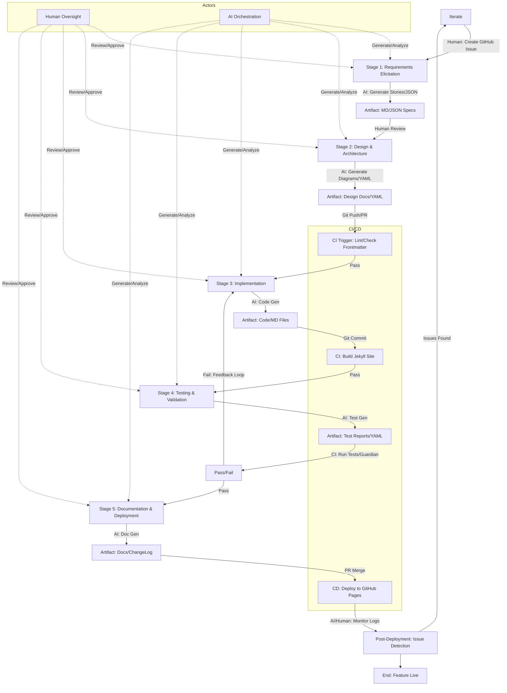
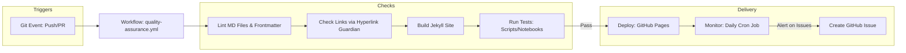

# Enhanced VS Code Copilot Instructions for Feature Building Pipeline with End-to-End CI/CD in it-journey Repo

VS Code Copilot-optimized instructions for feature building pipeline with end-to-end CI/CD integration. These enhanced instructions build upon the previous set, integrating complete end-to-end CI/CD processes tailored to the `github.com/bamr87/it-journey` repository. The repo leverages GitHub Actions for CI/CD, automating quality checks, builds, tests, deployments to GitHub Pages, and monitoring. This ensures educational content (e.g., quests, posts, notebooks) maintains high standards while supporting gamified learning, cross-platform compatibility, and AI-powered development (AIPD) with VS Code Copilot optimization.

## 🤖 VS Code Copilot Integration for Feature Development

### AI-Assisted Feature Development Workflow

**When developing features with VS Code Copilot**:

1. **Feature Planning**: Use AI to generate comprehensive feature specifications:
   ```markdown
   // Prompt: "Generate a feature specification for [feature name] that includes:
   // - Educational objectives and learning outcomes
   // - Technical requirements and dependencies
   // - User stories and acceptance criteria
   // - Integration points with existing IT-Journey features
   // - CI/CD pipeline requirements
   // - Documentation and testing needs"
   ```

2. **Code Generation**: Leverage VS Code Copilot for:
   - Feature implementation following IT-Journey patterns
   - Educational content generation (quests, posts, tutorials)
   - Test case creation and validation
   - Documentation and README updates
   - CI/CD workflow configuration

3. **Quality Assurance**: Use AI to:
   - Generate comprehensive test suites
   - Create documentation and examples
   - Validate code against IT-Journey standards
   - Ensure educational value and accessibility
   - Check CI/CD pipeline configuration

### VS Code Copilot Prompts for Feature Development

**For Feature Implementation**:
```markdown
// Implement [feature name] for IT-Journey that:
// - Follows DFF, DRY, KIS, REnO, MVP, COLAB, AIPD principles
// - Includes comprehensive error handling and logging
// - Provides educational value for learners
// - Integrates with existing Jekyll/GitHub Pages infrastructure
// - Supports cross-platform compatibility
// - Includes proper documentation and examples
```

**For Educational Content Generation**:
```markdown
// Generate educational content for [topic] that:
// - Teaches [specific skill] to [target audience]
// - Includes hands-on examples and exercises
// - Follows IT-Journey quest/post structure
// - Provides clear learning objectives
// - Includes troubleshooting and resources
// - Maintains fantasy theme consistency
```

**For CI/CD Pipeline Development**:
```markdown
// Create GitHub Actions workflow for [feature] that:
// - Validates educational content quality
// - Tests cross-platform compatibility
// - Builds and deploys to GitHub Pages
// - Includes monitoring and alerting
// - Follows IT-Journey CI/CD standards
// - Provides clear success/failure feedback
```

## Feature Development Change Types and Commit Standards

When developing features for IT-Journey, follow these comprehensive change type guidelines that align with Conventional Commits and the project's Git workflow standards:

### Change Type Guidelines for Features

#### 1. New Features (`feat:`)
**Use for**: Adding new educational content, tools, or capabilities to IT-Journey.

**Feature Development Characteristics**:
- Introduces new quests, posts, tools, or platform capabilities
- Enhances learning experience for IT-Journey users
- May include documentation, tests, and CI/CD updates
- Should provide clear educational value

**Branch Naming**: `feature/[component]-[description]`
- Examples: `feature/quest-kubernetes-basics`, `feature/ai-code-review-tool`

**Best Practices for IT-Journey Features**:
- Include learning objectives in commit body
- Document prerequisites and target audience
- Add quest/post frontmatter with complete metadata
- Update navigation and cross-references
- Include screenshots or examples for visual features
- Create comprehensive README updates
- Add CI/CD workflow updates if needed

**Example Feature Commit**:
```bash
feat(quest): add Kubernetes fundamentals quest for intermediate learners

Implements comprehensive K8s learning path with hands-on labs.

Features:
- 8 progressive challenges covering pods, services, deployments
- Multi-platform support (macOS, Windows, Linux)
- Integration with local Minikube and cloud providers
- Troubleshooting guides and resource links

Educational Context:
- Target: Intermediate developers with Docker knowledge
- Estimated time: 6-8 hours
- Prerequisites: Docker basics, command line proficiency

Technical:
- Created pages/_quests/kubernetes-fundamentals/
- Updated _data/navigation/quests.yml
- Added CI validation for K8s YAML files
- Included quest-specific README with setup instructions

Documentation: pages/_quests/kubernetes-fundamentals/README.md
Implements #456
Closes #123
```

#### 2. Bug Fixes (`fix:`)
**Use for**: Fixing broken educational content, site functionality, or build issues.

**Common IT-Journey Bug Scenarios**:
- Broken links in quests or posts
- Jekyll build failures
- Incorrect frontmatter causing rendering issues
- Cross-platform compatibility problems
- CI/CD pipeline failures
- Documentation errors

**Example Bug Fix Commit**:
```bash
fix(quest): resolve broken Docker installation links in macOS section

Fixed 404 errors in Docker Fundamentals quest installation guide.

Changes:
- Updated Docker Desktop download link to current version
- Fixed Homebrew installation command syntax
- Added fallback installation methods
- Tested all links with Hyperlink Guardian

Impact: Affects 3 quests that reference Docker setup
Root cause: Docker website restructure in Q4 2024

Closes #789
```

#### 3. Documentation (`docs:`)
**Use for**: Educational content updates, README improvements, and documentation enhancements.

**IT-Journey Documentation Types**:
- Quest content and instructions
- Blog posts and development chronicles
- README files for directories and features
- API documentation for scripts and tools
- Architectural decision records (ADRs)
- Contributing guides and onboarding materials

**Example Documentation Commit**:
```bash
docs(readme): enhance features directory documentation with CI/CD workflows

Expanded features/README.md with comprehensive CI/CD pipeline documentation.

Changes:
- Added workflow diagrams for build and deployment
- Documented GitHub Actions integration patterns
- Included troubleshooting guide for common CI failures
- Updated cross-references to related instruction files
- Added examples of feature development with automation

Educational value:
- Teaches DevOps practices through practical examples
- Shows how CI/CD supports educational content quality
- Demonstrates GitHub Actions best practices

Related: Updated .github/workflows/quality-assurance.yml
Closes #234
```

#### 4. CI/CD and Configuration (`chore:`)
**Use for**: Pipeline updates, workflow improvements, and development tooling changes.

**IT-Journey CI/CD Scenarios**:
- GitHub Actions workflow updates
- Jekyll build configuration changes
- Docker compose modifications
- Dependency updates (Gemfile, package.json)
- Pre-commit hooks and linting rules
- Monitoring and alerting setup

**Example CI/CD Commit**:
```bash
chore(ci): add automated quest validation workflow

Implements comprehensive validation for quest content quality.

Changes:
- Created .github/workflows/quest-validation.yml
- Validates frontmatter completeness (title, description, etc.)
- Checks for required sections (objectives, prerequisites, tasks)
- Verifies cross-platform compatibility notes
- Tests embedded code examples
- Uploads validation reports as artifacts

Workflow triggers:
- On push to branches with changes in pages/_quests/
- On pull requests modifying quest content
- Scheduled weekly validation of all quests

Benefits:
- Prevents incomplete quests from merging
- Maintains educational content quality standards
- Provides clear feedback to contributors
- Enables automated content auditing

Documentation: docs/dev/quest-validation.md
Implements #567
```

#### 5. Refactoring (`refactor:`)
**Use for**: Improving code organization, content structure, or system architecture without changing functionality.

**IT-Journey Refactoring Examples**:
- Reorganizing quest directory structures
- Extracting reusable Jekyll includes
- Consolidating duplicate documentation
- Simplifying script logic
- Improving file naming conventions

**Example Refactoring Commit**:
```bash
refactor(scripts): consolidate link checking into unified Guardian module

Refactored hyperlink validation scripts for better maintainability.

Motivation:
- Link checking logic was duplicated across 3 scripts
- Makes testing easier with isolated validation functions
- Enables reuse in CI/CD workflows and manual checks
- Improves error reporting and logging

Changes:
- Created scripts/hyperlink-guardian/ module structure
- Extracted validateLinks(), checkAnchors(), reportBroken()
- Updated CI workflow to use new module
- Added comprehensive unit tests
- Consolidated configuration in guardian_config.yml

No behavior change - purely organizational.
All existing link checks produce identical results.

Documentation: scripts/hyperlink-guardian/README.md
```

#### 6. Performance Optimizations (`perf:`)
**Use for**: Improving build times, site loading speed, or content delivery performance.

**IT-Journey Performance Scenarios**:
- Jekyll build optimization
- Image compression and lazy loading
- Asset bundling and minification
- Database query optimization for statistics
- Caching strategies

**Example Performance Commit**:
```bash
perf(jekyll): implement incremental builds for faster development

Reduced Jekyll build time by enabling incremental regeneration.

Implementation:
- Enabled incremental builds in _config_dev.yml
- Configured file watching for selective rebuilds
- Added build cache to .gitignore
- Updated Docker compose for persistent build cache

Performance Impact:
- Full site build: 45s → 8s (82% faster)
- Single post update: 45s → 2s (96% faster)
- Docker container startup: 60s → 15s

Testing:
- Verified with 100+ quest and post modifications
- Tested on macOS, Linux, and Docker environments
- Confirmed no regression in build output

Configuration: _config_dev.yml, docker-compose.yml
Closes #890
```

#### 7. UI/UX Improvements (`ui:` or `feat:`)
**Use for**: Visual enhancements, navigation improvements, and user experience optimizations.

**IT-Journey UI/UX Examples**:
- Quest navigation enhancements
- Responsive design improvements
- Accessibility compliance updates
- Theme and styling refinements
- Interactive component additions

**Example UI Commit**:
```bash
ui: enhance quest navigation with progress indicators

Added visual progress tracking for multi-step quests.

Changes:
- Implemented step counter in quest headers
- Added progress bar showing completion percentage
- Enhanced mobile navigation with swipe gestures
- Improved ARIA labels for screen reader accessibility
- Added visual indicators for completed sections

Accessibility:
- WCAG 2.1 Level AA compliant
- Tested with VoiceOver (macOS) and NVDA (Windows)
- Keyboard navigation fully supported
- Color contrast ratio: 4.5:1 (minimum)

Testing:
- Verified on iOS Safari, Chrome, Firefox, Edge
- Tested responsive breakpoints (320px - 2560px)
- Lighthouse accessibility score: 92 → 100

Related: Updated _includes/quest_navigation.html
Closes #345
```

### Feature Development Commit Message Best Practices

**Structure for IT-Journey Features**:
```
<type>(<scope>): <concise description>

<detailed body explaining educational context>

Educational Context:
- Target audience and skill level
- Learning objectives achieved
- Prerequisites and dependencies

Technical Implementation:
- Key technical changes
- Files created or modified
- Integration points

Testing:
- Validation performed
- Cross-platform testing
- Accessibility checks

Documentation: <path to relevant docs>
Implements #<issue-number>
Closes #<issue-number>
```

**Key Principles**:
1. **Educational First**: Always explain the learning value
2. **Multi-Platform**: Note cross-platform considerations
3. **Comprehensive**: Include context for future maintainers
4. **Traceable**: Link to issues, PRs, and related work
5. **Testable**: Document validation and testing performed

## Conceptual Workflow Overview
At a conceptual level, the workflow orchestrates a collaborative loop between humans (developers, contributors) and AI agents (e.g., VSCode Copilot, GitHub Copilot, or integrated LLMs like GPT-4). It follows a linear yet iterative DevSecOps model, where each stage produces artifacts that feed into the next, with feedback loops for refinement. Humans provide oversight, creative input, and final approvals, while AI accelerates generation, analysis, and automation.

- **Human Role**: Initiate ideas, review AI outputs, resolve ambiguities, and ensure educational alignment (e.g., RPG narratives, binary levels). Humans trigger CI/CD via Git pushes or pull requests (PRs).
- **AI Role**: Parse structured artifacts (e.g., JSON/YAML), generate code/docs/tests, suggest improvements, and integrate with tools like Hyperlink Guardian for monitoring. AI agents can query repos via semantic search or APIs for contextual accessibility.
- **Flow Structure**: Starts with a feature request (e.g., GitHub Issue), progresses through design/implementation/testing, and culminates in deployment/monitoring. CI/CD runs automatically on events (e.g., push to main, PR merge), ensuring traceability via versioned artifacts and logs.
- **Key Principles**: DFF (error handling in pipelines), DRY (reusable workflows), KIS (simple YAML configs), COLAB (PR reviews), AIPD (AI in every stage). Iterations occur via branches, with rollbacks if failures detected.
- **End-to-End CI/CD Integration**: CI focuses on build/test (stages 3-4), CD on deploy/monitor (stage 5). Workflows use GitHub Actions YAML files in `.github/workflows/`, triggered by events. Artifacts are stored in repo (e.g., docs/) or artifacts (e.g., build logs).

This design ensures the pipeline is understandable for humans (narrative docs, visuals) and actionable for AI (parseable formats, hooks for agents).

## Illustrated Flows and Relationships
Below is a Mermaid flowchart depicting the end-to-end workflow, including CI/CD integration. It shows stages, actors (Human/AI), artifacts, and feedback loops.



This diagram illustrates:
- **Linear Progression**: From request to deployment.
- **Feedback Loops**: For iterations on failures.
- **Triggers**: Git events activate CI/CD.
- **Relationships**: Artifacts link stages; actors collaborate at each.

A secondary Mermaid diagram shows the CI/CD workflow in detail:



## Complete End-to-End CI/CD Processes and Instructions
The CI/CD is implemented via GitHub Actions workflows in `.github/workflows/`. Below are detailed processes, including YAML snippets for key workflows. These ensure automated quality, security, and deployment, aligned with repo standards (e.g., frontmatter validation, cross-platform testing).

### CI Process (Continuous Integration)
- **Triggers**: On push to branches, PRs to main.
- **Steps**:
  1. Checkout code.
  2. Set up environment (e.g., Ruby for Jekyll, Python for scripts).
  3. Lint: Check Markdown syntax, frontmatter completeness (e.g., required fields like `title`, `version`).
  4. Build: Run Jekyll build to generate site.
  5. Test: Execute scripts (e.g., Hyperlink Guardian), validate notebooks, check cross-platform compatibility.
- **Instructions**: Add or update `.github/workflows/ci.yml` with:

```yaml
name: CI - Build and Test
on:
  push:
    branches: [main, develop]
  pull_request:
    branches: [main]
jobs:
  build-test:
    runs-on: ubuntu-latest
    steps:
      - uses: actions/checkout@v3
      - name: Set up Ruby
        uses: ruby/setup-ruby@v1
        with: { ruby-version: '3.0' }
      - name: Install dependencies
        run: bundle install
      - name: Lint Frontmatter
        run: scripts/lint_frontmatter.py  # Custom script to validate fields
      - name: Build Jekyll
        run: bundle exec jekyll build
      - name: Run Tests
        run: |
          python scripts/hyperlink_guardian.py --check-all
          pytest tests/  # If unit tests added
```

### Release Management and Versioning for Features

**Semantic Versioning for IT-Journey**:
```
MAJOR.MINOR.PATCH
  ↑      ↑      ↑
  |      |      └─ Bug fixes, docs, chores (fix:, docs:, chore:)
  |      └──────── New features, quests, posts (feat:)
  └─────────────── Breaking changes, major redesigns (BREAKING CHANGE:)
```

**Version Bump Examples for Educational Content**:
| Change Type | Example | Version Bump |
|-------------|---------|---------------|
| New quest added | `feat(quest): add Kubernetes basics` | 1.0.0 → 1.1.0 |
| Bug fix in quest | `fix(quest): correct Docker command` | 1.0.0 → 1.0.1 |
| Major site restructure | `refactor!: reorganize quest hierarchy` | 1.0.0 → 2.0.0 |
| Documentation update | `docs: improve README` | 1.0.0 → 1.0.1 |

**Automated Release Process**:

1. **Commit with Conventional Format**: Ensure all commits follow `<type>(<scope>): <description>` format
2. **CI Validation**: GitHub Actions validates commit messages and runs quality checks
3. **Auto-Changelog**: On merge to main, standard-version or release-please generates CHANGELOG.md
4. **Version Bump**: Tool automatically determines version bump based on commit types
5. **Git Tag**: Creates annotated tag (e.g., v1.2.0) with release notes
6. **GitHub Release**: Publishes release with changelog, artifacts, and documentation
7. **Deployment**: Triggers CD pipeline to deploy to GitHub Pages

**Release Workflow Configuration** (`.github/workflows/release.yml`):
```yaml
name: Release and Deploy

on:
  push:
    branches: [main]

jobs:
  release:
    runs-on: ubuntu-latest
    steps:
      - uses: actions/checkout@v4
        with:
          fetch-depth: 0  # Need full history for changelog
      
      - name: Configure Git
        run: |
          git config user.name "github-actions[bot]"
          git config user.email "github-actions[bot]@users.noreply.github.com"
      
      - name: Generate Release
        run: |
          npm install -g standard-version
          npx standard-version
      
      - name: Push Changes and Tags
        run: |
          git push --follow-tags origin main
      
      - name: Create GitHub Release
        env:
          GITHUB_TOKEN: ${{ secrets.GITHUB_TOKEN }}
        run: |
          gh release create $(git describe --tags --abbrev=0) \
            --title "$(git describe --tags --abbrev=0)" \
            --notes-file CHANGELOG.md
      
      - name: Trigger Deployment
        uses: peter-evans/repository-dispatch@v2
        with:
          event-type: deploy-release
```

**Release Checklist for Feature Developers**:
- [ ] All commits follow Conventional Commits format
- [ ] PR includes documentation updates
- [ ] Tests pass and coverage maintained
- [ ] Educational content reviewed for quality
- [ ] Cross-platform compatibility verified
- [ ] CHANGELOG.md will be auto-generated correctly
- [ ] Breaking changes clearly marked with `BREAKING CHANGE:` footer
- [ ] Migration guides included for breaking changes

### CD Process (Continuous Deployment)
- **Triggers**: On merge to main, on release tag creation, or manual dispatch.
- **Steps**:
  1. Run CI steps (as above) to ensure build passes.
  2. Build: Generate Jekyll site with production configuration.
  3. Deploy: Push built site to `gh-pages` branch.
  4. Notify: Post success/failure to Slack/Discord (optional, via secrets).
  5. Monitor: Trigger post-deployment validation checks.
- **Instructions**: Use `.github/workflows/cd.yml`:

```yaml
name: CD - Deploy to GitHub Pages
on:
  push:
    branches: [main]
jobs:
  deploy:
    runs-on: ubuntu-latest
    steps:
      - uses: actions/checkout@v3
      - name: Build Site
        run: bundle exec jekyll build
      - name: Deploy
        uses: JamesIves/github-pages-deploy-action@v4
        with:
          branch: gh-pages
          folder: _site
```

### Monitoring and Maintenance
- **Triggers**: Scheduled (e.g., daily cron).
- **Steps**:
  1. Run Hyperlink Guardian for link checks.
  2. AI Analysis: Use GPT-4 integration (via API secrets) for content review.
  3. Alert: Create issues on failures.
- **Instructions**: Add `.github/workflows/monitor.yml`:

```yaml
name: Monitoring - Daily Checks
on:
  schedule:
    - cron: '0 0 * * *'  # Daily at midnight
jobs:
  monitor:
    runs-on: ubuntu-latest
    steps:
      - uses: actions/checkout@v3
      - name: Run Guardian
        run: python scripts/hyperlink_guardian.py --report
      - name: AI Content Scan
        run: python scripts/ai_analysis.py --key=${{ secrets.OPENAI_API_KEY }}
      - name: Create Issue on Failure
        if: failure()
        uses: actions/github-script@v6
        with:
          script: |
            github.rest.issues.create({
              owner: context.repo.owner,
              repo: context.repo.repo,
              title: 'Monitoring Failure Detected',
              body: 'Details: ...'
            })
```

### Integration Instructions
- **Setup**: Enable GitHub Pages in repo settings (source: `gh-pages` branch).
- **Secrets**: Add `OPENAI_API_KEY` for AIPD features.
- **Human/AI Usage**: Humans approve PRs; AI suggests workflow tweaks via Copilot.
- **End-to-End Testing**: Manually trigger workflows via GitHub UI for validation.

## Updated Copilot Instructions with CI/CD
The following updates incorporate CI/CD prompts. Use as before, pasting as comments.

### Stage 1: Feature Request & Requirements Elicitation
```
/*
... (previous content) ...
- Integrate CI/CD: Suggest adding issue labels for triggering workflows.
- Ensure specs include CI hooks, e.g., required frontmatter for linting.
*/
```

### Stage 2: Design & Architecture
```
/*
... (previous content) ...
- Design for CI/CD: Include workflow YAML snippets in designs (e.g., for new tests).
- Trade-offs: Consider automation overhead vs. reliability (DFF).
*/
```

### Stage 3: Implementation & Code Generation
```
/*
... (previous content) ...
- Add CI/CD code: Generate Actions YAML if feature adds scripts/tests.
- Ensure code triggers CI (e.g., commit with [ci skip] if draft).
*/
```

### Stage 4: Testing & Validation
```
/*
... (previous content) ...
- Generate CI tests: Create YAML for Actions to run validations.
- Include end-to-end: Test deployment previews in PRs.
*/
```

### Stage 5: Documentation, Deployment & Monitoring
```
/*
... (previous content) ...
- Generate CD manifests: Full YAML for deploy/monitor workflows.
- Add monitoring: Scripts for post-deploy checks, AI alerts.
- Ensure traceability: Update changelog with CI/CD run IDs.
- Follow docs-as-code: All documentation in repository, versioned with code.
- Update README-First, README-Last: Maintain comprehensive documentation.
*/
```

## Documentation Integration for Feature Development

### Docs-as-Code Principles for IT-Journey

**All documentation lives in the repository** - no external silos (Notion, Confluence):

| Doc Type | Location | Tool | Tracked in Git |
|----------|---------|------|----------------|
| **Quest Content** | `pages/_quests/` | Jekyll, Markdown | Yes |
| **Blog Posts** | `pages/_posts/` | Jekyll, Markdown | Yes |
| **Code Comments** | Inline in source | JSDoc, Python docstrings | Yes |
| **README Files** | `*/README.md` | Markdown | Yes |
| **API Docs** | `docs/api/` | OpenAPI, Markdown | Yes |
| **Architecture** | `docs/adr/` | Markdown ADRs | Yes |
| **Changelogs** | `CHANGELOG.md` | Auto-generated | Yes |
| **CI/CD Docs** | `docs/dev/ci-cd/` | Markdown | Yes |

### Documentation Workflow for Features

**README-First, README-Last Integration**:

1. **Before Feature Development**:
   - Read relevant README files to understand context
   - Review existing features and directory structure
   - Identify documentation that will need updates
   - Note naming conventions and patterns

2. **During Feature Development**:
   - Update documentation alongside code changes
   - Create new README files for new directories
   - Add inline comments explaining educational concepts
   - Document design decisions in ADRs if significant

3. **After Feature Completion**:
   - Update all affected README files
   - Create feature-specific README if needed
   - Update cross-references and navigation
   - Add to CHANGELOG.md (or ensure auto-generation captures it)
   - Verify all links work
   - Update `lastmod` dates in frontmatter

**Feature Documentation Checklist**:
```yaml
feature_documentation:
  before_development:
    - [ ] Read directory README for context
    - [ ] Review related feature documentation
    - [ ] Identify affected documentation files
    - [ ] Note cross-references to update
  
  during_development:
    - [ ] Add inline code comments for educational value
    - [ ] Create quest/post content if applicable
    - [ ] Document design decisions (ADR if significant)
    - [ ] Update configuration documentation
  
  after_development:
    - [ ] Update feature README with new capabilities
    - [ ] Update parent directory README
    - [ ] Update navigation files (_data/navigation/)
    - [ ] Add cross-references to related content
    - [ ] Update CHANGELOG.md entry
    - [ ] Verify all links with Hyperlink Guardian
    - [ ] Update lastmod dates in frontmatter
    - [ ] Create migration guide if breaking change
```

### Documentation Quality Gates in CI/CD

**Automated Documentation Validation** (`.github/workflows/docs-check.yml`):
```yaml
name: Documentation Quality Check

on:
  pull_request:
    paths:
      - '**.md'
      - 'pages/_quests/**'
      - 'pages/_posts/**'
      - 'docs/**'

jobs:
  validate-docs:
    runs-on: ubuntu-latest
    steps:
      - uses: actions/checkout@v4
      
      - name: Check Markdown Syntax
        run: |
          npm install -g markdownlint-cli
          markdownlint '**/*.md' --ignore node_modules
      
      - name: Validate Frontmatter
        run: |
          python scripts/validate_frontmatter.py
      
      - name: Check Broken Links
        run: |
          npm install -g markdown-link-check
          find . -name "*.md" -not -path "./node_modules/*" \
            -exec markdown-link-check {} \;
      
      - name: Spell Check
        run: |
          npm install -g cspell
          cspell "**/*.md" --no-progress
      
      - name: Check Documentation Coverage
        run: |
          python scripts/check_doc_coverage.py
      
      - name: Validate Educational Content
        if: contains(github.event.pull_request.changed_files, 'pages/_quests/')
        run: |
          python scripts/validate_quest_content.py
```

**Documentation Ownership** (`.github/CODEOWNERS`):
```
# Documentation ownership for IT-Journey
docs/                        @it-journey/docs-team
*.md                         @it-journey/docs-team
pages/_quests/               @it-journey/education-team @it-journey/docs-team
pages/_posts/                @it-journey/education-team
README.md                    @bamr87 @it-journey/docs-team
.github/instructions/        @bamr87 @it-journey/ai-team
```

### Educational Content Documentation Standards

**Quest Documentation Requirements**:
- Complete frontmatter with learning objectives
- Prerequisites and target audience clearly stated
- Step-by-step instructions with cross-platform notes
- Troubleshooting section
- Resources and further reading
- Quest-specific README in quest directory

**Post Documentation Requirements**:
- Educational context and learning outcomes
- Problem statement and solution approach
- Code examples with explanations
- Reflection and lessons learned
- Cross-references to related quests/posts

**Feature Documentation Requirements**:
- Purpose and educational value
- Installation and setup instructions
- Usage examples and tutorials
- Configuration options
- Troubleshooting guide
- Integration with other IT-Journey features
- API documentation if applicable

This comprehensive setup transforms the pipeline into a robust, automated system, accessible and understandable for both AI and humans, with documentation as a first-class citizen alongside code.

---

**Version:** 3.0.0 | **Last Modified:** 2025-11-16 | **Author:** IT-Journey Team

**Related Files:**
- `copilot-instructions.md`: Core VS Code Copilot principles
- `README.instructions.md`: Documentation standards
- `quest.instructions.md`: Educational content patterns