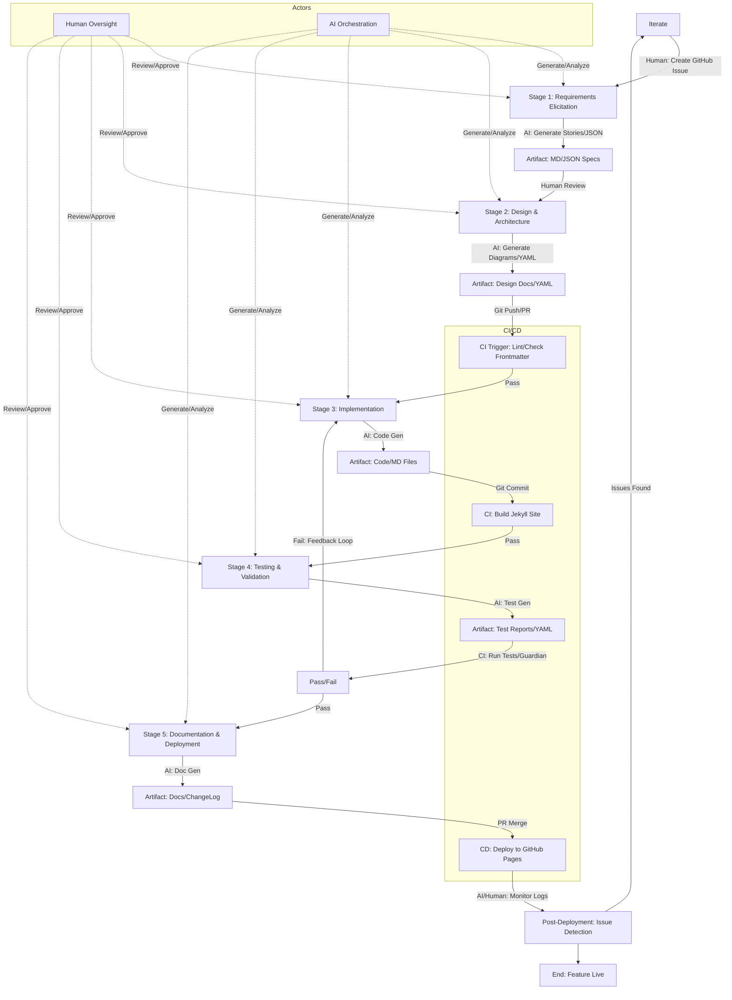
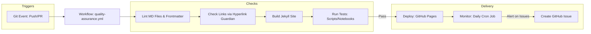

# Enhanced VS Code Copilot Instructions for Feature Building Pipeline with End-to-End CI/CD in it-journey Repo

VS Code Copilot-optimized instructions for feature building pipeline with end-to-end CI/CD integration. These enhanced instructions build upon the previous set, integrating complete end-to-end CI/CD processes tailored to the `github.com/bamr87/it-journey` repository. The repo leverages GitHub Actions for CI/CD, automating quality checks, builds, tests, deployments to GitHub Pages, and monitoring. This ensures educational content (e.g., quests, posts, notebooks) maintains high standards while supporting gamified learning, cross-platform compatibility, and AI-powered development (AIPD) with VS Code Copilot optimization.

## 🤖 VS Code Copilot Integration for Feature Development

### AI-Assisted Feature Development Workflow

**When developing features with VS Code Copilot**:

1. **Feature Planning**: Use AI to generate comprehensive feature specifications:
   ```markdown
   // Prompt: "Generate a feature specification for [feature name] that includes:
   // - Educational objectives and learning outcomes
   // - Technical requirements and dependencies
   // - User stories and acceptance criteria
   // - Integration points with existing IT-Journey features
   // - CI/CD pipeline requirements
   // - Documentation and testing needs"
   ```

2. **Code Generation**: Leverage VS Code Copilot for:
   - Feature implementation following IT-Journey patterns
   - Educational content generation (quests, posts, tutorials)
   - Test case creation and validation
   - Documentation and README updates
   - CI/CD workflow configuration

3. **Quality Assurance**: Use AI to:
   - Generate comprehensive test suites
   - Create documentation and examples
   - Validate code against IT-Journey standards
   - Ensure educational value and accessibility
   - Check CI/CD pipeline configuration

### VS Code Copilot Prompts for Feature Development

**For Feature Implementation**:
```markdown
// Implement [feature name] for IT-Journey that:
// - Follows DFF, DRY, KIS, REnO, MVP, COLAB, AIPD principles
// - Includes comprehensive error handling and logging
// - Provides educational value for learners
// - Integrates with existing Jekyll/GitHub Pages infrastructure
// - Supports cross-platform compatibility
// - Includes proper documentation and examples
```

**For Educational Content Generation**:
```markdown
// Generate educational content for [topic] that:
// - Teaches [specific skill] to [target audience]
// - Includes hands-on examples and exercises
// - Follows IT-Journey quest/post structure
// - Provides clear learning objectives
// - Includes troubleshooting and resources
// - Maintains fantasy theme consistency
```

**For CI/CD Pipeline Development**:
```markdown
// Create GitHub Actions workflow for [feature] that:
// - Validates educational content quality
// - Tests cross-platform compatibility
// - Builds and deploys to GitHub Pages
// - Includes monitoring and alerting
// - Follows IT-Journey CI/CD standards
// - Provides clear success/failure feedback
```

## Conceptual Workflow Overview
At a conceptual level, the workflow orchestrates a collaborative loop between humans (developers, contributors) and AI agents (e.g., VSCode Copilot, GitHub Copilot, or integrated LLMs like GPT-4). It follows a linear yet iterative DevSecOps model, where each stage produces artifacts that feed into the next, with feedback loops for refinement. Humans provide oversight, creative input, and final approvals, while AI accelerates generation, analysis, and automation.

- **Human Role**: Initiate ideas, review AI outputs, resolve ambiguities, and ensure educational alignment (e.g., RPG narratives, binary levels). Humans trigger CI/CD via Git pushes or pull requests (PRs).
- **AI Role**: Parse structured artifacts (e.g., JSON/YAML), generate code/docs/tests, suggest improvements, and integrate with tools like Hyperlink Guardian for monitoring. AI agents can query repos via semantic search or APIs for contextual accessibility.
- **Flow Structure**: Starts with a feature request (e.g., GitHub Issue), progresses through design/implementation/testing, and culminates in deployment/monitoring. CI/CD runs automatically on events (e.g., push to main, PR merge), ensuring traceability via versioned artifacts and logs.
- **Key Principles**: DFF (error handling in pipelines), DRY (reusable workflows), KIS (simple YAML configs), COLAB (PR reviews), AIPD (AI in every stage). Iterations occur via branches, with rollbacks if failures detected.
- **End-to-End CI/CD Integration**: CI focuses on build/test (stages 3-4), CD on deploy/monitor (stage 5). Workflows use GitHub Actions YAML files in `.github/workflows/`, triggered by events. Artifacts are stored in repo (e.g., docs/) or artifacts (e.g., build logs).

This design ensures the pipeline is understandable for humans (narrative docs, visuals) and actionable for AI (parseable formats, hooks for agents).

## Illustrated Flows and Relationships
Below is a Mermaid flowchart depicting the end-to-end workflow, including CI/CD integration. It shows stages, actors (Human/AI), artifacts, and feedback loops.



This diagram illustrates:
- **Linear Progression**: From request to deployment.
- **Feedback Loops**: For iterations on failures.
- **Triggers**: Git events activate CI/CD.
- **Relationships**: Artifacts link stages; actors collaborate at each.

A secondary Mermaid diagram shows the CI/CD workflow in detail:



## Complete End-to-End CI/CD Processes and Instructions
The CI/CD is implemented via GitHub Actions workflows in `.github/workflows/`. Below are detailed processes, including YAML snippets for key workflows. These ensure automated quality, security, and deployment, aligned with repo standards (e.g., frontmatter validation, cross-platform testing).

### CI Process (Continuous Integration)
- **Triggers**: On push to branches, PRs to main.
- **Steps**:
  1. Checkout code.
  2. Set up environment (e.g., Ruby for Jekyll, Python for scripts).
  3. Lint: Check Markdown syntax, frontmatter completeness (e.g., required fields like `title`, `version`).
  4. Build: Run Jekyll build to generate site.
  5. Test: Execute scripts (e.g., Hyperlink Guardian), validate notebooks, check cross-platform compatibility.
- **Instructions**: Add or update `.github/workflows/ci.yml` with:

```yaml
name: CI - Build and Test
on:
  push:
    branches: [main, develop]
  pull_request:
    branches: [main]
jobs:
  build-test:
    runs-on: ubuntu-latest
    steps:
      - uses: actions/checkout@v3
      - name: Set up Ruby
        uses: ruby/setup-ruby@v1
        with: { ruby-version: '3.0' }
      - name: Install dependencies
        run: bundle install
      - name: Lint Frontmatter
        run: scripts/lint_frontmatter.py  # Custom script to validate fields
      - name: Build Jekyll
        run: bundle exec jekyll build
      - name: Run Tests
        run: |
          python scripts/hyperlink_guardian.py --check-all
          pytest tests/  # If unit tests added
```

### CD Process (Continuous Deployment)
- **Triggers**: On merge to main, or manual dispatch.
- **Steps**:
  1. Run CI steps (as above) to ensure build passes.
  2. Deploy: Push built site to `gh-pages` branch.
  3. Notify: Post success/failure to Slack/Discord (optional, via secrets).
- **Instructions**: Use `.github/workflows/cd.yml`:

```yaml
name: CD - Deploy to GitHub Pages
on:
  push:
    branches: [main]
jobs:
  deploy:
    runs-on: ubuntu-latest
    steps:
      - uses: actions/checkout@v3
      - name: Build Site
        run: bundle exec jekyll build
      - name: Deploy
        uses: JamesIves/github-pages-deploy-action@v4
        with:
          branch: gh-pages
          folder: _site
```

### Monitoring and Maintenance
- **Triggers**: Scheduled (e.g., daily cron).
- **Steps**:
  1. Run Hyperlink Guardian for link checks.
  2. AI Analysis: Use GPT-4 integration (via API secrets) for content review.
  3. Alert: Create issues on failures.
- **Instructions**: Add `.github/workflows/monitor.yml`:

```yaml
name: Monitoring - Daily Checks
on:
  schedule:
    - cron: '0 0 * * *'  # Daily at midnight
jobs:
  monitor:
    runs-on: ubuntu-latest
    steps:
      - uses: actions/checkout@v3
      - name: Run Guardian
        run: python scripts/hyperlink_guardian.py --report
      - name: AI Content Scan
        run: python scripts/ai_analysis.py --key=${{ secrets.OPENAI_API_KEY }}
      - name: Create Issue on Failure
        if: failure()
        uses: actions/github-script@v6
        with:
          script: |
            github.rest.issues.create({
              owner: context.repo.owner,
              repo: context.repo.repo,
              title: 'Monitoring Failure Detected',
              body: 'Details: ...'
            })
```

### Integration Instructions
- **Setup**: Enable GitHub Pages in repo settings (source: `gh-pages` branch).
- **Secrets**: Add `OPENAI_API_KEY` for AIPD features.
- **Human/AI Usage**: Humans approve PRs; AI suggests workflow tweaks via Copilot.
- **End-to-End Testing**: Manually trigger workflows via GitHub UI for validation.

## Updated Copilot Instructions with CI/CD
The following updates incorporate CI/CD prompts. Use as before, pasting as comments.

### Stage 1: Feature Request & Requirements Elicitation
```
/*
... (previous content) ...
- Integrate CI/CD: Suggest adding issue labels for triggering workflows.
- Ensure specs include CI hooks, e.g., required frontmatter for linting.
*/
```

### Stage 2: Design & Architecture
```
/*
... (previous content) ...
- Design for CI/CD: Include workflow YAML snippets in designs (e.g., for new tests).
- Trade-offs: Consider automation overhead vs. reliability (DFF).
*/
```

### Stage 3: Implementation & Code Generation
```
/*
... (previous content) ...
- Add CI/CD code: Generate Actions YAML if feature adds scripts/tests.
- Ensure code triggers CI (e.g., commit with [ci skip] if draft).
*/
```

### Stage 4: Testing & Validation
```
/*
... (previous content) ...
- Generate CI tests: Create YAML for Actions to run validations.
- Include end-to-end: Test deployment previews in PRs.
*/
```

### Stage 5: Documentation, Deployment & Monitoring
```
/*
... (previous content) ...
- Generate CD manifests: Full YAML for deploy/monitor workflows.
- Add monitoring: Scripts for post-deploy checks, AI alerts.
- Ensure traceability: Update changelog with CI/CD run IDs.
*/
```

This comprehensive setup transforms the pipeline into a robust, automated system, accessible and understandable for both AI and humans.

---

**Version:** 2.1.0 | **Last Modified:** 2025-10-17 | **Author:** IT-Journey Team

**Related Files:**
- `copilot-instructions.md`: Core VS Code Copilot principles
- `README.instructions.md`: Documentation standards
- `quest.instructions.md`: Educational content patterns