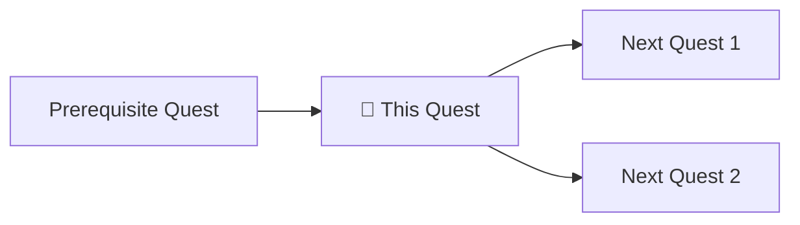

# Quest Creation Instructions

Quests are IT-Journey's gamified, fantasy-themed learning units under `pages/_quests/`. They are validated by `test/quest-validator/quest_validator.py` — **a quest must pass validation before commit**.

## 1. Required Frontmatter

Use the canonical template at `.frontmatter/templates/quests.md`. These fields are **required** (validator errors if missing):

| Field | Rule | Example |
|---|---|---|
| `title` | 10–100 chars | `"Docker Mastery: Container Orchestration"` |
| `description` | 150–300 chars | `"Learn container orchestration with Docker Compose…"` |
| `date` | ISO 8601 with milliseconds | `2025-12-01T04:21:46.000Z` |
| `level` | 4-bit binary | `1100` |
| `difficulty` | exact emoji+label | `🟢 Easy` \| `🟡 Medium` \| `🔴 Hard` \| `⚔️ Epic` |
| `estimated_time` | `X-X hours` or `X-X minutes` | `6-8 hours` |
| `primary_technology` | lowercase | `docker` |
| `quest_type` | enum | `main_quest` \| `side_quest` \| `bonus_quest` \| `epic_quest` |
| `skill_focus` | enum | `frontend` \| `backend` \| `devops` \| `security` \| `data-engineering` \| `fullstack` |
| `learning_style` | enum | `hands-on` \| `conceptual` \| `project-based` |
| `quest_series` | non-empty | `"Container Mastery"` |
| `author` | non-empty | `"IT-Journey Team"` |
| `layout` | must equal | `journals` |
| `keywords` | object | `{primary: [...], secondary: [...]}` |
| `permalink` | pattern | `/quests/level-XXXX-slug/` |
| `fmContentType` | must equal | `quest` |

**Recommended** (warnings if missing): `quest_line`, `quest_arc`, `prerequisites`, `quest_dependencies`, `quest_relationships`, `learning_paths`, `rewards`, `validation_criteria`.

### Frontmatter skeleton

```yaml
---
title: "Quest Title: Action-Oriented Subtitle"
description: "150–300 character description of what the quest teaches."
date: 2025-12-01T04:21:46.000Z
level: 1100
difficulty: "⚔️ Epic"
estimated_time: "6-8 hours"
primary_technology: docker
quest_type: main_quest
skill_focus: devops
learning_style: hands-on
quest_series: "Container Mastery"
author: "IT-Journey Team"
layout: journals
fmContentType: quest
permalink: /quests/level-1100-docker-mastery/
keywords:
  primary: ["docker", "containers", "orchestration"]
  secondary: ["devops", "deployment"]
tags: [lvl-1100, docker, main_quest, devops, hands-on, gamified-learning]
categories: [Quests, DevOps, Containers]
prerequisites:
  knowledge_requirements: ["Basic CLI usage", "Linux fundamentals"]
quest_dependencies:
  required_quests: ["linux-cli-basics"]
  unlocks_quests: ["kubernetes-fundamentals"]
rewards:
  badges: ["🏆 Container Captain"]
  progression_points: 100
---
```

## 2. Binary Level System

Levels are 4-bit binary (`0000`–`1111`) encoding difficulty:

| Range | Tier | Audience |
|---|---|---|
| `0000`–`0011` | 🌱 Apprentice | Foundation skills |
| `0100`–`0111` | ⚔️ Adventurer | Applied skills |
| `1000`–`1011` | 🔥 Warrior | Professional skills |
| `1100`–`1110` | ⚡ Master | Advanced expertise |
| `1111` | 👑 Legend | Leadership / innovation |

Higher levels use 5+ bits (`10000`+) for expert specializations.

## 3. Required Content Structure

The validator checks for these sections. Every quest **must** contain:

1. **`## 🎯 Quest Objectives`** — with `- [ ]` checkboxes for each objective.
2. **At least one fenced code block with a language tag** (` ```bash `, ` ```python `, etc.). No bare ` ``` `.
3. **Multi-platform paths** when the topic is platform-dependent (`### 🍎 macOS`, `### 🪟 Windows`, `### 🐧 Linux`, optional `### ☁️ Cloud`).
4. **Fantasy/RPG framing** in headings and prose — RPG metaphors, emojis (🎯 ⚔️ 🏆 ⚡ 🛠️ 🔮 🧙‍♂️ 🌟 🎮 🌍 📚 🎁).

### Canonical body skeleton

```markdown
*Opening hook in fantasy framing — set the stakes, name the real-world skill.*

## 🎯 Quest Objectives

By the end of this quest you will:

- [ ] **<measurable skill 1>** — what you'll be able to do
- [ ] **<measurable skill 2>**
- [ ] **<measurable skill 3>**

## 🌍 Choose Your Platform

### 🍎 macOS
```bash
# commands
```

### 🪟 Windows
```powershell
# commands
```

### 🐧 Linux
```bash
# commands
```

## 🧙‍♂️ Chapter 1: <Concept>

Explain *why* before *how*. Include code with comments and expected output.

### 🔍 Knowledge Check
- [ ] Can you explain step X?
- [ ] What changes if you swap parameter Y?

## 🎮 Implementation Challenge

**Objective:** <what to build>
**Success Criteria:**
- [ ] <verifiable outcome 1>
- [ ] <verifiable outcome 2>

## 🎁 Rewards

- 🏆 **<Badge Name>** — earned for completing the quest
- ⚡ Skills unlocked: <list>

## 🔮 Next Adventures

- [Follow-up quest 1](../path/to/quest.md)
- [Follow-up quest 2](../path/to/quest.md)

## 📚 Resource Codex

- [Official docs](https://…)
- [Reference cheatsheet](https://…)
```

## 4. Quest Network Diagram (recommended)

Include a Mermaid diagram showing prerequisite + unlock relationships:

````markdown

```mermaid
graph LR
    Pre[Prerequisite Quest] --> Cur[🏰 This Quest]
    Cur --> Next1[Next Quest 1]
    Cur --> Next2[Next Quest 2]
```
````

## 5. Quest Types

- **`main_quest`** 🏰 — Core skill, 60+ min, unlocks new quest lines.
- **`side_quest`** ⚔️ — Focused enhancement, 15–60 min, complements a main quest.
- **`bonus_quest`** 🎁 — Optional exploration of advanced or experimental topics.
- **`epic_quest`** 👑 — Multi-session (4+ h) portfolio project integrating many skills.

## 6. Difficulty Targeting

| Difficulty | Time | Prerequisites | Validation |
|---|---|---|---|
| 🟢 Easy | 15–45 min | Minimal | Basic functionality demo |
| 🟡 Medium | 45–120 min | One related easy quest | Working integration |
| 🔴 Hard | 2–4 h | Multiple foundation quests | Production-quality solution |
| ⚔️ Epic | 4+ h, multi-session | Demonstrated proficiency | Portfolio artifact |

## 7. Fantasy-to-Technical Glossary

Use this mapping consistently for narrative cohesion:

| Technical | Fantasy framing |
|---|---|
| Programming | Binary incantation / algorithm weaving |
| IDE / Editor | Processing crystal / bit forge |
| Debugging | Error-bit hunting / logic correction |
| Deployment | Digital manifestation / binary summoning |
| Git | Chronicle branching / timeline weaving |
| Testing | Truth-table trials / binary verification |
| Database | Information vault / memory archive |
| API | Interface protocol / service gateway |
| Documentation | Digital codex |

Keep technical accuracy intact — fantasy is a wrapper, never a substitute.

## 8. Validation Workflow

Run before every commit:

```bash
# Docker (preferred)
docker-compose run --rm quest-validator \
  python3 /app/test/quest-validator/quest_validator.py -d /app/pages/_quests/

# Single file
docker-compose run --rm quest-validator \
  python3 /app/test/quest-validator/quest_validator.py /app/pages/_quests/1100/docker.md

# Native (no Docker)
python3 test/quest-validator/quest_validator.py -d pages/_quests/
```

### Score thresholds

| Score | Status | Action |
|---|---|---|
| 90–100% | ✅ Excellent | Commit |
| 80–89% | ⚠️ Good | Optional polish |
| 70–79% | ⚠️ Acceptable | Address warnings first |
| < 70% | ❌ Failing | **Must fix before commit** |

## 9. Common Validation Errors

| Error | Fix |
|---|---|
| Missing `fmContentType` | Add `fmContentType: quest` |
| Bad `difficulty` format | Use exact `"⚔️ Epic"` (emoji + label, quoted) |
| Code block without language | Change ` ``` ` to ` ```bash ` (or appropriate) |
| Missing `## 🎯 Quest Objectives` | Add the section with `- [ ]` checkboxes |
| Bad `permalink` | Match `/quests/level-XXXX-slug/` |
| Wrong `layout` | Must be `journals` |

## 10. Integration Requirements

When you add a quest, also:

1. Reference it from the matching level-section in [pages/home.md](../../pages/home.md).
2. Add it to the level directory's `README.md` (e.g. `pages/_quests/1100/README.md`).
3. Update any quest-network diagrams it now participates in.
4. Bump `lastmod` on any quest you modify.

---

**Related:** [`features.instructions.md`](features.instructions.md) · [`posts.instructions.md`](posts.instructions.md) · canonical frontmatter schema in [`../FRONTMATTER.md`](../FRONTMATTER.md).
