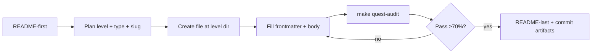
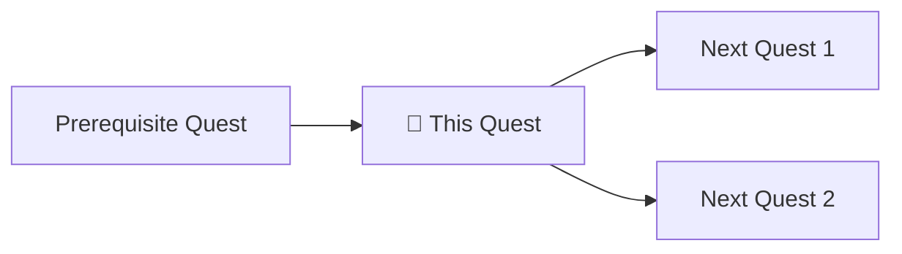

# Quest Creation Instructions

Quests are IT-Journey's gamified, fantasy-themed learning units under `pages/_quests/`. They are validated by `test/quest-validator/quest_validator.py` and `scripts/quest/validate-quest-network.py` — **a quest must pass `make quest-audit` before merge**.

## 0. New Quest Authoring Workflow

Follow this sequence for every new quest so output is consistent and complete:


```mermaid
flowchart LR
  A[README-first] --> B[Plan level + type + slug]
  B --> C[Create file at level dir]
  C --> D[Fill frontmatter + body]
  D --> E["make quest-audit"]
  E --> F{Pass ≥70%?}
  F -->|no| D
  F -->|yes| G[README-last + commit artifacts]
```

| Step | Action | Details |
|---|---|---|
| 1 | **README-first** | Read `pages/_quests/README.md`, level `README.md`, and sibling quests for tone, dependencies, and gaps |
| 2 | **Plan** | Choose binary `level`, `quest_type`, kebab-case slug, difficulty, `estimated_time`, `primary_technology` |
| 3 | **Place file** | `pages/_quests/XXXX/<slug>.md` — flat in level dir, **never** nested `XXXX/slug/slug.md` |
| 4 | **Frontmatter** | All required fields (§1); `fmContentType: quest`; `layout: quest`; `draft: false` for publishable quests |
| 5 | **Permalink** | Must match `quest_type` (§3); dependency URLs use full canonical paths |
| 6 | **Body** | Required sections (§4); no `[placeholder]` brackets in dependencies or prerequisites |
| 7 | **Validate** | `make quest-audit` (rebuilds network, validates content + dependencies) |
| 8 | **README-last** | Bump `lastmod`; level hub auto-lists quests via `layout: quest-collection` — update narrative/README only when needed |
| 9 | **Commit artifacts** | Include regenerated `_data/quests/network.yml` and `assets/data/quest-network.json` when dependencies changed |

**Pre-merge gate:**

```bash
make quest-audit
# or with strict score threshold (matches future CI):
python3 test/quest-validator/quest_validator.py -d pages/_quests/ --fail-threshold 70 --summary
python3 scripts/quest/validate-quest-network.py --strict
```

## 1. Required Frontmatter

Use the canonical template at `.frontmatter/templates/quests.md`. These fields are **required** (validator errors if missing):

| Field | Rule | Example |
|---|---|---|
| `title` | 10–100 chars | `"Docker Mastery: Container Orchestration"` |
| `description` | 150–300 chars | `"Learn container orchestration with Docker Compose…"` |
| `date` | ISO 8601 with milliseconds | `2025-12-01T04:21:46.000Z` |
| `level` | 4-bit binary, **quoted in YAML** | `"1100"` |
| `difficulty` | exact emoji+label | `🟢 Easy` \| `🟡 Medium` \| `🔴 Hard` \| `⚔️ Epic` |
| `estimated_time` | `X-X hours` or `X-X minutes` | `6-8 hours` |
| `primary_technology` | lowercase | `docker` |
| `quest_type` | enum | `main_quest` \| `side_quest` \| `bonus_quest` \| `epic_quest` |
| `skill_focus` | enum | `frontend` \| `backend` \| `devops` \| `security` \| `data-engineering` \| `fullstack` |
| `learning_style` | enum | `hands-on` \| `conceptual` \| `project-based` |
| `quest_series` | non-empty | `"Container Mastery"` |
| `author` | non-empty | `"IT-Journey Team"` |
| `keywords` | object | `{primary: [...], secondary: [...]}` |
| `permalink` | pattern | see §3 — **must match `quest_type`** |
| `fmContentType` | must equal | `quest` |
| `layout` | playable quests | `quest` |
| `draft` | publishable quests | `false` |

**Recommended** (warnings if missing): `quest_line`, `quest_arc`, `prerequisites`, `quest_dependencies`, `quest_relationships`, `learning_paths`, `rewards`, `validation_criteria`, `lastmod`.

Set `rewards.progression_points` to an integer XP value — the quest UI reads this for level hub cards and progress tracking.

### Frontmatter skeleton

```yaml
---
title: "Quest Title: Action-Oriented Subtitle"
description: "150–300 character description of what the quest teaches."
date: 2025-12-01T04:21:46.000Z
lastmod: 2025-12-01T04:21:46.000Z
level: "1100"
difficulty: "⚔️ Epic"
estimated_time: "6-8 hours"
primary_technology: docker
quest_type: main_quest
skill_focus: devops
learning_style: hands-on
quest_series: "Container Mastery"
author: "IT-Journey Team"
fmContentType: quest
layout: quest
draft: false
permalink: /quests/1100/docker-mastery/
keywords:
  primary: ["docker", "containers", "orchestration"]
  secondary: ["devops", "deployment"]
tags: ["1100", docker, main_quest, devops, hands-on, gamified-learning]
categories: [Quests, DevOps, Containers]
prerequisites:
  knowledge_requirements: ["Basic CLI usage", "Linux fundamentals"]
quest_dependencies:
  required_quests:
    - /quests/0000/terminal-fundamentals/
  recommended_quests:
    - /quests/0010/bash-scripting/
  unlocks_quests:
    - /quests/1100/kubernetes-fundamentals/
rewards:
  badges: ["🏆 Container Captain"]
  progression_points: 100
---
```

### Level README frontmatter (not playable quests)

Level hub `README.md` files use different defaults:

| Field | Value |
|---|---|
| `layout` | `quest-collection` |
| `level` | quoted 4-digit binary: `"0001"` — never decimal (`1`, `64`) |
| `permalink` | `/quests/XXXX/` |
| `fmContentType` | omit or use collection-appropriate type — **not** `quest` |

Template: `pages/_quests/templates/level-readme-template.md`

## 2. Binary Level System

Levels are 4-bit binary (`0000`–`1111`) encoding difficulty:

| Range | Tier | Audience |
|---|---|---|
| `0000`–`0011` | 🌱 Apprentice | Foundation skills |
| `0100`–`0111` | ⚔️ Adventurer | Applied skills |
| `1000`–`1011` | 🔥 Warrior | Professional skills |
| `1100`–`1110` | ⚡ Master | Advanced expertise |
| `1111` | 👑 Legend | Leadership / innovation |

Higher levels use 5+ bits (`10000`+) for expert specializations.

## 3. Permalink Convention

Every quest must have a `permalink` that follows the canonical pattern. The type of permalink **must match** the `quest_type` frontmatter field.

### Mapping table

| `quest_type` | Permalink pattern | Example |
|---|---|---|
| `main_quest` | `/quests/XXXX/<slug>/` | `/quests/0001/docker-fundamentals/` |
| `side_quest` | `/quests/XXXX/side-quests/<slug>/` | `/quests/0000/side-quests/bash-run/` |
| `bonus_quest` | `/quests/codex/<slug>/` | `/quests/codex/cheat-sheet-git/` |
| `epic_quest` | `/quests/codex/<slug>/` | `/quests/codex/full-stack-epic/` |
| Level README | `/quests/XXXX/` | `/quests/0001/` |
| Codex example | `/quests/codex/<slug>/` | `/quests/codex/terminal-navigation-mastery/` |

Where `XXXX` is the 4-digit binary level (e.g. `0000`, `0001`, `0100`), and `<slug>` is lowercase kebab-case derived from the filename (without `.md`).

### Full regex (used by the validator)

```
^/quests/([01]{4}/side-quests/[a-z0-9][a-z0-9-]*|[01]{4}/[a-z0-9][a-z0-9-]*|[01]{4}|codex/[a-z0-9][a-z0-9-]*|templates/[a-z0-9][a-z0-9-]*)/$
```

### Filesystem layout

Quest `.md` files live directly inside their level directory:

```
pages/_quests/
  0000/                       # level directory
    README.md                 # permalink: /quests/0000/  layout: quest-collection
    terminal-fundamentals.md  # permalink: /quests/0000/terminal-fundamentals/
    bash-run.md               # side_quest → /quests/0000/side-quests/bash-run/
  codex/
    full-stack-epic.md        # epic_quest → /quests/codex/full-stack-epic/
  0001/
    docker-fundamentals.md    # permalink: /quests/0001/docker-fundamentals/
```

Do **not** create single-file subdirectories like `0000/hello-cloud/hello-cloud.md` — the file belongs directly at `0000/hello-cloud.md`.

Asset files (scripts, images) may remain in subdirectories (e.g. `0000/hello-cloud/install.sh`).

### `redirect_from` policy

Canonical URLs are the source of truth. Add `redirect_from:` entries **only** when migrating a quest's permalink (slug or level change) to preserve external inbound links and any in-flight bookmarks during the transition. **New quests must not ship with `redirect_from`.**

When migrating, prefer [`scripts/quest/migrate-permalinks.py`](../../scripts/quest/migrate-permalinks.py) — it emits `redirect_from` entries automatically. After the migration commit, audit internal references and update them to the new canonical URL; `redirect_from` is a safety net for outside-the-repo callers, not a substitute for fixing internal links.

### Dependency URLs

URLs in `quest_dependencies.required_quests`, `recommended_quests`, and `unlocks_quests` must use **full canonical paths** (leading slash, trailing slash). Never use bare slugs or legacy `gh-600` paths.

Use `# planned quest` suffix for quests that do not exist yet — the network validator skips these:

```yaml
quest_dependencies:
  required_quests:
    - /quests/0000/terminal-fundamentals/
  unlocks_quests:
    - /quests/0010/advanced-networking/ # planned quest
```

## 4. Required Content Structure

The validator checks for these sections. Every quest **must** contain:

1. **`## 🎯 Quest Objectives`** — with `- [ ]` checkboxes for each objective (validator error if missing).
2. **At least one fenced code block with a language tag** (` ```bash `, ` ```python `, etc.). No bare ` ``` `.
3. **Multi-platform paths** when the topic is platform-dependent (`### 🍎 macOS`, `### 🪟 Windows`, `### 🐧 Linux`, optional `### ☁️ Cloud`).
4. **Fantasy/RPG framing** in headings and prose — RPG metaphors, emojis (🎯 ⚔️ 🏆 ⚡ 🛠️ 🔮 🧙‍♂️ 🌟 🎮 🌍 📚 🎁).

### Canonical body skeleton

```markdown
*Opening hook in fantasy framing — set the stakes, name the real-world skill.*

## 🎯 Quest Objectives

By the end of this quest you will:

- [ ] **<measurable skill 1>** — what you'll be able to do
- [ ] **<measurable skill 2>**
- [ ] **<measurable skill 3>**

## 🌍 Choose Your Platform

### 🍎 macOS
```bash
# commands
```

### 🪟 Windows
```powershell
# commands
```

### 🐧 Linux
```bash
# commands
```

## 🧙‍♂️ Chapter 1: <Concept>

Explain *why* before *how*. Include code with comments and expected output.

### 🔍 Knowledge Check
- [ ] Can you explain step X?
- [ ] What changes if you swap parameter Y?

## 🎮 Implementation Challenge

**Objective:** <what to build>
**Success Criteria:**
- [ ] <verifiable outcome 1>
- [ ] <verifiable outcome 2>

## 🎁 Rewards

- 🏆 **<Badge Name>** — earned for completing the quest
- ⚡ Skills unlocked: <list>

## 🔮 Next Adventures

- [Follow-up quest](/quests/0010/next-quest/)
- [Side quest](/quests/0000/side-quests/related/)

## 📚 Resource Codex

- [Official docs](https://…)
- [Reference cheatsheet](https://…)
```

Templates: `pages/_quests/templates/main-quest-template.md` (body reference), `.frontmatter/templates/quests.md` (frontmatter).

## 5. Quest Network Diagram (recommended)

Include a Mermaid diagram showing prerequisite + unlock relationships:

````markdown

```mermaid
graph LR
    Pre[Prerequisite Quest] --> Cur[🏰 This Quest]
    Cur --> Next1[Next Quest 1]
    Cur --> Next2[Next Quest 2]
```
````

## 6. Quest Types

| Type | Icon | Scope | Permalink |
|---|---|---|---|
| `main_quest` | 🎯 | Core storyline for a level | `/quests/XXXX/slug/` |
| `side_quest` | ⚔️ | Focused enhancement, 15–60 min | `/quests/XXXX/side-quests/slug/` |
| `bonus_quest` | 🎁 | Optional advanced exploration | `/quests/codex/slug/` |
| `epic_quest` | 👑 | Multi-session portfolio project | `/quests/codex/slug/` |

## 7. Difficulty Targeting

| Difficulty | Time | Prerequisites | Validation |
|---|---|---|---|
| 🟢 Easy | 15–45 min | Minimal | Basic functionality demo |
| 🟡 Medium | 45–120 min | One related easy quest | Working integration |
| 🔴 Hard | 2–4 h | Multiple foundation quests | Production-quality solution |
| ⚔️ Epic | 4+ h, multi-session | Demonstrated proficiency | Portfolio artifact |

## 8. Fantasy-to-Technical Glossary

Use this mapping consistently for narrative cohesion:

| Technical | Fantasy framing |
|---|---|
| Programming | Binary incantation / algorithm weaving |
| IDE / Editor | Processing crystal / bit forge |
| Debugging | Error-bit hunting / logic correction |
| Deployment | Digital manifestation / binary summoning |
| Git | Chronicle branching / timeline weaving |
| Testing | Truth-table trials / binary verification |
| Database | Information vault / memory archive |
| API | Interface protocol / service gateway |
| Documentation | Digital codex |

Keep technical accuracy intact — fantasy is a wrapper, never a substitute.

## 9. Validation Workflow

Run before every commit:

```bash
# Full audit (recommended — rebuilds network + validates)
make quest-audit

# Individual steps
make quest-build-network   # regenerate network.yml + quest-network.json
make quest-validate        # content validator across pages/_quests/
make quest-network         # strict dependency graph check
make quest-nav             # regenerate _data/navigation/quests.yml

# Single file
python3 test/quest-validator/quest_validator.py pages/_quests/1100/docker.md

# Docker (preferred in containerized dev)
docker-compose run --rm quest-validator \
  python3 /app/test/quest-validator/quest_validator.py -d /app/pages/_quests/
```

### Score thresholds

| Score | Status | Action |
|---|---|---|
| 90–100% | ✅ Excellent | Commit |
| 80–89% | ⚠️ Good | Optional polish |
| 70–79% | ⚠️ Acceptable | Address warnings; meets merge threshold |
| < 70% | ❌ Failing | **Must fix before commit/merge** |

CI will enforce `--fail-threshold 70` and block on validator/network errors.

## 10. Common Validation Errors

| Error | Fix |
|---|---|
| Missing `fmContentType` | Add `fmContentType: quest` |
| Missing `layout` | Add `layout: quest` for playable quest pages |
| Bad `difficulty` format | Use exact `"⚔️ Epic"` (emoji + label, quoted) |
| Code block without language | Change ` ``` ` to ` ```bash ` (or appropriate) |
| Missing `## 🎯 Quest Objectives` | Add the section with `- [ ]` checkboxes |
| Bad `permalink` | Match pattern for `quest_type` (§3); `bonus_quest`/`epic_quest` → `/quests/codex/` |
| `quest_type` / permalink mismatch | `side_quest` requires `/side-quests/` segment |
| Broken dependency URL | Use full path `/quests/XXXX/slug/`; add `# planned quest` if not yet authored |
| `undefined method 'gsub' for Integer` | Quote numeric tags — `- "1100"` not `- 1100` |
| Stale network artifacts | Run `make quest-build-network` and commit updated JSON/YAML |
| Decimal `level` on README | Use quoted binary `"0001"` not `1` or `64` |

## 11. Integration Requirements

When you add a quest, also:

1. Run `make quest-audit` and commit regenerated network artifacts if dependencies changed.
2. Verify the quest appears on its level hub (`/quests/XXXX/`) — level READMEs use `layout: quest-collection`.
3. Use canonical permalinks in all cross-links (body, Mermaid, `quest_dependencies`) — not relative `../slug.md` paths in published content when a permalink exists.
4. For new levels or nav gaps, run `make quest-nav` to refresh `_data/navigation/quests.yml`.
5. Bump `lastmod` on any quest or README you modify.
6. Include a `## 🕸️ Knowledge Graph` footer with `[[wiki links]]` to level hub, dependencies, and related quests — or run `python3 scripts/quest/add-obsidian-wiki-references.py` to generate it from frontmatter.
7. Optionally reference the quest from `pages/_quests/home.md` character-path sections when it fits a learning path.

### New quest checklist (copy before opening PR)

- [ ] File at `pages/_quests/XXXX/<slug>.md` (flat, not nested)
- [ ] `fmContentType: quest`, `layout: quest`, `draft: false`
- [ ] `permalink` matches `quest_type` pattern
- [ ] `level` quoted; numeric tags quoted in YAML lists
- [ ] `quest_dependencies` use full canonical URLs (no placeholders)
- [ ] `rewards.progression_points` set
- [ ] `## 🎯 Quest Objectives` with checkboxes
- [ ] Code blocks have language tags; multi-platform sections if applicable
- [ ] Mermaid network diagram (recommended)
- [ ] `make quest-audit` passes (≥70% score, zero network errors)
- [ ] Network artifacts committed if graph changed
- [ ] `lastmod` updated

---

**Related:** [`features.instructions.md`](features.instructions.md) · [`posts.instructions.md`](posts.instructions.md) · [`../prompts/write-quest.prompt.md`](../prompts/write-quest.prompt.md) · canonical frontmatter schema in [`../FRONTMATTER.md`](../FRONTMATTER.md) · script runbook in [`../../scripts/quest/README.md`](../../scripts/quest/README.md).
