# Quest Creation Instructions for IT-Journey

These instructions provide comprehensive guidance for creating engaging, educational, and accessible quests that transform technical learning into epic adventures. Quests are the cornerstone of the IT-Journey gamified learning experience, designed to make complex technical concepts approachable and enjoyable for learners at all levels.

## Quest Philosophy and Core Principles

### The Adventure Learning Paradigm

Quests transform traditional technical documentation into immersive learning adventures that:
- **Engage Multiple Learning Styles**: Visual, auditory, kinesthetic, and reading/writing learners
- **Provide Clear Progression**: Structured skill development from novice to expert
- **Maintain Motivation**: Achievement systems and narrative engagement keep learners invested
- **Build Practical Skills**: Real-world applications with hands-on implementation
- **Foster Community**: Shared experiences and collaborative problem-solving

### Gamification Psychology Integration

#### Intrinsic Motivation Drivers
- **Autonomy**: Learners choose their path through the quest network
- **Mastery**: Clear skill progression with measurable improvements
- **Purpose**: Each quest connects to larger career and project goals
- **Social Connection**: Community achievements and peer collaboration

#### Flow State Design
- **Clear Goals**: Every quest objective is specific and achievable
- **Immediate Feedback**: Progress validation at each checkpoint
- **Balanced Challenge**: Difficulty scales appropriately with skill level
- **Immersive Experience**: Fantasy theme maintains engagement

### Educational Effectiveness Standards

#### Bloom's Taxonomy Integration
- **Remember**: Recall fundamental concepts and terminology
- **Understand**: Explain principles and relationships
- **Apply**: Use knowledge in practical implementations
- **Analyze**: Break down complex problems into components
- **Evaluate**: Assess solutions and make informed decisions
- **Create**: Build original projects and innovations

#### Multiple Intelligence Support
- **Logical-Mathematical**: Code examples and algorithmic thinking
- **Linguistic**: Clear explanations and documentation
- **Spatial**: Diagrams, flowcharts, and visual aids
- **Kinesthetic**: Hands-on implementations and experiments
- **Interpersonal**: Collaborative elements and community engagement

## Quest Structure and Content Standards

### Required Frontmatter Template

Every quest MUST include this comprehensive frontmatter structure:

```yaml
---
title: "Quest Title: Clear and Action-Oriented Description"
description: "Complete description of what the quest teaches and accomplishes (150-300 characters)"
date: YYYY-MM-DDTHH:MM:SS.000Z
preview: "/images/quest-preview-image.png"
tags:
    - binary-level-indicator  # lvl-0000, lvl-0001, lvl-1010, etc.
    - primary-technology      # python, javascript, docker, etc.
    - quest-type             # tool-mastery, language-learning, project-building
    - skill-focus            # frontend, backend, devops, security
    - learning-style         # hands-on, conceptual, project-based
categories:
    - Quests
    - Technology-Category    # Development, Infrastructure, Security
    - Skill-Category        # Foundation, Intermediate, Advanced, Expert
sub-title: "Level [BINARY] ([DECIMAL]) Quest: Specific Quest Classification"
excerpt: "One-sentence summary of the quest's core learning objective and value proposition"
snippet: "Memorable quest tagline or motto that captures the adventure spirit"
author: "Quest Master [Name]"
layout: journals
keywords:
    primary:
        - main-technology-skill
        - core-learning-objective
    secondary:
        - supporting-technologies
        - related-concepts
        - tool-categories
        - methodology-keywords
lastmod: YYYY-MM-DDTHH:MM:SS.000Z
permalink: /quests/level-[BINARY]-descriptive-slug/
attachments: ""
comments: true
difficulty: "🟢 Easy | 🟡 Medium | 🔴 Hard | ⚔️ Epic"
estimated_time: "XX-XX minutes"
prerequisites:
    - "Specific prior knowledge or completed quests"
    - "Required system setup or tools"
    - "Recommended skill level"
rewards:
    - "🏆 [Specific Achievement Badge Name]"
    - "⚡ [Quantified Skill Enhancement]"
    - "🛠️ [Tool or Technology Mastery]"
    - "🎯 [Project Capability Unlocked]"
quest_series: "Series Name (if part of a progression)"
related_quests:
    - "Link to prerequisite quests"
    - "Link to follow-up quests"
    - "Link to parallel skill quests"
validation_criteria:
    - "Specific, measurable completion requirements"
    - "Portfolio artifacts to be created"
    - "Skills to be demonstrated"
---
```

### Quest Content Architecture

#### 1. Epic Introduction (Fantasy-Themed Opening)
```markdown
*[Opening paragraph that sets the fantasy context using RPG metaphors and adventuring language. This should immediately immerse the learner in the quest narrative while clearly explaining the real-world technical value.]*

*[Brief explanation of what the learner will accomplish, why it matters for their IT journey, and how it connects to their broader career development.]*

### 🌟 The Legend Behind This Quest
*[Background story that explains why this particular skill or technology is important in the modern tech landscape, told through the lens of the fantasy theme.]*
```

#### 2. Quest Objectives and Learning Outcomes
```markdown
## 🎯 Quest Objectives

By the time you complete this epic journey, you will have mastered:

### Primary Objectives (Required for Quest Completion)
- [ ] **[Specific Learning Goal 1]** - Clear, measurable skill acquisition
- [ ] **[Specific Learning Goal 2]** - Practical application or implementation
- [ ] **[Specific Learning Goal 3]** - Integration with existing knowledge

### Secondary Objectives (Bonus Achievements)
- [ ] **[Advanced Skill 1]** - Enhanced capability for experienced adventurers
- [ ] **[Advanced Skill 2]** - Cross-technology integration
- [ ] **[Community Contribution]** - Sharing knowledge or helping others

### Mastery Indicators
You'll know you've truly mastered this quest when you can:
- [ ] Explain the concepts to another person
- [ ] Apply the skills to a new, similar problem
- [ ] Integrate this knowledge with other technical skills
- [ ] Troubleshoot common issues independently
```

#### 3. Multi-Platform Quest Paths
```markdown
## 🌍 Choose Your Adventure Platform

*Different platforms offer unique advantages for this quest. Choose the path that best fits your current setup and learning goals.*

### 🍎 macOS Kingdom Path
```bash
# macOS-specific commands and setup
```
*[Detailed instructions including Homebrew installations, Terminal usage, and macOS-specific tools]*

### 🪟 Windows Empire Path
```powershell
# PowerShell and Windows-specific commands
```
*[Windows-specific instructions including Chocolatey, WSL options, and Windows tools]*

### 🐧 Linux Territory Path
```bash
# Linux distribution-specific commands
```
*[Linux instructions with alternatives for different distributions]*

### ☁️ Cloud Realms Path
*[Cloud platform instructions for AWS, Azure, GCP when applicable]*
*[Container-based approaches using Docker/Podman]*

### 📱 Universal Web Path
*[Browser-based or platform-agnostic approaches when available]*
```

#### 4. Progressive Learning Chapters
```markdown
## 🧙‍♂️ Chapter 1: [Foundational Concept with Fantasy Title]

*[Each chapter should build upon the previous one, introducing new concepts progressively]*

### ⚔️ Skills You'll Forge in This Chapter
- Specific skill or knowledge point
- Practical application
- Connection to broader concepts

### 🏗️ Building Your Knowledge Foundation

[Step-by-step instructions with:]
- Clear explanations of WHY each step matters
- Code examples with comprehensive comments
- Expected outputs and visual confirmations
- Common pitfalls and how to avoid them
- Links to official documentation

```language
# Code examples should be:
# 1. Fully functional and tested
# 2. Well-commented with explanations
# 3. Include expected outputs
# 4. Show error handling where appropriate

# Example command with explanation
command --flag value  # This flag does X because Y
```

### 🔍 Knowledge Check: [Chapter Topic]
- [ ] Can you explain what happened in step X?
- [ ] What would happen if you changed parameter Y?
- [ ] How does this relate to concept Z from a previous quest?

### ⚡ Quick Wins and Checkpoints
*[Small victories that learners can celebrate along the way]*
```

#### 5. Hands-On Implementation Challenges
```markdown
## 🎮 Quest Implementation Challenges

*[These challenges should require learners to apply what they've learned in creative ways]*

### Challenge 1: [Descriptive Name] (🕐 Estimated Time: XX minutes)
**Objective**: [What the learner will build or accomplish]

**Requirements**:
- [ ] Specific technical requirement 1
- [ ] Specific technical requirement 2
- [ ] Specific technical requirement 3

**Success Criteria**:
- [ ] Measurable outcome 1
- [ ] Measurable outcome 2
- [ ] Quality standard to meet

**Bonus Points**:
- [ ] Enhanced feature or optimization
- [ ] Creative variation or personal touch
- [ ] Documentation or explanation

### Challenge 2: [Integration Challenge] (🕐 Estimated Time: XX minutes)
*[More complex challenge that combines multiple skills]*

### 🏆 Master Challenge: [Comprehensive Project] (🕐 Estimated Time: XX minutes)
*[A culminating project that demonstrates mastery of all quest objectives]*

### ✅ Quest Completion Verification
[Comprehensive checklist that proves the learner has achieved mastery]
- [ ] All primary objectives completed
- [ ] Implementation challenges successfully finished
- [ ] Knowledge checks passed
- [ ] Portfolio artifacts created
- [ ] Can explain concepts to others
```

#### 6. Rewards and Progression System
```markdown
## 🎁 Quest Rewards and Achievements

### 🏆 Achievement Badges Earned
- **[Badge Name]** - Specific skill mastery recognition
- **[Badge Name]** - Tool proficiency certification
- **[Badge Name]** - Project completion accomplishment

### ⚡ Skills and Abilities Unlocked
- **[Skill Enhancement]** - Quantified improvement in specific area
- **[New Capability]** - Additional tool or technique mastery
- **[Knowledge Integration]** - Connection to broader skill ecosystem

### 🛠️ Tools Added to Your Arsenal
- [Tool/Technology] - How it enhances your capabilities
- [Technique/Method] - When and why to use it
- [Resource/Reference] - Ongoing learning and improvement

### 📈 Your Journey Progress
*[Show how this quest fits into the larger learning progression]*
- **Previous Skills**: [What this quest built upon]
- **Current Mastery**: [What you've just achieved]
- **Next Adventures**: [Where you can go from here]
```

#### 7. Next Steps and Quest Network
```markdown
## 🔮 Your Next Epic Adventures

### 🎯 Recommended Follow-Up Quests
- **[Quest Name]** - Natural progression building on current skills
- **[Quest Name]** - Alternative specialization path
- **[Quest Name]** - Advanced mastery challenge

### 🌐 Skill Web Connections
*[Show how this quest connects to other areas of learning]*
- **Cross-Technology Skills**: [Related technologies to explore]
- **Career Path Integration**: [How this fits into professional development]
- **Project Application**: [Real-world scenarios where you'll use these skills]

### 🚀 Level-Up Opportunities
*[Suggestions for taking skills to the next level]*
- Advanced courses or certifications
- Open source contribution opportunities
- Community projects or collaborations
- Personal portfolio projects
```

#### 8. Comprehensive Resource Library
```markdown
## 📚 Quest Resource Codex

### 📖 Essential Documentation
- [Official Documentation](https://example.com/docs) - Primary reference guide
- [API Reference](https://example.com/api) - Technical specifications
- [Best Practices Guide](https://example.com/best-practices) - Industry standards

### 🎥 Visual Learning Resources
- [Video Tutorial Series](https://youtube.com/example) - Step-by-step visual guide
- [Interactive Tutorial](https://example.com/interactive) - Hands-on practice
- [Webinar Recording](https://example.com/webinar) - Expert insights

### 💬 Community and Support
- [Stack Overflow Tag](https://stackoverflow.com/questions/tagged/technology) - Q&A community
- [Discord/Slack Community](https://discord.gg/example) - Real-time help
- [Reddit Community](https://reddit.com/r/technology) - Discussions and tips

### 🔧 Tools and Extensions
- [Development Tool](https://example.com/tool) - Essential utility
- [VS Code Extension](https://marketplace.visualstudio.com/example) - IDE enhancement
- [CLI Tool](https://github.com/example/cli) - Command-line productivity

### 📋 Cheat Sheets and References
- [Quick Reference Card](https://example.com/cheatsheet) - Common commands
- [Troubleshooting Guide](https://example.com/troubleshooting) - Common issues
- [Migration Guide](https://example.com/migration) - Upgrading or transitioning

### 🌟 Inspiration and Examples
- [Showcase Projects](https://example.com/showcase) - Real-world implementations
- [Case Studies](https://example.com/case-studies) - Success stories
- [Portfolio Examples](https://example.com/portfolios) - Career development ideas
```

## Quest Classification and Progression System

### Binary-Coded Skill Progression

*Quest levels use binary notation to reinforce fundamental computing concepts while providing a unique, technically-themed progression system that reflects the IT-Journey's core mission.*

#### Foundation Binary Levels (0000-0111) - 3-bit Foundation
- **Level 0000 (0)**: Absolute beginner - Digital literacy and basic computer operation
- **Level 0001 (1)**: Terminal mastery and command-line fundamentals
- **Level 0010 (2)**: File systems, directories, and basic system navigation
- **Level 0011 (3)**: Introduction to programming concepts (variables, functions, logic)
- **Level 0100 (4)**: Version control and Git fundamentals
- **Level 0101 (5)**: Development environment setup (IDEs, package managers, tools)
- **Level 0110 (6)**: Basic web technologies (HTML, CSS, JavaScript basics)
- **Level 0111 (7)**: Foundation capstone and readiness assessment

#### Intermediate Binary Levels (1000-1111) - 4-bit Specialization
- **Level 1000 (8)**: Frontend Development Track - UI/UX fundamentals
- **Level 1001 (9)**: Backend Development Track - Server-side programming
- **Level 1010 (10)**: Database fundamentals and data management
- **Level 1011 (11)**: Basic data structures and algorithms
- **Level 1100 (12)**: API design and integration patterns
- **Level 1101 (13)**: Testing methodologies and quality assurance
- **Level 1110 (14)**: Basic security principles and best practices
- **Level 1111 (15)**: Intermediate capstone projects

#### Advanced Binary Levels (10000-11111) - 5-bit Specialization
- **Level 10000 (16)**: Full-Stack Integration and Architecture
- **Level 10001 (17)**: Data Science and Analytics Track
- **Level 10010 (18)**: DevOps and Infrastructure Automation
- **Level 10011 (19)**: Mobile Development Platforms
- **Level 10100 (20)**: Game Development and Interactive Media
- **Level 10101 (21)**: AI/ML Fundamentals and Implementation
- **Level 10110 (22)**: Cybersecurity and Penetration Testing
- **Level 10111 (23)**: Cloud Computing and Distributed Systems
- **Level 11000 (24)**: Performance Optimization and Scaling
- **Level 11001 (25)**: Advanced Architecture and Design Patterns
- **Level 11010 (26)**: Blockchain and Distributed Ledger Technologies
- **Level 11011 (27)**: IoT and Embedded Systems Development
- **Level 11100 (28)**: Advanced Data Engineering and Big Data
- **Level 11101 (29)**: Leadership and Technical Management
- **Level 11110 (30)**: Innovation and Emerging Technologies
- **Level 11111 (31)**: Advanced specialization capstone projects

#### Expert Binary Levels (100000+) - 6+ bit Mastery
- **Level 100000+ (32+)**: Industry-specific expertise, thought leadership, and specialized domains
- **Level 1000000+ (64+)**: Research and development, cutting-edge innovation
- **Level 10000000+ (128+)**: Master architect and technology evangelist levels

#### Binary Level Significance
*Each binary digit represents a fundamental computing concept:*
- **Bit 0 (LSB)**: Basic digital literacy and tool usage
- **Bit 1**: Programming and development skills
- **Bit 2**: System administration and infrastructure
- **Bit 3**: Architecture and design capabilities
- **Bit 4**: Specialization and advanced domain knowledge
- **Bit 5**: Leadership and innovation abilities
- **Higher Bits**: Research, thought leadership, and industry impact

### Difficulty Classification System

#### 🟢 Easy Quests (15-45 minutes)
- **Target Audience**: Complete beginners or those new to a specific technology
- **Prerequisites**: Minimal prior knowledge required
- **Scope**: Single concept or tool introduction
- **Validation**: Basic functionality demonstration
- **Support Level**: High level of guidance and explanation

#### 🟡 Medium Quests (45-120 minutes)
- **Target Audience**: Learners with foundational knowledge
- **Prerequisites**: Completion of related Easy quests or equivalent experience
- **Scope**: Multiple related concepts or intermediate implementations
- **Validation**: Working project or integration demonstration
- **Support Level**: Moderate guidance with independent problem-solving

#### 🔴 Hard Quests (2-4 hours)
- **Target Audience**: Experienced learners ready for complex challenges
- **Prerequisites**: Multiple foundational quests and demonstrated competency
- **Scope**: Complex integrations or advanced implementations
- **Validation**: Production-ready solutions or comprehensive projects
- **Support Level**: Minimal guidance, emphasis on independent learning

#### ⚔️ Epic Quests (4+ hours, multi-session)
- **Target Audience**: Advanced learners seeking mastery-level challenges
- **Prerequisites**: Extensive prerequisite knowledge and proven skills
- **Scope**: Comprehensive projects or professional-level implementations
- **Validation**: Portfolio-worthy projects or contribution to real systems
- **Support Level**: Peer collaboration and community-driven learning

### Quest Categories and Binary Themes

#### 🏰 Init World Quests (Binary 0000-0111)
- **Digital Awakening**: Basic computer literacy and digital citizenship (Level 0000)
- **Terminal Mastery**: Command-line fundamentals and system navigation (Level 0001-0010)
- **Environment Forging**: Development setup and tool acquisition (Level 0011-0101)
- **Foundation Building**: Core programming concepts and version control (Level 0110-0111)

#### ⚔️ Bit Manipulation Quests (Binary 1000-1111)
- **Data Structure Sorcery**: Arrays, objects, and algorithmic thinking (Level 1000-1001)
- **Logic Gate Mastery**: Boolean operations and conditional programming (Level 1010-1011)
- **Function Crafting**: Modular programming and code organization (Level 1100-1101)
- **Integration Spells**: Testing, debugging, and quality assurance (Level 1110-1111)

#### 🌐 Network Protocol Quests (Binary 10000-10111)
- **Frontend Interface Magic**: UI/UX development and client-side programming (Level 10000-10001)
- **Backend Server Sorcery**: Server-side programming and database integration (Level 10010-10011)
- **API Gateway Mastery**: Service integration and communication protocols (Level 10100-10101)
- **Full-Stack Architecture**: End-to-end application development (Level 10110-10111)

#### 🔒 Security and Systems Quests (Binary 11000-11111)
- **Cryptographic Arts**: Security principles and implementation (Level 11000-11001)
- **Infrastructure Automation**: DevOps, CI/CD, and deployment strategies (Level 11010-11011)
- **Performance Optimization**: Scaling, monitoring, and system tuning (Level 11100-11101)
- **Innovation Laboratory**: Emerging technologies and research (Level 11110-11111)

#### � Specialization Tracks (Binary 100000+)
- **Data Science Algorithms**: Analytics, ML, and AI implementation (Level 100000+)
- **Mobile Platform Mastery**: iOS, Android, and cross-platform development
- **Game Development Engine**: Interactive media and entertainment systems
- **Blockchain and Distributed Systems**: Decentralized applications and protocols
- **IoT and Embedded Systems**: Hardware integration and edge computing
- **Cloud Architecture Mastery**: Distributed systems and cloud-native development

#### 👑 Leadership and Innovation (Binary 1000000+)
- **Technical Leadership**: Team management and architectural decision-making
- **Open Source Contribution**: Community building and project governance
- **Technology Evangelism**: Knowledge sharing and industry influence
- **Research and Development**: Cutting-edge innovation and patent development

## Fantasy Theme Integration and Terminology

### Required RPG Elements and Immersion

#### Core Binary-Fantasy Metaphors
- **Technology as Digital Magic**: Programming languages are "binary incantations" with "algorithmic spells" 
- **Binary Levels as Power**: Quest levels represent "bit mastery" - each binary digit unlocks new abilities
- **Tools as Computing Artifacts**: Development tools are "processing crystals" with computational powers
- **Learning as Digital Ascension**: Educational journeys advance through "binary enlightenment" levels
- **Skills as Computational Abilities**: Technical competencies are "bit-manipulation powers" that compound
- **Projects as Digital Manifestations**: Applications are "compiled realities" brought forth from code

#### Enhanced Binary-Themed Terminology Dictionary

| Technical Term | Binary-Fantasy Equivalent | Usage Example |
|----------------|--------------------------|---------------|
| Quest Level | Binary Enlightenment Level | "Welcome to Level 1010 (10) - Advanced Data Manipulation" |
| Code Editor/IDE | Processing Crystal, Bit Forge, Development Matrix | "Activate your processing crystal (VS Code) to begin binary manipulation" |
| Programming | Binary Incantation, Algorithm Weaving, Logic Crafting | "We'll weave an elegant algorithm using binary logic principles" |
| Debugging | Error Bit Hunting, Logic Correction, Bug Purging | "Time to hunt the corrupted bits and restore logical flow" |
| Deployment | Digital Manifestation, Code Materialization, Binary Summoning | "We'll manifest our creation in the cloud realm using deployment spells" |
| Binary Operations | Bit Manipulation Arts, Digital Alchemy, Logic Gate Mastery | "Master the ancient art of bit manipulation to unlock new powers" |
| Data Structures | Information Architectures, Data Geometries, Memory Patterns | "Arrays are the fundamental geometry for organizing digital information" |
| Algorithms | Logic Sequences, Problem-Solving Rituals, Computational Patterns | "This sorting algorithm follows an ancient computational pattern" |
| Version Control | Chronicle Branching, Timeline Mastery, History Weaving | "Git creates parallel timelines for your code's evolution" |
| Testing | Logic Validation, Binary Verification, Truth Table Trials | "Every algorithm must pass the trials of binary verification" |
| Documentation | Digital Codex, Knowledge Encoding, Wisdom Preservation | "We'll encode our discoveries in the digital codex for future coders" |
| APIs | Interface Protocols, Service Gateways, Communication Channels | "APIs are standardized communication channels between digital realms" |
| Databases | Information Vaults, Data Repositories, Memory Archives | "Databases are secure vaults for organizing vast information treasures" |

#### Binary-Enhanced Narrative Techniques

**Opening Hooks with Binary Themes**
- Set computational context: "In the vast digital matrix where data flows like rivers of light..."
- Create binary urgency: "The system approaches critical failure - only mastery of binary Level [X] can restore balance..."
- Promise digital transformation: "By quest's end, you'll command the fundamental forces of computation itself..."

**Progress Narration with Computing Metaphors**
- Celebrate algorithmic victories: "Success! Your algorithm compiles cleanly - the logic flows like perfectly synchronized clockwork..."
- Acknowledge logical challenges: "Even master programmers encounter complex logic puzzles. Each error illuminates the path to elegant solutions..."
- Build computational anticipation: "With each binary level mastered, you gain deeper insight into the fundamental nature of computation..."

**Achievement Recognition with Binary Progression**
- Level progression: "Congratulations! You've achieved Binary Level [BINARY] ([DECIMAL]) - new computational powers are now yours to command!"
- Skill advancement: "Your bit-manipulation mastery has increased! You can now tackle more complex algorithmic challenges..."
- Community impact: "Your mastery brings honor to the IT-Journey guild and advances our collective computational wisdom!"

### Visual and Atmospheric Elements

#### Required Emoji and Icon Usage
- 🎯 for objectives and goals
- ⚔️ for challenges and difficult tasks
- 🏆 for achievements and completion
- ⚡ for skills and power-ups
- 🛠️ for tools and utilities
- 🔮 for future possibilities and next steps
- 🧙‍♂️ for guidance and wisdom
- 🌟 for important highlights
- 🎮 for interactive elements
- 🌍 for platform choices
- 📚 for resources and documentation
- 🎁 for rewards and benefits

#### Mermaid Diagram Integration
```markdown
# Use Mermaid diagrams for quest visualization:

```mermaid
graph TD
    A[🏰 Quest Start] --> B{🧙‍♂️ Choose Path}
    B -->|🍎 macOS| C[macOS Instructions]
    B -->|🪟 Windows| D[Windows Instructions]
    B -->|🐧 Linux| E[Linux Instructions]
    C --> F[⚔️ First Challenge]
    D --> F
    E --> F
    F --> G{✅ Success?}
    G -->|Yes| H[🎁 Reward Earned]
    G -->|No| I[🔧 Debug & Retry]
    I --> F
    H --> J[🔮 Next Quest]
```


```

## Interactive Elements and Engagement Mechanics

### Progress Tracking Systems

#### Quest Checkpoints
```markdown
### ✅ Quest Checkpoint: [Milestone Name]
**Location**: [Where in the quest this occurs]
**Verification**: [How learners confirm they've reached this point]

Progress Checklist:
- [ ] Primary task completed successfully
- [ ] Expected output achieved and validated
- [ ] System/tool configured correctly
- [ ] Understanding confirmed through explanation or demonstration

**Troubleshooting**: [Common issues and solutions at this checkpoint]
**Next Step Preview**: [Brief hint about what comes next]
```

#### Knowledge Validation Points
```markdown
### 🧠 Knowledge Check: [Topic Area]
Before proceeding to the next chapter, ensure you can:

**Explain**: 
- [ ] Why we performed step X
- [ ] How component Y connects to component Z
- [ ] What would happen if we modified parameter A

**Demonstrate**:
- [ ] Recreate the process without looking at instructions
- [ ] Modify the example to solve a similar problem
- [ ] Troubleshoot a common error scenario

**Apply**:
- [ ] Use this knowledge in a slightly different context
- [ ] Combine with knowledge from previous quests
- [ ] Explain the concept to someone else
```

### Code Examples and Practical Implementation

#### Enhanced Code Block Standards
```markdown
# Every code block should follow this pattern:

## 🔧 Implementation: [Descriptive Title]

**Purpose**: [Why this code exists and what it accomplishes]
**Prerequisites**: [What should be set up or understood before running this]

```language
# Context comment: What this section accomplishes
# Educational comment: Why this approach was chosen

# The actual code with inline explanations
function exampleFunction(parameter) {
    // Step-by-step explanation of logic
    const result = parameter * 2;  // Why we multiply by 2
    return result;  // What we're returning and why
}

// Expected usage example
const output = exampleFunction(5);
console.log(output);  // Expected output: 10
```

**Expected Output**:
```
10
```

**Common Variations**:
- [Alternative approaches and when to use them]
- [How to modify for different use cases]

**Troubleshooting**:
- [Common errors and their solutions]
- [How to verify the code is working correctly]
```

#### Interactive Experimentation Prompts
```markdown
### 🧪 Experimentation Station: [Topic]

Now that you understand the basics, try these modifications:

**Experiment 1**: [Specific change to make]
- Change [parameter] from [value] to [value]
- Predict what will happen: ________________
- Run the code and observe: ________________
- Explanation: [Why this result occurred]

**Experiment 2**: [More complex modification]
- Modify the code to [specific goal]
- What challenges did you encounter?
- How did you solve them?
- What did you learn from this process?

**Creative Challenge**: [Open-ended exploration]
- Use this concept to solve [different problem]
- Share your solution with the community
- Explain your thought process
```

## Quest Integration and Ecosystem Management

### Navigation and Cross-Reference System

#### Quest Network Connections
```markdown
### 🗺️ Quest Network Position

**Quest Series**: [Name of quest series if part of one]
**Prerequisite Quests**:
- [Level XXX: Quest Name] - Required knowledge/skills
- [Level XXX: Quest Name] - Recommended background

**Parallel Quests** (can be completed in any order):
- [Level XXX: Quest Name] - Related but independent skills
- [Level XXX: Quest Name] - Alternative approaches to similar goals

**Follow-Up Quests**:
- [Level XXX: Quest Name] - Natural next step
- [Level XXX: Quest Name] - Advanced applications
- [Level XXX: Quest Name] - Related specialization

**Cross-Skill Connections**:
- [Technology/Skill Area]: How this quest connects to other domains
- [Career Path]: Professional applications and development opportunities
```

#### Home.md Integration Requirements
Every quest MUST be properly referenced in the appropriate sections of `pages/home.md`:
- Add quest to level-appropriate section
- Update progress tracking counters
- Include difficulty indicator and time estimate
- Ensure proper category classification

#### README.md Quest Index
Maintain the comprehensive quest index with:
- Alphabetical listing by technology
- Level-based organization
- Difficulty and time filtering
- Completion tracking capabilities

### Skill Progression Path Management

#### Prerequisites Validation
```markdown
### 📋 Quest Prerequisites Checklist

**Knowledge Requirements**:
- [ ] Understanding of [fundamental concept]
- [ ] Familiarity with [basic tool/technology]
- [ ] Completion of [specific prerequisite quest]

**System Requirements**:
- [ ] [Operating System] with [specific version]
- [ ] [Software/Tool] installed and configured
- [ ] [Hardware/Resource] requirements met

**Skill Level Indicators**:
- [ ] Can [demonstrate basic competency]
- [ ] Comfortable with [intermediate concept]
- [ ] Has experience with [related technology]

**Self-Assessment Questions**:
1. Can you explain [key concept] in your own words?
2. Have you successfully [performed related task]?
3. Do you feel confident [working with related tools]?

*If you answered "no" to any prerequisites, consider completing these preparatory quests first: [links to prerequisite quests]*
```

#### Achievement and Portfolio Integration
```markdown
### 🏆 Portfolio Integration Guide

**Artifacts to Create**:
- [ ] [Specific deliverable] - Add to portfolio section [X]
- [ ] [Documentation/Explanation] - Include in knowledge base
- [ ] [Code Repository] - Push to personal GitHub with proper documentation

**Professional Development Value**:
- **Resume Skills**: [Specific skills to add to resume]
- **Interview Talking Points**: [Key concepts to discuss with employers]
- **Portfolio Showcases**: [How to present this work professionally]

**Community Contributions**:
- [ ] Share learning journey in [specific forum/community]
- [ ] Help other questers with similar challenges
- [ ] Contribute improvements to quest documentation

**Certification Pathways**:
- [Relevant industry certification] - This quest contributes to [specific areas]
- [Professional development program] - Skills gained apply to [requirements]
```

## Quality Assurance and Validation Standards

### Technical Accuracy Requirements

#### Code Testing and Validation
- [ ] All code examples are functional and tested on target platforms
- [ ] Commands work across specified operating systems (macOS, Windows, Linux)
- [ ] External links are current, accessible, and relevant
- [ ] Version-specific instructions are clearly marked with update dates
- [ ] Error handling examples include realistic scenarios and solutions

#### Content Accuracy Standards
- [ ] Technical explanations are factually correct and current
- [ ] Best practices align with industry standards
- [ ] Security considerations are appropriately addressed
- [ ] Performance implications are noted where relevant
- [ ] Accessibility requirements are met throughout

### Educational Effectiveness Validation

#### Learning Objective Alignment
- [ ] Objectives are specific, measurable, and achievable
- [ ] Content progression follows logical learning sequences
- [ ] Real-world applications are clearly demonstrated
- [ ] Multiple learning styles are accommodated throughout
- [ ] Assessment methods match stated learning objectives

#### Cognitive Load Management
- [ ] Information is chunked into digestible segments
- [ ] Complex concepts are introduced progressively
- [ ] Visual aids support text-based explanations
- [ ] Practice opportunities are distributed throughout
- [ ] Cognitive breaks and checkpoints are strategically placed

### Accessibility and Inclusivity Standards

#### Universal Design Principles
- [ ] Language is welcoming and inclusive to all learners
- [ ] Multiple platform options accommodate different setups
- [ ] Prerequisites are clearly stated and justified
- [ ] Alternative approaches are provided where possible
- [ ] Cultural and contextual sensitivity is maintained

#### Barrier Reduction Strategies
- [ ] Technical jargon is explained when first introduced
- [ ] Step-by-step instructions are granular enough for beginners
- [ ] Visual elements include descriptive alt text
- [ ] Code examples include comprehensive comments
- [ ] Troubleshooting guidance covers common scenarios

### Gamification Element Validation

#### Engagement Mechanics Assessment
- [ ] Fantasy theme is consistently applied throughout
- [ ] Achievement system provides meaningful recognition
- [ ] Progress tracking is clear and motivating
- [ ] Difficulty progression feels appropriately challenging
- [ ] Rewards are proportional to effort invested

#### Motivation and Flow State
- [ ] Clear goals are established for each section
- [ ] Immediate feedback is provided for learner actions
- [ ] Challenge level matches learner capability development
- [ ] Autonomy is preserved through choice and exploration
- [ ] Social elements encourage community engagement

## Quest Creation Workflow and Development Process

### Planning Phase: Foundation Setting

#### 1. Learning Gap Identification
**Process**:
- Analyze learner feedback and community requests
- Review industry skill requirements and trends
- Identify missing connections in existing quest network
- Evaluate prerequisite and follow-up quest availability

**Documentation**:
- Create learning gap analysis document
- Define target audience and skill level
- Establish success metrics and validation criteria
- Map connections to existing quest ecosystem

#### 2. Objective Definition and Scope
**Learning Outcome Specifications**:
- Write specific, measurable learning objectives using action verbs
- Define knowledge, skills, and attitudes to be developed
- Establish assessment criteria and validation methods
- Set realistic time estimates and complexity levels

**Scope Boundary Setting**:
- Determine what will and will not be covered
- Identify dependencies and prerequisite knowledge
- Plan for different learner paths and abilities
- Consider maintenance and update requirements

#### 3. Quest Architecture Design
**Structure Planning**:
- Design chapter flow and information progression
- Plan checkpoint locations and validation points
- Map code examples and practical exercises
- Design reward system and achievement integration

**Platform Strategy**:
- Determine which platforms to support (macOS, Windows, Linux, Cloud)
- Plan platform-specific adaptations and alternatives
- Consider container-based universal approaches
- Design fallback options for different environments

### Development Phase: Content Creation

#### 1. Fantasy Theme Implementation
**Narrative Development**:
- Create engaging opening that sets adventure context
- Develop consistent character voice and perspective
- Write chapter introductions that build excitement
- Design reward narratives that celebrate achievement

**Terminology Consistency**:
- Apply fantasy metaphor dictionary consistently
- Create technology-specific magical concepts
- Develop quest-unique terminology where appropriate
- Maintain immersion while preserving technical accuracy

#### 2. Educational Content Creation
**Progressive Disclosure Design**:
- Introduce concepts in logical, buildable sequence
- Create smooth transitions between difficulty levels
- Design practice opportunities that reinforce learning
- Develop alternative explanations for complex concepts

**Multi-Modal Content Development**:
- Write clear, accessible explanations for all concepts
- Create or source relevant visual aids and diagrams
- Design hands-on exercises and experimentation opportunities
- Develop assessments that match learning objectives

#### 3. Technical Implementation and Testing
**Code Development Standards**:
- Write fully functional, tested code examples
- Create comprehensive comments and explanations
- Test across all supported platforms and versions
- Develop troubleshooting guides for common issues

**Integration Development**:
- Link to prerequisite and follow-up quests appropriately
- Update quest network documentation and references
- Create portfolio integration guidelines
- Develop community engagement elements

### Testing and Validation Phase

#### 1. Technical Validation Process
**Functionality Testing**:
- Test all code examples on specified platforms
- Verify external links and resource accessibility
- Validate installation and setup instructions
- Confirm troubleshooting guidance effectiveness

**Accessibility Testing**:
- Review content for inclusive language and imagery
- Test with screen readers and accessibility tools
- Validate color contrast and visual design elements
- Ensure keyboard navigation functionality

#### 2. Educational Effectiveness Testing
**Learning Objective Assessment**:
- Conduct learner testing with target audience
- Measure time to completion against estimates
- Assess comprehension through knowledge checks
- Evaluate skill transfer to new contexts

**Engagement and Motivation Testing**:
- Monitor learner engagement throughout quest
- Assess fantasy theme effectiveness and consistency
- Evaluate reward system impact on motivation
- Gather feedback on gamification elements

#### 3. Integration and Ecosystem Testing
**Quest Network Validation**:
- Test prerequisite and follow-up quest connections
- Validate skill progression and difficulty scaling
- Assess integration with existing quest ecosystem
- Verify portfolio and achievement system functionality

### Publication and Maintenance Phase

#### 1. Launch Preparation
**Documentation Updates**:
- Update home.md with new quest information
- Increment progress tracking counters and statistics
- Add quest to README.md index and navigation
- Create launch announcement and community notification

**Quality Assurance Final Check**:
- Complete comprehensive review checklist
- Verify all links and references are functional
- Confirm frontmatter and metadata accuracy
- Validate accessibility and inclusivity standards

#### 2. Community Integration
**Launch Activities**:
- Announce quest availability to community
- Share learning objectives and target audience
- Encourage early adopter feedback and testing
- Monitor initial completion rates and engagement

**Feedback Integration Process**:
- Establish feedback collection mechanisms
- Create improvement prioritization criteria
- Plan regular review and update cycles
- Maintain version control and change documentation

#### 3. Continuous Improvement
**Performance Monitoring**:
- Track completion rates and learner satisfaction
- Monitor time estimates versus actual completion times
- Assess skill transfer effectiveness
- Evaluate community engagement and contribution

**Evolution and Enhancement**:
- Regular content reviews for accuracy and relevance
- Technology and tool updates as needed
- Expansion of platform support based on demand
- Integration of new learning techniques and technologies

## Quest Template Examples and Specializations

### Binary Tool Mastery Quest Template
*Focus on comprehensive mastery of specific development tools using binary-level progression*

```markdown
---
title: "Forging the [Tool Name] Processing Crystal: Binary Level [XXXX] ([XX]) Mastery Quest"
description: "Master the computational powers of [Tool] and unlock advanced bit-manipulation capabilities for your development matrix"
difficulty: "🟡 Medium"
estimated_time: "90-120 minutes"
categories:
    - Quests
    - Tool-Mastery
    - Development-Environment
tags:
    - binary-level-indicator  # lvl-0101, lvl-1001, etc.
    - tool-mastery
    - [specific-tool]
    - development-setup
    - computational-efficiency
sub-title: "Level [BINARY] ([DECIMAL]) Quest: Tool Mastery and Environmental Configuration"
---

*In the vast digital matrix, there exists a legendary processing crystal known as [Tool Name]. Those who achieve binary mastery of its computational powers become elite developers, capable of manipulating code with algorithmic precision and computational elegance...*

## 🎯 Binary Mastery Objectives
- [ ] **Crystal Acquisition**: Install and configure [Tool] for optimal computational performance
- [ ] **Basic Operations**: Master fundamental bit-manipulation features and workflows
- [ ] **Advanced Algorithms**: Leverage sophisticated computational capabilities and customizations
- [ ] **Matrix Integration**: Seamlessly integrate with your existing development ecosystem

## 🧙‍♂️ Chapter 1: Processing Crystal Discovery and Activation
*[Installation and basic setup across all computational platforms]*

## 🧙‍♂️ Chapter 2: Fundamental Bit Operations  
*[Core features and basic algorithmic patterns]*

## 🧙‍♂️ Chapter 3: Advanced Computational Arts
*[Advanced features, customization, and optimization algorithms]*

## 🎮 Binary Mastery Challenges
### Challenge 1: Efficiency Algorithm Demonstration
Create a [specific project type] using [Tool] and demonstrate:
- [ ] Workflow optimization through computational efficiency
- [ ] Utilization of at least 5 advanced algorithmic features
- [ ] Custom configuration that enhances processing throughput

### Challenge 2: Matrix Integration Mastery
Integrate [Tool] with your computational development ecosystem:
- [ ] Version control system synchronization
- [ ] Build pipeline and deployment automation
- [ ] Third-party processing module integration
```
- [ ] **Productivity Spells**: Integrate with other tools and automate workflows

## 🧙‍♂️ Chapter 1: Artifact Discovery and Acquisition
*[Installation and basic setup across all platforms]*

## 🧙‍♂️ Chapter 2: Fundamental Enchantments
*[Core features and basic usage patterns]*

## 🧙‍♂️ Chapter 3: Advanced Arcane Arts
*[Advanced features, customization, and optimization]*

## 🎮 Mastery Challenges
### Challenge 1: Efficiency Demonstration
Create a [specific project type] using [Tool] and demonstrate:
- [ ] Workflow efficiency improvements over basic tools
- [ ] Use of at least 5 advanced features
- [ ] Custom configuration that enhances productivity

### Challenge 2: Integration Mastery
Integrate [Tool] with your existing development ecosystem:
- [ ] Version control system integration
- [ ] Build tool and deployment pipeline connection
- [ ] Third-party plugin or extension integration
```

### Binary Language Learning Quest Template
*Progressive introduction to programming languages with computational thinking*

```markdown
---
title: "Binary Incantations of [Language]: Level [XXXX] ([XX]) Computational Mastery"
description: "Master the algorithmic language of [Programming Language] and unlock computational powers for digital creation"
difficulty: "🟢 Easy to 🟡 Medium"
estimated_time: "180-240 minutes"
quest_series: "[Language] Binary Mastery Path"
categories:
    - Quests
    - Language-Learning
    - Programming-Fundamentals
tags:
    - binary-level-indicator  # lvl-0011, lvl-0100, etc.
    - programming-language
    - [specific-language]
    - computational-thinking
    - algorithmic-logic
sub-title: "Level [BINARY] ([DECIMAL]) Quest: Programming Language and Logic Mastery"
---

*In the depths of the computational matrix, the binary sages encoded the algorithmic language of [Language]. This powerful computational tongue enables developers to translate human logic into machine-executable instructions, bridging the gap between human creativity and digital processing power...*

## 🎯 Binary Language Mastery Objectives
- [ ] **Syntax Architecture**: Master fundamental syntax patterns and logical structures
- [ ] **Algorithm Composition**: Write functions, loops, and conditional logic constructs
- [ ] **Data Structure Manipulation**: Work with variables, arrays, objects, and complex data types
- [ ] **Computational Application**: Build algorithmic solutions to real-world problems

## 🧙‍♂️ Chapter 1: Fundamental Binary Logic
*[Basic syntax, variables, data types, and simple computational operations]*

## 🧙‍♂️ Chapter 2: Algorithm Architecture (Functions and Control Flow)
*[Functions, conditionals, loops, and fundamental algorithmic patterns]*

## 🧙‍♂️ Chapter 3: Advanced Data Manipulation
*[Complex data structures, object-oriented patterns, or language-specific features]*

## 🎮 Computational Logic Challenges
### Project: [Binary-Appropriate Implementation Project]
Build a [specific computational application] that demonstrates:
- [ ] Proper implementation of language syntax and computational conventions
- [ ] Application of core algorithmic and logical programming concepts
- [ ] Solution to a real-world computational problem
- [ ] Clean code architecture with comprehensive documentation
```

### Platform Specialization Quest Template
*Deep dive into specific platforms, operating systems, or cloud environments*

```markdown
---
title: "Mastering the [Platform] Realm: Advanced Territory Exploration"
description: "Become a native of the [Platform] realm and unlock its unique powers and capabilities"
difficulty: "🔴 Hard"
estimated_time: "240-360 minutes"
categories:
    - Quests
    - Platform-Specialization
    - Advanced-Development
---

*The [Platform] Realm is a vast territory with its own customs, tools, and magical practices. Those who become true natives of this realm can harness its unique powers to build applications that would be impossible elsewhere...*

## 🎯 Realm Mastery Objectives
- [ ] **Territory Navigation**: Understand platform architecture and conventions
- [ ] **Native Tool Mastery**: Master platform-specific development tools
- [ ] **Cultural Integration**: Apply platform best practices and patterns
- [ ] **Realm-Specific Magic**: Leverage unique platform capabilities

## 🧙‍♂️ Chapter 1: Realm Geography and Culture
*[Platform architecture, philosophy, and development culture]*

## 🧙‍♂️ Chapter 2: Native Tool Mastery
*[Platform-specific tools, IDEs, build systems, and workflows]*

## 🧙‍♂️ Chapter 3: Advanced Realm Magic
*[Advanced features, performance optimization, platform-specific patterns]*

## 🎮 Realm Integration Challenges
### Challenge: Native Application Creation
Build a [platform-appropriate application] that:
- [ ] Uses platform-specific features and capabilities
- [ ] Follows platform design and development guidelines
- [ ] Demonstrates performance optimization techniques
- [ ] Integrates with platform ecosystem and services
```

### Project Building Quest Template
*End-to-end development projects that integrate multiple technologies*

```markdown
---
title: "The [Project Type] Fortress: Epic Construction Quest"
description: "Build a complete [application type] from foundation to deployment, integrating multiple technologies and best practices"
difficulty: "⚔️ Epic"
estimated_time: "480+ minutes (multi-session)"
categories:
    - Quests
    - Project-Building
    - Full-Stack-Development
---

*The greatest developers are not just code warriors, but master architects who can envision and construct entire digital fortresses. In this epic quest, you'll plan, build, and deploy a complete [application type]...*

## 🎯 Construction Objectives
- [ ] **Architectural Planning**: Design system architecture and component relationships
- [ ] **Foundation Building**: Implement core infrastructure and data layers
- [ ] **Feature Construction**: Build user-facing features and functionality
- [ ] **Fortress Fortification**: Implement security, testing, and monitoring
- [ ] **Realm Deployment**: Deploy to production environment with CI/CD

## 🧙‍♂️ Phase 1: Architectural Vision and Planning
*[Requirements analysis, system design, technology selection]*

## 🧙‍♂️ Phase 2: Foundation Construction
*[Database design, API structure, authentication setup]*

## 🧙‍♂️ Phase 3: Feature Implementation
*[Core functionality development, UI/UX implementation]*

## 🧙‍♂️ Phase 4: Fortification and Quality Assurance
*[Testing, security, performance optimization]*

## 🧙‍♂️ Phase 5: Deployment and Monitoring
*[CI/CD pipeline, production deployment, monitoring setup]*

## 🎮 Epic Achievement Validation
### Master Builder Demonstration
Your completed fortress must demonstrate:
- [ ] Professional-quality architecture and code organization
- [ ] Full test coverage and documentation
- [ ] Production deployment with monitoring
- [ ] Portfolio-worthy presentation and demonstration
```

### Career Advancement Quest Template
*Professional skill development including certifications and soft skills*

```markdown
---
title: "Path to [Career Goal]: Professional Development Quest"
description: "Advance your career in [specific area] through strategic skill development, portfolio building, and professional networking"
difficulty: "🟡 Medium to 🔴 Hard"
estimated_time: "Variable (ongoing professional development)"
categories:
    - Quests
    - Career-Advancement
    - Professional-Development
---

*The journey from apprentice developer to [target role] requires more than technical skills alone. True career advancement comes from combining technical mastery with professional skills, industry knowledge, and strategic positioning...*

## 🎯 Career Advancement Objectives
- [ ] **Skill Gap Analysis**: Identify and close professional skill gaps
- [ ] **Portfolio Development**: Create compelling demonstration of capabilities
- [ ] **Industry Integration**: Build professional network and industry knowledge
- [ ] **Certification Achievement**: Earn relevant professional certifications
- [ ] **Leadership Development**: Develop mentoring and team collaboration skills

## 🧙‍♂️ Chapter 1: Professional Landscape Analysis
*[Industry research, role requirements, skill gap analysis]*

## 🧙‍♂️ Chapter 2: Strategic Skill Development
*[Targeted learning plan, certification preparation]*

## 🧙‍♂️ Chapter 3: Portfolio and Personal Brand Building
*[Portfolio projects, professional presentation, online presence]*

## 🧙‍♂️ Chapter 4: Network and Community Integration
*[Professional networking, community contribution, mentoring]*

## 🎮 Career Milestone Achievements
### Professional Readiness Demonstration
Demonstrate career advancement through:
- [ ] Completed professional portfolio showcasing key skills
- [ ] Active participation in professional community
- [ ] Mentoring or knowledge sharing with other developers
- [ ] Industry certification or equivalent demonstration of expertise
```

---

*These binary-enhanced quest creation instructions ensure that all learning content maintains the IT-Journey's high standards for education, engagement, accessibility, and community building while integrating fundamental computing concepts through our binary level progression system. The fusion of fantasy adventure themes with binary computational metaphors creates a unique learning experience that makes technical education both enjoyable and conceptually reinforcing. By following these comprehensive guidelines, quest creators can build learning experiences that truly transform technical education into epic adventures of computational growth and binary mastery, where each level progression deepens understanding of fundamental computing principles while maintaining the magical adventure spirit that makes learning memorable and effective.*

## Binary Quest System Benefits

### Educational Advantages
- **Conceptual Reinforcement**: Binary level numbering reinforces fundamental computing concepts
- **Technical Authenticity**: Level system aligns with IT profession's binary foundation
- **Progressive Complexity**: Binary progression naturally reflects computational skill development
- **Memory Aid**: Binary levels help learners practice and internalize number system conversions

### Motivational Elements
- **Unique Identity**: Binary levels create distinctive IT-Journey branding
- **Achievement Clarity**: Clear progression from 0000 to advanced binary levels
- **Skill Mapping**: Each bit position represents different computational competency areas
- **Professional Relevance**: Direct connection to real-world computing fundamentals

### Implementation Features
- **Scalable System**: Binary levels can extend infinitely as technology evolves
- **Cross-Reference Capability**: Easy mapping between binary and decimal for accessibility
- **Visual Recognition**: Binary patterns create memorable visual quest identifiers
- **Community Building**: Shared binary level system creates common language for learners
