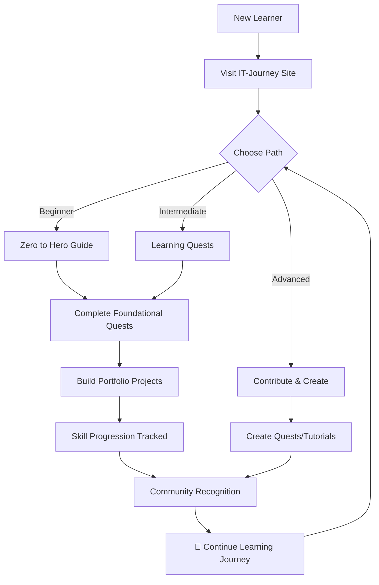

# IT-Journey

*Open-Source IT Education Platform*

> **Status:** Living | **Version:** 2026-02-20 | **Auto-Generated:** ✅

## 0. WHY

Build **IT-Journey** — an open-source educational platform that democratizes IT education 
through gamified quests, practical tutorials, and AI-enhanced learning experiences, 
transforming complete beginners into skilled IT professionals.

**KFI:** 100% of learners who complete a quest path can demonstrate measurable skill 
improvement through hands-on projects in their portfolio.

## 1. MVP (Minimum Viable Promise)

As a **learner / contributor / educator**, I want:

- ✅ Gamified learning quests with progressive difficulty (Level 0000 → advanced)
- ✅ Practical tutorials that build real-world portfolio projects
- ✅ Multi-platform support (macOS, Windows, Linux, Cloud)
- ✅ AI-enhanced development workflows and automation
- ✅ Jekyll-based static site with GitHub Pages deployment
- ✅ Automated quality assurance (link checking, content validation)
- 🔄 Interactive terminal interface (`journey.sh`) for navigation
- 🔜 Certification tracking and skill progression metrics

### Current Content Status

| Source | Count | Status |
|--------|-------|--------|
| Learning Quests | 6 | ✅ Published |
| Educational Posts | 15 | ✅ Published |
| Total Markdown Files | 42 | ✅ Indexed |
| Implemented Features | 0 | ✅ Tracked |
| Recent Commits | 40 | ✅ Analyzed |
| Detected Issues | 7 | ⚠️ Review needed |

## 2. UX (User eXperience Flow)



### User Journeys

**Beginner Path:**
1. **Discover**: Visit site → Browse quests by level
2. **Learn**: Start with Level 0000 quests → Follow step-by-step tutorials
3. **Practice**: Complete hands-on exercises → Build first projects
4. **Progress**: Track skill development → Unlock advanced content

**Contributor Path:**
1. **Explore**: Review existing content → Identify gaps or improvements
2. **Create**: Write new quests/tutorials → Follow content guidelines
3. **Submit**: Open PR → Get community feedback
4. **Iterate**: Refine based on learner outcomes

## 3. API (Atomic Programmable Interface)

### Site Navigation

| Route | Content | Purpose |
|-------|---------|---------|
| `/` | Home | Landing page with learning paths |
| `/quests/` | Quest Collection | Browse gamified learning experiences |
| `/posts/` | Blog Posts | Tutorials, case studies, guides |
| `/docs/` | Documentation | Reference materials and guides |
| `/notebooks/` | Jupyter Notebooks | Interactive code examples |
| `/about/features/` | Features Index | Platform capabilities |

### CLI Tools

```bash
# Interactive terminal interface
./journey.sh

# Local development
bundle exec jekyll serve --config _config.yml,_config_dev.yml

# Docker development
docker compose up jekyll

# Quest validation
docker compose run quest-validator

# PRD synchronization
docker compose run prd-machine ./scripts/prd-machine/prd-machine sync

# Link health check
python3 scripts/validation/link-checker.py --scope website
```

### GitHub Actions Workflows

| Workflow | Trigger | Purpose |
|----------|---------|---------|
| `build-validation.yml` | Push/PR | Validate Jekyll build |
| `link-checker.yml` | Schedule/Manual | Check link health |
| `prd-sync.yml` | Schedule/Push | Update PRD.md |
| `frontmatter-validation.yml` | Push | Validate content metadata |

## 4. NFR (Non-Functional Realities)

| Category | Requirement | Metric | Current |
|----------|-------------|--------|---------|
| Accessibility | WCAG 2.1 AA compliance | Lighthouse score ≥90 | 🔄 In progress |
| Performance | Fast page loads | Time to Interactive <3s | ✅ Static site |
| Availability | Always accessible | 99.9% uptime | ✅ GitHub Pages |
| SEO | Discoverable content | Proper meta tags | ✅ Jekyll SEO |
| Security | Safe content delivery | HTTPS everywhere | ✅ GitHub Pages |
| Multi-Platform | Cross-OS support | macOS/Windows/Linux | ✅ Documented |
| Mobile | Responsive design | All breakpoints | ✅ CSS framework |
| Content Freshness | Regular updates | Activity within 30 days | ✅ Active |

## 5. EDGE (Exceptions, Dependencies, Gotchas)

### Dependencies

- **Ruby 3.2+**: Jekyll runtime
- **Jekyll 3.9+**: Static site generator
- **Bundler**: Ruby dependency management
- **Python 3.8+**: Automation scripts and validation
- **Docker**: Containerized development environment
- **Git**: Version control and GitHub integration

### Platform Requirements

| Platform | Requirements | Notes |
|----------|--------------|-------|
| macOS | Homebrew, Xcode CLI | Primary development |
| Windows | WSL2 recommended | Docker Desktop |
| Linux | Standard dev tools | Native support |
| Cloud | GitHub Codespaces | Zero setup |

### Gotchas

- **Jekyll versions**: Pinned to 3.9.x for GitHub Pages compatibility
- **Ruby versions**: Use rbenv/rvm for version management
- **Large repos**: Initial clone may take time; use sparse checkout if needed
- **Binary files**: Images/media should go in `assets/` only
- **Frontmatter**: All content files require valid YAML frontmatter

### Recent Issues Detected

- **FIX**: Bug fix suggests incomplete requirement: fix: add permalink to github-setup.md to resolve 404 error on /quickstart/github
  - *Action*: Consider if original requirement needs clarification
- **FIX**: Bug fix suggests incomplete requirement: fix(ci): fix bash backtick interpretation and missing labels in dependency checker
  - *Action*: Consider if original requirement needs clarification
- **FIX**: Bug fix suggests incomplete requirement: fix(ci): handle datetime serialization in frontmatter validator
  - *Action*: Consider if original requirement needs clarification
- **FIX**: Bug fix suggests incomplete requirement: fix(ci): replace expired PAT_TOKEN with GITHUB_TOKEN in workflows
  - *Action*: Consider if original requirement needs clarification
- **FIX**: Bug fix suggests incomplete requirement: fix(ci): resolve workflow failures across 7 workflows
  - *Action*: Consider if original requirement needs clarification

## 6. OOS (Out Of Scope)

IT-Journey explicitly does NOT:

- ❌ Provide paid certifications or credentials
- ❌ Offer live instructor-led training
- ❌ Host user-generated content without review
- ❌ Store personal user data or accounts
- ❌ Provide enterprise or commercial support
- ❌ Replace formal education programs
- ❌ Guarantee job placement or outcomes

### Focus Areas

The platform focuses on:
- ✅ Self-paced, asynchronous learning
- ✅ Open-source community contributions
- ✅ Practical, portfolio-building projects
- ✅ Free, accessible educational content

## 7. ROAD (Roadmap)

| Milestone | Objective | Target | Status |
|-----------|-----------|--------|--------|
| **Foundation** | Jekyll site + GitHub Pages deployment | 2024 Q1 | ✅ Complete |
| **Content** | Initial quest collection + tutorials | 2024 Q2 | ✅ Complete |
| **Guardian 2.0** | Advanced link monitoring + AI analysis | 2025 Q1 | ✅ Complete |
| **PRD Machine** | Automated requirements documentation | 2025 Q4 | 🔄 In Progress |
| **Interactive** | Enhanced terminal interface + CLI tools | 2025 Q4 | 🔄 In Progress |
| **Community** | Contributor growth + content expansion | 2026 Q1 | 📋 Planned |
| **Certification** | Skill tracking + progress metrics | 2026 Q2 | 📋 Planned |
| **AI Tutor** | Personalized learning recommendations | 2026 Q4 | 🔮 Vision |

### Upcoming Features

- [ ] Enhanced quest progression tracking
- [ ] Community discussion integration
- [ ] Skill assessment and badging
- [ ] Mobile-optimized experience
- [ ] AI-powered content recommendations
- [ ] Integration with external learning platforms

## 8. RISK (Top Risks)

| Risk | Impact | Likelihood | Mitigation |
|------|--------|------------|------------|
| Content staleness | 🟡 Medium | Medium | Automated freshness monitoring |
| Contributor burnout | 🟡 Medium | Medium | Community growth + shared ownership |
| Technology obsolescence | 🟡 Medium | Low | Regular stack reviews + updates |
| Broken links/content | 🔴 High | Medium | Guardian 2.0 automated checking |
| SEO/discoverability issues | 🟡 Medium | Medium | Jekyll SEO plugin + sitemap |
| Accessibility gaps | 🔴 High | Medium | Regular audits + WCAG compliance |

### Risk Monitoring

The platform monitors health through:

- **Guardian 2.0**: Daily link health checks with AI-powered analysis
- **PRD Machine**: Automated requirements freshness tracking
- **GitHub Actions**: Build validation and content checks
- **Community feedback**: Issue tracking and discussion monitoring

## 9. DONE (Definition of Done)

### Success Criteria

- [ ] Learners complete quests with demonstrable skill improvements
- [ ] Contributors can easily add content following clear guidelines
- [ ] Site remains accessible and fast across all platforms
- [ ] Content stays current with regular community contributions
- [ ] Quality assurance catches issues before they impact learners

### Validation Metrics

| Metric | Target | Current | Status |
|--------|--------|---------|--------|
| Quest Completion Rate | >70% | TBD | 📋 Tracking planned |
| Content Freshness | <30 days | Active | ✅ |
| Build Success Rate | 100% | 100% | ✅ |
| Link Health | >95% | Monitored | ✅ |
| Community Growth | +10%/quarter | Growing | 🔄 |

---

**When these criteria are met, IT-Journey fulfills its mission:**

> *Democratizing IT education through open-source learning,*
> *gamified experiences, and community-driven content.*

**Keep learning. Keep building. Keep sharing.** 🚀

