# PRD MACHINE

*The Self-Writing, Self-Evolving Product Reality Distillery*

> **Status:** Living | **Version:** 2025-11-28 | **Auto-Generated:** ✅

## 0. WHY

Build the **PRD MACHINE** — an autonomous agent that writes, maintains, and evolves 
perfect PRDs faster and more accurately than any human PM, forever ending the era of 
stale, bloated, or missing product requirements documents.

**KFI:** 100% of shipped features trace directly to a machine-maintained PRD that was 
never out of date by more than 6 hours.

## 1. MVP (Minimum Viable Promise)

As a **founder / PM / engineer**, I want:

- ✅ A single CLI command `prd-machine sync` that instantly produces or updates a perfect `PRD.md`
- ✅ Zero manual writing after initial 3-line product seed
- 🔄 Automatic ingestion of git commits, markdown files, and feature definitions
- ✅ Real-time conflict detection with proposed resolutions
- ✅ Auto-generated MVP, UX, API, NFR, EDGE, OOS, ROAD, RISK, DONE sections
- 🔜 One-click "Ship this PRD" → opens PR with updated PRD.md + skeleton code/tests/CI

### Current Signal Status

| Source | Count | Status |
|--------|-------|--------|
| Git Commits | 3 | ✅ Ingested |
| Markdown Files | 79 | ✅ Ingested |
| Features | 1 | ✅ Parsed |
| Conflicts | 0 | ⚠️ Detected |

## 2. UX (User eXperience Flow)

```mermaid
graph TD
    A[Product seed 3 lines] --> B[PRD MACHINE wakes]
    B --> C[Ingests all signals in repo/org]
    C --> D[Distills into canonical PRD.md]
    D --> E[Notifies humans only on conflict or approval]
    E --> F[Humans thumbs-up → PRD becomes law]
    F --> G[🔄 Loop: Monitor for changes]
    G --> C
```



### User Journey

1. **Initialize**: Run `prd-machine init` to create seed file
2. **Sync**: Run `prd-machine sync` to generate/update PRD
3. **Review**: Check for conflicts and resolve them
4. **Ship**: Run `prd-machine ship` to create PR with updates

## 3. API (Atomic Programmable Interface)

| Endpoint | Method | Trigger | Output |
|----------|--------|---------|--------|
| `/v1/prd/generate` | POST | git push / ticket move | Updated PRD.md diff |
| `/v1/prd/conflict` | GET | Contradiction detected | Resolution proposals |
| `/v1/prd/ship` | POST | Human approval | Opens PR with scaffolding |
| `/v1/prd/status` | GET | Any time | Current PRD health metrics |

### CLI Commands

```bash
# Generate or update PRD
prd-machine sync

# Initialize new project
prd-machine init

# Check for conflicts
prd-machine conflicts

# Ship PRD as PR
prd-machine ship

# Show PRD status
prd-machine status
```

## 4. NFR (Non-Functional Realities)

| Category | Requirement | Metric | Current |
|----------|-------------|--------|---------|
| Freshness | PRD never stale > 6h | 99th percentile | ✅ On every sync |
| Cost | ≤ $8 per PRD per month | Even at 10k features/yr | ✅ $0 (local execution) |
| Accuracy | ≥ 98% human agreement | Blind Turing test | 🔄 In progress |
| Safety | No hallucinated requirements | Guardrails + human veto | ✅ Source-linked |
| Performance | Sync < 10 seconds | 95th percentile | ✅ Target met |

## 5. EDGE (Exceptions, Dependencies, Gotchas)

### Dependencies

- **Git**: Required for commit ingestion and version control
- **Python 3.8+**: Runtime environment
- **Repository structure**: Expects standard IT-Journey layout

### Gotchas

- Founder changes mind verbally → machine must detect via commit patterns
- Large repos (>10k commits) → use incremental sync with `--days` flag
- Binary files → ignored in signal ingestion

### TDD (Technical Design Decisions)

We intentionally ship with "over-alignment" — if humans disagree with generated 
requirements, the machine picks the most data-backed reality from actual signals.

## 6. OOS (Out Of Scope)

The PRD MACHINE explicitly does NOT:

- ❌ Write actual code (only scaffolding templates)
- ❌ Replace product sense (only distills existing sense from signals)
- ❌ Generate legal contracts or pricing pages
- ❌ Make business decisions without human approval
- ❌ Access external APIs without explicit configuration
- ❌ Modify code outside of PRD.md and related documentation

## 7. ROAD (Roadmap)

| Milestone | Objective | Target | Status |
|-----------|-----------|--------|--------|
| **Alpha** | Single-repo, private beta (10 teams) | Q1 2025 | ✅ Complete |
| **Beta** | Multi-org, public launch | Q2 2025 | 🔄 In Progress |
| **1.0** | Zero-touch mode (no human ever edits PRD) | Q4 2025 | 📋 Planned |
| **2.0** | Self-evolving PRD MACHINE writes PRDs about itself | 2026 | 🔮 Vision |

### Upcoming Features

- [ ] Slack/Discord integration for signal ingestion
- [ ] Linear/Jira ticket synchronization
- [ ] Figma comment extraction
- [ ] AI-powered requirement summarization
- [ ] Automated PR generation with code scaffolding

## 8. RISK (Top Risks)

| Risk | Impact | Likelihood | Mitigation |
|------|--------|------------|------------|
| Humans stop thinking | 🔴 High | Medium | Keep final veto button forever |
| Infinite requirement churn | 🟡 Medium | Medium | Auto-freeze on ship date |
| PRD MACHINE becomes the product | 🟣 Existential | Low | Embrace it |
| Signal pollution (too much noise) | 🟡 Medium | High | Smart filtering + human curation |
| Loss of context over time | 🟡 Medium | Medium | Version history + semantic linking |

### Risk Monitoring

The PRD MACHINE tracks its own health via the `prd-machine status` command, 
alerting humans when:

- Signal sources go stale (no commits in 7 days)
- Conflict rate exceeds threshold (>5 per sync)
- Section accuracy falls below target (<90%)

## 9. DONE (Definition of Done)

### Success Criteria

- [ ] `prd-machine sync` produces a PRD that 100% of engineers prefer over writing themselves
- [ ] Average time from idea → shipped feature < 72h with zero requirement bugs
- [ ] At least one company ships an entire product without a human ever typing a requirement

### Validation Metrics

| Metric | Target | Current | Status |
|--------|--------|---------|--------|
| PRD Generation Success | 100% | 100% | ✅ |
| Human Override Rate | < 10% | TBD | 📋 |
| Time-to-Sync | < 10s | ~3s | ✅ |
| Signal Coverage | > 80% | ~60% | 🔄 |

---

**When these boxes are green, the loop is closed:**

> *The PRD MACHINE writes perfect PRDs about itself writing perfect PRDs.*
> 
> *Reality fully armed. The distillery now distills distilleries.*

**Ship it.** 🚀

