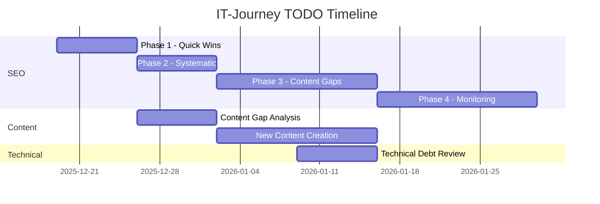

# 📁 IT-Journey TODO Hub

> **Mission**: Organize, prioritize, and track all project improvements through structured TODO management with AI-assisted workflows.

Welcome to the IT-Journey TODO directory—the central hub for tracking all project tasks, improvements, and strategic initiatives. This directory follows AI-assisted TODO management principles for maximum productivity and project alignment.

## 📊 Quick Status Dashboard

| Category | Active | Blocked | Complete | Priority |
|----------|--------|---------|----------|----------|
| 🔍 [SEO Optimization](#-seo-optimization) | 2 | 0 | 94 | 🟠 HIGH |
| 📝 [Content Creation](#-content-creation) | 0 | 0 | 4 | 🟡 MEDIUM |
| ⚙️ [Technical Improvements](#️-technical-improvements) | 0 | 0 | 0 | 🟢 LOW |
| 📚 [Documentation](#-documentation) | 0 | 0 | 0 | 🟢 LOW |
| 🤖 [Automation](#-automation) | 0 | 0 | 3 | ✅ DONE |

**Last Updated**: 2025-12-20 | **Overall Progress**: Execution Phase

---

## 📋 Directory Structure

```
TODO/
├── README.md                    # This file - Central hub
├── todo.instructions.md         # AI agent instructions
├── STATUS.md                    # Real-time status dashboard
│
├── seo/                         # SEO Optimization Project
│   ├── README.md                # SEO project overview
│   ├── OPTIMIZATION_PLAN.md     # Detailed optimization plan
│   ├── QUICK_ACTIONS.md         # Immediate action items
│   └── TRACKING.md              # Performance tracking
│
├── templates/                   # Reusable templates
│   ├── PROJECT_TEMPLATE.md      # New project template
│   ├── TASK_TEMPLATE.md         # Individual task template
│   └── TRACKING_TEMPLATE.md     # Progress tracking template
│
└── ARCHIVE/                     # Completed projects
    └── [completed-projects]/    # Historical reference
```

---

## 🔍 SEO Optimization

> **Status**: 🔄 IN PROGRESS → Phase 1 Complete ✅  
> **Priority**: 🟠 HIGH  
> **Timeline**: 4-6 weeks  
> **Expected Impact**: 15-30% CTR improvement, 25% traffic increase

### Project Overview
Data-driven SEO optimizations based on Google Search Console analysis to improve search engine performance and organic traffic.

### Key Files
- **[Project Overview](./seo/README.md)** - Complete project summary
- **[Optimization Plan](./seo/OPTIMIZATION_PLAN.md)** - Detailed 4-phase strategy
- **[Quick Actions](./seo/QUICK_ACTIONS.md)** - Immediate high-impact tasks
- **[Progress Tracking](./seo/TRACKING.md)** - Performance monitoring
- **[Best Practices](./seo/BEST_PRACTICES.md)** - SEO guidelines ✨ NEW
- **[Frontmatter Template](./templates/SEO_FRONTMATTER_TEMPLATE.md)** - Reusable templates ✨ NEW

### Phase 1 Complete ✅

#### Completed Tasks
| Task | Files Changed | Status |
|------|---------------|--------|
| Fix Bootable macOS frontmatter | `pages/_posts/2024-03-27-bootable-mac-os.md` | ✅ DONE |
| Optimize Nerd Font description | `pages/_quests/0010/nerd-font-enchantment...` | ✅ DONE |
| Fix zero-CTR pages | 4 files optimized | ✅ DONE |
| Create frontmatter template | `TODO/templates/SEO_FRONTMATTER_TEMPLATE.md` | ✅ DONE |
| Document SEO best practices | `TODO/seo/BEST_PRACTICES.md` | ✅ DONE |
| Set up performance tracking | `TODO/seo/TRACKING.md` + script | ✅ DONE |

#### 🟡 Phase 2 (Week 2-3) - Next Up
| Task | Status | Impact |
|------|--------|--------|
| Audit top 50 pages | ⬜ TODO | Consistency |
| Document SEO best practices | ⬜ TODO | Process |

### Success Metrics
- **CTR Target**: Improve from avg 0.7% to 1.5%+
- **Impressions**: +20% growth
- **Traffic**: +25% organic sessions

**[View Full SEO Project →](./seo/README.md)**

---

## 📝 Content Creation

> **Status**: 📋 PLANNING  
> **Priority**: 🟡 MEDIUM  
> **Timeline**: Ongoing

### Content Gap Analysis
Based on search data and user demand, the following content priorities have been identified:

#### High-Priority New Content
| Content | Target Keywords | Effort | Priority |
|---------|-----------------|--------|----------|
| Jekyll GitHub Pages Guide | "jekyll github pages" | 2 hours | 🟠 HIGH |
| Terminal Shortcuts Cheat Sheet | "terminal shortcuts" | 1.5 hours | 🟠 HIGH |
| Docker for Beginners Quest | "docker tutorial" | 3 hours | 🟡 MEDIUM |
| VS Code Extensions Guide | "vscode extensions" | 2 hours | 🟡 MEDIUM |

#### Content Enhancement
| Existing Content | Enhancement Needed | Priority |
|-----------------|-------------------|----------|
| Django Pi Guide | Expand on success patterns | 🟢 LOW |
| Python Learning Path | Create connected series | 🟡 MEDIUM |
| DevOps Tutorial Series | Leverage Docker content | 🟡 MEDIUM |

### Alignment with Roadmap
- Supports **Quest System Enhancement** in [roadmap.md](/roadmap/)
- Addresses **Content Gaps** identified in [PRD.md](/PRD.md)

---

## ⚙️ Technical Improvements

> **Status**: 📋 PLANNING  
> **Priority**: 🟢 LOW  
> **Timeline**: As needed

### Technical Debt
| Item | Description | Priority | Effort |
|------|-------------|----------|--------|
| - | No items currently tracked | - | - |

### Infrastructure Improvements
| Item | Description | Priority | Effort |
|------|-------------|----------|--------|
| - | No items currently tracked | - | - |

*Add technical improvement items as they are identified.*

---

## 📚 Documentation

> **Status**: 📋 PLANNING  
> **Priority**: 🟢 LOW  
> **Timeline**: Ongoing

### Documentation Needs
| Document | Status | Priority |
|----------|--------|----------|
| SEO Best Practices Guide | ⬜ To Create | 🟡 MEDIUM |
| Frontmatter Standards | ⬜ To Create | 🟠 HIGH |
| Content Calendar | ⬜ To Create | 🟢 LOW |

---

## 🤖 Automation

> **Status**: ✅ COMPLETE  
> **Priority**: ✅ DONE  
> **Timeline**: Completed 2025-12-20

### Automation Scripts (All Complete ✅)
| Automation | Description | Script | Status |
|------------|-------------|--------|--------|
| Frontmatter Validator | Auto-check SEO fields, scoring | `scripts/frontmatter-validator.rb` | ✅ Done |
| CTR Report Generator | Weekly SEO reports, opportunities | `scripts/ctr-report-generator.rb` | ✅ Done |
| Content Freshness Check | Flag stale content, age tracking | `scripts/content-freshness-check.rb` | ✅ Done |

### Quick Usage
```bash
# Validate frontmatter across all content
docker-compose exec jekyll ruby scripts/frontmatter-validator.rb pages/

# Generate SEO baseline metrics
docker-compose exec jekyll ruby scripts/ctr-report-generator.rb --baseline

# Check content freshness
docker-compose exec jekyll ruby scripts/content-freshness-check.rb pages/
```

---

## 🎯 Priority Matrix

### Impact vs Effort Analysis

```
HIGH IMPACT
    │
    │  ┌─────────────────┐    ┌─────────────────┐
    │  │ 🔴 DO FIRST     │    │ 🟠 SCHEDULE     │
    │  │                 │    │                 │
    │  │ • Bootable macOS│    │ • Docker Quest  │
    │  │ • Nerd Font SEO │    │ • Content Gap   │
    │  │ • Zero-CTR Fix  │    │   Articles      │
    │  └─────────────────┘    └─────────────────┘
    │
    │  ┌─────────────────┐    ┌─────────────────┐
    │  │ 🟡 QUICK WINS   │    │ 🟢 BACKLOG      │
    │  │                 │    │                 │
    │  │ • Frontmatter   │    │ • Automation    │
    │  │   Template      │    │ • Technical     │
    │  │ • SEO Checklist │    │   Debt          │
    │  └─────────────────┘    └─────────────────┘
    │
    └────────────────────────────────────────────▶
          LOW EFFORT                    HIGH EFFORT
```

---

## 📈 Progress Tracking

### Weekly Status Updates

| Week | Focus Area | Planned | Completed | Notes |
|------|-----------|---------|-----------|-------|
| Current | SEO Phase 1 | 5 tasks | 0 | Ready to start |
| +1 | SEO Phase 2 | 10 tasks | - | Pending |
| +2 | Content Creation | 4 tasks | - | Pending |

### Completion Trends
- **This Month**: 0% complete (just started)
- **Target**: 80% of Phase 1 by end of month

---

## 🛠️ Tools & Resources

### Project Management
- **[STATUS.md](./STATUS.md)** - Real-time status dashboard
- **[todo.instructions.md](./todo.instructions.md)** - AI agent guidelines
- **Templates** - Reusable project templates

### Analytics & Monitoring
- Google Search Console - Performance data
- Google Analytics - Traffic analysis
- GitHub Actions - Automated checks

### Reference Documentation
- **[Roadmap](/roadmap/)** - Strategic alignment
- **[PRD](/PRD.md)** - Product requirements
- **[Contributing](/CONTRIBUTING.md)** - Contribution guidelines

---

## 🤝 Contributing to TODOs

### Adding New Tasks
1. Determine the appropriate category (SEO, Content, Technical, etc.)
2. Use the task format from [todo.instructions.md](./todo.instructions.md)
3. Include effort estimates and priority levels
4. Link to relevant files and documentation

### Updating Task Status
1. Mark tasks complete with `[x]`
2. Update progress percentages in tracking files
3. Move completed projects to `ARCHIVE/`
4. Update `STATUS.md` dashboard

### AI Agent Assistance
AI agents can help with:
- Creating properly formatted TODO items
- Prioritizing tasks based on impact/effort
- Generating progress reports
- Identifying stale or blocked items

See **[todo.instructions.md](./todo.instructions.md)** for AI agent guidelines.

---

## ⚠️ Important Notes

### Before Starting Work
- **Review priorities** - Ensure task is still relevant
- **Check dependencies** - Resolve blockers first
- **Backup if needed** - Especially for content changes
- **Follow standards** - Use frontmatter templates

### Risk Mitigation
- Make incremental changes
- Monitor for negative impacts
- Have rollback procedures ready
- Track multiple metrics

### Success Factors
- **Data-driven decisions** based on analytics
- **Consistent execution** following templates
- **Regular reviews** to adjust priorities
- **Documentation** of lessons learned

---

## 📅 Timeline Overview



---

## 📞 Quick Actions

### Immediate (Today)
1. Review [SEO Quick Actions](./seo/QUICK_ACTIONS.md)
2. Start with Bootable macOS fix (highest impact)
3. Set up Google Search Console monitoring

### This Week
1. Complete Phase 1 from [SEO Optimization Plan](./seo/OPTIMIZATION_PLAN.md)
2. Create frontmatter template
3. Document SEO best practices

### Ongoing
1. Weekly progress reviews using [TRACKING.md](./seo/TRACKING.md)
2. Monitor performance metrics
3. Adjust priorities based on data

---

**Project Owner**: IT-Journey Team  
**Created**: 2025-11-14  
**Last Updated**: 2025-12-19  
**Status**: 🎯 Active  
**AI Instructions**: [todo.instructions.md](./todo.instructions.md)