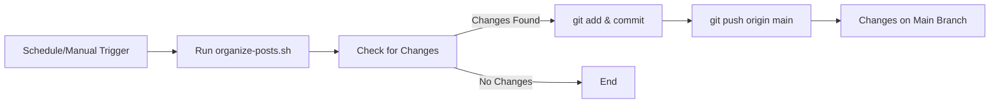
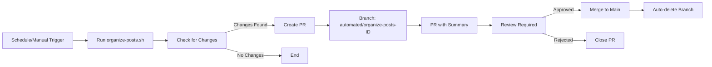

# Workflow Change Visualization

## Before: Direct Push Workflow



**Issues:**
- No review process
- Changes applied immediately to main
- No opportunity to reject unwanted changes

## After: Pull Request Workflow



**Benefits:**
- ✅ Review process
- ✅ Traceability
- ✅ Safety
- ✅ Transparency
- ✅ Easy rollback

## Workflow Steps Comparison

### Old Workflow (Lines 201-221)
```yaml
- name: 'Commit and Push Changes'
  run: |
    git add pages/_posts/
    git commit -m "$commit_msg"
    git push origin main  # ❌ Direct push
```

### New Workflow (Lines 201-240)
```yaml
- name: 'Create Pull Request with Organized Posts'
  uses: peter-evans/create-pull-request@v7  # ✅ PR-based
  id: create_pr
  with:
    token: ${{ secrets.GITHUB_TOKEN }}
    branch: automated/organize-posts-${{ github.run_id }}
    delete-branch: true
    title: '🤖 Weekly Post Organization - ${{ github.run_id }}'
    body: |
      ## 📋 Automated Post Organization
      [Summary and details...]
    labels: |
      automated
      content-organization
      posts
    assignees: bamr87
```

## Key Improvements

| Aspect | Before | After |
|--------|--------|-------|
| **Deployment Method** | Direct push to main | Pull request |
| **Review Process** | None | Required |
| **Traceability** | Git log only | PR + Workflow link |
| **Rollback** | Git revert needed | Close PR |
| **Transparency** | Minimal | Full summary in PR |
| **Branch Management** | N/A | Auto-created and deleted |
| **Labels** | N/A | Auto-labeled |
| **Assignment** | N/A | Auto-assigned to bamr87 |

## Example PR Output

When the workflow runs and finds changes, it will create a PR like this:

```markdown
Title: 🤖 Weekly Post Organization - 12345678

## 📋 Automated Post Organization

This PR was automatically generated by the Weekly Post Organization workflow.

### 📊 Summary
- **Workflow Run**: [12345678](https://github.com/bamr87/it-journey/actions/runs/12345678)
- **Triggered**: Scheduled (Weekly)
- **Archive Threshold**: 3 months

### 📁 Changes Made
- Organized X posts into subdirectories
- Archived Y posts (>3 months old)

### ✅ Next Steps
1. Review the organized file structure
2. Verify posts are in correct subdirectories
3. Merge this PR to apply changes

---
*Generated by: Weekly Post Organization and Archiving workflow*
```

**Labels:** `automated`, `content-organization`, `posts`
**Assignee:** `bamr87`
**Branch:** `automated/organize-posts-12345678` (auto-deleted after merge)
