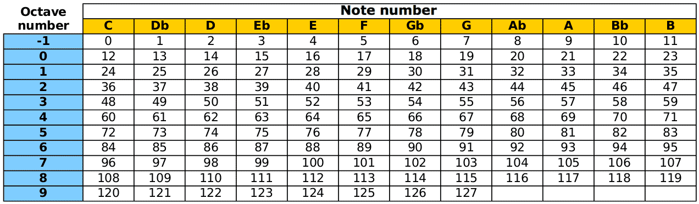
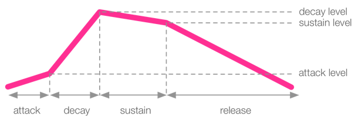
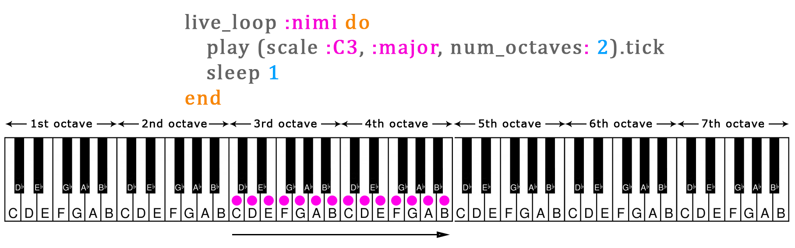
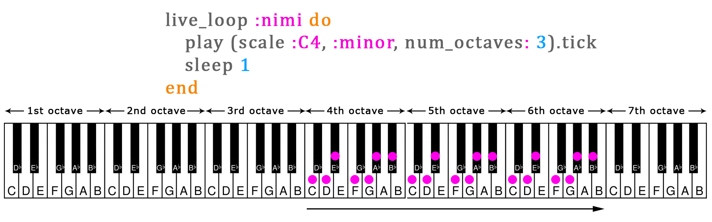
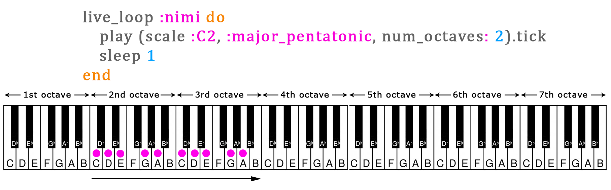
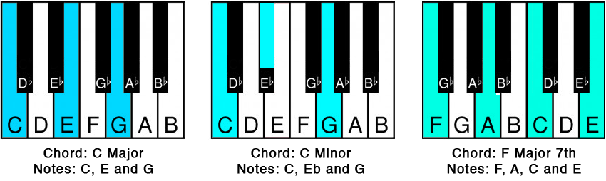

## Install Sonic PI

```powershell
winget install sonicpi.sonicpi
```


Change skin


Note Numbering


[Source](http://sonic-pi.mehackit.org/)

Cheatsheet
==========

Play a note
-----------

```ruby
use_bpm 100
# this is a comment
play 50
sleep 1
play :C3
sleep 1
play_pattern_timed [:c2, :d2, :e2, :d2], [0.5, 0.25, 0.75, 0.5]
```



Loop
----

```ruby
live_loop :drums do
  sample :drum_heavy_kick
  sleep 1
end

2.times do
  play_pattern_timed [:E5, :Eb5], [0.25]
end
play_pattern_timed [:e5, :b4, :d5, :c5], [0.25]
play :a4
sleep 1
```

Synths and options
------------------



```ruby
use_synth :fm
use_transpose 0
use_octave 0

play :c, attack: 1, decay: 0, sustain: 0, release: 1, amp: 0.5, pan: rrand(-0.5,0.5)
```

Samples and options
-------------------

```ruby
sample :bd_haus, amp: 0.5
sleep 1
sample :drum_cymbal_open, attack: 0.01, sustain: 0, release: 0.1
sleep 1
live_loop :amen_break do
  sample :loop_amen, beat_stretch: 2, rate: -1
  sleep 2
end
```

Randomization
-------------

```ruby
rrand(60, 110)

if one_in(6)
  # do something
else
  # do something else
end

sleep [0, 1, 2].choose
play [:c, :e, :g].choose
```

FX
--

```ruby
with_fx :reverb, mix: 0.5 do
  # do something
end
```

Scales and chords
-----------------

```ruby
scale(:c2,  :major)  # ring of :c2, :d2, :e2, :f2, :g2, :a2, :b2  chord(:c2,  :major,  ,  num_octaves:  2)  # ring of :c2, :e2, :g2 :c3, :e3, :g3
```







Tick, ring and variables
------------------------

```ruby
play scale(:e3, :minor_pentatonic).tick, release: 0.1

play [:c, :e, :d, :f].ring.tick

r = [0.25, 0.25, 0.5, 1].choose
play chord(:c, :minor).choose, attack: 0, release: r
sleep r

chords = [chord(:C, :minor7), chord(:Ab, :major7)].ring # a ring of chords
c = chords.tick # save next chord to a variable 'c'
c[0] # get the first note of the chord
```

Other
-----

If your code is getting slow, try `use_debug false` in the beginning of your code. This reduces the log messages Sonic Pi generates and can speed up the code.
