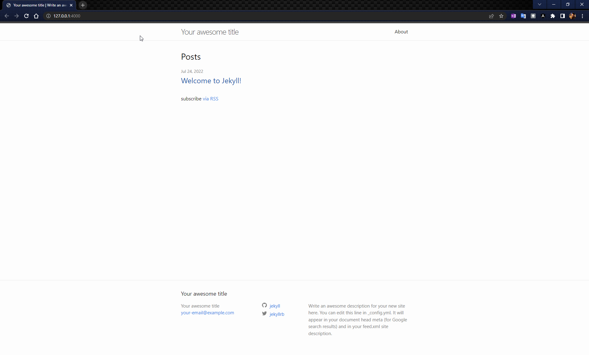
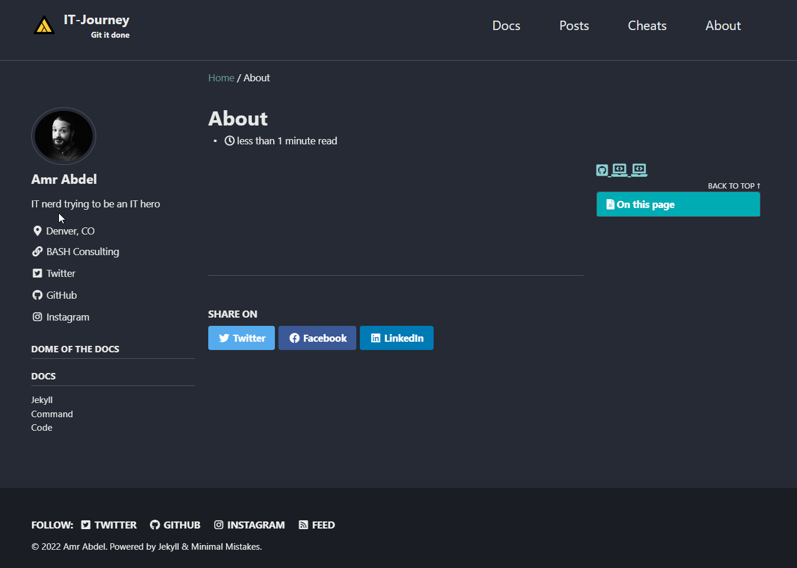
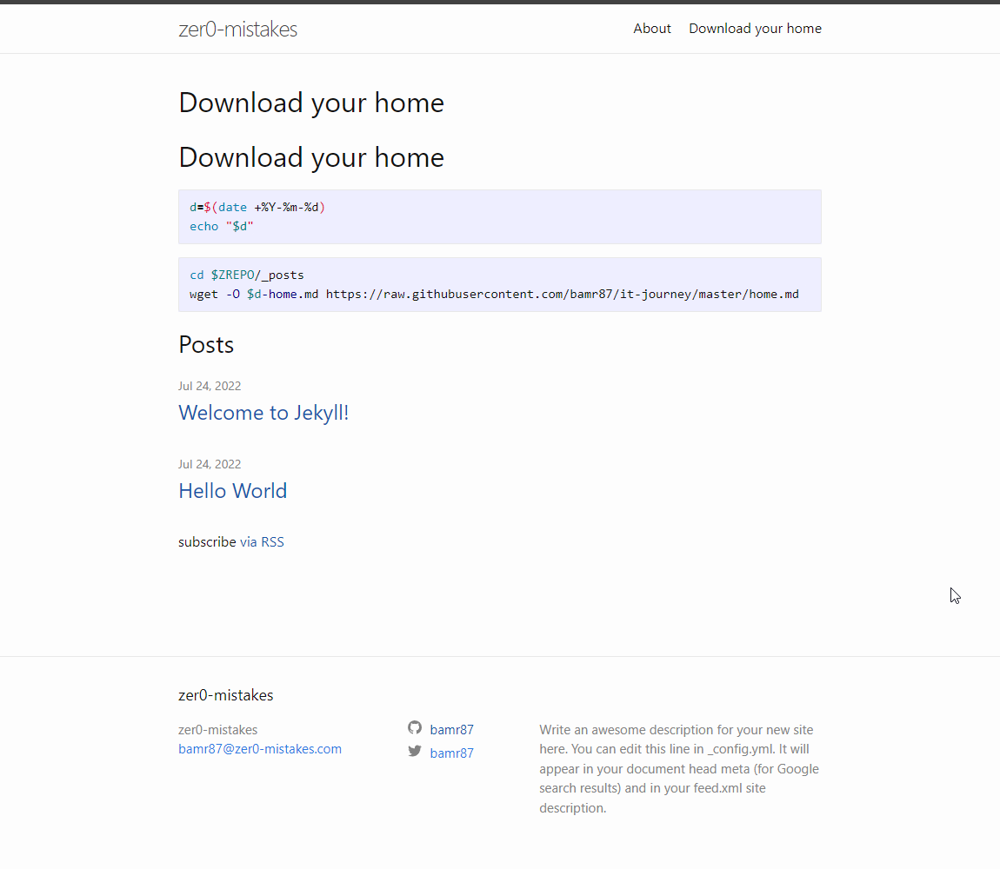

{{ page.title }}

## Prerequsites

Github Account

[Signup](https://github.com/signup) or [Sign-in](https://github.com/login)

### Machine Setup

Install package manager:

- [Winget](https://docs.microsoft.com/en-us/windows/package-manager/winget/)

- [Homebrew](https://brew.sh)

Install Git
- Homebrew [git](https://formulae.brew.sh/formula/git#default)  
- Winget [git](https://winget.run/pkg/Git/Git) 

Install [Github cli](https://github.com/cli/cli#installation)

## Set your variables

```shell
export GITHOME=~/github
export GHUSER=bamr87
export GIT_REPO=$GHUSER.github.io
export ZREPO=$GITHOME/$GIT_REPO
echo $GITHOME $ZREPO $GHUSER $GIT_REPO

git config --global user.email "$GHUSER@users.noreply.github.com"
git config --global user.name "$GHUSER"
```

## Initialize your new github repository

[gh cli docs](https://cli.github.com/manual/)

```shell
cd ~
mkdir $GITHOME
cd $GITHOME
mkdir $GIT_REPO
cd $ZREPO
```

```shell
# If repo already exists
cd $ZREPO
gh repo clone $GHUSER/$GIT_REPO
```

```shell
# If new repo
cd $ZREPO
git init
echo "# Building new report from $ZREPO" >> README.md
git add README.md
git commit -m "first commit"
git branch -M main
git remote add origin https://github.com/$GHUSER/$GHUSER.github.io.git
git push -u origin main
```

## Checkpoint - Github Repo Initialized

```shell
# non-github.io version
gh repo create $GIT_REPO --public --source=. --remote=upstream
git remote add origin https://$GHUSER@github.com/$GHUSER/$GIT_REPO.git
```

## Initialize Jekyll - If New Repo

Install [jekyll](https://jekyllrb.com/docs/installation/)

```shell
cd $ZREPO
jekyll new ./ --force
bundle install
```

```shell
# If running MacOS
bundle add webrick
bundle install
```

```shell
jekyll serve
```

## Initialize Jekyll - If Existing Repo

```shell
cd $ZREPO
bundle update
bundle install
jekyll serve
```

## Checkpoint - Jekyll Initialized
  

```shell
code _config.yml
```

```yaml
title: zer0-mistakes
email: bamr87@zer0-mistakes.com
description: >- # this means to ignore newlines until "baseurl:"
  Write an awesome description for your new site here. You can edit this
  line in _config.yml. It will appear in your document head meta (for
  Google search results) and in your feed.xml site description.
baseurl: "" # the subpath of your site, e.g. /blog
url: "" # the base hostname & protocol for your site, e.g. http://example.com
twitter_username: bamr87
github_username:  bamr87
```

```shell
cd $ZREPO
wget https://raw.githubusercontent.com/bamr87/it-journey/master/favicon.ico
```

## Checkpoint 1

```shell
bundle lock --add-platform x86-mingw32 x64-mingw32 x86-mswin32 java
```

### Override default
https://jekyllrb.com/docs/themes/#overriding-theme-defaults

```shell
# find theme path
bundle info --path minima
JEKYLL_THEME=$(bundle info --path minima)
echo $JEKYLL_THEME
cd $JEKYLL_THEME

```
### Copy theme repo

```shell
cp -aR $JEKYLL_THEME/* $ZREPO
```

### Remove Theme plugin

```shell
bundle remove jekyll-theme-minima
```

### Comment out the theme from config and Gemfile

```shell
#_config.yml
# Build settings
# theme: minima
plugins:
  - jekyll-feed
```

```shell
bundle remove minima --install
```

Restart jekyll
```shell
jekyll serve
```

## Building the theme

### Build default page


```shell

cd $ZREPO
mkdir _layout
cd _layout
echo "{{ content }}" >> default.html 

``` 


```shell
#tree #alias #zshrc #profile
alias tree="find . -print | sed -e 's;[^/]*/;|____;g;s;____|; |;g'"
echo alias tree="find . -print | sed -e 's;[^/]*/;|____;g;s;____|; |;g'" >> ~/.zshrc

tree
cd -
```

  

## Download your home

```shell
d=$(date +%Y-%m-%d)
echo "$d"
```

```shell
cd $ZREPO/_posts
wget -O $d-home.md https://raw.githubusercontent.com/bamr87/it-journey/master/home.md 
```

  

