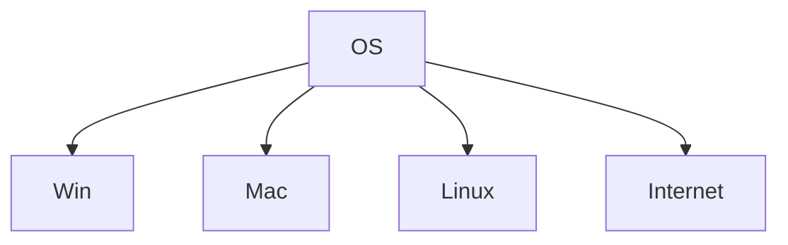

# init_world
  Initialize your IT world



Choose your difficulty:

  * What is OS? - [n00b](/quest/n00b/hello-noob)
  * I has Internet!? - Easy
  * Big Macintosh - Medium
  * Damn Windows Update  - Hard
  * A Linux to the past - Epic
  * Cloud Atlas - Heroic


[Hello Win](hello-win/hello-win.md)
Hello Cloud
Hell Mac
Hello Linux 


# Accounts
## [Gmail](https://www.google.com/gmail/)
## GitHub
## Twitter
## Facebook
## LinkedIn
## Instagram
## StackOverflow
## CodePen


# windows
  

## VS Code

## App
        - Visual Studio 2019
        - Python

Winget
    - https://github.com/microsoft/winget-cli
  - [CHocolaty](https://chocolatey.org/docs/installation)
```PowerShell
    @"%SystemRoot%\System32\WindowsPowerShell\v1.0\powershell.exe" -NoProfile -InputFormat None -ExecutionPolicy Bypass -Command " [System.Net.ServicePointManager]::SecurityProtocol = 3072; iex ((New-Object System.Net.WebClient).DownloadString('https://chocolatey.org/install.ps1'))" && SET "PATH=%PATH%;%ALLUSERSPROFILE%\chocolatey\bin"
```

### mac

  ### iterm2


  #### SDK's
    Python

    https://medium.com/@sahanarajasekar/5-ways-to-upgrade-your-terminal-2fb8ab447949

          OMZsh

## Linux

- Hello_world
  - Navigation
  - profile
  - 