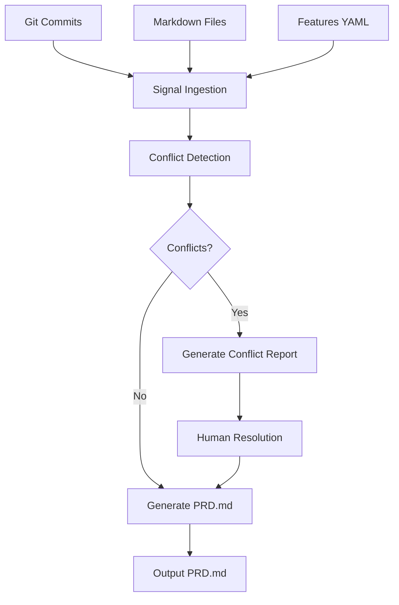

# PRD MACHINE Documentation

*The Self-Writing, Self-Evolving Product Reality Distillery*

**Version:** 1.0.0  
**Last Updated:** 2025-11-28  
**Status:** Active  
**Location:** `scripts/prd-machine/`

---

## Overview

PRD MACHINE is an autonomous agent that writes, maintains, and evolves perfect PRDs (Product Requirements Documents) faster and more accurately than any human PM. It transforms the traditional manual PRD writing process into an automated, signal-driven distillation of product reality.

### Key Feature Indicator (KFI)

> **100% of shipped features trace directly to a machine-maintained PRD that was never out of date by more than 6 hours.**

### Core Philosophy

1. **Automation Over Manual Work** - Requirements should write themselves from signals
2. **Data-Backed Reality** - The machine uses actual evidence, not opinions
3. **Human Veto Power** - Humans always have final say via conflict resolution
4. **Continuous Freshness** - PRDs should never be stale by more than 6 hours

---

## Architecture

### System Components

```
┌─────────────────────────────────────────────────────────────────┐
│                        PRD MACHINE                               │
├─────────────────────────────────────────────────────────────────┤
│                                                                  │
│  ┌──────────────┐   ┌──────────────┐   ┌──────────────┐        │
│  │   Signal     │   │   Conflict   │   │    PRD       │        │
│  │  Ingestion   │ → │  Detection   │ → │  Generation  │        │
│  └──────────────┘   └──────────────┘   └──────────────┘        │
│         │                  │                  │                 │
│         ▼                  ▼                  ▼                 │
│  ┌──────────────────────────────────────────────────────┐      │
│  │                    Data Store                         │      │
│  │  • Git Commits   • Markdown Files   • Features YAML  │      │
│  └──────────────────────────────────────────────────────┘      │
│                                                                  │
└─────────────────────────────────────────────────────────────────┘
                              │
                              ▼
                    ┌──────────────────┐
                    │     PRD.md       │
                    │  (Auto-Generated)│
                    └──────────────────┘
```

### Signal Flow



---

## Installation & Setup

### Prerequisites

- Python 3.8 or higher
- Git repository with commit history
- No external dependencies required

### Quick Install

```bash
# The PRD Machine is already included in the IT-Journey repository
cd /path/to/it-journey

# Make the CLI executable (if not already)
chmod +x scripts/prd-machine/prd-machine

# Verify installation
./scripts/prd-machine/prd-machine --version
# Output: prd-machine 1.0.0
```

### System-wide Installation (Optional)

```bash
# Option 1: Add to PATH
export PATH="${PATH}:/path/to/it-journey/scripts/prd-machine"

# Option 2: Create symlink
sudo ln -sf /path/to/it-journey/scripts/prd-machine/prd-machine /usr/local/bin/prd-machine
```

---

## CLI Reference

### Command Overview

| Command | Description | Common Options |
|---------|-------------|----------------|
| `sync` | Generate or update PRD.md | `--days`, `--output` |
| `status` | Check PRD health and freshness | None |
| `conflicts` | Show detected requirement conflicts | `--days` |

### `prd-machine sync`

Generates or updates the PRD.md file by ingesting all repository signals.

**Usage:**
```bash
prd-machine sync [OPTIONS]
```

**Options:**
| Option | Default | Description |
|--------|---------|-------------|
| `--days N` | 30 | Number of days of git history to analyze |
| `--output PATH` | PRD.md | Output file path |

**Examples:**
```bash
# Standard sync with defaults
prd-machine sync

# Use only last 7 days of commits
prd-machine sync --days 7

# Output to custom location
prd-machine sync --output docs/PRODUCT_REQUIREMENTS.md
```

**What it does:**
1. Ingests git commits from repository history
2. Scans all markdown files for signals
3. Parses feature definitions from `features/features.yml`
4. Detects conflicts and potential issues
5. Generates complete PRD.md with all 10 sections

### `prd-machine status`

Checks the health and freshness of the current PRD.

**Usage:**
```bash
prd-machine status
```

**Output includes:**
- PRD existence and location
- Last modification time
- Age in hours
- Health status indicator

**Health Status Levels:**

| Status | Age | Indicator |
|--------|-----|-----------|
| HEALTHY | < 6 hours | ✅ |
| STALE | 6-24 hours | ⚠️ |
| OUTDATED | > 24 hours | ❌ |

**Example Output:**
```
[INFO] PRD Path: /home/user/it-journey/PRD.md
[INFO] Last Modified: 2025-11-28T21:27:32.000000+00:00
[INFO] Age: 0.5 hours
[SUCCESS] Health: HEALTHY
```

### `prd-machine conflicts`

Analyzes repository signals and reports detected requirement conflicts.

**Usage:**
```bash
prd-machine conflicts [OPTIONS]
```

**Options:**
| Option | Default | Description |
|--------|---------|-------------|
| `--days N` | 30 | Days of history to analyze |

**Conflict Types Detected:**

| Type | Description | Resolution |
|------|-------------|------------|
| Reverted Changes | Changes that were undone | Review original intent |
| Bug Fixes | Issues indicating incomplete requirements | Update requirements |
| Contradictory Signals | Conflicting information from sources | Human arbitration |

---

## PRD Structure

The generated PRD.md follows a standardized 10-section structure:

### Section Overview

| # | Section | Purpose |
|---|---------|---------|
| 0 | **WHY** | Mission statement and key success metric |
| 1 | **MVP** | Minimum Viable Promise with signal status |
| 2 | **UX** | User experience flow with diagrams |
| 3 | **API** | CLI commands and interface documentation |
| 4 | **NFR** | Non-functional requirements with metrics |
| 5 | **EDGE** | Edge cases, dependencies, gotchas |
| 6 | **OOS** | Out of scope items |
| 7 | **ROAD** | Roadmap with milestones and status |
| 8 | **RISK** | Top risks with mitigation strategies |
| 9 | **DONE** | Definition of done and success criteria |

### Section Details

#### 0. WHY
Contains the core mission and the Key Feature Indicator (KFI) that defines success.

#### 1. MVP (Minimum Viable Promise)
Lists all MVP features with status indicators:
- ✅ Implemented
- 🔄 In Progress
- 🔜 Planned

Includes real-time signal status table showing ingestion statistics.

#### 2. UX (User eXperience Flow)
Contains Mermaid diagrams showing the user flow from input to output.

#### 3. API (Atomic Programmable Interface)
Documents all CLI commands with usage examples and options.

#### 4. NFR (Non-Functional Realities)
Specifies non-functional requirements with measurable metrics:
- Freshness (< 6 hours)
- Cost efficiency
- Accuracy targets
- Safety guardrails

#### 5. EDGE (Exceptions, Dependencies, Gotchas)
Lists:
- External dependencies (APIs, tools)
- Known edge cases
- Potential gotchas for users

#### 6. OOS (Out Of Scope)
Explicitly defines what the PRD Machine does NOT do:
- Writing actual code (only scaffolding)
- Replacing product sense
- Legal/pricing content

#### 7. ROAD (Roadmap)
Timeline with milestones:
- Alpha, Beta, 1.0, 2.0 releases
- Status indicators (✅, 🔄, 📋, 🔮)

#### 8. RISK (Top Risks)
Top 3 risks with:
- Risk description
- Impact level
- Mitigation strategy

#### 9. DONE (Definition of Done)
Success criteria that must be met for the PRD Machine to be considered complete.

---

## Signal Sources

### Active Sources

| Source | Type | Data Extracted |
|--------|------|----------------|
| **Git Commits** | Version Control | Subject, body, author, date, SHA |
| **Markdown Files** | Content | Title, description, tags, body content |
| **Features YAML** | Configuration | Feature definitions, status, priorities |

### Planned Sources (Future)

| Source | Type | Status |
|--------|------|--------|
| GitHub Issues | Issue Tracking | 📋 Planned |
| Linear Tickets | Project Management | 📋 Planned |
| Slack Threads | Communication | 🔮 Future |
| Figma Comments | Design | 🔮 Future |
| Analytics Events | Metrics | 🔮 Future |

### Signal Processing

```python
# Conceptual flow
signals = {
    'commits': ingest_git_commits(days=30),
    'markdown': ingest_markdown_files(),
    'features': ingest_feature_definitions(),
}

conflicts = detect_conflicts(signals)
prd_content = generate_prd(signals, conflicts)
write_prd(prd_content, output_path)
```

---

## CI/CD Integration

### GitHub Actions Workflow

A pre-configured workflow is included at `.github/workflows/prd-sync.yml`:

```yaml
name: 🤖 PRD Machine Sync

on:
  # Sync every 6 hours for freshness
  schedule:
    - cron: '0 */6 * * *'
  
  # Sync on content changes
  push:
    branches: [main, master]
    paths:
      - 'pages/_quests/**'
      - 'pages/_posts/**'
      - 'features/**'
      - 'docs/**'
  
  # Manual trigger
  workflow_dispatch:
```

### Workflow Features

1. **Scheduled Sync** - Runs every 6 hours to maintain freshness
2. **Content Triggers** - Auto-syncs on quest/post/feature changes
3. **Conflict Detection** - Creates GitHub issues for conflicts
4. **Auto-Commit** - Commits updated PRD.md automatically

### Custom Integration

```yaml
# Your own workflow
jobs:
  prd-sync:
    runs-on: ubuntu-latest
    steps:
      - uses: actions/checkout@v4
        with:
          fetch-depth: 0  # Full history for signal ingestion
      
      - uses: actions/setup-python@v5
        with:
          python-version: '3.11'
      
      - name: Sync PRD
        run: ./scripts/prd-machine/prd-machine sync
      
      - name: Commit Changes
        run: |
          git config user.name "PRD Machine"
          git config user.email "prd-machine@it-journey.dev"
          git add PRD.md
          git diff --staged --quiet || git commit -m "chore(prd): auto-sync"
          git push
```

---

## Configuration

### Default Behavior

PRD Machine works out-of-the-box with sensible defaults:

| Setting | Default Value |
|---------|---------------|
| Git history days | 30 |
| Output file | PRD.md |
| Markdown patterns | `pages/**/*.md`, `docs/**/*.md` |
| Features file | `features/features.yml` |

### Future Configuration (Planned)

```yaml
# .prd-machine.yml (future)
signals:
  git:
    days: 30
    branches: [main, develop]
  markdown:
    patterns:
      - "pages/_quests/*.md"
      - "pages/_posts/*.md"
  features:
    path: "features/features.yml"

output:
  path: "PRD.md"
  
automation:
  conflict_threshold: 3
  auto_issue: true
```

---

## Troubleshooting

### Common Issues

#### PRD.md not generating

**Cause:** No git history available
```bash
# Check git history
git log --oneline -10

# Ensure you're in a git repository
git status
```

#### Stale PRD warning

**Cause:** PRD hasn't been synced in >6 hours
```bash
# Manual sync
prd-machine sync

# Check status
prd-machine status
```

#### Permission denied on CLI

**Cause:** Script not executable
```bash
chmod +x scripts/prd-machine/prd-machine
chmod +x scripts/prd-machine/prd-machine.py
```

#### Python version error

**Cause:** Python 3.8+ required
```bash
python3 --version
# Should be 3.8 or higher
```

---

## Development Guide

### Adding New Signal Sources

1. **Create ingestion method:**
```python
def ingest_new_source(self) -> List[Dict]:
    """Ingest signals from new source."""
    signals = []
    # ... ingestion logic
    return signals
```

2. **Register in main ingestion:**
```python
def ingest_all_signals(self):
    self.signals['new_source'] = self.ingest_new_source()
```

3. **Update relevant sections:**
```python
def generate_mvp_section(self) -> str:
    new_source_count = len(self.signals.get('new_source', []))
    # ... include in output
```

### Testing

```bash
# Run tests
python3 -m pytest scripts/prd-machine/tests/

# Lint code
python3 -m pylint scripts/prd-machine/prd-machine.py

# Manual testing
./scripts/prd-machine/prd-machine sync
./scripts/prd-machine/prd-machine status
./scripts/prd-machine/prd-machine conflicts
```

### Code Structure

```
scripts/prd-machine/
├── prd-machine          # Bash wrapper for easy CLI usage
├── prd-machine.py       # Main Python implementation
├── README.md            # Quick reference documentation
└── tests/               # Test suite (future)
    └── test_prd_machine.py
```

---

## Roadmap

| Version | Milestone | Target | Status |
|---------|-----------|--------|--------|
| 0.1 | CLI prototype | 2025-11 | ✅ Complete |
| 1.0 | Production CLI | 2025-11 | ✅ Complete |
| 1.1 | GitHub Actions | 2025-12 | 🔄 In Progress |
| 1.2 | Issue tracking integration | 2026-Q1 | 📋 Planned |
| 2.0 | Multi-org support | 2026-Q2 | 📋 Planned |
| 3.0 | Zero-touch mode | 2026-Q4 | 🔮 Vision |

---

## API Reference

### Python API

```python
from prd_machine import PRDMachine

# Initialize
machine = PRDMachine(repo_path='/path/to/repo')

# Ingest signals
machine.ingest_all_signals(days=30)

# Detect conflicts
conflicts = machine.detect_conflicts()

# Generate PRD
prd_content = machine.generate_prd()

# Write to file
machine.write_prd('PRD.md')
```

### Classes

#### `PRDMachine`

Main class for PRD generation.

**Methods:**
| Method | Description |
|--------|-------------|
| `ingest_git_commits(days)` | Ingest commits from git history |
| `ingest_markdown_files()` | Ingest markdown file content |
| `ingest_feature_definitions()` | Parse features YAML |
| `detect_conflicts()` | Analyze signals for conflicts |
| `generate_prd()` | Generate full PRD content |
| `write_prd(path)` | Write PRD to file |

---

## Related Documentation

- [Scripts Guide](SCRIPTS_GUIDE.md) - Overview of all automation scripts
- [GitHub Actions Workflows](../workflows/GITHUB_ACTIONS.md) - CI/CD configuration
- [Content Guidelines](../standards/CONTENT_GUIDELINES.md) - Content standards

---

## FAQ

**Q: How often should I run `prd-machine sync`?**  
A: The GitHub Actions workflow runs every 6 hours automatically. Manual sync is only needed for immediate updates.

**Q: Can PRD Machine replace my PM?**  
A: No. PRD Machine distills existing signals into documentation. Product sense and strategy still require human insight.

**Q: What happens if there are conflicts?**  
A: Conflicts are reported via `prd-machine conflicts` and can create GitHub issues in CI/CD. Humans resolve conflicts manually.

**Q: Can I customize the PRD format?**  
A: Currently, the format is fixed. Custom templates are planned for v2.0.

---

## License

MIT License - Part of the IT-Journey project.

---

*Reality fully armed. The distillery now distills distilleries.* 🚀
