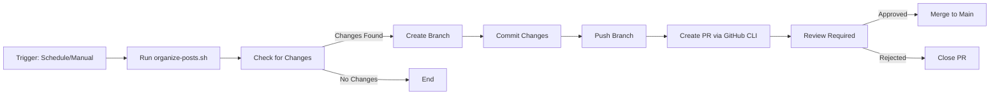

# Organize Posts Weekly Workflow Documentation

## Overview

The Weekly Post Organization workflow (`organize-posts-weekly.yml`) automatically organizes blog posts in the `pages/_posts/` directory based on their frontmatter metadata. The workflow runs on a schedule and can also be triggered manually.

**Key Features:**
- Organizes posts into subdirectories by section
- Archives posts older than a configurable threshold
- Creates pull requests for review before merging changes
- Uses standard GitHub Actions (git + GitHub CLI)

## Workflow Behavior

### Scheduled Execution
- **Schedule**: Every Sunday at 2 AM UTC
- **Automatic**: No manual intervention required
- **Output**: Creates a PR if changes are detected

### Manual Execution
- **Trigger**: Via GitHub Actions UI
- **Options**:
  - `dry_run`: Preview changes without creating a PR
  - `archive_threshold_months`: Configure age threshold for archiving (default: 3 months)

## How It Works

### Process Flow



### Implementation Details

#### Step 1: Create Branch and Commit Changes
```yaml
- name: 'Create Branch and Commit Changes'
  run: |
    BRANCH_NAME="automated/organize-posts-${{ github.run_id }}"
    git checkout -b "$BRANCH_NAME"
    git add pages/_posts/
    git commit -m "🤖 Weekly post organization and archiving"
    git push origin "$BRANCH_NAME"
```

#### Step 2: Create Pull Request with GitHub CLI
```yaml
- name: 'Create Pull Request with GitHub CLI'
  env:
    GH_TOKEN: ${{ secrets.GITHUB_TOKEN }}
  run: |
    gh pr create \
      --title "🤖 Weekly Post Organization - ${{ github.run_id }}" \
      --body-file pr_body.md \
      --base main \
      --label "automated" \
      --label "content-organization" \
      --label "posts" \
      --assignee "bamr87"
```

## Migration History

### Version 2.0 (November 2025) - PR-Based Workflow with GitHub CLI

**What Changed:**
- Replaced direct push to main with PR-based approval workflow
- Replaced third-party `peter-evans/create-pull-request` action with native GitHub CLI
- Split PR creation into two explicit steps for better control

**Before (Direct Push):**
```yaml
- name: 'Commit and Push Changes'
  run: |
    git add pages/_posts/
    git commit -m "$commit_msg"
    git push origin main  # ❌ Direct push - no review
```

**After (PR-Based with GitHub CLI):**
```yaml
# Step 1: Create branch and commit
- name: 'Create Branch and Commit Changes'
  run: |
    BRANCH_NAME="automated/organize-posts-${{ github.run_id }}"
    git checkout -b "$BRANCH_NAME"
    git add pages/_posts/
    git commit -m "🤖 Weekly post organization"
    git push origin "$BRANCH_NAME"

# Step 2: Create PR using GitHub CLI
- name: 'Create Pull Request with GitHub CLI'
  env:
    GH_TOKEN: ${{ secrets.GITHUB_TOKEN }}
  run: |
    gh pr create \
      --title "🤖 Weekly Post Organization - ${{ github.run_id }}" \
      --body-file pr_body.md \
      --base main \
      --label "automated" \
      --label "content-organization" \
      --label "posts" \
      --assignee "bamr87"
```

**Benefits of Current Implementation:**
1. ✅ **Review Process**: All automated changes go through PR review
2. ✅ **Traceability**: Each PR links back to the workflow run
3. ✅ **Safety**: Changes can be reviewed and rejected if needed
4. ✅ **Transparency**: Clear documentation in PR body
5. ✅ **Native Tools**: Uses standard GitHub Actions (no third-party dependencies)
6. ✅ **Explicit Control**: Two-step process for better debugging

## Pull Request Format

When the workflow detects changes, it creates a PR with the following format:

**Title:** `🤖 Weekly Post Organization - {run_id}`

**Body:**
```markdown
## 📋 Automated Post Organization

This PR was automatically generated by the Weekly Post Organization workflow.

### 📊 Summary
- **Workflow Run**: [12345678](https://github.com/bamr87/it-journey/actions/runs/12345678)
- **Triggered**: Scheduled (Weekly) / Manual Dispatch
- **Archive Threshold**: 3 months

### 📁 Changes Made
- Organized X posts into subdirectories by section
- Archived Y posts (>3 months old)

### ✅ Next Steps
1. Review the organized file structure
2. Verify posts are in correct subdirectories
3. Merge this PR to apply changes

---
*Generated by: Weekly Post Organization and Archiving workflow*
```

**Metadata:**
- **Labels**: `automated`, `content-organization`, `posts`
- **Assignee**: `bamr87`
- **Branch**: `automated/organize-posts-{run_id}`

## Testing

### Manual Test
1. Go to: **Actions** → **Weekly Post Organization and Archiving**
2. Click: **Run workflow**
3. Options:
   - Set `dry_run: false` to create an actual PR
   - Set `archive_threshold_months: 3` (or desired value)
4. Verify: PR is created with correct configuration

### Dry-Run Test
1. Go to: **Actions** → **Weekly Post Organization and Archiving**
2. Click: **Run workflow**
3. Set: `dry_run: true`
4. Verify: Logs show preview, no PR created

### Scheduled Test
- Workflow runs automatically every Sunday at 2 AM UTC
- Check Actions tab after Sunday 2 AM for automatic PR

## Scripts

The workflow uses these scripts (no changes required):

- **`organize-posts.py`**: Python script that organizes posts based on frontmatter
- **`organize-posts.sh`**: Bash wrapper for the Python script

Both scripts work correctly with the PR-based workflow.

## Troubleshooting

### PR Not Created
- Check workflow logs for errors
- Verify changes were detected (`CHANGES_MADE` output)
- Ensure GitHub token has correct permissions

### Branch Not Deleted
- Branch auto-deletion can be configured in repository settings
- Alternatively, branches can be manually deleted after PR merge

### Workflow Not Triggering
- Check cron schedule syntax
- Verify workflow file is in `.github/workflows/`
- Ensure workflow is enabled in repository settings

## Related Documentation

- [GitHub Actions Overview](./GITHUB_ACTIONS.md)
- [Scripts Guide](../scripts/SCRIPTS_GUIDE.md)
- [Frontmatter Standards](../standards/FRONTMATTER_STANDARDS.md)

## Technical Reference

**Workflow File:** `.github/workflows/organize-posts-weekly.yml`  
**Script Location:** `scripts/development/content/organize-posts.sh`  
**Python Script:** `scripts/development/content/organize-posts.py`  
**Schedule:** `0 2 * * 0` (Every Sunday at 2 AM UTC)  
**Permissions Required:**
- `contents: write` (for creating branches and commits)
- `pull-requests: write` (for creating PRs)
