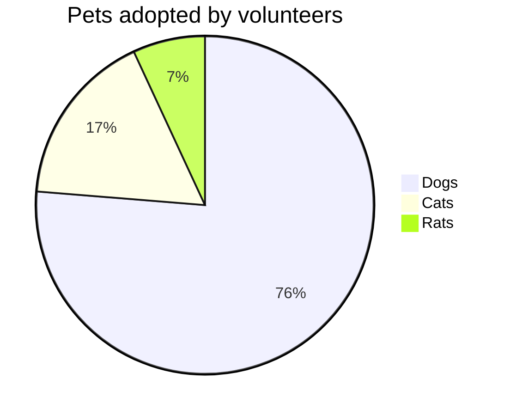

Hello world, and welcome to my site. Click on `Home` in the navigation bar to get started.
This is the main landing page and it is still a work in process.

Nothing to see here. Yet... but try clicking on the gear icon for a sneak peek.

## Features
{: .collapse .collapsed .breadcrumbs-intro }
- [x] Github Pages compatible
- [ ] Bootstrap 5 CDN
- [x] Algolia Search indexing
- [x] Jekyll Site Generation
- [x] Travic CI Build Automation
- [x] Health Status/Monitoring (Build)
- [x] Dark Mode toggle
- [x] JQuery Plugin
- [x] Auto generated right side bar TOC
- [x] Right side quick edit links to GitHub and VS Code
- [x] Left side accordion Navigation (based on nav data file)
- [x] Code Copy button
- [x] Back to top button in mobile view [w3schools](https://www.w3schools.com/howto/howto_js_scroll_to_top.asp)
- [x] Category filter for posts
- [x] Code syntax highlighting
- [x] Programming Language cheat sheets
{: .alert .alert-secondary .collapse .collapsed .breadcrumbs-intro }

### FIXME:
{: .collapse .collapsed .breadcrumbs-intro }
- [ ] Adjust menu toggle in Mobile view
- [ ] fix presentation of search results
- [ ] Need to fix quick index in side bar
{: .alert .alert-secondary .collapse .collapsed .breadcrumbs-intro }

### TODO:
{: .collapse .collapsed .breadcrumbs-intro }
- [ ] Add create new post button
- [ ] add floating "back to top" button
- [ ] create custom svg icon
- [ ] quick view of post contents/reading time
- [ ] [doc example](https://tmuxp.git-pull.com/index.html)
- [ ] [Quest](/quests/home)
- [ ] Adjust menu toggle in Mobile view
- [ ] leader board for level progression
- [ ] Add keyboard shortcuts (e.g. ctl + / to toggle search)
- [ ] Build Site map page [example](http://www.publicdomainsherpa.com/site-map.html)
- [ ] Publish training article on [Programming Historian](https://programminghistorian.org/) 
- [ ] Add search functionality
- [ ] Add tab functionality https://idratherbewriting.com/documentation-theme-jekyll/mydoc_navtabs.html
- [ ] Add GUI instructions for the n00bs
- [ ] Add language title to code blocks
- [ ] Integrate Jupyter Notebooks into the site
- [ ] add embedded todo button for viewing
- [ ] update SEO, document setup https://jsinibardy.com/optimize-seo-jekyll
- [ ] add next/back button to turn pages
- [ ] enhance right side bar design - [example](https://bootstrap-themes.github.io/dashboard/docs/#whats-included)
- [ ] Cross reference features to documentation
- [ ] alternate TOC structures (easy/med/hard) (pc/mac/linux) (by role)
- [ ] add a tool kit page with all software tools used
- [ ] Contribution Instructions
- [ ] add [plugins](https://jekyllcodex.org/without-plugins/) without plugins
- [ ] Auto integrate/embed source code files into documentation
- [ ] UI testing automation - [Selenium](https://www.selenium.dev/)
- [ ] page revision view (diff)
- [ ] integrate kanban board
- [ ] build account based system
- [ ] simulate generic business operations
- [ ] build backend todo interface checking
{: .collapse .collapsed .breadcrumbs-intro .alert .alert-primary}

## Examples
{: .collapse .collapsed .breadcrumbs-intro }

{{ styles }}

{: .collapse .collapsed .breadcrumbs-intro }
