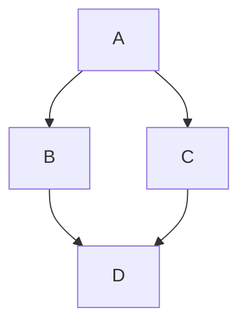

<link rel="stylesheet" href="{{ '/assets/css/contributor-profile.css' | relative_url }}">



---

## 📜 Personal Scroll

- 👋 Hi, I’m @bamr87
- 🤖 I’m interested in the achitecture of information systems that facilitate to production of goods and services
- 📚 I'm currently learning front-end development, specfically for Content Management Systems (it-journey.dev)
- 🧐 I’m looking to collaborate on developing frontend frameworks for small businesses
- 📫 You can reach me at @bamr87

Here's some of my progress:

[](https://roadmap.sh/u/bamr87)

[](https://roadmap.sh/u/bamr87)

<!---
bamr87/bamr87 is a ✨ special ✨ repository because its `README.md` (this file) appears on your GitHub profile.
You can click the Preview link to take a look at your changes.
--->

<summary>Add this repo as a sub-tree</summary>
<details>
   
</details>

```shell

cd ~/github/it-journey

# Add the GitHub profile repository as a remote repository

git remote add {{ page.username }} https://github.com/{{ page.username }}/{{ page.username }}.git

# Add the remote repository as a subtree

git subtree add --prefix=pages/_about/contributors/{{ page.username }} {{ page.username }} main

```

> [!NOTE]
> Useful information that users should know, even when skimming content.

> [!TIP]
> Helpful advice for doing things better or more easily.

> [!IMPORTANT]
> Key information users need to know to achieve their goal.

> [!WARNING]
> Urgent info that needs immediate user attention to avoid problems.

> [!CAUTION]
> Advises about risks or negative outcomes of certain actions
Note: > This is a note

Favorite Dish

| Qty   |  UM  | Ingredient                    | Notes                               |
| :---- | :--: | :---------------------------- | ----------------------------------- |
| 1 1/2 |  lb  | Chinese eggplants             | 680g or 3 large                     |
| 1½    | tbsp | Sichuan chile bean paste      |                                     |
| 1½    | tbsp | finely chopped garlic         |                                     |
| 1     | tbsp | finely chopped ginger         |                                     |
| 10    | tbsp | hot stock or water            | 150ml                               |
| 1     | tbsp | superfine sugar               |                                     |
| 1     | tsp  | light soy sauce               |                                     |
| 1     | tbsp | potato (or corn) starch       | mixed with 1 tbsp cold water (roux) |
| 1     | tbsp | Chinkiang vinegar             |                                     |
| 6     | tbsp | thinly sliced scallion greens |                                     |
| 5     | tbsp | Cooking oil, for deep-frying  |                                     |
| 1     | tbsp | Salt                          |                                     |

Here is a simple flow chart:



## Geo

```geojson
{
  "type": "FeatureCollection",
  "features": [
    {
      "type": "Feature",
      "id": 1,
      "properties": {
        "ID": 0
      },
      "geometry": {
        "type": "Polygon",
        "coordinates": [
          [
              [-90,35],
              [-90,30],
              [-85,30],
              [-85,35],
              [-90,35]
          ]
        ]
      }
    }
  ]
}
```

## 3D Model 

```stl
solid cube_corner
  facet normal 0.0 -1.0 0.0
    outer loop
      vertex 0.0 0.0 0.0
      vertex 1.0 0.0 0.0
      vertex 0.0 0.0 1.0
    endloop
  endfacet
  facet normal 0.0 0.0 -1.0
    outer loop
      vertex 0.0 0.0 0.0
      vertex 0.0 1.0 0.0
      vertex 1.0 0.0 0.0
    endloop
  endfacet
  facet normal -1.0 0.0 0.0
    outer loop
      vertex 0.0 0.0 0.0
      vertex 0.0 0.0 1.0
      vertex 0.0 1.0 0.0
    endloop
  endfacet
  facet normal 0.577 0.577 0.577
    outer loop
      vertex 1.0 0.0 0.0
      vertex 0.0 1.0 0.0
      vertex 0.0 0.0 1.0
    endloop
  endfacet
endsolid
```
