# 📜 The Agentic Codex
## Study Hub for Exam GH-600: Developing in Agentic AI Systems

*Deep within the GitHub Citadel, an ancient order guards the Agentic Codex — a tome of forbidden knowledge describing how autonomous agents are summoned, bound, and governed within the Software Development Life Cycle. Only those who master all six disciplines of the Codex earn the title of Agentic Architect.*

*This is your map.*

---

## 📊 Exam at a Glance

| | |
|---|---|
| **Exam** | GH-600: Developing in Agentic AI Systems |
| **Passing Score** | 700 / 1000 |
| **Renewal** | Annual (free online assessment) |
| **Stack** | GitHub Copilot · GitHub Actions · MCP · GitHub Models API |
| **Official Study Guide** | [learn.microsoft.com/credentials/certifications/resources/study-guides/gh-600](https://learn.microsoft.com/en-us/credentials/certifications/resources/study-guides/gh-600) |
| **Learning Paths** | [Microsoft Learn — Foundations of Agentic AI in GitHub](https://learn.microsoft.com/training/) |

### Domain Weights

| # | Domain | Weight | Quest Count |
|---|---|---|---|
| 1 | [Prepare Agent Architecture & SDLC Processes](#domain-1) | 15–20% | 3 |
| 2 | [Implement Tool Use & Environment Interaction](#domain-2) | 20–25% | 4 |
| 3 | [Manage Memory, State & Execution](#domain-3) | 10–15% | 3 |
| 4 | [Perform Evaluation, Error Analysis & Tuning](#domain-4) | 15–20% | 3 |
| 5 | [Orchestrate Multi-Agent Coordination](#domain-5) | 15–20% | 4 |
| 6 | [Implement Guardrails & Accountability](#domain-6) | 10–15% | 3 (inc. capstone) |

---

## 🗺️ Quest Map — The Agentic Codex

```mermaid
graph TD
    Start([🌟 Begin: The Agentic Codex]) --> D1

    subgraph D1["⚙️ Domain 1: Agent Architecture & SDLC (15-20%)"]
        Q1[Q1: Initiation Rites\nSDLC Integration]
        Q2[Q2: The Three Sigils\nPlan vs. Action Boundaries]
        Q3[Q3: The All-Seeing Eye\nObservability & Control]
    end

    subgraph D2["🔧 Domain 2: Tool Use & Environment (20-25%)"]
        Q4[Q4: Forging the Arsenal\nTool Selection & Permissions]
        Q5[Q5: The MCP Conclave\nMCP Server Mastery]
        Q6[Q6: Bind the Realm\nDev Environment Integration]
        Q7[Q7: Shield of Retries\nSafe Execution & Error Handling]
    end

    subgraph D3["🧠 Domain 3: Memory, State & Execution (10-15%)"]
        Q8[Q8: Vaults of Recollection\nMemory Strategies]
        Q9[Q9: Anchoring the Drifting Agent\nState Persistence & Drift]
        Q10[Q10: Crossing Tool Planes\nState Continuity Cross-Tools]
    end

    subgraph D4["📊 Domain 4: Evaluation & Tuning (15-20%)"]
        Q11[Q11: The Oracle's Rubric\nSuccess Criteria & Signals]
        Q12[Q12: The Necromancer's Inquest\nFailure Root Cause Analysis]
        Q13[Q13: Reforging the Agent's Mind\nBehavior Tuning]
    end

    subgraph D5["🕸️ Domain 5: Multi-Agent Coordination (15-20%)"]
        Q14[Q14: The Council of Many\nOrchestration Patterns]
        Q15[Q15: The Scribe's Codex\nMulti-Agent Observability]
        Q16[Q16: When Familiars Fall\nFailure & Recovery]
        Q17[Q17: The Agent Pantheon\nLifecycle Management]
    end

    subgraph D6["🛡️ Domain 6: Guardrails & Accountability (10-15%)"]
        Q18[Q18: The Autonomy Scales\nAutonomy Levels Matrix]
        Q19[Q19: The Warden's Pact\nGuardrails & Human-in-Loop]
        CAP[🏆 CAPSTONE: Trial of the\nAgentic Codex]
    end

    D1 --> D2
    D2 --> D3
    D3 --> D4
    D4 --> D5
    D5 --> D6

    style Start fill:#4CAF50,stroke:#2E7D32,stroke-width:3px,color:#fff
    style CAP fill:#FFD700,stroke:#F57F17,stroke-width:4px,color:#000
```

---

## 📚 The Quest Line — Ordered Learning Path

### Domain 1 — Prepare Agent Architecture & SDLC Processes {#domain-1}
*Level: 0111 (Journeyman ⚔️) → builds on API & integration skills*

| Quest | Title | Difficulty | Time | GH-600 Sub-Skill |
|---|---|---|---|---|
| Q1 | [Initiation Rites: Embedding Agents in the SDLC](/quests/gh-600/agentic-sdlc-integration/) | 🟡 Medium | 90 min | Integrate agents into the SDLC |
| Q2 | [The Three Sigils: Plan, Reason, Act](/quests/gh-600/agentic-plan-vs-action-boundaries/) | 🟡 Medium | 90 min | Define boundaries between planning, reasoning, and action |
| Q3 | [The All-Seeing Eye: Observability & Control](/quests/gh-600/agentic-observability-and-control/) | 🟡 Medium | 90 min | Configure observability and control for autonomous agents |

### Domain 2 — Implement Tool Use & Environment Interaction {#domain-2}
*Level: 1000 (Expert 🔥) → cloud-native GitHub tooling*

| Quest | Title | Difficulty | Time | GH-600 Sub-Skill |
|---|---|---|---|---|
| Q4 | [Forging the Agent's Arsenal](/quests/gh-600/agentic-tool-selection-and-permissions/) | 🟡 Medium | 90 min | Select and configure agent tools |
| Q5 | [The MCP Conclave](/quests/gh-600/agentic-mcp-server-mastery/) | 🔴 Hard | 120 min | Configure MCP servers |
| Q6 | [Bind the Agent to the Realm](/quests/gh-600/agentic-dev-environment-integration/) | 🔴 Hard | 120 min | Integrate agents within development environments |
| Q7 | [The Shield of Retries](/quests/gh-600/agentic-safe-execution-and-error-handling/) | 🔴 Hard | 120 min | Operate agents with safe execution paths and robust error handling |

### Domain 3 — Manage Memory, State & Execution {#domain-3}
*Level: 1001 → 1010 (Expert 🔥) → advanced state management*

| Quest | Title | Difficulty | Time | GH-600 Sub-Skill |
|---|---|---|---|---|
| Q8 | [Vaults of Recollection: Memory Strategies](/quests/gh-600/agentic-memory-strategies/) | 🔴 Hard | 90 min | Implement agent memory strategies |
| Q9 | [Anchoring the Drifting Agent](/quests/gh-600/agentic-state-persistence-and-drift/) | 🔴 Hard | 90 min | Persist agent state and manage context drift |
| Q10 | [Crossing the Tool Planes](/quests/gh-600/agentic-state-continuity-cross-tools/) | 🔴 Hard | 90 min | Ensure continuity of agent memory and state across tools |

### Domain 4 — Perform Evaluation, Error Analysis & Tuning {#domain-4}
*Level: 1010 (Expert 🔥) → evaluation harnesses and signal analysis*

| Quest | Title | Difficulty | Time | GH-600 Sub-Skill |
|---|---|---|---|---|
| Q11 | [The Oracle's Rubric](/quests/gh-600/agentic-success-criteria-and-signals/) | 🟡 Medium | 90 min | Define success criteria and evaluation signals |
| Q12 | [The Necromancer's Inquest](/quests/gh-600/agentic-failure-root-cause-analysis/) | 🔴 Hard | 90 min | Analyze agent failures and identify root causes |
| Q13 | [Reforging the Agent's Mind](/quests/gh-600/agentic-behavior-tuning/) | 🔴 Hard | 120 min | Tune agent behavior based on evaluation results |

### Domain 5 — Orchestrate Multi-Agent Coordination {#domain-5}
*Level: 1011 (Expert 🔥) → orchestration and resilience patterns*

| Quest | Title | Difficulty | Time | GH-600 Sub-Skill |
|---|---|---|---|---|
| Q14 | [The Council of Many: Orchestration Patterns](/quests/gh-600/agentic-multi-agent-orchestration-patterns/) | 🔴 Hard | 120 min | Operate and manage multi-agent workflows |
| Q15 | [The Scribe's Codex: Multi-Agent Observability](/quests/gh-600/agentic-multi-agent-observability/) | 🔴 Hard | 90 min | Configure observability for multi-agent behavior |
| Q16 | [When Familiars Fall: Failure & Recovery](/quests/gh-600/agentic-multi-agent-failure-recovery/) | 🔴 Hard | 90 min | Detect and respond to multi-agent failures |
| Q17 | [The Agent Pantheon: Lifecycle Management](/quests/gh-600/agentic-multi-agent-lifecycle-management/) | ⚔️ Epic | 120 min | Manage the lifecycle of agents within multi-agent workflows |

### Domain 6 — Implement Guardrails & Accountability {#domain-6}
*Level: 1100 (Expert 🔥 → Legend 🏆) → responsible autonomy*

| Quest | Title | Difficulty | Time | GH-600 Sub-Skill |
|---|---|---|---|---|
| Q18 | [The Autonomy Scales](/quests/gh-600/agentic-autonomy-levels-matrix/) | 🔴 Hard | 90 min | Define autonomy levels |
| Q19 | [The Warden's Pact](/quests/gh-600/agentic-guardrails-and-human-in-the-loop/) | 🔴 Hard | 120 min | Implement guardrails and human-in-the-loop workflows |
| 🏆 | [**CAPSTONE: Trial of the Agentic Codex**](/quests/gh-600/agentic-codex-capstone-exam-trial/) | ⚔️ Epic | 240 min | All 6 domains integrated |

---

## 📖 Chronicle Posts

*Development sessions documented in real time — see every quest built live.*

| Post | Domain(s) | Category |
|---|---|---|
| [Launching the Agentic Codex: A GH-600 Learning Track for GitHub Native AI](/posts/launching-agentic-codex-gh-600-track/) | All | ai-agents |
| [Embedding Agents in the SDLC — What Actually Changes](/posts/embedding-agents-in-the-sdlc/) | D1 | ai-agents |
| [MCP Servers and Agent Tooling in Practice](/posts/mcp-servers-and-agent-tooling-in-practice/) | D2 | ai-agents |
| [Taming Agent Memory and Context Drift](/posts/taming-agent-memory-and-context-drift/) | D3 | ai-agents |
| [Evaluating and Tuning Agents with GitHub Signals](/posts/evaluating-and-tuning-agents-with-github-signals/) | D4 | ai-agents |
| [Orchestrating Multi-Agent Workflows on GitHub](/posts/orchestrating-multi-agent-workflows-on-github/) | D5 | ai-agents |
| [Agent Guardrails and Responsible Autonomy](/posts/agent-guardrails-and-responsible-autonomy/) | D6 | ai-agents |

---

## 🗒️ Quick-Reference Notes

| Note | Purpose |
|---|---|
| [Exam Overview & Logistics](/notes/gh-600/exam-overview/) | Scoring, scheduling, renewal |
| [Skills Checklist (Printable)](/notes/gh-600/skills-checklist/) | All 19 sub-skills as checkboxes |
| [Copilot Coding Agent Cheatsheet](/notes/gh-600/copilot-coding-agent-cheatsheet/) | Invocation, scopes, autonomous-PR pattern |
| [MCP Quick Reference](/notes/gh-600/mcp-quickref/) | Server config, registries, allow-list syntax |
| [Autonomy Levels Matrix](/notes/gh-600/autonomy-levels-matrix/) | Risk classification decision table |
| [Evaluation Signals Table](/notes/gh-600/evaluation-signals-table/) | Qualitative vs quantitative signals |
| [Glossary](/notes/gh-600/glossary/) | Agent, MCP, HITL, drift, autonomy, ... |

---

## 🧰 Recommended Resources

See the full [Recommended Resources](recommended-resources/) page for Microsoft Learn paths, GitHub documentation, MCP specification links, and the GitHub Models API reference.

See the [Week-by-Week Learning Path](learning-path/) for a structured study schedule with time estimates and daily objectives.

---

## 🕸️ Knowledge Graph

*Structured wiki-links enable the Obsidian-style local knowledge graph for this hub. Click the graph button (bottom-left) to explore connections.*

**Domain 1 — SDLC Integration:** [[Initiation Rites: Embedding Agents in the SDLC]] · [[The Three Sigils: Plan, Reason, Act]]

**Domain 2 — Tools & Observability:** [[The MCP Conclave: Mastering Model Context Protocol Servers]] · [[The All-Seeing Eye: Observability & Control for Autonomous Agents]] · [[Forging the Agent's Arsenal: Tool Selection & Permissions]]

**Domain 3 — Memory & Context:** [[Bind the Agent to the Realm: Dev Environment Integration]] · [[Vaults of Recollection: Agent Memory Strategies]] · [[The Shield of Retries: Safe Execution and Error Handling]]

**Domain 4 — Evaluation:** [[The Oracle's Rubric: Defining Agent Success Criteria and Signals]] · [[The Necromancer's Inquest: Agent Failure Root Cause Analysis]] · [[Reforging the Agent's Mind: Behavior Tuning Through Instructions]] · [[Anchoring the Drifting Agent: State Persistence and Drift Prevention]] · [[Crossing the Tool Planes: State Continuity Across Tools]]

**Domain 5 — Multi-Agent:** [[The Council of Many: Multi-Agent Orchestration Patterns]] · [[The Scribe's Codex: Observability in Multi-Agent Systems]] · [[When Familiars Fall: Multi-Agent Failure Recovery]] · [[The Agent Pantheon: Multi-Agent Lifecycle Management]]

**Domain 6 — Guardrails:** [[The Autonomy Scales: Mapping Agent Autonomy Levels]] · [[The Warden's Pact: Guardrails and Human-in-the-Loop Patterns]] · [[Trial of the Agentic Codex: The Grand Capstone]]

**Reference Notes:** [[GH-600 Exam Overview]] · [[GH-600 Skills Checklist]] · [[GitHub Copilot Coding Agent Cheatsheet]] · [[MCP Quick Reference]] · [[Autonomy Levels Matrix]] · [[Evaluation Signals Table]] · [[GH-600 Glossary]] · [[GH-600 Agentic AI Quick-Reference Notes]]

---

## 🚀 Getting Started

**New to this track?** Follow these four steps in order:

1. **Read** the [Exam Overview](/notes/gh-600/exam-overview/) (5 min) to understand format and scoring.
2. **Self-assess** with the [Skills Checklist](/notes/gh-600/skills-checklist/) — tick off what you already know.
3. **Pick your pace** from the [Week-by-Week Learning Path](learning-path/) (default: 6 weeks at ~7 hrs/week).
4. **Begin** with [Q1: Initiation Rites](/quests/gh-600/agentic-sdlc-integration/) — the first quest of Domain 1.

**Already comfortable with Copilot agents?** Jump to [Domain 4 — Evaluation & Tuning](#domain-4) for the deepest material.

**Cramming for an upcoming exam?** Read the [Skills Measured](skills-measured/) breakdown, then attempt the [Capstone Trial](/quests/gh-600/agentic-codex-capstone-exam-trial/) as a diagnostic.

---

## ❓ Frequently Asked Questions

**Do I need a paid GitHub Copilot subscription?**  
Most quests work with the free Copilot trial. A small number of multi-agent and coding-agent quests benefit from an active Copilot Business or Enterprise plan but are not blocked without one.

**How long does the full track take?**  
About 40 hours of focused study spread over 6 weeks. Faster if you skip the chronicle posts; slower if you build out the optional sandbox in `work/gh-600/`.

**What if the official exam updates?**  
We track the official [GH-600 Study Guide](https://learn.microsoft.com/en-us/credentials/certifications/resources/study-guides/gh-600) and refresh quests when sub-skills change. The PR that introduced this track ([#272](https://github.com/bamr87/it-journey/pull/272)) is the baseline; subsequent updates live in the repository's release notes.

**Is the capstone equivalent to the real exam?**  
No — it is a *diagnostic*, not a practice exam. It surfaces blind spots; it does not predict your score.

**Can I contribute fixes or additional quests?**  
Yes. See the contribution guidance on the [certifications hub](../) and open an issue first to align scope.

---

## 📜 Track Maintenance

| | |
|---|---|
| Last reviewed | 2026-05-17 |
| Validator status | 21/21 quests passing |
| Mermaid rendering | Enabled on all 20 quest pages |
| Wiki-link graph | 28 edges from hub, 2–3 per note |
| Issue tracker label | [`cert:gh-600`](https://github.com/bamr87/it-journey/labels/cert%3Agh-600) |

Spotted a stale link or outdated reference? Open an issue with the `cert:gh-600` label so it joins the next maintenance pass.
