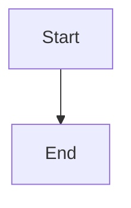

# Jekyll in IT-Journey

This section contains Jekyll documentation specific to how IT-Journey implements and uses Jekyll as its static site generator.

## About This Documentation

**Purpose:** Educational resources for learning how IT-Journey uses Jekyll's features, specifically:
- Configuration options used in this repository
- Liquid templating as implemented in IT-Journey
- Frontmatter structure and CMS approach
- Mermaid diagrams integration
- MathJax mathematical notation
- Jekyll configuration reference

**Note:** For technical developer documentation about repository structure and contribution workflows, see the [`docs/` directory](../../docs/) in the repository root.

## Jekyll in IT-Journey

IT-Journey is a static site generator powered by Jekyll **{{ site.data.powered_by[1].version }}** running on Ruby **{{ site.data.powered_by[0].version }}**.

### Key Features

- **Collections System:** Organizing content into _posts, _docs, _quests, _notebooks, _notes, _about, and _quickstart
- **Remote Theme:** Using the [zer0-mistakes theme](https://github.com/bamr87/zer0-mistakes)
- **GitHub Pages:** Automated deployment via GitHub Pages
- **Markdown Processing:** GitHub Flavored Markdown via Kramdown
- **Plugins:** Jekyll plugins for SEO, feeds, sitemaps, and more

## Prerequisites

Jekyll requires the following:

* Ruby version **{{ site.data.ruby.min_version }}** or higher
* RubyGems
* GCC and Make

See the [Development Environment Setup](../../docs/setup/DEVELOPMENT_ENVIRONMENT.md) guide for detailed installation instructions.

## Available Documentation

### Configuration

- **[Jekyll Configuration](jekyll-config.md)** - Jekyll configuration options reference
- **[Frontmatter CMS](jekyll-frontmatter-cms.md)** - Using frontmatter as a content management system

### Templating

- **[Liquid Templating](jekyll-liquid.md)** - Liquid template language features used in IT-Journey

### Rich Content

- **[Mermaid Diagrams (Auto-Detection)](jekyll-diagram-with-mermaid.md)** - Zero-configuration diagram creation with automatic detection
- **[Migration Guide](mermaid-migration.md)** - Upgrading from manual to automatic Mermaid configuration
- **[Math Symbols with MathJax](jekyll-math-symbols-with-mathjax.md)** - Displaying mathematical notation

## 🎯 New: Mermaid Auto-Detection

**Zero Configuration Required!** The zer0-mistakes theme now automatically detects and renders Mermaid diagrams.

### Quick Usage

Simply use standard markdown code fences - no front matter needed:

````markdown

````

### Benefits

- ✅ **No configuration** - just use ```mermaid blocks
- ✅ **Better performance** - library loads only when needed
- ✅ **Impossible to forget** - automatic detection
- ✅ **GitHub Pages compatible** - works everywhere

[Learn more →](jekyll-diagram-with-mermaid.md) • [Migration guide →](mermaid-migration.md)

## Quick Start

### Local Development

```bash
# Clone the repository
git clone https://github.com/bamr87/it-journey.git
cd it-journey

# Install dependencies
bundle install

# Start development server
bundle exec jekyll serve --config _config_dev.yml

# Access at http://localhost:4002
```

### Creating Content

```bash
# Create a new post
touch pages/_posts/2025-10-13-my-new-post.md

# Add frontmatter
cat > pages/_posts/2025-10-13-my-new-post.md << 'EOF'
---
title: "My New Post"
description: "Brief description"
date: 2025-10-13T00:00:00.000Z
categories:
  - development
tags:
  - jekyll
---

# My New Post

Content goes here...
EOF
```

## IT-Journey Specific Implementation

### Collections Structure

IT-Journey uses Jekyll collections extensively:

```yaml
collections:
  posts:    # Blog posts and journals
  docs:     # Learning resources and references
  quests:   # Gamified learning experiences
  notebooks: # Jupyter notebooks
  notes:    # Personal development notes
  about:    # About pages and site information
  quickstart: # Quick reference guides
```

Each collection has specific frontmatter requirements and URL patterns. See [Frontmatter Standards](../../docs/standards/FRONTMATTER_STANDARDS.md) for details.

### Theme Integration

IT-Journey uses the `zer0-mistakes` remote theme:

```yaml
remote_theme: "bamr87/zer0-mistakes"
```

Local files override theme files, allowing customization while maintaining theme updates.

### Build Process

**Development:**
```bash
bundle exec jekyll serve --config _config_dev.yml
```

**Production:**
```bash
JEKYLL_ENV=production bundle exec jekyll build
```

**Docker:**
```bash
docker-compose up
```

## Troubleshooting

### Common Issues

**Port Already in Use**
```bash
# Find and kill process on port 4002
lsof -i :4002
kill -9 <PID>

# Or use different port
bundle exec jekyll serve --port 4003
```

**Build Fails**
```bash
# Check for errors
bundle exec jekyll build --verbose

# Run diagnostics
bundle exec jekyll doctor
```

**Missing Dependencies**
```bash
# Update gems
bundle update

# Reinstall
bundle install
```

## Additional Resources

### Developer Documentation
- [Repository Structure](../../docs/architecture/REPOSITORY_STRUCTURE.md) - Complete repository layout
- [Jekyll Implementation](../../docs/architecture/JEKYLL_IMPLEMENTATION.md) - Detailed Jekyll configuration
- [Development Environment Setup](../../docs/setup/DEVELOPMENT_ENVIRONMENT.md) - Complete setup guide
- [Contributing Guide](../../docs/CONTRIBUTING_DEVELOPER.md) - Contribution workflow

### External Resources
- [Jekyll Official Documentation](https://jekyllrb.com/docs/)
- [Liquid Template Language](https://shopify.github.io/liquid/)
- [GitHub Pages Documentation](https://docs.github.com/en/pages)
- [Kramdown Syntax](https://kramdown.gettalong.org/syntax.html)
- [zer0-mistakes Theme](https://github.com/bamr87/zer0-mistakes)

## Support

- **Developer Issues:** See [`docs/` directory](../../docs/) for technical documentation
- **Content Questions:** Review [Content Guidelines](../../docs/standards/CONTENT_GUIDELINES.md)
- **Setup Problems:** Check [Development Environment Setup](../../docs/setup/DEVELOPMENT_ENVIRONMENT.md)
- **General Help:** Create issue in [GitHub repository](https://github.com/bamr87/it-journey/issues)

---

*Last Updated: 2025-10-13*
