> **🎯 Mermaid diagrams are automatically detected and rendered. No configuration needed!**

## Overview

The zer0-mistakes theme includes automatic Mermaid diagram detection. Simply use standard markdown code fences - the system handles everything else automatically.

## Quick Start

1. **Write your diagram using code fences:**

````markdown
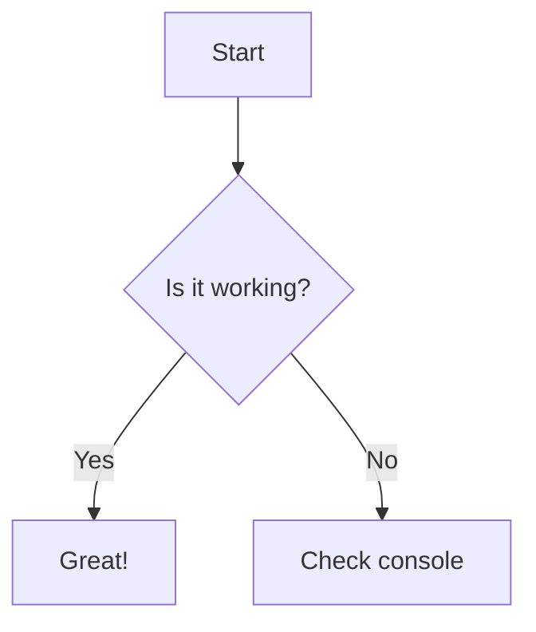
````

2. **That's it!** No front matter, no configuration needed.

## How It Works

### Auto-Detection Magic ✨

The theme automatically:
- **Scans page content** for ```mermaid code blocks
- **Detects HTML elements** with `<div class="mermaid">` syntax
- **Loads Mermaid.js dynamically** from CDN only when needed
- **Renders diagrams** with optimized theme settings
- **Handles all diagram types** without additional setup

### Performance Benefits 🚀

- **On-demand loading** - Library only loads on pages with diagrams
- **~200KB Mermaid.js** only downloaded when needed
- **Fast CDN delivery** with global caching
- **Zero impact** on pages without diagrams

## All Diagram Types Supported

### 1. Flowcharts

````markdown
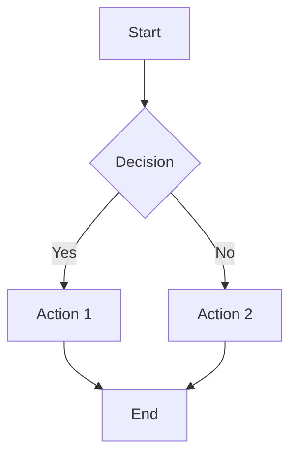
````

### 2. Sequence Diagrams

````markdown
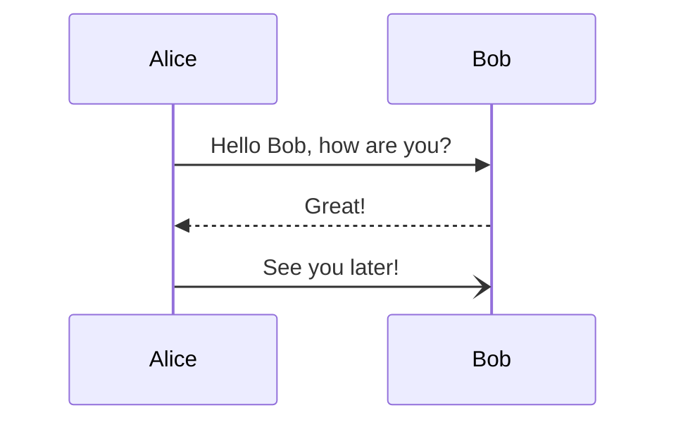
````

### 3. Class Diagrams

````markdown
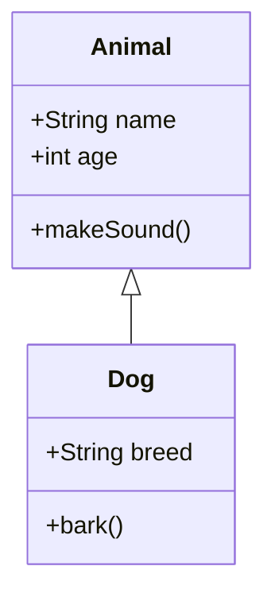
````

### 4. State Diagrams

````markdown
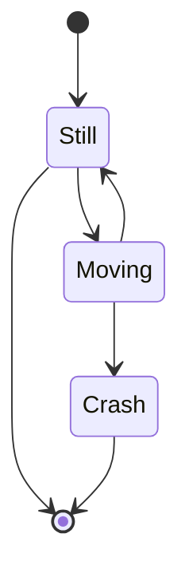
````

### 5. Entity Relationship Diagrams

````markdown
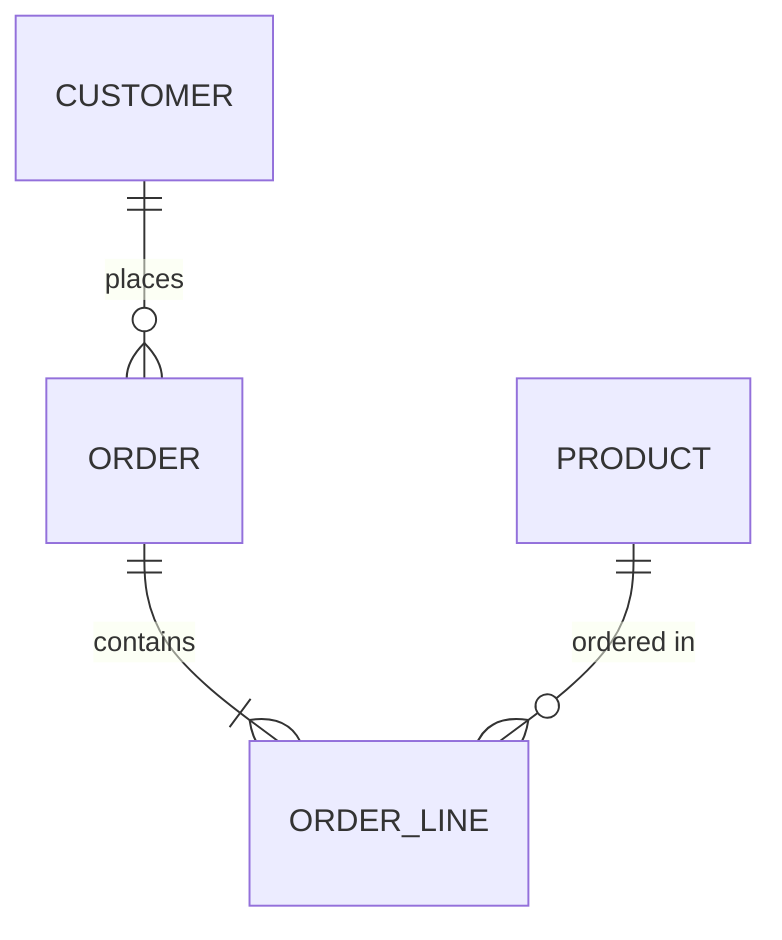
````

### 6. Gantt Charts

````markdown
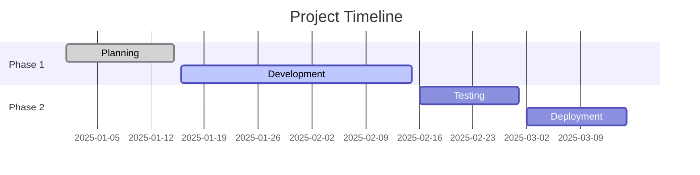
````

### 7. Pie Charts

````markdown
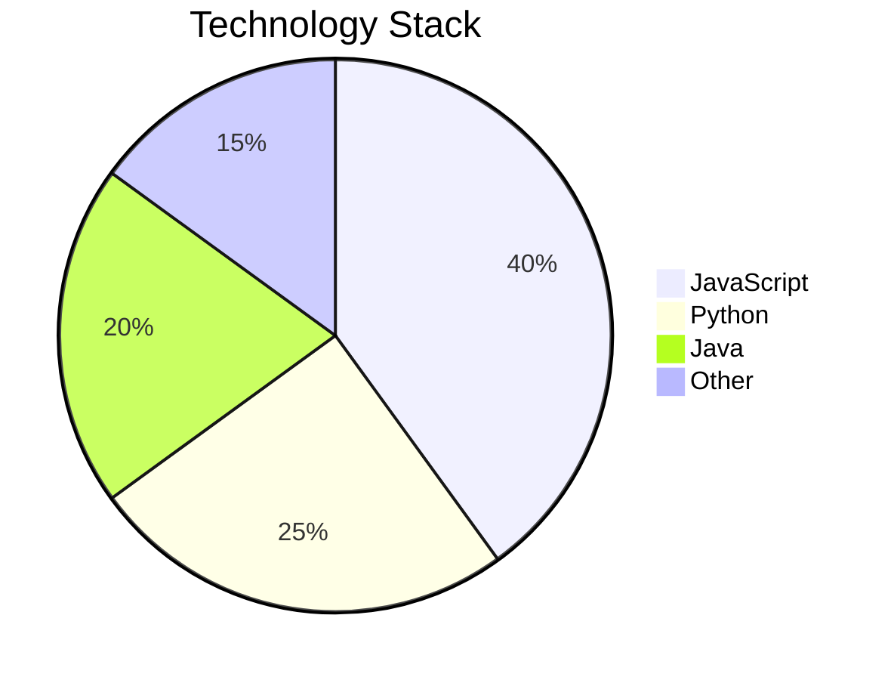
````

### 8. Git Graphs

````markdown
```mermaid
gitgraph
    commit
    branch develop
    checkout develop
    commit
    commit
    checkout main
    merge develop
    commit
```
````

### 9. Journey Diagrams

````markdown
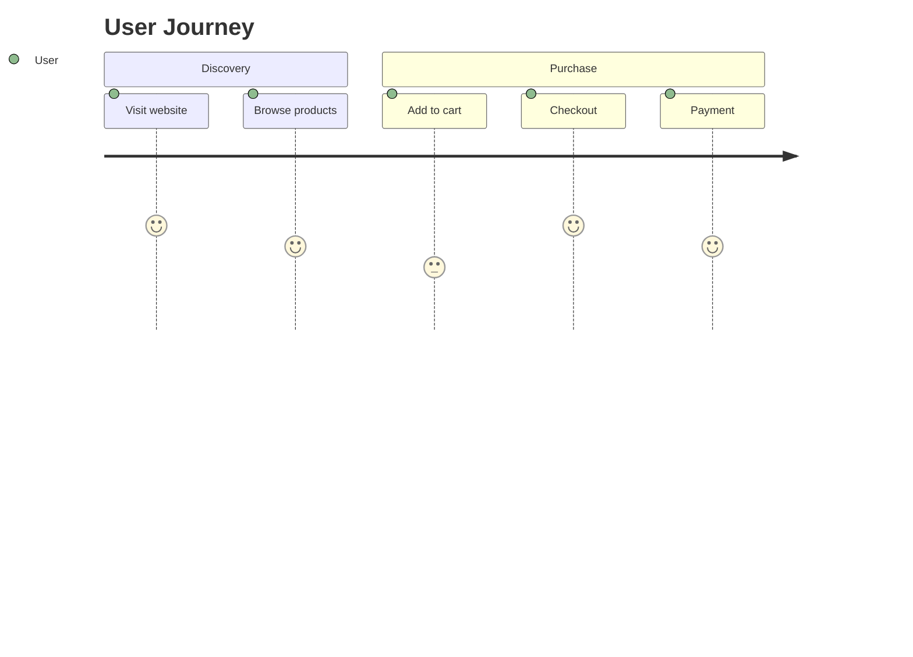
````

## Advanced Features

### FontAwesome Icons

````markdown
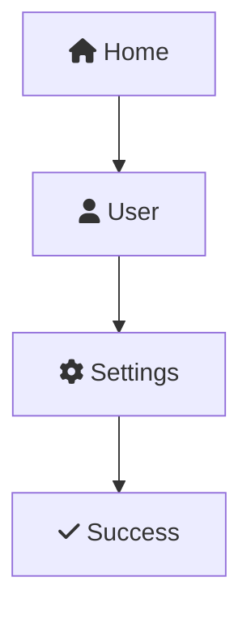
````

### Custom Styling

````markdown
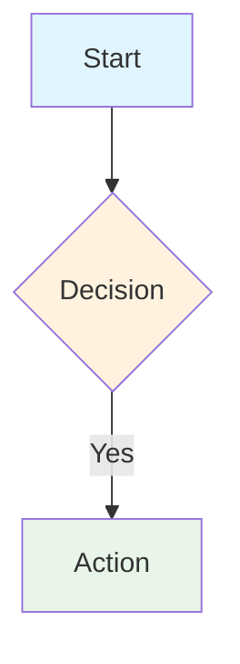
````

### Subgraphs

````markdown
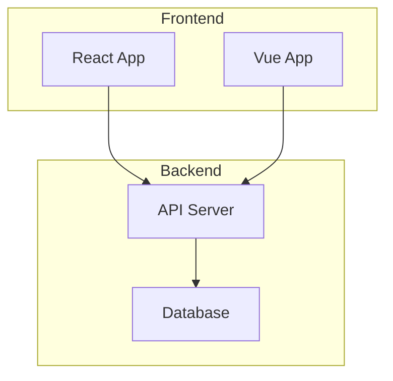
````

## Troubleshooting

### Diagrams Not Rendering? 🔧

1. **Check browser console** for JavaScript errors
2. **Validate syntax** at [mermaid.live](https://mermaid.live/)
3. **Ensure code fence** uses ```mermaid (not mermade, mermaud, etc.)
4. **Check network tab** to verify Mermaid.js loaded
5. **Verify theme** is using zer0-mistakes v0.5.0+

### Common Issues

**Issue**: Diagrams show as code blocks
- **Solution**: Check for typos in ```mermaid fence
- **Solution**: Ensure theme is up to date

**Issue**: Library not loading
- **Solution**: Check console for CDN errors
- **Solution**: Verify internet connection

**Issue**: Styling looks wrong
- **Solution**: Check for CSS conflicts
- **Solution**: Verify theme compatibility

### Manual Override

If you need to force Mermaid loading (rare cases):

````yaml
---
title: My Post
mermaid: true  # Force Mermaid loading
---
````

## Migration Guide

### Old Approach (Deprecated)

````yaml
---
title: My Post
mermaid: true  # Manual flag required
---
````

### New Approach (Automatic)

````yaml
---
title: My Post
# No flag needed! Auto-detection handles this
---
````

**Your old posts still work** (backwards compatible), but you can now remove the `mermaid: true` flags.

## Performance Comparison

### Before (Manual Configuration)
- ❌ Mermaid.js loaded site-wide if any post had `mermaid: true`
- ❌ Manual flag management required
- ❌ Easy to forget configuration
- ❌ Poor developer experience

### After (Auto-Detection)
- ✅ Mermaid.js loads only on pages with diagrams
- ✅ Zero configuration required
- ✅ Impossible to forget
- ✅ Better developer experience
- ✅ Improved performance

## Best Practices

1. **Use standard markdown fences** - ```mermaid blocks work everywhere
2. **Keep diagrams simple** - Complex diagrams may render slowly
3. **Test locally first** - Validate syntax before publishing
4. **Use meaningful labels** - Make diagrams self-documenting
5. **Consider mobile** - Ensure diagrams are readable on small screens

## Integration with Jekyll

### GitHub Pages Compatibility

The auto-detection works perfectly with GitHub Pages:
- No server-side plugins required
- Client-side detection after Jekyll renders HTML
- CDN loading ensures global availability
- Kramdown processes code fences correctly

### Theme Integration

The zer0-mistakes theme handles everything:
- Automatic detection in `_includes/components/mermaid-auto.html`
- Conditional loading in `_includes/core/head.html`
- Responsive styling and dark mode support
- Error handling and console logging

## Resources

- [Mermaid Live Editor](https://mermaid.live/) - Test your diagrams
- [Mermaid Documentation](https://mermaid.js.org/) - Complete syntax reference
- [Theme Documentation](https://bamr87.github.io/zer0-mistakes/) - Full theme guide
- [Migration Guide](mermaid-migration.md) - Upgrading from manual configuration

## AI Instructions

Setting up Jekyll to use Mermaid diagrams is now incredibly simple with the zer0-mistakes theme:

### 1. Use the Theme

Ensure your `_config.yml` includes:

````yaml
remote_theme: "bamr87/zer0-mistakes"
````

### 2. Write Diagrams

Simply use markdown code fences:

````markdown
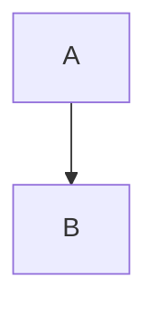
````

### 3. That's It!

No configuration, no front matter, no setup required. The theme automatically detects and renders your diagrams.

### Troubleshooting

If diagrams don't render:
1. Check browser console for errors
2. Verify theme version (v0.5.0+)
3. Test syntax at mermaid.live
4. Ensure proper code fence syntax

The auto-detection feature makes Mermaid integration seamless and eliminates common configuration errors.

## References

- [Mermaid Documentation](https://mermaidjs.github.io/)
- [Mermaid Live Editor](https://mermaidjs.github.io/mermaid-live-editor/)
- [Mermaid on GitHub](https://github.com/mermaid-js/mermaid)
- [Jekyll Remote Theme](https://github.com/benbalter/jekyll-remote-theme)
- [GitHub Pages Jekyll](https://pages.github.com/)