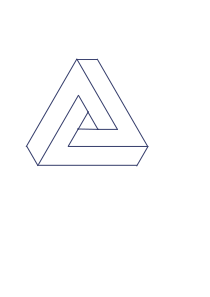
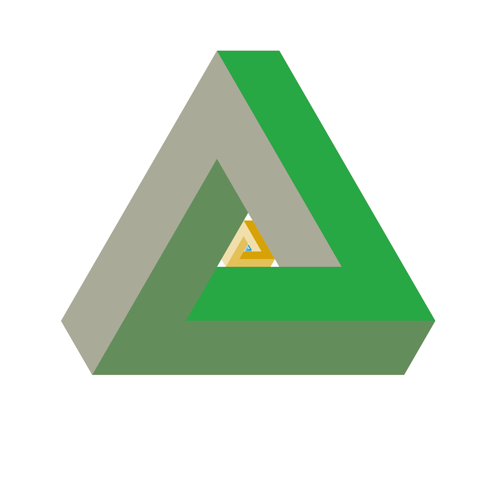

Symbol of impossibility [Wiki](https://en.wikipedia.org/wiki/Penrose_triangle)

Inkscape

```xml
<svg xmlns="http://www.w3.org/2000/svg" viewBox="0 0 400 400">
  <defs>
    <linearGradient id="gradient" x1="0" y1="0" x2="1" y2="1">
      <stop offset="0%" stop-color="#FF7F00" />
      <stop offset="100%" stop-color="#FF00FF" />
    </linearGradient>
    <clipPath id="clip">
      <polygon points="0,400 400,400 200,0" />
    </clipPath>
  </defs>
  <g clip-path="url(#clip)">
    <rect x="0" y="0" width="400" height="400" fill="url(#gradient)" />
    <polygon points="200,300 350,150 50,150" fill="none" stroke="#FFFFFF" stroke-width="10" stroke-linejoin="round" />
    <polygon points="200,100 350,250 50,250" fill="none" stroke="#FFFFFF" stroke-width="10" stroke-linejoin="round" />
  </g>
</svg>
```

<!--  -->

<!--  -->


<!--  -->


Krita

Generative AI Art

RGBA 1d522529


https://jekyllrb.com/docs/static-files/


<svg xmlns="http://www.w3.org/2000/svg" viewBox="0 0 800 800">
  <defs>
    <linearGradient id="gradient" x1="0" y1="0" x2="1" y2="1">
      <stop offset="0%" stop-color="#FF7F00" />
      <stop offset="100%" stop-color="#FF00FF" />
    </linearGradient>
    <clipPath id="clip">
      <polygon points="0,400 400,400 200,0" />
    </clipPath>
  </defs>
  <g clip-path="url(#clip)">
    <rect x="0" y="0" width="400" height="400" fill="url(#gradient)" />
    <polygon points="200,300 350,150 50,150" fill="none" stroke="#FFFFFF" stroke-width="10" stroke-linejoin="round" />
    <polygon points="200,100 350,250 50,250" fill="none" stroke="#FFFFFF" stroke-width="10" stroke-linejoin="round" />
  </g>
</svg>

