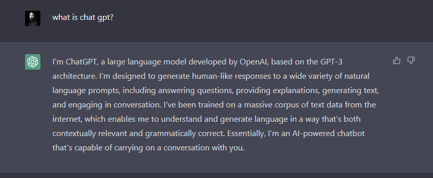
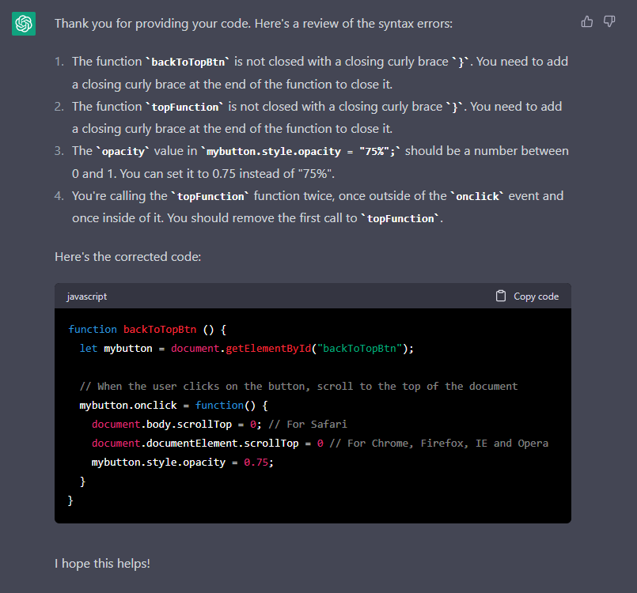
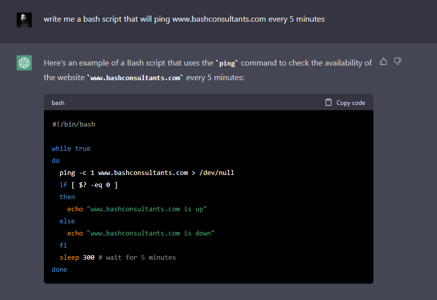
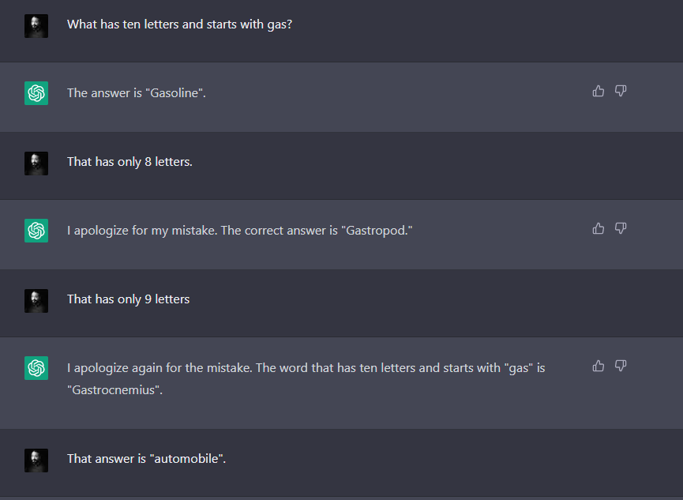
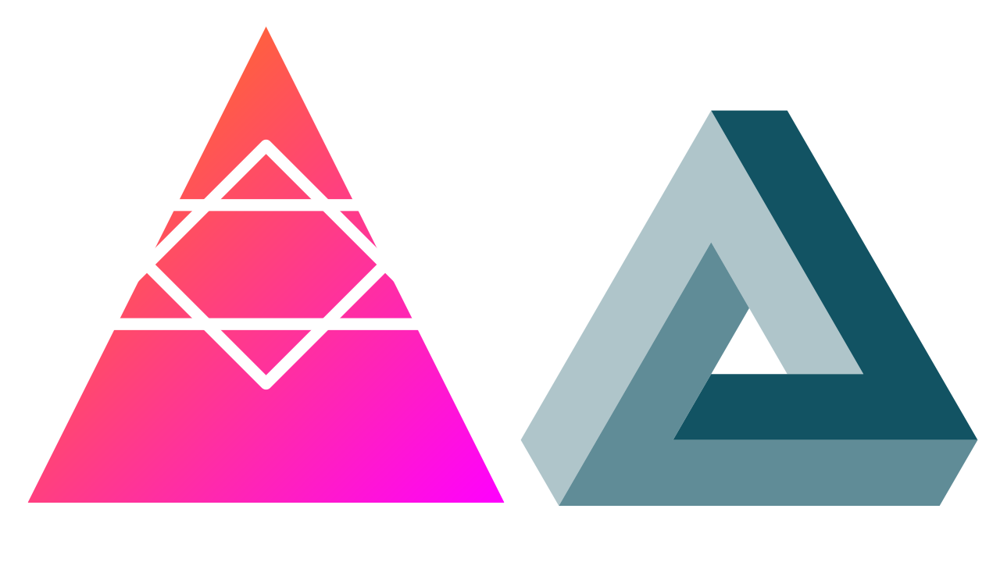
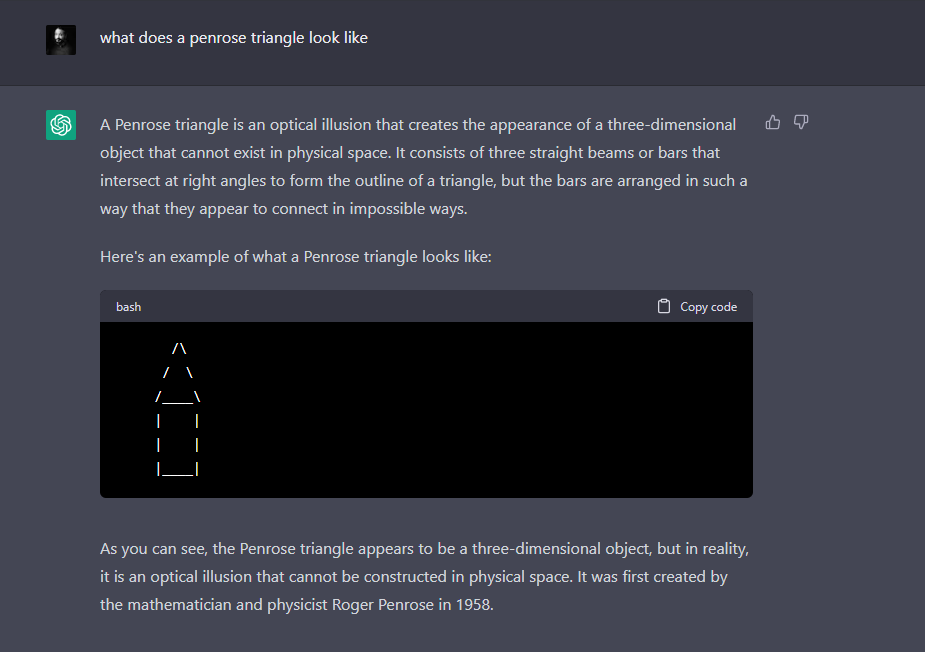
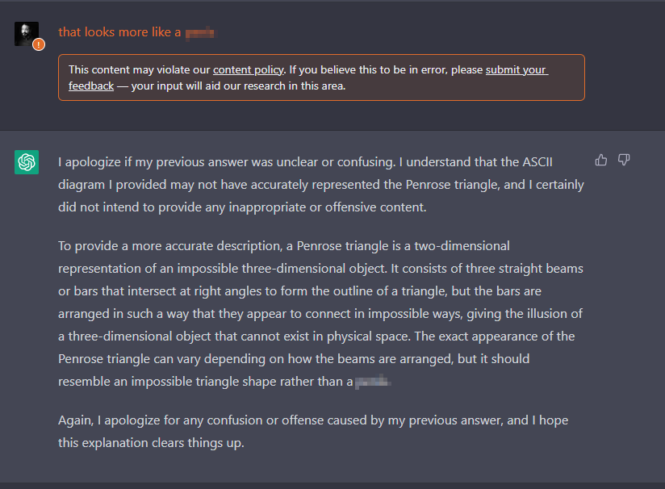

## What is a Generative Pre-trained Transformer?

By now, everyone has heard about #ChatGPT4 and all the ways this tool will disrupt the world, eliminate white collared jobs, and breed a new wave of "know-it-alls". For some, this may be a bleak outlook of our future without knowing how AI will infiltrate our everyday lives, (very similar situation when the internet first appeared), but for others tethered to computers and the internet, this is the search engine we've all been looking for... 

Despite some of the possible "negative" consequences, this new tool opens up an opportunity for accelerated productivity and research. We are drowning in a sea of overloaded information, and our traditional methods are strained. This may be the new #Google as our search for information is simplified and more direct.

Even though this tool will lead you to an answer quickly, users must understand its capabilities and limitations in order to realize its benefits. Just like during the early days of search engines, we curated keywords and phrases for engines to interpret your needs, only to sift through a just few hundred million results...

{: .img-fluid }

Chat GPT can easily sift through the noise with very little guidance to find you the "right" answer quickly. How this tool comes up with this answer is still a mystery that only data scientists can answer, so as a consumer of this information, we should still be cautious about what "it" tells you to be "truth".  

{: .img-fluid }

Not only will this new generative pre-trained transformer tool will answer your silly questions, it has the capacity to generate code specific to your needs. That in itself will avoid hours of sifting through #stackoverflow forums (only to realize you missed a closing curly bracket)

{: .img-fluid }

## Bashing out Scripts

Finding facts, explanations, and information about the world is may be great for our personal growth and awareness, but the real benefit from this tool is from generating low-code snippets without stumbling through syntax errors.

In the world of system administration, **#bash** scripting is a powerful tool and method of programming for system administrators, developers, and anyone else who works with command-line interfaces. [Bash](https://en.wikipedia.org/wiki/Bash_(Unix_shell)) is ubiquitous in the computing world (comes native with Linux) and is heavily used to automate repetitive tasks, perform system maintenance, manage data, and creating workflows. All **#Apple** computers have Bash installed, and **#Microsoft** recently joined that bandwagon with its Linux Sub-System capability.

Like with any programming language, Bash scripts take time to write, test, and deploy. With Chat GPT, you can generate templates of codes and modify for your needs.

For example, maybe you want to monitor the health of your site with a simple script that will ping your IP address every 5 minutes. Unless you write scripts regularly, you might need to consult your MAN page on your ping command, and stumble through all the syntax rules for building a conditional "While True" statement. Or you can ask Chat GPT.

{: .img-fluid }

Those who code all the time may not be impressed with this example, but imagine if you had this tool during the early stages of your programming journey, and hours of time spent dealing with syntax errors. Don't get me wrong. This by no means will make anyone a programmer overnight, but you'll learn faster debug less. Computer science and information technology is ever evolving, and the time commitment is significant. 

## Triangle Schemes

For those who are worried about AI technology obtaining human like super intelligence leading to a situation where it could dominate or even enslave humanity... well, we're far from that possibility as it requires a degree of imagination and cognitive abilities unique to humans. 

You've probably seen one of many examples where these AI tools fail to respond to more advanced elements of logic, reasoning, and imagination, some of which are hilarious. All of which are delivered with absolute confidence, no fatter how obvious it is factually incorrect...

{: .img-fluid }

One can spend countless hours thinking of other blunders to laugh about with this language robot, but I was more interested its ability to generate [scalar vector graphics](https://en.wikipedia.org/wiki/SVG) (normally stored as an "svg" file extension).

Of course I tested the boundaries, so I asked Chat GPT if it could generate digital renderings of an impossible 3D form, and, of course, it failed... Or did I fail to teach this machine?

I chose the [Penrose Triangle](https://en.wikipedia.org/wiki/Penrose_triangle) for its simplicity and geometrically scalar form, which I felt was not a lot to ask a computer to generate, but expectations were still a little too high...

{: .img-fluid }

On the left side of the following image is the "Penrose Triangle" Chat GPT created, and the right side is an actual Penrose triangle I created.

{: .img-fluid }

Just to make sure that this wasn't just a misinterpretation of the subject at hand, I asked if it knew what Penrose triangle looked like. The written answer was spot on, but the text rendering was not even close. 

{: .img-fluid }

Even after all this, I had to admit I was still very impressed, mostly from the fact that its generation time was in seconds while mine were hours, fumbling through [InkScape](https://en.wikipedia.org/wiki/Inkscape).

## Thoughts Overflow Error

The science behind AI is not new and the term has been used since the 60's, but the computational powers/capabilities at the time were not conducive, and information/data was sparse. Now that we have overcome the technical hurdles, the time is now to harness the design and application of this new and "free" tool. We're now in an era where AI machines will exponentially multiply the sea of information on the internet, some of which may be incorrect, biased, and possibly harmful to humanity. For those who may not benefit from productivity gains, you should still familiarize yourself with this technology to understand the potential societal impact.

Some questions you might want to ask yourself:

1.  How do I know the responses are correct, unbiased, scientific, and does not harm others?2.  Who should control the AI algorithms and source code? Private or public?3.  How is this tool regulated to ensure ?4.  Are we living the prequel of the Matrix?

One good documentary to catch up on some of the negative consequences of AI/ML is titled "Coded Bias" on [Netflix](https://www.netflix.com/title/81328723).

Honestly, I'm not too familiar with the AI roadmap and have no idea what to expect, but I do think it's time for everyone to start experimenting as it starts to evolve and improve. As you get familiar with what this tool can be used for, you may be able to find applications that may not be a perfect fit, but will at least accelerate your productivity.

I guess the moral of this story is that we're still in the "80's" of AI technology, but at this rate, Chat GPT5 will take use to Y2K or beyond.

On the plus side, this bot is programed to be very polite.

{: .img-fluid }

**Disclaimer**: Chat GPT did ***NOT*** write this whole article for me.