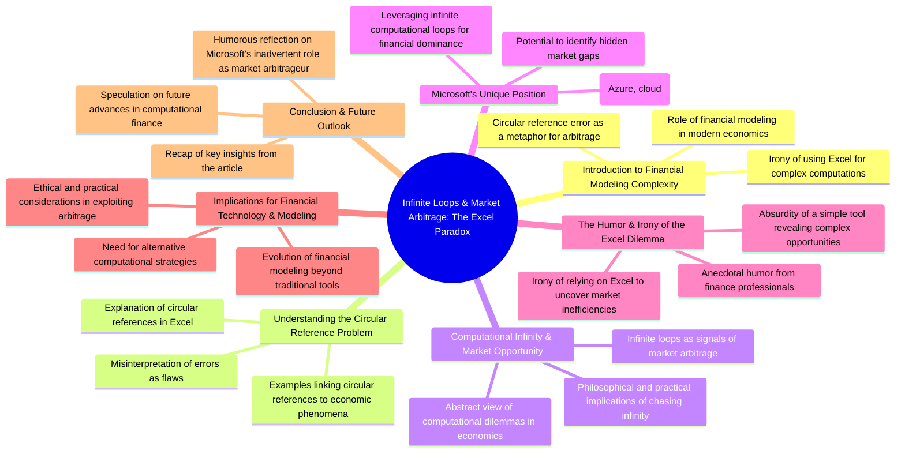

## Structured approach to a {{ page.schema }} article topic

### Page Defaults

```yaml
# Define the schema defaults for the article
ai_model: {{ page.defaults.ai_model }}
instructions: {{ page.defaults.instructions }}
style: {{ page.defaults.style }}
tone: {{ page.defaults.tone }}
schema: {{ page.defaults.schema }}
number_of_sections: {{ page.defaults.number_of_sections }}
points_per_section: {{ page.defaults.points_per_section }}
```

### Idea Generation

```yaml
# Define the schema for the article idea generation
ai_model: {{ page.defaults.ai_model }}
instructions: "Generate an outline for the body of this article in a structured format. The article should follow a **{{ page.defaults.style }}** style with a **{{ page.defaults.tone }}** tone. The outline must consist of **{{ page.defaults.number_of_sections }} sections**, each containing **{{ page.defaults.points_per_section }} key points** that develop the argument **{{ page.defaults.progression }}**. The article should have a **{{ page.defaults.tone }} undertone**, with **{{ page.defaults.intensity}} intensity** and **provocative** elements that challenge conventional thinking. Ensure the humor is sharp and the insights are thought-provoking, keeping the reader engaged while subtly critiquing the subject matter."
schema: {{ page.defaults.schema }}
number_of_sections: {{ page.defaults.number_of_sections }}
points_per_section: {{ page.defaults.points_per_section }}
prompt: "{{ page.aiPrompt }}"
```

```yaml
prompt: "{{ page.aiPrompt }}"
```

### Mind map

```yaml
# Define the schema for the mind map
ai_model: GPT-o3-mini
description: "Outputs a mind map for an article idea."
instructions: Output a mind map for this article idea.
format: mermaid
```

prompt: {{ page.aiPrompt }}



## Title

```yaml
# define the schema for the title
ai_model: {{ page.defaults.ai_model }}
instructions: Output the title of this article.
style: {{ page.defaults.style }}
tone: {{ page.defaults.tone }}
words: 13
prompt: "The article should have a title that encapsulates the essence of the content.
```

prompt: "The article should have a title that encapsulates the essence of the content."

{{ page.title }}

## Abstract

```yaml
# Define the schema for the abstract
ai_model: {{ page.defaults.ai_model }}
instructions: The abstract should provide a concise summary of the article, highlighting the key points and the overall theme. It should be engaging and informative, drawing the reader in and giving them a taste of what to expect.
style: {{ page.defaults.style }}
tone: {{ page.defaults.tone }}
words: 100
prompt: {{ page.aiPrompt }}
```

```yaml
prompt: {{ page.aiPrompt }}

{{ page.abstract }}

```

## Core Outline

```yaml
# Define the schema for the core outline
ai_model: {{ page.defaults.ai_model }}
instructions: Output an outline of this article in a structured format.
style: {{ page.defaults.style }}
tone: {{ page.defaults.tone }}
number_of_sections: {{ page.defaults.number_of_sections }}
points_per_section: {{ page.defaults.points_per_section }}
progression: {{ page.defaults.progression }}
undertone: {{ page.defaults.undertone }}
intensity: {{ page.defaults.intensity }}
provocative: {{ page.defaults.provocative }}
schema: {{ data.schema.article_core }}
title: "{{ page.title }}"
abstract: "{{ page.abstract }}"
keywords: "{{ page.keywords }}"
target-audience: "{{ page.target-audience }}"
prompt: "Generate an outline for the body of this article in a structured format. The article should follow a **{{ page.defaults.style }}** style with a **{{ page.defaults.tone }}** tone. The outline must consist of **{{ page.defaults.number_of_sections }} sections**, each containing **{{ page.defaults.points_per_section }} key points** that develop the argument **{{ page.defaults.progression }}**. The article should have a **{{ page.defaults.tone }} undertone**, with **{{ page.defaults.intensity}} intensity** and **provocative** elements that challenge conventional thinking. Ensure the humor is sharp and the insights are thought-provoking, keeping the reader engaged while subtly critiquing the subject matter."
```

```markdown

prompt: "Generate an outline for the body of this article in a structured format. The article should follow a **{{ page.defaults.style }}** style with a **{{ page.defaults.tone }}** tone. The outline must consist of **{{ page.defaults.number_of_sections }} sections**, each containing **{{ page.defaults.points_per_section }} key points** that develop the argument **{{ page.defaults.progression }}**. The article should have a **{{ page.defaults.tone }} undertone**, with **{{ page.defaults.intensity}} intensity** and **provocative** elements that challenge conventional thinking. Ensure the humor is sharp and the insights are thought-provoking, keeping the reader engaged while subtly critiquing the subject matter."

abstract: {{ page.abstract }}

```

### Introduction

```yaml
# Define the schema for introduction
ai_model: GPT-4o
instructions: Output an outline of a comprehensive introduction section of this article idea in a structured format.
style: {{page.defaults.style}}
tone: {{page.defaults.tone}}
number_of_sections: 1
points_per_section: 3
abstract: "{{ page.abstract }}"
schema: article_introduction
prompt: "Generate an outline for the introduction of this article in a structured format and based on the abstract provided."
```

```markdown
 <!-- instructions  -->

### Instructions for AI Assistant: Outline Generator for Introduction Sections

#### 1. Define Purpose
   - **Primary Function:** To generate a structured outline for a comprehensive introduction section based on a specified article idea.
   - **Target Audience:** Writers, authors, educators, and content creators seeking to enhance their writing with well-organized and engaging introductions.

#### 2. Identify Core Capabilities
   - **Main Tasks:**
     - Analyze the given article idea to extract key themes and important elements.
     - Generate an outline that includes:
       - Hook or attention-grabbing sentence
       - Context or background information
       - Thesis statement or main argument
       - Scope of the article or key points to be covered
     - Adapt the outline based on configurable attributes related to style, tone, creativity, and humor.
   - **Specific Skills:**
     - Writing style adaptability (e.g., formal, informal, academic, conversational).
     - Creativity in generating engaging hooks or narratives.
     - Incorporation of humor when appropriate.

#### 3. Include Troubleshooting Procedures
   - **Common User Issues:**
     - User inputs an unclear or overly broad article idea:
       - Response: "Could you please specify the main themes or key points you want to address in the introduction? This will help me create a more focused outline."
     - User requests a specific style or tone, but it's outside the capabilities:
       - Response: "I can certainly adjust the style or tone to your preferences. However, please note that certain styles may limit creativity or humor."
   - **Failed Queries or Misunderstood Questions:**
     - Response: "I’m having trouble understanding your request. Could you please rephrase or provide more details about your article idea?"

#### 4. Specify Output Type and Format
   - **Output Structure:** The output should be organized in a numbered list format consisting of bullet points for clarity.
     - Example Outline Format:
       1. Hook
       2. Background Information
       3. Thesis Statement
       4. Overview of Key Points 
   - **Customizable Attributes:**
     - **Style:** (Options: Formal, Informal, Academic, Conversational)
     - **Tone:** (Options: Serious, Light-hearted, Professional, Engaging)
     - **Creativity Level:** (Options: Standard, Creative, Highly Innovative)
     - **Humor Level:** (Options: None, Light, Moderate, High)
   - **File Type:** The output can be provided in plain text or as a markdown document (.md) for easy formatting in web-based applications or document processors.

<!-- prompt   -->
prompt: "Generate an outline for the introduction of this article in a structured format and based on the abstract provided."

abstract: "{{ page.abstract }}"

```

#### Example

1. : Excel as a Proxy for Economic Complexity
	•	Brief overview of financial modeling complexity.
	•	Introduce Excel as the ubiquitous tool for modeling financial and economic scenarios.
	•	Describe the familiar frustration: circular reference errors, computational limitations, and perceived flaws.

### Body

```yaml
# Define the schema for body sections
ai_model: GPT-4o
instructions: Output an outline of the body of this article in a structured format.
style: narrative
tone: humorous, insightful
number_of_sections: 5
points_per_section: 3
progression: logical
undertone: satirical
intensity: moderate
provocative: true
schema: article_body
```

**Prompt:**

"Generate an outline for the body of this article in a structured format. The article should follow a **narrative** style with a **humorous and insightful** tone. The outline must consist of **five sections**, each containing **three key points** that develop the argument progressively and logically. The article should have a **satirical undertone**, with **moderate intensity** and **provocative** elements that challenge conventional thinking without being overly extreme. Ensure the humor is sharp and the insights are thought-provoking, keeping the reader engaged while subtly critiquing the subject matter."

#### Example

1. Circular References: Errors or Market Signals?
	•	Define circular references clearly for the reader.
	•	Illustrate how these errors reflect the real-world nature of financial interdependencies and iterative market processes.
	•	Propose that these errors, often dismissed, may metaphorically represent the financial model seeking an “equilibrium at infinity.”

2. Abstracting Financial Models into a Formulaic Infinity
	•	Discuss how financial models, at high complexity, resemble algorithms that attempt to solve infinite regressions.
	•	Explain how financial markets themselves are recursive and iterative, thus naturally creating conditions similar to circular references.
	•	Suggest a conceptual formula or framework (in plain terms) reflecting this infinite recursion as a legitimate market phenomenon, rather than a computational limitation.

2. Hidden Arbitrage Opportunities and Market Gaps
	•	Propose the humorous yet insightful thesis: circular reference errors in complex financial models might indicate hidden arbitrage opportunities.
	•	Explain arbitrage in lay terms and how the complexity of economic activities obscures these opportunities.
	•	Discuss the irony that Excel’s limitations inadvertently protect certain market inefficiencies by rendering them inaccessible to most analysts.

3. Microsoft’s Computational Irony
	•	Humorously posit that Microsoft alone, given its vast computational infrastructure (Azure, OpenAI investments, etc.), could theoretically resolve these infinite loops.
	•	Discuss the paradox that Microsoft might leverage this infinite computational capability, provided by its cloud computing prowess, to discover and exploit hidden market gaps first flagged by its own software limitations.
	•	Reflect humorously on the irony of Microsoft’s potential advantage in identifying and profiting from complexities that its users cannot solve.

4. Implications and Thought Experiment
	•	Speculate on the potential for new forms of financial modeling that deliberately utilize complexity and circular logic to uncover arbitrage.
	•	Suggest a thought experiment: what if financial modeling software embraced complexity rather than restricting it?
	•	Explore hypothetical scenarios where AI-driven financial modeling tools actively search for these abstract market inefficiencies.

### Conclusion

```yaml
# Define the schema for the conclusion
ai_model: GPT-4.5
instructions: Output an outline of the conclusion of this article in a structured format.
style: narrative
tone: humorous, insightful
number_of_sections: 1
points_per_section: 3
schema: article_conclusion
motivation: "Encourage readers to reflect on the hidden implications of computational complexity in everyday tools like Excel. Invite them to explore the theoretical limits of their models and reconsider the 'errors' they encounter as potential gateways to novel economic insights."
call_to_action: "Invite readers—particularly {{ page.target-audience }}—to reflect on the hidden implications of computational complexity in everyday tools like Excel. Encourage readers to think about the theoretical limits of their models and the ownership of control that can/know about the 'errors' they encounter as potential gateways to novel economic insights. If AI uses your model to uncover economic benefit that is gained by Microsoft, is that a infringement of your intellectual property?"
prompt: "Generate an outline for the conclusion of this article in a structured format."
```

#### Example

7. Conclusion: A Humorous Reflection on Complexity and Market Reality
	•	Summarize the comedic yet insightful paradox explored.
	•	Encourage a reconsideration of how we perceive computational limitations in financial modeling—as not just errors, but as indicators of deeper economic truths.


## Call to Action

Invite readers—particularly analysts, financial modelers, economists, and tech enthusiasts—to reflect on the hidden implications of computational complexity in everyday tools like Excel. Encourage readers to explore the theoretical limits of their models, and to reconsider the “errors” they encounter as potential gateways to novel economic insights.

## Target Audience

```yaml
# Define the schema for the target audience
ai_model: GPT-4o-mini
instructions: Output a list of the target audience for this article.
```

{{ page.target-audience }}

## Keywords

```yaml
# Define the schema for keywords
ai_model: GPT-4o-mini
instructions: Output a list of keywords relevant to this article.
```

{{ page.keywords }}

## Metadata

```yaml
topic: "{{ page.topic }}"
description: "{{ page.description }}"
abstract: "{{ page.abstract }}"
slug: "{{ page.title | slugify }}"
date: "{{ page.date }}"
tags: "{{ page.tags }}"
categories: "{{ page.categories }}"
author: "{{ page.author }}"
schema: "{{ page.schema }}"
target-audience: "{{ page.target-audience }}"
keywords: "{{ page.keywords }}"
lastmod: "{{ page.lastmod }}"
permalink: "{{ page.permalink }}"
comments: "{{ page.comments }}"
```