## Abstract

In today's data-driven landscape, Microsoft Excel has transcended its traditional role as a mere spreadsheet tool, emerging as a pivotal gateway into programming and technology for financial and data professionals. This article explores how advanced Excel usage equips users with fundamental programming competencies through complex formulas, automation with VBA, and data structuring practices that parallel core programming principles. By highlighting the structural analogies between exceptional Excel proficiency and formal programming skills, the piece underscores the potential for seamless transitions into tech-centric careers. Through empirical narratives of professionals who have successfully navigated such career shifts, we illuminate the implications of expanding beyond Excel, addressing its scalability and integration limitations. The article further outlines strategic programming pathways, including practical methods for developing proficiency in languages like Python, SQL, and R. Ultimately, we argue that harnessing and refining the skills gained through advanced Excel usage can significantly enhance career trajectories, empowering professionals to thrive in an increasingly technology-oriented marketplace.

## Introduction

### Outline for Intro

1. Hook
   - Begin with an engaging statement about how Excel, often seen as a simple spreadsheet tool, serves as a gateway to broader technological skills and careers.

2. Background Information
   - Briefly discuss the widespread use of Excel among financial analysts, accountants, and data-driven professionals.
   - Introduce the idea that advanced Excel users are unknowingly developing foundational programming skills.

3. Thesis Statement
   - Clearly state the main argument: Excel proficiency provides a unique opportunity for professionals to transition seamlessly into formal programming and technology-driven careers.

4. Overview of Key Points
   - Highlight the core areas where Excel aligns with programming:
     - Complex logical reasoning akin to algorithmic logic.
     - Automation practices through VBA mirroring structured programming.
     - Data structuring and management similar to database systems.
     - Advanced computational methods paralleling computational analytics.
   - Preview real-world cases of successful transitions from advanced Excel usage to technology-focused roles.
   - Mention limitations of Excel in handling large datasets, complex computations, and integration challenges, which underscore the need for additional skills.
   - Introduce strategic pathways to expand beyond Excel, such as learning Python, SQL, R, and web technologies.
   - Conclude with the benefits of leveraging Excel skills to advance career opportunities in technology-driven fields.

## Body

### Outline for Body Section

1. **Excel as an Implicit Programming Environment**
   - **Complex Logical Reasoning**
     - Construction of nested conditional statements (e.g., IF, INDEX/MATCH, SUMPRODUCT)
     - Application of algorithmic logic similar to software development practices
   - **Automation and Iterative Processes**
     - Utilization of Visual Basic for Applications (VBA) for automating tasks
     - Implementation of programming concepts like loops, conditional branching, event-driven triggers
   - **Data Structuring and Normalization**
     - Data organization mirroring relational database principles (e.g., schema definition, normalization)
   - **Advanced Computational Methods**
     - Conducting Monte Carlo simulations and sensitivity analyses
     - Comparison to computational strategies in software engineering

2. **Structural Analogies: Excel Proficiency and Formal Programming**
   - **Advanced Formulas and Functions → Algorithmic Logic**
     - Similarities between Excel's array formulas and algorithmic structures of programming languages
   - **Macros and VBA → Structured Automation**
     - VBA's parallel to structured scripting languages like Python and JavaScript
   - **Pivot Tables and Data Queries → Database Management**
     - Pivot tables compared with SQL and relational database management concepts
   - **Graphical Representations → Advanced Data Visualization**
     - Transition from Excel-based visualizations to platforms like Matplotlib, Power BI, Tableau

3. **Empirical Narratives: Real-World Transitions**
   - Case studies of financial analysts transitioning to data engineering with VBA scripting skills
   - Accountants moving to business intelligence roles leveraging Excel analytics foundations

4. **The Case for Professional Expansion Beyond Excel**
   - **Scalability Constraints**
     - Performance issues with larger datasets necessitating scalable solutions
   - **Computational Efficiency**
     - Limitations in handling complex computations pointing to the need for robust platforms like Python
   - **Integration Limitations**
     - Discussion on limited integration with modern APIs and web services
     - Benefits of broader technological skills leading to enhanced roles and capabilities

5. **Strategic Programming Pathways**
   - **Python**
     - Importance in data analytics, machine learning, process automation, software development
   - **SQL**
     - Role in structured data management and relational database interactions
   - **R**
     - Use in statistical analysis, predictive modeling, advanced visualization
   - **JavaScript and Web Technologies**
     - Necessity for web application development and interactive visualizations

6. **Practical Strategies for Transitioning**
   - **Incremental Automation**
     - Step-by-step conversion of Excel tasks into Python or R scripts
   - **Educational Programs**
     - Utilizing online courses for foundational skills in Python, SQL, R
   - **Professional Networking**
     - Participation in communities such as GitHub, Stack Overflow
   - **Project-Based Learning**
     - Engagement in projects to apply programming skills and demonstrate applicability

## Conclusion

### Outline for Conclusion

1. **Restate the Main Argument or Thesis**
   - The article posits that Excel functions as an implicit programming environment, paralleling many aspects of formal programming through its complex logical reasoning, automation capabilities, and data handling techniques.
   - This exploration highlights the significant role Excel plays in various fields, illustrating its potential as a powerful tool for professionals transitioning into more formal programming roles.

2. **Summarize Key Points**
   - Excel's use of advanced formulas and VBA scripting embodies algorithmic logic and automation akin to formal software development practices.
   - Structural analogies, such as comparing Excel’s pivot tables to SQL and database management systems, emphasize the depth of proficiency possible within Excel.
   - Real-world transitions, illustrated by case studies, demonstrate how skills developed in Excel serve as a foundation for roles in data engineering and business intelligence.
   - Despite Excel’s capabilities, the article identifies scalability, computational efficiency, and integration limitations, advocating for professional expansion beyond Excel to more robust platforms like Python, SQL, and R.

3. **Implications of the Findings**
   - The findings suggest that while Excel provides a solid groundwork for computational tasks, professionals should consider expanding their skillsets to include more scalable and integrated technologies.
   - This transition offers the potential for enhanced operational capabilities and a broader range of career opportunities.

4. **Call to Action or Next Steps**
   - Readers are encouraged to pursue additional programming skills through online courses, project-based learning, and active participation in professional communities.
   - Transitioning incrementally from Excel to other programming environments will facilitate smoother career advancements and more efficient handling of complex data tasks.

5. **Closing Thought**
   - As the digital landscape evolves, the capacity to adapt and extend one's technical toolkit, moving from Excel expertise to mastery of comprehensive programming languages, will be crucial for thriving in the data-driven world. Embrace the journey toward technological fluency to unlock new possibilities and drive innovation.

## Parody Version

## Excel: The Unlikely Gateway Drug to the World of Programming

By DeskPython McSpreadsheet, Senior Humor Correspondent

In a world where tech buzzwords multiply faster than rabbits in spring, one humble software remains the sassiest gatekeeper to programming prowess: Microsoft Excel. Often underestimated as simply a tool for calculating who owes whom what for the last three rounds of drinks, Excel is silently transforming its users into unsuspecting programmers, one spreadsheet at a time.

### Spreadsheets: The Stepping Stone to Silicon Valley

It all starts innocently enough. Need to organize your monthly expenses? Sure, pop them into a neat grid. But wait! Why not make it snappier with a few nested conditional statements? Throw in a SUMPRODUCT and suddenly, you're not just budgeting, you're halfway to debugging.

Excel's hidden curriculum is as subtle as it is genius. The software lures financial analysts and data geeks alike into the folds of complex logical reasoning—think algorithmic logic but without the snazzy job title. It promotes data structuring that nods politely to database normalization principles and even sneaks in a cheeky hint of Monte Carlo simulations to tickle the fancy of future data scientists.

### Automation and The Rise of Excel Wizards

Then there are those pesky repetitive tasks. The drudgery is broken by the patter of Visual Basic for Applications (VBA) scripts crackling through office cubicles worldwide. With automation capabilities mimicking organized programming paradigms, Excel users are quickly becoming local wizards, cast in the unofficial role of office Gandalf. “You shall not pass!” they decree to manual data entry.

Through VBA, Excel quietly imparts the rudiments of programming structure—loops, conditionals, and the kind of event-driven triggers that would make an app developer beam with pride. The transition from cut-and-paste heroics to script-writing savants is not just possible; it's practically ordained.

### Escaping the Spreadsheet Matrix

Yet, even wizards recognize the limits of their powers. While Excel reigns supreme in realm of mild data manipulation, it falters with larger kingdoms (datasets) demanding more scalability, and more elegant attire (Python or R). Beyond these walls, siren calls of SQL databases seduce spreadsheet savants to greener pastures.

Indeed, empirical narratives abound of former accountants weaving their Excel-enhanced analytical talents into broader, more lucrative roles within data engineering and business intelligence. From dragonslayers of error messages to architects of seamless big data pipelines, their tales are heroic sagas of courage, caffeine, and Ctrl+Z.

### Next Steps: From Cells to the Universe

For those who have tasted the sweet nectar of programming within Excel, stepping into formal programming languages is less a leap and more a brisk walk down Easy Street. Courses online beckon like mystical tomes, offering Python, SQL, and even JavaScript for the truly adventurous.

Project-based learning and memberships in communities like GitHub promise new vistas of opportunity, while the keyboard-naïve remain trapped in copy-paste purgatory. So, fair professionals, hear this call to action: unlock the chains of your spreadsheet cell and embrace your programming potential. The tech world awaits.

In conclusion, as spreadsheets groan under the weight of their internal complexities, we find in Excel not just a tool, but a training ground—a hilarious, bewildering foray into the wilds of programming. It is an initiation that heralds the arrival of new programmers from the most unexpected quarters, ready to conquer digital horizons one line of code at a time. So grab your mouse, adjust your bifocals, and let the journey begin.

## Article Idea:

From Excel to Programming: Bridging Financial Expertise and Technological Mastery

Microsoft Excel surpasses its conventional role as merely a spreadsheet tool, emerging instead as a sophisticated entry point into the broader technological domain. Financial analysts, accountants, and data-driven professionals who employ Excel at an advanced level—utilizing intricate formulas, complex functions, powerful macros, and refined visualization techniques—are unknowingly acquiring fundamental programming competencies. This implicit acquisition uniquely positions them for seamless transitions into formal programming roles and technology-driven careers.

### Excel as an Implicit Programming Environment
Professionals proficient in Excel consistently engage in tasks that closely mirror core programming practices:

- **Complex Logical Reasoning:** Users frequently construct elaborate nested conditional statements and execute advanced data retrieval functions (such as IF, INDEX/MATCH, and SUMPRODUCT), thus practicing the type of algorithmic logic central to software development.
- **Automation and Iterative Processes:** Utilizing Visual Basic for Applications (VBA), professionals automate repetitive tasks and procedures. They employ loops, conditional branching, and event-driven triggers—concepts foundational to structured programming.
- **Data Structuring and Normalization:** Excel experts regularly organize and manage data according to principles that align closely with relational database management systems (RDBMS), including schema definition, normalization, data validation, and integrity constraints.
- **Advanced Computational Methods:** Specialists commonly employ iterative computational strategies, including Monte Carlo simulations and sensitivity analyses, techniques widely utilized in computational analytics and software engineering.

### Structural Analogies: Excel Proficiency and Formal Programming
- **Advanced Formulas and Functions → Algorithmic Logic:** Excel’s sophisticated formulas—such as array formulas and dynamic referencing—share conceptual foundations with algorithmic structures integral to programming languages.
- **Macros and VBA → Structured Automation:** VBA provides users with a structured scripting language capable of automating business workflows, analogous to scripting languages like Python, JavaScript, and Ruby.
- **Pivot Tables and Data Queries → Database Management:** Proficiency in pivot tables and Excel's Power Query is directly analogous to database querying and management, laying a strong foundation for mastery of SQL and relational database concepts.
- **Graphical Representations → Advanced Data Visualization:** Expertise in creating Excel-based visualizations (complex charts, interactive dashboards) translates seamlessly into advanced visualization platforms such as Python’s Matplotlib, Seaborn, Power BI, and Tableau.

### Empirical Narratives: Real-World Transitions
Numerous examples exist of professionals who successfully transitioned from advanced Excel users into technology-focused careers. For instance, financial analysts adept in VBA scripting have evolved into data engineering roles specializing in backend automation. Accountants proficient in Excel-based analytics have successfully transitioned into business intelligence specialists and database administrators, capitalizing on their analytical foundations to master tools like Python, SQL, and R.

### The Case for Professional Expansion Beyond Excel
Despite its extensive utility, Excel has notable limitations, especially concerning large datasets, computational complexity, and integration with broader technological ecosystems:

- **Scalability Constraints:** Excel’s performance significantly declines with larger datasets, necessitating scalable alternatives.
- **Computational Efficiency:** Complex computations and iterative processes often exceed Excel’s capabilities, highlighting the need for more robust platforms such as Python and R.
- **Integration Limitations:** Excel's limited integration capability with APIs, web services, and cloud-based systems underscores the necessity of a broader technological skill set.

Expanding beyond Excel empowers professionals to:
- Overcome performance limitations and effectively manage large-scale data.
- Implement more reliable, comprehensive automation strategies.
- Enhance analytical depth and sophistication through advanced technological tools.
- Transition smoothly into highly rewarding, technology-intensive roles.

### Strategic Programming Pathways
Excel experts can strategically pursue these programming pathways:

- **Python:** Renowned for versatility in data analytics, machine learning, process automation, and software development.
- **SQL:** Critical for structured data management, querying, and relational database interactions.
- **R:** Ideal for comprehensive statistical analysis, predictive modeling, and advanced visualization.
- **JavaScript and Web Technologies:** Essential for developing web applications, interactive visualizations, and analytical reporting platforms.

### Practical Strategies for Transitioning
Structured methods to facilitate this career advancement include:

- **Incremental Automation:** Gradually convert routine Excel tasks into Python or R scripts to build confidence and proficiency.
- **Educational Programs:** Leverage online learning platforms offering structured introductory and intermediate courses in Python, SQL, and R.
- **Professional Networking:** Actively participate in communities such as GitHub, Stack Overflow, Kaggle, and LinkedIn Learning to reinforce skill development and professional connections.
- **Project-Based Learning:** Engage in progressively complex projects to apply programming skills practically, thereby solidifying proficiency and demonstrating real-world applicability.

### Conclusion
Advanced proficiency in Excel inherently aligns with fundamental programming concepts, strategically positioning financial analysts, accountants, and data-focused professionals to seamlessly transition into technology-centric roles. Recognizing and purposefully expanding these inherent skills significantly enhances career trajectories, enabling professionals to excel in increasingly technology-driven professional environments.

### Mind Map: Transitioning from Excel to Programming

```mermaid
mindmap
  root((From Excel to Programming))
    Excel as Implicit Programming Environment
      Complex Logical Reasoning
        IF, INDEX/MATCH Functions
        Nested Conditional Statements
      Automation & Iteration
        VBA Macros
        Loops & Event Triggers
      Data Structuring & Normalization
        Relational Database Principles
        Data Validation & Integrity
      Advanced Computation & Simulation
        Monte Carlo Simulations
        Sensitivity Analyses

    Structural Analogies (Excel ↔ Programming)
      Formulas & Functions
        Algorithmic Logic
        Array Formulas
      Macros & VBA
        Scripting & Automation
        Workflow Automation
      Pivot Tables & Queries
        Database Methodologies
        SQL Foundations
      Graphical Representations
        Advanced Visualization
        Python's Matplotlib, Tableau, Power BI

    Empirical Narratives
      Financial Analysts to Data Engineers
      Accountants to Business Intelligence Specialists
      Excel Experts to Software Developers

    Rationale for Expansion Beyond Excel
      Scalability Constraints
        Large Dataset Management
      Computational Efficiency
        Complex Calculations
        Efficient Frameworks (Python, R)
      Integration Limitations
        APIs and Cloud Services
      Career Advancement Opportunities
        Enhanced Analytical Skills
        Technological Expertise

    Strategic Programming Pathways
      Python
        Data Analysis & Automation
        Machine Learning
      SQL
        Database Management
        Structured Queries
      R
        Statistical Analysis
        Predictive Modeling
      JavaScript/Web Technologies
        Application Development
        Interactive Dashboards

    Transition Strategies
      Incremental Automation
        Excel Tasks to Python Scripts
      Educational Programs
        Online Courses (Python, SQL, R)
      Professional Networking
        GitHub, Stack Overflow
        LinkedIn Learning
      Project-Based Learning
        Real-World Applications
        Incremental Complexity

    Conclusion
      Career Enhancement through Programming
      Leverage Inherent Skills
      Transition to Tech Roles
```



```text
**Tech Transition Enthusiast - a former financial analyst turned data scientist with a passion for bridging traditional finance with modern technology.**

**Post Content:**

From Excel to Programming: Bridging Financial Expertise and Technological Mastery 🚀

Excel isn’t just a spreadsheet tool; it's a gateway to the tech world. As financial analysts and data-driven professionals, you're unknowingly mastering programming fundamentals. Here's how your Excel skills already mirror key programming practices:

🔍 **Complex Logical Reasoning:** Crafting stacked IF statements and data retrieval functions is akin to designing algorithms.

🔄 **Automation & Iteration:** Your VBA macros exhibit core concepts like loops and conditionals, much like programming.

📊 **Data Structuring:** Excel’s data management mirrors RDBMS principles, prepping you for SQL mastery.

📈 **Advanced Computation:** Techniques like Monte Carlo simulations aren't just spreadsheet skills; they're gateways to computational analytics.

Real-world shifts from Excel pros to tech gurus are happening now. These transformations empower professionals to overcome Excel's limitations and embrace roles rich in data science, business intelligence, and more.

Why expand? 🌐 To scale with robust platforms, automate deeply, and integrate seamlessly with evolving tech ecosystems.

**Programming Pathways:**
- **Python & SQL:** For analytics and database skills.
- **R:** Vital for statistical prowess.
- **JavaScript & Web Tech:** Key for web applications and dynamic visualizations.

Kickstart your journey with:
- **Incremental Automation:** Try scripting those Excel processes.
- **Educational Programs:** Online courses in Python, SQL, R await.
- **Professional Networking:** Engage in GitHub, Stack Overflow, and Kaggle.

Conclusion? By recognizing and evolving your inherent skills, you're not just keeping up—you’re leading the charge into a tech-driven future. Let's transform financial acumen into tech-savvy careers! 💼💡

#ExcelToTech #CareerTransformation #DataDrivenFuture #TechTransition 🚀
```