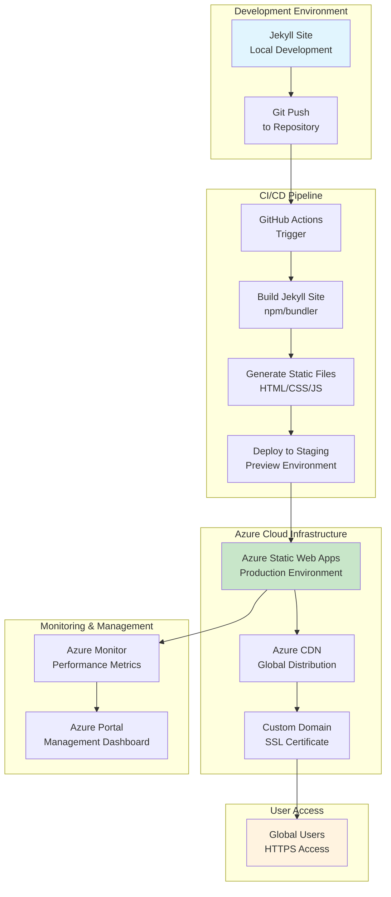

## Introduction

Welcome to the world of cloud-native static site hosting! In this comprehensive guide, we'll explore how to deploy your Jekyll-generated static site to Azure Static Web Apps - Microsoft's serverless hosting solution that combines the power of global CDN distribution with automated CI/CD pipelines.

Whether you're migrating from GitHub Pages, looking to scale your Jekyll site, or simply want to leverage enterprise-grade cloud infrastructure, Azure Static Web Apps provides an excellent platform for hosting static content with minimal operational overhead.

### 🌟 Why Azure Static Web Apps for Jekyll?

**Key Benefits:**
- **Serverless Architecture**: No server management or scaling concerns
- **Global CDN**: Automatic content distribution for lightning-fast loading
- **Built-in CI/CD**: Integrated GitHub/GitLab/Azure DevOps pipelines
- **Custom Domains & SSL**: Free SSL certificates and custom domain support
- **API Integration**: Backend API support for dynamic functionality
- **Cost-Effective**: Pay only for what you use, with generous free tier

**Perfect for Jekyll Sites:**
- Static content generation aligns perfectly with serverless hosting
- No database requirements for most Jekyll sites
- Excellent performance for content-heavy sites
- SEO-friendly with proper caching strategies

### 🎯 What You'll Learn

By the end of this guide, you'll be able to:
- Set up Azure Static Web Apps for your Jekyll site
- Configure automated deployment pipelines
- Implement custom domains and SSL
- Monitor site performance and troubleshoot issues
- Optimize for global content delivery

---

## Overall Architecture: Jekyll to Azure Cloud

### System Components Overview

Azure Static Web Apps provides a complete hosting solution that transforms your Jekyll development workflow into a production-ready cloud application. Here's how the components work together:

**Development Layer:**
- **Jekyll Site**: Your local development environment with Markdown content and Liquid templates
- **Git Repository**: Version control and collaboration platform (GitHub, GitLab, Azure DevOps)
- **Build Process**: Static site generation and asset optimization

**Cloud Infrastructure Layer:**
- **Azure Static Web Apps**: Serverless hosting service with global CDN
- **Azure Front Door**: Optional advanced CDN and routing capabilities
- **Azure DNS**: Custom domain management and SSL certificates
- **Azure Monitor**: Performance monitoring and logging

**Deployment Pipeline:**
- **GitHub Actions/Azure DevOps**: Automated build and deployment triggers
- **Azure CLI**: Infrastructure management and configuration
- **Azure Portal**: Web-based management interface

### Data Flow Architecture



### Deployment Workflow Stages

1. **Source Stage**: Code changes trigger automated pipeline
2. **Build Stage**: Jekyll generates static files from source
3. **Staging Stage**: Preview deployment for testing
4. **Production Stage**: Live deployment with CDN distribution
5. **Monitoring Stage**: Performance tracking and error detection

---

## Step-by-Step Deployment Guide

### Prerequisites Setup

Before we begin, ensure you have the following:

**Azure Account & Tools:**
```bash
# Install Azure CLI
brew install azure-cli  # macOS
# OR
curl -L https://aka.ms/InstallAzureCli | bash  # Linux

# Login to Azure
az login

# Install GitHub CLI (optional, for repository management)
brew install gh
gh auth login
```

**Jekyll Site Requirements:**
- Valid Jekyll site with `_config.yml`
- `Gemfile` with Jekyll dependencies
- Build output in `_site/` directory (default)
- No server-side processing requirements

### Step 1: Prepare Your Jekyll Site for Azure

First, let's configure your Jekyll site for optimal Azure deployment:

**Update `_config.yml` for Azure:**
```yaml
# Add Azure-specific configuration
url: "https://your-app-name.azurestaticapps.net"  # Replace with your actual URL
baseurl: ""  # Leave empty for root domain
plugins:
  - jekyll-feed
  - jekyll-sitemap
  - jekyll-seo-tag

# Azure Static Web Apps configuration
azure_static_web_apps:
  api_location: ""  # Leave empty for static-only sites
  output_location: "_site"  # Build output directory
  app_location: "/"  # Source code location
```

**Create Azure Static Web Apps configuration:**
```json
// .github/workflows/azure-static-web-apps.yml
{
  "name": "Azure Static Web Apps CI/CD",
  "on": {
    "push": {
      "branches": ["main"]
    },
    "pull_request": {
      "types": ["opened", "closed"],
      "branches": ["main"]
    }
  },
  "jobs": {
    "build_and_deploy_job": {
      "runs-on": "ubuntu-latest",
      "name": "Build and Deploy Job",
      "steps": [
        {
          "name": "Checkout",
          "uses": "actions/checkout@v4"
        },
        {
          "name": "Setup Ruby",
          "uses": "ruby/setup-ruby@v1",
          "with": {
            "ruby-version": "3.1"
          }
        },
        {
          "name": "Setup Node.js",
          "uses": "actions/setup-node@v4",
          "with": {
            "node-version": "18"
          }
        },
        {
          "name": "Install dependencies",
          "run": "bundle install"
        },
        {
          "name": "Build Jekyll site",
          "run": "bundle exec jekyll build"
        },
        {
          "name": "Deploy to Azure",
          "uses": "Azure/static-web-apps-deploy@v1",
          "with": {
            "azure_static_web_apps_api_token": "${{ secrets.AZURE_STATIC_WEB_APPS_API_TOKEN }}",
            "repo_token": "${{ secrets.GITHUB_TOKEN }}",
            "action": "upload",
            "app_location": "/",
            "output_location": "_site"
          }
        }
      ]
    }
  }
}
```

### Step 2: Create Azure Static Web App

Now let's create the Azure infrastructure:

**Using Azure CLI:**
```bash
# Set your subscription
az account set --subscription "your-subscription-id"

# Create resource group (if not exists)
az group create --name "jekyll-sites-rg" --location "East US"

# Create Static Web App
az staticwebapp create \
  --name "it-journey-site" \
  --resource-group "jekyll-sites-rg" \
  --location "East US" \
  --source "https://github.com/bamr87/it-journey" \
  --branch "main" \
  --app-location "/" \
  --output-location "_site" \
  --login-with-github

# Get deployment token for GitHub Actions
az staticwebapp secrets list \
  --name "it-journey-site" \
  --resource-group "jekyll-sites-rg" \
  --query "properties.apiKey"
```

**Alternative: Azure Portal Method:**
1. Navigate to [Azure Portal](https://portal.azure.com)
2. Search for "Static Web Apps"
3. Click "Create"
4. Fill in:
   - **Subscription**: Your Azure subscription
   - **Resource Group**: Create new or select existing
   - **Name**: `it-journey-site`
   - **Plan**: Free tier for starters
   - **Region**: East US or closest to your users
   - **Source**: GitHub
   - **Organization**: bamr87
   - **Repository**: it-journey
   - **Branch**: main
   - **Build Details**:
     - App location: `/`
     - Output location: `_site`
     - API location: (leave empty)

### Step 3: Configure GitHub Actions Deployment

Set up the CI/CD pipeline:

**Add GitHub Secrets:**
```bash
# In your GitHub repository settings, add:
# AZURE_STATIC_WEB_APPS_API_TOKEN = [token from Azure CLI above]
```

**Complete GitHub Actions Workflow:**
```yaml
name: Azure Static Web Apps CI/CD

on:
  push:
    branches:
      - main
  pull_request:
    types: [opened, synchronize, closed]
    branches:
      - main

jobs:
  build_and_deploy_job:
    if: github.event_name == 'push' || (github.event_name == 'pull_request' && github.event.action != 'closed')
    runs-on: ubuntu-latest
    name: Build and Deploy Job
    steps:
      - uses: actions/checkout@v4
        with:
          submodules: true
          fetch-depth: 0
      
      - name: Setup Ruby
        uses: ruby/setup-ruby@v1
        with:
          ruby-version: '3.1'
          bundler-cache: true
      
      - name: Install dependencies
        run: bundle install
      
      - name: Build Jekyll site
        run: bundle exec jekyll build --config _config.yml,_config_dev.yml
      
      - name: Deploy to Azure Static Web Apps
        id: builddeploy
        uses: Azure/static-web-apps-deploy@v1
        with:
          azure_static_web_apps_api_token: ${{ secrets.AZURE_STATIC_WEB_APPS_API_TOKEN }}
          repo_token: ${{ secrets.GITHUB_TOKEN }}
          action: "upload"
          app_location: "/"
          api_location: ""
          output_location: "_site"
          skip_app_build: true

  close_pull_request_job:
    if: github.event_name == 'pull_request' && github.event.action == 'closed'
    runs-on: ubuntu-latest
    name: Close Pull Request Job
    steps:
      - name: Close pull request
        id: closepullrequest
        uses: Azure/static-web-apps-deploy@v1
        with:
          azure_static_web_apps_api_token: ${{ secrets.AZURE_STATIC_WEB_APPS_API_TOKEN }}
          repo_token: ${{ secrets.GITHUB_TOKEN }}
          action: "close"
```

### Step 4: Configure Custom Domain and SSL

Add your custom domain:

**Azure Portal Method:**
1. Go to your Static Web App in Azure Portal
2. Navigate to "Custom domains"
3. Click "Add custom domain"
4. Choose "Custom domain on other DNS"
5. Enter your domain (e.g., `it-journey.dev`)
6. Follow DNS configuration instructions

**DNS Configuration (Example for Cloudflare):**
```txt
# Add CNAME record
Type: CNAME
Name: www (or @ for root domain)
Value: your-app-name.azurestaticapps.net

# Add TXT record for validation
Type: TXT
Name: _dnsauth.www (or _dnsauth for root)
Value: [validation token from Azure]
```

**Azure CLI Method:**
```bash
# Validate custom domain
az staticwebapp hostname validate \
  --name "it-journey-site" \
  --resource-group "jekyll-sites-rg" \
  --domain "it-journey.dev"

# Add custom domain
az staticwebapp hostname set \
  --name "it-journey-site" \
  --resource-group "jekyll-sites-rg" \
  --domain "it-journey.dev"
```

### Step 5: Optimize for Performance

Enhance your site's performance:

**Enable Azure CDN (Front Door):**
```bash
# Create Azure Front Door profile
az afd profile create \
  --profile-name "jekyll-cdn" \
  --resource-group "jekyll-sites-rg" \
  --sku "Standard_AzureFrontDoor"

# Add endpoint
az afd endpoint create \
  --endpoint-name "jekyll-endpoint" \
  --profile-name "jekyll-cdn" \
  --resource-group "jekyll-sites-rg"

# Add route
az afd route create \
  --route-name "jekyll-route" \
  --profile-name "jekyll-cdn" \
  --resource-group "jekyll-sites-rg" \
  --endpoint-name "jekyll-endpoint" \
  --origin-group-name "jekyll-origin-group" \
  --origin-name "jekyll-origin" \
  --origin-host-name "it-journey-site.azurestaticapps.net" \
  --https-redirect "Enabled"
```

**Jekyll Performance Optimizations:**
```yaml
# _config.yml additions
# Enable compression and optimization
compress_html:
  clippings: all
  comments: ["<!-- ", " -->"]
  endings: all
  startings: [html, head, body]

# Optimize images (requires jekyll-postcss or similar)
plugins:
  - jekyll-feed
  - jekyll-sitemap
  - jekyll-seo-tag
  - jekyll-minifier

jekyll-minifier:
  compress_html: true
  compress_css: true
  compress_js: true
```

---

## Monitoring and Troubleshooting

### Azure Monitor Integration

Set up monitoring for your site:

**Enable Application Insights:**
```bash
# Create Application Insights resource
az monitor app-insights component create \
  --app "jekyll-insights" \
  --location "East US" \
  --resource-group "jekyll-sites-rg" \
  --application-type "web"

# Link to Static Web App
az staticwebapp appsettings set \
  --name "it-journey-site" \
  --resource-group "jekyll-sites-rg" \
  --setting-pairs "APPINSIGHTS_INSTRUMENTATIONKEY=your-key"
```

### Common Issues and Solutions

#### Build Failures
**Issue:** Jekyll build fails in GitHub Actions
```bash
# Check build logs in GitHub Actions
# Common fixes:
bundle install --deployment  # Use deployment mode
bundle exec jekyll build --trace  # Verbose error output
```

#### Custom Domain Issues
**Issue:** Domain validation fails
```bash
# Check DNS propagation
nslookup your-domain.com
dig TXT _dnsauth.your-domain.com

# Re-validate in Azure Portal
az staticwebapp hostname validate \
  --name "it-journey-site" \
  --resource-group "jekyll-sites-rg" \
  --domain "your-domain.com"
```

#### Performance Problems
**Issue:** Slow loading times
```bash
# Check Azure CDN status
az afd endpoint show \
  --endpoint-name "jekyll-endpoint" \
  --profile-name "jekyll-cdn" \
  --resource-group "jekyll-sites-rg"

# Enable compression in Jekyll
# Add to _config.yml:
webrick:
  headers:
    "Content-Encoding": "gzip"
```

---

## Cost Optimization and Scaling

### Azure Pricing Tiers

| Feature | Free | Standard |
|---------|------|----------|
| Bandwidth | 100 GB/month | 100 GB + $0.02/GB |
| Custom Domains | 2 included | 5 included |
| SSL Certificates | ✅ | ✅ |
| API Support | ❌ | ✅ |
| Enterprise Features | ❌ | ✅ |

### Scaling Strategies

**Global Distribution:**
- Use Azure Front Door for worldwide CDN
- Configure geo-redundancy for high availability
- Implement caching strategies for dynamic content

**Cost Monitoring:**
```bash
# Monitor costs
az costmanagement query \
  --type "Usage" \
  --scope "/subscriptions/your-subscription-id" \
  --timeframe "MonthToDate" \
  --dataset-granularity "Daily"
```

---

## Advanced Features and Integrations

### API Integration (For Dynamic Features)

If your Jekyll site needs dynamic functionality:

**Azure Functions Integration:**
```javascript
// api/hello.js (in your repository)
module.exports = async function (context, req) {
    context.res = {
        status: 200,
        body: {
            message: "Hello from Azure Functions!",
            timestamp: new Date().toISOString()
        }
    };
};
```

**Update Configuration:**
```yaml
# In .github/workflows/azure-static-web-apps.yml
# Add api_location for Functions
api_location: "api"
```

### Authentication and Security

**Azure AD Integration:**
```yaml
# _config.yml additions for auth
azure_static_web_apps:
  authentication:
    enabled: true
    provider: "aad"
    client_id: "your-client-id"
```

---

## Conclusion

Deploying your Jekyll site to Azure Static Web Apps combines the simplicity of static site generation with the power of enterprise-grade cloud infrastructure. You've now learned how to:

- ✅ Set up automated CI/CD pipelines with GitHub Actions
- ✅ Configure global CDN distribution for optimal performance
- ✅ Implement custom domains with SSL certificates
- ✅ Monitor and troubleshoot deployment issues
- ✅ Optimize costs and scale your application

### Key Takeaways

**Architecture Benefits:**
- Serverless hosting eliminates infrastructure management
- Global CDN ensures fast loading worldwide
- Built-in CI/CD reduces deployment complexity
- Enterprise security features protect your content

**Development Workflow:**
- Push to main branch triggers automatic deployment
- Staging environments for testing changes
- Rollback capabilities for quick issue resolution
- Integration with existing Git workflows

### Next Steps

**Explore Advanced Features:**
- Add Azure Functions for dynamic content
- Implement Azure Front Door for advanced routing
- Set up Azure Monitor for comprehensive analytics
- Integrate with Azure Cognitive Services for AI features

**Community Resources:**
- [Azure Static Web Apps Documentation](https://docs.microsoft.com/azure/static-web-apps/)
- [Jekyll Deployment Guides](https://jekyllrb.com/docs/deployment/)
- [Azure DevOps Integration](https://azure.microsoft.com/products/devops/)

**Cost Estimation:**
- Free tier: Perfect for personal blogs and small sites
- Standard tier: Scales with traffic growth
- Enterprise tier: Advanced security and compliance features

Your Jekyll site is now running on Azure Cloud with professional-grade hosting, global distribution, and automated deployment pipelines. The combination of Jekyll's static generation with Azure's serverless platform provides a robust, scalable, and cost-effective solution for modern web hosting.

---

## 📚 Resources and Further Reading

### Official Documentation
- [Azure Static Web Apps Overview](https://docs.microsoft.com/azure/static-web-apps/overview)
- [Jekyll Deployment Methods](https://jekyllrb.com/docs/deployment/methods/)
- [GitHub Actions for Azure](https://github.com/Azure/actions)

### Community Resources
- [Azure Static Web Apps Samples](https://github.com/staticwebdev)
- [Jekyll Themes with Azure Integration](https://jekyllthemes.io/)
- [Azure DevOps Pipelines](https://azure.microsoft.com/products/devops/pipelines/)

### Related IT-Journey Content
- [GitHub Pages: The Hidden Gem Revolutionizing Web Publishing](/posts/github-pages-hidden-gem/)
- [Dockering Your IT Journey](/posts/dockering-your-it-journey/)
- [AI-Powered Development Workflows](/posts/ai-powered-development-workflows/)

---

*This guide demonstrates how Azure Static Web Apps transforms Jekyll deployment from a manual process into an automated, scalable cloud solution. Whether you're a developer, blogger, or enterprise user, Azure provides the infrastructure to host your Jekyll site with confidence and performance.*

**Published:** November 17, 2025 | **Author:** IT-Journey Team | **Difficulty:** 🟡 Intermediate

**Questions?** [Open an issue](https://github.com/bamr87/it-journey/issues) or [start a discussion](https://github.com/bamr87/it-journey/discussions)