## Introduction: Understanding Enterprise Resource Planning Systems

Enterprise Resource Planning (ERP) systems represent the backbone of modern business operations, integrating diverse business processes into unified platforms. From inventory management to human resources, from financial accounting to supply chain logistics, ERP systems orchestrate the complex dance of enterprise operations.

This comprehensive guide explores the architectural foundations of modern ERP systems, providing a detailed blueprint for designing, building, and deploying scalable enterprise solutions. Whether you're an architect planning your next ERP implementation, a developer building custom modules, or a technical leader evaluating technology stacks, this guide offers practical insights into the multi-layered architecture that powers today's business management systems.

## Architectural Overview

Modern ERP systems follow a **layered architecture pattern** that separates concerns and enables scalability, maintainability, and flexibility. The architecture consists of five primary layers:

1. **Frontend Layer** - User interface and client-side logic
2. **Backend Layer** - Application logic and business rules
3. **Data Layer** - Persistence and data management
4. **Infrastructure & Security** - Hosting, scaling, and protection
5. **Integration & External Services** - Third-party connections and extensions

This separation of concerns follows the **DRY (Don't Repeat Yourself)** and **KISS (Keep It Simple)** principles, ensuring that each layer has clear responsibilities while maintaining loose coupling for easier maintenance and evolution.

```mermaid
graph TD
    subgraph "Frontend Layer (User Interface)"
        A1[Browser/Client]
        A2[HTML/CSS/JavaScript]
        A3[Framework: React/Vue/Angular]
        A4[UI Components: Dashboards, Forms, Reports]
        A5[API Client: RESTful Calls/GraphQL]
        A1 --> A2
        A2 --> A3
        A3 --> A4
        A4 --> A5
    end

    subgraph "Backend Layer (Application Logic)"
        B1[Web Server: Nginx/Apache]
        B2[Application Server: Node.js/Java Spring/.NET]
        B3[API Gateway: Handles Authentication, Routing]
        B4[Microservices/ Monolith Services]
        B5[Business Logic Modules]
        B6[Data Access Layer: ORM (e.g., Sequelize/Hibernate/Entity Framework)]
        B1 --> B2
        B2 --> B3
        B3 --> B4
        B4 --> B5
        B5 --> B6

        subgraph "Core ERP Modules (Business Logic)"
            M1[Authentication & Authorization: User Roles, JWT/OAuth]
            M2[Dashboard: Analytics, KPIs]
            M3[Inventory Management: Stock Tracking, Warehousing]
            M4[Order Management: Sales Orders, Purchase Orders]
            M5[CRM: Customer Data, Leads, Interactions]
            M6[HRM: Employee Records, Payroll, Recruitment]
            M7[Accounting: General Ledger, Invoicing, Financial Reports]
            M8[Supply Chain: Vendors, Procurement, Logistics]
            M9[Manufacturing: Production Planning, BOM, Work Orders]
            M10[Reporting & BI: Custom Reports, Data Visualization]
            M11[Integration: APIs for Third-Party Services (e.g., Payment Gateways, Email)]
            B5 --> M1 & M2 & M3 & M4 & M5 & M6 & M7 & M8 & M9 & M10 & M11
        end
    end

    subgraph "Data Layer (Persistence)"
        C1[Database Server: PostgreSQL/MySQL/MongoDB]
        C2[Relational Schema: Tables for Entities]
        C3[NoSQL for Unstructured Data (if needed)]
        C4[Data Warehousing: For Analytics]
        C5[Backup & Replication]

        subgraph "Key Database Entities"
            E1[Users: ID, Role, Permissions]
            E2[InventoryItems: ID, Name, Quantity, Location]
            E3[Orders: ID, CustomerID, Items, Status]
            E4[Customers: ID, Name, Contact, History]
            E5[Employees: ID, Department, Salary]
            E6[Accounts: LedgerEntries, Transactions]
            E7[Vendors: ID, Contracts, Purchases]
            E8[Products: ID, BOM, ManufacturingSteps]
            E9[Reports: Queries, Views]
            C2 --> E1 & E2 & E3 & E4 & E5 & E6 & E7 & E8 & E9
        end
        C1 --> C2
        C1 --> C3
        C1 --> C4
        C1 --> C5
    end

    subgraph "Infrastructure & Security"
        D1[Cloud/On-Premise Hosting: AWS/Azure/Local Servers]
        D2[Load Balancer: For Scalability]
        D3[Security: Firewall, SSL/TLS, Encryption]
        D4[Monitoring: Logging, Alerts (e.g., Prometheus/ELK Stack)]
        D5[Caching: Redis/Memcached for Performance]
        D6[Message Queue: RabbitMQ/Kafka for Async Tasks]
        D1 --> D2 & D3 & D4 & D5 & D6
    end

    subgraph "Integration & External Services"
        F1[External APIs: Payment (Stripe), Shipping (FedEx), Email (SendGrid)]
        F2[Mobile App Integration: iOS/Android Clients]
        F3[IoT/Devices: For Inventory Tracking]
        F4[Data Import/Export: CSV, XML, EDI]
    end

    A5 -->|HTTP/HTTPS Requests| B3
    B6 -->|SQL/NoSQL Queries| C1
    B4 -->|Async Communication| D6
    B5 -->|Performance Optimization| D5
    D1 --> B1 & C1
    B3 -->|Outbound Calls| F1
    A1 -->|Mobile Access| F2
    M3 -->|Real-Time Data| F3
    M10 -->|Data Exchange| F4

    classDef layer fill:#f9f,stroke:#333,stroke-width:2px;
    class A1,A2,A3,A4,A5,B1,B2,B3,B4,B5,B6,C1,C2,C3,C4,C5,D1,D2,D3,D4,D5,D6,F1,F2,F3,F4 layer;
    classDef module fill:#ddf,stroke:#666,stroke-width:1px;
    class M1,M2,M3,M4,M5,M6,M7,M8,M9,M10,M11 module;
    classDef entity fill:#ffd,stroke:#999,stroke-width:1px;
    class E1,E2,E3,E4,E5,E6,E7,E8,E9 entity;
```

---

## Layer 1: Frontend Layer - The User Experience Gateway

### Overview

The frontend layer represents the critical touchpoint between users and the ERP system. This layer transforms complex business data into intuitive interfaces that empower users to perform their daily tasks efficiently. Modern ERP frontends embrace responsive design principles, ensuring seamless experiences across desktop workstations, tablets, and mobile devices.


### Technology Stack Components

#### Browser/Client (A1)
The entry point for all user interactions, modern browsers provide the runtime environment for rich web applications. ERP systems must support multiple browsers (Chrome, Firefox, Safari, Edge) and maintain backward compatibility for enterprise environments.

#### Core Web Technologies (A2)
- **HTML5**: Semantic markup for accessible, structured content
- **CSS3**: Responsive styling with Flexbox and Grid layouts
- **JavaScript (ES6+)**: Interactive behavior and client-side logic

#### Frontend Frameworks (A3)
Modern ERP systems leverage powerful frameworks that accelerate development and provide robust component architectures:

- **React**: Component-based architecture with virtual DOM for high performance
- **Vue.js**: Progressive framework with gentle learning curve, excellent for incremental adoption
- **Angular**: Full-featured framework with TypeScript, ideal for large-scale enterprise applications


**Framework Selection Criteria:**
- Team expertise and learning curve
- Ecosystem maturity and community support
- Performance requirements
- Long-term maintainability
- Enterprise support availability

#### UI Components (A4)
Reusable interface elements form the building blocks of the ERP experience:

- **Dashboards**: Real-time KPI visualization, customizable widgets, drill-down analytics
- **Forms**: Data entry interfaces with validation, autocomplete, and guided workflows
- **Reports**: Tabular data display, export functionality, filtering and sorting
- **Data Grids**: Advanced tables with pagination, inline editing, and bulk operations
- **Navigation**: Intuitive menus, breadcrumbs, and contextual actions

```mermaid
graph TB
    subgraph "UI Component Library"
        UC[Component System]
    end
    
    subgraph "Dashboard Components"
        D1[KPI Widgets<br/>📊 Metrics Display]
        D2[Chart Components<br/>📈 Visualization]
        D3[Real-time Updates<br/>⚡ Live Data]
        D4[Drill-down Views<br/>🔍 Details]
    end
    
    subgraph "Form Components"
        F1[Input Fields<br/>✏️ Text/Number]
        F2[Dropdowns & Selects<br/>📋 Options]
        F3[Date Pickers<br/>📅 Calendar]
        F4[File Uploads<br/>📎 Attachments]
        F5[Validation<br/>✅ Rules]
    end
    
    subgraph "Data Grid Components"
        G1[Sortable Columns<br/>↕️ Order]
        G2[Filters<br/>🔎 Search]
        G3[Pagination<br/>📄 Pages]
        G4[Inline Editing<br/>✏️ Quick Edit]
        G5[Bulk Actions<br/>☑️ Multi-select]
    end
    
    subgraph "Navigation Components"
        N1[Main Menu<br/>🗂️ Primary Nav]
        N2[Breadcrumbs<br/>🧭 Path]
        N3[Contextual Actions<br/>⚡ Quick Access]
        N4[Search Bar<br/>🔍 Global Search]
    end
    
    UC --> D1 & D2 & D3 & D4
    UC --> F1 & F2 & F3 & F4 & F5
    UC --> G1 & G2 & G3 & G4 & G5
    UC --> N1 & N2 & N3 & N4
    
    style UC fill:#9c27b0
    style D1 fill:#e1bee7
    style F1 fill:#f3e5f5
    style G1 fill:#ede7f6
    style N1 fill:#d1c4e9
```



#### API Client Layer (A5)
The communication bridge between frontend and backend:

- **RESTful APIs**: Standard HTTP methods for CRUD operations
- **GraphQL**: Flexible query language for efficient data fetching
- **WebSockets**: Real-time bidirectional communication for live updates
- **State Management**: Redux, Vuex, or NgRx for predictable data flow


### Best Practices

1. **Progressive Enhancement**: Build core functionality that works without JavaScript, then enhance with interactivity
2. **Performance Optimization**: Lazy loading, code splitting, and asset optimization
3. **Accessibility (WCAG 2.1)**: Keyboard navigation, screen reader support, proper ARIA labels
4. **Responsive Design**: Mobile-first approach with breakpoints for tablets and desktops
5. **Error Handling**: User-friendly error messages with recovery guidance

---

## Layer 2: Backend Layer - The Business Logic Engine

### Overview

The backend layer orchestrates the core business logic of the ERP system. This layer validates data, enforces business rules, coordinates workflows, and serves as the intelligent intermediary between the user interface and data persistence.


### Architecture Components

#### Web Server (B1)
- **Nginx**: High-performance reverse proxy, load balancer, and static file server
- **Apache**: Mature web server with extensive module ecosystem
- **Configuration**: SSL/TLS termination, gzip compression, security headers

#### Application Server (B2)
The runtime environment executing business logic:

- **Node.js**: Event-driven, non-blocking I/O for high concurrency
- **Java Spring Boot**: Enterprise-grade framework with comprehensive ecosystem
- **.NET Core**: Cross-platform framework with excellent tooling
- **Python Django/Flask**: Rapid development with "batteries included" philosophy

#### API Gateway (B3)
Centralized entry point managing cross-cutting concerns:

- **Authentication & Authorization**: JWT tokens, OAuth 2.0, session management
- **Request Routing**: Direct requests to appropriate microservices
- **Rate Limiting**: Protect backend services from overload
- **Request/Response Transformation**: Format adaptation and data enrichment
- **API Versioning**: Support multiple API versions concurrently
- **Monitoring & Logging**: Request tracing and performance metrics

#### Service Architecture (B4)
Modern ERP systems choose between two primary architectural patterns:

**Microservices Architecture:**
- Independent services for each business domain
- Polyglot persistence (different databases for different services)
- Independent deployment and scaling
- Fault isolation and resilience
- Complex inter-service communication

**Monolithic Architecture:**
- Single unified codebase
- Simpler deployment and testing
- Easier initial development
- Tightly coupled components
- Vertical scaling limitations

**Hybrid Approach:** Many successful ERP implementations start monolithic and extract microservices as specific domains require independent scaling or deployment.


#### Business Logic Modules (B5)
The heart of the ERP system, implementing domain-specific functionality.

#### Data Access Layer (B6)
Abstraction over data persistence:

- **ORM (Object-Relational Mapping)**: 
  - Sequelize (Node.js)
  - Hibernate (Java)
  - Entity Framework (.NET)
  - SQLAlchemy (Python)
- **Query Optimization**: Efficient SQL generation, connection pooling
- **Transaction Management**: ACID compliance, rollback capabilities
- **Caching Integration**: Reduce database load with intelligent caching

### Core ERP Modules Deep Dive

#### M1: Authentication & Authorization
**Purpose**: Secure access control and user identity management

**Key Features:**
- Multi-factor authentication (MFA)
- Single Sign-On (SSO) integration
- Role-Based Access Control (RBAC)
- Permission granularity at module/record level
- Audit logging for compliance

**Technologies:**
- JWT (JSON Web Tokens) for stateless authentication
- OAuth 2.0 for third-party integrations
- LDAP/Active Directory integration


#### M2: Dashboard & Analytics
**Purpose**: Executive and operational visibility into business metrics

**Key Features:**
- Real-time KPI monitoring
- Customizable widget layouts
- Drill-down capabilities
- Scheduled report delivery
- Alert thresholds and notifications

**Implementation Considerations:**
- Data aggregation strategies
- Caching for performance
- Refresh intervals balancing freshness and load

#### M3: Inventory Management
**Purpose**: Track and optimize stock levels across warehouses

**Key Features:**
- Multi-warehouse support
- Real-time stock tracking
- Reorder point automation
- Lot and serial number tracking
- Inventory valuation (FIFO, LIFO, Weighted Average)
- Cycle counting and physical inventory
- ABC analysis for prioritization

**Integration Points:**
- Purchase orders (procurement)
- Sales orders (fulfillment)
- Manufacturing (materials consumption)
- Warehouse management systems

```mermaid
graph TB
    subgraph "Inventory Core Functions"
        IC[Inventory Control Center]
    end
    
    subgraph "Stock Management"
        SM1[Multi-Warehouse<br/>🏭 Locations]
        SM2[Real-time Tracking<br/>📊 Quantities]
        SM3[Lot/Serial Numbers<br/>🔢 Traceability]
        SM4[Stock Adjustments<br/>⚖️ Corrections]
    end
    
    subgraph "Reorder Management"
        RM1[Reorder Points<br/>📉 Minimums]
        RM2[Economic Order Qty<br/>📈 Optimization]
        RM3[Auto-Purchase<br/>🤖 Automation]
        RM4[Supplier Selection<br/>🏪 Vendors]
    end
    
    subgraph "Valuation Methods"
        VM1[FIFO<br/>First In First Out]
        VM2[LIFO<br/>Last In First Out]
        VM3[Weighted Average<br/>Cost Averaging]
        VM4[Standard Cost<br/>Fixed Pricing]
    end
    
    subgraph "Inventory Operations"
        IO1[Receiving<br/>📦 Inbound]
        IO2[Putaway<br/>🗄️ Storage]
        IO3[Picking<br/>📋 Outbound]
        IO4[Cycle Counting<br/>🔄 Audits]
        IO5[Transfers<br/>🚚 Movement]
    end
    
    subgraph "Analytics & Reporting"
        AR1[ABC Analysis<br/>📊 Classification]
        AR2[Turn Ratio<br/>🔄 Velocity]
        AR3[Stock Age<br/>⏰ Aging]
        AR4[Valuation Reports<br/>💰 Worth]
    end
    
    IC --> SM1 & SM2 & SM3 & SM4
    IC --> RM1 & RM2 & RM3 & RM4
    IC --> VM1 & VM2 & VM3 & VM4
    IC --> IO1 & IO2 & IO3 & IO4 & IO5
    IC --> AR1 & AR2 & AR3 & AR4
    
    SM2 -.->|Trigger| RM1
    RM1 -.->|Create| RM3
    IO1 --> SM2
    IO3 --> SM2
    
    style IC fill:#ff6f00
    style SM2 fill:#ffd54f
    style RM1 fill:#ffab40
    style VM1 fill:#ffe0b2
    style AR1 fill:#fff3e0
```



#### M4: Order Management
**Purpose**: End-to-end order processing from quote to fulfillment

**Key Features:**
- Quote generation and management
- Sales order processing
- Purchase order management
- Order status tracking
- Partial shipments and backorders
- Return merchandise authorization (RMA)
- Drop shipping workflows

**Workflow Considerations:**
- Approval workflows for large orders
- Credit limit checks
- Inventory availability validation
- Pricing rules and discounts


#### M5: Customer Relationship Management (CRM)
**Purpose**: Manage customer interactions and sales pipeline

**Key Features:**
- Contact and account management
- Lead tracking and scoring
- Opportunity pipeline
- Sales forecasting
- Marketing campaign management
- Customer service ticketing
- Communication history

**Analytics:**
- Customer lifetime value (CLV)
- Churn prediction
- Sales funnel conversion rates
- Territory performance

#### M6: Human Resources Management (HRM)
**Purpose**: Employee lifecycle management from hire to retire

**Key Features:**
- Employee records and profiles
- Recruitment and onboarding
- Time and attendance tracking
- Payroll processing
- Benefits administration
- Performance reviews
- Training and development
- Succession planning

**Compliance:**
- GDPR data protection
- Labor law compliance by jurisdiction
- Tax regulation adherence

#### M7: Accounting & Finance
**Purpose**: Financial transaction recording and reporting

**Key Features:**
- General ledger
- Accounts payable and receivable
- Invoice generation and management
- Payment processing
- Bank reconciliation
- Financial reporting (Balance Sheet, P&L, Cash Flow)
- Multi-currency support
- Tax management
- Budget management and variance analysis

**Compliance:**
- GAAP/IFRS accounting standards
- SOX compliance
- Audit trail requirements


#### M8: Supply Chain Management
**Purpose**: Optimize procurement and logistics

**Key Features:**
- Vendor management and evaluation
- Purchase requisitions and approvals
- RFQ (Request for Quote) management
- Contract management
- Receiving and quality control
- Freight and shipping management
- Supply chain analytics

**Optimization:**
- Demand forecasting
- Supplier performance metrics
- Total cost of ownership analysis

#### M9: Manufacturing
**Purpose**: Production planning and execution

**Key Features:**
- Bill of Materials (BOM) management
- Work order creation and tracking
- Production scheduling
- Capacity planning
- Shop floor control
- Quality management
- Equipment maintenance

**Methodologies:**
- Make-to-stock (MTS)
- Make-to-order (MTO)
- Engineer-to-order (ETO)
- Just-in-time (JIT) manufacturing

#### M10: Reporting & Business Intelligence
**Purpose**: Transform data into actionable insights

**Key Features:**
- Ad-hoc report builder
- Scheduled reports
- Data visualization (charts, graphs, heatmaps)
- Export to multiple formats (PDF, Excel, CSV)
- Interactive dashboards
- Predictive analytics
- What-if analysis

**Technologies:**
- OLAP cubes for multidimensional analysis
- Data warehousing for historical trends
- Machine learning for predictive insights

#### M11: Integration Layer
**Purpose**: Connect ERP with external systems

**Key Features:**
- RESTful API endpoints
- Webhook support
- EDI (Electronic Data Interchange)
- File-based integrations (CSV, XML)
- Real-time event streaming
- API documentation and developer portal

**Common Integrations:**
- Payment gateways (Stripe, PayPal)
- Shipping carriers (FedEx, UPS)
- Email services (SendGrid, Mailgun)
- E-commerce platforms (Shopify, WooCommerce)
- Marketing automation (HubSpot, Mailchimp)

---

## Layer 3: Data Layer - The Persistence Foundation

### Overview

The data layer provides durable storage for all business information, ensuring data integrity, consistency, and availability. Modern ERP systems employ sophisticated database architectures that balance performance, scalability, and reliability.


### Database Technologies

#### Relational Databases (C1, C2)
Traditional ERP workhorse for structured data:

**PostgreSQL:**
- ACID compliance
- Complex query support
- JSON/JSONB for semi-structured data
- Excellent performance for complex joins
- Rich extension ecosystem

**MySQL:**
- High performance for read-heavy workloads
- Wide hosting support
- Mature replication capabilities

**Microsoft SQL Server:**
- Deep Windows ecosystem integration
- Comprehensive business intelligence tools
- Enterprise support and tooling

#### NoSQL Databases (C3)
Complementary storage for unstructured data:

**MongoDB:**
- Document-oriented storage
- Flexible schema evolution
- Horizontal scalability
- Ideal for product catalogs, user profiles

**Redis:**
- In-memory data structure store
- Caching layer
- Session management
- Real-time analytics

#### Data Warehousing (C4)
Optimized for analytical workloads:

- **Amazon Redshift**: Cloud-native columnar storage
- **Google BigQuery**: Serverless analytics platform
- **Snowflake**: Data warehouse as a service

**Purpose:**
- Historical data analysis
- Complex aggregations
- Business intelligence reporting
- Data mining and machine learning

#### Backup & Replication (C5)
**Critical Components:**
- Automated daily backups
- Point-in-time recovery
- Geographic replication
- Disaster recovery planning
- Regular restore testing

### Database Schema Design

#### Key Entity Relationships

**Users (E1):**
- Authentication credentials
- Role assignments
- Permission mappings
- Audit trail linkage

**Inventory Items (E2):**
- Product master data
- Stock quantities by location
- Cost and pricing information
- Supplier relationships

**Orders (E3):**
- Header and line item structure
- Customer linkage
- Status workflow tracking
- Financial transaction references

**Customers (E4):**
- Contact information
- Billing and shipping addresses
- Credit terms
- Purchase history

**Employees (E5):**
- Personal information
- Organizational hierarchy
- Compensation details
- Performance history

**Accounts (E6):**
- Chart of accounts structure
- Ledger entries
- Transaction history
- Reconciliation status

**Vendors (E7):**
- Supplier information
- Contract terms
- Performance metrics
- Payment history

**Products (E8):**
- Bill of materials
- Manufacturing routing
- Component relationships
- Version control

**Reports (E9):**
- Report definitions
- Saved queries
- User preferences
- Distribution lists


### Database Best Practices

1. **Normalization**: Eliminate redundancy while balancing query performance
2. **Indexing Strategy**: Optimize frequent queries without over-indexing
3. **Partitioning**: Improve performance for large tables through horizontal partitioning
4. **Data Archival**: Move historical data to archive storage
5. **Query Optimization**: Regular analysis and tuning of slow queries
6. **Security**: Encryption at rest and in transit, role-based database access

---

## Layer 4: Infrastructure & Security - The Foundation

### Overview

The infrastructure layer provides the hosting, scaling, security, and operational capabilities that enable the ERP system to function reliably at enterprise scale.


### Hosting Options (D1)

#### Cloud Hosting
**Amazon Web Services (AWS):**
- EC2 for compute
- RDS for managed databases
- S3 for object storage
- CloudFront for CDN

**Microsoft Azure:**
- Azure VMs
- Azure SQL Database
- Azure Blob Storage
- Azure CDN

**Google Cloud Platform (GCP):**
- Compute Engine
- Cloud SQL
- Cloud Storage
- Cloud CDN

**Cloud Benefits:**
- Elastic scaling
- Pay-as-you-go pricing
- Global availability
- Managed services

#### On-Premise Hosting
**Use Cases:**
- Regulatory compliance requirements
- Existing datacenter investments
- Data sovereignty concerns
- Predictable workloads

### Scalability (D2)

#### Load Balancing
**Purpose**: Distribute traffic across multiple application servers

**Algorithms:**
- Round robin
- Least connections
- IP hash
- Weighted distribution

**Health Checks**: Automatically remove failed servers from rotation

#### Horizontal Scaling
- Add more application server instances
- Database read replicas
- Microservice instance multiplication

#### Vertical Scaling
- Increase CPU/RAM on existing servers
- Database server upgrades
- Limited by hardware constraints

### Security (D3)

#### Network Security
- **Firewall Rules**: Restrict traffic to necessary ports
- **VPN**: Secure remote access
- **DDoS Protection**: CloudFlare, AWS Shield

#### Application Security
- **SSL/TLS Certificates**: Encrypt all data in transit
- **Input Validation**: Prevent injection attacks
- **CSRF Protection**: Validate request origin
- **XSS Prevention**: Sanitize user input

#### Data Security
- **Encryption at Rest**: Database-level encryption
- **Data Masking**: Protect sensitive fields in non-production
- **Access Controls**: Principle of least privilege
- **Audit Logging**: Track all data access and modifications

#### Compliance
- **GDPR**: Data protection and privacy
- **HIPAA**: Healthcare data security
- **SOC 2**: Security and availability controls
- **PCI DSS**: Payment card data protection

```mermaid
graph TB
    subgraph "Security Layers"
        SEC[Defense in Depth]
    end
    
    subgraph "Layer 1: Network Security"
        N1[Firewall<br/>🛡️ Traffic Control]
        N2[VPN<br/>🔐 Secure Access]
        N3[DDoS Protection<br/>⚔️ Attack Mitigation]
        N4[Network Segmentation<br/>🏗️ Isolation]
    end
    
    subgraph "Layer 2: Application Security"
        A1[Authentication<br/>👤 Identity]
        A2[Authorization<br/>🔑 Permissions]
        A3[Input Validation<br/>✅ Sanitization]
        A4[CSRF Protection<br/>🎯 Token Validation]
        A5[XSS Prevention<br/>🧹 Output Encoding]
        A6[SQL Injection Defense<br/>💉 Parameterized Queries]
    end
    
    subgraph "Layer 3: Data Security"
        D1[Encryption at Rest<br/>🔒 Stored Data]
        D2[Encryption in Transit<br/>🚀 TLS/SSL]
        D3[Data Masking<br/>🎭 Sensitive Fields]
        D4[Backup Encryption<br/>💾 Secure Copies]
        D5[Key Management<br/>🗝️ HSM/KMS]
    end
    
    subgraph "Layer 4: Access Control"
        AC1[RBAC<br/>👥 Role-Based]
        AC2[MFA<br/>📱 Multi-Factor]
        AC3[Session Management<br/>⏱️ Timeout]
        AC4[IP Whitelisting<br/>📍 Location]
    end
    
    subgraph "Layer 5: Monitoring & Compliance"
        M1[Audit Logging<br/>📋 Activity Tracking]
        M2[SIEM<br/>🔍 Security Events]
        M3[Vulnerability Scanning<br/>🔎 Weaknesses]
        M4[Penetration Testing<br/>🎯 Attack Simulation]
        M5[Compliance Reporting<br/>📊 Standards]
    end
    
    subgraph "Incident Response"
        IR1[Detection<br/>🚨 Alert]
        IR2[Containment<br/>🛑 Isolate]
        IR3[Eradication<br/>🧹 Remove]
        IR4[Recovery<br/>♻️ Restore]
        IR5[Lessons Learned<br/>📚 Improve]
    end
    
    SEC --> N1 & N2 & N3 & N4
    SEC --> A1 & A2 & A3 & A4 & A5 & A6
    SEC --> D1 & D2 & D3 & D4 & D5
    SEC --> AC1 & AC2 & AC3 & AC4
    SEC --> M1 & M2 & M3 & M4 & M5
    
    M2 -.->|Trigger| IR1
    IR1 --> IR2 --> IR3 --> IR4 --> IR5
    
    style SEC fill:#d32f2f
    style N1 fill:#ffcdd2
    style A1 fill:#f8bbd0
    style D1 fill:#e1bee7
    style AC1 fill:#d1c4e9
    style M1 fill:#c5cae9
    style IR1 fill:#ff5252
```



### Monitoring & Observability (D4)

#### Logging
**ELK Stack (Elasticsearch, Logstash, Kibana):**
- Centralized log aggregation
- Full-text search capabilities
- Visualization and dashboards

**Alternative**: Splunk, Datadog

#### Monitoring
**Prometheus:**
- Time-series metrics collection
- Alerting rules
- Service discovery

**Grafana:**
- Metrics visualization
- Custom dashboards
- Alert management

**Key Metrics:**
- Application response times
- Error rates
- Database query performance
- Server resource utilization
- User session analytics

### Performance Optimization (D5)

#### Caching Strategies
**Redis/Memcached:**
- Session storage
- Database query results
- API response caching
- Frequently accessed reference data

**Cache Patterns:**
- Cache-aside (lazy loading)
- Write-through (immediate consistency)
- Write-behind (improved write performance)

**Cache Invalidation:**
- Time-based expiration
- Event-driven invalidation
- Manual cache clearing


### Asynchronous Processing (D6)

#### Message Queue Systems
**RabbitMQ:**
- Reliable message delivery
- Complex routing patterns
- Dead letter queues

**Apache Kafka:**
- High-throughput event streaming
- Durable message storage
- Real-time data pipelines

**Use Cases:**
- Email notifications
- Report generation
- Batch processing
- Data synchronization
- Webhook delivery

**Benefits:**
- Improved responsiveness
- Fault tolerance
- Workload smoothing
- Service decoupling


---

## Layer 5: Integration & External Services

### Overview

Modern ERP systems operate within broader technology ecosystems, requiring seamless integration with external services, platforms, and devices.

```mermaid
graph LR
    subgraph "ERP Core System"
        CORE[ERP Application]
        API[API Gateway]
        INT[Integration Layer]
    end
    
    subgraph "External Payment Services"
        PAY1[Stripe<br/>💳 Cards]
        PAY2[PayPal<br/>💰 Wallets]
        PAY3[Bank APIs<br/>🏦 ACH]
    end
    
    subgraph "Shipping & Logistics"
        SHIP1[FedEx<br/>📦 Shipping]
        SHIP2[UPS<br/>🚚 Tracking]
        SHIP3[USPS<br/>📮 Mail]
    end
    
    subgraph "Communication Services"
        COM1[SendGrid<br/>📧 Email]
        COM2[Twilio<br/>📱 SMS]
        COM3[Slack<br/>💬 Chat]
    end
    
    subgraph "E-commerce Platforms"
        EC1[Shopify<br/>🛒 Store]
        EC2[WooCommerce<br/>🏪 Shop]
        EC3[Amazon<br/>📦 Marketplace]
    end
    
    subgraph "Analytics & Marketing"
        AN1[Google Analytics<br/>📊 Tracking]
        AN2[HubSpot<br/>📈 CRM]
        AN3[Mailchimp<br/>📬 Campaigns]
    end
    
    subgraph "IoT Devices"
        IOT1[RFID Readers<br/>📡 Scanning]
        IOT2[Barcode Scanners<br/>🔍 Inventory]
        IOT3[Smart Sensors<br/>🌡️ Monitoring]
    end
    
    CORE --> API
    API --> INT
    
    INT --> PAY1 & PAY2 & PAY3
    INT --> SHIP1 & SHIP2 & SHIP3
    INT --> COM1 & COM2 & COM3
    INT --> EC1 & EC2 & EC3
    INT --> AN1 & AN2 & AN3
    INT --> IOT1 & IOT2 & IOT3
    
    style CORE fill:#2196f3
    style API fill:#ff9800
    style INT fill:#4caf50
    style PAY1 fill:#9c27b0
    style SHIP1 fill:#00bcd4
    style COM1 fill:#f44336
    style EC1 fill:#795548
    style AN1 fill:#607d8b
    style IOT1 fill:#ff5722
```



### External API Integration (F1)

#### Payment Processing
**Stripe:**
- Credit card processing
- Subscription billing
- Payment method tokenization
- PCI compliance handling

**PayPal:**
- Consumer payment acceptance
- International transactions
- Buyer protection

#### Shipping Integration
**FedEx/UPS/DHL APIs:**
- Rate calculation
- Label generation
- Tracking information
- Address validation

#### Communication Services
**SendGrid/Mailgun:**
- Transactional email
- Marketing campaigns
- Delivery tracking
- Bounce handling

**Twilio:**
- SMS notifications
- Voice calls
- Two-factor authentication

### Mobile Applications (F2)

#### Native Apps
**iOS/Android Development:**
- Platform-specific UI/UX
- Optimal performance
- Device feature access
- App store distribution

**Key Features:**
- Offline functionality
- Push notifications
- Camera integration (barcode scanning)
- GPS location tracking

#### Progressive Web Apps (PWA)
- Cross-platform compatibility
- Installable on devices
- Offline capabilities via service workers
- No app store approval required

### IoT Integration (F3)

#### Inventory Tracking Devices
- **RFID Readers**: Automated inventory counting
- **Barcode Scanners**: Quick item identification
- **IoT Sensors**: Environmental monitoring (temperature, humidity)
- **Smart Scales**: Automated weight capture

**Benefits:**
- Reduced manual data entry
- Real-time inventory updates
- Improved accuracy
- Labor cost reduction

### Data Exchange Formats (F4)

#### Import/Export Capabilities
**CSV (Comma-Separated Values):**
- Universal compatibility
- Excel integration
- Bulk data operations

**XML (eXtensible Markup Language):**
- Hierarchical data structures
- Industry standard formats
- Schema validation

**EDI (Electronic Data Interchange):**
- Standardized business documents
- Trading partner integration
- Automated transaction processing

**JSON (JavaScript Object Notation):**
- API data exchange
- Web service integration
- Modern data format

```mermaid
graph TB
    subgraph "Data Import Sources"
        I1[CSV Files<br/>📄 Spreadsheets]
        I2[XML Documents<br/>📋 Structured]
        I3[EDI Messages<br/>📨 B2B]
        I4[JSON APIs<br/>🔄 Web Services]
        I5[Database Direct<br/>🗄️ SQL]
    end
    
    subgraph "Import Processing Pipeline"
        IP1[File Upload/<br/>API Receipt]
        IP2[Format Validation<br/>✅ Schema Check]
        IP3[Data Transformation<br/>🔄 Mapping]
        IP4[Business Validation<br/>🔍 Rules]
        IP5[Error Handling<br/>⚠️ Logging]
        IP6[Database Insert/<br/>Update]
        IP7[Confirmation/<br/>Report]
        
        IP1 --> IP2
        IP2 --> IP3
        IP3 --> IP4
        IP4 --> IP5
        IP5 --> IP6
        IP6 --> IP7
    end
    
    subgraph "ERP Database"
        DB[Central Database]
    end
    
    subgraph "Export Processing Pipeline"
        EP1[Data Selection<br/>🎯 Query]
        EP2[Data Transformation<br/>🔄 Formatting]
        EP3[Format Generation<br/>📝 Output]
        EP4[File Creation/<br/>API Response]
        EP5[Delivery<br/>📤 Send]
    end
    
    subgraph "Data Export Destinations"
        E1[CSV Download<br/>💾 File]
        E2[XML Feed<br/>📡 Stream]
        E3[EDI Transmission<br/>📨 Partners]
        E4[JSON API<br/>🌐 Webhook]
        E5[Report Email<br/>📧 Scheduled]
    end
    
    I1 & I2 & I3 & I4 & I5 --> IP1
    IP6 --> DB
    
    DB --> EP1
    EP1 --> EP2 --> EP3 --> EP4 --> EP5
    EP5 --> E1 & E2 & E3 & E4 & E5
    
    subgraph "Data Mapping Examples"
        subgraph "CSV to Database"
            M1["Customer Name → customers.name<br/>Email → customers.email<br/>Phone → customers.phone"]
        end
        
        subgraph "Database to EDI"
            M2["orders.order_number → EDI 850 PO01<br/>order_lines.quantity → QTY02<br/>order_lines.price → CTP02"]
        end
    end
    
    IP3 -.->|Uses| M1
    EP2 -.->|Uses| M2
    
    style IP2 fill:#4caf50
    style IP4 fill:#ff9800
    style IP5 fill:#f44336
    style DB fill:#2196f3
    style M1 fill:#e1f5fe
    style M2 fill:#fff3e0
```



---

## Design Patterns & Best Practices

### Architectural Patterns

#### 1. Microservices Pattern
**When to Use:**
- Large development teams
- Diverse technology requirements
- Independent scaling needs
- Frequent deployments

**Challenges:**
- Distributed system complexity
- Inter-service communication
- Data consistency
- Deployment orchestration

```mermaid
graph TB
    subgraph "Microservices Benefits"
        B1[Independent Deployment<br/>🚀 Fast Releases]
        B2[Technology Diversity<br/>🎨 Best Tool for Job]
        B3[Fault Isolation<br/>🛡️ Resilience]
        B4[Scalability<br/>📈 Targeted Growth]
    end
    
    subgraph "Microservices Challenges"
        C1[Distributed Complexity<br/>🕸️ Coordination]
        C2[Data Consistency<br/>⚖️ Eventual]
        C3[Network Latency<br/>⏱️ Communication]
        C4[Monitoring Complexity<br/>🔍 Observability]
    end
    
    subgraph "Success Patterns"
        P1[API Gateway<br/>Single Entry]
        P2[Service Discovery<br/>Dynamic Location]
        P3[Circuit Breaker<br/>Failure Handling]
        P4[Event Sourcing<br/>Audit Trail]
        P5[Saga Pattern<br/>Distributed Transactions]
    end
    
    MS[Microservices Architecture]
    
    MS --> B1 & B2 & B3 & B4
    MS --> C1 & C2 & C3 & C4
    C1 & C2 & C3 & C4 -.->|Solved by| P1 & P2 & P3 & P4 & P5
    
    style MS fill:#2196f3
    style B1 fill:#4caf50
    style C1 fill:#ff9800
    style P1 fill:#9c27b0
```



#### 2. Domain-Driven Design (DDD)
**Principles:**
- Ubiquitous language
- Bounded contexts
- Aggregate roots
- Domain events

**Benefits:**
- Alignment between business and code
- Clear module boundaries
- Improved maintainability

```mermaid
graph TB
    subgraph "Domain-Driven Design Concepts"
        DDD[DDD Principles]
    end
    
    subgraph "Strategic Design"
        SD1[Bounded Context<br/>📦 Order Management]
        SD2[Bounded Context<br/>👥 Customer Service]
        SD3[Bounded Context<br/>💰 Accounting]
        SD4[Bounded Context<br/>📊 Inventory]
        
        SD1 <-.->|Context Mapping| SD2
        SD1 <-.->|Shared Kernel| SD3
        SD2 <-.->|Customer-Supplier| SD3
        SD3 <-.->|Conformist| SD4
    end
    
    subgraph "Tactical Design - Order Context"
        subgraph "Entities"
            E1[Order<br/>ID: Identity]
            E2[OrderLine<br/>ID: Identity]
        end
        
        subgraph "Value Objects"
            V1[Money<br/>Amount + Currency]
            V2[Address<br/>Immutable]
        end
        
        subgraph "Aggregates"
            A1[Order Aggregate<br/>Root: Order]
            A1 --> E1
            E1 --> E2
            E1 --> V1
            E1 --> V2
        end
        
        subgraph "Domain Services"
            DS1[Pricing Service<br/>Calculate Total]
            DS2[Inventory Allocation<br/>Reserve Stock]
        end
        
        subgraph "Domain Events"
            DE1[OrderPlaced<br/>Event]
            DE2[OrderShipped<br/>Event]
            DE3[PaymentReceived<br/>Event]
        end
    end
    
    subgraph "Ubiquitous Language"
        UL["Order = Purchase Request<br/>Customer = Buyer<br/>SKU = Product Code<br/>Backorder = Delayed Fulfillment<br/><br/>Everyone uses same terms!"]
    end
    
    DDD --> SD1 & SD2 & SD3 & SD4
    SD1 --> E1 & E2 & V1 & V2
    A1 -.->|Uses| DS1 & DS2
    A1 -.->|Publishes| DE1 & DE2 & DE3
    DDD -.->|Defines| UL
    
    style DDD fill:#673ab7
    style SD1 fill:#9c27b0
    style A1 fill:#e1bee7
    style UL fill:#f3e5f5
```

#### 3. Event-Driven Architecture
**Components:**
- Event producers
- Event brokers (Kafka, RabbitMQ)
- Event consumers
- Event store

**Use Cases:**
- Real-time notifications
- Audit trail
- System integration
- CQRS pattern implementation

```mermaid
graph LR
    subgraph "Event Producers"
        P1[Order Service<br/>📦 Creates Events]
        P2[Inventory Service<br/>📊 Stock Changes]
        P3[Payment Service<br/>💳 Transactions]
    end
    
    subgraph "Event Broker"
        EB[Kafka/RabbitMQ<br/>Event Bus]
        
        subgraph "Event Topics/Queues"
            T1[order.created]
            T2[order.shipped]
            T3[inventory.updated]
            T4[payment.received]
        end
        
        EB --> T1 & T2 & T3 & T4
    end
    
    subgraph "Event Consumers"
        C1[Email Service<br/>📧 Notifications]
        C2[Analytics Service<br/>📊 Reporting]
        C3[Warehouse Service<br/>🏭 Fulfillment]
        C4[Accounting Service<br/>💰 Ledger]
    end
    
    subgraph "Event Store"
        ES[Event History<br/>📚 Audit Log]
        ES1[Complete Event Stream]
        ES2[Point-in-Time Replay]
        ES3[Compliance Trail]
        
        ES --> ES1 & ES2 & ES3
    end
    
    P1 -->|Publish| EB
    P2 -->|Publish| EB
    P3 -->|Publish| EB
    
    T1 --> C1 & C2 & C3
    T2 --> C1 & C2
    T3 --> C2 & C3
    T4 --> C4 & C2
    
    EB -.->|Store| ES
    
    style EB fill:#ff9800
    style P1 fill:#2196f3
    style C1 fill:#4caf50
    style ES fill:#9c27b0
```

#### 4. CQRS (Command Query Responsibility Segregation)
**Concept**: Separate read and write operations

**Benefits:**
- Optimized read models
- Scalable queries
- Complex domain modeling
- Event sourcing synergy

```mermaid
graph TB
    subgraph "Client Applications"
        UI[User Interface]
    end
    
    subgraph "Command Side (Write)"
        CMD[Commands<br/>Create/Update/Delete]
        
        subgraph "Write Model"
            WM1[Domain Logic<br/>Business Rules]
            WM2[Validation<br/>Constraints]
            WM3[Write Database<br/>Normalized]
        end
        
        WM1 --> WM2
        WM2 --> WM3
    end
    
    subgraph "Event Bus"
        EB[Domain Events<br/>Kafka/RabbitMQ]
    end
    
    subgraph "Query Side (Read)"
        QRY[Queries<br/>Read/Search]
        
        subgraph "Read Model 1"
            RM1[Order Summary View<br/>Denormalized]
        end
        
        subgraph "Read Model 2"
            RM2[Customer Dashboard<br/>Optimized]
        end
        
        subgraph "Read Model 3"
            RM3[Analytics DB<br/>Warehouse]
        end
    end
    
    UI -->|Write| CMD
    CMD --> WM1
    WM3 -->|Publish| EB
    
    EB --> RM1
    EB --> RM2
    EB --> RM3
    
    UI -->|Read| QRY
    QRY --> RM1 & RM2 & RM3
    
    subgraph "Benefits"
        B1[Scalable Reads<br/>📈 Independent]
        B2[Optimized Queries<br/>⚡ Fast]
        B3[Complex Aggregations<br/>🧮 Pre-computed]
        B4[Multiple Views<br/>👁️ Perspectives]
    end
    
    RM1 & RM2 & RM3 -.->|Enable| B1 & B2 & B3 & B4
    
    style CMD fill:#f44336
    style QRY fill:#4caf50
    style EB fill:#ff9800
    style WM3 fill:#2196f3
    style RM1 fill:#00bcd4
    style RM2 fill:#9c27b0
    style RM3 fill:#795548
```

### Security Best Practices

1. **Defense in Depth**: Multiple security layers
2. **Principle of Least Privilege**: Minimal necessary access
3. **Zero Trust Architecture**: Verify every access attempt
4. **Regular Security Audits**: Penetration testing, vulnerability scanning
5. **Security Training**: Educate development and operations teams
6. **Incident Response Plan**: Prepared procedures for security breaches

### Performance Optimization

1. **Database Optimization**:
   - Index optimization
   - Query tuning
   - Connection pooling
   - Read replicas for reporting

2. **Application Optimization**:
   - Code profiling
   - Async processing
   - Lazy loading
   - Response compression

3. **Frontend Optimization**:
   - Code splitting
   - Asset minification
   - CDN delivery
   - Browser caching

### DevOps Practices

#### Continuous Integration/Continuous Deployment (CI/CD)
**Pipeline Stages:**
1. Code commit
2. Automated testing
3. Security scanning
4. Build artifact creation
5. Staging deployment
6. Integration testing
7. Production deployment

**Tools:**
- Jenkins
- GitLab CI/CD
- GitHub Actions
- CircleCI

```mermaid
graph LR
    subgraph "Developer Workflow"
        D1[Code Changes<br/>💻 Development]
        D2[Commit to Git<br/>📝 Version Control]
        D3[Push to Remote<br/>☁️ GitHub]
    end
    
    subgraph "CI Pipeline - Build & Test"
        CI1[Trigger CI<br/>🎯 Webhook]
        CI2[Checkout Code<br/>📥 Clone Repo]
        CI3[Install Dependencies<br/>📦 npm/pip/maven]
        CI4[Run Unit Tests<br/>✅ Jest/JUnit]
        CI5[Run Linters<br/>🔍 ESLint/Pylint]
        CI6[Security Scan<br/>🔒 Snyk/OWASP]
        CI7[Build Application<br/>🏗️ Compile/Package]
        CI8[Create Docker Image<br/>🐳 Containerize]
    end
    
    subgraph "CD Pipeline - Deploy"
        CD1[Push to Registry<br/>📤 Docker Hub/ECR]
        CD2[Deploy to Staging<br/>🎭 Test Environment]
        CD3[Integration Tests<br/>🔗 E2E Tests]
        CD4[Manual Approval<br/>👍 Review]
        CD5[Deploy to Production<br/>🚀 Live]
        CD6[Health Checks<br/>❤️ Monitoring]
        CD7[Rollback on Failure<br/>↩️ Previous Version]
    end
    
    subgraph "Monitoring & Feedback"
        M1[Performance Metrics<br/>📊 Dashboards]
        M2[Error Tracking<br/>🐛 Sentry]
        M3[User Analytics<br/>👥 Behavior]
        M4[Alerts<br/>🚨 PagerDuty]
    end
    
    D1 --> D2 --> D3
    D3 --> CI1
    CI1 --> CI2 --> CI3 --> CI4 --> CI5 --> CI6 --> CI7 --> CI8
    CI8 --> CD1
    CD1 --> CD2 --> CD3 --> CD4
    CD4 -->|Approved| CD5
    CD5 --> CD6
    CD6 -->|Success| M1 & M2 & M3 & M4
    CD6 -->|Failure| CD7
    
    M4 -.->|Feedback| D1
    
    style CI1 fill:#4caf50
    style CI4 fill:#2196f3
    style CI6 fill:#f44336
    style CD5 fill:#ff9800
    style CD7 fill:#9c27b0
    style M4 fill:#f44336
```

#### Infrastructure as Code (IaC)
**Terraform:**
- Cloud resource provisioning
- Version-controlled infrastructure
- Reproducible environments

**Ansible:**
- Configuration management
- Application deployment
- Task automation

#### Containerization
**Docker:**
- Consistent environments
- Easy deployment
- Resource efficiency

**Kubernetes:**
- Container orchestration
- Automatic scaling
- Self-healing
- Rolling updates

---

## Implementation Roadmap

### Phase 1: Foundation (Months 1-3)
**Objectives:**
- Infrastructure setup
- Database schema design
- Authentication system
- Basic UI framework

**Deliverables:**
- Development environment
- Core database tables
- User login functionality
- Empty application shell

```mermaid
gantt
    title ERP Implementation Roadmap
    dateFormat YYYY-MM-DD
    section Phase 1: Foundation
    Infrastructure Setup           :p1_1, 2025-01-01, 30d
    Database Design               :p1_2, after p1_1, 20d
    Authentication System         :p1_3, after p1_2, 15d
    Basic UI Framework           :p1_4, after p1_1, 25d
    
    section Phase 2: Core Modules
    Inventory Management         :p2_1, after p1_4, 45d
    Order Management            :p2_2, after p2_1, 40d
    Basic Accounting            :p2_3, after p2_1, 35d
    Customer Management         :p2_4, after p2_2, 30d
    
    section Phase 3: Extended Features
    CRM Enhancement             :p3_1, after p2_4, 40d
    Supply Chain Mgmt           :p3_2, after p3_1, 45d
    HRM Implementation          :p3_3, after p2_4, 50d
    Manufacturing Module        :p3_4, after p3_2, 60d
    
    section Phase 4: Optimization
    Performance Tuning          :p4_1, after p3_3, 30d
    Security Hardening          :p4_2, after p4_1, 20d
    User Training               :p4_3, after p3_4, 25d
    Go-Live Preparation         :p4_4, after p4_2, 15d
```

### Phase 2: Core Modules (Months 4-9)
**Objectives:**
- Implement essential business modules
- Establish integration patterns
- Create base reporting

**Priority Modules:**
1. Inventory Management
2. Order Management
3. Basic Accounting
4. Customer Management

### Phase 3: Extended Functionality (Months 10-15)
**Objectives:**
- Add advanced modules
- Enhance reporting and analytics
- Implement integrations

**Additional Modules:**
- CRM enhancement
- Supply chain management
- HRM implementation
- Manufacturing (if applicable)

### Phase 4: Optimization & Scale (Months 16-18)
**Objectives:**
- Performance tuning
- Security hardening
- User training
- Documentation completion

**Activities:**
- Load testing
- Penetration testing
- User acceptance testing
- Go-live preparation

---

## Technology Selection Guide

### Frontend Framework Decision Matrix

| Criteria | React | Vue.js | Angular |
|----------|-------|--------|---------|
| Learning Curve | Moderate | Easy | Steep |
| Ecosystem Maturity | Excellent | Good | Excellent |
| TypeScript Support | Good | Good | Native |
| Enterprise Adoption | High | Moderate | High |
| Mobile Development | React Native | NativeScript | Ionic/NativeScript |

```mermaid
graph TB
    subgraph "Framework Selection Decision Tree"
        START[Choose Frontend Framework]
    end
    
    START --> Q1{Team has<br/>TypeScript<br/>experience?}
    
    Q1 -->|Yes| Q2{Need<br/>Full Framework<br/>with opinions?}
    Q1 -->|No| Q3{Team size<br/>and experience?}
    
    Q2 -->|Yes| ANGULAR[Angular<br/>✅ Full featured<br/>✅ TypeScript native<br/>✅ Enterprise ready]
    Q2 -->|No| Q4{Prefer<br/>React ecosystem<br/>or Vue simplicity?}
    
    Q3 -->|Small/Medium| VUE[Vue.js<br/>✅ Easy learning<br/>✅ Progressive<br/>✅ Great docs]
    Q3 -->|Large| Q2
    
    Q4 -->|React Ecosystem| REACT[React<br/>✅ Huge ecosystem<br/>✅ Flexibility<br/>✅ Job market]
    Q4 -->|Vue Simplicity| VUE
    
    subgraph "Additional Considerations"
        C1[Mobile App?<br/>→ React Native]
        C2[Existing Team?<br/>→ Current skill]
        C3[Long-term?<br/>→ All are stable]
        C4[Performance?<br/>→ All similar]
    end
    
    style ANGULAR fill:#dd0031
    style REACT fill:#61dafb
    style VUE fill:#42b883
    style START fill:#9c27b0
```

### Backend Framework Decision Matrix

| Criteria | Node.js | Java Spring | .NET Core | Python Django |
|----------|---------|-------------|-----------|---------------|
| Performance | High | Very High | Very High | Moderate |
| Development Speed | Very High | Moderate | High | Very High |
| Enterprise Support | Good | Excellent | Excellent | Moderate |
| Talent Availability | High | High | High | High |
| Async Processing | Excellent | Good | Good | Good |

```mermaid
graph TB
    START[Choose Backend Framework]
    
    START --> Q1{Primary<br/>Requirements?}
    
    Q1 -->|High Performance| Q2{Existing<br/>Infrastructure?}
    Q1 -->|Rapid Development| Q3{Team<br/>Expertise?}
    Q1 -->|Enterprise Features| SPRING[Java Spring Boot<br/>✅ Enterprise grade<br/>✅ Mature ecosystem<br/>✅ High performance]
    
    Q2 -->|Windows/.NET| DOTNET[.NET Core<br/>✅ Cross-platform<br/>✅ Excellent tooling<br/>✅ Azure integration]
    Q2 -->|Linux/Open Source| Q4{Concurrency<br/>Model?}
    
    Q3 -->|JavaScript| NODE[Node.js<br/>✅ Fast development<br/>✅ JSON native<br/>✅ Great for APIs]
    Q3 -->|Python| DJANGO[Django<br/>✅ Batteries included<br/>✅ Admin panel<br/>✅ Rapid prototyping]
    Q3 -->|Java| SPRING
    Q3 -->|C#| DOTNET
    
    Q4 -->|Event-driven| NODE
    Q4 -->|Thread-based| SPRING
    
    subgraph "Use Case Recommendations"
        UC1[Microservices → Node.js/Spring Boot]
        UC2[Real-time → Node.js]
        UC3[Complex Business Logic → Spring/Django]
        UC4[Windows Shop → .NET Core]
        UC5[Startups → Node.js/Django]
    end
    
    style NODE fill:#68a063
    style SPRING fill:#6db33f
    style DOTNET fill:#512bd4
    style DJANGO fill:#092e20
    style START fill:#ff9800
```

### Database Selection Criteria

**PostgreSQL**: Best for complex queries, data integrity, JSON support
**MySQL**: Best for read-heavy workloads, simple queries, wide hosting support
**MongoDB**: Best for flexible schemas, document storage, rapid development
**SQL Server**: Best for Microsoft ecosystem, business intelligence integration

```mermaid
graph TB
    START[Choose Database]
    
    START --> Q1{Data<br/>Structure?}
    
    Q1 -->|Relational<br/>Structured| Q2{Primary<br/>Workload?}
    Q1 -->|Document/Flexible| MONGO[MongoDB<br/>✅ Flexible schema<br/>✅ Horizontal scaling<br/>✅ JSON documents]
    
    Q2 -->|Read-heavy| Q3{Hosting?}
    Q2 -->|Write-heavy| Q4{Advanced<br/>Features?}
    Q2 -->|Balanced| Q5{Ecosystem?}
    
    Q3 -->|Managed/Cloud| MYSQL[MySQL<br/>✅ Wide support<br/>✅ Fast reads<br/>✅ Proven scale]
    Q3 -->|Self-hosted| POSTGRES[PostgreSQL<br/>✅ Feature rich<br/>✅ Standards compliance<br/>✅ Extensible]
    
    Q4 -->|JSON/Advanced Types| POSTGRES
    Q4 -->|Basic CRUD| MYSQL
    
    Q5 -->|Microsoft Stack| SQLSERVER[SQL Server<br/>✅ .NET integration<br/>✅ BI tools<br/>✅ Enterprise support]
    Q5 -->|Open Source| POSTGRES
    
    subgraph "Hybrid Approach"
        H1[Primary DB: PostgreSQL/MySQL<br/>Cache: Redis<br/>Search: Elasticsearch<br/>Analytics: Data Warehouse]
    end
    
    subgraph "Scaling Strategies"
        S1[Vertical: Bigger server]
        S2[Read Replicas: Read scaling]
        S3[Sharding: Horizontal split]
        S4[Partitioning: Table split]
    end
    
    POSTGRES & MYSQL & SQLSERVER -.->|Consider| H1
    POSTGRES & MYSQL & SQLSERVER & MONGO -.->|Need| S1 & S2 & S3 & S4
    
    style POSTGRES fill:#336791
    style MYSQL fill:#4479a1
    style MONGO fill:#47a248
    style SQLSERVER fill:#cc2927
    style H1 fill:#fff3e0
```

---

## Challenges & Solutions

### Challenge 1: Data Consistency in Microservices
**Problem**: Distributed transactions are difficult to manage

**Solutions:**
- Saga pattern for distributed transactions
- Event sourcing for audit trail
- Eventual consistency acceptance
- Compensating transactions

### Challenge 2: Performance at Scale
**Problem**: System slowdown with growing data and users

**Solutions:**
- Database sharding
- Read replicas for queries
- Caching layer implementation
- Query optimization
- Microservice decomposition

### Challenge 3: Integration Complexity
**Problem**: Multiple external systems with varying protocols

**Solutions:**
- API gateway pattern
- Integration middleware (MuleSoft, Apache Camel)
- Standardized data formats
- Comprehensive error handling
- Circuit breaker pattern

### Challenge 4: User Adoption
**Problem**: Resistance to new system

**Solutions:**
- User-centered design
- Comprehensive training programs
- Gradual rollout strategy
- Power user champions
- Continuous feedback collection

### Challenge 5: Security Threats
**Problem**: Evolving cyber threats

**Solutions:**
- Regular security audits
- Automated vulnerability scanning
- Security training for developers
- Incident response procedures
- Bug bounty programs

---

## Conclusion: Building for the Future

Modern ERP systems represent complex ecosystems that integrate diverse technologies, business processes, and user needs. Success requires:

1. **Layered Architecture**: Clear separation of concerns
2. **Technology Alignment**: Choose tools that fit organizational context
3. **Security Focus**: Build security into every layer
4. **Performance Engineering**: Design for scale from the start
5. **User-Centric Design**: Prioritize usability and user experience
6. **Continuous Evolution**: Embrace iterative improvement

The architecture presented in this guide provides a comprehensive blueprint for building scalable, maintainable, and secure ERP systems. Whether implementing an open-source solution, customizing a commercial platform, or building from scratch, these architectural principles and patterns will guide successful outcomes.

### Next Steps

1. **Assess Requirements**: Document specific business needs and constraints
2. **Evaluate Technologies**: Prototype key architectural components
3. **Plan Incrementally**: Start with MVP, expand iteratively
4. **Build Team**: Assemble cross-functional expertise
5. **Establish Governance**: Define standards, processes, and quality gates

The journey to enterprise system excellence begins with solid architectural foundations. Use this guide as your roadmap for navigating the complex landscape of modern ERP development.

---

## Additional Resources

### Documentation
- [PostgreSQL Official Documentation](https://www.postgresql.org/docs/)
- [React Documentation](https://react.dev/)
- [Spring Boot Reference](https://spring.io/projects/spring-boot)
- [Kubernetes Documentation](https://kubernetes.io/docs/)

### Books
- "Domain-Driven Design" by Eric Evans
- "Building Microservices" by Sam Newman
- "Designing Data-Intensive Applications" by Martin Kleppmann
- "Clean Architecture" by Robert C. Martin

### Online Courses
- AWS Solutions Architect Certification
- Microservices Architecture on Pluralsight
- PostgreSQL Administration on Udemy

### Community
- [Stack Overflow - ERP Tag](https://stackoverflow.com/questions/tagged/erp)
- [r/ERP on Reddit](https://www.reddit.com/r/ERP/)
- [ERP-related Discord Servers]

---

*This article is part of the IT-Journey series on enterprise architecture and software development. For more comprehensive guides, visit our [Architecture Category](/categories/architecture/) or explore related topics in [Development](/categories/development/).*