---

title: Level 0000 - Foundation & Init World
description: Your starting point in the IT-Journey. Character creation, OS selection, terminal basics, and first steps into the digital realm
preview: images/previews/level-0000-foundation-init-world.png
permalink: /quests/level-0000/
lastmod: 2025-11-29T23:41:31.765Z

layout: quest-collection
level: 0000
categories: quests
---

# Level 0000: Foundation & Init World

*Welcome, brave adventurer! You stand at the threshold of your IT journey. Level 0000 is where every legend begins—where n00bs transform into aspiring wizards through character creation, realm selection, and mastering the fundamental incantations of the digital world.*

## Quest Overview

Level 0000 quests focus on:
- **Character Creation** - Establishing your digital identity and choosing your path
- **OS Selection** - Picking your primary operating system realm (Windows, macOS, Linux, Cloud)
- **Terminal Mastery** - Learning command-line fundamentals and navigation
- **Development Environment** - Setting up your first tools and configurations
- **Community Entry** - Creating accounts and joining the guild

## Available Quests

| Quest | Difficulty | Time | Type | Status |
|-------|------------|------|------|--------|
| [Character Building: Forge Your IT Identity and Development Environment](/quests/character-building/) | 🟢 Easy | 45-60 minutes | main_quest | ✅ Complete |
| [Hello Cloud: First Steps into the Sky Realm](/quests/hello-cloud/) | ⚔️ Epic | 120-180 minutes | main_quest | ✅ Complete |
| [Linux Fundamentals](/quests/hello-linux/linux-fundamentals/) | 🟡 Medium | 60-90 minutes | main_quest | ✅ Complete |
| [Hello macOS: Setting Up the Apple Kingdom](/quests/hello-macos/) | 🟢 Easy | 60-90 minutes | main_quest | ✅ Complete |
| [Hello Windows: Mastering the Windows Development Environment](/quests/hello-windows/) | 🟡 Medium | 90-120 minutes | main_quest | 🔮 Placeholder |
| [Hello n00b: Your First Steps into the IT Journey](/quests/init_world/hello-noob/) | 🟢 Easy | 15-30 minutes | main_quest | ✅ Complete |
| [Git Basics: Version Control Introduction](/quests/level-0000-git-basics/) | 🟢 Easy | 60-75 minutes | main_quest | 🔮 Placeholder |
| [Markdown Mastery: Content Formatting Fundamentals](/quests/level-0000-markdown-mastery/) | 🟢 Easy | 30-45 minutes | main_quest | 🔮 Placeholder |
| [Terminal Fundamentals: Command Line Navigation Quest](/quests/level-0000-terminal-fundamentals/) | 🟢 Easy | 45-60 minutes | main_quest | 🔮 Placeholder |
| [bashrun and Beyond: Building an Advanced Terminal Game](/quests/lvl_000/bash-run/) | 🟡 Medium | 90-120 minutes | side_quest | ✅ Complete |
| [Begin your IT Journey](/quests/lvl_000/begin-your-it-journey/) | 🟢 Easy | 30-45 minutes | main_quest | 🔮 Placeholder |
| [Character Selection](/quests/lvl_000/character-selection/) | 🟢 Easy | 20-30 minutes | main_quest | 🔮 Placeholder |
| [IT Fundamentals](/quests/lvl_000/it-fundamentals/) | 🟢 Easy | 60-90 minutes | main_quest | 🔮 Placeholder |
| [OS Selection](/quests/lvl_000/os-selection/) | 🟢 Easy | 30-45 minutes | main_quest | 🔮 Placeholder |
| [VS Code Mastery Quest: Forge Your Ultimate Development Weapon](/quests/vscode-mastery/) | 🟢 Easy | 45 minutes | main_quest | 🔮 Placeholder |

### 🌱 Character Creation & Identity

#### [Hello n00b: Your First Steps](hello-noob.md)
**Quest Type**: Main 🏰 | **Difficulty**: 🟢 Easy | **Estimated Time**: 15-30 minutes

The perfect starting quest for absolute beginners. Create your GitHub account, fork your first repository, and take your initial steps into collaborative development.

**Skills You'll Master:**
- GitHub account creation and configuration
- Repository forking and cloning
- Basic Git concepts and terminology
- Community integration fundamentals

**Prerequisites:** None - this is your starting point!

---

#### [Begin Your IT Journey](begin-your-it-journey.md)
**Quest Type**: Main 🏰 | **Difficulty**: 🟢 Easy | **Estimated Time**: 30-60 minutes

An overview of the IT landscape and the paths available to you. Explore different specializations and begin to identify your calling.

**Skills You'll Master:**
- IT career path awareness
- Technology landscape understanding
- Goal setting and path planning
- Learning strategy development

**Prerequisites:** None

---

#### [Character Building](character-building.md)
**Quest Type**: Main 🏰 | **Difficulty**: 🟢 Easy | **Estimated Time**: 45-60 minutes

Forge your digital identity. Set up essential accounts, configure your online presence, and establish the foundation for your professional portfolio.

**Skills You'll Master:**
- Professional profile creation
- Account security best practices
- Personal branding basics
- Digital footprint awareness

**Prerequisites:** [Hello n00b](hello-noob.md) recommended

---

#### [Character Selection](character-selection.md)
**Quest Type**: Side ⚔️ | **Difficulty**: 🟢 Easy | **Estimated Time**: 20-30 minutes

Choose your character class: Software Developer, System Engineer, Security Specialist, Data Scientist, or another path that calls to you.

**Skills You'll Master:**
- Self-assessment techniques
- Career path exploration
- Skill mapping and planning
- Specialization awareness

**Prerequisites:** [Begin Your IT Journey](begin-your-it-journey.md)

---

#### [IT Fundamentals](it-fundamentals.md)
**Quest Type**: Main 🏰 | **Difficulty**: 🟢 Easy | **Estimated Time**: 60-90 minutes

Learn the foundational concepts that underpin all IT work. Understand how computers, networks, and software work together.

**Skills You'll Master:**
- Computer architecture basics
- Networking fundamentals
- Software concepts
- Problem-solving methodology

**Prerequisites:** None

---

#### [OS Selection](os-selection.md)
**Quest Type**: Side ⚔️ | **Difficulty**: 🟢 Easy | **Estimated Time**: 30-45 minutes

Choose your primary operating system realm. Understand the strengths of each platform and make an informed decision.

**Skills You'll Master:**
- OS comparison and evaluation
- Platform strengths and use cases
- Development environment considerations
- Cross-platform awareness

**Prerequisites:** [IT Fundamentals](it-fundamentals.md) recommended

### 💻 Platform-Specific Onboarding

#### [Hello Windows](hello-win/hello-win.md)
**Quest Type**: Main 🏰 | **Difficulty**: 🟡 Medium | **Estimated Time**: 60-90 minutes

Master the Windows Empire with PowerShell, WinGet, and Windows Terminal customization.

**Skills You'll Master:**
- PowerShell fundamentals
- Windows package management (WinGet, Chocolatey)
- Windows Terminal configuration
- Windows development environment setup

**Prerequisites:** Windows OS, [Hello n00b](hello-noob.md)

---

#### [Hello macOS](hello-mac/hello-mac.md)
**Quest Type**: Main 🏰 | **Difficulty**: 🟢 Easy | **Estimated Time**: 60-90 minutes

Conquer the Apple Kingdom with Homebrew, iTerm2, and Xcode command-line tools.

**Skills You'll Master:**
- Homebrew package management
- iTerm2 setup and customization
- Xcode CLI tools installation
- macOS development environment

**Prerequisites:** macOS, [Hello n00b](hello-noob.md)

---

#### [Hello Linux](hello-linux/linux-fundamentals.md)
**Quest Type**: Main 🏰 | **Difficulty**: 🔴 Hard | **Estimated Time**: 90-120 minutes

Tame the Penguin's Domain with Bash mastery, package managers, and system configuration.

**Skills You'll Master:**
- Linux filesystem navigation
- Package manager usage (apt, yum, pacman)
- Shell configuration and customization
- Basic system administration

**Prerequisites:** Linux distribution installed, [Hello n00b](hello-noob.md)

---

#### [Hello Cloud](hello-cloud/hello-cloud.md)
**Quest Type**: Main 🏰 | **Difficulty**: ⚔️ Epic | **Estimated Time**: 120-180 minutes

Ascend to the Cloud Heavens with cloud platform basics and infrastructure fundamentals.

**Skills You'll Master:**
- Cloud computing concepts
- Platform account setup (GCP, AWS, Azure)
- Basic cloud resource management
- Cloud CLI tools

**Prerequisites:** [IT Fundamentals](it-fundamentals.md), one platform-specific Hello quest

### 🔧 Terminal & Scripting Foundations

#### [VS Code Mastery Quest](vscode-mastery.md)
**Quest Type**: Main 🏰 | **Difficulty**: 🟢 Easy | **Estimated Time**: 60-90 minutes

Forge your ultimate development weapon. Master VS Code setup, extensions, and productivity features.

**Skills You'll Master:**
- VS Code installation and configuration
- Essential extensions setup
- Keyboard shortcuts and efficiency
- Integrated terminal usage

**Prerequisites:** OS-specific Hello quest completed

---

#### [Bash Fundamentals](bash-run.md)
**Quest Type**: Main 🏰 | **Difficulty**: 🟡 Medium | **Estimated Time**: 90-120 minutes

Learn the terminal incantations that power Unix-like systems. Master Bash scripting basics.

**Skills You'll Master:**
- Bash command syntax
- Script creation and execution
- Variables and control flow
- File manipulation

**Prerequisites:** Terminal access, [Hello Linux](hello-linux/linux-fundamentals.md) or [Hello macOS](hello-mac/hello-mac.md)

---

#### [Bashcrawl Adventure](bashcrawl/)
**Quest Type**: Bonus 🎁 | **Difficulty**: 🟢 Easy | **Estimated Time**: 60-90 minutes

Learn terminal commands through an interactive text adventure game. Navigate dungeons using `cd`, `ls`, `cat`, and more!

**Skills You'll Master:**
- Navigation commands (cd, ls, pwd)
- File reading (cat, less, head, tail)
- File management (cp, mv, rm)
- Command-line gaming fun!

**Prerequisites:** Basic terminal access

### 📜 Script Examples

Located in `scripts/` subdirectory:

#### `calculator.sh`
**Quest Type**: Bonus 🎁 | **Difficulty**: 🟢 Easy | **Estimated Time**: 15-30 minutes

A simple calculator script demonstrating Bash arithmetic and user input handling.

---

#### `profile.sh`
**Quest Type**: Bonus 🎁 | **Difficulty**: 🟢 Easy | **Estimated Time**: 15-30 minutes

Environment customization script showcasing shell profile configuration and aliases.

### 🛠️ Tools Introduction

See the [tools collection](../tools/README.md) for beginner tool guides and getting-started resources.

## Learning Path Recommendations

### For Absolute Beginners (n00bs)
1. [Hello n00b](hello-noob.md) - Create your GitHub account
2. [Begin Your IT Journey](begin-your-it-journey.md) - Explore paths
3. [IT Fundamentals](it-fundamentals.md) - Build foundation knowledge
4. [OS Selection](os-selection.md) - Choose your platform
5. Platform-specific Hello quest

### For Those with Some Experience
1. [Character Selection](character-selection.md) - Confirm your specialization
2. Platform-specific Hello quest
3. [VS Code Mastery Quest](vscode-mastery.md) - Set up your IDE
4. [Bash Fundamentals](bash-run.md) - Terminal proficiency

### For Quick Setup
1. [Hello n00b](hello-noob.md) → Platform Hello quest → [VS Code Mastery Quest](vscode-mastery.md)

## Quest Dependencies & Progression

```mermaid
graph TD
    A[🌱 Hello n00b] --> B[📋 Begin Your IT Journey]
    A --> C[🔧 Character Building]
    B --> D[🎭 Character Selection]
    B --> E[💡 IT Fundamentals]
    E --> F[💻 OS Selection]
    F --> G[🍎 Hello macOS]
    F --> H[🪟 Hello Windows]
    F --> I[🐧 Hello Linux]
    F --> J[☁️ Hello Cloud]
    G --> K[⚡ VS Code Mastery]
    H --> K
    I --> K
    K --> L[📝 Bash Fundamentals]
    L --> M[Level 0001 Quests]
```

## Next Level: Level 0001

After completing Level 0000 foundation quests, you're ready to advance to [Level 0001 - Journeyman Challenges](../0001/README.md) where you'll:
- Build your first websites with GitHub Pages
- Learn programming language fundamentals
- Create real projects for your portfolio

---

*Remember, every master was once a n00b. Take your time, enjoy the journey, and don't be afraid to ask for help in the community!* 🌟✨
