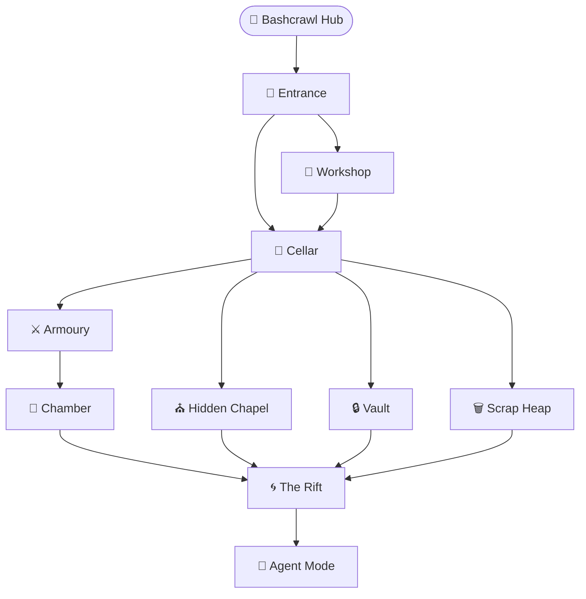

*Welcome to the Bashcrawl Catacombs — an interactive terminal dungeon where every command is a spell and every directory a new realm to explore. Nine interconnected chambers await, each a side-quest that teaches a core set of Bash skills through gameplay.*

## 🗺️ Catacombs Map



## 📖 Chapter Guide

| # | Chamber | Difficulty | Key Commands | Walkthrough |
|---|---------|-----------|--------------|-------------|
| 1 | 🚪 Entrance | 🟢 Easy | `pwd` `ls` `cd` `cat` | [Start Here](/quests/0000/side-quests/bashcrawl-entrance/) |
| 2 | 🔨 Workshop | 🟢 Easy | `mkdir` `touch` `rm` `echo >` | [Workshop](/quests/0000/side-quests/bashcrawl-workshop/) |
| 3 | 🍷 Cellar | 🟢 Easy | `ls -F` `alias` `file` | [Cellar](/quests/0000/side-quests/bashcrawl-cellar/) |
| 4 | ⚔️ Armoury | 🟡 Medium | `chmod` `./` permissions | [Armoury](/quests/0000/side-quests/bashcrawl-armoury/) |
| 5 | 🐉 Chamber | 🟡 Medium | `let` `$(( ))` arithmetic | [Chamber](/quests/0000/side-quests/bashcrawl-chamber/) |
| 6 | ⛪ Hidden Chapel | 🔴 Hard | `ls -a` `man` hidden dirs | [Chapel](/quests/0000/side-quests/bashcrawl-hidden-chapel/) |
| 7 | 🔒 Vault | 🟡 Medium | `export` `$VAR` `env` | [Vault](/quests/0000/side-quests/bashcrawl-vault/) |
| 8 | 🗑️ Scrap Heap | 🟡 Medium | `ln -s` `readlink` symlinks | [Scrap](/quests/0000/side-quests/bashcrawl-scrap/) |
| 9 | 🌀 The Rift | 🔴 Hard | pipes `\|` `&&` redirection | [Rift](/quests/0000/side-quests/bashcrawl-rift/) |
| ★ | 🤖 Agent Mode | 🔴 Hard | `--agent` `--batch` `--screenshot-dir` | [Agent](/quests/0000/side-quests/bashcrawl-agent-mode/) |

## ⚡ Quick Start

```bash
# From this directory — choose your mode:
./bash_crawl.sh            # Interactive menu
./bash_crawl.sh online     # Open web browser version (no install)
./bash_crawl.sh local      # Clone repo + launch Textual TUI
./bash_crawl.sh classic    # Clone repo + classic Bash emulator
./bash_crawl.sh tutorial   # Tutorial mode (step-by-step)
./bash_crawl.sh agent      # Agent mode (AI playtesting)
./bash_crawl.sh --quest entrance   # Print walkthrough URL then launch
```

## 🎮 Play Modes

| Mode | How to Launch | Best For |
|------|--------------|----------|
| **Web TUI** | [bamr87.github.io/bashcrawl](https://bamr87.github.io/bashcrawl/) | First playthrough, classrooms, no-install |
| **Textual TUI** | `./main.sh --interactive` | Beginners wanting a rich local interface |
| **Classic Bash** | `./main.sh --classic` | Systems without Python/Textual |
| **Native Terminal** | `./main.sh --native` | Full real-filesystem experience |
| **Tutorial Mode** | `./main.sh --tutorial` | Guided step-by-step learning |
| **Agent Mode** | `./main.sh --agent` | AI automation and screenshots |

## 🧙 In-Game Commands

| Command | Effect |
|---------|--------|
| `quest` | Show current quest objectives |
| `merlin` | Get a context-aware hint |
| `status` or `hp` | Show health and progress |
| `inventory` or `i` | List collected items |
| `map` | Display the dungeon map |
| `save` | Save current progress |
| `load` | Restore last save |
| `tutorial` | Toggle tutorial mode |
| `commands` | List all game commands |
| `help` | Show help screen |
| `reset` | Reset to a fresh start |

## ⚔️ Combat Commands

| Script | Chamber | Encounter |
|--------|---------|-----------|
| `./statue` | Chamber | Solve arithmetic to defeat the stone guardian |
| `./monster` | Chapel hall | Combat encounter — use weapon from Armoury |
| `./ghost` | Vault lab | Ghost encounter — environment variable skills required |
| `./goblet` | Vault stronghold | Solve the goblet puzzle; unlocks the path to the Rift |

## 🔧 Maintenance Commands

```bash
./setup.sh --verify        # Check installation health
./setup.sh --repair        # Fix common permission/setup issues
./main.sh --status         # Show current game progress
./main.sh --reset          # Reset for a fresh run
```

## 📚 External Resources

- [Bashcrawl — Play Online](https://bamr87.github.io/bashcrawl/)
- [Bashcrawl GitHub Repository](https://github.com/bamr87/bashcrawl/)
- [The Spellbook: Bash Cheatsheet](/shell/)
- [The Grand Grimoire: Complete Bash Reference](/docs/bash-complete-reference/)
- [Original Upstream — GitLab slackermedia/bashcrawl](https://gitlab.com/slackermedia/bashcrawl)

## 🗺️ Quest Network

**Quest Series**: Bashcrawl Adventure Path

**Prerequisites**: None — this hub is a perfect entry point.

**Child Quests**: All nine chamber walkthroughs above (see Chapter Guide).

**Sequel Quest**: [Bash Run and Beyond](/quests/0000/side-quests/bash-run/) — extend the dungeon with custom scripting.

---

*Ready? Run `./bash_crawl.sh` or open [Bashcrawl Online](https://bamr87.github.io/bashcrawl/) and type your first command.* ⚔️✨
