*Greetings, brave adventurer! Welcome to the Git Basics quest — where you'll learn the version control system that powers nearly every software project on the planet. Git lets you track changes, collaborate with others, and fearlessly experiment with code knowing you can always roll back. This is the single most important tool in any developer's inventory.*

### 🌟 The Legend Behind This Quest

*Long before the age of cloud realms and container kingdoms, developers toiled in darkness — overwriting each other's scrolls, losing ancient code to careless keystrokes, and deploying broken incantations with no way to revert. Then came Git, forged by Linus Torvalds in the fires of the Linux kernel. It granted developers the power of perfect memory: every change recorded, every experiment safely branched, every mistake reversible. Today, Git is the foundation spell in every developer's grimoire — and mastering it is your first step toward true digital sorcery.*

### 🗺️ Quest Network Position

```mermaid
graph TB
    subgraph "Prerequisites"
        Terminal["🌱 Terminal Fundamentals"]
    end
    
    subgraph "Current Quest"
        Main["🏰 Git Basics: Version Control"]
    end
    
    subgraph "Unlocked Adventures"
        GitAdv["🏰 Advanced Git Workflows"]
        GitHub["🏰 GitHub Collaboration"]
        CICD["⚔️ CI/CD Pipelines"]
    end
    
    Terminal --> Main
    Main --> GitAdv
    Main --> GitHub
    GitHub --> CICD
    
    style Main fill:#ffd700,stroke:#333,stroke-width:2px
    style Terminal fill:#87ceeb
    style GitAdv fill:#98fb98
    style GitHub fill:#98fb98
    style CICD fill:#98fb98
```



## 🎯 Quest Objectives

### Primary Objectives (Required for Quest Completion)
- [ ] **Initialize a Git Repository** — Create a new repo and understand the `.git` directory
- [ ] **Track Changes with Commits** — Stage files and write meaningful commit messages
- [ ] **Work with Branches** — Create, switch, and merge branches
- [ ] **Collaborate with Remotes** — Push to and pull from a remote repository (GitHub)

### Secondary Objectives (Bonus Achievements)
- [ ] **Resolve a Merge Conflict** — Handle conflicting changes between branches
- [ ] **Use `.gitignore`** — Exclude files from version control
- [ ] **Explore Git Log** — Navigate commit history with various log formats
- [ ] **Undo Mistakes** — Use `git restore`, `git reset`, and `git revert`

### Mastery Indicators
- [ ] Can explain the difference between working directory, staging area, and repository
- [ ] Can create a feature branch, make changes, and merge it back
- [ ] Can push code to GitHub and clone a remote repository
- [ ] Can resolve a merge conflict manually

## 🗺️ Quest Prerequisites

### 📋 Knowledge Requirements
- [ ] Terminal navigation basics (`cd`, `ls`, `mkdir`)
- [ ] Understanding of files and directories

### 🛠️ System Requirements
- [ ] Git installed (`git --version` to verify)
- [ ] GitHub account (free at [github.com](https://github.com))
- [ ] Text editor (VS Code recommended)

## 🌍 Install Git on Your Platform

### 🍎 macOS

```bash
# Git comes with Xcode CLI tools, or install via Homebrew
brew install git

# Verify installation
git --version
```

### 🪟 Windows

```powershell
# Install with winget
winget install Git.Git

# Or download from https://git-scm.com/download/win
# Verify installation
git --version
```

### 🐧 Linux

```bash
# Ubuntu/Debian
sudo apt update && sudo apt install git

# Fedora
sudo dnf install git

# Verify installation
git --version
```

---

## 🧙‍♂️ Chapter 1: Your First Repository — The Origin Story

*Every great codebase starts with `git init`. In this chapter, you'll create your first repository and learn the fundamental rhythm of Git: edit → stage → commit.*

### ⚙️ Initial Configuration

Before your first commit, tell Git who you are:

```bash
# Set your identity (used in every commit)
git config --global user.name "Your Name"
git config --global user.email "you@example.com"

# Set default branch name to 'main' (recommended)
git config --global init.defaultBranch main

# Verify your settings
git config --list
```

### 🏗️ Creating a Repository

```bash
# Create a new project directory
mkdir my-first-repo
cd my-first-repo

# Initialize Git tracking
git init
```

**Expected Output:**
```text
Initialized empty Git repository in /path/to/my-first-repo/.git/
```

### 📝 The Git Workflow: Edit → Stage → Commit

```bash
# 1. Create a file
echo "# My First Project" > README.md

# 2. Check status — see untracked files
git status

# 3. Stage the file (add to staging area)
git add README.md

# 4. Commit with a descriptive message
git commit -m "docs: add initial README"
```

### 🔍 Understanding the Three Areas

```mermaid
flowchart LR
    WD["📂 Working Directory\n(your files)"] -->|git add| SA["📋 Staging Area\n(index)"]
    SA -->|git commit| REPO["🏛️ Repository\n(.git history)"]
    REPO -->|git restore| WD
    SA -->|git restore --staged| WD
    
    style WD fill:#ffcccc,stroke:#cc0000
    style SA fill:#fff3cd,stroke:#cc9900
    style REPO fill:#d4edda,stroke:#28a745
```



```text
Working Directory    →    Staging Area    →    Repository
   (your files)          (git add)           (git commit)
   
   Edit files here      Preview what        Permanent snapshot
                         will be committed   in project history
```

### ✅ Chapter 1 Checkpoint: Repository Initiation

**Validation — confirm each before proceeding:**

- [ ] `git config user.name` returns your name
- [ ] `git status` inside `my-first-repo/` shows a clean working tree after your first commit
- [ ] `git log --oneline` shows at least one commit with a proper message

**🧠 Knowledge Check:**
- [ ] Can you explain what `.git/` contains and why deleting it removes all history?
- [ ] What is the difference between `git add .` and `git add README.md`?
- [ ] Why does `git status` show a file as "untracked" before staging?

### ⚡ Quick Wins
- [ ] Run `git init` to create a repository
- [ ] Create a file, `git add` it, and `git commit` it
- [ ] Run `git status` before and after staging to see the difference
- [ ] Run `git log` to see your first commit

---

## 🧙‍♂️ Chapter 2: Branching — Parallel Universes

*Branches let you work on features in isolation without affecting the main codebase. Think of them as parallel timelines you can merge together when ready.*

### 🔀 Branch Lifecycle Diagram


### 🌿 Creating and Switching Branches

```bash
# Create a new branch
git branch feature/greeting

# Switch to it
git switch feature/greeting

# Or create and switch in one command
git switch -c feature/greeting
```

### 📝 Making Changes on a Branch

```bash
# Add a new file on the feature branch
echo "Hello, World!" > greeting.txt
git add greeting.txt
git commit -m "feat: add greeting message"

# See all branches (* marks current)
git branch
```

### 🔀 Merging Branches

```bash
# Switch back to main
git switch main

# Merge the feature branch into main
git merge feature/greeting

# Delete the branch (optional, it's merged)
git branch -d feature/greeting
```

### ⚠️ Handling Merge Conflicts

When two branches modify the same lines, Git asks you to resolve the conflict:

```bash
# Git marks conflicts in the file like this:
<<<<<<< HEAD
Current content on main
=======
Different content from feature branch
>>>>>>> feature/greeting
```

**To resolve:**
1. Open the file in your editor
2. Choose which content to keep (or combine both)
3. Remove the conflict markers (`<<<<<<<`, `=======`, `>>>>>>>`)
4. Stage and commit:

```bash
git add conflicted-file.txt
git commit -m "fix: resolve merge conflict in greeting"
```

### ✅ Chapter 2 Checkpoint: Branch Mastery

**Validation — confirm each before proceeding:**

- [ ] `git branch` shows at least two branches (including `main`)
- [ ] `git log --oneline --graph --all` shows a merge commit
- [ ] You have successfully resolved at least one merge conflict

**🧠 Knowledge Check:**
- [ ] What happens to your working directory files when you `git switch` between branches?
- [ ] Why is `git branch -d` safer than `git branch -D`?
- [ ] When does Git create a merge commit vs. a fast-forward merge?

### ⚡ Quick Wins
- [ ] Create a branch with `git switch -c feature/test`
- [ ] Make a commit on that branch
- [ ] Switch back to `main` and merge it
- [ ] Intentionally create and resolve a merge conflict

---

## 🧙‍♂️ Chapter 3: Remote Repositories — Connecting to the World

*Local Git is powerful, but the real magic happens when you connect to a remote like GitHub. This enables collaboration, backup, and sharing.*

### 🌐 Local ↔ Remote Sync Flow

```mermaid
sequenceDiagram
    participant WD as 💻 Working Directory
    participant LOCAL as 🏛️ Local Repo
    participant REMOTE as ☁️ GitHub (Remote)
    
    WD->>LOCAL: git commit
    LOCAL->>REMOTE: git push
    REMOTE->>LOCAL: git fetch
    LOCAL->>WD: git merge / git pull
    REMOTE-->>WD: git pull (fetch + merge)
    
    Note over WD,REMOTE: git clone creates LOCAL + WD from REMOTE
```



### 🔗 Connecting to GitHub

```bash
# Add a remote repository
git remote add origin https://github.com/yourusername/my-first-repo.git

# Verify the remote
git remote -v

# Push your local commits to GitHub
git push -u origin main
```

### 📥 Cloning an Existing Repository

```bash
# Clone a repository from GitHub
git clone https://github.com/username/repository.git

# This creates a local copy with full history
cd repository
git log --oneline
```

### 🔄 Staying in Sync

```bash
# Pull latest changes from remote
git pull origin main

# Push your changes to remote
git push origin main
```

### 📄 The `.gitignore` File

Tell Git to ignore files that shouldn't be tracked:

```bash
# Create a .gitignore file
cat > .gitignore << 'EOF'
# OS files
.DS_Store
Thumbs.db

# Dependencies
node_modules/
__pycache__/

# Environment files
.env
*.log
EOF

git add .gitignore
git commit -m "chore: add gitignore for common files"
```

### 📜 Exploring History

```bash
# View commit log
git log

# Compact one-line format
git log --oneline

# Visual branch graph
git log --oneline --graph --all

# Show changes in a specific commit
git show abc1234
```

### ✅ Chapter 3 Checkpoint: Remote Connectivity

**Validation — confirm each before proceeding:**

- [ ] `git remote -v` shows your GitHub URL for both fetch and push
- [ ] Your repository is visible at `https://github.com/yourusername/my-first-repo`
- [ ] `git log --oneline` matches between local and GitHub

**🧠 Knowledge Check:**
- [ ] What does the `-u` flag in `git push -u origin main` do?
- [ ] What is the difference between `git fetch` and `git pull`?
- [ ] Why should `.env` files always be in `.gitignore`?

### ⚡ Quick Wins
- [ ] Create a repository on GitHub and push your local repo to it
- [ ] Clone a public repository and explore its history
- [ ] Create a `.gitignore` and verify ignored files don't appear in `git status`
- [ ] Use `git log --oneline --graph` to visualize history

---

## 🧙‍♂️ Chapter 4: Undoing Mistakes — The Time-Travel Spells

*Every adventurer makes mistakes. The mark of a true Git sorcerer is knowing how to undo them safely without destroying the timeline.*

### ↩️ Undo Decision Flowchart


### 🔧 Common Undo Operations

```bash
# Unstage a file (keep your edits)
git restore --staged README.md

# Discard changes in working directory (⚠️ destructive)
git restore README.md

# Undo the last commit but keep changes staged
git reset --soft HEAD~1

# Undo the last commit AND discard all changes (⚠️ destructive)
git reset --hard HEAD~1

# Safely reverse a published commit (creates a new commit)
git revert abc1234
```

### ⚠️ Safety Rules

| Command | Destructive? | Safe for shared branches? |
|---------|-------------|---------------------------|
| `git restore --staged` | No | Yes |
| `git restore` | **Yes** — loses edits | Yes |
| `git reset --soft` | No | ⚠️ Only before pushing |
| `git reset --hard` | **Yes** | ⚠️ Only before pushing |
| `git revert` | No | **Yes** — preferred method |

### ⚡ Quick Wins
- [ ] Stage a file, then unstage it with `git restore --staged`
- [ ] Make a commit, then undo it with `git reset --soft HEAD~1`
- [ ] Use `git revert` to reverse a commit safely

---

## 🎮 Implementation Challenges

### Challenge 1: 🟢 The Chronicle Keeper (🕐 20 minutes)

**Objective:** Build a personal project repository with a clean, professional commit history.

**Acceptance Criteria:**
- [ ] Repository initialized with `git init`
- [ ] Contains a `README.md` with project title, description, and usage section
- [ ] Contains a `.gitignore` with at least 5 ignore rules
- [ ] Has **exactly 5 commits** following conventional commit format (`feat:`, `docs:`, `chore:`, etc.)
- [ ] Repository pushed to GitHub with a visible green checkmark

**Verification Command:**
```bash
# Should show exactly 5 commits
git log --oneline | wc -l

# All commits should follow conventional format
git log --oneline | grep -E '^[a-f0-9]+ (feat|fix|docs|chore|refactor|test):'
```

---

### Challenge 2: 🟡 The Branch Weaver (🕐 30 minutes)

**Objective:** Simulate a feature-branch workflow with parallel development and a merge conflict.

**Acceptance Criteria:**
- [ ] Start from a `main` branch with at least 2 files
- [ ] Create `feature/header` and `feature/footer` branches from `main`
- [ ] Both branches modify the **same line** in `index.html` (to force a conflict)
- [ ] Merge `feature/header` into `main` (should fast-forward or clean merge)
- [ ] Merge `feature/footer` into `main` — **resolve the conflict**
- [ ] Final `git log --oneline --graph --all` shows the merge topology

**Expected Branch Topology:**


**Verification Command:**
```bash
# Should show merge commits
git log --oneline --graph --all

# Verify no conflict markers remain
grep -rn '<<<<<<' . && echo 'FAIL: unresolved conflicts' || echo 'PASS: no conflicts'
```

---

### Challenge 3: 🔴 The Remote Ranger (🕐 25 minutes)

**Objective:** Practice the full local-to-remote workflow including forking and pull requests.

**Acceptance Criteria:**
- [ ] Fork a public repository on GitHub (e.g., a simple README-only repo)
- [ ] Clone your fork locally
- [ ] Create a `feature/my-improvement` branch
- [ ] Make at least 2 commits with meaningful changes
- [ ] Push the branch to your fork
- [ ] Open a Pull Request (PR) comparing your branch to your fork's `main`
- [ ] Add a PR description explaining what changed and why

**Verification Command:**
```bash
# Verify remote points to YOUR fork
git remote -v | grep 'your-username'

# Verify feature branch exists on remote
git branch -r | grep 'feature/my-improvement'
```

---

## ⚔️ Boss Battle: The Git Gauntlet

*You've trained with individual spells. Now face the ultimate trial — a multi-phase challenge that tests every skill from this quest in a single, connected scenario.*

### 🏰 The Scenario

You're building a **"Quest Log" web page** — a simple HTML file that tracks your IT-Journey progress. You must use every Git skill from this quest to build it correctly.

### Phase 1: Foundation (Repository Setup)
```bash
# Create and initialize the project
mkdir quest-log && cd quest-log
git init

# Create the initial file
cat > index.html << 'EOF'
<!DOCTYPE html>
<html>
<head><title>Quest Log</title></head>
<body>
  <h1>My Quest Log</h1>
  <ul>
    <li>Terminal Fundamentals — ✅ Complete</li>
  </ul>
</body>
</html>
EOF

# Create .gitignore
echo -e ".DS_Store\n*.log\n.env" > .gitignore

git add .
git commit -m "feat: initialize quest log project"
```

### Phase 2: Feature Development (Branching)
```bash
# Branch 1: Add styling
git switch -c feature/styling
cat > style.css << 'EOF'
body { font-family: sans-serif; max-width: 600px; margin: 2rem auto; }
h1 { color: #2d3748; }
li { padding: 0.5rem 0; }
EOF
# Link the stylesheet in index.html (add <link> in <head>)
git add .
git commit -m "feat: add basic CSS styling"
git switch main

# Branch 2: Add more quests (this will conflict with branch 1 in index.html)
git switch -c feature/more-quests
# Add Git Basics quest to the list in index.html
git add .
git commit -m "feat: add git basics quest to log"
git switch main
```

### Phase 3: Integration (Merging + Conflict Resolution)
```bash
# Merge styling first
git merge feature/styling

# Merge more-quests (expect conflict in index.html)
git merge feature/more-quests
# >> RESOLVE THE CONFLICT <<
git add index.html
git commit -m "fix: resolve merge conflict in quest list"
```

### Phase 4: Time Travel (Undo Operations)
```bash
# Make a deliberate mistake
echo "BROKEN CONTENT" >> index.html
git add . && git commit -m "feat: this is a mistake"

# Revert it safely
git revert HEAD --no-edit

# Verify the bad content is gone
cat index.html
```

### Phase 5: Deployment (Push to Remote)
```bash
# Create the repo on GitHub, then:
git remote add origin https://github.com/yourusername/quest-log.git
git push -u origin main
```

### 🏆 Boss Battle Victory Conditions

- [ ] Repository has **at least 6 commits** (init, style, quests, merge, mistake, revert)
- [ ] `git log --oneline --graph` shows branching and merging
- [ ] No unresolved conflict markers in any file
- [ ] A revert commit is visible in the history
- [ ] Repository is live on GitHub with all commits visible
- [ ] `.gitignore` is present and working

**Full Verification Script:**
```bash
#!/bin/bash
echo "=== 🏰 Git Gauntlet Verification ==="

# Check commit count
COMMITS=$(git log --oneline | wc -l | tr -d ' ')
[[ $COMMITS -ge 6 ]] && echo "✅ Commits: $COMMITS (≥6)" || echo "❌ Commits: $COMMITS (need ≥6)"

# Check for merge commits
MERGES=$(git log --merges --oneline | wc -l | tr -d ' ')
[[ $MERGES -ge 1 ]] && echo "✅ Merge commits found: $MERGES" || echo "❌ No merge commits"

# Check for revert commits
REVERTS=$(git log --oneline | grep -c 'Revert\|revert')
[[ $REVERTS -ge 1 ]] && echo "✅ Revert commits found: $REVERTS" || echo "❌ No revert commits"

# Check for conflict markers
grep -rn '<<<<<<' . --include='*.html' --include='*.css' 2>/dev/null
[[ $? -ne 0 ]] && echo "✅ No unresolved conflicts" || echo "❌ Unresolved conflicts found!"

# Check .gitignore
[[ -f .gitignore ]] && echo "✅ .gitignore exists" || echo "❌ Missing .gitignore"

# Check remote
git remote -v | grep -q 'origin' && echo "✅ Remote configured" || echo "❌ No remote configured"

echo "=== Verification Complete ==="
```

---

## 🗺️ Complete Quest Flow

```mermaid
flowchart TD
    START["🏰 Quest Start"] --> CH1["🧙‍♂️ Ch1: First Repository"]
    CH1 --> CP1{"✅ Checkpoint 1\nRepo + Commits?"}
    CP1 -->|Pass| CH2["🧙‍♂️ Ch2: Branching"]
    CP1 -->|Fail| CH1
    CH2 --> CP2{"✅ Checkpoint 2\nBranch + Merge?"}
    CP2 -->|Pass| CH3["🧙‍♂️ Ch3: Remotes"]
    CP2 -->|Fail| CH2
    CH3 --> CP3{"✅ Checkpoint 3\nPush + Pull?"}
    CP3 -->|Pass| CH4["🧙‍♂️ Ch4: Undo Mistakes"]
    CP3 -->|Fail| CH3
    CH4 --> CHALLENGES["🎮 Implementation Challenges"]
    CHALLENGES --> BOSS{"⚔️ Boss Battle:\nThe Git Gauntlet"}
    BOSS -->|Victory| REWARDS["🎁 Quest Rewards"]
    BOSS -->|Defeat| CHALLENGES
    REWARDS --> NEXT["🔮 Next Adventures"]
    
    style START fill:#6c5ce7,color:#fff
    style BOSS fill:#e17055,color:#fff,stroke-width:3px
    style REWARDS fill:#00b894,color:#fff
    style NEXT fill:#0984e3,color:#fff
```



---

## 🏆 Quest Completion Validation

### Portfolio Artifacts Created
- [ ] **Git Repository** — Local repo with multiple commits, branches, and merges
- [ ] **GitHub Repository** — Remote repo with complete history pushed
- [ ] **`.gitignore`** — Properly configured ignore rules
- [ ] **Merge History** — At least one successful branch merge with conflict resolution
- [ ] **Revert History** — At least one `git revert` demonstrating safe undo
- [ ] **Quest Log Project** — The Boss Battle artifact on GitHub

### Skills Demonstrated
- [ ] **Repository Management** — init, clone, remote add, config
- [ ] **Change Tracking** — add, commit, status, diff, log
- [ ] **Branching** — branch, switch, merge, conflict resolution
- [ ] **Remote Collaboration** — push, pull, clone, fork, PR
- [ ] **Undo Operations** — restore, reset, revert

### 🧠 Final Knowledge Assessment

Before claiming your reward, you should be able to answer:

1. **Explain** the three areas (working directory, staging area, repository) in your own words.
2. **Describe** when you would use `git revert` vs. `git reset`.
3. **Draw** (mentally or on paper) the branch topology for a feature-branch workflow.
4. **Troubleshoot** a scenario where `git push` is rejected because the remote has new commits.

---

## 🎁 Quest Rewards and Achievements

### 🏆 Achievement Badges Earned
- **🏆 Version Control Initiate** — Mastered the fundamental Git workflow
- **🌿 Branch Weaver** — Created, merged, and resolved conflicts across branches
- **☁️ Remote Ranger** — Connected local and remote repositories
- **⏪ Time Traveler** — Demonstrated safe undo operations

### ⚡ Skills and Abilities Unlocked
- **🛠️ Git Repository Management** — Create, configure, and maintain repositories
- **🛠️ Branch & Merge Operations** — Parallel development with clean integration
- **🛠️ Remote Collaboration** — Push, pull, clone, and work with GitHub
- **🛠️ History Navigation** — Read, search, and understand commit history
- **🛠️ Safe Undo** — Reverse mistakes without losing work

### 📈 Your Journey Progress
- **Previous Skills**: Terminal navigation, file system operations
- **Current Mastery**: Git version control — commits, branches, remotes, undo
- **Next Adventures**: Advanced Git workflows, GitHub collaboration, CI/CD pipelines

---

## 🔮 Your Next Epic Adventures

### 🎯 Recommended Follow-Up Quests
- **Advanced Git Workflows** — Rebasing, cherry-picking, stashing, and interactive rebase
- **GitHub Collaboration** — Issues, pull request reviews, branch protection rules
- **CI/CD Pipelines** — Automated testing and deployment with GitHub Actions

### 🌐 Skill Web Connections
- **DevOps**: Git is the foundation for all CI/CD and infrastructure-as-code workflows
- **Team Collaboration**: Understanding Git enables effective code review and pair programming
- **Open Source**: Contributing to open source projects requires Git fluency

---

## 📚 References & Resources

### 📖 Essential Documentation
- [Git Official Documentation](https://git-scm.com/doc) — Primary reference guide
- [Pro Git Book (free)](https://git-scm.com/book/en/v2) — Comprehensive deep dive
- [GitHub Docs](https://docs.github.com/) — Remote collaboration reference

### 🎮 Interactive Learning
- [Learn Git Branching — Visual Interactive](https://learngitbranching.js.org/) — Practice branching in your browser
- [GitHub Skills — Interactive Tutorials](https://skills.github.com/) — Guided GitHub exercises
- [Oh My Git! — Game-Based Learning](https://ohmygit.org/) — Learn Git through a game

### 📋 Quick References
- [Atlassian Git Tutorials](https://www.atlassian.com/git/tutorials) — Beginner to advanced guides
- [Git Cheat Sheet (GitHub)](https://education.github.com/git-cheat-sheet-education.pdf) — Printable command reference
- [Conventional Commits](https://www.conventionalcommits.org/) — Commit message standard
