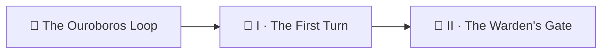

*Every great engine begins as a wheel turning once. Before golems, before gates, before sealed evidence — there is a humbler rite: a loop that wakes each morning, picks **one** scroll from the shelf, tests whether its spell still casts, and writes the verdict in a ledger it never lies to. Build that today, in an hour, with nothing but a repository and a scheduled workflow — and you will hold the seed that the entire quest-perfection engine grew from.*

*The real-world skill under the fantasy: **loop design**. Observe (pick work deterministically), check (run a test that exits 0 or 1), record (commit machine-readable state), repeat (a cron schedule). Every autonomous system you will ever build — CI pipelines, monitoring probes, content engines — is this cycle wearing heavier armor.*

> 🧭 **Campaign note:** this chapter sits at Level `0000` because it is the campaign's easiest — The Ouroboros Loop uses levels as a difficulty ladder, so its chapters run *through* the realm rather than sitting in one bucket.

## 📖 The Legend Behind This Quest

The realm's quest-perfection engine walks six curriculum slices a day, seals its evidence, and merges its own repairs. But strip away the golems and the wards, and its skeleton is exactly what you build here: a **planner** that picks today's work by date, a **checker** that returns a truthful exit code, and a **ledger** that remembers. The masters call the full engine an Ouroboros; this chapter is the serpent's first turn.

## 🎯 Quest Objectives

By the end of this quest you will:

- [ ] **Scaffold a potion book** — a repo of Markdown recipes whose code blocks are runnable claims
- [ ] **Write a deterministic checker** — a script that extracts a recipe's spell and reports pass/fail honestly
- [ ] **Implement date rotation** — pick exactly one recipe per day, sweeping the whole shelf over N days
- [ ] **Record state in a committed ledger** — JSON the loop reads back tomorrow
- [ ] **Schedule the loop** — a GitHub Actions workflow that turns unaided every morning

## 🗺️ Quest Prerequisites

- 📋 A GitHub account and `gh auth login` completed
- 📋 Git installed; comfortable with `git add / commit / push`
- 📋 No AI token needed — this chapter is golem-free by design

## 🌍 Choose Your Adventure Platform

*The loop runs on GitHub's servers, so any world works. You only need a terminal to scaffold.*

### 🛠️ Any world (macOS, Windows + WSL/Git Bash, Linux)

```bash
# Forge the repository and clone it
gh repo create potion-book --public --clone
cd potion-book
mkdir -p potions scripts .github/workflows
```

## 🧙‍♂️ Chapter 1: Stock the Shelf — Content That Makes Testable Claims

A loop can only check content that makes **claims**. Each potion (recipe) carries one fenced `bash` block — its brewing spell — that must exit `0`. That's the whole contract.

````bash
cat > potions/healing-draught.md <<'EOF'
# Healing Draught

Restores 10 HP. Brew:

```bash
echo "simmer herbs" && sleep 1 && echo "draught ready"
```
EOF

cat > potions/invisibility-tonic.md <<'EOF'
# Invisibility Tonic

Vanish for 60 seconds. Brew:

```bash
test -n "$HOME" && echo "you are now unseen"
```
EOF

# One deliberately broken potion — the loop needs something to catch:
cat > potions/dragons-breath.md <<'EOF'
# Dragon's Breath

Exhale fire. Brew:

```bash
cast_fireball --intensity 9000
```
EOF
````

### 🔍 Knowledge Check
- [ ] Why must the checkable claim be a *command with an exit code* rather than prose?
- [ ] What real content in your own projects already makes testable claims? (READMEs, tutorials, install docs…)

## 🧙‍♂️ Chapter 2: The Checker and the Rotation — Deterministic Hands

Two small spells do the loop's thinking. Neither involves judgment — that is the point. **Deterministic parts decide; anything clever comes later, behind gates.**

The checker extracts the first `bash` fence and runs it in a throwaway lair:

```bash
cat > scripts/check.sh <<'EOF'
#!/usr/bin/env bash
# check.sh <potion.md> — run the recipe's first bash fence; exit code = verdict.
set -euo pipefail
potion="$1"
lair="$(mktemp -d)"
trap 'rm -rf "$lair"' EXIT
# Extract the first ```bash fence into a spell file:
awk '/^```bash$/{f=1;next} /^```$/{if(f)exit} f' "$potion" > "$lair/spell.sh"
[ -s "$lair/spell.sh" ] || { echo "no spell found in $potion"; exit 1; }
( cd "$lair" && bash spell.sh )
EOF
chmod +x scripts/check.sh
```

The rotation picks **one** potion per day — the same one for everyone on the same date, so the loop is reproducible:

```python
# scripts/pick.py — print today's potion path (date-rotated, deterministic).
import datetime
import pathlib
import sys

potions = sorted(pathlib.Path("potions").glob("*.md"))
if not potions:
    sys.exit("the shelf is empty")
day = datetime.date.today().toordinal()
print(potions[day % len(potions)])
```

Test both hands locally before trusting them to the Factory:

```bash
python3 scripts/pick.py                       # → potions/<today's pick>.md
./scripts/check.sh potions/healing-draught.md  # → exit 0 (echoes, then "draught ready")
./scripts/check.sh potions/dragons-breath.md   # → exit 127 (command not found) — GOOD: an honest fail
echo "exit=$?"
```

### 🔍 Knowledge Check
- [ ] Why `day % len(potions)`? What happens when you add a fourth potion?
- [ ] Why does the checker run in a `mktemp -d` lair instead of the repo root?

## 🧙‍♂️ Chapter 3: The Ledger and the Schedule — Memory and Heartbeat

The ledger is the loop's memory: committed JSON, one entry per potion, overwritten on each re-check. Tomorrow's turn reads what today's turn wrote — that is what makes it a *loop* rather than a job.


```yaml
# .github/workflows/first-turn.yml
name: The First Turn
on:
  schedule:
    - cron: '0 9 * * *'     # one turn, every morning at 09:00 UTC
  workflow_dispatch: {}      # and a lever to turn it by hand

permissions:
  contents: write            # the loop commits its own ledger

jobs:
  turn:
    runs-on: ubuntu-latest
    steps:
      - uses: actions/checkout@v4

      - name: Observe — pick today's potion
        id: pick
        run: echo "potion=$(python3 scripts/pick.py)" >> "$GITHUB_OUTPUT"

      - name: Check — brew it honestly
        id: check
        run: |
          set +e
          ./scripts/check.sh "$POTION"
          echo "status=$([ $? -eq 0 ] && echo pass || echo fail)" >> "$GITHUB_OUTPUT"
        env:
          POTION: ${{ steps.pick.outputs.potion }}

      - name: Record — write the ledger and commit it
        run: |
          python3 - "$POTION" "$STATUS" <<'PY'
          import json, pathlib, sys, datetime
          potion, status = sys.argv[1], sys.argv[2]
          p = pathlib.Path("ledger.json")
          data = json.loads(p.read_text()) if p.exists() else {"potions": {}}
          data["potions"][potion] = {
              "status": status,
              "last_checked": datetime.date.today().isoformat(),
          }
          p.write_text(json.dumps(data, indent=2) + "\n")
          PY
          git config user.name "first-turn-loop"
          git config user.email "loop@users.noreply.github.com"
          git add ledger.json
          git commit -m "ledger: $POTION -> $STATUS [skip ci]" || echo "no change"
          git push
        env:
          POTION: ${{ steps.pick.outputs.potion }}
          STATUS: ${{ steps.check.outputs.status }}
```


> ⚠️ **Copying this workflow into a Jekyll site?** Wrap the whole block in Liquid `raw` tags — Actions expressions and Liquid share the same curly-brace runes. (This very page does exactly that.)

Arm it and turn the wheel once by hand:

```bash
git add -A && git commit -m "forge the first turn" && git push
gh workflow run first-turn.yml
gh run watch                # observe → check → record
git pull && cat ledger.json # the loop's first memory
```

Run it three days in a row (or dispatch three times across three dates) and the rotation sweeps all three potions — `dragons-breath.md` lands in the ledger as `"fail"`. Your loop has **witnessed** a defect. What happens to that witness is Chapters II–VI.

### 🔍 Knowledge Check
- [ ] Why does the record step commit with `[skip ci]`? What loop-shaped monster does that ward off? (You'll meet its big sibling in Chapter VII.)
- [ ] Why `set +e` around the check — what would `set -e` do to your honest-fail path?

## 🔁 Reproduce It

Your potion book is a 50-line miniature of the real engine in `bamr87/it-journey`:

- Your `pick.py` rotation ↔ the planner `scripts/quest/walkthrough_plan.py` (date-rotates whole curriculum slices)
- Your `check.sh` ↔ the tier-1 validator + the agentic execute engine (`test/quest-validator/`)
- Your `ledger.json` ↔ `.quests/ledger.json`, the committed source of truth the loop reads back
- Your `first-turn.yml` ↔ `quest-perfection.yml`, the daily conductor

Skim any of those files now and you will recognize every organ — just armored.

## 🎮 Mastery Challenge

**Objective:** make the loop *report*, not just record.

**Success Criteria:**
- [ ] Add a step that opens (or updates) a GitHub issue titled "🧪 Broken potions" listing every ledger entry with `"status": "fail"` (`gh issue create` / `gh issue edit` — the runner's `GITHUB_TOKEN` is already authenticated)
- [ ] Fix `dragons-breath.md` (swap the imaginary command for a real one), dispatch the loop on its rotation day, and watch the ledger flip to `"pass"`
- [ ] Explain in one sentence why the *loop* noticed your fix without being told

## 🎁 Rewards & Progression

- 🔁 **First Turn** — earned when your ledger holds one entry the loop wrote unaided
- ⚡ Skills unlocked: loop anatomy · date rotation · committed state
- 📊 **+50 XP**

## 🗺️ Quest Network



## 🔮 Next Adventures

- 🚦 [Chapter II — The Warden's Gate](/quests/0101/ouroboros-loop-02-the-wardens-gate/): your loop gets a kill switch, least privilege, and its first hard lesson about permissions
- 👑 Campaign hub: [Epic Quest: The Ouroboros Loop](/quests/codex/ouroboros-loop/)

## 📚 Resource Codex

- [GitHub Actions: schedule events](https://docs.github.com/actions/writing-workflows/choosing-when-your-workflow-runs/events-that-trigger-workflows#schedule) — the loop's heartbeat
- [GitHub Actions: workflow permissions](https://docs.github.com/actions/security-for-github-actions/security-guides/automatic-token-authentication) — why `contents: write` was needed
- [`gh` CLI manual](https://cli.github.com/manual/) — for the mastery challenge

## 🕸️ Knowledge Graph

*Structured wiki-links connect this quest to the IT-Journey knowledge graph.*

**Campaign hub:** [[Epic Quest: The Ouroboros Loop]] **Next chapter:** [[The Warden's Gate]] **Level home:** [[Level 0000 - Foundation & Init World]]
