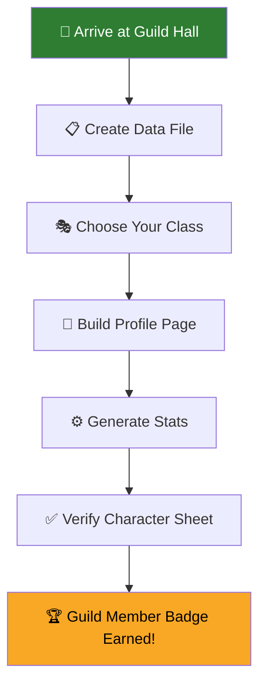

# ⚔️ Forge Your Character: Crafting Your Contributor Identity

> *"Every legend begins with a name, a class, and a story yet to be written."*
> — The Guild Master

## 🎯 Quest Objectives

By the end of this quest, you will:

- [ ] Understand the Contributor Character Profile system
- [ ] Create your contributor data file in YAML
- [ ] Set up your profile page with the character sheet
- [ ] Choose your class and customize your identity
- [ ] Run the stats generator to populate your profile
- [ ] Verify your character sheet renders correctly

## 📖 The Story So Far

You've arrived at the **Guild Hall of IT-Journey** — a grand hall lined with portraits of adventurers who came before you. Each portrait glows with stats, badges, and tales of contribution.

The Guild Master approaches:

> *"Welcome, traveler. Before you can embark on quests, you must forge your identity in the Hall of Contributors. Your character sheet will track your deeds — every commit forged, every quest conquered, every post penned. Choose your class wisely, for it will define your banner's colors."*

## 🗺️ Quest Map



## 📋 Step 1: Fork & Clone the Repository

If you haven't already, fork and clone the IT-Journey repository:

```bash
# Fork on GitHub first, then clone your fork
git clone https://github.com/YOUR_USERNAME/it-journey.git
cd it-journey
```

> **Already cloned?** Make sure you're up to date:
> ```bash
> git pull origin main
> ```

- [ ] Repository cloned and up to date

## 📋 Step 2: Create Your Contributor Data File

The Guild's records are stored as YAML data files. Copy the template:

```bash
cp _data/contributors/_template.yml _data/contributors/YOUR_USERNAME.yml
```

Open the file in your editor and fill in your details:

```yaml
# _data/contributors/YOUR_USERNAME.yml

# ═══════════════════════════════════════════
# 🎭 PROFILE — Edit freely
# ═══════════════════════════════════════════
profile:
  display_name: "Your Display Name"
  class: Wizard          # Choose: Wizard, Warrior, Ranger, Rogue, Healer, Bard, Paladin
  avatar: ""             # URL to avatar image (leave blank for GitHub default)
  bio: "A brief description of your quest in IT."
  location: ""
  joined: "2026-03-20"
  banner_color: "#6c3fc5" # Hex color for your profile banner
  links:
    github: "https://github.com/YOUR_USERNAME"
    website: ""
    twitter: ""
  badges_pinned: []      # Pin up to 3 badge IDs here after earning them

# ═══════════════════════════════════════════
# 🤖 AUTO-GENERATED — Do not edit below
# ═══════════════════════════════════════════
stats:
  commits: 0
  prs_merged: 0
  quests_authored: 0
  posts_authored: 0
  lines_added: 0
  lines_removed: 0
  active_days: 0
  current_streak: 0
  longest_streak: 0
  first_commit: null
  latest_commit: null
  top_languages: []
  top_categories: []
  contribution_calendar: []

achievements: []

level:
  xp: 0
  current_level: 0
  tier: Apprentice
  next_level_xp: 100
```

### 🎭 Choosing Your Class

Each class has its own color theme on your character sheet:

| Class | Icon | Banner Color | Ideal For |
|-------|------|-------------|-----------|
| **Wizard** | 🧙 | `#6c3fc5` (Purple) | Backend, architecture, complex systems |
| **Warrior** | ⚔️ | `#c5221f` (Red) | Bug hunters, security, testing |
| **Ranger** | 🏹 | `#2e7d32` (Green) | DevOps, infrastructure, automation |
| **Rogue** | 🗡️ | `#e65100` (Orange) | Performance optimization, hacking |
| **Healer** | 💚 | `#00838f` (Teal) | Documentation, accessibility, UX |
| **Bard** | 🎵 | `#ad1457` (Pink) | Content creation, community, teaching |
| **Paladin** | 🛡️ | `#1565c0` (Blue) | Full-stack, maintenance, code review |

> **Tip**: You can change your class at any time by editing the YAML file!

- [ ] Data file created with your profile information
- [ ] Class chosen and banner color set

## 📄 Step 3: Create Your Profile Page

Copy the profile page template:

```bash
cp -r pages/_about/contribute/contributors/_template \
      pages/_about/contribute/contributors/YOUR_USERNAME
```

Edit `pages/_about/contribute/contributors/YOUR_USERNAME/README.md`:

```markdown
---
title: "Your Display Name"
author: "Your Name"
excerpt: "Your tagline"
class: Wizard
username: YOUR_USERNAME
contributor_data: YOUR_USERNAME
permalink: /contributors/YOUR_USERNAME/
lastmod: 2026-03-20T00:00:00.000Z
---

<link rel="stylesheet" href="{{ '/assets/css/contributor-profile.css' | relative_url }}">



---

## 📜 Personal Scroll

Add anything you'd like — bio, badges, projects, recipes, diagrams...
```

> **Important**: Replace every `YOUR_USERNAME` with your actual GitHub username.

- [ ] Profile page created
- [ ] Front matter filled in with correct username and permalink

## ⚙️ Step 4: Generate Your Stats

Run the stats generator to populate your data file with real numbers from your git history:

### Option A: Using Make (recommended)

```bash
make contributor-stats USERNAME=YOUR_USERNAME
```

### Option B: Using the script directly

```bash
bash scripts/generation/generate_contributor_stats.sh YOUR_USERNAME
```

### Option C: Using Ruby directly

```bash
ruby scripts/generation/generate_contributor_stats.rb YOUR_USERNAME
```

After running, check your data file — the `stats`, `achievements`, and `level` sections should be populated:

```bash
cat _data/contributors/YOUR_USERNAME.yml
```

- [ ] Stats generator ran successfully
- [ ] Data file now has real stats

## ✅ Step 5: Verify Your Character Sheet

Build the Jekyll site locally to see your profile:

```bash
bundle exec jekyll serve
```

Navigate to `http://localhost:4000/contributors/YOUR_USERNAME/` and verify:

- [ ] Avatar displays (or GitHub fallback)
- [ ] Class icon and tier badge appear
- [ ] XP bar shows progress
- [ ] Stats panel shows your numbers
- [ ] Achievement badges are displayed (if any earned)

> **No badges yet?** Don't worry — they unlock as you contribute more. Your first commit to this repo will earn the **First Blood** badge! 🩸

## 🚀 Step 6: Submit Your Character

Commit your changes and open a Pull Request:

```bash
git checkout -b feature/add-contributor-YOUR_USERNAME

git add _data/contributors/YOUR_USERNAME.yml
git add pages/_about/contribute/contributors/YOUR_USERNAME/

git commit -m "feat(contributor): forge character profile for YOUR_USERNAME

Created contributor data file and profile page.
Class: [YOUR_CLASS], ready for adventure!

Closes #XX"

git push origin feature/add-contributor-YOUR_USERNAME
```

Then open a Pull Request on GitHub. Once merged, the GitHub Action will auto-update your stats on every future push to `main`.

- [ ] Changes committed with conventional commit message
- [ ] Pull Request opened and submitted for review

## 🏆 Quest Complete!

Congratulations, adventurer! You've forged your character and joined the Guild of Contributors. Your profile will now automatically track:

- **Commits** — every code change earns XP
- **PRs Merged** — collaboration rewarded
- **Quests Authored** — teaching earns the most XP
- **Posts Written** — share your knowledge
- **Streak** — consistency is power
- **Achievements** — unlock badges as you grow

### What's Next?

Your character sheet has room to grow. Unlock these side quests:

| Side Quest | Level | Difficulty | Reward |
|-----------|-------|------------|--------|
| [Avatar Forge](/quests/side-quest-avatar-forge/) | 0001 | 🟢 Easy | Custom avatar on your profile |
| [Badge Collector](/quests/side-quest-badge-collector/) | 0001 | 🟡 Medium | Pinned badges showcase |
| [Stats Dashboard](/quests/side-quest-stats-dashboard/) | 0010 | 🟡 Medium | Enhanced stats visualization |
| [Contribution Calendar](/quests/side-quest-contribution-calendar/) | 0010 | 🟡 Medium | Activity heatmap |
| [Profile Themes](/quests/side-quest-profile-themes/) | 0100 | 🔴 Hard | Custom CSS themes |

### XP Formula

Your level is calculated from total XP:

| Activity | XP Earned |
|----------|-----------|
| Commit | 10 XP |
| PR Merged | 50 XP |
| Quest Authored | 200 XP |
| Post Authored | 100 XP |

**Level** = `floor(log₂(xp / 100))` clamped to 0–15

**Tiers**: Apprentice (0–3) → Adventurer (4–7) → Warrior (8–11) → Master (12–15)

---

> *"Your name is now inscribed in the Guild's ledger. Go forth and contribute, adventurer — the realm of IT awaits your deeds."*
> — The Guild Master
