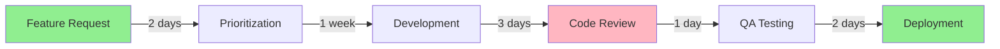

*In the ancient forges of the Digital Kingdom, where lines of code shimmer like molten steel and bugs lurk in shadowy caverns like dragons, a legendary call echoes across the realm. You, the valiant Code Alchemist—a master of algorithms and architect of systems—have been summoned by the High Council of Efficiency. The realm faces a dire threat: **stagnation**, the foul blight that turns innovative projects into bloated monoliths of inefficiency, riddled with waste and rework.*

*Your quest? To wield the sacred philosophy of **Kaizen**—the eternal flame of continuous improvement—and embed it into the very heart of software development. This is no mere task; it is an epic odyssey across five perilous trials, each building upon the last, transforming your team from weary coders into unstoppable guardians of perpetual progress.*

### 🌟 The Legend Behind This Quest

In the mortal world of software development, teams often seek grand transformations: massive rewrites, revolutionary frameworks, sweeping organizational changes. Yet the ancient masters knew a deeper truth—that true power lies not in dramatic upheavals, but in the accumulation of countless small improvements, each building upon the last like drops of water carving through stone.

Kaizen (改善, "change for better") emerged from the post-war Japanese manufacturing renaissance, where Toyota and others discovered that empowering every worker to suggest and implement tiny improvements created systems of unprecedented efficiency and quality. This philosophy, when applied to software development, transforms how teams think, work, and evolve.

## 🎯 Quest Objectives

By the time you complete this epic journey, you will have mastered:

### Primary Objectives (Required for Quest Completion)
- [ ] **Master the PDCA Cycle** - Implement Plan-Do-Check-Act for continuous refinement
- [ ] **Eliminate Development Waste** - Identify and reduce the seven wastes in your workflow
- [ ] **Build Improvement Culture** - Foster team empowerment and blameless learning
- [ ] **Measure What Matters** - Establish metrics to track and validate improvements
- [ ] **Institutionalize Kaizen** - Embed continuous improvement as a permanent practice

### Secondary Objectives (Bonus Achievements)
- [ ] **Facilitate Kaizen Events** - Lead focused improvement workshops
- [ ] **Create Feedback Loops** - Establish automated quality and performance monitoring
- [ ] **Scale Across Teams** - Spread Kaizen philosophy organization-wide
- [ ] **AI-Enhanced Improvement** - Use AI agents to accelerate improvement cycles

### Mastery Indicators
You'll know you've truly mastered this quest when you can:
- [ ] Identify improvement opportunities in any process without prompting
- [ ] Facilitate retrospectives that generate actionable, incremental improvements
- [ ] Measure the impact of changes with concrete metrics
- [ ] Inspire others to embrace continuous improvement
- [ ] See waste and inefficiency as opportunities, not frustrations

## 🧙‍♂️ Chapter 1: The Awakening of the PDCA Cycle

*Your journey begins in the Misty Mountains of Planning, where the winds whisper of forgotten inefficiencies. Here you will learn the most fundamental spell in the Kaizen grimoire: the eternal cycle of Plan-Do-Check-Act.*

### ⚔️ Skills You'll Forge in This Chapter
- Understanding the PDCA cycle as the engine of continuous improvement
- Planning small, focused improvements rather than grand transformations
- Measuring the impact of changes with concrete metrics
- Iterating based on results to compound improvements

### 🏗️ The PDCA Ritual

#### **Plan: Identify and Prepare**
Arm yourself with the **Scroll of Reflection**—assemble your fellowship of developers, testers, and operations sages for a **Retrospective Council**. In this sacred gathering:

1. **Identify One Pain Point**: Choose a single, specific inefficiency
   - Sluggish build times (5+ minutes)
   - Repetitive manual testing steps
   - Frequent merge conflicts
   - Unclear deployment procedures
   
2. **Make it Measurable**: Define current state with numbers
   ```markdown
   Current State:
   - Build time: 8 minutes
   - Manual test execution: 30 minutes
   - Deployment failures: 3 per week
   ```

3. **Design a Small Intervention**: Plan the minimum viable improvement
   - **Example**: Automate a single, frequently-run test
   - **Example**: Add caching to reduce build time by 20%
   - **Example**: Document the deployment process in a checklist

**⚠️ Beware the Temptation of Overreach**: Kaizen demands humility. A 20% improvement implemented this week beats a 200% improvement planned for next quarter.

#### **Do: Implement the Change**
Execute your modest spell with focus and discipline:

```bash
# Example: Add simple linting to CI pipeline
# .github/workflows/quality.yml
name: Quality Check
on: [pull_request]
jobs:
  lint:
    runs-on: ubuntu-latest
    steps:
      - uses: actions/checkout@v3
      - name: Run linter
        run: npm run lint
```

Document your implementation:
- What changed?
- When was it deployed?
- Who was involved?

#### **Check: Measure the Results**
After one sprint cycle (1-2 weeks), gather your metrics:

```markdown
After Implementation (Week 2):
- Build time: 6.5 minutes (19% improvement ✅)
- Linting errors caught: 12 issues before review
- Developer satisfaction: +2 points (survey)
```

**Key Questions**:
- Did it work as expected?
- What unexpected effects occurred?
- Are there new bottlenecks created?

#### **Act: Refine and Iterate**
Based on results, choose your path:

1. **Success → Standardize**: Make it permanent
   - Document the new process
   - Train team members
   - Add to onboarding materials

2. **Partial Success → Adjust**: Tweak and retry
   - Modify the approach
   - Address unexpected issues
   - Run another PDCA cycle

3. **Failure → Learn**: Extract wisdom and pivot
   - What did we learn?
   - What would we do differently?
   - Is there a different approach?

### 🔍 Knowledge Check: PDCA Cycle

Before proceeding, ensure you can:
- [ ] Explain why small improvements are preferred over large changes
- [ ] Describe how to measure the success of a process change
- [ ] Identify when to standardize vs. when to adjust an improvement
- [ ] Recognize the difference between failure and learning

## 🧙‍♂️ Chapter 2: The Siege of Waste in the Value Stream Fortress

*Descend into the labyrinthine halls of the Value Stream Fortress, where seven dragon-like wastes guard inefficiency and devour productivity. To conquer this realm, you must learn to see waste, map value flow, and eliminate obstacles incrementally.*

### ⚔️ Skills You'll Forge in This Chapter
- Identifying the seven types of waste (Muda) in software development
- Creating value stream maps to visualize workflow
- Finding and eliminating bottlenecks systematically
- Optimizing handoffs and reducing waiting time

### 🏗️ The Seven Wastes of Software Development

#### **1. Overproduction (Unused Features)**
```markdown
🚫 The Waste: Building features nobody uses
✅ Kaizen Solution: 
   - Validate with minimum viable features
   - Track feature usage metrics
   - Kill zombie features quarterly
```

#### **2. Waiting (Bottlenecks)**
```markdown
🚫 The Waste: Code reviews taking 3+ days
✅ Kaizen Solution:
   - Set 24-hour review SLA
   - Implement pair programming for critical paths
   - Use automation to catch simple issues
```

#### **3. Transportation (Handoffs)**
```markdown
🚫 The Waste: 5+ handoffs from idea to production
✅ Kaizen Solution:
   - Form cross-functional teams
   - Reduce dependencies between teams
   - Automate deployment pipelines
```

#### **4. Over-Processing (Gold-Plating)**
```markdown
🚫 The Waste: Premature optimization, excessive documentation
✅ Kaizen Solution:
   - Define "done" clearly
   - Focus on working software first
   - Document only what's necessary
```

#### **5. Inventory (Backlog Bloat)**
```markdown
🚫 The Waste: 200+ backlog items, nothing getting done
✅ Kaizen Solution:
   - Limit WIP (work in progress)
   - Regular backlog grooming
   - Archive items older than 6 months
```

#### **6. Motion (Context Switching)**
```markdown
🚫 The Waste: Developers juggling 5+ active tasks
✅ Kaizen Solution:
   - Single-piece flow where possible
   - Time-box interruptions
   - Protect focus time blocks
```

#### **7. Defects (Bugs)**
```markdown
🚫 The Waste: Bug reports languishing for months
✅ Kaizen Solution:
   - Fix bugs immediately when found
   - Add tests to prevent recurrence
   - Track defect introduction source
```

### 🗺️ Creating Your Value Stream Map

**Step 1: Choose a Process to Map**
Select one workflow to visualize (e.g., "Feature request → Production deployment")

**Step 2: Map Current State**


**Step 3: Identify Value-Add vs. Waste**
- **Value-Add Time**: Actually coding, testing, deploying (4 days)
- **Waste Time**: Waiting, handoffs, rework (12 days)
- **Efficiency**: 4/16 = 25%

**Step 4: Design Future State**
Apply Kaizen improvements to eliminate the biggest wastes:
- Automate code quality checks → reduce review time
- Implement feature flags → reduce QA bottleneck
- Set up CI/CD → automate deployment

**Step 5: Implement Incrementally**
Don't try to fix everything at once! Use PDCA cycles:
1. Week 1-2: Automate linting
2. Week 3-4: Add automated tests
3. Week 5-6: Set up continuous deployment

### 🎮 Chapter Challenge: Map and Eliminate One Waste

**Your Task**:
1. Choose one process in your development workflow
2. Create a simple value stream map (can be on paper!)
3. Identify the single biggest source of waste
4. Implement one small improvement to reduce it
5. Measure the before/after state

**Success Criteria**:
- [ ] Value stream map completed with times/handoffs documented
- [ ] One improvement implemented and measured
- [ ] At least 10% reduction in cycle time OR reduction in defects

### 🔍 Knowledge Check: Identifying Waste

Before proceeding, ensure you can:
- [ ] Name all seven types of waste and give examples from your work
- [ ] Explain the difference between value-add and waste activities
- [ ] Draw a simple value stream map for a workflow you know
- [ ] Propose at least three Kaizen improvements for a mapped process

## 🧙‍♂️ Chapter 3: The Forging of Empowered Alliances

*Venture to the Guild Halls of Collaboration, where DevOps banners fly high, but rival factions—developers and operators—sometimes clash. Kaizen teaches that true power comes when every member of your fellowship can identify, propose, and implement improvements.*

### ⚔️ Skills You'll Forge in This Chapter
- Building psychological safety for experimentation
- Facilitating effective retrospectives and Kaizen events
- Empowering team members to drive improvement
- Creating blameless post-mortem culture

### 🏗️ Building a Kaizen Culture

#### **Principle 1: Everyone is an Improver**
Traditional hierarchy says: "Managers improve processes, workers execute."
Kaizen teaches: "Those closest to the work know best how to improve it."

**Practical Application**:
```markdown
Daily Kaizen Huddle (5 minutes):
1. Each team member proposes ONE micro-improvement
2. Team votes on quickest-win suggestion
3. Someone volunteers to implement TODAY
4. Check results tomorrow

Example Improvements:
- "Let's add a pre-commit hook for formatting"
- "Can we cache these npm dependencies?"
- "This error message is confusing, let's clarify it"
```

#### **Principle 2: Blameless Learning**
Bestow the **Amulet of Blamelessness** upon your fellowship:

**Traditional Post-Mortem**:
```markdown
❌ "Who caused the outage?"
❌ "Why didn't you test this?"
❌ "This should never happen again"
```

**Kaizen Post-Mortem**:
```markdown
✅ "What process allowed this to reach production?"
✅ "What one thing could prevent this class of issues?"
✅ "What did we learn that makes us stronger?"
```

**Post-Mortem Template**:
```markdown
## Incident: [Brief Description]
**Impact**: [Users affected, duration, severity]
**Timeline**: [Key events in sequence]

## Analysis
**Proximate Cause**: What triggered this specific incident?
**Contributing Factors**: What conditions enabled it?
**Process Gaps**: What systematic issues exist?

## Improvements (Kaizen Actions)
1. **Immediate** (24 hours): [Quick fix to prevent recurrence]
2. **Short-term** (1-2 weeks): [Process improvement]
3. **Long-term** (1-2 months): [Systematic change]

## Learnings
- What worked well in our response?
- What surprised us?
- What similar issues might exist?
```

#### **Principle 3: Kaizen Events - Focused Improvement Sprints**

**What is a Kaizen Event?**
A dedicated 2-5 day sprint where a cross-functional team tackles a specific improvement opportunity.

**Example Kaizen Event**: "Reduce Deployment Time by 50%"

**Day 1: Current State Analysis**
- Map current deployment process
- Measure all steps and wait times
- Identify top 3 bottlenecks

**Day 2-3: Design & Implement**
- Brainstorm solutions for each bottleneck
- Choose highest-impact, lowest-effort improvements
- Implement incrementally with PDCA

**Day 4: Test & Refine**
- Run deployment with new process
- Measure results
- Adjust as needed

**Day 5: Standardize & Share**
- Document new process
- Train team members
- Share learnings with organization

#### **Principle 4: T-Shaped Growth**

Build **T-shaped heroes**: Deep expertise in one area (the vertical bar) plus broad knowledge across multiple areas (the horizontal bar).

**Rotation Exercise**:
```markdown
Monthly Role Rotation:
- Developers shadow operations for 1 day
- Operations pair-program with developers for 1 day
- Everyone participates in customer support rotation

Benefits:
- Reduces "not my job" mentality
- Improves empathy across roles
- Identifies improvement opportunities at interfaces
```

### 🎮 Chapter Challenge: Facilitate a Kaizen Retrospective

**Your Task**: Lead your team through a Kaizen-focused retrospective

**Agenda (60 minutes)**:
1. **Set the Stage** (5 min)
   - Prime directive: "Everyone did their best with knowledge available"
   - Goal: Identify ONE improvement to implement THIS week

2. **Gather Data** (15 min)
   - What went well?
   - What was challenging?
   - What surprised us?

3. **Generate Insights** (20 min)
   - Group similar themes
   - Identify root causes
   - What's within our control to change?

4. **Decide What to Do** (15 min)
   - Brainstorm improvements
   - Vote on ONE to implement
   - Define success criteria
   - Assign owner

5. **Close** (5 min)
   - Recap action item
   - Schedule follow-up check
   - Appreciation round

**Success Criteria**:
- [ ] Team identifies at least 5 improvement opportunities
- [ ] Consensus on ONE action to take (small, specific, measurable)
- [ ] Owner assigned and timeline set (≤1 week)
- [ ] Team feels psychological safety to share honestly

### 🔍 Knowledge Check: Building Improvement Culture

Before proceeding, ensure you can:
- [ ] Explain why blameless post-mortems are more effective than fault-finding
- [ ] Facilitate a retrospective that generates actionable improvements
- [ ] Describe how to empower team members to drive change
- [ ] Design a Kaizen event agenda for a specific problem

## 🧙‍♂️ Chapter 4: The Battle Against the Chaos Dragon

*In the Volcanic Pits of Chaos, the Dragon of Disorder breathes fire upon your releases, causing outages and rollbacks. To tame this beast, you must wield the twin powers of measurement and automation—but always tempered by human wisdom.*

### ⚔️ Skills You'll Forge in This Chapter
- Defining and tracking meaningful metrics
- Implementing progressive automation
- Building effective feedback loops
- Balancing automation with human judgment

### 🏗️ The Four Key Metrics (DORA Metrics)

Arm yourself with the **Gauntlets of Metrics**, forged by the DevOps Research and Assessment (DORA) team:

#### **1. Lead Time for Changes**
```markdown
Definition: Time from commit to production

Current State Measurement:
- Start: Feature branch created
- End: Code deployed to production
- Measure: Track for 10 deployments

Target Evolution:
- Baseline: 7 days
- After 1 month: 3 days
- After 3 months: < 1 day

Kaizen Improvements:
- Automate testing → reduce validation time
- Implement feature flags → decouple deploy from release
- Streamline approval process → remove unnecessary gates
```

#### **2. Deployment Frequency**
```markdown
Definition: How often code reaches production

Current State:
- Track deployments over 4 weeks
- Calculate average per week

Target Evolution:
- Baseline: Once per 2 weeks
- After 1 month: Weekly
- After 3 months: Daily or on-demand

Kaizen Improvements:
- Break large changes into smaller PRs
- Automate deployment pipeline
- Build confidence through automated testing
```

#### **3. Change Failure Rate**
```markdown
Definition: % of deployments causing incidents

Current State:
- Track incidents requiring hotfix/rollback
- Calculate: (Failed changes / Total changes) × 100

Target Evolution:
- Baseline: 20%
- After 1 month: 10%
- After 3 months: < 5%

Kaizen Improvements:
- Add pre-deployment smoke tests
- Implement canary deployments
- Improve staging environment parity
```

#### **4. Mean Time to Recovery (MTTR)**
```markdown
Definition: Time from incident detection to resolution

Current State:
- Track last 10 incidents
- Calculate average resolution time

Target Evolution:
- Baseline: 4 hours
- After 1 month: 2 hours
- After 3 months: < 1 hour

Kaizen Improvements:
- Improve monitoring/alerting
- Create runbooks for common issues
- Automate rollback procedures
```

### 🤖 Progressive Automation - The Kaizen Way

**Anti-Pattern**: "Let's automate everything at once!"
**Kaizen Pattern**: "What's the smallest automation that provides value?"

#### **Automation Ladder** (Climb one step at a time)

**Level 0: Manual Everything**
```bash
# Every deployment:
ssh production-server
git pull origin main
npm install
npm run build
pm2 restart app
```

**Level 1: Script the Basics** (Week 1-2)
```bash
#!/bin/bash
# deploy.sh
set -e
ssh production-server << 'EOF'
  cd /app
  git pull origin main
  npm install
  npm run build
  pm2 restart app
EOF
```
*Improvement: Reduced human error, deployments 50% faster*

**Level 2: Add Safety Checks** (Week 3-4)
```bash
#!/bin/bash
set -e

# Run tests first
npm test || { echo "Tests failed!"; exit 1; }

# Check if server is reachable
ssh production-server 'echo "Server reachable"' || exit 1

# Deploy with backup
ssh production-server << 'EOF'
  cd /app
  cp -r /app /app-backup-$(date +%Y%m%d-%H%M%S)
  git pull origin main
  npm install
  npm run build
  pm2 restart app
  
  # Health check
  sleep 5
  curl -f http://localhost:3000/health || pm2 restart app
EOF
```
*Improvement: Rollback capability, health verification*

**Level 3: CI/CD Pipeline** (Week 5-8)
```yaml
# .github/workflows/deploy.yml
name: Deploy to Production
on:
  push:
    branches: [main]
jobs:
  deploy:
    runs-on: ubuntu-latest
    steps:
      - uses: actions/checkout@v3
      - name: Run tests
        run: npm test
      - name: Build
        run: npm run build
      - name: Deploy
        uses: your-deploy-action
      - name: Health check
        run: curl -f https://production.com/health
```
*Improvement: Automatic, consistent, traceable*

**Level 4: Advanced Strategies** (Month 3+)
- Feature flags for gradual rollout
- Canary deployments (1% → 10% → 100%)
- Automated rollback on error spike
- Blue-green deployments for zero downtime

### 🔁 Building Effective Feedback Loops

**Feedback Loop 1: Monitoring**
```markdown
What to Monitor:
- Application errors (error rate, types)
- Performance (response times, throughput)
- Business metrics (conversions, engagement)
- Infrastructure (CPU, memory, disk)

Kaizen Implementation:
Week 1: Add basic error tracking (Sentry, Rollbar)
Week 2: Set up uptime monitoring (Pingdom, UptimeRobot)
Week 3: Implement application metrics (Prometheus, DataDog)
Week 4: Create initial dashboards
```

**Feedback Loop 2: A/B Testing**
```markdown
Example: Testing new feature

Control (50% users): Current implementation
Treatment (50% users): New feature

Measure:
- User engagement (clicks, time on page)
- Conversion rate
- Error rates
- Performance impact

PDCA Cycle:
- Plan: Hypothesis about improvement
- Do: Deploy to 50% of users
- Check: Measure for 1-2 weeks
- Act: Roll out to 100% or revert based on data
```

### ⚠️ The Balance of Automation and Wisdom

**Warning**: Over-automation without human insight invites chaos!

**Kaizen Teaches Balance**:
```markdown
✅ Automate: Repetitive, well-understood, low-risk tasks
❌ Don't Automate (yet): Novel, complex, high-judgment decisions

Examples:
✅ Automate code formatting
✅ Automate unit test execution
✅ Automate dependency updates (with review)
❌ Don't fully automate: Architecture decisions
❌ Don't fully automate: Security incident response
🤔 Automate with oversight: Deployment to production
```

### 🎮 Chapter Challenge: Implement One Metric & One Automation

**Task 1: Choose and Track One Metric**
1. Select one DORA metric to track
2. Establish baseline (measure for 2-4 weeks)
3. Set improvement target (20-30% improvement)
4. Share dashboard with team

**Task 2: Automate One Manual Task**
1. Identify most painful manual task
2. Script basic automation (Level 1)
3. Test and refine (PDCA)
4. Document and share

**Success Criteria**:
- [ ] Metric tracked with visible dashboard
- [ ] Baseline established with actual numbers
- [ ] Automation saves at least 10 minutes per day
- [ ] Team understands how to use both

### 🔍 Knowledge Check: Metrics and Automation

Before proceeding, ensure you can:
- [ ] Name and explain the four DORA metrics
- [ ] Describe the progressive automation ladder
- [ ] Explain when to automate vs. when human judgment is needed
- [ ] Design a simple feedback loop for a specific process

## 🧙‍♂️ Chapter 5: The Ascension to Eternal Harmony

*Atop the Celestial Code Spire, the final trial awaits: transforming Kaizen from individual practice to organizational culture. Here you will learn to institutionalize continuous improvement as an eternal flame that burns long after you've moved on.*

### ⚔️ Skills You'll Forge in This Chapter
- Creating sustainable improvement practices
- Scaling Kaizen across teams and organizations
- Overcoming resistance to change
- Building lasting culture change

### 🏗️ Institutionalizing Kaizen

#### **Step 1: Create the Kaizen Codex**

Build a living grimoire of your organization's improvement practices:

```markdown
# Our Kaizen Codex

## Philosophy
- Everyone can and should improve processes
- Small improvements compound into transformation
- Measure, learn, iterate always
- Failure is learning; blame is waste

## Practices
- Daily micro-improvements
- Weekly retrospectives
- Monthly Kaizen events
- Quarterly process audits

## Success Stories
[Document your wins - inspire others]
- "Reduced build time from 8 to 3 minutes" (Team Alpha)
- "Cut deployment failures by 70%" (Team Beta)
- "Improved team satisfaction from 6/10 to 8.5/10" (Team Gamma)

## Templates & Tools
- [Retrospective template]
- [Value stream mapping guide]
- [Kaizen event playbook]
- [Metrics dashboard links]
```

#### **Step 2: Scale Across the Kingdom**

**Pilot → Prove → Propagate**

```markdown
Phase 1: Pilot (Month 1-2)
- Choose 1 team as Kaizen champions
- Implement all practices
- Track metrics religiously
- Document learnings

Phase 2: Prove (Month 3-4)
- Share results widely
- Create case studies
- Train second wave of teams
- Refine practices based on feedback

Phase 3: Propagate (Month 5+)
- Establish Kaizen as standard practice
- Train all team leads
- Celebrate and recognize improvers
- Continuous refinement (meta-Kaizen!)
```

#### **Step 3: Face the Ultimate Guardian - Resistance to Change**

**Common Resistance Patterns & Kaizen Responses**:

```markdown
Resistance: "We don't have time for improvements"
Kaizen Response: 
- Start with 5-minute daily huddles
- Show time saved by first improvement
- Make it a habit, not an extra task

Resistance: "Our situation is unique"
Kaizen Response:
- Acknowledge uniqueness
- Customize approach, not abandon principles
- Let team design their own practices

Resistance: "Management won't support it"
Kaizen Response:
- Start with no-permission improvements
- Show ROI with metrics
- Build grassroots momentum

Resistance: "We tried this before, it didn't work"
Kaizen Response:
- Learn from past attempts
- Start smaller this time
- Focus on quick wins first
```

**Leading Change with Empathy**:
1. **Listen First**: Understand concerns before pushing solutions
2. **Start Small**: Prove value before scaling
3. **Celebrate Wins**: Recognize every improvement publicly
4. **Share Credit**: Improvements come from team, not leader
5. **Be Patient**: Culture change takes months, not weeks

#### **Step 4: Sustaining the Flame**

**Make It Stick**: Embed Kaizen into existing practices

```markdown
In Onboarding:
- Include Kaizen philosophy in orientation
- Teach PDCA cycle early
- Assign Kaizen buddy/mentor

In Performance Reviews:
- Evaluate improvement contributions
- Recognize Kaizen champions
- Set improvement goals

In Meetings:
- Always ask "What can we improve?"
- Reserve last 5 minutes for process feedback
- Rotate facilitation to build capability

In Rewards:
- Celebrate improvements, not just delivery
- Create "Kaizen Champion" recognition
- Share success stories in all-hands
```

### 🎮 Final Quest Challenge: Create Your Kaizen Transformation Plan

**Your Task**: Design a 90-day Kaizen implementation plan for your team/organization

**Required Elements**:
1. **Vision** (Why Kaizen matters for your context)
2. **Current State** (Baseline metrics, pain points)
3. **Phased Approach** (Monthly milestones)
4. **Quick Wins** (3 improvements in first 30 days)
5. **Measurement** (How you'll track progress)
6. **Scaling Strategy** (How to spread beyond initial team)
7. **Sustainability** (How to make it stick)

**Template**:
```markdown
# 90-Day Kaizen Transformation Plan

## Vision
[Why continuous improvement matters for your team]

## Current State
- Key metrics baseline
- Top 3 pain points
- Team readiness assessment

## Month 1: Foundation
Week 1-2: [Activities]
Week 3-4: [Activities]
Expected outcomes: [Specific, measurable]

## Month 2: Momentum
Week 5-6: [Activities]
Week 7-8: [Activities]
Expected outcomes: [Specific, measurable]

## Month 3: Scale
Week 9-10: [Activities]
Week 11-12: [Activities]
Expected outcomes: [Specific, measurable]

## Success Criteria
- [ ] Metric improvement
- [ ] Team engagement
- [ ] Process changes
- [ ] Cultural shift indicators

## Risks & Mitigations
[What could go wrong? How will you handle it?]
```

**Success Criteria**:
- [ ] Plan is specific with dates and owners
- [ ] Includes at least 3 measurable metrics
- [ ] Addresses potential resistance
- [ ] Has clear milestones every 2-4 weeks
- [ ] Includes both team and individual actions

### 🔍 Knowledge Check: Institutionalizing Kaizen

Before completing this quest, ensure you can:
- [ ] Explain how to overcome common resistance to change
- [ ] Design a phased approach to scaling Kaizen
- [ ] Describe practices that sustain continuous improvement
- [ ] Articulate the difference between trying Kaizen and living Kaizen

## 🎁 Quest Rewards and Achievements

Congratulations, Code Alchemist! Upon completing this epic journey, you have earned:

### 🏆 Achievement Badges Earned
- **Kaizen Master** - Continuous Improvement Champion
- **Process Alchemist** - Waste Eliminator Extraordinaire
- **Culture Catalyst** - Team Transformation Leader
- **PDCA Practitioner** - Eternal Cycle Guardian

### ⚡ Skills and Abilities Unlocked
- **PDCA Cycle Mastery** - Plan, Do, Check, Act with fluency
- **Value Stream Mapping** - Visualize and optimize workflows
- **Retrospective Facilitation** - Lead effective improvement discussions
- **Metrics-Driven Improvement** - Measure what matters, act on data
- **Change Leadership** - Guide teams through transformation with empathy

### 🛠️ Tools Added to Your Arsenal
- PDCA cycle frameworks
- Value stream mapping techniques
- Retrospective templates and facilitation guides
- DORA metrics dashboards
- Kaizen event playbooks
- Blameless post-mortem templates

### 📈 Your Journey Progress
**Previous Skills**: Understanding of software development processes
**Current Mastery**: Ability to continuously improve any process, team, or system
**Next Adventures**: Lean Software Development, Six Sigma for Tech, Organizational Change Management

## 🔮 Your Next Epic Adventures

### 🎯 Recommended Follow-Up Quests
- **[Lean Software Development](/quests/lean-software-development/)** - Deepen your understanding of Lean principles
- **[DevOps Culture Transformation](/quests/devops-culture-transformation/)** - Apply Kaizen to DevOps practices
- **[Metrics That Matter](/quests/metrics-that-matter/)** - Master measurement and data-driven decisions
- **[Facilitation Mastery](/quests/facilitation-mastery/)** - Lead more effective retrospectives and workshops

### 🌐 Skill Web Connections
**Cross-Technology Skills**: 
- Agile methodologies leverage Kaizen for sprint retrospectives
- DevOps culture depends on continuous improvement mindset
- Site Reliability Engineering uses Kaizen for incident response

**Career Path Integration**:
- Team Lead: Essential for building high-performing teams
- Engineering Manager: Core skill for organizational improvement
- DevOps Engineer: Critical for sustainable operations
- Technical Coach: Foundation for helping others improve

**Project Application**:
- Reduce technical debt incrementally
- Improve code review processes
- Optimize build and deployment pipelines
- Enhance team collaboration and communication

## 🚀 Level-Up Opportunities
**Continue Your Mastery**:
- Lead Kaizen events for complex organizational challenges
- Become a Lean/Six Sigma certified practitioner
- Mentor other teams in continuous improvement practices
- Contribute to open source projects focused on developer experience

*This epic quest is not a one-time conquest but a lifelong pilgrimage. Each chapter reinforces the others, ensuring Kaizen permeates every commit, every deploy, and every collaboration. You, the Code Alchemist, have become legend—your quest inspiring generations to pursue the eternal flame of continuous improvement.*

---

## 🤖 AI Kaizen Prompt: Applying Continuous Improvement with AI Agents

When working with AI agents (during pair programming, code reviews, debugging, architecture design, or any development task), you can instill Kaizen principles through structured prompts. This creates a systematic, measurable, improvement-focused collaboration between human and AI.

### 🎯 The Universal Kaizen AI Prompt Template

Use this generalized prompt as a foundation for any AI-assisted development work. Customize the **Context** and **Specific Task** sections while maintaining the Kaizen principles:

```markdown
# Kaizen AI Agent Instructions

## Core Principles
You are an AI assistant helping with software development. Approach every task with a **Kaizen mindset** focused on continuous, incremental improvement.

## Operating Framework: PDCA Cycle

### 1. PLAN
Before taking action:
- Analyze the current state and identify the root cause
- Propose a small, testable improvement (not a complete overhaul)
- Outline specific steps with clear success criteria
- Identify what metrics or tests will validate success
- Note any risks or reversibility considerations

### 2. DO
During implementation:
- Make changes incrementally (smallest possible units)
- Ensure each change is independently testable
- Document what you're doing and why
- Keep changes focused on one improvement at a time
- Maintain code quality and readability throughout

### 3. CHECK
After each change:
- Verify the change with tests, metrics, or measurements
- Compare actual results to expected outcomes
- Identify what improved and what risks remain
- Note any unexpected side effects or learnings
- Assess if the change achieved its goal

### 4. ACT
Based on results:
- If successful: Suggest the next incremental improvement
- If unsuccessful: Propose alternative small adjustments
- Document lessons learned for future improvements
- Recommend when to stop (diminishing returns)
- Identify opportunities to standardize the improvement

## Kaizen Values to Embody

**Continuous Incremental Improvement**:
- Favor many small changes over few large ones
- Each suggestion should be completable in <30 minutes
- Build on previous improvements systematically

**Data-Driven Decisions**:
- Base recommendations on metrics, logs, tests, or measurements
- Quantify improvements when possible (faster by X%, fewer errors by Y)
- Avoid subjective "this seems better" statements

**Blameless Inquiry**:
- Focus on understanding systems, not criticizing people
- Frame findings as learning opportunities
- Ask "what" and "how" questions, not "why didn't you" questions

**Respect for People**:
- Value the developer's time, autonomy, and expertise
- Provide options, not mandates
- Acknowledge constraints and context
- Celebrate small wins and progress

**Waste Elimination**:
- Identify and remove unnecessary complexity
- Streamline repetitive tasks
- Reduce waiting time, rework, and context switching
- Question "we've always done it this way" patterns

## Response Structure

Format all responses using this structure:

### 📋 PLAN
[Current situation analysis]
[Root cause identification]
[Proposed small improvement]
[Success criteria and metrics]
[Risk assessment]

### 🔨 DO
[Step-by-step implementation]
[Code examples or changes]
[What's being changed and why]

### ✅ CHECK
[How to verify the change]
[Expected vs actual results]
[Test procedures or metrics to check]
[Risks that remain]

### 🔄 ACT
[Next iteration suggestion]
[Lessons learned]
[When to stop improving this area]
[Opportunities to standardize]

## Context for Current Task
[Provide specific context here: what's the problem, what's been tried, what constraints exist, what success looks like]

## Specific Task
[Describe the specific improvement needed: fix a bug, optimize performance, refactor code, add a feature, etc.]

## Additional Constraints
- Maximum change size: [e.g., "30 minutes of work", "no breaking changes", "maintain backwards compatibility"]
- Technology stack: [e.g., "Python 3.9, Django 4.x, PostgreSQL"]
- Testing requirements: [e.g., "unit tests must pass", "coverage >80%"]
- Performance targets: [e.g., "response time <200ms"]

## Success Criteria
A successful improvement will:
- [ ] [Specific, measurable criterion 1]
- [ ] [Specific, measurable criterion 2]
- [ ] [Specific, measurable criterion 3]
- [ ] Be easily reversible if needed
- [ ] Maintain or improve existing functionality
```

### 📚 Example Applications

#### **Example 1: Bug Fixing**
```markdown
## Context for Current Task
Users report intermittent 500 errors on the checkout page. Logs show database connection timeouts occurring ~5% of requests during peak hours.

## Specific Task
Fix the intermittent database connection timeout issues.

## Additional Constraints
- Must not require database migration
- Should not impact other services
- Maximum change size: One service at a time
- Technology stack: Django 4.2, PostgreSQL 15, Gunicorn

## Success Criteria
A successful improvement will:
- [ ] Reduce 500 errors by at least 50%
- [ ] Not increase latency for successful requests
- [ ] Be monitorable (add logging/metrics)
- [ ] Be easily reversible if needed
```

#### **Example 2: Performance Optimization**
```markdown
## Context for Current Task
API endpoint /api/users/ takes 2.5 seconds on average. Database queries show N+1 problem with related objects. 500 users, each with multiple related records.

## Specific Task
Reduce /api/users/ endpoint response time to <500ms.

## Additional Constraints
- Must maintain same response format (no breaking changes)
- Should not significantly increase memory usage
- Maximum change size: Optimize one query pattern at a time
- Technology stack: Django REST Framework, PostgreSQL

## Success Criteria
A successful improvement will:
- [ ] Achieve <500ms p95 response time
- [ ] Reduce database queries by at least 50%
- [ ] Pass all existing API tests
- [ ] Include before/after performance measurements
```

#### **Example 3: Code Refactoring**
```markdown
## Context for Current Task
`process_order()` function is 300 lines long with nested conditionals 5 levels deep. Multiple developers report difficulty understanding and modifying it. Recent bugs traced to edge cases missed in complex logic.

## Specific Task
Improve readability and maintainability of `process_order()` function.

## Additional Constraints
- Must not change external behavior (outputs must match)
- Should not reduce test coverage
- Maximum change size: One responsibility extraction at a time
- Technology stack: Python 3.9, pytest

## Success Criteria
A successful improvement will:
- [ ] Reduce cyclomatic complexity by at least 30%
- [ ] Reduce function length to <100 lines
- [ ] Have clear single-responsibility subfunctions
- [ ] Pass all existing tests unchanged
- [ ] Improve code clarity (easier to understand)
```

### 🎯 Tips for Effective AI Kaizen Collaboration

**When to Use This Prompt**:
- ✅ Any development task requiring systematic improvement
- ✅ Debugging complex issues
- ✅ Performance optimization
- ✅ Code refactoring
- ✅ Feature development
- ✅ Architecture decisions
- ✅ Technical debt reduction

**How to Iterate**:
1. Start with one small improvement
2. Verify it works
3. Use the ACT section to inform the next PLAN
4. Repeat until desired outcome achieved
5. Standardize successful patterns

**Red Flags** (when AI deviates from Kaizen):
- ⚠️ Suggests large, sweeping changes instead of incremental ones
- ⚠️ Doesn't provide measurement or verification steps
- ⚠️ Ignores constraints or context you provided
- ⚠️ Proposes changes without explaining the root cause
- ⚠️ Skips risk assessment or reversibility considerations

**Recovery**: Re-emphasize the Kaizen principles and ask for a smaller, more measured approach.

---

*By consistently using this Kaizen-based prompt structure, you create a partnership with AI that embodies continuous improvement: systematic, measurable, and always advancing toward excellence.*