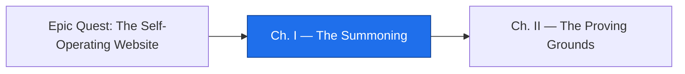

*The realm is quiet. Somewhere in the dark of an empty repository, a site waits to be born — no pages, no voice, no will of its own. You are the summoner, and the words you speak now will decide not just how the site **looks**, but how it **thinks** about itself for every working session to come. Speak carelessly and you raise a mute construct. Speak with intent, and you raise something that can describe its own work and tell the world what it did.*

*This is the moment before automation. Before the site can operate itself, it must first **exist** — built from a remote theme, deployed on GitHub Pages, and given a brand and voice it can actually read. The real-world skill hiding under the spellcraft is simple and durable: stand up a static site, encode your identity as data, and instrument your workflow so every session ends with a shareable dispatch.*

## 📖 The Legend Behind This Quest

Every autonomous system begins as a summoning — a deliberate act of bringing something into being and naming what it is. In the old guilds, a construct without a name and a sworn purpose would wander aimlessly; in our craft, a site without a machine-readable brand will drift, contradict itself, and produce output no agent can trust. This chapter is the summoning circle: you draw the boundary (a Jekyll site on a remote theme), you light the GitHub Pages beacon so the world can see it, and you carve the brand and voice into data the site itself can recite. The "voice" is not decoration — it is the contract every future automation will obey. Get this right, and everything downstream becomes possible.

## 🎯 Quest Objectives

### Primary Objectives

- [ ] Scaffold a Jekyll site that consumes a **remote theme** and serves on GitHub Pages
- [ ] Encode a **machine-readable brand and voice** (values, tone, do/don't) as structured data
- [ ] Use front matter as data and add a **session scribe** that writes an end-of-session dispatch
- [ ] Open your first autopilot pull request that ships these three pieces together

### Mastery Indicators

- [ ] You can explain why brand-as-data beats brand-as-prose for automation
- [ ] You can render a value from `_data/` inside a layout without hardcoding it
- [ ] Your repository deploys on push and produces a readable session summary artifact

## 🗺️ Quest Prerequisites

Before you draw the summoning circle, gather your reagents. This is the first chapter of the campaign, so there is no prior chapter to clear — but you do need a working bench:

- **A live zer0-mistakes Jekyll site** — complete the prequel epic first so you have a known-good remote-theme site to model.
- **A GitHub account and a repository you own** — the empty repo that will become your realm. You need push access to its `main` branch.
- **Git + a text editor or IDE** — installed locally so you can scaffold files and open pull requests.
- **Comfort with Git, branches, and pull requests** — you will ship each piece as a small, reviewable PR.
- **Basic GitHub Actions familiarity** — enough to read a workflow YAML and know where `.github/workflows/` lives.
- **A Claude Code OAuth token** — to drive the agent steps that automate later chapters of this campaign.
- **GitHub Pages enabled for the repo** — Settings → Pages → Source → **GitHub Actions**. Do this *before* your first deploy or the publish step fails (see Chapter 1).

## 🧙‍♂️ Chapter 1: Drawing the Circle — Jekyll, a Remote Theme, and the Pages Beacon

### ⚔️ Skills You'll Forge

- Configuring a Jekyll site to pull a **remote theme** instead of vendoring it
- Wiring GitHub Pages deployment so a `git push` becomes a live site
- Reasoning about the minimal files that make a static site real

A summoning needs a circle — a boundary that says *this is the thing, and nothing outside it*. For a Jekyll site, that circle is three files: a `Gemfile` that declares your dependencies, a `_config.yml` that declares your identity and your theme, and an `index.md` that gives the construct a face. The clever part is the **remote theme**: rather than copying a theme's hundreds of files into your repo, you point at one by name and let the build resolve it. Your repository stays small and focused on *your* content; the theme stays a swappable dependency.

Start with `_config.yml`. The `remote_theme` key is the incantation — it tells GitHub Pages (and `jekyll-remote-theme` locally) which published theme to render with.

```yaml
# _config.yml
title: The Autonomous Realm
description: A site that learns to operate itself.
remote_theme: bamr87/zer0-mistakes
plugins:
  - jekyll-remote-theme
  - jekyll-seo-tag
```

Declare the build dependencies so the same site renders identically on your machine and in CI:

```ruby
# Gemfile
source "https://rubygems.org"
gem "jekyll", "~> 4.3"
group :jekyll_plugins do
  gem "jekyll-remote-theme"
  gem "jekyll-seo-tag"
end
```

Every construct needs a face. The remote theme supplies the layouts, but your repo still needs an entry page that picks one. A minimal `index.md` is all it takes — front matter that names a layout the theme provides, plus a heading:

```markdown
---
layout: home
title: The Autonomous Realm
---

# The Autonomous Realm

A site that learns to operate itself.
```

Now light the beacon. GitHub Pages can build with its own Actions workflow; the official starter wires Ruby, runs the Jekyll build, uploads the `_site` artifact in a **build** job, and then publishes it in a separate **deploy** job. Both jobs matter — without the deploy job the artifact is built but never goes live.

(The `raw`/`endraw` tags below are Jekyll escapes for this site's renderer — omit them when you copy the YAML into your own `.github/workflows/`.)


```yaml
# .github/workflows/pages.yml
name: Deploy site to Pages
on:
  push:
    branches: [main]
permissions:
  contents: read
  pages: write
  id-token: write
jobs:
  build:
    runs-on: ubuntu-latest
    steps:
      - uses: actions/configure-pages@v5
      - uses: actions/checkout@v4
      - uses: ruby/setup-ruby@v1
        with:
          ruby-version: '3.2'
          bundler-cache: true
      - run: bundle exec jekyll build
      - uses: actions/upload-pages-artifact@v3
        with:
          path: ./_site
  deploy:
    needs: build
    runs-on: ubuntu-latest
    permissions:
      pages: write
      id-token: write
    environment:
      name: github-pages
      url: ${{ steps.deployment.outputs.page_url }}
    steps:
      - id: deployment
        uses: actions/deploy-pages@v4
```


Before the first run, **enable Pages**: Settings → Pages → Source → **GitHub Actions**. Skip that and the deploy job fails with no environment to publish into. Once it is set, push to `main` and the circle is complete: the `build` job compiles the remote-theme site and uploads the artifact, the `deploy` job pushes it live, and every commit redeploys itself. The construct now has a body.

### 🔍 Knowledge Check

- [ ] Why does `remote_theme` keep your repository smaller than copying the theme's files in?
- [ ] Which `permissions` does the deploy job need to publish, and why is `id-token: write` present?
- [ ] What single event triggers a redeploy in the workflow above?

## 🧙‍♂️ Chapter 2: Giving It a Voice — Brand as Data and the Session Scribe

### ⚔️ Skills You'll Forge

- Encoding brand, values, and voice as structured YAML the site can read
- Rendering data into layouts so identity lives in one source of truth
- Building a **session scribe** that emits an end-of-session dispatch

A body without a voice is a puppet. To make the site *yours* — and legible to any agent that will later operate it — you carve the brand into `_data/`. Prose in a README is for humans; **data** is for machines. When voice lives in `_data/brand.yml`, a layout can render it, a linter can check against it, and a future automation can quote it verbatim without guessing.

```yaml
# _data/brand.yml
name: The Autonomous Realm
tagline: A site that learns to operate itself.
values:
  - Clarity over cleverness
  - Show the real command, then the metaphor
  - Every session ends with a dispatch
voice:
  tone: encouraging, precise, lightly playful
  do:
    - Lead with the concrete action
    - Name the real-world skill
  dont:
    - Let fantasy replace instruction
    - Ship a claim without a way to verify it
```

Because this is data, any Liquid template can read it. That is the whole point of **front matter as data**: identity is rendered, never hardcoded.


```liquid
<!-- _includes/voice.html -->
<p class="tagline">{{ site.data.brand.tagline }}</p>
<ul class="values">
  
    <li>{{ v }}</li>
  
</ul>
```


Now the **session scribe** — the habit that makes the realm *self-describing*. At the end of a working session, a small script reads what changed and writes a dispatch: a short, shareable summary of the session's work. It is the seed of self-operation; later chapters teach the site to write these on its own.

```bash
#!/usr/bin/env bash
# scripts/session-scribe.sh — write an end-of-session dispatch
set -euo pipefail
out="dispatches/$(date +%Y-%m-%d).md"
mkdir -p dispatches
{
  echo "# Session dispatch — $(date +%Y-%m-%d)"
  echo
  echo "## What changed"
  git log --since="6 hours ago" --pretty="- %s" || true
  echo
  echo "## Files touched"
  git diff --name-only HEAD^1 HEAD 2>/dev/null \
    || git show --name-only --format='' HEAD \
    || true
} > "$out"
echo "Wrote $out"
```

Make it executable once, then run it after a session:

```bash
chmod +x scripts/session-scribe.sh
./scripts/session-scribe.sh
# or, without the chmod: bash scripts/session-scribe.sh
```

The `git diff --name-only HEAD^1 HEAD` call lists files touched in the last commit, with a fallback (`git show --name-only`) so the script still works on a repository's very first commit, when there is no `HEAD^1` to compare against. You get a Markdown dispatch summarizing the work — readable by you today and by an agent tomorrow. The site now has a body, a voice, and the beginnings of a memory.

### 🔍 Knowledge Check

- [ ] Why is brand-as-data more useful to automation than the same text in a README?
- [ ] How does the `voice.html` include avoid hardcoding the tagline in every page?
- [ ] What two sections does the session scribe always emit, and where does it source them?

## 🔁 Reproduce It

This chapter mirrors a real, merged build in the `bamr87/lifehacker.dev` reference repository. Each step you just learned was shipped as a small, reviewable pull request:

- **`bamr87/lifehacker.dev#1`** (`bamr87/lifehacker.dev@892cd3bba`) — raised the initial Jekyll site on the remote theme and wired the GitHub Pages deploy, turning an empty repo into a live, redeploying site.
- **`bamr87/lifehacker.dev#2`** (`bamr87/lifehacker.dev@4cdbfdf6e`) — encoded the machine-readable brand and voice under `_data/`, establishing identity as a single rendered source of truth.
- **`bamr87/lifehacker.dev#11`** (`bamr87/lifehacker.dev@99bcb84d0`) — added the session scribe that writes an end-of-session dispatch, the first step toward a site that narrates its own work.

Read those three squash-merges in order and you will see this chapter as it actually happened: one branch, one circle, one voice at a time.

## 🎮 Mastery Challenge

**Objective:** Summon your own realm and prove it can speak for itself.

- [ ] Your repository deploys a remote-theme Jekyll site to GitHub Pages on push to `main` (build job *and* deploy job)
- [ ] A layout renders at least one value from `_data/brand.yml` (no hardcoded brand text)
- [ ] Running `scripts/session-scribe.sh` produces a dated dispatch under `dispatches/`, committed via your first autopilot pull request

## 🎁 Rewards & Progression

- 🥇 **First Pull Request** — opened your first autopilot pull request
- 🛠️ **Skill unlocked:** Jekyll + remote-theme site setup
- 🧠 **Skill unlocked:** Brand/voice as machine-readable data
- **+50 XP**

## 🗺️ Quest Network



## 🔮 Next Adventures

The construct lives and speaks — but it has not yet been *tested*. In the next chapter you build the trials that prove its work is safe to ship.

- ➡️ **Next chapter:** [Chapter II — The Proving Grounds](/quests/0100/self-operating-website-02-the-proving-grounds/)
- 🏰 **Campaign hub:** [Epic Quest: The Self-Operating Website](/quests/codex/self-operating-website/)

## 📚 Resource Codex

- [Jekyll Documentation](https://jekyllrb.com/docs/) — configuration, layouts, and the `_data/` directory
- [GitHub Pages with Actions](https://docs.github.com/en/pages) — building and deploying static sites
- [GitHub Actions documentation](https://docs.github.com/en/actions) — workflows, triggers, and permissions
- [Claude Code documentation](https://docs.anthropic.com/en/docs/claude-code/overview) — driving the agent steps that automate this campaign

## 🕸️ Knowledge Graph

*Structured wiki-links connect this quest to the IT-Journey knowledge graph. Open the [Obsidian Graph View](/notes/obsidian/graph/) to explore connections.*

**Campaign hub:** [[Epic Quest: The Self-Operating Website]]
**Previous:** none — first chapter
**Next:** [[The Proving Grounds: Test, Gate, and Trust the Build]]
**Obsidian docs:** [[Obsidian Knowledge Graph and Wiki Links]]
