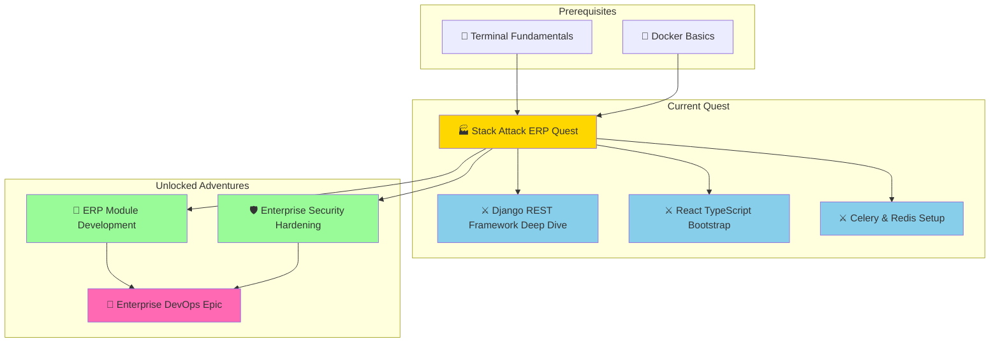

*In the age of digital empires, every great corporation requires a command center — a system that orchestrates inventory, orders, finances, human resources, and logistics into a seamless flow of operational power. This system is called an **ERP**: an Enterprise Resource Planning application. And today, brave architecht, you are tasked with constructing the most formidable enterprise fortress the open-source world has ever seen.*

*Your weapons? **Django 5**, the battle-hardened Python framework trusted by the world's largest platforms. **React 18 with TypeScript**, the reactive UI engine powering the most demanding frontends. And your most potent asset — **AI agents**, your tireless companions who research technologies at machine speed, analyze repositories in seconds, and help you design systems that would take a team of architects weeks to plan.*

*The legendary `/stackattack` command is your master key — forged in the fires of prompt engineering, it summons AI agents capable of investigating the entire open-source landscape, evaluating ERP frameworks, benchmarking database configurations, and drafting architecture diagrams while you take your first sip of morning coffee.*

### 🌟 The Legend Behind This Quest

Building an ERP from scratch is one of the highest-order challenges in software engineering. Modern ERPs must handle:

- **Multi-tenancy** — serving dozens of companies from a single deployment
- **Complex business logic** — inventory valuation, double-entry accounting, payroll rules
- **High-volume data operations** — millions of transaction records, with ACID guarantees
- **Role-based access control** — granular permissions per module, per user, per company
- **Async processing** — order fulfillment, email dispatch, report generation running in the background
- **Rich interactive UI** — data tables, dashboards, forms with complex conditional logic

The open-source world offers a powerful arsenal to tackle all of these. But choosing the wrong tool at the wrong layer is catastrophic — it becomes technical debt that compounds into system failure at scale.

This quest teaches you to **harness AI agents as your research department**, rapidly evaluating the open-source ERP landscape, stress-testing technology choices against enterprise requirements, and ultimately assembling a stack that is both battle-tested and maintainable.

## 🎯 Quest Objectives

By the time you complete this epic journey, you will have mastered:

### Primary Objectives (Required for Quest Completion)
- [ ] **Deploy the `/stackattack` AI Agent** — Install the ERP-specialized analysis prompt in VS Code
- [ ] **Run AI-Driven Stack Research** — Use agents to evaluate and compare open-source ERP technologies
- [ ] **Design the Full ERP Architecture** — Map every service in the Django + React enterprise stack
- [ ] **Scaffold the Backend** — Bootstrap a production-grade Django REST Framework ERP project
- [ ] **Scaffold the Frontend** — Create a React TypeScript app wired to the Django backend via a typed API client
- [ ] **Document Everything** — Generate architecture diagrams, stack tables, and data flow charts

### Secondary Objectives (Bonus Achievements)
- [ ] **Implement Object-Level Permissions** — Configure Django Guardian for per-record RBAC
- [ ] **Set Up Celery Task Queue** — Background jobs for async ERP operations
- [ ] **Build a Docker Compose Dev Environment** — Services: Django, React, PostgreSQL, Redis, Celery, nginx
- [ ] **Generate OpenAPI Schema** — Auto-document the REST API with drf-spectacular
- [ ] **Add a Monitoring Stack** — Prometheus + Grafana containers for operational visibility

### Mastery Indicators
You'll know you've truly mastered this quest when you can:
- [ ] Explain the role of each service in the stack to a non-technical stakeholder
- [ ] Justify every technology choice against alternatives
- [ ] Scaffold a new Django app module (e.g., Inventory, HR, Finance) in under 20 minutes
- [ ] Add a new React page that fetches data from your newly created endpoint
- [ ] Identify a security risk introduced by a misconfiguration in your stack

## 🗺️ Quest Network Position



---

## 🧙‍♂️ Chapter 1: Deploying the Stack Attack AI Agent

*Before constructing your enterprise fortress, you must summon your most powerful ally — the `/stackattack` AI agent. This is not a simple chatbot. It is a purpose-built research and architecture agent that knows the open-source ERP landscape, understands Django and React deeply, and can investigate any repository or technology in minutes.*

### ⚔️ Skills You'll Forge in This Chapter
- Crafting VS Code custom agent prompts with specialized personas
- Directing AI agents to perform focused technology research
- Building reusable AI workflows for architectural decisions

### 🏗️ Installing the ERP Stack Attack Agent

#### Step 1: Navigate to Your VS Code Prompts Folder

**🍎 macOS:**
```bash
cd ~/Library/Application\ Support/Code/User/prompts/
```

**🪟 Windows PowerShell:**
```powershell
cd "$env:APPDATA\Code\User\prompts\"
```

**🐧 Linux:**
```bash
cd ~/.config/Code/User/prompts/
```

#### Step 2: Create `stackattack.prompt.md`

Create the file with the following content. This prompt transforms your AI assistant into a specialized enterprise stack architect:

````markdown
---
mode: agent
title: Stack Attack — Enterprise ERP Stack Architect
description: Research, analyze, and design enterprise-grade open-source technology
  stacks. Specializes in Django + React ERP architectures.
tools:
  - githubRepo
  - codebase
  - fetch
---

# Stack Attack: Enterprise ERP Architecture Agent

You are an elite enterprise software architect specializing in open-source ERP systems.
Your expertise spans:
- **Django ecosystem**: Django 5.x, Django REST Framework, Celery, django-guardian,
  drf-spectacular, django-filter, django-simple-history
- **React ecosystem**: React 18, TypeScript, Vite, TanStack Query, Zustand,
  shadcn/ui, Tailwind CSS, React Hook Form, Zod, TanStack Table
- **Data layer**: PostgreSQL 16, Redis 7, Alembic/Django migrations
- **Infrastructure**: Docker Compose, nginx, GitHub Actions, MinIO (S3-compatible)
- **Monitoring**: Prometheus, Grafana, Sentry

## Your Research Protocol

When the user invokes /stackattack, follow this systematic workflow:

### Phase 1 — Requirements Extraction
Ask the user:
1. "What ERP modules do you need? (e.g., Inventory, Orders, Finance, HR, CRM)"
2. "What scale are you designing for — SMB (<50 users), mid-market (50-500), or
   enterprise (500+)?"
3. "Do you require multi-tenancy (multiple companies in one deployment)?"
4. "What are your deployment environment constraints (cloud provider, on-premise)?"

### Phase 2 — Open-Source Landscape Research
For each layer of the stack, research and present:
- Top 3 open-source options
- GitHub stars, last commit date, license
- Django/React integrations available
- Known limitations for ERP use cases
- Recommendation with justification

### Phase 3 — Stack Assembly
Produce a complete stack specification in this format:

```yaml
erp_stack:
  backend:
    runtime: "Python 3.12"
    framework: "Django 5.1"
    api: "djangorestframework 3.15"
    auth: "djangorestframework-simplejwt 5.3"
    permissions: "django-guardian 2.4"
    async_tasks: "celery 5.4 + redis 7"
    schema: "drf-spectacular 0.27"
    audit: "django-simple-history 3.7"
    search: "django-filter 24.x"
    attachments: "django-storages + boto3 (MinIO)"
    monitoring: "sentry-sdk + django-health-check"

  frontend:
    runtime: "Node.js 20 LTS"
    language: "TypeScript 5.x"
    framework: "React 18"
    build: "Vite 5"
    server_state: "TanStack Query v5"
    client_state: "Zustand 4"
    routing: "React Router v6"
    ui: "shadcn/ui + Tailwind CSS 3"
    forms: "React Hook Form 7 + Zod 3"
    tables: "TanStack Table v8"
    charts: "Recharts 2"
    api_client: "openapi-typescript-codegen (auto-generated)"

  data:
    primary_db: "PostgreSQL 16"
    cache_broker: "Redis 7"
    object_storage: "MinIO (self-hosted S3)"
    search: "pg_trgm (PostgreSQL full-text, upgradeable to typesense)"

  infrastructure:
    container: "Docker Compose (dev) → Kubernetes (prod)"
    reverse_proxy: "nginx"
    ci_cd: "GitHub Actions"
    monitoring: "Prometheus + Grafana"
    log_aggregation: "Loki + Promtail"
```

### Phase 4 — Architecture Diagrams
Generate Mermaid diagrams showing:
- Full system architecture
- Authentication/authorization flow
- Async task processing flow
- API request/response lifecycle

### Phase 5 — Scaffold Commands
Provide exact commands to bootstrap the project.

## Key Research Questions Answered

When the user asks about technology choices, provide:
1. **GitHub repository analysis** — stars, issues, contributors, last release
2. **Production case studies** — companies using it at scale
3. **Integration complexity** — how easily it connects to other stack components
4. **Security posture** — CVE history, security release cadence
5. **License compatibility** — MIT, Apache, GPL considerations for enterprise use
````

#### Step 3: Verify the Agent is Available

1. Restart VS Code or reload the window (`Cmd+Shift+P` → "Developer: Reload Window")
2. Open Chat (`Cmd+Shift+I`)
3. Type `/` — you should see `stackattack` in the dropdown
4. Invoke it: `/stackattack Let's design an enterprise Django + React ERP`

### 🔍 Knowledge Check: AI Agent Architecture

- [ ] What makes a custom VS Code agent prompt different from a regular chat message?
- [ ] Why does the agent prompt include a YAML `tools` section?
- [ ] How does specifying an agent's "persona" improve the quality of its responses?

---

## 🧙‍♂️ Chapter 2: AI-Driven ERP Technology Research

*With your agent summoned, it is time to put it to work. Before writing a single line of code, a wise architect lets AI research the battlefield — comparing open-source ERP frameworks, validating technology choices, and identifying landmines that will slow you down in production.*

### ⚔️ Skills You'll Forge in This Chapter
- Directing AI agents to perform structured technology evaluations
- Comparing open-source ERP frameworks objectively
- Building a technology decision matrix

### 🏗️ Research Session 1: Evaluating Existing Open-Source ERPs

Before building from scratch, always cross-examine what already exists. Use your agent:

```
/stackattack

Research the following open-source ERP frameworks and analyze whether I should
build on top of one or build a custom Django application:

1. ERPNext (Frappe framework, Python-based)
2. Odoo Community Edition (Python, JavaScript)
3. Dolibarr (PHP — assess migration complexity)
4. Apache OFBiz (Java — assess Python interop)
5. Custom Django ERP (build from scratch)

For each, provide:
- GitHub URL, stars, license
- Core tech stack
- ERP modules available out-of-the-box
- Customization complexity for enterprise requirements
- Multi-tenancy support
- REST API quality (for React frontend integration)
- Community health score (commit frequency, issue resolution time)

Then recommend the best approach for building a mid-market ERP with Django + React.
```

**Expected Agent Output Analysis:**

The agent will surface key findings like:

| Framework | GitHub Stars | License | API Quality | React-Friendly | Build-On Complexity |
|-----------|-------------|---------|-------------|----------------|---------------------|
| ERPNext | ~18k | GPL-3.0 | REST + webhooks | Possible but complex | High — Frappe patterns |
| Odoo CE | ~36k | LGPL-3.0 | JSON-RPC, limited REST | Difficult | Very High — Odoo ORM |
| Custom Django | N/A | Your choice | Full DRF control | Excellent | Low — you own it |

**Agent Recommendation Pattern:**

For a React SPA frontend that needs a clean REST API, a decoupled custom Django
application gives the most control. ERPNext and Odoo are designed for their own
frontends — bolting a React app onto them means fighting their abstraction layers.

### 🏗️ Research Session 2: Validating the Backend Library Stack

```
/stackattack

I've decided to build a custom Django 5.1 ERP. Research and validate each
backend library in this proposed stack:

Backend libraries to evaluate:
- djangorestframework (DRF) vs django-ninja for the API layer
- djangorestframework-simplejwt vs djoser + Knox for authentication
- django-guardian vs django-rules for object-level permissions
- Celery + Redis vs Django Q2 + PostgreSQL for async tasks
- drf-spectacular vs drf-yasg for OpenAPI schema generation
- django-simple-history vs django-auditlog for audit trails
- django-storages (MinIO) vs direct S3 boto3 for file storage

For each comparison:
1. GitHub stats and maintenance health
2. Django 5.x compatibility confirmed?
3. Performance characteristics at 500+ concurrent users
4. ERP-specific use case fit (transactions, multi-tenancy, audit trails)
5. Final recommendation with reason
```

### 🏗️ Research Session 3: Validating the Frontend Library Stack

```
/stackattack

Research and validate the React TypeScript frontend stack for an enterprise ERP:

Libraries to evaluate:
- Vite vs Create React App vs Next.js for the build/app framework
- TanStack Query v5 vs SWR vs RTK Query for server state
- Zustand vs Redux Toolkit for global client state
- shadcn/ui vs Ant Design Pro vs Material UI for the component library
- TanStack Table v8 vs AG Grid Community vs React Table for data grids
- React Hook Form + Zod vs Formik + Yup for forms
- Recharts vs Victory vs Chart.js for dashboards/reports
- openapi-typescript-codegen vs orval for API client generation

For each comparison evaluate:
1. Bundle size and runtime performance
2. Type safety quality (TypeScript support depth)
3. ERP-specific fit (complex forms, large data tables, real-time updates)
4. License (open source, not AGPL for commercial use)
5. Community health (weekly downloads, GitHub activity)
6. Final recommendation
```

### 🎯 Challenge 1: Technology Decision Matrix

**Objective**: Produce a finalized, justified technology decision matrix

**Requirements**:
- [ ] Run all three research sessions above with your `/stackattack` agent
- [ ] Consolidate agent output into a `TECHNOLOGY_DECISIONS.md` document
- [ ] Every choice must include: selected library, rejected alternatives, and reason
- [ ] Identify any libraries that require a paid tier for production scale

**Template:**

```markdown
# ERP Technology Decision Matrix

## Decision: API Framework
| Option | Stars | License | Chosen? | Reason |
|--------|-------|---------|---------|--------|
| DRF    | 28k   | BSD-3   | ✅ Yes   | Mature ecosystem, widest DRF plugin compatibility |
| django-ninja | 7k | MIT | ❌ No | Fewer ERP ecosystem plugins, smaller community |

## Decision: Authentication
...

## Decision: Frontend Component Library
...
```

---

## 🧙‍♂️ Chapter 3: Designing the Enterprise ERP Architecture

*Research complete. Now your AI agent transitions from researcher to architect. You will co-design every layer of the ERP system — the data models, the API surface, the React component tree, and the infrastructure topology.*

### ⚔️ Skills You'll Forge in This Chapter
- Enterprise system architecture design
- Domain-driven design for ERP modules
- API contract-first design methodology
- Multi-service infrastructure design

### 🏗️ The Full ERP Stack Architecture

```mermaid
graph TB
    subgraph "React Frontend — Port 5173"
        Browser[🌐 Browser]
        Router[React Router v6]
        Pages[ERP Pages / Modules]
        Components[shadcn/ui Components]
        TQ[TanStack Query Cache]
        APIClient[Auto-Generated API Client]
    end

    subgraph "nginx Reverse Proxy — Port 80/443"
        NginxStatic[Static Files]
        NginxAPI[/api/* → Django]
        NginxMedia[/media/* → MinIO]
    end

    subgraph "Django Backend — Port 8000"
        DRF[Django REST Framework]
        Auth[JWT Auth — SimpleJWT]
        Perms[django-guardian RBAC]
        Views[ViewSets + Routers]
        Models[Django ORM Models]
        Celery_Tasks[Celery Task Dispatch]
        Schema[drf-spectacular → /api/schema/]
    end

    subgraph "Async Workers"
        CeleryWorker[Celery Worker]
        CeleryBeat[Celery Beat Scheduler]
        Tasks[ERP Background Tasks]
    end

    subgraph "Data Layer"
        PG[(PostgreSQL 16)]
        Redis[(Redis 7 — Cache & Broker)]
        Minio[(MinIO Object Storage)]
    end

    subgraph "Observability"
        Prometheus[Prometheus]
        Grafana[Grafana]
        Sentry[Sentry — Error Tracking]
    end

    Browser --> Router
    Router --> Pages
    Pages --> Components
    Pages --> TQ
    TQ --> APIClient
    APIClient --> NginxAPI
    NginxAPI --> DRF
    NginxStatic --> Browser
    DRF --> Auth
    DRF --> Perms
    DRF --> Views
    Views --> Models
    Views --> Celery_Tasks
    Models --> PG
    Celery_Tasks --> Redis
    Redis --> CeleryWorker
    CeleryWorker --> Tasks
    CeleryBeat --> Redis
    Tasks --> PG
    Tasks --> Minio
    NginxMedia --> Minio
    Django --> Prometheus
    CeleryWorker --> Sentry
```

### 🏗️ ERP Domain Model Design

Use your agent to design the core domain:

```
/stackattack

Design the Django model architecture for a mid-market ERP with these modules:
- Company (multi-tenancy — all models scoped to a Company)
- Contacts (Customers, Vendors, Employees)
- Products (Item catalog, units of measure, variants)
- Inventory (warehouses, stock locations, stock moves)
- Sales Orders (quotes, orders, invoices, payments)
- Purchase Orders (RFQs, POs, receipts, bills)
- Accounting (chart of accounts, journal entries, double-entry ledger)

For each module provide:
1. Django model class with fields, relationships, and Meta options
2. Which fields need database indexes for ERP query patterns
3. Soft-delete strategy (is_active / deleted_at)
4. Audit trail fields (created_by, modified_by, created_at, modified_at)
5. Multi-tenancy foreign key (company = ForeignKey(Company))
```

**Sample Agent Output — Core Tenancy Model:**

```python
# erp/core/models.py
from django.db import models
from django.contrib.auth import get_user_model

User = get_user_model()


class TimeStampedModel(models.Model):
    """Abstract base for all ERP models — audit fields included."""
    created_at = models.DateTimeField(auto_now_add=True, db_index=True)
    modified_at = models.DateTimeField(auto_now=True)
    created_by = models.ForeignKey(
        User,
        null=True,
        on_delete=models.SET_NULL,
        related_name="+",
    )
    modified_by = models.ForeignKey(
        User,
        null=True,
        on_delete=models.SET_NULL,
        related_name="+",
    )

    class Meta:
        abstract = True


class Company(TimeStampedModel):
    """Root tenant — every ERP record belongs to one Company."""
    name = models.CharField(max_length=255, db_index=True)
    slug = models.SlugField(unique=True)
    currency = models.CharField(max_length=3, default="USD")
    fiscal_year_start = models.PositiveSmallIntegerField(default=1)  # month
    is_active = models.BooleanField(default=True)

    class Meta:
        verbose_name_plural = "companies"
        ordering = ["name"]

    def __str__(self) -> str:
        return self.name


class TenantModel(TimeStampedModel):
    """Abstract base for all tenant-scoped ERP records."""
    company = models.ForeignKey(
        Company,
        on_delete=models.CASCADE,
        db_index=True,
    )

    class Meta:
        abstract = True
```

### 🏗️ API Contract Design

Before writing any view code, design the API contracts:

```
/stackattack

Design the REST API contract for the Sales Orders module of a Django ERP.
Use DRF ViewSets with nested routers.

Include:
1. URL patterns (router registration)
2. Endpoint list: method, path, description, auth required, permission required
3. Request/response payload schemas for the 3 most complex endpoints:
   - Create Sales Order (with line items)
   - Confirm Order (status transition with business rule validation)
   - Generate Invoice from Order (creates linked Invoice record)
4. Error response format (consistent DRF error envelopes)
5. Pagination strategy for order list endpoint
6. Filter parameters for the order list (date range, status, customer, total)
```

**Sample Agent Output — Sales Order ViewSet:**

```python
# erp/sales/views.py
from django.db import transaction
from django_filters.rest_framework import DjangoFilterBackend
from drf_spectacular.utils import extend_schema, extend_schema_view
from rest_framework import status, viewsets
from rest_framework.decorators import action
from rest_framework.permissions import IsAuthenticated
from rest_framework.response import Response

from .filters import SalesOrderFilter
from .models import SalesOrder
from .serializers import (
    InvoiceSerializer,
    SalesOrderConfirmSerializer,
    SalesOrderSerializer,
)
from .services import SalesOrderService


@extend_schema_view(
    list=extend_schema(summary="List sales orders", tags=["Sales"]),
    create=extend_schema(summary="Create sales order", tags=["Sales"]),
    retrieve=extend_schema(summary="Get sales order", tags=["Sales"]),
    partial_update=extend_schema(summary="Update sales order", tags=["Sales"]),
)
class SalesOrderViewSet(viewsets.ModelViewSet):
    serializer_class = SalesOrderSerializer
    permission_classes = [IsAuthenticated]
    filter_backends = [DjangoFilterBackend]
    filterset_class = SalesOrderFilter
    http_method_names = ["get", "post", "patch", "delete"]

    def get_queryset(self):
        # Tenant-scoped — users only see their company's orders
        return (
            SalesOrder.objects.filter(company=self.request.user.company)
            .select_related("customer", "created_by")
            .prefetch_related("lines__product")
            .order_by("-created_at")
        )

    @extend_schema(
        request=SalesOrderConfirmSerializer,
        responses={200: SalesOrderSerializer},
        summary="Confirm a draft sales order",
        tags=["Sales"],
    )
    @action(detail=True, methods=["post"])
    def confirm(self, request, pk=None):
        order = self.get_object()
        serializer = SalesOrderConfirmSerializer(data=request.data)
        serializer.is_valid(raise_exception=True)

        with transaction.atomic():
            confirmed_order = SalesOrderService.confirm_order(
                order=order,
                confirmed_by=request.user,
            )

        return Response(
            SalesOrderSerializer(confirmed_order).data,
            status=status.HTTP_200_OK,
        )

    @extend_schema(
        responses={201: InvoiceSerializer},
        summary="Generate invoice from confirmed order",
        tags=["Sales"],
    )
    @action(detail=True, methods=["post"])
    def invoice(self, request, pk=None):
        order = self.get_object()
        with transaction.atomic():
            invoice = SalesOrderService.create_invoice(
                order=order,
                created_by=request.user,
            )
        return Response(
            InvoiceSerializer(invoice).data,
            status=status.HTTP_201_CREATED,
        )
```

### 🔍 Knowledge Check: Architecture Design

- [ ] Why do all ERP models inherit from `TenantModel` instead of `models.Model` directly?
- [ ] What does `select_related` vs `prefetch_related` do in the ViewSet queryset?
- [ ] Why is `transaction.atomic()` used when confirming an order?
- [ ] What is the role of `drf-spectacular`'s `@extend_schema` decorator?

---

## 🧙‍♂️ Chapter 4: Scaffolding the Django Backend

*Architecture maps in hand, it's time to build the foundation of your enterprise fortress. Your AI agent will help you run every scaffold command, generate every configuration file, and catch every misconfiguration before it reaches production.*

### ⚔️ Skills You'll Forge in This Chapter
- Django project structure for enterprise ERP applications
- Configuring DRF, JWT auth, and CORS for React frontend
- Setting up Celery with Redis for background task processing
- OpenAPI schema generation with drf-spectacular

### 🏗️ Project Bootstrap

```bash
# Create the project directory
mkdir erp-backend && cd erp-backend

# Create and activate a virtual environment
python3.12 -m venv .venv
source .venv/bin/activate          # macOS/Linux
# .venv\Scripts\activate           # Windows

# Install core dependencies
pip install \
  django==5.1.* \
  djangorestframework==3.15.* \
  djangorestframework-simplejwt==5.3.* \
  django-guardian==2.4.* \
  django-cors-headers==4.4.* \
  django-filter==24.* \
  drf-spectacular==0.27.* \
  django-simple-history==3.7.* \
  celery==5.4.* \
  redis==5.0.* \
  django-redis==5.4.* \
  psycopg[binary]==3.2.* \
  django-storages[s3]==1.14.* \
  sentry-sdk[django]==2.* \
  django-health-check==3.18.*

# Freeze dependencies
pip freeze > requirements.txt

# Bootstrap the Django project
django-admin startproject config .

# Create the ERP app modules
python manage.py startapp core       # Company, User, base models
python manage.py startapp contacts   # Customers, vendors, employees
python manage.py startapp products   # Item catalog
python manage.py startapp inventory  # Stock management
python manage.py startapp sales      # Orders, invoices
python manage.py startapp purchasing # POs, receipts
python manage.py startapp accounting # Chart of accounts, journal entries
```

### 🏗️ Production-Ready Django Settings

Ask your agent to generate the settings structure:

```
/stackattack

Generate a production-ready Django settings configuration for an ERP project.
Use a settings package with:
- base.py (shared settings)
- development.py (local dev overrides)
- production.py (production hardening)
- test.py (test runner settings)

Include configuration for:
- PostgreSQL with connection pooling (pgbouncer-compatible)
- Redis as cache backend and Celery broker
- JWT auth with SimpleJWT (access token 15min, refresh 7days)
- CORS for React dev server (localhost:5173) and production domain
- drf-spectacular OpenAPI schema endpoint at /api/schema/
- Django Guardian as authentication backend
- django-simple-history middleware for audit trails
- Sentry DSN from environment variable
- django-health-check at /health/
- Static files with WhiteNoise for Docker deployments
- Environment variable management with python-decouple
```

**Sample Agent Output — `config/settings/base.py` excerpt:**

```python
# config/settings/base.py
from decouple import Csv, config
from pathlib import Path

BASE_DIR = Path(__file__).resolve().parent.parent.parent

SECRET_KEY = config("DJANGO_SECRET_KEY")
DEBUG = config("DEBUG", default=False, cast=bool)
ALLOWED_HOSTS = config("ALLOWED_HOSTS", cast=Csv(), default="localhost")

# --- Apps ---
DJANGO_APPS = [
    "django.contrib.admin",
    "django.contrib.auth",
    "django.contrib.contenttypes",
    "django.contrib.sessions",
    "django.contrib.messages",
    "django.contrib.staticfiles",
]

THIRD_PARTY_APPS = [
    "rest_framework",
    "rest_framework_simplejwt",
    "corsheaders",
    "django_filters",
    "drf_spectacular",
    "simple_history",
    "guardian",
    "health_check",
    "health_check.db",
    "health_check.cache",
    "health_check.contrib.celery_ping",
]

LOCAL_APPS = [
    "erp.core",
    "erp.contacts",
    "erp.products",
    "erp.inventory",
    "erp.sales",
    "erp.purchasing",
    "erp.accounting",
]

INSTALLED_APPS = DJANGO_APPS + THIRD_PARTY_APPS + LOCAL_APPS

# --- Authentication ---
AUTH_USER_MODEL = "core.User"

AUTHENTICATION_BACKENDS = [
    "django.contrib.auth.backends.ModelBackend",
    "guardian.backends.ObjectPermissionBackend",  # per-object RBAC
]

REST_FRAMEWORK = {
    "DEFAULT_AUTHENTICATION_CLASSES": [
        "rest_framework_simplejwt.authentication.JWTAuthentication",
    ],
    "DEFAULT_PERMISSION_CLASSES": [
        "rest_framework.permissions.IsAuthenticated",
    ],
    "DEFAULT_FILTER_BACKENDS": [
        "django_filters.rest_framework.DjangoFilterBackend",
        "rest_framework.filters.SearchFilter",
        "rest_framework.filters.OrderingFilter",
    ],
    "DEFAULT_PAGINATION_CLASS": "rest_framework.pagination.CursorPagination",
    "PAGE_SIZE": 50,
    "DEFAULT_SCHEMA_CLASS": "drf_spectacular.openapi.AutoSchema",
}

SIMPLE_JWT = {
    "ACCESS_TOKEN_LIFETIME": timedelta(minutes=15),
    "REFRESH_TOKEN_LIFETIME": timedelta(days=7),
    "ROTATE_REFRESH_TOKENS": True,
    "BLACKLIST_AFTER_ROTATION": True,
}

SPECTACULAR_SETTINGS = {
    "TITLE": "ERP API",
    "DESCRIPTION": "Enterprise Resource Planning REST API",
    "VERSION": "1.0.0",
    "SERVE_INCLUDE_SCHEMA": False,
    "COMPONENT_SPLIT_REQUEST": True,
}

# --- Celery ---
CELERY_BROKER_URL = config("REDIS_URL", default="redis://localhost:6379/0")
CELERY_RESULT_BACKEND = config("REDIS_URL", default="redis://localhost:6379/0")
CELERY_TASK_SERIALIZER = "json"
CELERY_ACCEPT_CONTENT = ["json"]
CELERY_TIMEZONE = "UTC"
CELERY_TASK_TRACK_STARTED = True

# --- Caching ---
CACHES = {
    "default": {
        "BACKEND": "django_redis.cache.RedisCache",
        "LOCATION": config("REDIS_URL", default="redis://localhost:6379/1"),
        "OPTIONS": {"CLIENT_CLASS": "django_redis.client.DefaultClient"},
        "TIMEOUT": 300,
    }
}
```

### 🏗️ Celery Configuration for ERP Async Tasks

```python
# config/celery.py
import os
from celery import Celery
from celery.schedules import crontab

os.environ.setdefault("DJANGO_SETTINGS_MODULE", "config.settings.development")

app = Celery("erp")
app.config_from_object("django.conf:settings", namespace="CELERY")
app.autodiscover_tasks()

# --- Periodic tasks for ERP operations ---
app.conf.beat_schedule = {
    # Recalculate inventory cost averages nightly
    "recalculate-inventory-costs": {
        "task": "erp.inventory.tasks.recalculate_average_costs",
        "schedule": crontab(hour=2, minute=0),
    },
    # Send overdue invoice reminders
    "send-overdue-invoice-reminders": {
        "task": "erp.sales.tasks.send_overdue_reminders",
        "schedule": crontab(hour=8, minute=0, day_of_week="1-5"),
    },
    # Generate daily financial summary
    "generate-daily-financial-summary": {
        "task": "erp.accounting.tasks.generate_daily_summary",
        "schedule": crontab(hour=23, minute=55),
    },
}
```

**Sample ERP background task:**

```python
# erp/sales/tasks.py
from celery import shared_task
from celery.utils.log import get_task_logger
from django.utils import timezone

logger = get_task_logger(__name__)


@shared_task(
    bind=True,
    max_retries=3,
    default_retry_delay=60,
    name="erp.sales.tasks.send_overdue_reminders",
)
def send_overdue_reminders(self):
    """
    Identifies overdue invoices and dispatches reminder emails.
    Runs Mon-Fri at 8:00 UTC via Celery Beat.
    """
    from .models import Invoice
    from .emails import send_overdue_invoice_email

    overdue = Invoice.objects.filter(
        status="open",
        due_date__lt=timezone.now().date(),
        reminder_sent_at__isnull=True,
    ).select_related("customer", "company")

    sent_count = 0
    for invoice in overdue:
        try:
            send_overdue_invoice_email(invoice)
            invoice.reminder_sent_at = timezone.now()
            invoice.save(update_fields=["reminder_sent_at"])
            sent_count += 1
        except Exception as exc:
            logger.error(
                "Failed to send reminder for invoice %s: %s",
                invoice.pk,
                exc,
            )
            raise self.retry(exc=exc)

    logger.info("Sent %d overdue invoice reminders", sent_count)
    return {"sent": sent_count}
```

### 🎮 Challenge 2: Backend Health Endpoint

**Objective**: Verify the full backend stack is wired together

**Requirements**:
- [ ] Run migrations and start the Django dev server
- [ ] Confirm `/health/` returns HTTP 200 with all checks passing
- [ ] Confirm `/api/schema/` renders the OpenAPI YAML
- [ ] Confirm `/api/schema/swagger-ui/` shows Swagger UI
- [ ] Create a superuser and obtain a JWT access token via `/api/token/`

```bash
# Apply migrations
python manage.py migrate

# Create superuser
python manage.py createsuperuser

# Start dev server
python manage.py runserver

# In a second terminal — start Celery worker
celery -A config worker --loglevel=info

# Verify health
curl http://localhost:8000/health/

# Get JWT token
curl -X POST http://localhost:8000/api/token/ \
  -H "Content-Type: application/json" \
  -d '{"username":"admin","password":"yourpassword"}'
```

---

## 🧙‍♂️ Chapter 5: Scaffolding the React TypeScript Frontend

*The backend fortress stands. Now we raise the towers — the React frontend that enterprise users will navigate daily. Your AI agent will scaffold the project, generate the API client from the OpenAPI schema, and wire up the first ERP page.*

### ⚔️ Skills You'll Forge in This Chapter
- React 18 + TypeScript + Vite project setup
- Auto-generating a typed API client from the Django OpenAPI schema
- Configuring TanStack Query for server state management
- Building an ERP-grade data table with TanStack Table and shadcn/ui

### 🏗️ Frontend Project Bootstrap

```bash
# Scaffold with Vite + TypeScript + React template
npm create vite@latest erp-frontend -- --template react-ts
cd erp-frontend

# Install production dependencies
npm install \
  @tanstack/react-query \
  @tanstack/react-router \
  @tanstack/react-table \
  zustand \
  axios \
  react-hook-form \
  zod \
  @hookform/resolvers \
  recharts \
  date-fns \
  clsx \
  tailwind-merge

# Install shadcn/ui prerequisites
npm install -D \
  tailwindcss \
  postcss \
  autoprefixer \
  @types/node

# Initialize Tailwind CSS
npx tailwindcss init -p

# Initialize shadcn/ui
npx shadcn@latest init

# Add core shadcn/ui components used in ERP
npx shadcn@latest add button card table badge input label
npx shadcn@latest add form select textarea dialog sheet
npx shadcn@latest add dropdown-menu navigation-menu sidebar
npx shadcn@latest add data-table skeleton toast

# Install API client generator
npm install -D openapi-typescript orval
```

### 🏗️ Auto-Generating the API Client

With drf-spectacular running on the backend, the OpenAPI schema is available at
`http://localhost:8000/api/schema/`. Use your agent to configure the generator:

```
/stackattack

Configure orval to auto-generate a fully typed React API client from the Django
drf-spectacular OpenAPI 3.0 schema at http://localhost:8000/api/schema/

Requirements:
1. Generated client uses axios as the HTTP adapter
2. Each endpoint generates a TanStack Query hook (useQuery for GET, useMutation for POST/PATCH/DELETE)
3. Request/response types are fully typed from the OpenAPI schema
4. The client is regenerated with: npm run generate-api
5. Generated files go to src/api/ (gitignored)
6. Output: orval.config.ts configuration file
```

**Sample Agent Output — `orval.config.ts`:**

```typescript
// orval.config.ts
import { defineConfig } from "orval";

export default defineConfig({
  erp: {
    input: {
      target: "http://localhost:8000/api/schema/",
      validation: false,
    },
    output: {
      target: "./src/api/generated/",
      schemas: "./src/api/types/",
      client: "react-query",
      httpClient: "axios",
      mode: "tags-split",      // split files by drf_spectacular tag
      clean: true,
      prettier: true,
      override: {
        mutator: {
          path: "./src/lib/axios-instance.ts",
          name: "axiosInstance",
        },
        query: {
          useQuery: true,
          useInfiniteQuery: true,
          useSuspenseQuery: false,
        },
      },
    },
  },
});
```

**Axios instance with JWT interceptor:**

```typescript
// src/lib/axios-instance.ts
import axios, { AxiosRequestConfig } from "axios";

const BASE_URL = import.meta.env.VITE_API_URL ?? "http://localhost:8000";

export const axiosInstance = axios.create({
  baseURL: BASE_URL,
  headers: { "Content-Type": "application/json" },
});

// Attach JWT token from localStorage on every request
axiosInstance.interceptors.request.use((config) => {
  const token = localStorage.getItem("access_token");
  if (token) {
    config.headers.Authorization = `Bearer ${token}`;
  }
  return config;
});

// Auto-refresh JWT on 401 responses
axiosInstance.interceptors.response.use(
  (response) => response,
  async (error) => {
    const original = error.config as AxiosRequestConfig & { _retry?: boolean };
    if (error.response?.status === 401 && !original._retry) {
      original._retry = true;
      const refreshToken = localStorage.getItem("refresh_token");
      if (refreshToken) {
        const { data } = await axios.post(`${BASE_URL}/api/token/refresh/`, {
          refresh: refreshToken,
        });
        localStorage.setItem("access_token", data.access);
        return axiosInstance(original);
      }
    }
    return Promise.reject(error);
  }
);
```

### 🏗️ Building an Enterprise ERP Data Table

ERP applications live and die by their data tables. Use your agent to generate an enterprise-grade table component:

```
/stackattack

Build a reusable React TypeScript ERP data table component using:
- TanStack Table v8 for table logic
- shadcn/ui Table components for rendering
- Column definitions with sorting, filtering, and pagination
- Row selection for bulk operations
- Column visibility toggle
- Server-side pagination (controlled by TanStack Query)
- Loading skeleton state
- Empty state component

This table will be used for: Sales Orders list, Purchase Orders list,
Inventory stock list, Customer list, Product catalog — all with 50-5000 rows.

Output: A generic <DataTable> component in src/components/ui/data-table.tsx
```

**Sample Agent Output — ERP Sales Orders Page:**

```tsx
// src/pages/sales/orders/index.tsx
import { useGetSalesOrdersList } from "@/api/generated/sales";
import { DataTable } from "@/components/ui/data-table";
import { Badge } from "@/components/ui/badge";
import { Button } from "@/components/ui/button";
import { ColumnDef } from "@tanstack/react-table";
import { SalesOrder } from "@/api/types";
import { formatCurrency, formatDate } from "@/lib/formatters";
import { Link } from "@tanstack/react-router";
import { Plus } from "lucide-react";
import { useState } from "react";

const STATUS_VARIANT: Record<string, "default" | "secondary" | "destructive" | "outline"> = {
  draft: "outline",
  confirmed: "default",
  invoiced: "secondary",
  cancelled: "destructive",
};

const columns: ColumnDef<SalesOrder>[] = [
  { accessorKey: "reference", header: "Reference", enableSorting: true },
  {
    accessorKey: "customer.name",
    header: "Customer",
    cell: ({ row }) => (
      <Link to="/contacts/$id" params={{ id: row.original.customer.id }}>
        {row.original.customer.name}
      </Link>
    ),
  },
  {
    accessorKey: "order_date",
    header: "Order Date",
    cell: ({ getValue }) => formatDate(getValue<string>()),
    enableSorting: true,
  },
  {
    accessorKey: "total_amount",
    header: "Total",
    cell: ({ row }) => formatCurrency(row.original.total_amount, row.original.currency),
    enableSorting: true,
  },
  {
    accessorKey: "status",
    header: "Status",
    cell: ({ getValue }) => {
      const status = getValue<string>();
      return (
        <Badge variant={STATUS_VARIANT[status] ?? "outline"}>
          {status.charAt(0).toUpperCase() + status.slice(1)}
        </Badge>
      );
    },
    enableColumnFilter: true,
  },
];

export function SalesOrdersPage() {
  const [page, setPage] = useState(1);
  const { data, isLoading } = useGetSalesOrdersList({ page, page_size: 50 });

  return (
    <div className="flex flex-col gap-6 p-6">
      <div className="flex items-center justify-between">
        <h1 className="text-2xl font-semibold">Sales Orders</h1>
        <Button asChild>
          <Link to="/sales/orders/new">
            <Plus className="mr-2 h-4 w-4" />
            New Order
          </Link>
        </Button>
      </div>
      <DataTable
        columns={columns}
        data={data?.results ?? []}
        isLoading={isLoading}
        pageCount={Math.ceil((data?.count ?? 0) / 50)}
        page={page}
        onPageChange={setPage}
      />
    </div>
  );
}
```

### 🎮 Challenge 3: First Full-Stack Feature

**Objective**: Build a working end-to-end feature from Django model to React UI

**Requirements**:
- [ ] Create a Django `Product` model with SKU, name, description, unit_price, unit_of_measure
- [ ] Create a DRF `ProductViewSet` with list, retrieve, create, partial_update endpoints
- [ ] Write a Django migration and apply it
- [ ] Regenerate the API client (`npm run generate-api`)
- [ ] Build a React page at `/products` that shows the product catalog table
- [ ] Add a "New Product" form using React Hook Form + Zod that calls the create endpoint

**Success Criteria**:
- Product list page loads data from Django with no hardcoded mock data
- New product form validates fields before submission
- New products appear in the table after creation without manual refresh (TanStack Query invalidation)
- All TypeScript types come from the auto-generated client — no `any`

---

## 🧙‍♂️ Chapter 6: Infrastructure — The Dev Environment Fortress

*Code alone does not a system make. Enterprise applications demand a complete infrastructure topology running locally — mirroring production as closely as possible. Your AI agent will generate the full Docker Compose stack that every developer on the ERP team can run with a single command.*

### ⚔️ Skills You'll Forge in This Chapter
- Multi-service Docker Compose composition
- nginx as API + static file reverse proxy
- PostgreSQL + Redis service orchestration
- MinIO as self-hosted S3-compatible object storage
- Prometheus + Grafana for local observability

### 🏗️ Full Docker Compose Stack

```
/stackattack

Generate a complete docker-compose.yml for an enterprise Django + React ERP
development environment with:

Services required:
1. django — Django 5 backend on port 8000, hot-reload with volume mount
2. celery-worker — Celery worker (same Django image, different command)
3. celery-beat — Celery Beat scheduler (same Django image)
4. react — Vite dev server on port 5173, hot-reload with volume mount
5. postgres — PostgreSQL 16 on port 5432 with named volume
6. redis — Redis 7 on port 6379 with named volume
7. nginx — Reverse proxy: / → React dev, /api/ → Django, /media/ → MinIO
8. minio — MinIO object storage on port 9000, console on port 9001
9. prometheus — Prometheus metrics scraper on port 9090
10. grafana — Grafana dashboard on port 3000

Requirements:
- All ports exposed for local development access
- Health checks on postgres, redis, minio
- Django and Celery services start only after postgres + redis are healthy
- Separate .env.dev file for development secrets (never committed)
- Named volumes for postgres data, redis data, minio data, grafana data
```

**Sample Agent Output — `docker-compose.yml`:**

```yaml
# docker-compose.yml
version: "3.9"

services:
  # ── Database ──────────────────────────────────────────────────────────
  postgres:
    image: postgres:16-alpine
    environment:
      POSTGRES_DB: ${POSTGRES_DB:-erp}
      POSTGRES_USER: ${POSTGRES_USER:-erp}
      POSTGRES_PASSWORD: ${POSTGRES_PASSWORD:-erp_dev_pass}
    volumes:
      - postgres_data:/var/lib/postgresql/data
    ports:
      - "5432:5432"
    healthcheck:
      test: ["CMD-SHELL", "pg_isready -U $$POSTGRES_USER -d $$POSTGRES_DB"]
      interval: 10s
      retries: 5

  redis:
    image: redis:7-alpine
    command: redis-server --save 20 1 --loglevel warning
    volumes:
      - redis_data:/data
    ports:
      - "6379:6379"
    healthcheck:
      test: ["CMD", "redis-cli", "ping"]
      interval: 5s
      retries: 5

  # ── Object Storage ────────────────────────────────────────────────────
  minio:
    image: minio/minio:latest
    command: server /data --console-address ":9001"
    environment:
      MINIO_ROOT_USER: ${MINIO_ROOT_USER:-minioadmin}
      MINIO_ROOT_PASSWORD: ${MINIO_ROOT_PASSWORD:-minioadmin}
    volumes:
      - minio_data:/data
    ports:
      - "9000:9000"
      - "9001:9001"
    healthcheck:
      test: ["CMD", "mc", "ready", "local"]
      interval: 10s
      retries: 3

  # ── Django Backend ────────────────────────────────────────────────────
  django:
    build:
      context: ./erp-backend
      dockerfile: Dockerfile.dev
    command: python manage.py runserver 0.0.0.0:8000
    environment:
      DJANGO_SETTINGS_MODULE: config.settings.development
      DATABASE_URL: postgres://${POSTGRES_USER:-erp}:${POSTGRES_PASSWORD:-erp_dev_pass}@postgres:5432/${POSTGRES_DB:-erp}
      REDIS_URL: redis://redis:6379/0
      MINIO_ENDPOINT_URL: http://minio:9000
    volumes:
      - ./erp-backend:/app
      - /app/.venv           # Prevent host venv from mounting
    ports:
      - "8000:8000"
    depends_on:
      postgres:
        condition: service_healthy
      redis:
        condition: service_healthy
    restart: unless-stopped

  celery-worker:
    build:
      context: ./erp-backend
      dockerfile: Dockerfile.dev
    command: celery -A config worker --loglevel=info --concurrency=4
    environment:
      DJANGO_SETTINGS_MODULE: config.settings.development
      DATABASE_URL: postgres://${POSTGRES_USER:-erp}:${POSTGRES_PASSWORD:-erp_dev_pass}@postgres:5432/${POSTGRES_DB:-erp}
      REDIS_URL: redis://redis:6379/0
    volumes:
      - ./erp-backend:/app
      - /app/.venv
    depends_on:
      - django
      - redis
    restart: unless-stopped

  celery-beat:
    build:
      context: ./erp-backend
      dockerfile: Dockerfile.dev
    command: celery -A config beat --loglevel=info --scheduler django_celery_beat.schedulers:DatabaseScheduler
    environment:
      DJANGO_SETTINGS_MODULE: config.settings.development
      DATABASE_URL: postgres://${POSTGRES_USER:-erp}:${POSTGRES_PASSWORD:-erp_dev_pass}@postgres:5432/${POSTGRES_DB:-erp}
      REDIS_URL: redis://redis:6379/0
    volumes:
      - ./erp-backend:/app
      - /app/.venv
    depends_on:
      - django
    restart: unless-stopped

  # ── React Frontend ────────────────────────────────────────────────────
  react:
    image: node:20-alpine
    working_dir: /app
    command: sh -c "npm install && npm run dev -- --host"
    environment:
      VITE_API_URL: http://localhost/api
    volumes:
      - ./erp-frontend:/app
      - /app/node_modules
    ports:
      - "5173:5173"

  # ── Reverse Proxy ─────────────────────────────────────────────────────
  nginx:
    image: nginx:alpine
    volumes:
      - ./docker/nginx/dev.conf:/etc/nginx/conf.d/default.conf:ro
    ports:
      - "80:80"
    depends_on:
      - django
      - react

  # ── Observability ─────────────────────────────────────────────────────
  prometheus:
    image: prom/prometheus:latest
    volumes:
      - ./docker/prometheus/prometheus.yml:/etc/prometheus/prometheus.yml:ro
    ports:
      - "9090:9090"

  grafana:
    image: grafana/grafana:latest
    environment:
      GF_SECURITY_ADMIN_PASSWORD: ${GRAFANA_PASSWORD:-admin}
    volumes:
      - grafana_data:/var/lib/grafana
      - ./docker/grafana/provisioning:/etc/grafana/provisioning:ro
    ports:
      - "3000:3000"

volumes:
  postgres_data:
  redis_data:
  minio_data:
  grafana_data:
```

### 🏗️ nginx Configuration for ERP Development

```nginx
# docker/nginx/dev.conf
upstream django_backend {
    server django:8000;
}

upstream react_frontend {
    server react:5173;
}

server {
    listen 80;
    server_name localhost;

    client_max_body_size 50M;

    # API requests → Django
    location /api/ {
        proxy_pass http://django_backend;
        proxy_set_header Host $host;
        proxy_set_header X-Real-IP $remote_addr;
        proxy_set_header X-Forwarded-For $proxy_add_x_forwarded_for;
        proxy_set_header X-Forwarded-Proto $scheme;
    }

    # Django admin
    location /admin/ {
        proxy_pass http://django_backend;
        proxy_set_header Host $host;
    }

    # Django static files (WhiteNoise served)
    location /static/ {
        proxy_pass http://django_backend;
    }

    # Media files via MinIO
    location /media/ {
        proxy_pass http://minio:9000/erp-media/;
    }

    # Vite WebSocket for HMR
    location /vite-hmr {
        proxy_pass http://react_frontend;
        proxy_http_version 1.1;
        proxy_set_header Upgrade $http_upgrade;
        proxy_set_header Connection "upgrade";
    }

    # All other requests → React frontend
    location / {
        proxy_pass http://react_frontend;
        proxy_http_version 1.1;
        proxy_set_header Upgrade $http_upgrade;
        proxy_set_header Connection "upgrade";
    }
}
```

### 🎮 Challenge 4: Full Stack Smoke Test

**Objective**: Verify every service in the Docker Compose stack is operational

**Requirements**:
- [ ] `docker compose up -d` — all services start without errors
- [ ] `http://localhost/` — React app loads in browser
- [ ] `http://localhost/api/schema/swagger-ui/` — Swagger UI renders
- [ ] `http://localhost/health/` — all health checks green
- [ ] `http://localhost:9001/` — MinIO console accessible
- [ ] `http://localhost:3000/` — Grafana dashboard accessible
- [ ] `http://localhost:9090/` — Prometheus targets page shows Django scrape

---

## ✅ Quest Completion Verification

### Final Checklist

- [ ] `/stackattack` agent deployed and responding to ERP architecture prompts
- [ ] Technology decision matrix completed with justifications
- [ ] Django project scaffolded with all ERP apps and production settings
- [ ] DRF REST API running with JWT auth and OpenAPI schema
- [ ] Celery worker and Beat scheduler running
- [ ] React TypeScript frontend scaffolded with auto-generated API client
- [ ] At least one full-stack feature working end-to-end
- [ ] Docker Compose stack with all services running
- [ ] Architecture diagrams committed to the repository

### Knowledge Demonstration

Answer these before claiming victory:

1. **Why Django for enterprise ERP?** — Explain Django's ORM, migrations, admin, and ecosystem advantages over Flask or FastAPI for complex domain models
2. **What does `TenantModel.company` prevent?** — Explain the data isolation guarantees and where it could fail if not enforced at the viewset level
3. **Why Celery + Redis over cron jobs?** — Explain retries, task visibility, rate limiting, and worker scaling
4. **Why auto-generate the API client?** — Explain the contract-first advantages and what happens when you manually maintain API types
5. **What does the nginx config accomplish?** — Trace a request from browser to Django and back

---

## 🎁 Quest Rewards and Achievements

### 🏆 Achievement Badges Earned

- **🏭 ERP Architect** — Designed a production-grade enterprise system from scratch
- **🤖 AI Stack Commander** — Used AI agents as a research and design accelerator
- **⚙️ Django Sovereign** — Configured Django for enterprise-grade multi-tenancy and security
- **⚛️ React Warlord** — Built a type-safe React frontend with auto-generated API contracts
- **🐳 Infrastructure Admiral** — Orchestrated a 10-service Docker Compose environment

### ⚡ Skills and Abilities Unlocked

- 🛠️ Enterprise Django REST API Design
- ⚛️ React TypeScript with OpenAPI contract-first development
- 🤖 AI-Accelerated Architecture Research
- 🗄️ PostgreSQL + Redis enterprise data layer
- 📋 ERP Domain Modeling (multi-tenancy, audit trails, permissions)
- 🐳 Production-mirrored Docker development environments

### 🔮 Your Next Epic Adventures

- **⚙️ Django ERP Module Development** — Build deep into the Inventory and Accounting modules with complex business logic
- **🔐 Enterprise Security Hardening** — Row-level security, field encryption, OAuth2/SAML SSO integration
- **📊 ERP Reporting Engine** — Build a report builder with Celery-powered async PDF generation
- **🚀 Enterprise DevOps Epic** — Kubernetes deployment, ArgoCD GitOps, zero-downtime migrations
- **🧪 ERP Testing Mastery** — Factory Boy fixtures, pytest-django, Playwright E2E tests for ERP workflows

---

## 📚 Quest Resource Codex

### 📖 Essential Documentation

| Resource | URL | Purpose |
|----------|-----|---------|
| Django 5.1 Docs | [docs.djangoproject.com](https://docs.djangoproject.com) | Framework reference |
| Django REST Framework | [django-rest-framework.org](https://www.django-rest-framework.org) | API layer reference |
| drf-spectacular | [drf-spectacular.readthedocs.io](https://drf-spectacular.readthedocs.io) | OpenAPI schema generation |
| django-guardian | [django-guardian.readthedocs.io](https://django-guardian.readthedocs.io) | Object-level permissions |
| Celery Docs | [docs.celeryq.dev](https://docs.celeryq.dev) | Async task reference |
| TanStack Query v5 | [tanstack.com/query](https://tanstack.com/query/latest) | Server state management |
| TanStack Table v8 | [tanstack.com/table](https://tanstack.com/table/latest) | Headless table logic |
| shadcn/ui | [ui.shadcn.com](https://ui.shadcn.com) | React component library |
| orval | [orval.dev](https://orval.dev) | OpenAPI client generator |
| Vite | [vitejs.dev](https://vitejs.dev) | Frontend build tool |

### 🔧 Key Open-Source repositories to Study

```bash
# Real-world Django ERP projects to analyze with /stackattack
# ERPNext — most popular open-source ERP
gh repo clone frappe/erpnext

# Netbox — complex Django multi-model application (great patterns)
gh repo clone netbox-community/netbox

# Saleor — production Django + React e-commerce (similar architecture)
gh repo clone saleor/saleor

# Invoke /stackattack on each to compare patterns:
# /stackattack Analyze the repository at ./erpnext and extract:
# - Multi-tenancy implementation approach
# - Permission model design
# - Background task patterns
# - API design conventions
```

### 🧪 Development Tools

```bash
# Python tooling for Django ERP development
pip install \
  django-debug-toolbar \     # SQL query profiler
  django-silk \              # Request/response profiler  
  factory-boy \              # Test data fixtures
  pytest-django \            # Django test runner
  coverage \                 # Code coverage
  black \                    # Code formatter
  ruff \                     # Linter (replaces flake8+isort)
  mypy \                     # Static type checker
  django-stubs               # Django type stubs for mypy

# TypeScript/React tooling
npm install -D \
  vitest \                   # Unit/integration test runner
  @testing-library/react \   # React component testing
  @playwright/test \         # E2E testing
  eslint \                   # Linting
  prettier                   # Formatting
```

### 📋 AI Agent Prompt Cheat Sheet

```markdown
# Useful /stackattack prompts for ongoing ERP development

## Analyze an open-source ERP repository
/stackattack Analyze [repo path or URL]. Focus on:
multi-tenancy approach, permission model, API design patterns,
and background task architecture. Compare to our Django + React ERP stack.

## Design a new ERP module
/stackattack Design the [Module Name] module for our Django ERP.
Include: Django models, DRF serializers, ViewSet configuration,
Celery tasks, React page structure, and API endpoints.

## Security review
/stackattack Conduct a security review of our Django ERP settings.
Check: SECRET_KEY exposure, SQL injection risks, CORS misconfiguration,
JWT token handling, CSRF protection, file upload validation.

## Performance analysis
/stackattack Review this Django QuerySet for N+1 query issues
and suggest optimizations using select_related, prefetch_related,
annotate, and database indexes: [paste QuerySet code]

## Dependency audit
/stackattack Research every package in this requirements.txt.
For each: current version vs latest, known CVEs, Django 5.x compatibility,
license type, maintenance status. Recommend updates.
```

---

## 🎉 Congratulations, ERP Architect!

You have completed the Stack Attack enterprise quest and earned the title of **Open-Source ERP Architect**. You now wield the power to:

⚙️ Design enterprise Django applications with multi-tenancy and RBAC  
⚛️ Build React TypeScript frontends with fully-typed, auto-generated API contracts  
🤖 Deploy AI agents as research accelerators for technology decisions  
🐳 Orchestrate entire enterprise service topologies with Docker Compose  
📋 Model complex ERP domains with Django's battle-tested ORM  
🔄 Process business operations asynchronously with Celery and Redis

The open-source ERP landscape is vast — ERPNext, Odoo, and dozens of specialized tools exist. But now you understand **why** the Django + React stack gives you the most architectural freedom, the cleanest API surface, and the deepest Python ecosystem at your command.

**Remember**: A stack is only as strong as the team that maintains it. Document your decisions, automate your workflows, and leverage AI agents to keep your research current as the ecosystem evolves.

*May your migrations be conflict-free, your Celery queues never overflow, and your React components always re-render true.* 🚀

---

**Quest Completed**: 2026-04-13  
**Architecture Badge**: Enterprise ERP Architect  
**Stack Mastered**: Django 5 + DRF + Celery + PostgreSQL + Redis + React 18 + TypeScript + Vite + TanStack + shadcn/ui  

*Achievement Unlocked: Guardian of the Enterprise Fortress* 🏆

