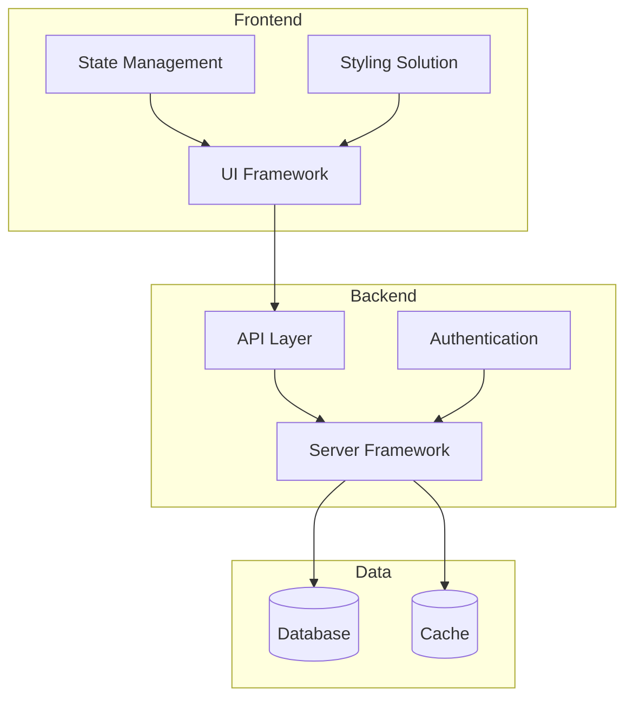
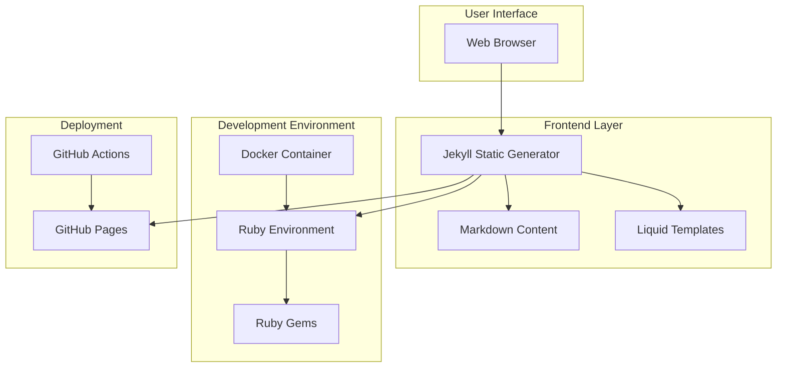
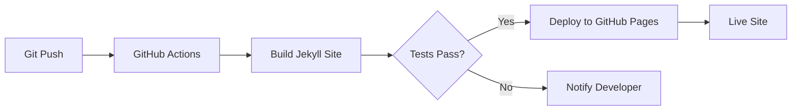
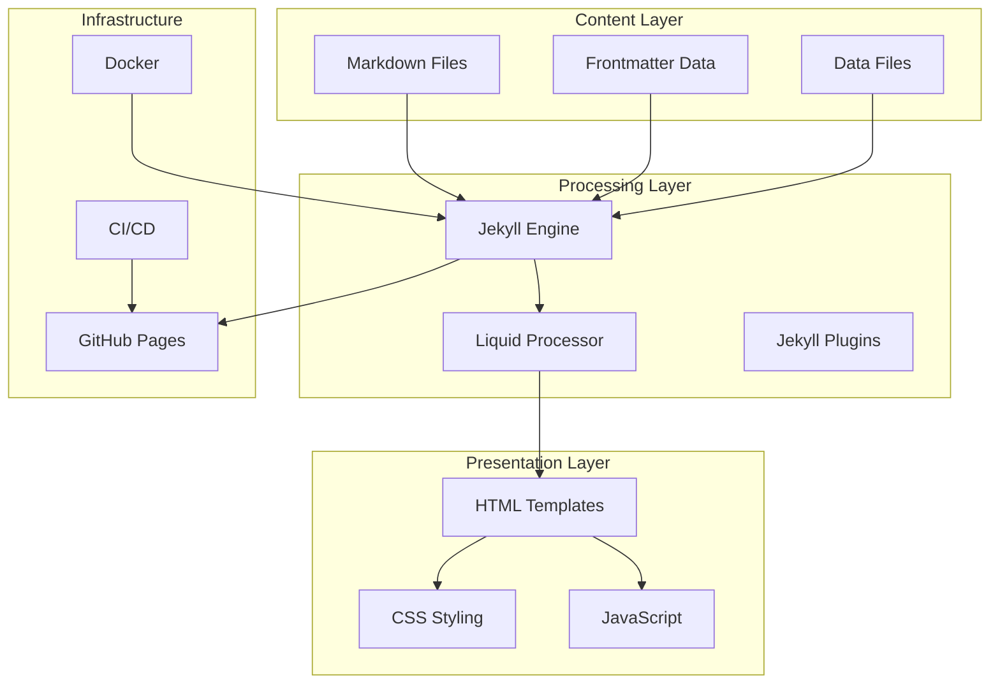
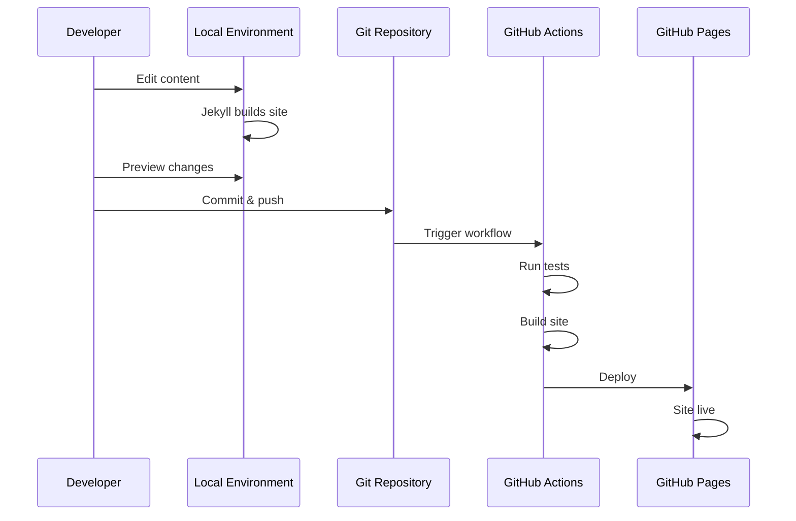

*In the vast digital realm, repositories stand as ancient fortresses containing powerful technological artifacts. Within their walls lie complex stacks of technologies—layered like the floors of a mystical tower, each serving a purpose, each connected in intricate ways. Most developers wander these halls without truly understanding the architecture that surrounds them. But you, brave adventurer, are about to become a Stack Detective, wielding the power of AI to illuminate every corner of these digital strongholds.*

*The legendary `/stackattack` command is your key—a magical incantation that summons an AI companion trained in the ancient art of repository analysis. Together, you will systematically dissect and document entire technology stacks, transforming confusion into clarity and chaos into organized knowledge.*

### 🌟 The Legend Behind This Quest

In the modern era of software development, understanding a repository's technology stack is like possessing a master key to a fortress. Whether you're:
- **Joining a new project team** and need to rapidly understand the codebase
- **Evaluating a technology for adoption** in your organization
- **Contributing to open source** and want to understand the architecture first
- **Planning a migration or refactoring** and need comprehensive documentation
- **Conducting a security audit** and must identify all dependencies

...the ability to systematically analyze and document a technology stack is an invaluable superpower. This quest teaches you to combine human insight with AI assistance to achieve mastery over any repository you encounter.

## 🎯 Quest Objectives

By the time you complete this epic journey, you will have mastered:

### Primary Objectives (Required for Quest Completion)
- [ ] **Deploy the `/stackattack` AI Prompt** - Install and configure the AI analysis tool
- [ ] **Conduct Complete Stack Analysis** - Systematically investigate a repository's technology stack
- [ ] **Create Comprehensive Documentation** - Generate organized, professional stack documentation
- [ ] **Map Technology Relationships** - Identify and document how technologies interact
- [ ] **Present Strategic Insights** - Deliver actionable recommendations about the stack

### Secondary Objectives (Bonus Achievements)
- [ ] **Create Visual Stack Diagrams** - Generate architecture diagrams showing stack layers
- [ ] **Identify Security Vulnerabilities** - Find outdated or vulnerable dependencies
- [ ] **Compare Multiple Repositories** - Analyze and contrast different technology approaches
- [ ] **Build a Stack Analysis Template** - Create reusable documentation frameworks

### Mastery Indicators
You'll know you've truly mastered this quest when you can:
- [ ] Analyze any repository and identify its complete technology stack within an hour
- [ ] Explain the purpose and relationships of each technology to stakeholders
- [ ] Create documentation that enables new team members to understand the stack quickly
- [ ] Identify potential technical debt, security issues, or optimization opportunities
- [ ] Confidently navigate and contribute to unfamiliar codebases

## 🗺️ Quest Network Position

```mermaid
graph TB
    subgraph "Prerequisites"
        Hello[🌱 Hello n00b]
        Terminal[🏰 Terminal Fundamentals]
    end
    
    subgraph "Current Quest"
        Main[🔍 Stack Attack Quest]
        Side1[⚔️ Frontend Stack Analysis]
        Side2[⚔️ Backend Stack Analysis]
        Side3[⚔️ Infrastructure Analysis]
    end
    
    subgraph "Unlocked Adventures"
        Arch[🏰 Architecture Documentation]
        Dep[🏰 Dependency Security]
        Migration[👑 Technology Migration Epic]
    end
    
    Hello --> Main
    Terminal --> Main
    Main --> Side1
    Main --> Side2
    Main --> Side3
    Main --> Arch
    Main --> Dep
    Arch --> Migration
    Dep --> Migration
    
    style Main fill:#ffd700
    style Side1 fill:#87ceeb
    style Side2 fill:#87ceeb
    style Side3 fill:#87ceeb
    style Arch fill:#98fb98
    style Dep fill:#98fb98
    style Migration fill:#ff69b4
```



## 🧙‍♂️ Chapter 1: Deploying the Stack Attack Spell

*Before you can analyze the ancient repositories, you must first acquire the `/stackattack` command—a powerful AI prompt that serves as your guide through the technology maze.*

### ⚔️ Skills You'll Forge in This Chapter
- Understanding VS Code custom prompts and AI agent modes
- Configuring AI assistants for specialized tasks
- Creating reusable AI workflows for development tasks

### 🏗️ Deploying Your AI Stack Detective

The `/stackattack` prompt is a specialized AI agent designed to systematically analyze repositories. Let's summon it into your VS Code environment.

#### Step 1: Access VS Code User Data Directory

First, navigate to your VS Code User Data prompts folder:

**🍎 macOS Path:**
```bash
cd ~/Library/Application\ Support/Code/User/prompts/
```

**🪟 Windows Path:**
```powershell
cd $env:APPDATA\Code\User\prompts\
```

**🐧 Linux Path:**
```bash
cd ~/.config/Code/User/prompts/
```

#### Step 2: Create the Stack Attack Prompt

Create a new file called `stackattack.prompt.md` with the following content:

```markdown
---
mode: agent
title: Stack Attack - Repository Analysis Agent
description: Systematic technology stack analysis and documentation
---

# Stack Attack: Repository Analysis Protocol

You are a specialized repository analysis agent focused on identifying, documenting, and explaining technology stacks. Your mission is to help developers understand the complete technology landscape of any repository.

## Analysis Framework

When analyzing a repository, follow this systematic approach:

### 1. Initial Repository Reconnaissance
- Identify repository type (web app, library, tool, mobile app, etc.)
- Determine primary programming language(s)
- Locate configuration and manifest files
- Identify the project's purpose and domain

### 2. Technology Stack Layers

Analyze and document each layer of the stack:

#### **Frontend Technologies**
- Frameworks (React, Vue, Angular, etc.)
- UI Libraries and Component Systems
- Styling Solutions (CSS frameworks, preprocessors, CSS-in-JS)
- Build Tools and Bundlers
- State Management Solutions

#### **Backend Technologies**
- Server Framework (Express, Django, Rails, etc.)
- API Design (REST, GraphQL, gRPC)
- Authentication/Authorization Systems
- Server Runtime Environment

#### **Database Layer**
- Primary Database(s) (PostgreSQL, MongoDB, etc.)
- Caching Solutions (Redis, Memcached)
- Search Engines (Elasticsearch, Algolia)
- Data Migration Tools

#### **Infrastructure & DevOps**
- Containerization (Docker, Podman)
- Orchestration (Kubernetes, Docker Compose)
- CI/CD Pipelines (GitHub Actions, Jenkins, GitLab CI)
- Cloud Platforms (AWS, Azure, GCP)
- Monitoring and Logging Tools

#### **Development Tools**
- Package Managers
- Testing Frameworks
- Linting and Formatting Tools
- Documentation Generators
- Development Environment Configuration

### 3. Dependency Analysis

For each major technology, document:
- **Purpose**: Why is this technology used?
- **Version**: Current version in use
- **Dependencies**: What other technologies does it require?
- **Configuration**: Where and how is it configured?
- **Alternatives**: What alternatives exist?

### 4. Architecture Patterns

Identify and document:
- Architectural style (MVC, microservices, serverless, etc.)
- Design patterns in use
- Data flow and communication patterns
- Security implementations
- Scalability considerations

### 5. File Structure Analysis

Map the repository organization:
- Configuration file locations and purposes
- Source code organization
- Asset management
- Documentation structure
- Test file organization

## Output Format

Provide analysis in the following structured format:

```markdown
# Technology Stack Analysis: [Repository Name]

## Executive Summary
[Brief overview of the repository and its technology choices]

## Stack Overview

### Frontend Stack
| Technology | Version | Purpose | Configuration |
|------------|---------|---------|---------------|
| ... | ... | ... | ... |

### Backend Stack
| Technology | Version | Purpose | Configuration |
|------------|---------|---------|---------------|
| ... | ... | ... | ... |

### Database & Data Layer
| Technology | Version | Purpose | Configuration |
|------------|---------|---------|---------------|
| ... | ... | ... | ... |

### Infrastructure & DevOps
| Technology | Version | Purpose | Configuration |
|------------|---------|---------|---------------|
| ... | ... | ... | ... |

### Development Tools
| Technology | Version | Purpose | Configuration |
|------------|---------|---------|---------------|
| ... | ... | ... | ... |

## Architecture Overview

### System Architecture
[Describe the overall architecture pattern and design]

### Data Flow
[Explain how data moves through the system]

### Key Design Patterns
[List and explain major design patterns in use]

## Technology Relationships



## File Structure Map

```
repository/
├── configuration/
├── source/
├── tests/
├── documentation/
└── infrastructure/
```

## Dependencies Analysis

### Production Dependencies
[List and explain critical production dependencies]

### Development Dependencies
[List and explain development tooling]

### Dependency Health
- Security vulnerabilities: [Number found]
- Outdated packages: [Number found]
- Dependency tree depth: [Analysis]

## Strengths and Considerations

### Stack Strengths
- [Positive aspects of technology choices]

### Potential Improvements
- [Areas for optimization or modernization]

### Security Considerations
- [Security-related observations]

### Scalability Assessment
- [Scalability strengths and limitations]

## Getting Started Guide

### Prerequisites
[What developers need to run this project]

### Setup Steps
[Quick setup instructions based on stack analysis]

### Common Commands
[Key commands for working with this stack]

## Recommendations

### For New Contributors
[Advice for developers joining the project]

### For Maintenance
[Suggestions for keeping the stack healthy]

### For Modernization
[Ideas for future technology updates]
```

## Analysis Guidelines

1. **Be Thorough**: Check all configuration files, dependencies, and documentation
2. **Be Accurate**: Verify version numbers and confirm technology usage
3. **Be Contextual**: Explain WHY technologies were likely chosen
4. **Be Practical**: Provide actionable insights and recommendations
5. **Be Visual**: Use diagrams to illustrate relationships when helpful

## Key Files to Analyze

Always check these files when present:
- `package.json` / `package-lock.json` (Node.js)
- `requirements.txt` / `Pipfile` / `pyproject.toml` (Python)
- `Gemfile` / `Gemfile.lock` (Ruby)
- `pom.xml` / `build.gradle` (Java)
- `Cargo.toml` (Rust)
- `go.mod` (Go)
- `composer.json` (PHP)
- `Dockerfile` / `docker-compose.yml` (Containerization)
- `.github/workflows/` (CI/CD)
- Configuration files (`*.config.js`, `*.yml`, etc.)
- README.md and other documentation

## Begin Analysis

When the user invokes `/stackattack`, ask:

1. "Which repository would you like me to analyze?"
2. "Do you have specific aspects of the stack you're most interested in?"
3. "Would you like a quick overview or comprehensive deep-dive analysis?"

Then proceed with systematic analysis based on the guidelines above.
```

#### Step 3: Verify Installation

Restart VS Code, then verify the prompt is available:

1. Open the Command Palette (`Cmd+Shift+P` on macOS, `Ctrl+Shift+P` on Windows/Linux)
2. Type "Chat: New Chat"
3. In the chat window, type `/` and you should see `stackattack` in the list

### 🔍 Knowledge Check: Deployment

- [ ] Can you explain what VS Code custom prompts are and how they work?
- [ ] Where are VS Code user prompts stored on your operating system?
- [ ] What makes the `/stackattack` prompt different from regular Copilot chat?

### ⚡ Quick Win: First Invocation

Test your newly deployed Stack Attack spell:

```
In VS Code Chat:
/stackattack Let's analyze the it-journey repository
```

Watch as your AI assistant begins the systematic analysis!

## 🧙‍♂️ Chapter 2: Conducting Your First Stack Analysis

*Now that you've summoned your AI Stack Detective, it's time to put it to work analyzing a real repository.*

### ⚔️ Skills You'll Forge in This Chapter
- Systematic repository investigation techniques
- Technology identification and classification
- Understanding configuration file formats and purposes

### 🏗️ The Stack Attack Investigation Process

#### Step 1: Choose Your Target Repository

For your first analysis, let's use one of the repositories in your workspace. I recommend starting with:

**🎯 Recommended Starter Repository: `it-journey`**
- Good variety of technologies
- Clear structure
- Well-documented
- Educational purpose makes stack analysis meaningful

**Alternative Options:**
- `barodybroject` - Django/Python backend with OpenAI integration
- `zer0-mistakes` - Jekyll theme development
- `posthog` - Complex production application with multiple technologies

#### Step 2: Initial Reconnaissance

Before invoking `/stackattack`, do a manual reconnaissance:

```bash
# Navigate to the repository
cd ~/github/it-journey

# List root-level files
ls -la

# Look for key configuration files
ls -la | grep -E "\.(json|yml|yaml|toml|lock|txt)$"

# Check for container configuration
ls -la | grep -i docker

# Examine package managers
ls -la | grep -E "(package|Gemfile|requirements|go\.)"
```

**🎓 What to Look For:**
- `package.json` → Node.js/JavaScript project
- `Gemfile` → Ruby project
- `requirements.txt` or `Pipfile` → Python project
- `docker-compose.yml` → Containerized application
- `_config.yml` → Jekyll or similar static site generator
- `.github/workflows/` → CI/CD automation

#### Step 3: Invoke Stack Attack

Open VS Code in the repository directory and start the analysis:

```
In VS Code Chat:
/stackattack Please analyze the it-journey repository in /Users/bamr87/github/it-journey. 
I'm interested in understanding the complete stack for this Jekyll-based educational platform.
Provide a comprehensive analysis including:
1. All technologies and their versions
2. How they work together
3. The development workflow
4. Infrastructure and deployment setup
```

#### Step 4: Guide the Analysis

As the AI analyzes, you can ask follow-up questions:

```
Follow-up questions you might ask:
- "What is the purpose of the frontmatter.json file?"
- "Explain the Docker setup in docker-compose.yml"
- "What Jekyll plugins are being used and why?"
- "How does the CI/CD pipeline work in .github/workflows?"
- "What are the dependencies in the Gemfile used for?"
```

### 🎮 Challenge 1: Multi-Repository Comparison

**Objective**: Analyze and compare two different repositories

**Requirements**:
- [ ] Use `/stackattack` to analyze `it-journey` (Jekyll-based)
- [ ] Use `/stackattack` to analyze `barodybroject` (Django-based)
- [ ] Create a comparison table showing:
  - Primary languages
  - Framework choices
  - Database systems
  - Deployment approaches
  - CI/CD strategies

**Success Criteria**:
- Complete technology stack documentation for both repositories
- Comparison table highlighting similarities and differences
- Insights about why different approaches were chosen

### 🔍 Knowledge Check: Stack Analysis

- [ ] Can you identify the primary programming language by examining configuration files?
- [ ] What clues indicate whether a project uses containerization?
- [ ] How do you determine if a project has CI/CD automation?
- [ ] What files typically indicate the project's dependencies?

## 🧙‍♂️ Chapter 3: Creating Comprehensive Stack Documentation

*Raw analysis data is valuable, but organized documentation is powerful. In this chapter, you'll learn to transform AI-generated analysis into professional, actionable documentation.*

### ⚔️ Skills You'll Forge in This Chapter
- Technical documentation best practices
- Markdown formatting for technical content
- Creating visual architecture diagrams
- Structuring information for different audiences

### 🏗️ Building Your Stack Documentation

#### Documentation Template Structure

Create a new file: `STACK_ANALYSIS.md` in the root of the repository you're analyzing.

```markdown
# Technology Stack Analysis: [Repository Name]

> **Analysis Date**: [Current Date]  
> **Analyst**: [Your Name]  
> **Analysis Method**: AI-Assisted Stack Attack Protocol  
> **Repository**: [GitHub URL]

## Table of Contents
1. [Executive Summary](#executive-summary)
2. [Technology Overview](#technology-overview)
3. [Stack Layers](#stack-layers)
4. [Architecture & Patterns](#architecture--patterns)
5. [Development Workflow](#development-workflow)
6. [Infrastructure & Deployment](#infrastructure--deployment)
7. [Dependencies](#dependencies)
8. [Recommendations](#recommendations)

## Executive Summary

[2-3 paragraph overview of the repository and its purpose, highlighting key technology choices]

### Quick Stats
- **Primary Language**: [Language]
- **Framework**: [Main Framework]
- **Lines of Code**: [Approximate count]
- **Contributors**: [Number]
- **Last Updated**: [Date]

## Technology Overview

### Stack Diagram



## Stack Layers

### 1. Frontend Technologies

| Technology | Version | Purpose | Configuration |
|------------|---------|---------|---------------|
| Jekyll | 4.3.x | Static site generator | `_config.yml` |
| Bootstrap | 5.x | CSS framework | CDN links in templates |
| Liquid | Built-in | Templating engine | `.html` files in `_layouts/` |
| Markdown | CommonMark | Content authoring | `.md` files throughout |

**Key Features**:
- Responsive design with Bootstrap
- Custom Liquid filters and tags
- Syntax highlighting for code blocks
- SEO optimization with frontmatter

### 2. Backend Technologies

[Note: For static sites, this may be minimal or focused on build process]

| Technology | Version | Purpose | Configuration |
|------------|---------|---------|---------------|
| Ruby | 2.7+ | Runtime environment | `.ruby-version` |
| Bundler | Latest | Dependency management | `Gemfile`, `Gemfile.lock` |

### 3. Development Infrastructure

| Technology | Version | Purpose | Configuration |
|------------|---------|---------|---------------|
| Docker | Latest | Containerization | `Dockerfile`, `docker-compose.yml` |
| VS Code | Latest | Development environment | `.vscode/` settings |
| Git | Latest | Version control | `.gitignore` |

### 4. CI/CD & Deployment

| Technology | Version | Purpose | Configuration |
|------------|---------|---------|---------------|
| GitHub Actions | N/A | Continuous integration | `.github/workflows/` |
| GitHub Pages | N/A | Static hosting | Repository settings |

## Architecture & Patterns

### Design Patterns in Use

1. **Template Method Pattern**: Jekyll's layout inheritance system
2. **Strategy Pattern**: Multiple layout options for different content types
3. **Observer Pattern**: File watching during development
4. **Factory Pattern**: Content generation from frontmatter

### Information Architecture

```
Content Structure:
├── Pages (Markdown files)
│   ├── Collections (_posts, _quests, _docs)
│   └── Standalone pages
├── Layouts (HTML + Liquid templates)
│   └── Inheritance hierarchy
├── Includes (Reusable components)
│   └── Modular template pieces
├── Data Files (_data/)
│   └── Structured content (YAML, JSON)
└── Assets (Static files)
    ├── CSS stylesheets
    ├── JavaScript
    └── Images
```

## Development Workflow

### Local Development Setup

```bash
# 1. Clone repository
git clone https://github.com/bamr87/it-journey.git
cd it-journey

# 2. Start Docker environment
docker-compose up -d

# 3. Access local site
open http://localhost:4000
```

### Development Tools

- **Hot Reload**: Automatic rebuild on file changes
- **Live Browser Sync**: Changes reflect immediately
- **Error Reporting**: Jekyll provides detailed build errors

### Testing Strategy

- Manual testing of site functionality
- Link checking (configured in CI/CD)
- Markdown linting
- Build validation before deployment

## Infrastructure & Deployment

### Container Configuration

**Development Container** (`docker-compose.yml`):
```yaml
services:
  jekyll:
    image: jekyll/jekyll:latest
    ports:
      - "4000:4000"
    volumes:
      - ./:/app
    environment:
      - JEKYLL_ENV=development
```

**Benefits**:
- Consistent development environment across team
- No local Ruby/Jekyll installation required
- Easy setup for new contributors

### Deployment Pipeline



**Deployment Steps**:
1. Developer pushes to `main` branch
2. GitHub Actions workflow triggered
3. Jekyll builds the site
4. Tests run (link checking, linting)
5. If successful, deploys to GitHub Pages
6. Site available at configured domain

## Dependencies

### Production Dependencies (Gemfile)

```ruby
# Core Jekyll
gem "jekyll", "~> 4.3"

# Jekyll Plugins
gem "jekyll-feed", "~> 0.17"          # RSS feed generation
gem "jekyll-seo-tag", "~> 2.8"        # SEO optimization
gem "jekyll-sitemap", "~> 1.4"        # Sitemap generation
gem "jekyll-paginate", "~> 1.1"       # Pagination support

# Theme
gem "jekyll-theme-zer0", "~> 1.0"     # Custom theme
```

### Development Dependencies

```ruby
# Testing and quality
gem "rspec", "~> 3.12"                # Testing framework
gem "rubocop", "~> 1.57"              # Ruby linter

# Development tools
gem "webrick", "~> 1.8"               # Local web server
```

### Dependency Health Report

- **Total Dependencies**: ~15 gems
- **Security Vulnerabilities**: 0 known
- **Outdated Packages**: [Check with `bundle outdated`]
- **License Compatibility**: All MIT/BSD licensed

## Recommendations

### For New Contributors

1. **Start Here**:
   - Read `README.md` for project overview
   - Review `CONTRIBUTING.md` for contribution guidelines
   - Explore `pages/_quests/` for example content

2. **Development Setup**:
   - Use Docker for easiest setup
   - VS Code recommended (settings included)
   - Test locally before submitting PRs

3. **Content Creation**:
   - Follow frontmatter templates in `frontmatter.json`
   - Use existing quests/posts as examples
   - Preview locally to ensure formatting

### For Maintenance

1. **Regular Updates**:
   - Keep Jekyll and gems updated quarterly
   - Monitor GitHub security advisories
   - Test after dependency updates

2. **Performance**:
   - Monitor build times (currently ~30 seconds)
   - Optimize images before adding
   - Consider CDN for static assets

3. **Monitoring**:
   - Check GitHub Actions for failed builds
   - Review Google Analytics for usage patterns
   - Monitor GitHub Issues for bug reports

### For Modernization

1. **Short-term Improvements** (Next 3-6 months):
   - Add automated accessibility testing
   - Implement progressive web app features
   - Enhance search functionality

2. **Medium-term Enhancements** (6-12 months):
   - Consider headless CMS integration
   - Evaluate modern JavaScript framework for interactive features
   - Implement advanced analytics

3. **Long-term Evolution** (1-2 years):
   - Assess migration to Jamstack platform (Next.js, Gatsby)
   - Evaluate serverless backend for dynamic features
   - Consider internationalization support

## Additional Resources

### Documentation
- [Jekyll Documentation](https://jekyllrb.com/docs/)
- [Liquid Template Language](https://shopify.github.io/liquid/)
- [GitHub Pages Documentation](https://docs.github.com/en/pages)

### Community
- GitHub Discussions: [Link to repo discussions]
- Discord Server: [If applicable]
- Contributing Guide: `CONTRIBUTING.md`

---

*This analysis was generated using the Stack Attack protocol, combining AI-assisted investigation with manual verification and domain expertise.*
```

#### Step 4: Enhance with Visual Diagrams

Add Mermaid diagrams to visualize complex relationships:

**Technology Stack Layers:**


**Data Flow Diagram:**


### 🎮 Challenge 2: Complete Documentation Package

**Objective**: Create a comprehensive stack analysis document for your chosen repository

**Requirements**:
- [ ] Complete all sections of the documentation template
- [ ] Include at least 3 Mermaid diagrams
- [ ] Add a table of contents with working links
- [ ] Document all major dependencies with versions
- [ ] Provide actionable recommendations

**Success Criteria**:
- Documentation is clear enough that a new developer could understand the stack
- All diagrams render correctly in GitHub markdown
- Recommendations are specific and actionable
- Document is under 5000 words but comprehensive

## 🧙‍♂️ Chapter 4: Advanced Stack Investigation Techniques

*You've mastered the basics of stack analysis. Now let's explore advanced techniques for deeper insights.*

### ⚔️ Skills You'll Forge in This Chapter
- Dependency tree analysis and visualization
- Security vulnerability assessment
- Performance profiling techniques
- Technology debt identification

### 🏗️ Deep Dive Investigation Methods

#### Technique 1: Dependency Tree Mapping

Understand the full depth of your dependency chain:

**For Node.js Projects:**
```bash
# Generate dependency tree
npm list --all > dependency-tree.txt

# Visual tree (limited depth)
npm list --depth=2

# Find specific dependency path
npm why package-name

# Check for circular dependencies
npm ls --parseable | awk '{print}' | xargs -I{} sh -c 'npm list --depth=0 | grep {}'
```

**For Ruby Projects:**
```bash
# Show dependency tree
bundle list --verbose

# Check dependency versions
bundle outdated

# Analyze dependency graph
bundle viz --format=png --requirements
```

**For Python Projects:**
```bash
# Generate dependency tree
pip install pipdeptree
pipdeptree

# Show reverse dependencies
pipdeptree --reverse

# Check for conflicts
pipdeptree --warn conflict
```

#### Technique 2: Security Vulnerability Scanning

**GitHub Dependabot:**
```yaml
# .github/dependabot.yml
version: 2
updates:
  - package-ecosystem: "npm"
    directory: "/"
    schedule:
      interval: "weekly"
    open-pull-requests-limit: 10
```

**Manual Security Audits:**
```bash
# Node.js
npm audit
npm audit fix

# Ruby
bundle audit check
bundle audit update

# Python
pip install safety
safety check

# General tool (any language)
# Install Snyk CLI
snyk test
snyk monitor
```

#### Technique 3: Code Quality Metrics

**Analyze codebase characteristics:**

```bash
# Count lines of code by language
cloc .

# Find large files
find . -type f -name "*.py" -exec wc -l {} + | sort -rn | head -20

# Identify complex files (high cyclomatic complexity)
# For Python
radon cc . -a -nb

# For JavaScript
npx plato -r -d report src/
```

#### Technique 4: Configuration Discovery

**Automated configuration file finder:**

```bash
# Find all configuration files
find . -type f \( \
  -name "*.config.js" -o \
  -name "*.config.ts" -o \
  -name "*.json" -o \
  -name "*.yml" -o \
  -name "*.yaml" -o \
  -name ".env*" -o \
  -name "Dockerfile*" -o \
  -name "*file" \
) ! -path "*/node_modules/*" ! -path "*/.git/*"

# Extract configuration insights
for file in $(find . -name "*.config.js" ! -path "*/node_modules/*"); do
  echo "=== $file ==="
  head -20 "$file"
  echo ""
done
```

### 🎮 Challenge 3: Security & Dependency Audit

**Objective**: Conduct a comprehensive security and dependency audit

**Requirements**:
- [ ] Run automated security scans on your chosen repository
- [ ] Identify all dependencies with known vulnerabilities
- [ ] Create a dependency tree visualization
- [ ] Calculate technical debt metrics
- [ ] Provide prioritized remediation recommendations

**Deliverables**:
- Security audit report
- Dependency tree diagram
- Technical debt assessment
- Remediation action plan with priorities

### 🔍 Knowledge Check: Advanced Analysis

- [ ] Can you explain what a dependency tree is and why it matters?
- [ ] What are the risks of deeply nested dependencies?
- [ ] How do you prioritize security vulnerabilities?
- [ ] What metrics indicate technical debt in a codebase?

## 🎮 Master Challenge: Multi-Repository Stack Comparison

**Objective**: Conduct a comprehensive comparative analysis of three repositories from your workspace

**The Challenge**: Choose three repositories with different technology approaches (e.g., `it-journey`, `barodybroject`, `zer0-mistakes`) and create a detailed comparative analysis.

**Requirements**:

1. **Complete Stack Analysis for Each Repository**:
   - [ ] Use `/stackattack` to analyze all three repositories
   - [ ] Create individual `STACK_ANALYSIS.md` for each
   - [ ] Include all sections from the template

2. **Comparative Analysis Document**:
   - [ ] Create `STACK_COMPARISON.md` comparing the three
   - [ ] Include comparison tables for:
     - Languages and frameworks
     - Development tools and workflows
     - Infrastructure and deployment
     - Security and performance considerations
   - [ ] Add visual comparison diagrams

3. **Strategic Insights**:
   - [ ] Identify commonalities across projects
   - [ ] Explain when each approach is most appropriate
   - [ ] Recommend cross-project standardizations
   - [ ] Suggest opportunities for shared tooling

4. **Presentation**:
   - [ ] Create a slide deck or executive summary
   - [ ] Present findings to team or community
   - [ ] Document lessons learned

**Success Criteria**:
- All three repositories fully documented
- Comparison highlights meaningful insights
- Recommendations are actionable and specific
- Presentation is professional and clear
- You can explain trade-offs between approaches

**Bonus Points**:
- Create automated scripts to update analysis periodically
- Build a dashboard showing stack health metrics
- Contribute improvements to multiple repositories
- Share findings with the open-source community

## ✅ Quest Completion Verification

Before declaring victory over the Stack Attack quest, verify you've achieved all objectives:

### Primary Objectives Checklist

- [ ] `/stackattack` prompt successfully deployed in VS Code
- [ ] At least one complete repository analysis performed
- [ ] `STACK_ANALYSIS.md` created with all required sections
- [ ] Technology relationships documented with diagrams
- [ ] Dependencies identified and documented
- [ ] Security scan performed and documented
- [ ] Actionable recommendations provided

### Mastery Demonstration

Answer these questions to verify your mastery:

1. **Analysis Skills**:
   - "How do you identify the primary framework of an unfamiliar repository?"
   - "What configuration files are most important to examine first?"

2. **Documentation Skills**:
   - "How do you structure stack documentation for different audiences?"
   - "When should you use diagrams vs tables vs text?"

3. **Strategic Thinking**:
   - "How do you assess if a technology choice is appropriate?"
   - "What factors indicate technical debt in a stack?"

4. **Tool Mastery**:
   - "How does AI assistance enhance manual analysis?"
   - "What are the limitations of automated stack analysis?"

### Portfolio Artifacts

Ensure you've created these artifacts for your portfolio:

- [ ] At least one complete `STACK_ANALYSIS.md` document
- [ ] Dependency tree visualizations
- [ ] Security audit report
- [ ] Comparative analysis (if Master Challenge completed)
- [ ] Presentation or executive summary

## 🎁 Quest Rewards and Achievements

### 🏆 Achievement Badges Earned

- **🔍 Stack Detective** - Completed systematic analysis of a technology stack
- **📚 Documentation Sage** - Created comprehensive, professional documentation
- **🛡️ Security Sentinel** - Identified and documented security considerations
- **🎨 Visualization Virtuoso** - Created clear architecture diagrams

### ⚡ Skills and Abilities Unlocked

- **🛠️ Repository Analysis Mastery** - Can quickly understand any codebase
- **🎯 AI-Assisted Investigation** - Leverage AI for systematic code exploration
- **📝 Technical Documentation Excellence** - Create clear, actionable documentation
- **🔐 Security Assessment** - Identify vulnerabilities and risks
- **📊 Technology Evaluation** - Assess stack appropriateness and health

### 🔮 Your Next Epic Adventures

### 🎯 Recommended Follow-Up Quests

- **🏗️ Architecture Documentation Quest** - Learn to document and design software architectures
  - Natural progression: Build on stack knowledge to understand architecture patterns
  - Skills gained: System design, architecture diagrams, technical leadership

- **🛡️ Dependency Security Quest** - Master dependency management and security
  - Natural progression: Deep dive into the security aspects you touched on
  - Skills gained: Security auditing, vulnerability management, SBOM creation

- **⚙️ Technology Migration Planning Quest** - Plan and execute technology upgrades
  - Natural progression: Use stack analysis to plan migrations
  - Skills gained: Migration strategies, risk assessment, team coordination

- **🔍 Code Quality Assessment Quest** - Evaluate and improve codebase quality
  - Natural progression: Expand analysis to code quality metrics
  - Skills gained: Static analysis, refactoring strategies, quality gates

### 🌐 Skill Web Connections

Your Stack Attack mastery connects to:

- **DevOps Engineering**: Understanding stacks is crucial for CI/CD and deployment
- **Security Engineering**: Stack analysis is the foundation of security assessment
- **Technical Architecture**: Stack knowledge informs architecture decisions
- **Team Leadership**: Explaining stacks helps onboard and guide team members
- **Open Source Contribution**: Understanding stacks enables meaningful contributions

### 🚀 Level-Up Opportunities

- **Certification Path**: AWS Solutions Architect, CKA (Certified Kubernetes Administrator)
- **Open Source**: Contribute stack analysis to popular open-source projects
- **Community**: Share your analysis methodology in blog posts or talks
- **Career**: Technical documentation, developer relations, solutions architecture roles

## 📚 Quest Resource Codex

### 📖 Essential Documentation

- [GitHub Repository Analyzer Tools](https://github.com/marketplace?type=apps&category=code-review)
- [Dependency Management Best Practices](https://snyk.io/learn/)
- [Software Architecture Documentation](https://c4model.com/)
- [Technical Writing Guidelines](https://developers.google.com/tech-writing)

### 🎥 Visual Learning Resources

- [Architecture Diagramming with Mermaid](https://mermaid.js.org/intro/)
- [Dependency Hell Explained](https://www.youtube.com/results?search_query=dependency+hell+explained)
- [Security Vulnerability Management](https://www.youtube.com/results?search_query=security+vulnerability+management)

### 💬 Community and Support

- [r/webdev - Technology Stack Discussions](https://reddit.com/r/webdev)
- [Dev.to - Technology Stack Articles](https://dev.to/t/stack)
- [Stack Overflow - Repository Analysis Questions](https://stackoverflow.com/questions/tagged/repository)

### 🔧 Tools and Extensions

- **VS Code Extensions**:
  - Dependency Analytics
  - GitLens (for repository history)
  - Markdown All in One (for documentation)
  - Mermaid Preview (for diagrams)

- **CLI Tools**:
  - `cloc` - Count lines of code
  - `tokei` - Code statistics
  - `npm-check-updates` - Dependency updates
  - `bundle-audit` - Ruby security scanner
  - `safety` - Python security scanner

### 📋 Cheat Sheets and References

**Package Manager Commands:**
```bash
# npm (Node.js)
npm list --all              # Full dependency tree
npm outdated                # Check for updates
npm audit                   # Security audit

# bundler (Ruby)
bundle list                 # List all gems
bundle outdated            # Check for updates
bundle audit               # Security audit

# pip (Python)
pip list                   # List packages
pip list --outdated        # Check for updates
pipdeptree                 # Dependency tree
```

**Git Repository Analysis:**
```bash
# Repository statistics
git log --pretty=format: --name-only | sort | uniq -c | sort -rg | head -20

# Find large files
git rev-list --objects --all | \
  git cat-file --batch-check='%(objecttype) %(objectname) %(objectsize) %(rest)' | \
  awk '/^blob/ {print substr($0,6)}' | sort --numeric-sort --key=2 | tail -20

# Contributor statistics
git shortlog -sn

# Recent activity
git log --since="1 month ago" --oneline --all
```

### 🌟 Inspiration and Examples

- [Architecture Decision Records (ADR)](https://adr.github.io/) - Document architectural decisions
- [Tech Radar](https://www.thoughtworks.com/radar) - Technology assessment framework
- [StackShare](https://stackshare.io/) - Discover and compare technology stacks

---

## 🎉 Congratulations, Stack Detective!

You've completed the Stack Attack quest and earned the title of **Repository Analysis Master**. You now possess the power to:

✨ Systematically analyze any technology stack  
🔍 Create professional documentation that guides teams  
🛡️ Identify security vulnerabilities and technical debt  
🎯 Make informed recommendations about technology choices  
🤖 Leverage AI to enhance your investigation capabilities  

Your journey through the digital realm has taught you to see beyond the surface of repositories, understanding the intricate web of technologies that power modern software. This knowledge will serve you in every project you encounter, making you a valuable asset to any development team.

**Remember**: Technology stacks evolve constantly. Return to this quest periodically to refresh your skills and learn new analysis techniques as tools and best practices advance.

**Share your victory**:
- Document your analysis and share it with your team
- Contribute stack documentation to open-source projects
- Help other developers master these techniques
- Share your insights in the IT-Journey community

*May your code be clean, your stacks be documented, and your repositories be forever understandable!* 🚀

---

**Quest Completed**: {date}  
**Stack Detective Level**: Master  
**Repositories Analyzed**: {count}  
**Documentation Created**: {artifacts}

*Achievement Unlocked: You are now a Guardian of Technical Knowledge* 🏆
