*In the vast digital archives of IT-Journey (https://it-journey.dev), data flows like rivers of information through the site's structure. Yet this valuable knowledge remains hidden, scattered across posts, pages, and collections. Your quest: forge a powerful Stats Portal that transforms raw site data into compelling visual insights, revealing the true scope and depth of the IT-Journey knowledge base.*

*By mastering the ancient arts of Jekyll data generation and Liquid templating, you'll create a living dashboard that automatically tracks content metrics, analyzes patterns, and presents statistics with Bootstrap-powered elegance. This portal will serve as a beacon for adventurers, showcasing the collective wisdom accumulated on their journey.*

### 🌟 The Legend Behind This Quest

Every great digital repository needs transparency and insight. The Stats Portal you'll build serves multiple critical purposes:

- **Content Discovery**: Help visitors understand the breadth of available content
- **Quality Metrics**: Track growth and identify content gaps
- **Community Engagement**: Showcase the community's collective contributions
- **Performance Insights**: Measure content effectiveness and reach
- **Motivation**: Celebrate milestones and achievements

This quest teaches you fundamental data analytics skills within Jekyll, preparing you for advanced dashboards, real-time analytics, and data-driven content strategies.

## 🗺️ Quest Network Position

```mermaid
graph TB
    subgraph "Prerequisites"
        Jekyll[🌱 Jekyll Basics]
        YAML[🌱 YAML Fundamentals]
    end
    
    subgraph "Current Quest"
        Main[🏰 Stats Portal Quest]
        Side1[⚔️ Data Collection Setup]
        Side2[⚔️ Visualization Design]
    end
    
    subgraph "Unlocked Adventures"
        Advanced[🏰 Advanced Analytics]
        Visual[🏰 Data Viz Mastery]
        Plugin[👑 Custom Jekyll Plugins]
    end
    
    Jekyll --> Main
    YAML --> Main
    Main --> Side1
    Main --> Side2
    Main --> Advanced
    Main --> Visual
    Advanced --> Plugin
    Visual --> Plugin
    
    style Main fill:#ffd700
    style Jekyll fill:#87ceeb
    style YAML fill:#87ceeb
    style Advanced fill:#98fb98
    style Visual fill:#98fb98
```



## 🎯 Quest Objectives

By completing this legendary quest, you will master:

### Primary Objectives (Required for Quest Completion)
- [ ] **Data Infrastructure**: Create YAML data files to store site statistics
- [ ] **Automated Collection**: Generate statistics during Jekyll build process
- [ ] **Stats Page Creation**: Build a dedicated `/stats/` page using Liquid templates
- [ ] **Bootstrap Visualization**: Display metrics using Bootstrap cards, badges, and components
- [ ] **Core Metrics Display**: Show posts, words, categories, tags, and related statistics

### Secondary Objectives (Bonus Achievements)
- [ ] **Trend Analysis**: Calculate and display growth trends over time
- [ ] **Top Content**: Identify and showcase most popular categories/tags
- [ ] **Word Cloud**: Generate visual representation of keyword frequency
- [ ] **Last Updated**: Display freshness metrics and update timestamps

### Mastery Indicators
You'll know you've truly mastered this quest when you can:
- [ ] Explain Jekyll's build-time data generation process
- [ ] Create custom Liquid filters for data manipulation
- [ ] Design responsive Bootstrap layouts for data presentation
- [ ] Extend the statistics system with new metrics
- [ ] Troubleshoot data generation and display issues independently

## 🧙‍♂️ Chapter 1: Understanding the Data Architecture

### ⚔️ Skills You'll Forge in This Chapter
- Jekyll data file structure and location
- YAML syntax for complex data structures
- Jekyll collections and their metadata
- Build-time vs. runtime data access

### 🏗️ Building Your Knowledge Foundation

Jekyll provides powerful data management capabilities through YAML files stored in the `_data` directory. During the build process, Jekyll reads these files and makes them available to your templates via the `site.data` object.

**Why Use YAML Data Files?**
- **Separation of Concerns**: Keep data separate from presentation
- **Build-Time Generation**: Calculate statistics once during build, not on every page load
- **Type Safety**: Structured data with clear hierarchy
- **Maintainability**: Easy to update and version control

**Jekyll Data Flow:**
```
Site Content (Posts/Pages) 
    ↓
Jekyll Build Process
    ↓
Data File Generation (_data/content_statistics.yml)
    ↓
Liquid Template Processing
    ↓
HTML Output (stats page)
```

Let's examine the existing data infrastructure in IT-Journey:

```yaml
# _data/content_statistics.yml (Example structure)
---
generated_at: '2025-08-25T22:51:23.602-0600'
total_posts: 76
categories:
  development: 15
  data analytics: 6
  programming: 6
  it consulting: 5
  # ... more categories
tags:
  learning-journey: 7
  ai-assisted-development: 7
  jekyll: 5
  # ... more tags
```

### 🔍 Knowledge Check: Data Architecture

Answer these questions to verify your understanding:

- [ ] Where does Jekyll look for data files by default?
- [ ] How do you access data from `_data/stats.yml` in a Liquid template?
- [ ] What's the difference between build-time and runtime data generation?
- [ ] Why use YAML instead of JSON for Jekyll data files?

### ⚡ Quick Wins and Checkpoints
- ✅ Locate the `_data` directory in your Jekyll site
- ✅ Examine existing data files (if any)
- ✅ Understand the relationship between data files and templates

## 🧙‍♂️ Chapter 2: Building the Data Collection System

### ⚔️ Skills You'll Forge in This Chapter
- Ruby script development for Jekyll
- Site.posts iteration and analysis
- YAML file generation
- Statistics calculation algorithms

### 🏗️ Creating the Statistics Generator

**Step 1: Create the Statistics Generator Script**

Create a Ruby script to analyze your Jekyll site and generate statistics:

```ruby
# _data/generate_statistics.rb
#!/usr/bin/env ruby

require 'yaml'
require 'date'

# This script generates comprehensive site statistics
# Run during Jekyll build or manually: ruby _data/generate_statistics.rb

class StatisticsGenerator
  def initialize
    @site_root = File.expand_path('../..', __FILE__)
    @posts_dir = File.join(@site_root, 'pages/_posts')
    @output_file = File.join(@site_root, '_data/content_statistics.yml')
  end

  def generate
    stats = {
      'generated_at' => Time.now.iso8601,
      'total_posts' => 0,
      'total_words' => 0,
      'categories' => {},
      'tags' => {},
      'monthly_posts' => {},
      'top_keywords' => {}
    }

    # Process all posts
    process_posts(stats)

    # Calculate additional metrics
    calculate_averages(stats)

    # Write to YAML file
    File.write(@output_file, stats.to_yaml)
    
    puts "✅ Statistics generated successfully!"
    puts "   Total posts: #{stats['total_posts']}"
    puts "   Output: #{@output_file}"
  end

  private

  def process_posts(stats)
    return unless Dir.exist?(@posts_dir)

    Dir.glob(File.join(@posts_dir, '**/*.md')).each do |file|
      content = File.read(file)
      frontmatter, body = parse_post(content)

      next unless frontmatter

      stats['total_posts'] += 1
      
      # Count words
      word_count = body.split.length
      stats['total_words'] += word_count

      # Process categories
      process_categories(frontmatter, stats)

      # Process tags
      process_tags(frontmatter, stats)

      # Process date
      process_date(frontmatter, stats)

      # Extract keywords
      extract_keywords(body, stats)
    end
  end

  def parse_post(content)
    # Simple frontmatter parser
    if content =~ /^---\s*\n(.*?)\n---\s*\n(.*)$/m
      begin
        frontmatter = YAML.safe_load($1)
        body = $2
        [frontmatter, body]
      rescue => e
        puts "⚠️  Error parsing frontmatter: #{e.message}"
        [nil, nil]
      end
    else
      [nil, nil]
    end
  end

  def process_categories(frontmatter, stats)
    categories = frontmatter['categories'] || []
    categories = [categories] unless categories.is_a?(Array)
    
    categories.each do |cat|
      cat_name = cat.to_s.downcase.strip
      stats['categories'][cat_name] ||= 0
      stats['categories'][cat_name] += 1
    end
  end

  def process_tags(frontmatter, stats)
    tags = frontmatter['tags'] || []
    tags = [tags] unless tags.is_a?(Array)
    
    tags.each do |tag|
      tag_name = tag.to_s.downcase.strip
      stats['tags'][tag_name] ||= 0
      stats['tags'][tag_name] += 1
    end
  end

  def process_date(frontmatter, stats)
    date_str = frontmatter['date']
    return unless date_str

    begin
      date = Date.parse(date_str.to_s)
      month_key = date.strftime('%Y-%m')
      stats['monthly_posts'][month_key] ||= 0
      stats['monthly_posts'][month_key] += 1
    rescue
      # Skip invalid dates
    end
  end

  def extract_keywords(body, stats)
    # Simple keyword extraction (words > 5 chars, excluding common words)
    common_words = %w[about above after again against could should would their there these those through during before between]
    
    words = body.downcase.scan(/\b[a-z]{6,}\b/)
    words.each do |word|
      next if common_words.include?(word)
      stats['top_keywords'][word] ||= 0
      stats['top_keywords'][word] += 1
    end
  end

  def calculate_averages(stats)
    return if stats['total_posts'].zero?

    stats['average_words_per_post'] = (stats['total_words'].to_f / stats['total_posts']).round(0)
    stats['average_categories_per_post'] = (stats['categories'].values.sum.to_f / stats['total_posts']).round(2)
    stats['average_tags_per_post'] = (stats['tags'].values.sum.to_f / stats['total_posts']).round(2)

    # Sort and limit top items
    stats['categories'] = stats['categories'].sort_by { |k, v| -v }.to_h
    stats['tags'] = stats['tags'].sort_by { |k, v| -v }.to_h
    stats['top_keywords'] = stats['top_keywords'].sort_by { |k, v| -v }.first(50).to_h
  end
end

# Run the generator
if __FILE__ == $0
  generator = StatisticsGenerator.new
  generator.generate
end
```

**Step 2: Make the Script Executable**

```bash
# Navigate to your Jekyll site root
cd /path/to/it-journey

# Make the script executable
chmod +x _data/generate_statistics.rb

# Test the script
ruby _data/generate_statistics.rb
```

**Expected Output:**
```
✅ Statistics generated successfully!
   Total posts: 76
   Output: /path/to/it-journey/_data/content_statistics.yml
```

**Step 3: Integrate with Jekyll Build Process**

You can run this script manually or automate it as part of your build process. Let's create a helper script:

```bash
# _data/update_statistics.sh
#!/bin/bash

echo "🔄 Generating site statistics..."
ruby _data/generate_statistics.rb

if [ $? -eq 0 ]; then
    echo "✅ Statistics updated successfully"
else
    echo "❌ Error generating statistics"
    exit 1
fi
```

```bash
# Make it executable
chmod +x _data/update_statistics.sh

# Run it
./_data/update_statistics.sh
```

### 🔍 Knowledge Check: Data Collection

- [ ] Can you explain what the `parse_post` method does?
- [ ] How does the script count words in each post?
- [ ] What data structure is used to store category counts?
- [ ] How would you add a new statistic (e.g., reading time)?

### ⚡ Quick Wins and Checkpoints
- ✅ Script runs without errors
- ✅ `_data/content_statistics.yml` is created
- ✅ Statistics file contains expected data structure
- ✅ Numbers match your site's actual content

## 🧙‍♂️ Chapter 3: Crafting the Stats Portal Page

### ⚔️ Skills You'll Forge in This Chapter
- Liquid templating syntax and filters
- Bootstrap grid system and components
- Responsive design patterns
- Data visualization with HTML/CSS

### 🏗️ Building the Statistics Page

**Step 1: Create the Stats Page**

Create a new page for your statistics:

```markdown
---
# pages/stats.md
title: "IT-Journey Statistics Portal"
description: "Comprehensive analytics and metrics for the IT-Journey knowledge base"
permalink: /stats/
---

<div class="container my-5">
  <div class="row">
    <div class="col-lg-12">
      <h1 class="display-4 mb-4">
        <i class="bi bi-graph-up"></i> Site Statistics Portal
      </h1>
      <p class="lead">
        Comprehensive analytics and insights from the IT-Journey knowledge base
      </p>
      
      
        <p class="text-muted">
          <i class="bi bi-clock"></i> 
          Last updated: {{ site.data.content_statistics.generated_at | date: "%B %d, %Y at %I:%M %p" }}
        </p>
      
        <div class="alert alert-warning" role="alert">
          <i class="bi bi-exclamation-triangle"></i>
          Statistics not yet generated. Run <code>ruby _data/generate_statistics.rb</code> to create statistics.
        </div>
      
    </div>
  </div>

  
  
  <!-- Overview Cards -->
  <div class="row g-4 mb-5">
    <!-- Total Posts Card -->
    <div class="col-md-3">
      <div class="card h-100 border-primary">
        <div class="card-body text-center">
          <i class="bi bi-file-text display-4 text-primary"></i>
          <h2 class="card-title mt-3 mb-0">
            {{ site.data.content_statistics.total_posts }}
          </h2>
          <p class="card-text text-muted">Total Posts</p>
        </div>
      </div>
    </div>

    <!-- Total Words Card -->
    <div class="col-md-3">
      <div class="card h-100 border-success">
        <div class="card-body text-center">
          <i class="bi bi-fonts display-4 text-success"></i>
          <h2 class="card-title mt-3 mb-0">
            {{ site.data.content_statistics.total_words | number_with_delimiter }}
          </h2>
          <p class="card-text text-muted">Total Words</p>
        </div>
      </div>
    </div>

    <!-- Average Words Card -->
    <div class="col-md-3">
      <div class="card h-100 border-info">
        <div class="card-body text-center">
          <i class="bi bi-pencil display-4 text-info"></i>
          <h2 class="card-title mt-3 mb-0">
            {{ site.data.content_statistics.average_words_per_post }}
          </h2>
          <p class="card-text text-muted">Avg. Words/Post</p>
        </div>
      </div>
    </div>

    <!-- Categories Card -->
    <div class="col-md-3">
      <div class="card h-100 border-warning">
        <div class="card-body text-center">
          <i class="bi bi-folder display-4 text-warning"></i>
          <h2 class="card-title mt-3 mb-0">
            {{ site.data.content_statistics.categories | size }}
          </h2>
          <p class="card-text text-muted">Categories</p>
        </div>
      </div>
    </div>
  </div>

  <!-- Categories Section -->
  <div class="row mb-5">
    <div class="col-lg-6">
      <div class="card">
        <div class="card-header bg-primary text-white">
          <h3 class="mb-0">
            <i class="bi bi-folder2-open"></i> Top Categories
          </h3>
        </div>
        <div class="card-body">
          <ul class="list-group list-group-flush">
            
              <li class="list-group-item d-flex justify-content-between align-items-center">
                <span>{{ category[0] | capitalize }}</span>
                <span class="badge bg-primary rounded-pill">{{ category[1] }}</span>
              </li>
            
          </ul>
        </div>
      </div>
    </div>

    <!-- Tags Section -->
    <div class="col-lg-6">
      <div class="card">
        <div class="card-header bg-success text-white">
          <h3 class="mb-0">
            <i class="bi bi-tags"></i> Top Tags
          </h3>
        </div>
        <div class="card-body">
          <ul class="list-group list-group-flush">
            
              <li class="list-group-item d-flex justify-content-between align-items-center">
                <span>{{ tag[0] }}</span>
                <span class="badge bg-success rounded-pill">{{ tag[1] }}</span>
              </li>
            
          </ul>
        </div>
      </div>
    </div>
  </div>

  <!-- Tag Cloud -->
  <div class="row mb-5">
    <div class="col-lg-12">
      <div class="card">
        <div class="card-header bg-info text-white">
          <h3 class="mb-0">
            <i class="bi bi-cloud"></i> Tag Cloud
          </h3>
        </div>
        <div class="card-body">
          <div class="tag-cloud">
            
              
              
                
              
                
              
                
              
                
              
                
              
              <span class="badge bg-secondary {{ tag_class }} m-1">
                {{ tag[0] }} <small>({{ tag[1] }})</small>
              </span>
            
          </div>
        </div>
      </div>
    </div>
  </div>

  <!-- Monthly Activity -->
  
  <div class="row mb-5">
    <div class="col-lg-12">
      <div class="card">
        <div class="card-header bg-warning text-dark">
          <h3 class="mb-0">
            <i class="bi bi-calendar3"></i> Monthly Activity
          </h3>
        </div>
        <div class="card-body">
          <div class="table-responsive">
            <table class="table table-hover">
              <thead>
                <tr>
                  <th>Month</th>
                  <th>Posts</th>
                  <th>Activity</th>
                </tr>
              </thead>
              <tbody>
                
                  <tr>
                    <td>{{ month[0] }}</td>
                    <td><strong>{{ month[1] }}</strong></td>
                    <td>
                      <div class="progress" style="height: 20px;">
                        
                        <div class="progress-bar bg-warning" role="progressbar" 
                             style="width: {{ percentage }}%" 
                             aria-valuenow="{{ percentage }}" 
                             aria-valuemin="0" 
                             aria-valuemax="100">
                          {{ percentage }}%
                        </div>
                      </div>
                    </td>
                  </tr>
                
              </tbody>
            </table>
          </div>
        </div>
      </div>
    </div>
  </div>
  

  <!-- Additional Metrics -->
  <div class="row mb-5">
    <div class="col-lg-12">
      <div class="card">
        <div class="card-header bg-secondary text-white">
          <h3 class="mb-0">
            <i class="bi bi-info-circle"></i> Additional Metrics
          </h3>
        </div>
        <div class="card-body">
          <div class="row">
            <div class="col-md-4 mb-3">
              <h5>Content Diversity</h5>
              <p>
                <strong>Categories:</strong> {{ site.data.content_statistics.categories | size }}<br>
                <strong>Tags:</strong> {{ site.data.content_statistics.tags | size }}<br>
                <strong>Avg. Categories/Post:</strong> {{ site.data.content_statistics.average_categories_per_post }}<br>
                <strong>Avg. Tags/Post:</strong> {{ site.data.content_statistics.average_tags_per_post }}
              </p>
            </div>
            <div class="col-md-4 mb-3">
              <h5>Reading Metrics</h5>
              
              <p>
                <strong>Avg. Reading Time:</strong> ~{{ estimated_reading_time }} min<br>
                <strong>Total Reading Time:</strong> ~{{ site.data.content_statistics.total_words | divided_by: 200 }} min<br>
                <strong>Longest Category:</strong> 
                
                {{ top_category[0] | capitalize }} ({{ top_category[1] }} posts)
              </p>
            </div>
            <div class="col-md-4 mb-3">
              <h5>Content Health</h5>
              <p>
                <strong>Data Freshness:</strong> 
                {% assign update_date = site.data.content_statistics.generated_at | date: "%s" %}
                {% assign now = "now" | date: "%s" %}
                
                
                  <span class="badge bg-success">Fresh ({{ age_hours }}h)</span>
                
                  <span class="badge bg-warning">Good</span>
                
                  <span class="badge bg-danger">Stale</span>
                
                <br>
                <strong>Keywords Tracked:</strong> {{ site.data.content_statistics.top_keywords | size }}
              </p>
            </div>
          </div>
        </div>
      </div>
    </div>
  </div>

  
</div>

<style>
.tag-cloud {
  line-height: 2.5;
}
.tag-cloud .badge {
  transition: transform 0.2s;
  cursor: default;
}
.tag-cloud .badge:hover {
  transform: scale(1.1);
}
</style>
```

**Step 2: Update Your Site Navigation**

Add a link to the stats page in your navigation. The location depends on your theme, but typically you'd add it to `_data/navigation.yml` or similar:

```yaml
# _data/navigation.yml (example)
main:
  - title: "Home"
    url: /
  - title: "Posts"
    url: /posts/
  - title: "Quests"
    url: /quests/
  - title: "Statistics"  # New entry
    url: /stats/
    icon: "bi-graph-up"
  - title: "About"
    url: /about/
```

**Step 3: Test Your Stats Page**

```bash
# Regenerate statistics
ruby _data/generate_statistics.rb

# Start Jekyll server
docker-compose up
# or
bundle exec jekyll serve

# Visit in browser
open http://localhost:4000/stats/
```

### 🔍 Knowledge Check: Liquid Templating

- [ ] How do you access data from `_data/content_statistics.yml` in Liquid?
- [ ] What does the `sort` filter do in the categories loop?
- [ ] How does the progress bar percentage calculation work?
- [ ] What Bootstrap classes create the responsive grid layout?

### ⚡ Quick Wins and Checkpoints
- ✅ Stats page loads without errors
- ✅ All metrics display correctly
- ✅ Page is responsive on mobile devices
- ✅ Bootstrap styles render properly
- ✅ Last updated timestamp is accurate

## 🎮 Quest Implementation Challenges

### Challenge 1: Enhanced Metrics Display (🕐 20 minutes)

**Objective**: Add at least 3 new statistics to your portal

**Requirements**:
- [ ] Add "Reading Time" calculator (words / 200 wpm)
- [ ] Display "Newest Post" and "Oldest Post" dates
- [ ] Show "Most Active Month" with highlight
- [ ] Calculate content growth rate (posts per month average)

**Success Criteria**:
- [ ] New metrics display accurately
- [ ] Bootstrap styling matches existing design
- [ ] Calculations are correct and tested

**Bonus Points**:
- [ ] Add visualization for growth trends
- [ ] Create "Quick Facts" section with interesting statistics
- [ ] Include author statistics if available

### Challenge 2: Interactive Filtering (🕐 30 minutes)

**Objective**: Add interactive elements to filter and explore data

**Requirements**:
- [ ] Add search/filter for categories and tags
- [ ] Create collapsible sections for better organization
- [ ] Add sorting options (alphabetical, by count)
- [ ] Implement "Show More/Less" for long lists

**Success Criteria**:
- [ ] Filtering works without page reload (CSS-based or JavaScript)
- [ ] User experience is smooth and intuitive
- [ ] Mobile-friendly implementation

**Bonus Points**:
- [ ] Add URL parameters to persist filter state
- [ ] Create printable version of stats page
- [ ] Add export functionality (CSV or JSON)

### Challenge 3: Visual Enhancements (🕐 20 minutes)

**Objective**: Improve the visual presentation of statistics

**Requirements**:
- [ ] Add charts using Chart.js or similar library
- [ ] Create animated counters for main metrics
- [ ] Design custom icons for each statistic
- [ ] Implement color-coded health indicators

**Success Criteria**:
- [ ] Visualizations load correctly
- [ ] Performance remains good (< 2s page load)
- [ ] Accessibility maintained (alt text, ARIA labels)

**Bonus Points**:
- [ ] Add dark mode support
- [ ] Create animated transitions
- [ ] Design custom SVG illustrations

## ✅ Quest Completion Verification

### Master Data Analytics Demonstration

Your completed Stats Portal must demonstrate:

**Core Requirements:**
- [ ] Statistics page accessible at `/stats/` URL
- [ ] Displays minimum 5 different metrics:
  - Total posts
  - Total words
  - Categories (count and list)
  - Tags (count and list)
  - Monthly activity
- [ ] Bootstrap-styled responsive layout
- [ ] Data automatically generated during build
- [ ] Last updated timestamp visible

**Quality Standards:**
- [ ] Page loads in < 3 seconds
- [ ] Responsive on mobile (320px+), tablet, and desktop
- [ ] All statistics are accurate and testable
- [ ] No console errors or warnings
- [ ] Accessible (WCAG 2.1 Level AA)

**Code Quality:**
- [ ] Ruby script follows best practices
- [ ] Liquid templates are well-organized
- [ ] Comments explain complex logic
- [ ] YAML data structure is clear and documented

**Documentation:**
- [ ] README updated with stats page information
- [ ] Instructions for regenerating statistics
- [ ] Screenshots of stats page (optional but recommended)

## 🎁 Quest Rewards and Achievements

### 🏆 Achievement Badges Earned
- **Data Portal Architect** - Successfully built a comprehensive statistics portal
- **Jekyll Analytics Master** - Mastered Jekyll data files and Liquid templating
- **Bootstrap Visualizer** - Created responsive, styled data presentations

### ⚡ Skills and Abilities Unlocked
- **Jekyll Data File Management** - Create and manage YAML data structures
- **Liquid Templating Proficiency** - Advanced template programming
- **Bootstrap Data Visualization** - Design compelling data displays
- **Ruby Scripting** - Automate Jekyll site analysis

### 🛠️ Tools Added to Your Arsenal
- **Statistics Generator** - Reusable script for site analytics
- **Data Visualization Patterns** - Bootstrap components library
- **Liquid Filters** - Data manipulation techniques
- **YAML Structures** - Complex data organization

### 📈 Your Journey Progress
- **Previous Skills**: Basic Jekyll site management
- **Current Mastery**: Data-driven Jekyll development
- **Next Adventures**: Advanced analytics, custom plugins, real-time dashboards

## 🔮 Your Next Epic Adventures

### 🎯 Recommended Follow-Up Quests

**Immediate Next Steps:**
- **Advanced Jekyll Analytics** - Add search analytics, user tracking
- **Custom Liquid Filters** - Build reusable data manipulation functions
- **Chart.js Integration** - Create interactive visualizations

**Alternative Specializations:**
- **Jekyll Plugin Development** - Build custom Jekyll plugins
- **API Integration** - Connect external analytics services
- **Real-Time Dashboards** - Add JavaScript-powered live data

### 🌐 Skill Web Connections

**Cross-Technology Skills:**
- **JavaScript**: Add interactivity and charts
- **Python**: Alternative statistics generation
- **GraphQL**: Query-based data access
- **D3.js**: Advanced data visualizations

**Career Path Integration:**
- **Data Analyst**: Portfolio-worthy analytics dashboard
- **Web Developer**: Full-stack Jekyll mastery
- **DevOps Engineer**: Build automation and CI/CD

### 🚀 Level-Up Opportunities

**Advanced Implementations:**
- Integrate Google Analytics data
- Create automated weekly reports
- Build API endpoint for statistics
- Implement caching strategies

**Community Contributions:**
- Share your stats generator as a Jekyll plugin
- Write tutorial blog post
- Create video walkthrough
- Submit pull request to IT-Journey

## 📚 Quest Resource Codex

### 📖 Essential Documentation
- [Jekyll Data Files](https://jekyllrb.com/docs/datafiles/) - Official documentation
- [Liquid Template Language](https://shopify.github.io/liquid/) - Syntax reference
- [Bootstrap 5 Components](https://getbootstrap.com/docs/5.0/components/) - UI components
- [Ruby YAML](https://yaml.org/YAML_for_ruby.html) - YAML in Ruby

### 🎥 Visual Learning Resources
- [Jekyll Tutorial Series](https://www.youtube.com/results?search_query=jekyll+tutorial) - Video tutorials
- [Liquid Templating Basics](https://www.youtube.com/results?search_query=liquid+templating) - Template language
- [Bootstrap Grid System](https://www.youtube.com/results?search_query=bootstrap+grid+tutorial) - Responsive layouts

### 💬 Community and Support
- [Jekyll Talk Forum](https://talk.jekyllrb.com/) - Official community forum
- [Stack Overflow - Jekyll](https://stackoverflow.com/questions/tagged/jekyll) - Q&A community
- [r/Jekyll](https://reddit.com/r/Jekyll) - Reddit discussions

### 🔧 Tools and Extensions
- [Jekyll Compose](https://github.com/jekyll/jekyll-compose) - Content creation helpers
- [Jekyll Analytics](https://github.com/hendrikschneider/jekyll-analytics) - Analytics plugin
- [Liquid Syntax VS Code](https://marketplace.visualstudio.com/items?itemName=sissel.shopify-liquid) - Editor support

### 📋 Cheat Sheets and References
- [Liquid Cheat Sheet](https://www.shopify.com/partners/shopify-cheat-sheet) - Quick reference
- [Jekyll Cheat Sheet](https://devhints.io/jekyll) - Common commands
- [Bootstrap Cheat Sheet](https://bootstrap-cheatsheet.themeselection.com/) - All components

### 🌟 Inspiration and Examples
- [Jekyll Showcase](https://jekyllrb.com/showcase/) - Real Jekyll sites
- [Bootstrap Examples](https://getbootstrap.com/docs/5.0/examples/) - Layout templates
- [Data Visualization Gallery](https://www.d3-graph-gallery.com/) - Chart inspiration

## 🔧 Troubleshooting Guide

### Common Issues and Solutions

**Issue: Statistics file not found**
```
Error: undefined method `[]' for nil:NilClass
```
**Solution**: 
- Run `ruby _data/generate_statistics.rb` to create the file
- Verify file exists at `_data/content_statistics.yml`
- Check file permissions (should be readable)

**Issue: Numbers don't match expected values**
```
Shows 0 posts but I have posts
```
**Solution**:
- Verify posts are in `pages/_posts/` directory
- Check frontmatter is valid YAML
- Ensure posts have proper date format
- Run script with debugging: `ruby -d _data/generate_statistics.rb`

**Issue: Page styling broken**
```
Bootstrap classes not applying
```
**Solution**:
- Verify Bootstrap CSS is loaded in layout
- Check for CSS conflicts in custom styles
- Inspect browser console for errors
- Clear browser cache and rebuild site

**Issue: Liquid syntax errors**
```
Liquid Exception: undefined method
```
**Solution**:
- Check Liquid syntax carefully (spaces, pipes, etc.)
- Verify data structure matches template expectations
- Test with simple template first, then add complexity
- Review Jekyll error messages for line numbers

---

*Congratulations, Data Portal Architect! You've successfully mastered the art of Jekyll data analytics and visualization. Your Stats Portal now serves as a powerful window into the IT-Journey knowledge base, revealing insights and celebrating the community's collective wisdom. May your metrics always be accurate, your visualizations compelling, and your dashboards ever-informative!*

**Quest Status**: ✅ **COMPLETE**

*Share your Stats Portal with the IT-Journey community and inspire others to build data-driven experiences!*
