---

title: Level 0010 - Terminal Enhancement & Shell Mastery
description: Enhance your terminal experience with Oh My Zsh, Nerd Fonts, and advanced shell customization
preview: images/previews/level-0010-terminal-enhancement-shell-mastery.png
permalink: /quests/level-0010/
lastmod: 2025-11-29T23:41:31.766Z

layout: quest-collection
level: 0010
categories: quests
---

# Level 0010: Terminal Enhancement & Shell Mastery

*Having conquered the basic incantations, you now seek to augment your terminal with powerful enchantments. Level 0010 transforms your command line from a simple tool into a beautifully customized powerhouse that enhances your productivity and delights the eye.*

## Quest Overview

Level 0010 quests focus on:
- **Shell Framework Mastery** - Oh My Zsh and plugin ecosystems
- **Visual Enhancements** - Nerd Fonts, themes, and prompt customization
- **Terminal Configuration** - Advanced shell scripting and optimization
- **Developer Productivity** - Tools and workflows for efficient development

## Available Quests

### ✨ Terminal Customization

#### [Oh My Zsh Terminal Enchantment](oh-my-zsh-terminal-enchantment.md)
**Quest Type**: Side ⚔️ | **Difficulty**: 🟡 Medium | **Estimated Time**: 45-90 minutes

Transform your terminal with Oh My Zsh - the delightful, open source framework for managing your Zsh configuration. Unlock powerful plugins, beautiful themes, and productivity-boosting features.

**Skills You'll Master:**
- Oh My Zsh installation and configuration
- Theme selection and customization (Powerlevel10k, agnoster, etc.)
- Plugin management for Git, Docker, kubectl, and more
- Custom aliases and functions

**Prerequisites:** Terminal basics, [Bash Fundamentals](../0000/bash-run.md)

---

#### [Nerd Font Enchantment Side Quest](nerd-font-enchantment-side-quest.md)
**Quest Type**: Side ⚔️ | **Difficulty**: 🟢 Easy | **Estimated Time**: 20-30 minutes

Unlock the power of Nerd Fonts - patched fonts with icons and glyphs that transform your terminal's visual appeal. Essential for Powerlevel10k and other advanced prompts.

**Skills You'll Master:**
- Nerd Font installation across platforms
- Terminal font configuration
- Icon integration in prompts
- Font compatibility troubleshooting

**Prerequisites:** Terminal access, basic font installation knowledge

---

#### [Terminal Artificer: Frontend Building](terminal-artificer-frontend-building.md)
**Quest Type**: Main 🏰 | **Difficulty**: 🟡 Medium | **Estimated Time**: 60-90 minutes

Master the art of terminal-based frontend development workflows. Build, test, and deploy web applications without leaving your terminal.

**Skills You'll Master:**
- Node.js and npm from the command line
- Build tool configuration (Webpack, Vite)
- Terminal-based testing workflows
- Live development servers

**Prerequisites:** [Oh My Zsh Terminal Enchantment](oh-my-zsh-terminal-enchantment.md), HTML/CSS basics

### 📝 Scripting & Automation

#### [Bash Scripting Mastery](bash-scripting.md)
**Quest Type**: Main 🏰 | **Difficulty**: 🟡 Medium | **Estimated Time**: 90-120 minutes

Advance beyond basic commands to write powerful, reusable Bash scripts. Learn control flow, error handling, and best practices.

**Skills You'll Master:**
- Advanced Bash scripting patterns
- Error handling and exit codes
- Script parameterization and validation
- Cross-platform compatibility

**Prerequisites:** [Bash Fundamentals](../0000/bash-run.md)

---

#### [Prompt Engineering Fundamentals](prompt-engineering.md)
**Quest Type**: Main 🏰 | **Difficulty**: 🟡 Medium | **Estimated Time**: 60-90 minutes

Learn to craft effective prompts for AI assistants and language models. Master the art of communicating with AI tools.

**Skills You'll Master:**
- Prompt structure and patterns
- Context optimization
- Few-shot and zero-shot techniques
- AI tool integration in workflows

**Prerequisites:** Basic programming knowledge

### 🧪 Testing & Quality

#### [Testing Quests with Recursive Questing](testing-quests-with-recurrisive-questing.md)
**Quest Type**: Bonus 🎁 | **Difficulty**: 🟡 Medium | **Estimated Time**: 45-60 minutes

A meta-quest exploring how quests can be tested and validated. Learn about testing frameworks and quality assurance for educational content.

**Skills You'll Master:**
- Quest validation patterns
- Automated testing concepts
- Quality assurance methodologies
- Recursive problem-solving

**Prerequisites:** Quest creation experience

### 📊 Documentation & Visualization

#### [Jekyll Mermaid Integration Quest](jekyll-mermaid-integration-quest.md)
**Quest Type**: Side ⚔️ | **Difficulty**: 🟢 Easy | **Estimated Time**: 30-45 minutes

Add beautiful diagrams to your Jekyll sites using Mermaid. Create flowcharts, sequence diagrams, and more with simple text syntax.

**Skills You'll Master:**
- Mermaid diagram syntax
- Jekyll plugin integration
- Flowchart and sequence diagram creation
- Documentation visualization

**Prerequisites:** Jekyll basics, Markdown knowledge

## Learning Path Recommendations

### For Terminal Enthusiasts
1. [Oh My Zsh Terminal Enchantment](oh-my-zsh-terminal-enchantment.md) - Foundation framework
2. [Nerd Font Enchantment Side Quest](nerd-font-enchantment-side-quest.md) - Visual upgrade
3. [Bash Scripting Mastery](bash-scripting.md) - Advanced scripting

### For Frontend Developers
1. [Oh My Zsh Terminal Enchantment](oh-my-zsh-terminal-enchantment.md) - Enhanced terminal
2. [Terminal Artificer: Frontend Building](terminal-artificer-frontend-building.md) - CLI workflows
3. [Jekyll Mermaid Integration Quest](jekyll-mermaid-integration-quest.md) - Documentation

### For AI Practitioners
1. [Prompt Engineering Fundamentals](prompt-engineering.md) - Core AI communication
2. [Oh My Zsh Terminal Enchantment](oh-my-zsh-terminal-enchantment.md) - Enhanced tooling
3. Progress to Level 0011 for AI tool integration

## Quest Dependencies & Progression

```mermaid
graph TD
    A[Level 0000 Complete] --> B[🎨 Oh My Zsh Enchantment]
    B --> C[✨ Nerd Font Side Quest]
    B --> D[📝 Bash Scripting Mastery]
    B --> E[🔧 Terminal Artificer]
    D --> F[Level 0011 Quests]
    A --> G[🤖 Prompt Engineering]
    G --> F
    B --> H[📊 Jekyll Mermaid]
```

## Quest Completion Benefits

Upon completing Level 0010 quests, you'll unlock:
- **Beautiful Terminal** - Customized shell with themes and icons
- **Enhanced Productivity** - Oh My Zsh plugins and aliases
- **Scripting Prowess** - Advanced Bash automation skills
- **AI Communication** - Effective prompt engineering abilities

## Next Level: Level 0011

After mastering terminal enhancement, advance to [Level 0011 - Development Tools & AI Integration](../0011/README.md) where you'll:
- Master AI-powered development tools
- Learn advanced IDE integrations
- Explore code search and analysis

---

*Your terminal is your command center. Make it beautiful, make it powerful, make it yours.* 🎨✨
