## 🌟 The Legend of Terminal Enchantment

*In the vast digital realms where developers forge their code, there exists a legendary framework known as Oh-My-Zsh. This ancient artifact transforms the humble terminal from a mere tool into a powerful weapon of productivity. Like a master blacksmith who takes raw iron and crafts it into an exquisite sword, Oh-My-Zsh takes the basic Zsh shell and enchants it with themes, plugins, and magical enhancements that make every command a spell of efficiency.*

*But beware, brave adventurer! This quest requires you to investigate mysterious installation scripts and venture into the depths of shell configuration. Only those who master the art of terminal enchantment will emerge with the power to command their development environment like a true sorcerer of code. Throughout this journey, you'll use VSCode as your primary tool for examining files, editing configurations, and understanding the code that powers your terminal enhancements.*

### 🏰 The Ancient Scrolls of Installation

Before we begin our journey, we must first examine the sacred installation ritual. The elders of the terminal realm have provided us with the incantation:

```bash
wget https://raw.githubusercontent.com/ohmyzsh/ohmyzsh/master/tools/install.sh
sh install.sh
```

*These commands summon the Oh-My-Zsh framework from the digital ether. But remember, with great power comes great responsibility - always examine scripts before executing them!*

### 🗺️ Quest Network Position

```mermaid
graph TB
    subgraph "Prerequisites"
        Terminal["🌱 Level 0001: Terminal Fundamentals"]
    end
    
    subgraph "Current Quest"
        Main["🏰 Oh-My-Zsh Mastery"]
        Side1["⚔️ Nerd Font Enchantment"]
    end
    
    subgraph "Unlocked Adventures"
        Bash["🏰 Bash Scripting"]
        Advanced["🏰 Advanced Shell Scripting"]
        Markdown["⚔️ Advanced Markdown"]
    end
    
    Terminal --> Main
    Main --> Side1
    Main --> Bash
    Side1 --> Bash
    Bash --> Advanced
    Main --> Markdown
    
    style Main fill:#ffd700,stroke:#333,stroke-width:3px
    style Terminal fill:#87ceeb
    style Side1 fill:#ffa500
    style Bash fill:#98fb98
    style Advanced fill:#98fb98
```



### 🧭 Quest Flow Overview

```mermaid
flowchart TD
    A["🏰 Quest Start"] --> B{"🧙‍♂️ Choose Platform"}
    B -->|"🍎 macOS"| C["Install via Homebrew"]
    B -->|"🐧 Linux"| D["Install via apt/dnf/pacman"]
    B -->|"🪟 Windows WSL"| E["Setup in WSL"]
    C --> F["📜 Ch1: Installation Investigation"]
    D --> F
    E --> F
    F --> G["🎨 Ch2: Theme Enchantment"]
    G --> H["🔌 Ch3: Plugin Integration"]
    H --> I["💻 Ch4: VSCode Synergy"]
    I --> J["⚔️ Implementation Challenges"]
    J --> K{"✅ All Passed?"}
    K -->|Yes| L["🐉 Boss Battle"]
    K -->|No| M["🔧 Debug & Retry"]
    M --> J
    L --> N{"🏆 Victory?"}
    N -->|Yes| O["🎁 Rewards Earned"]
    N -->|No| P["📖 Review & Retry"]
    P --> L
    O --> Q["🔮 Next Quest Unlocked"]
```



## 🎯 Quest Objectives

By the time you complete this epic terminal enchantment, you will have mastered:

### Primary Objectives (Required for Quest Completion)

- [ ] **Framework Installation**: Successfully install Oh-My-Zsh using the sacred scripts
- [ ] **Theme Mastery**: Configure and customize terminal themes for optimal visual experience
- [ ] **Plugin Integration**: Install and configure essential plugins for enhanced functionality
- [ ] **VSCode Synergy**: Integrate your enchanted terminal with VSCode for seamless development
- [ ] **Workflow Optimization**: Demonstrate measurable improvements in development productivity

### Secondary Objectives (Bonus Achievements)

- [ ] **Custom Configuration**: Create personalized .zshrc configurations
- [ ] **Plugin Development**: Build or modify a custom plugin for specific needs
- [ ] **Theme Creation**: Design or customize a unique terminal theme
- [ ] **Automation Scripts**: Create shell scripts that leverage Oh-My-Zsh features

### Mastery Indicators

You'll know you've truly mastered terminal enchantment when you can:

- [ ] Navigate your filesystem with lightning speed using plugins
- [ ] Customize your terminal appearance to match your workflow using VSCode
- [ ] Execute complex commands with minimal keystrokes
- [ ] Seamlessly switch between terminal and VSCode contexts
- [ ] Troubleshoot and optimize your shell configuration using VSCode tools

## 🌍 Choose Your Platform Realm

*Oh-My-Zsh works across multiple realms, but each has its own nuances and considerations.*

### 🍎 macOS Kingdom Path

```bash
# macOS-specific preparation
brew install wget zsh  # If not already installed

# Verify zsh is your default shell
echo $SHELL
# Should show: /bin/zsh or /usr/local/bin/zsh

# If not, change default shell
chsh -s /bin/zsh
```

### 🐧 Linux Territory Path

```bash
# Most Linux distributions come with wget
# Install zsh if not present
sudo apt update && sudo apt install -y zsh wget  # Ubuntu/Debian
# OR
sudo dnf install -y zsh wget  # Fedora/RHEL
# OR
sudo pacman -S zsh wget  # Arch

# Change to zsh
chsh -s $(which zsh)
```

### 🪟 Windows Empire Path (WSL)

```bash
# Within WSL environment
sudo apt update && sudo apt install -y wget

# Ensure you're running zsh
zsh --version

# If zsh isn't default, configure WSL
# Edit ~/.bashrc to include: exec zsh
```

## 🧙‍♂️ Chapter 1: The Installation Investigation

*Before we unleash the power of Oh-My-Zsh, we must first understand what we're summoning. Let us examine the installation script with the eyes of a true terminal investigator.*

### ⚔️ Skills You'll Forge in This Chapter

- Script analysis and security assessment
- Understanding installation processes
- Safe execution of remote scripts
- Backup and recovery procedures

### 🏗️ Investigating the Sacred Installation Script

#### Step 1: Download and Examine the Script Source

```bash
# Download the script for examination
wget https://raw.githubusercontent.com/ohmyzsh/ohmyzsh/master/tools/install.sh

# Open the downloaded script in VSCode for examination
code install.sh

# In VSCode, you can:
# - Read the full script content with syntax highlighting
# - Search for specific functions or commands
# - Understand the script's logic and safety measures
# - Verify the script's integrity before execution
```

#### Step 2: Verify Script Properties

```bash
# Check script permissions and ownership in VSCode
# In VSCode: File → Open Folder → Navigate to your download directory
# Right-click on install.sh → Properties/Information
# Or use VSCode's file explorer to examine file details

ls -la install.sh  # Still useful for quick verification in terminal
```

#### Step 3: Safe Execution

```bash
# Execute the installation script
sh install.sh

# The script will:
# 1. Check for existing zsh installation
# 2. Backup your current .zshrc (if exists)
# 3. Download Oh-My-Zsh framework
# 4. Install default configuration
# 5. Set up basic theme and plugins
```

### 🔍 Knowledge Check: Installation Investigation

- [ ] What does the installation script do before making changes?
- [ ] How does it handle existing configurations?
- [ ] What backup mechanisms are in place?
- [ ] How can you verify the script's integrity?

### ⚡ Quick Wins: Post-Installation Verification

```bash
# Verify installation success
ls -la ~/.oh-my-zsh/

# Open your new .zshrc in VSCode for examination
code ~/.zshrc

# In VSCode, you can:
# - View the complete configuration with syntax highlighting
# - Understand what each setting does
# - Make modifications safely with IntelliSense
# - Track changes with version control

# Test basic functionality
echo $ZSH  # Should show Oh-My-Zsh path
echo $ZSH_THEME  # Should show default theme
```

## 🧙‍♂️ Chapter 2: Theme Enchantment and Visual Mastery

*Now that Oh-My-Zsh is installed, let's customize its appearance and behavior to match your development style.*

### ⚔️ Theme Mastery Skills

- Theme selection and configuration
- Color scheme optimization
- Visual customization for productivity
- Theme switching and management

### 🏗️ Mastering Terminal Themes

#### Step 1: Explore Available Themes

```bash
# List all available themes
ls ~/.oh-my-zsh/themes/

# Open the themes directory in VSCode for exploration
code ~/.oh-my-zsh/themes/

# In VSCode, you can:
# - Browse all available theme files
# - Open individual themes to examine their code
# - Compare different themes side-by-side
# - Search for specific features across themes
# - Understand theme structure and customization options

# Preview a few popular themes
echo "Available themes:"
ls ~/.oh-my-zsh/themes/ | grep -E '\.zsh-theme$' | sed 's/\.zsh-theme//'
```

#### Step 2: Theme Configuration

```bash
# Open your .zshrc in VSCode for editing
code ~/.zshrc

# In VSCode, find the line: ZSH_THEME="robbyrussell"
# Change it to your preferred theme, e.g.:
# ZSH_THEME="agnoster"
# ZSH_THEME="powerlevel10k/powerlevel10k"  # If installed
# ZSH_THEME="spaceship"

# Save the file and reload configuration
source ~/.zshrc
```

#### Step 3: Popular Theme Recommendations

*For VSCode Integration:*

```bash
# Themes that work well with VSCode's color schemes
ZSH_THEME="agnoster"        # Clean, informative
ZSH_THEME="powerlevel10k"   # Highly customizable
ZSH_THEME="spaceship"       # Minimal and fast
```

### 🔍 Knowledge Check: Theme Mastery

- [ ] How do themes affect terminal appearance?
- [ ] What information do different themes display?
- [ ] How can themes improve your workflow?
- [ ] What makes a theme VSCode-compatible?

## 🧙‍♂️ Chapter 3: Plugin Integration and Power Enhancement

*The true power of Oh-My-Zsh lies in its plugins. These magical extensions add functionality that transforms your terminal into a development powerhouse.*

### ⚔️ Plugin Skills You'll Master

- Plugin installation and management
- Essential plugin configuration
- Custom plugin development
- Plugin performance optimization

### 🏗️ Essential Plugin Installation

#### Step 1: Enable Core Plugins

```bash
# Open .zshrc in VSCode for plugin configuration
code ~/.zshrc

# In VSCode, find the plugins line and modify:
plugins=(
  git
  docker
  kubectl
  vscode
  web-search
  jsontools
  colored-man-pages
  zsh-autosuggestions
  zsh-syntax-highlighting
)

# Save the file and the changes will be applied
```

#### Step 2: Install Additional Plugins

```bash
# Clone popular plugins
git clone https://github.com/zsh-users/zsh-autosuggestions ~/.oh-my-zsh/custom/plugins/zsh-autosuggestions
git clone https://github.com/zsh-users/zsh-syntax-highlighting ~/.oh-my-zsh/custom/plugins/zsh-syntax-highlighting

# Open the custom plugins directory in VSCode to explore
code ~/.oh-my-zsh/custom/plugins/

# Reload configuration
source ~/.zshrc
```

#### Step 3: Plugin-Specific Configuration

*Git Plugin Enhancements:*

```bash
# Test git plugin features
g  # Shows git status
ga .  # Git add all
gc "commit message"  # Git commit
gp  # Git push
```

*Docker Plugin Magic:*

```bash
# Docker command shortcuts
d ps  # Docker ps
d images  # Docker images
d run -it ubuntu  # Quick container launch
```

### 🔍 Knowledge Check: Plugin Integration

- [ ] What plugins are most valuable for development?
- [ ] How do plugins enhance existing commands?
- [ ] What is the difference between built-in and external plugins?
- [ ] How can plugins improve VSCode workflows?

## 🧙‍♂️ Chapter 4: VSCode Terminal Synergy

*True terminal mastery requires seamless integration with your development environment. Let's enchant VSCode to work in perfect harmony with your enhanced terminal.*

### ⚔️ VSCode Integration Skills

- VSCode terminal configuration
- Shell integration optimization
- Workflow synchronization
- Cross-environment consistency

### 🏗️ VSCode Terminal Integration

#### Step 1: Configure VSCode Terminal

```bash
# Open VSCode settings for terminal configuration
# In VSCode: Cmd/Ctrl + Shift + P → "Preferences: Open Settings (JSON)"
```

```json
// Add these settings to your VSCode settings.json
{
  "terminal.integrated.shell.osx": "/bin/zsh",
  "terminal.integrated.shell.linux": "/bin/zsh", 
  "terminal.integrated.shell.windows": "C:\\Program Files\\Git\\bin\\bash.exe",
  "terminal.integrated.fontFamily": "MesloLGS NF",
  "terminal.integrated.fontSize": 14,
  "terminal.integrated.cursorStyle": "line",
  "terminal.integrated.cursorWidth": 2
}
```

#### Step 2: Theme Synchronization

```bash
# Ensure terminal theme matches VSCode
# In VSCode: File → Preferences → Color Theme
# Choose a theme that complements your zsh theme

# Popular combinations:
# VSCode: "GitHub Dark" + Zsh: "agnoster"
# VSCode: "Monokai" + Zsh: "powerlevel10k"
```

#### Step 3: Workflow Integration

```bash
# Create VSCode-specific aliases in .zshrc
# Open .zshrc in VSCode and add these aliases:
code ~/.zshrc

# Add these lines to your .zshrc:
alias code="code ."
alias c="code"
alias vsc="code --new-window"

# Git integration with VSCode
alias gdiff="git difftool --tool=code -- ."
alias gmerge="git mergetool --tool=code"
```

### 🔍 Knowledge Check: VSCode Synergy

- [ ] How does VSCode detect and use zsh in its integrated terminal?
- [ ] What VSCode features enhance file examination and editing for terminal configuration?
- [ ] How can you synchronize themes between VSCode and terminal?
- [ ] What workflow improvements does this integrated VSCode-terminal approach provide?

## 🎮 Terminal Enchantment Challenges

### Challenge 1: Complete Setup and Customization (🕐 30 minutes)

**Objective**: Transform your terminal into a personalized development powerhouse

**Requirements**:

- [ ] Install Oh-My-Zsh using VSCode for script examination and verification
- [ ] Configure a theme that matches your VSCode setup using VSCode file editing
- [ ] Install and configure at least 5 essential plugins using VSCode
- [ ] Create custom aliases for your development workflow in VSCode
- [ ] Verify VSCode terminal integration and configuration

**Success Criteria**:

- [ ] Terminal loads with custom theme and plugins configured in VSCode
- [ ] Essential commands work with plugin enhancements
- [ ] VSCode terminal uses zsh with proper configuration
- [ ] Custom aliases improve development efficiency when used in VSCode terminal

### Challenge 2: Workflow Optimization (🕐 45 minutes)

**Objective**: Demonstrate measurable productivity improvements

**Requirements**:

- [ ] Time a common development task before optimization using VSCode terminal
- [ ] Implement Oh-My-Zsh enhancements for that task using VSCode file editing
- [ ] Measure and document the time savings using VSCode for tracking
- [ ] Create a script that showcases the improvements, edited in VSCode

**Success Criteria**:

- [ ] Document baseline workflow time measured in VSCode terminal
- [ ] Show optimized workflow with time measurements using VSCode tools
- [ ] Create shareable demonstration script edited and tested in VSCode
- [ ] Explain the productivity gains achieved through VSCode-terminal integration

### 🏆 Master Challenge: Custom Plugin Creation (🕐 60 minutes)

**Objective**: Extend Oh-My-Zsh with a custom plugin for your specific needs

**Requirements**:

- [ ] Identify a repetitive task in your workflow using VSCode for analysis
- [ ] Design a plugin to automate that task using VSCode for planning
- [ ] Implement the plugin following Oh-My-Zsh conventions in VSCode
- [ ] Test and document the plugin functionality using VSCode tools

**Success Criteria**:

- [ ] Functional plugin that solves a real problem, developed in VSCode
- [ ] Proper plugin structure and documentation created in VSCode
- [ ] Integration with existing Oh-My-Zsh ecosystem verified in VSCode
- [ ] Shareable plugin code with usage examples maintained in VSCode

### 🎯 Side Quest: Nerd Font Enchantment (🕐 20-30 minutes)

**Objective**: Install and configure Nerd Fonts to unlock the full visual potential of your Oh-My-Zsh themes and plugins

**Why This Matters**: Many Oh-My-Zsh themes and plugins use special Unicode characters and icons that require patched fonts to display correctly. Without Nerd Fonts, you might see ugly boxes or question marks instead of beautiful icons in your terminal.

**Requirements**:

- [ ] Understand what Nerd Fonts are and why they're needed
- [ ] Install a compatible Nerd Font on your system
- [ ] Configure your terminal to use the Nerd Font
- [ ] Configure VSCode to use the Nerd Font
- [ ] Verify that icons display correctly in your terminal

**Success Criteria**:

- [ ] Terminal displays proper icons and symbols
- [ ] VSCode terminal uses the same Nerd Font
- [ ] Oh-My-Zsh themes render correctly with full visual elements
- [ ] Font configuration persists across terminal sessions

**📖 Complete Guide**: This side quest has been moved to a dedicated file for better organization and reusability. Please visit: **[Nerd Font Enchantment: Terminal Icon Mastery](nerd-font-enchantment.md)**

---

## ⚔️ Implementation Challenges with Acceptance Criteria

*These challenges test your ability to apply what you've learned in measurable, verifiable ways. Each challenge includes specific acceptance criteria that must be met before progressing.*

### 🔧 Implementation Challenge 1: Script Security Audit (🕐 15 minutes)

**Scenario**: Before installing any software via remote scripts, a security-conscious developer must audit the code.

**Task**: Download the Oh-My-Zsh install script and perform a security review.

```bash
# Download the script without executing it
curl -fsSL https://raw.githubusercontent.com/ohmyzsh/ohmyzsh/master/tools/install.sh -o install_omz.sh

# Perform your audit
code install_omz.sh
```

**Acceptance Criteria**:

| Criterion | Verification Command | Expected Result |
|-----------|---------------------|-----------------|
| Script downloaded | `ls -la install_omz.sh` | File exists, size > 0 |
| Identified backup behavior | `grep -c 'backup' install_omz.sh` | Count > 0 |
| Found exit-on-error handling | `grep -c 'set -e' install_omz.sh` | Count >= 1 |
| Identified remote URLs | `grep -oE 'https?://[^ ]+' install_omz.sh \| head -5` | Lists GitHub URLs |
| Documented findings | Written summary in audit file | 3+ observations noted |

```bash
# Create your audit report
cat > ~/omz-audit.md << 'EOF'
# Oh-My-Zsh Install Script Audit
- **Date**: $(date)
- **Script Version**: $(head -5 install_omz.sh | grep -i version || echo "unknown")
- **Backup Mechanism**: [YOUR FINDING]
- **Error Handling**: [YOUR FINDING]
- **External Downloads**: [YOUR FINDING]
- **Verdict**: [SAFE / NEEDS REVIEW / UNSAFE]
EOF
```

### 🔧 Implementation Challenge 2: Theme Benchmarking (🕐 20 minutes)

**Scenario**: Different themes have different performance characteristics. Benchmark three themes to find the fastest for your system.

**Task**: Measure terminal prompt rendering time for three different themes.

```bash
# Create a benchmarking script
cat > ~/theme-benchmark.sh << 'SCRIPT'
#!/usr/bin/env zsh
set -euo pipefail

THEMES=("robbyrussell" "agnoster" "clean")
RESULTS_FILE="$HOME/theme-benchmark-results.md"

echo "# Theme Benchmark Results" > "$RESULTS_FILE"
echo "Date: $(date)" >> "$RESULTS_FILE"
echo "" >> "$RESULTS_FILE"
echo "| Theme | Avg Prompt Time (ms) | Status |" >> "$RESULTS_FILE"
echo "|-------|---------------------|--------|" >> "$RESULTS_FILE"

for theme in "${THEMES[@]}"; do
    # Temporarily set the theme
    export ZSH_THEME="$theme"
    
    # Measure prompt rendering (5 iterations)
    total=0
    for i in {1..5}; do
        start=$(perl -MTime::HiRes=time -e 'printf "%.3f", time')
        eval "$(print -P '%#')" 2>/dev/null || true
        end=$(perl -MTime::HiRes=time -e 'printf "%.3f", time')
        elapsed=$(echo "($end - $start) * 1000" | bc)
        total=$(echo "$total + $elapsed" | bc)
    done
    avg=$(echo "scale=2; $total / 5" | bc)
    echo "| $theme | $avg | ✅ |" >> "$RESULTS_FILE"
    echo "Theme '$theme': avg ${avg}ms"
done

echo ""
echo "Results saved to $RESULTS_FILE"
SCRIPT
chmod +x ~/theme-benchmark.sh
```

**Acceptance Criteria**:

| Criterion | Verification | Expected Result |
|-----------|-------------|-----------------|
| Benchmark script created | `test -x ~/theme-benchmark.sh` | Exit code 0 |
| 3+ themes tested | `grep -c '|' ~/theme-benchmark-results.md` | Count >= 5 |
| Results documented | `cat ~/theme-benchmark-results.md` | Markdown table with times |
| Theme selected & applied | `echo $ZSH_THEME` | Shows chosen theme |
| Config persisted | `grep 'ZSH_THEME' ~/.zshrc` | Matches chosen theme |

### 🔧 Implementation Challenge 3: Plugin Ecosystem Configuration (🕐 25 minutes)

**Scenario**: Build a curated plugin configuration tailored to a specific developer role.

**Task**: Configure a developer-role-specific plugin set and validate each plugin works.

```bash
# Plugin validation script
cat > ~/validate-plugins.sh << 'SCRIPT'
#!/usr/bin/env zsh

echo "=== Oh-My-Zsh Plugin Validation ==="
echo ""

# Define expected plugins and their test commands
declare -A PLUGIN_TESTS=(
    [git]="git --version"
    [docker]="docker --version 2>/dev/null || echo 'docker not installed (plugin still valid)'"
    [colored-man-pages]="echo 'man page coloring active'"
    [zsh-autosuggestions]="test -d ${ZSH_CUSTOM:-~/.oh-my-zsh/custom}/plugins/zsh-autosuggestions"
    [zsh-syntax-highlighting]="test -d ${ZSH_CUSTOM:-~/.oh-my-zsh/custom}/plugins/zsh-syntax-highlighting"
)

passed=0
failed=0

for plugin test_cmd in "${(@kv)PLUGIN_TESTS}"; do
    if eval "$test_cmd" > /dev/null 2>&1; then
        echo "✅ $plugin - PASS"
        ((passed++))
    else
        echo "❌ $plugin - FAIL (run: $test_cmd)"
        ((failed++))
    fi
done

echo ""
echo "Results: $passed passed, $failed failed"
[[ $failed -eq 0 ]] && echo "🏆 All plugins validated!" || echo "⚠️ Fix failing plugins before proceeding"
SCRIPT
chmod +x ~/validate-plugins.sh
```

**Acceptance Criteria**:

| Criterion | Verification | Expected Result |
|-----------|-------------|-----------------|
| 5+ plugins in .zshrc | `grep -A20 'plugins=' ~/.zshrc \| grep -c '[a-z]'` | Count >= 5 |
| External plugins installed | `ls ~/.oh-my-zsh/custom/plugins/` | 2+ directories |
| Validation script passes | `~/validate-plugins.sh` | All plugins pass |
| Aliases functional | `alias \| grep -c 'git\|docker'` | Count >= 3 |
| Shell reload works | `source ~/.zshrc && echo 'OK'` | Prints "OK" |

### 🔧 Implementation Challenge 4: VSCode-Terminal Harmony (🕐 20 minutes)

**Scenario**: Achieve pixel-perfect integration between your enhanced terminal and VSCode.

**Task**: Configure VSCode settings and create a validation script.

```bash
# Create a VSCode integration validation script
cat > ~/validate-vscode-terminal.sh << 'SCRIPT'
#!/usr/bin/env zsh

echo "=== VSCode Terminal Integration Validation ==="
echo ""

checks_passed=0
checks_total=0

# Check 1: Shell is zsh
((checks_total++))
if [[ "$SHELL" == *"zsh"* ]] || [[ "$0" == *"zsh"* ]]; then
    echo "✅ Shell is zsh"
    ((checks_passed++))
else
    echo "❌ Shell is not zsh (found: $SHELL)"
fi

# Check 2: Oh-My-Zsh loaded
((checks_total++))
if [[ -n "$ZSH" ]] && [[ -d "$ZSH" ]]; then
    echo "✅ Oh-My-Zsh loaded from: $ZSH"
    ((checks_passed++))
else
    echo "❌ Oh-My-Zsh not loaded"
fi

# Check 3: Theme set
((checks_total++))
if [[ -n "$ZSH_THEME" ]]; then
    echo "✅ Theme active: $ZSH_THEME"
    ((checks_passed++))
else
    echo "❌ No theme set"
fi

# Check 4: TERM_PROGRAM for VSCode
((checks_total++))
if [[ "$TERM_PROGRAM" == "vscode" ]]; then
    echo "✅ Running inside VSCode terminal"
    ((checks_passed++))
else
    echo "⚠️ Not running in VSCode (TERM_PROGRAM=$TERM_PROGRAM)"
    ((checks_passed++)) # Not a hard failure
fi

# Check 5: Custom aliases exist
((checks_total++))
if alias | grep -q 'code\|vsc'; then
    echo "✅ VSCode aliases configured"
    ((checks_passed++))
else
    echo "❌ No VSCode aliases found in shell"
fi

echo ""
echo "Score: $checks_passed / $checks_total checks passed"
[[ $checks_passed -eq $checks_total ]] && echo "🏆 Perfect integration!" || echo "⚠️ Review failing checks"
SCRIPT
chmod +x ~/validate-vscode-terminal.sh
```

**Acceptance Criteria**:

| Criterion | Verification | Expected Result |
|-----------|-------------|-----------------|
| VSCode settings updated | `cat ~/Library/Application\ Support/Code/User/settings.json \| grep fontFamily` | Shows Nerd Font |
| Zsh detected in VSCode | `echo $TERM_PROGRAM` inside VSCode terminal | "vscode" |
| Theme renders correctly | Visual inspection | Icons/glyphs display |
| Aliases work in VSCode | `type c vsc` in VSCode terminal | Shows alias definitions |
| Validation passes | `~/validate-vscode-terminal.sh` | All checks pass |

### 📊 Challenge Progress Tracker


---

## 🐉 Boss Battle: The Terminal Fortress

*The final trial awaits, brave adventurer. Deep within the Digital Fortress lies the ultimate challenge — a comprehensive test of everything you've learned. Only those who have truly mastered the arts of terminal enchantment will emerge victorious.*

### 🏰 The Challenge

**Objective**: Build a complete, production-ready Oh-My-Zsh configuration from scratch that demonstrates mastery of installation, theming, plugins, custom functions, and VSCode integration — all in under 60 minutes.

**Scenario**: You've been assigned to onboard a new developer on your team. Create a reproducible terminal setup script and documentation package that transforms a bare zsh installation into a fully enchanted development powerstation.

### 📋 Boss Battle Requirements

#### Phase 1: The Foundation (15 minutes)

- [ ] Create a setup script (`setup-terminal.sh`) that automates Oh-My-Zsh installation
- [ ] Include pre-flight checks (zsh version, git installed, internet connectivity)
- [ ] Implement rollback capability if installation fails

```bash
# Skeleton for your setup script
#!/usr/bin/env bash
set -euo pipefail

# Pre-flight checks
check_prerequisites() {
    echo "🔍 Running pre-flight checks..."
    command -v zsh >/dev/null 2>&1 || { echo "❌ zsh required"; exit 1; }
    command -v git >/dev/null 2>&1 || { echo "❌ git required"; exit 1; }
    curl -s --head https://github.com | head -1 | grep -q "200" || { echo "❌ No internet"; exit 1; }
    echo "✅ All pre-flight checks passed"
}

# Backup existing config
backup_config() {
    local backup_dir="$HOME/.zsh-backup-$(date +%Y%m%d%H%M%S)"
    mkdir -p "$backup_dir"
    [[ -f ~/.zshrc ]] && cp ~/.zshrc "$backup_dir/"
    [[ -d ~/.oh-my-zsh ]] && cp -r ~/.oh-my-zsh "$backup_dir/"
    echo "📦 Backup saved to: $backup_dir"
    echo "$backup_dir"  # Return path for rollback
}

# YOUR IMPLEMENTATION HERE
# ...
```

#### Phase 2: The Enchantment (15 minutes)

- [ ] Configure a theme with fallback (primary + secondary if primary unavailable)
- [ ] Install at least 7 plugins (5 built-in + 2 external)
- [ ] Create at least 5 custom aliases specific to the team's workflow
- [ ] Add at least 2 custom functions to `.zshrc`

```bash
# Example custom function to include
# Project directory jumper
function proj() {
    local projects_dir="$HOME/projects"
    if [[ -z "$1" ]]; then
        echo "Available projects:"
        ls -1 "$projects_dir" 2>/dev/null || echo "No projects found"
    elif [[ -d "$projects_dir/$1" ]]; then
        cd "$projects_dir/$1" && echo "📂 Jumped to $1"
    else
        echo "❌ Project '$1' not found"
    fi
}

# Quick note taker
function note() {
    local notes_dir="$HOME/.dev-notes"
    mkdir -p "$notes_dir"
    local today="$(date +%Y-%m-%d)"
    echo "[$(date +%H:%M)] $*" >> "$notes_dir/$today.md"
    echo "📝 Note saved to $notes_dir/$today.md"
}
```

#### Phase 3: The Integration (15 minutes)

- [ ] Generate a VSCode `settings.json` snippet for terminal integration
- [ ] Create a `.vscode/tasks.json` with terminal-related tasks
- [ ] Implement a health-check command that validates the full setup

#### Phase 4: The Documentation (15 minutes)

- [ ] Create a `TERMINAL-SETUP.md` with installation instructions
- [ ] Include a troubleshooting section for 5 common issues
- [ ] Add screenshots or terminal recordings of the setup
- [ ] Include a "Quick Reference" card with essential commands

### 🏆 Boss Battle Acceptance Criteria

```mermaid
flowchart LR
    subgraph "Phase 1: Foundation"
        A1["Script runs without errors"] --> A2["Pre-flight checks pass"]
        A2 --> A3["Rollback works"]
    end
    
    subgraph "Phase 2: Enchantment"
        B1["Theme renders correctly"] --> B2["7+ plugins active"]
        B2 --> B3["5+ aliases work"]
        B3 --> B4["2+ custom functions"]
    end
    
    subgraph "Phase 3: Integration"
        C1["VSCode settings valid"] --> C2["Tasks.json works"]
        C2 --> C3["Health check passes"]
    end
    
    subgraph "Phase 4: Documentation"
        D1["README complete"] --> D2["Troubleshooting guide"]
        D2 --> D3["Quick reference card"]
    end
    
    A3 --> B1
    B4 --> C1
    C3 --> D1
    D3 --> Victory["🐉 Boss Defeated!"]
    
    style Victory fill:#ffd700,stroke:#333,stroke-width:3px
```



**Scoring Rubric**:

| Category | Points | Criteria |
|----------|--------|----------|
| Foundation | 25 | Script runs, pre-checks pass, rollback works |
| Enchantment | 30 | Theme + 7 plugins + 5 aliases + 2 functions |
| Integration | 25 | VSCode config + tasks + health check |
| Documentation | 20 | README + troubleshooting + quick reference |
| **Total** | **100** | **80+ to pass, 95+ for mastery** |

**Final Validation Command**:

```bash
# Run the comprehensive validation
echo "=== 🐉 BOSS BATTLE FINAL VALIDATION ==="
echo ""

score=0

# Phase 1: Foundation
test -x ~/setup-terminal.sh && { echo "✅ Setup script exists and is executable"; ((score+=5)); } || echo "❌ Setup script missing"
grep -q 'set -euo pipefail' ~/setup-terminal.sh 2>/dev/null && { echo "✅ Strict mode enabled"; ((score+=5)); } || echo "❌ No strict mode"
grep -q 'backup' ~/setup-terminal.sh 2>/dev/null && { echo "✅ Backup mechanism included"; ((score+=5)); } || echo "❌ No backup logic" 
grep -q 'rollback\|restore' ~/setup-terminal.sh 2>/dev/null && { echo "✅ Rollback capability"; ((score+=10)); } || echo "❌ No rollback"

# Phase 2: Enchantment
plugin_count=$(grep -A30 'plugins=' ~/.zshrc | grep -c '[a-z]' 2>/dev/null || echo 0)
[[ $plugin_count -ge 7 ]] && { echo "✅ $plugin_count plugins configured"; ((score+=10)); } || echo "❌ Only $plugin_count plugins (need 7+)"
alias_count=$(alias | wc -l | tr -d ' ')
[[ $alias_count -ge 5 ]] && { echo "✅ $alias_count aliases active"; ((score+=10)); } || echo "❌ Only $alias_count aliases (need 5+)"
grep -q 'function ' ~/.zshrc 2>/dev/null && { echo "✅ Custom functions found"; ((score+=10)); } || echo "❌ No custom functions"

# Phase 3: Integration
test -f ~/TERMINAL-SETUP.md && { echo "✅ Documentation exists"; ((score+=10)); } || echo "❌ Documentation missing"

echo ""
echo "=== FINAL SCORE: $score / 100 ==="
[[ $score -ge 95 ]] && echo "👑 LEGENDARY! You are a Terminal Archmage!"
[[ $score -ge 80 && $score -lt 95 ]] && echo "🏆 VICTORY! The Boss is defeated!"
[[ $score -lt 80 ]] && echo "⚔️ Keep fighting! Review weak areas and try again."
```

---

## 📊 Validation Criteria & Progress Tracking

*Use this section to track and validate your progress through the quest. Each chapter has specific, measurable outcomes.*

### 🧭 Skill Progression Map


### ✅ Chapter Validation Checklist

| Chapter | Validation Command | Expected Output | Status |
|---------|-------------------|-----------------|--------|
| Ch 1: Installation | `echo $ZSH` | `~/.oh-my-zsh` | - [ ] |
| Ch 1: Installation | `omz version` | Version string | - [ ] |
| Ch 2: Themes | `echo $ZSH_THEME` | Non-empty theme name | - [ ] |
| Ch 2: Themes | `ls ~/.oh-my-zsh/themes/ \| wc -l` | 100+ themes available | - [ ] |
| Ch 3: Plugins | `echo $plugins` | 5+ plugin names | - [ ] |
| Ch 3: Plugins | `ls ~/.oh-my-zsh/custom/plugins/` | 2+ external plugins | - [ ] |
| Ch 4: VSCode | `echo $TERM_PROGRAM` (in VSCode) | `vscode` | - [ ] |
| Ch 4: VSCode | Custom aliases work | `c` opens VSCode | - [ ] |
| Boss Battle | `~/setup-terminal.sh --dry-run` | Completes without error | - [ ] |
| Boss Battle | Score >= 80 | Final validation passes | - [ ] |

### 🔍 Self-Assessment Rubric

| Skill Area | Novice (1) | Competent (2) | Proficient (3) | Expert (4) |
|------------|-----------|---------------|-----------------|------------|
| **Installation** | Can follow script | Understands each step | Can audit scripts | Can write installers |
| **Themes** | Uses default | Switches themes | Customizes themes | Creates themes |
| **Plugins** | Uses 1-2 built-in | Uses 5+ plugins | Configures external | Develops plugins |
| **VSCode** | Basic terminal | Font configured | Full integration | Automated setup |
| **Scripting** | Runs commands | Writes aliases | Writes functions | Builds frameworks |

**Target Score**: 15+ out of 20 to complete this quest successfully.

### ✅ Quest Completion Verification

- [ ] All primary objectives completed successfully
- [ ] Terminal customization matches development needs
- [ ] VSCode integration working seamlessly with enhanced terminal
- [ ] Productivity improvements measured and documented
- [ ] Custom enhancements created and tested
- [ ] Implementation challenges completed with acceptance criteria met
- [ ] Boss Battle score >= 80/100
- [ ] Knowledge of Oh-My-Zsh ecosystem demonstrated through working setup

## 🎁 Quest Rewards and Achievements

### 🏆 Achievement Badges Earned

| Badge | Name | How Earned |
|-------|------|------------|
| 🏆 | **Terminal Sorcerer** | Complete Oh-My-Zsh installation and configure custom theme |
| ⚡ | **Productivity Surge** | Demonstrate 40%+ faster workflows with plugins |
| 🛠️ | **Plugin Artisan** | Install, configure, and validate 7+ plugins |
| 🎯 | **VSCode Alchemist** | Achieve full VSCode-terminal integration |
| 🐉 | **Fortress Conqueror** | Score 80+ on the Boss Battle |
| 👑 | **Terminal Archmage** | Score 95+ on the Boss Battle (legendary tier) |

### ⚡ Skills and Abilities Unlocked


- **[Shell Mastery]** - Advanced command-line proficiency with custom enhancements
- **[Workflow Optimization]** - Ability to streamline development processes
- **[Tool Integration]** - Seamless connection between development tools
- **[Customization Expertise]** - Creation of personalized development environments
- **[Security Awareness]** - Ability to audit and verify installation scripts
- **[Automation Thinking]** - Design reproducible setup processes for teams

### 🛠️ Tools Added to Your Arsenal

- **Oh-My-Zsh Framework** - Complete terminal enhancement system
- **Theme Collection** - Visual customization for different contexts
- **Plugin Ecosystem** - Extensible functionality for specific needs
- **VSCode Integration** - Unified development experience
- **Benchmarking Scripts** - Performance measurement for shell configurations
- **Validation Tools** - Automated setup verification and health checking

### 📈 Your Journey Progress

*[This quest advances you from basic terminal usage to advanced shell mastery]*

```mermaid
graph LR
    A["🌱 Basic CLI"] -->|"Level 0001"| B["⚔️ Terminal Nav"]
    B -->|"Level 0010"| C["🏰 Oh-My-Zsh<br>Mastery"]
    C -->|"Level 0010"| D["⚔️ Bash Scripting"]
    D -->|"Level 0100"| E["🔥 Advanced Shell"]
    E -->|"Level 1000"| F["👑 DevOps<br>Automation"]
    
    style C fill:#ffd700,stroke:#333,stroke-width:3px
    style A fill:#90EE90
    style B fill:#87ceeb
    style D fill:#98fb98
    style E fill:#FFA500
    style F fill:#FF6347
```



- **Previous Skills**: Basic command-line navigation and file operations
- **Current Mastery**: Advanced shell customization and workflow optimization
- **Next Adventures**: Shell scripting automation and system administration
- **Progression Points Earned**: 150 XP

## 🔮 Your Next Epic Adventures

### 🎯 Recommended Follow-Up Quests

- **[Level 1010: Advanced Shell Scripting]** - Build complex automation scripts
- **[Level 1100: System Administration]** - Master server management and deployment
- **[Level 1110: DevOps Integration]** - Container orchestration and CI/CD pipelines

### 🌐 Skill Web Connections

*[Terminal mastery connects to multiple development domains]*

- **Development Workflows**: Enhanced coding efficiency and tool integration
- **System Administration**: Server management and automation capabilities
- **DevOps Practices**: Deployment pipelines and infrastructure as code
- **Cloud Development**: Multi-environment workflow management

### 🚀 Level-Up Opportunities

*[Take your terminal skills to the next level]*

- Advanced shell scripting with error handling and logging
- Custom plugin development and distribution
- Terminal-based development environment creation
- Integration with modern development tools and platforms

## 📚 Quest Resource Codex

### 📖 Essential Documentation

- [Oh-My-Zsh Official Documentation](https://ohmyz.sh/) - Primary reference and guides
- [Zsh Manual](https://zsh.sourceforge.io/Doc/Release/zsh_toc.html) - Complete zsh reference
- [VSCode Terminal Documentation](https://code.visualstudio.com/docs/terminal/) - Integration guides

### 🎥 Visual Learning Resources

- [Oh-My-Zsh Installation Tutorial](https://www.youtube.com/results?search_query=oh+my+zsh+installation) - Step-by-step visual guides
- [Terminal Customization Showcase](https://www.youtube.com/results?search_query=terminal+customization+showcase) - Inspiration and examples
- [VSCode Terminal Integration](https://www.youtube.com/results?search_query=vscode+terminal+zsh) - Integration tutorials

### 💬 Community and Support

- [Oh-My-Zsh GitHub](https://github.com/ohmyzsh/ohmyzsh) - Source code and issue tracking
- [Reddit r/zsh](https://reddit.com/r/zsh) - Community discussions and tips
- [Stack Overflow Zsh](https://stackoverflow.com/questions/tagged/zsh) - Q&A for zsh and Oh-My-Zsh

### 🔧 Tools and Extensions

- [Powerlevel10k Theme](https://github.com/romkatv/powerlevel10k) - Advanced customizable theme
- [Zsh Autosuggestions](https://github.com/zsh-users/zsh-autosuggestions) - Command completion
- [Zsh Syntax Highlighting](https://github.com/zsh-users/zsh-syntax-highlighting) - Syntax coloring
- [VSCode Terminal Plugin](https://marketplace.visualstudio.com/items?itemName=ms-vscode.vscode-terminal) - Enhanced terminal integration

### 📋 Cheat Sheets and References

- [Oh-My-Zsh Cheat Sheet](https://ohmyz.sh/) - Quick reference for commands and plugins
- [Zsh Command Reference](https://zsh.sourceforge.io/Doc/Release/) - Complete command documentation
- [Terminal Customization Guide](https://github.com/ohmyzsh/ohmyzsh/wiki) - Community-contributed guides

### 🌟 Inspiration and Examples

- [Awesome Zsh Plugins](https://github.com/unixorn/awesome-zsh-plugins) - Curated plugin collection
- [Dotfiles Repositories](https://github.com/search?q=zsh+dotfiles) - Configuration examples
- [Terminal Screenshots](https://reddit.com/r/unixporn) - Beautiful terminal setups
- [Development Workflow Demos](https://www.youtube.com/results?search_query=developer+workflow+zsh) - Real-world usage examples

---

*Congratulations, brave terminal adventurer! You have successfully completed the Oh-My-Zsh Mastery Quest using VSCode as your primary development companion. Your terminal is now enchanted with the power of advanced customization, plugin integration, and seamless VSCode synergy. The ancient arts of shell mastery are now yours to command, and your development workflow will never be the same. May your future coding adventures be filled with efficiency, elegance, and the perfect harmony between VSCode and your enhanced terminal!*

*Remember: A true terminal sorcerer never stops learning. The Oh-My-Zsh ecosystem evolves constantly, and there are always new plugins, themes, and techniques to discover. Continue your journey, share your knowledge with fellow adventurers, and may your commands always execute flawlessly within the powerful embrace of VSCode!*

🏆 Quest Completed: Level 0010 (10) - Terminal Enchantment: Oh-My-Zsh Mastery

⚡ New Abilities Unlocked: Shell Customization, Plugin Development, VSCode Integration, Workflow Optimization

🔮 Next Quest Available: Continue your terminal mastery journey with advanced scripting and automation challenges!
