---

title: Level 0011 - Development Tools & AI Integration
description: Master AI-powered development tools, code search, and intelligent workflow integration
preview: images/previews/level-0011-development-tools-ai-integration.png
permalink: /quests/level-0011/
lastmod: 2025-11-29T23:41:31.768Z

layout: quest-collection
level: 0011
categories: quests
---

# Level 0011: Development Tools & AI Integration

*The age of AI-augmented development is here. Level 0011 equips you with the skills to harness AI-powered tools that amplify your coding abilities, streamline your workflows, and unlock new possibilities in software development.*

## Quest Overview

Level 0011 quests focus on:
- **AI Development Assistants** - VS Code Copilot and AI pair programming
- **Code Search Mastery** - GitHub's advanced search and code discovery
- **Intelligent Workflows** - AI integration in development processes
- **Prompt Crystal Crafting** - Optimizing AI interactions for development

## Available Quests

### 🤖 AI-Powered Development

#### [Prompt Crystal Mastery: VS Code Copilot Quest](prompt-crystal-mastery-vscode-copilot-quest.md)
**Quest Type**: Main 🏰 | **Difficulty**: 🟡 Medium | **Estimated Time**: 60-90 minutes

Master the art of wielding GitHub Copilot - the AI pair programmer that transforms how you write code. Learn to craft effective prompts, understand suggestions, and maximize productivity.

**Skills You'll Master:**
- GitHub Copilot setup and configuration
- Effective prompt crafting for code generation
- Context management for better suggestions
- AI-assisted debugging and refactoring

**Prerequisites:** [VS Code Mastery Quest](../0000/vscode-mastery-quest.md), Programming basics

### 🔍 Code Search & Discovery

#### [GitHub Hidden Gem: Code Search Quest](github-hidden-gem-code-search-quest.md)
**Quest Type**: Side ⚔️ | **Difficulty**: 🟢 Easy | **Estimated Time**: 30-45 minutes

Uncover the hidden powers of GitHub's code search. Find code patterns, discover implementations, and learn from the world's largest code repository.

**Skills You'll Master:**
- GitHub code search syntax and operators
- Repository and organization scoping
- Regular expression patterns in search
- Code discovery best practices

**Prerequisites:** GitHub account, Basic Git knowledge

## Learning Path Recommendations

### For AI-Curious Developers
1. [GitHub Hidden Gem: Code Search Quest](github-hidden-gem-code-search-quest.md) - Research skills
2. [Prompt Crystal Mastery: VS Code Copilot Quest](prompt-crystal-mastery-vscode-copilot-quest.md) - AI coding

### For Productivity Seekers
1. Ensure Level 0010 terminal enhancements complete
2. [Prompt Crystal Mastery: VS Code Copilot Quest](prompt-crystal-mastery-vscode-copilot-quest.md)
3. [GitHub Hidden Gem: Code Search Quest](github-hidden-gem-code-search-quest.md)

## Quest Dependencies & Progression

```mermaid
graph TD
    A[Level 0010 Complete] --> B[🤖 Prompt Crystal Mastery]
    C[Level 0000 VS Code Quest] --> B
    A --> D[🔍 GitHub Code Search]
    B --> E[Level 0100 Quests]
    D --> E
```

## Quest Completion Benefits

Upon completing Level 0011 quests, you'll unlock:
- **AI Pair Programming** - Efficient coding with Copilot
- **Code Discovery** - Find any pattern across GitHub
- **Enhanced Productivity** - AI-augmented development workflows
- **Research Skills** - Learn from existing codebases

## Next Level: Level 0100

After mastering AI tools, advance to [Level 0100 - Frontend Development & Docker](../0100/README.md) where you'll:
- Build containerized applications
- Master frontend development workflows
- Deploy with Docker and modern tooling

---

*AI doesn't replace developers—it empowers them. Learn to wield these tools wisely.* 🤖✨
