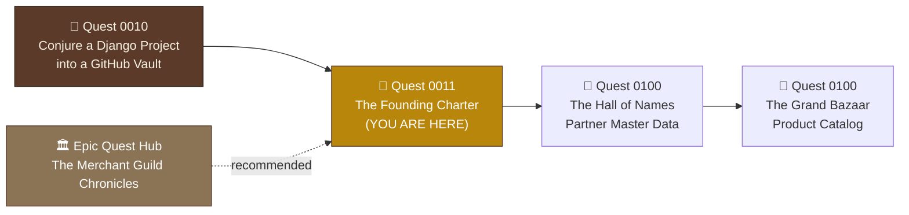

*The wax is warm, the seal is heavy in your hand. Before you stands the ruin of a once-great merchant guild — its records scattered, its coffers uncounted, its name unregistered in any ledger that matters. Tonight, as the newly appointed Systems Archmage, you will inscribe the Founding Charter: a single Company record, kept in a citadel whose secret keys never touch the public chronicle. Every enterprise system in the real world begins exactly here — with configuration that survives deployment and a data model that survives growth. Sign carelessly, and every chapter that follows inherits the flaw.*

## 📖 The Legend Behind This Quest

Every ERP — SAP, Odoo, NetSuite — rests on two unglamorous foundations: **configuration discipline** and a **company master record**. Configuration discipline means secrets (signing keys, debug flags, allowed hosts) live in the *environment*, not in committed source code — the famous [12-factor config principle](https://12factor.net/config). The company record is the anchor every invoice, warehouse, and journal entry will eventually reference.

In this opening chapter of *The Merchant Guild Chronicles* you build both, in **your own repository**. You wire environment-driven settings and forge your own private `.env` with a freshly generated secret key. Then you create **two** Django apps — `core`, home of the abstract `TimestampMixin` that every model in all twelve chapters will inherit, and `company`, home of the `Company` charter itself, the guild's public face, and a JSON `/health/` heartbeat. You brand the admin citadel, and — because the guild's chronicle never lies — prove the whole thing with nine automated tests before sealing it with the git tag `v0.1.0-founding-charter`.

**Why two apps and not one?** Because the split is the lesson. `core` holds *infrastructure* — things with no business meaning that everything else depends on. `company` holds *business data* — a record an accountant would recognize. Fusing them feels convenient today and becomes a knot by Chapter 09, when the ledger needs `core` but has no business knowing about company branding. Real ERPs draw this line on day one, and so will you.

Real-world translation: by the end you will have practiced the exact skills used to bootstrap any production Django service — environment-driven settings, app boundaries, model design, migrations, URL routing, template inheritance, admin customization, and test-first verification.

## 🗺️ Your Quest Network Position



You arrive here from **Conjure a Django Project into a GitHub Vault** (`/quests/0010/django-and-git/`), which left you with a running Django project, a virtual environment, and a GitHub remote. This quest transforms that empty scaffold into a living guild. Completing it unlocks **The Hall of Names**, where the guild begins recording its trading partners.

## 🎯 Quest Objectives

By the end of this quest, you will have achieved:

### Primary Objectives (Required for Completion)

- [ ] **Complete settings hygiene** — create a git-ignored `.env` with a freshly generated `SECRET_KEY`, and explain how `django-environ` feeds `SECRET_KEY`, `DEBUG`, and `ALLOWED_HOSTS`
- [ ] **Forge the two foundation apps** — `startapp core` and `startapp company`, register both in `INSTALLED_APPS`, add `APP_VERSION`, and migrate `TimestampMixin` + `Company`
- [ ] **Raise the guild's public face** — a `home` view rendering the company charter and a `/health/` JSON heartbeat, routed through a namespaced `company/urls.py`
- [ ] **Brand the inner sanctum** — register `CompanyAdmin`, rebrand the admin site, and inscribe the first Company record
- [ ] **Prove it with sorcery** — all 9 tests pass, `manage.py check` is clean, and curl confirms both endpoints live

### Secondary Objectives (Enhance Your Learning)

- [ ] **Read every line** of your annotated settings env block and articulate why the dev fallback key is safe locally but forbidden in production
- [ ] **Inspect the generated migration** (`company/migrations/0001_initial.py`) and find where the abstract model's fields landed
- [ ] **Open the reference citadel** and compare your `core/models.py` against `djangoerp`'s — note what it holds that yours does not yet

### Mastery Indicators (Prove Your Skills)

- [ ] You can explain why `TimestampMixin` has `abstract = True` and what would happen without it
- [ ] You can state the difference between `auto_now_add` and `auto_now` without looking it up
- [ ] You can argue why `Company` belongs in its own app rather than in `core`
- [ ] You can describe the exact JSON contract of `/health/` and why CI pipelines love such endpoints

## 🗺️ Quest Prerequisites

### 📋 Knowledge Requirements

- [ ] Python basics: classes, functions, imports, dictionaries
- [ ] Completed `/quests/0010/django-and-git/` — you have your own Django repo cloned with a virtual environment
- [ ] Comfort running terminal commands and committing with git

### 🛠️ System Requirements

- [ ] Python 3.12+ (`python --version` or `python3 --version`) — Django 6 dropped 3.11
- [ ] Git installed and authenticated with GitHub
- [ ] A code editor (VS Code recommended)
- [ ] Your repo's virtual environment activated (see the platform gate below)

### 🧠 Skill Level Indicators

- [ ] 🟢 You are new to Django models, admin, and testing — perfect, this quest introduces all three
- [ ] 🟢 You can run `python manage.py runserver` and reach `http://127.0.0.1:8000/`

## 🌍 Choose Your Adventure Platform

All spells in this quest are terminal incantations plus file edits. The only rune that differs between realms is how you awaken the virtual environment.

### 🍎 macOS Path

```bash
cd ~/github/guilderp        # your own guild repository
source .venv/bin/activate   # awaken the environment
python --version            # expect Python 3.12+
```

macOS ships an ancient system Python — always confirm your venv's interpreter answers, not `/usr/bin/python3`.

### 🪟 Windows Path

```powershell
cd $HOME\github\guilderp
.venv\Scripts\Activate.ps1    # PowerShell
# or, in cmd.exe:  .venv\Scripts\activate.bat
python --version
```

If PowerShell refuses to run the activation script, grant it passage once: `Set-ExecutionPolicy -ExecutionPolicy RemoteSigned -Scope CurrentUser`.

### 🐧 Linux Path

```bash
cd ~/github/guilderp
source .venv/bin/activate
python3 --version    # on many distros the binary is python3
```

On Debian/Ubuntu, if venv creation ever fails you need `sudo apt install python3.12-venv`.

From here on, every command assumes the venv is active (your prompt shows `(.venv)`) and your working directory is the repo root.

## 🏯 Your Forge and the Reference Citadel

Two repositories matter in this campaign, and confusing them will cost you an hour.

**Your forge** is the repository you built in the prerequisite quest. Everything you *write* goes here. This chapter calls it `guilderp` and calls the Django project package inside it `guilderp` too — if you named yours something else, substitute freely; only be consistent.

**The reference citadel** is [github.com/bamr87/djangoerp](https://github.com/bamr87/djangoerp) — a complete, working Django 6.1 ERP with a double-entry ledger, a stock ledger, purchasing, sales, manufacturing, and MRP planning. You never write to it. You *read* it when a design decision seems arbitrary, because seeing how a choice actually played out across fourteen apps is worth more than any explanation prose can give.

Raise it beside your work now — it takes two minutes and you will use it in every chapter:

```bash
cd ~/github
git clone https://github.com/bamr87/djangoerp.git
cd djangoerp
python3.12 -m venv .venv && source .venv/bin/activate
pip install -r requirements.txt
cp .env.example .env
python manage.py migrate
python manage.py demo_erp     # watch the whole ERP loop balance to the cent
```

That last command is your destination: a sales order planned by MRP, bought, manufactured, shipped, invoiced, collected — and three financial statements that agree. Twelve chapters from now, you will have built your own.

Then return to your forge for the rest of this chapter:

```bash
cd ~/github/guilderp
source .venv/bin/activate
```

> **🏯 Consult the Citadel** boxes appear throughout this quest. Each one points at a real file in the reference so you can see the finished form of what you just built. Reading them is optional and strongly recommended.

## 🧙‍♂️ Chapter 1: Carve the Founding Runes (Settings Hygiene)

First, install the rune-reader:

```bash
python -m pip install django-environ
python -m pip freeze > requirements.txt
```

Now open `guilderp/settings.py` and rewrite the top of the file. This is the **12-factor pattern**: configuration lives in the environment, code merely *reads* it.

```python
from pathlib import Path

import environ

# Build paths inside the project like this: BASE_DIR / 'subdir'.
BASE_DIR = Path(__file__).resolve().parent.parent

# Environment-driven configuration (12-factor). Values come from real
# environment variables or an optional .env file at the repo root —
# see .env.example for the available knobs.
env = environ.Env()
_env_file = BASE_DIR / '.env'
if _env_file.exists():
    environ.Env.read_env(_env_file)

# SECURITY WARNING: keep the secret key used in production secret!
# The insecure default keeps local development friction-free; production
# deployments MUST set SECRET_KEY in the environment.
# `or` guards against an empty SECRET_KEY= line overriding the fallback.
SECRET_KEY = env.str('SECRET_KEY', default='') or (
    'django-insecure-dev-only-key-do-not-use-in-production'
)

# SECURITY WARNING: don't run with debug turned on in production!
DEBUG = env.bool('DEBUG', default=True)

ALLOWED_HOSTS = env.list('ALLOWED_HOSTS', default=['localhost', '127.0.0.1', '[::1]'])
```

Decode the runes line by line:

- **`environ.Env()`** creates a reader object from the [django-environ](https://django-environ.readthedocs.io/) library. It knows how to *cast* raw environment strings into Python types.
- **`if _env_file.exists(): read_env(...)`** loads an optional `.env` file at the repo root into the process environment. The existence guard matters: skipping `read_env` when there is no file keeps fresh clones warning-free — real environment variables (as set by a hosting platform or CI) always work too.
- **`env.str('SECRET_KEY', default='') or (...)`** reads the signing key Django uses for sessions, CSRF tokens, and password-reset links. Note the two-layer guard: django-environ's `default` only applies when the variable is *absent* — a present-but-empty `SECRET_KEY=` line would yield an empty string and crash Django with `ImproperlyConfigured`. The trailing `or` catches that trap. The fallback is a deliberately ugly, obviously-insecure value: local development stays friction-free (a fresh clone runs with zero setup), while production deployments **must** override it — anyone who knows your SECRET_KEY can forge session cookies.
- **`env.bool('DEBUG', default=True)`** casts the string `"True"`/`"False"` into a real boolean. `DEBUG=True` gives you rich error pages and auto-reload; in production it would leak your settings to attackers.
- **`env.list('ALLOWED_HOSTS', ...)`** splits a comma-separated string into a Python list of hostnames Django will agree to serve. The default includes `[::1]` — IPv6's loopback — so machines that resolve `localhost` to `::1` still reach the dev server.

### Forge Your Personal .env

Write the documentation file first — it is committed, and it is how every future teammate learns the shape of your configuration:

```bash
cat > .env.example <<'EOF'
# Copy to .env and adjust. Every variable has a safe development default,
# so a fresh clone runs without any .env at all.

# Cryptographic signing key — REQUIRED in production, dev fallback otherwise.
# Generate one: python -c "from django.core.management.utils import get_random_secret_key; print(get_random_secret_key())"
# Uncomment and paste your key (leaving it empty would override the dev fallback):
# SECRET_KEY=paste-your-generated-key-here

# True enables debug pages and auto-reload. Never True in production.
DEBUG=True

# Comma-separated hostnames this site may serve (no spaces after commas).
ALLOWED_HOSTS=localhost,127.0.0.1,[::1]
EOF

cp .env.example .env

# Generate a cryptographically strong key with Django's own utility
python -c "from django.core.management.utils import get_random_secret_key; print(get_random_secret_key())"
```

Open `.env`, find the commented `# SECRET_KEY=` line, and replace it with your generated key — uncommented. It should look like this (your key will differ — never copy someone else's):

```bash
# Cryptographic signing key — REQUIRED in production, dev fallback otherwise.
SECRET_KEY=q3x8mw7zp2v9k4rt6y1u5i0oa-bcdefghjklmnpqrstuv

# True enables debug pages and auto-reload. Never True in production.
DEBUG=True

# Comma-separated hostnames this site may serve (no spaces after commas).
ALLOWED_HOSTS=localhost,127.0.0.1,[::1]
```

(The example file ships that key line commented out on purpose: an *empty* `SECRET_KEY=` would override the dev fallback with an empty string and crash every request — the exact trap the `or` guard in `settings.py` defends against.)

Now the critical verification — the secret must **never** enter the public chronicle. Confirm `.env` is listed in `.gitignore`, then ask git directly:

```bash
git check-ignore .env
# Output: .env        <- git confirms the file is ignored; silence would mean DANGER

git status
# .env must NOT appear under untracked files
```

If `git check-ignore` prints nothing, stop and add `.env` to `.gitignore` before proceeding — committing a secret key is the one mistake git history never forgets.

Finally, confirm the citadel still stands:

```bash
python manage.py check
# System check identified no issues (0 silenced).
```

> **🏯 Consult the Citadel** — the reference splits its settings into `djangoerp/settings/base.py`, `dev.py`, and `prod.py`, selected by whether `DJANGO_SETTINGS_MODULE` ends in `.prod`. That split earns its keep once you have production hardening to isolate, which is Chapter 12's work. One file is right for today; know where it goes.

### 🔍 Knowledge Check: Founding Runes

- [ ] Why is it safe for `SECRET_KEY` to have a hardcoded default, but only because of *what that default is*?
- [ ] What happens if `.env` does not exist — and why does `settings.py` check `.exists()` before calling `read_env`?
- [ ] Why does a present-but-empty `SECRET_KEY=` line need the `or` guard, when a *missing* variable doesn't?
- [ ] Which command proves a file is git-ignored without trusting your own reading of `.gitignore`?

**⚡ Quick Win:** Run `python -c "import django, os; os.environ.setdefault('DJANGO_SETTINGS_MODULE','guilderp.settings'); django.setup(); from django.conf import settings; print(settings.DEBUG, len(settings.SECRET_KEY))"` — you just proved your `.env` is being read: `DEBUG` is `True` and your key length is printed without revealing the key itself.

## 🧙‍♂️ Chapter 2: Forge the Foundations (Two Apps, Two Responsibilities)

A Django **project** (`guilderp/`) is the citadel; **apps** are its guild halls, each with one responsibility. You need two.

```bash
python manage.py startapp core
python manage.py startapp company
```

Register both halls in `guilderp/settings.py` — your own apps go after Django's contrib apps — and add the version constant the health endpoint will surface:

```python
INSTALLED_APPS = [
    'django.contrib.admin',
    'django.contrib.auth',
    'django.contrib.contenttypes',
    'django.contrib.sessions',
    'django.contrib.messages',
    'django.contrib.staticfiles',
    # Guild apps
    'core',
    'company',
]

# Surfaced by the /health/ endpoint; bump alongside each chapter's git tag.
APP_VERSION = '0.1.0'
```

### The Ancestral Base (core)

`core` is the shared platform. It holds things with **no business meaning** that everything else depends on. Today that is exactly one class. Replace `core/models.py`:

```python
from django.db import models


class TimestampMixin(models.Model):
    """Abstract base for every model in the guild.

    Provides audit timestamps so any record can answer "when were you
    forged, and when last altered?" — inherit this instead of
    models.Model throughout the campaign.
    """

    created_at = models.DateTimeField(auto_now_add=True)
    updated_at = models.DateTimeField(auto_now=True)

    class Meta:
        abstract = True
```

That is the whole app, for now. It feels absurdly small. By Chapter 09 it will also hold atomic document numbering and the audit-trail writer, and every one of those additions will land without disturbing a single business model — which is the entire point of giving infrastructure its own address.

### The Charter (company)

`company` holds business data: the record an accountant would recognize. Replace `company/models.py`:

```python
from django.db import models

from core.models import TimestampMixin


class Company(TimestampMixin):
    """The guild's founding charter: who we are and what coin we count in."""

    name = models.CharField(max_length=200)
    legal_name = models.CharField(max_length=200, blank=True)
    currency_code = models.CharField(
        max_length=3,
        default='USD',
        help_text='ISO 4217 code the books are kept in.',
    )
    email = models.EmailField(blank=True)
    founded_on = models.DateField(null=True, blank=True)
    is_active = models.BooleanField(default=True)

    class Meta:
        ordering = ['name']
        verbose_name_plural = 'companies'

    def __str__(self):
        return self.name
```

Field-by-field commentary — this is the vocabulary of every model you will ever write:

| Rune | Real meaning |
|---|---|
| `abstract = True` | `TimestampMixin` gets **no database table of its own**. Its fields are copied into every child's table. Remove it and Django would create a useless `core_timestampmixin` table plus multi-table inheritance JOINs. |
| `auto_now_add=True` | Set **once**, at row creation — "when were you forged?" |
| `auto_now=True` | Refreshed on **every save** — "when last altered?" |
| `CharField(max_length=200)` | Bounded text; `max_length` is required and becomes a database constraint. |
| `blank=True` | *Validation-level* optionality — forms and the admin may leave it empty. For text fields Django stores `''`, not NULL. |
| `null=True, blank=True` on `founded_on` | Dates have no natural "empty string," so non-text optional fields need *both*: `null` for the database, `blank` for forms. |
| `default='USD'` | The guild counts in dollars until told otherwise — defaults live in one place, the model. |
| `EmailField` | A `CharField` with built-in email validation. |
| `ordering = ['name']` | Every queryset comes back sorted. Unordered querysets are the trap every ERP developer falls into exactly once. |
| `verbose_name_plural = 'companies'` | Without it the admin would proudly display "Companys". |
| `__str__` | How the record introduces itself everywhere — admin lists, shell, logs. |

Note what `Company` does **not** declare: `created_at` and `updated_at` arrive by inheritance, across an app boundary. All eleven future chapters — partners, products, warehouses, orders, journal entries — will inherit that same base. That is the no-rewrite guarantee, established on day one.

### Carve the Schema

Models are intentions; **migrations** make them stone:

```bash
python manage.py makemigrations
# Migrations for 'company':
#   company/migrations/0001_initial.py
#     + Create model Company

python manage.py migrate
# Applying company.0001_initial... OK
```

Note that `core` produced **no migration at all** — an app whose only model is abstract has no schema to carve. Open `company/migrations/0001_initial.py` and observe the mirror image: the migration creates only `Company`, but its field list *includes* `created_at` and `updated_at`. The abstract parent's fields were folded in, exactly as promised.

> **🏯 Consult the Citadel** — open `core/models.py` and `company/models.py` in the reference. `TimestampMixin` is character-for-character what you just wrote; `Company` carries a few more fields (phone, address, tax ID, a `created_by` owner) and `DocumentSequence` sits beside the mixin in `core`. You are looking at this same chapter, three chapters of growth later.

### 🔍 Knowledge Check: Forge the Foundations

- [ ] Why does `makemigrations` create no migration for the `core` app?
- [ ] If you save an existing `Company` twice, which timestamp changes and which does not?
- [ ] Why does `founded_on` need `null=True` when `legal_name` gets by with only `blank=True`?
- [ ] What would break if you moved `Company` into `core` and deleted the `company` app?

**⚡ Quick Win:** Open the divination shell — `python manage.py shell` — and run `from company.models import Company; Company.objects.count()`. A confident `0` means your table exists and the ORM can speak to it.

## 🧙‍♂️ Chapter 3: The Guild's Public Face (Views, URLs & Templates)

The guild needs a hall visitors can enter and a heartbeat machines can consult. Two function-based views in `company/views.py`:

```python
from django.conf import settings
from django.http import JsonResponse
from django.shortcuts import render

from .models import Company


def home(request):
    """The guild hall: shows the founding charter once one is inscribed."""
    company = Company.objects.filter(is_active=True).first()
    return render(request, 'company/home.html', {'company': company})


def health(request):
    """Heartbeat sigil for CI smoke tests and deployment healthchecks."""
    return JsonResponse({
        'status': 'ok',
        'app': 'guilderp',
        'version': settings.APP_VERSION,
        'debug': settings.DEBUG,
    })
```

- `.filter(is_active=True).first()` returns the first active row **or `None`** — no crash on an empty guild; the template handles both fates. Filtering rather than taking any row means a dissolved company never haunts your homepage.
- `JsonResponse` serializes a dict to JSON with the correct `Content-Type: application/json`. This tiny endpoint is a load-bearing artifact: Chapter 04's CI watchtower will curl it as a smoke test, and Chapter 12's Docker healthcheck will poll it. `version` comes from the `APP_VERSION` you added; `debug` lets any environment confess whether it is running in debug mode.

### Namespaced Roads

Create `company/urls.py` — each app owns its own road map:

```python
from django.urls import path

from . import views

app_name = 'company'

urlpatterns = [
    path('', views.home, name='home'),
    path('health/', views.health, name='health'),
]
```

`app_name = 'company'` creates a **namespace**: templates and tests refer to routes as `company:home` and `company:health`, so URLs can be restructured later without breaking a single reference.

Mount the app's roads at the citadel gate in `guilderp/urls.py`:

```python
from django.contrib import admin
from django.urls import include, path

urlpatterns = [
    path('admin/', admin.site.urls),
    path('', include('company.urls')),
]
```

`include('company.urls')` at prefix `''` means `company:home` answers at `/` and `company:health` at `/health/`.

> **🏯 Consult the Citadel** — the reference has *two* URLconfs in this app: `company/urls.py` is a Django REST Framework router mounted at `/api/company/`, and `company/urls_web.py` holds exactly the two routes you just wrote. That split arrives naturally in Chapter 08 when the API gatehouse opens. One file is right for today.

### The Parchment Halls

Because `APP_DIRS` is `True` in settings, Django automatically finds templates inside each app at `<app>/templates/`. The double-folder convention `company/templates/company/` prevents name collisions between apps. Create `company/templates/company/base.html` — the layout every guild page inherits (self-contained inline styling; no CDN — proper static-file handling arrives with the production hardening in Chapter 12):


```html
<!DOCTYPE html>
<html lang="en">
<head>
    <meta charset="utf-8">
    <meta name="viewport" content="width=device-width, initial-scale=1">
    <title>The Merchant Guild · GuildERP</title>
    <style>
        :root {
            --ink: #2b2118;
            --parchment: #f7f1e3;
            --gold: #b8860b;
            --accent: #5b3a29;
        }
        * { box-sizing: border-box; }
        body {
            margin: 0;
            font-family: Georgia, 'Times New Roman', serif;
            background: var(--parchment);
            color: var(--ink);
        }
        header {
            background: var(--accent);
            color: var(--parchment);
            padding: 1rem 2rem;
            display: flex;
            align-items: baseline;
            gap: 2rem;
        }
        header h1 { margin: 0; font-size: 1.4rem; }
        header nav a {
            color: var(--parchment);
            margin-right: 1.25rem;
            text-decoration: none;
        }
        header nav a:hover { color: var(--gold); }
        main { max-width: 60rem; margin: 2rem auto; padding: 0 2rem; }
        footer {
            text-align: center;
            padding: 2rem;
            color: var(--accent);
            font-style: italic;
        }
        .badge {
            display: inline-block;
            background: var(--gold);
            color: var(--parchment);
            border-radius: 0.5rem;
            padding: 0.1rem 0.6rem;
            font-size: 0.85rem;
        }
    </style>
</head>
<body>
    <header>
        <h1>🏛️ GuildERP</h1>
        <nav>
            <a href="">Guild Hall</a>
            <a href="">Admin</a>
        </nav>
    </header>
    <main>
        
    </main>
    <footer>Forged with Django · The Merchant Guild Chronicles</footer>
</body>
</html>
```


Now `company/templates/company/home.html`, which **extends** the base and handles both an inscribed charter and an empty hall:


```html


Guild Hall


    
        <h2>⚜️ {{ company.name }}</h2>
        <p>
            Books kept in <span class="badge">{{ company.currency_code }}</span>
            · charter signed {{ company.founded_on }}
        </p>
        <p>Registered as <em>{{ company.legal_name }}</em>.</p>
        <p>The guild hall stands. The chronicles of trade begin here.</p>
    
        <h2>🏰 An Empty Guild Hall</h2>
        <p>
            No charter signed yet — inscribe your Company in the
            <a href="">guild admin</a> to found the guild.
        </p>
    
    <p><a href="">Consult the heartbeat sigil</a> (health check JSON).</p>

```


Boot the citadel and see it stand:

```bash
python manage.py runserver
# Visit http://127.0.0.1:8000/ and http://127.0.0.1:8000/health/
```

### 🔍 Knowledge Check: The Public Face

- [ ] What does `app_name = 'company'` buy you when a URL path changes later?
- [ ] Why the double folder `company/templates/company/` instead of just `company/templates/`?
- [ ] Which two future chapters will consume `/health/`, and why do machines prefer JSON heartbeats over HTML pages?
- [ ] Why does `home` filter on `is_active` instead of simply taking the first row?

**⚡ Quick Win:** With runserver still burning, open `/health/` in your browser. That four-key JSON document is a *contract* — you will write a test in Chapter 5 that locks it forever.

## 🧙‍♂️ Chapter 4: Brand the Inner Sanctum (Admin & the First Charter)

Django's admin is a free, production-grade back office — but unbranded it announces "Django administration" to the world. Claim it for the guild in `company/admin.py`:

```python
from django.contrib import admin

from .models import Company

admin.site.site_header = 'GuildERP Administration'
admin.site.site_title = 'GuildERP'
admin.site.index_title = 'The Guild Ledgers'


@admin.register(Company)
class CompanyAdmin(admin.ModelAdmin):
    list_display = ['name', 'currency_code', 'email', 'founded_on', 'is_active']
    list_filter = ['is_active', 'currency_code']
    search_fields = ['name', 'legal_name']
```

- The three `admin.site.*` assignments rebrand the login page header, the browser tab title, and the dashboard heading respectively.
- `@admin.register(Company)` is the decorator form of `admin.site.register(Company, CompanyAdmin)` — one less line, impossible to forget the pairing.
- `list_display` chooses the columns of the changelist table.
- `list_filter` adds the right-hand filter sidebar — the fastest way to make a growing table navigable.
- `search_fields` conjures a search box that scans both the common and legal names.

### Inscribe the First Charter

Forge your archmage credentials, then sign the charter:

```bash
python manage.py createsuperuser
# Username: archmage        (choose your own)
# Email:    you@example.com
# Password: ********        (8+ chars, not too common)
```

With runserver burning, enter `http://127.0.0.1:8000/admin/` — behold **GuildERP Administration** — then under **Companies** click **Add company**:

- **Name:** `The Merchant Guild of Djangor`
- **Currency code:** leave as `USD` (the default doing its job)
- **Founded on:** pick any auspicious date

Save, then return to `http://127.0.0.1:8000/`. The empty hall is gone; your charter hangs on the wall with its currency badge. The query in the home view found its row.

### 🔍 Knowledge Check: The Inner Sanctum

- [ ] Where does the string in `admin.site.site_header` actually appear?
- [ ] Which model fields does the changelist search box scan, and where is that configured?
- [ ] Why did `created_at` fill itself in without you touching it?

**⚡ Quick Win:** In the admin changelist, type `Djangor` into the search box — your charter appears because `search_fields` covers `name`. Search for its legal name too, even though that column isn't displayed.

## 🧙‍♂️ Chapter 5: Prove It With Sorcery (Tests & the Sealing Ritual)

In this campaign, *"it works on my cauldron"* is never the done-condition — **green tests are**. Two test files, because you built two apps.

First, `core/tests.py` — one proof that the mixin is truly abstract:

```python
from django.apps import apps
from django.test import TestCase

from core.models import TimestampMixin


class TimestampMixinTests(TestCase):
    def test_mixin_is_abstract_and_has_no_table(self):
        self.assertTrue(TimestampMixin._meta.abstract)
        self.assertNotIn('timestampmixin', [m._meta.model_name for m in apps.get_models()])
```

Then `company/tests.py` — the eight proofs of the charter:

```python
from django.conf import settings
from django.contrib import admin
from django.test import TestCase
from django.urls import reverse

from .models import Company


class HealthEndpointTests(TestCase):
    def test_health_returns_200_and_json_contract(self):
        response = self.client.get(reverse('company:health'))
        self.assertEqual(response.status_code, 200)
        payload = response.json()
        self.assertEqual(sorted(payload), ['app', 'debug', 'status', 'version'])
        self.assertEqual(payload['status'], 'ok')
        self.assertEqual(payload['app'], 'guilderp')
        self.assertEqual(payload['version'], settings.APP_VERSION)


class HomeViewTests(TestCase):
    def test_home_url_reverses_to_root(self):
        self.assertEqual(reverse('company:home'), '/')

    def test_home_renders_without_company(self):
        response = self.client.get(reverse('company:home'))
        self.assertEqual(response.status_code, 200)
        self.assertTemplateUsed(response, 'company/home.html')
        self.assertContains(response, 'An Empty Guild Hall')

    def test_home_shows_company_name(self):
        Company.objects.create(name='The Merchant Guild of Djangor')
        response = self.client.get(reverse('company:home'))
        self.assertContains(response, 'The Merchant Guild of Djangor')

    def test_home_ignores_inactive_companies(self):
        Company.objects.create(name='Dissolved Guild', is_active=False)
        response = self.client.get(reverse('company:home'))
        self.assertContains(response, 'An Empty Guild Hall')


class CompanyModelTests(TestCase):
    def test_str_returns_name(self):
        company = Company(name='The Merchant Guild of Djangor')
        self.assertEqual(str(company), 'The Merchant Guild of Djangor')

    def test_timestamps_auto_set(self):
        company = Company.objects.create(name='Timestamped Guild')
        self.assertIsNotNone(company.created_at)
        self.assertIsNotNone(company.updated_at)

    def test_default_currency_is_usd(self):
        company = Company.objects.create(name='Dollar Guild')
        self.assertEqual(company.currency_code, 'USD')


class AdminRegistrationTests(TestCase):
    def test_company_registered_in_admin(self):
        self.assertTrue(admin.site.is_registered(Company))
```

What each proof establishes:

1. **`test_mixin_is_abstract_and_has_no_table`** — the ancestral base stays ancestral. If someone later deletes `abstract = True`, Django would silently create a `core_timestampmixin` table and every child would gain a JOIN; this test fails loudly instead.
2. **`test_health_returns_200_and_json_contract`** — locks the `/health/` contract: exactly the four keys `app/debug/status/version` (the `sorted(payload)` trick catches keys *added* as well as removed), with `status == 'ok'`, `app == 'guilderp'`, and `version` mirroring `settings.APP_VERSION` — compared against the *setting*, not a hardcoded string, so future chapters can bump the version without touching this test. When Chapter 04's CI and Chapter 12's Docker healthcheck consume this endpoint, this test guarantees they can trust it.
3. **`test_home_url_reverses_to_root`** — the namespaced name `company:home` resolves to `/`; routing plumbing is wired.
4. **`test_home_renders_without_company`** — an empty guild returns 200 (not a crash), uses the right template, and shows the call-to-action. This proves a `None` company is handled.
5. **`test_home_shows_company_name`** — once a charter exists, its name appears in the rendered HTML. Note each `TestCase` runs against a **fresh throwaway database**, so this test creates its own Company — your dev data is never touched, never trusted.
6. **`test_home_ignores_inactive_companies`** — the `is_active` filter is real, not decorative. A dissolved guild does not haunt the hall.
7. **`test_str_returns_name`** — the record introduces itself properly (unsaved instance — `__str__` needs no database).
8. **`test_timestamps_auto_set`** — the inherited abstract fields actually work *across an app boundary*: both timestamps are populated on create.
9. **`test_company_registered_in_admin`** — `admin.site.is_registered(Company)` (the admin's public registration check — never poke the private `_registry` dict) confirms the model is wired in, so the admin work from Chapter 4 can't silently regress.

Cast the proving spell, then the two smoke checks:

```bash
python manage.py test
# Found 9 test(s).
# Creating test database for alias 'default'...
# .........
# ----------------------------------------------------------------------
# Ran 9 tests in 0.0XXs
#
# OK
# Destroying test database for alias 'default'...

python manage.py check
# System check identified no issues (0 silenced).
```

And with `runserver` in another terminal, prove the living endpoints with curl (Windows PowerShell users: `curl.exe` to bypass the PowerShell alias):

```bash
curl -s http://127.0.0.1:8000/health/
# {"status": "ok", "app": "guilderp", "version": "0.1.0", "debug": true}

curl -s http://127.0.0.1:8000/ | grep -o 'The Merchant Guild of Djangor'
# The Merchant Guild of Djangor
```

> **🏯 Consult the Citadel** — the reference's `company/tests.py` runs eleven tests, adding API-level proofs (authentication required, `created_by` set server-side, currency validation) that arrive in your build once Chapter 08 opens the gatehouse. Same skeleton, three chapters of muscle.

### 🪶 The Sealing Ritual

Every chapter of the Chronicles ends the same way: tests green, commit inscribed, milestone tagged. **Your** repository's tag list becomes **your** adventurer's chronicle — any chapter can be replayed by checking out the previous tag.

```bash
git add -A
git status                 # verify .env is NOT staged — the charter's secrets stay home
git commit -m "ch01: founding charter — core and company apps, health sigil"
git tag v0.1.0-founding-charter
git push origin main --tags
```

### 🔍 Knowledge Check: Sorcery of Proof

- [ ] Why does `test_home_renders_without_company` pass even though *your* database contains a Company?
- [ ] What regression would `sorted(payload) == ['app', 'debug', 'status', 'version']` catch that checking four keys individually would miss?
- [ ] Why is the git tag part of the done-condition and not just the passing tests?

**⚡ Quick Win:** Run `git tag` — the single line `v0.1.0-founding-charter` is the first entry in a chronicle that will end, eleven chapters from now, at `v1.0.0`.

## 🎮 Mastery Challenges

Optional trials for adventurers who wish to test the foundations before moving on.

### 🟢 Novice Challenge: The Guild Motto

Add a `motto = models.CharField(max_length=255, blank=True)` field to `Company`. Run `makemigrations` (observe it creates `0002_company_motto.py` — schema evolution, not rewrite), `migrate`, add the motto in the admin, and display it in `home.html` when present. **Success:** a second migration file exists, tests still pass, and your motto graces the guild hall.

### 🟡 Intermediate Challenge: The Versioned Heartbeat

Make the `health` view attach a response header: `response['X-Guild-Version'] = settings.APP_VERSION` before returning. Then extend `HealthEndpointTests` with a new test asserting `response.headers['X-Guild-Version'] == settings.APP_VERSION`. **Success:** 10 tests green, and `curl -si http://127.0.0.1:8000/health/` shows the header. (Real-world anchor: version headers let load balancers and canary deploys identify which build answered.)

### 🔴 Advanced Challenge: The Sequence Keeper

Read `core/models.py` in the reference citadel and study `DocumentSequence` — the class that hands out `SO-00001`, `JE-00001`, and every other document number in the system, claiming each one under `select_for_update` inside a transaction. Then implement it yourself in *your* `core` app, with a test that calls `next_number('SO')` twice and asserts it returns `SO-00001` then `SO-00002`. **Success:** your `core` app now holds two pieces of infrastructure, you have read production concurrency code and reproduced it, and Chapter 06 will find its order numbering already waiting. (Ask yourself why the increment cannot simply be `COUNT(*) + 1`.)

## 🏆 Quest Rewards & Achievements

Completing this quest grants:

- **Badge:** 📜 **Charter Bearer** — founder of the guild's digital citadel
- **XP:** 50 progression points toward the campaign's 890-point Guildmaster total
- **Skills unlocked:** 12-factor settings hygiene · Django app anatomy and boundaries · abstract base models · migrations · function-based views & JsonResponse · namespaced URLconfs · template inheritance · admin branding · TestCase and the test client
- **Artifacts gained:** the `core` app (infrastructure home for all eleven remaining chapters), the `company` app and its charter, the `/health/` heartbeat (consumed by CI in Chapter 04 and Docker in Chapter 12), the `TimestampMixin` ancestor (inherited by every model in the campaign), and the tag `v0.1.0-founding-charter`
- **Title progression:** 🌱 Apprentice of the Guild — next stop, ⚔️ Adventurer

## 🔮 Next Adventures

Your charter is signed and sealed. The guild now needs to know *who it trades with*:

- **Next main quest:** [The Hall of Names — Partner Master Data & Admin Mastery](/quests/0100/django-merchant-guild-02-hall-of-names/) — forge the partner registry with role flags (customer/supplier), master the ModelAdmin arts, and build your first browsable list pages. Your `TimestampMixin` gets its first business heir.
- **Campaign hub:** [The Merchant Guild Chronicles — Epic Quest Hub](/quests/codex/django-merchant-guild/) — survey all twelve chapters of the road to Guildmaster.
- **Revisit the prerequisite:** [Conjure a Django Project into a GitHub Vault](/quests/0010/django-and-git/) — if any venv or git rune felt shaky today.
- **Read ahead in the citadel:** open `partners/models.py` in the reference to see where Chapter 02 lands — one table, two role flags, and two control accounts you will not understand until Chapter 09. That is fine. Look anyway.

## 📚 Resource Codex

Scrolls of deeper lore, from the official Django library and beyond:

- [Django settings — official topic guide](https://docs.djangoproject.com/en/stable/topics/settings/)
- [The Twelve-Factor App: Config](https://12factor.net/config)
- [django-environ documentation](https://django-environ.readthedocs.io/en/latest/)
- [Django models — official topic guide](https://docs.djangoproject.com/en/stable/topics/db/models/) (abstract base classes are under "Model inheritance")
- [Migrations — official topic guide](https://docs.djangoproject.com/en/stable/topics/migrations/)
- [Writing views & JsonResponse](https://docs.djangoproject.com/en/stable/ref/request-response/#jsonresponse-objects)
- [URL dispatcher & namespacing](https://docs.djangoproject.com/en/stable/topics/http/urls/#url-namespaces)
- [Template inheritance](https://docs.djangoproject.com/en/stable/ref/templates/language/#template-inheritance)
- [The Django admin site — ModelAdmin reference](https://docs.djangoproject.com/en/stable/ref/contrib/admin/)
- [Testing in Django — official topic guide](https://docs.djangoproject.com/en/stable/topics/testing/overview/)
- [Model field reference (auto_now, blank, null, default)](https://docs.djangoproject.com/en/stable/ref/models/fields/)
- [Reference citadel: github.com/bamr87/djangoerp](https://github.com/bamr87/djangoerp) — the finished ERP you audit your work against

## ✅ Quest Completion Checklist

Confirm every seal before declaring victory:

- [ ] `.env` exists with a freshly generated `SECRET_KEY`, and `git check-ignore .env` confirms it is ignored
- [ ] `settings.py` carries `'core'` and `'company'` in `INSTALLED_APPS` and `APP_VERSION = '0.1.0'`
- [ ] `core/models.py` defines the abstract `TimestampMixin` and produced **no** migration
- [ ] `company/models.py` defines `Company`, with `company/migrations/0001_initial.py` applied
- [ ] `http://127.0.0.1:8000/` renders the parchment guild hall showing your Company (or the call-to-action before it existed)
- [ ] `http://127.0.0.1:8000/health/` returns the exact four-key JSON contract with `"version": "0.1.0"`
- [ ] The admin at `/admin/` is branded **GuildERP Administration** and lists your Company with search working
- [ ] `python manage.py test` reports **Ran 9 tests ... OK** and `python manage.py check` reports no issues
- [ ] The reference citadel is cloned beside your forge and `python manage.py demo_erp` ran green at least once
- [ ] Commit pushed and tag `v0.1.0-founding-charter` visible on GitHub (`git ls-remote --tags origin`)

*The charter hangs in the guild hall. The heartbeat sigil pulses. The chronicle's first tag is struck. Rest tonight, Charter Bearer — tomorrow, the Hall of Names awaits its keeper.* 📜⚜️
