*In the crystalline halls of the Digital Nexus, where streams of code flow like rivers of starlight and AI spirits await human guidance, there exists a legendary discipline known to master developers as **Prompt Crystal Forging**. This ancient art transforms casual conversations with AI into precision instruments of creation—unlocking capabilities that casual users never dream possible.*

*You, brave Code Alchemist, stand at the threshold of VS Code's most powerful enchantment: **GitHub Copilot**. But like any great artifact, its power lies dormant without the proper incantations. Your quest: to master the art of prompt engineering within VS Code, learning to craft instructions that consistently unlock Copilot's full potential.*

*Whether you've been frustrated by inconsistent suggestions, struggled to get Copilot to understand your project's patterns, or simply want to 10x your AI-assisted productivity, this quest will transform your relationship with your AI pair programmer forever.*

### 🌟 The Legend Behind This Quest

In the early days of the AI coding renaissance, developers discovered a profound truth: **the quality of AI assistance directly mirrors the quality of human instruction**. A vague request produced mediocre output. A well-crafted prompt, however, could unlock remarkable capabilities—generating entire functions, debugging complex issues, and maintaining perfect consistency with project standards.

Prompt engineering emerged as both art and science—a systematic discipline for designing, refining, and optimizing inputs to large language models. The masters who learned this art found themselves wielding AI like a precision tool rather than a random oracle.

VS Code Copilot represents a new frontier: **context-aware AI assistance** that can understand your entire project, follow custom instructions, and generate code that actually fits your codebase. But unlocking this power requires more than luck—it requires mastery of the Prompt Crystal.

This quest teaches you to treat prompts as a form of programming in natural language—precise, structured, testable, and continuously improvable through the Kaizen philosophy.

---

## 🎯 Quest Objectives

By the time you complete this epic journey, you will have mastered:

### Primary Objectives (Required for Quest Completion)
- [ ] **🎯 Master the RCTF Pattern** - Understand and apply Role-Context-Task-Format structure for any prompt
- [ ] **⚡ Implement Prompting Techniques** - Apply zero-shot, few-shot, and Chain-of-Thought patterns effectively
- [ ] **🛠️ Configure Project Context** - Set up `.github/copilot-instructions.md` for persistent Copilot intelligence
- [ ] **🔗 Build Template Library** - Create reusable prompt templates in `.github/prompts/` with variables
- [ ] **📊 Apply PDCA Iteration** - Use the Plan-Do-Check-Act cycle to systematically improve prompt quality

### Secondary Objectives (Bonus Achievements)
- [ ] **🧙‍♂️ Workspace Agent Mastery** - Use `@workspace`, `#file`, and `#selection` references effectively
- [ ] **🏆 Prompt Scoring System** - Establish quality metrics and track improvement over time
- [ ] **🌐 Cross-Platform Templates** - Create prompts that work across macOS, Windows, and Linux
- [ ] **🤝 Team Standardization** - Design prompt patterns shareable with development teams

### Mastery Indicators
You'll know you've truly mastered this quest when you can:
- [ ] Transform any vague request into a structured, effective prompt in under 2 minutes
- [ ] Configure a new project's Copilot context from scratch
- [ ] Diagnose why a prompt isn't working and systematically improve it
- [ ] Teach others the RCTF pattern and PDCA cycle
- [ ] Maintain a growing library of tested, high-quality prompt templates

---

## 🗺️ Quest Network Position

```mermaid
graph TB
    subgraph "Prerequisites"
        Hello[🌱 Hello n00b]
        PromptBasics[🏰 Prompt Engineering Basics]
        Kaizen[⚔️ Kaizen Continuous Improvement]
    end
    
    subgraph "Current Quest"
        Main[🏰 VS Code Copilot<br/>Prompt Crystal Quest]
        Side1[⚔️ Workspace Configuration]
        Side2[⚔️ Template Library Building]
        Bonus[🎁 Team Prompt Standards]
    end
    
    subgraph "Unlocked Adventures"
        AgentDev[🏰 AI Agent Development]
        MCPPatterns[🏰 MCP Server Prompt Patterns]
        MultiAgent[👑 Multi-Agent Systems Epic]
    end
    
    Hello --> PromptBasics
    PromptBasics --> Main
    Kaizen -.-> Main
    Main --> Side1
    Main --> Side2
    Main --> Bonus
    Main --> AgentDev
    Side1 --> MCPPatterns
    Side2 --> MCPPatterns
    Bonus --> MultiAgent
    
    style Main fill:#ffd700,stroke:#333,stroke-width:3px
    style PromptBasics fill:#87ceeb
    style AgentDev fill:#98fb98
    style MCPPatterns fill:#98fb98
```



---

## 🌍 Choose Your Adventure Platform

*The Prompt Crystal's power transcends operating systems, but each kingdom has its own installation rituals. Choose the path that matches your realm.*

### 🍎 macOS Kingdom Path

```bash
# Install VS Code Copilot extensions via CLI
code --install-extension GitHub.copilot
code --install-extension GitHub.copilot-chat

# Verify installation
code --list-extensions | grep -i copilot

# Expected Output:
# GitHub.copilot
# GitHub.copilot-chat

# Create project prompt directory structure
mkdir -p .github/prompts
touch .github/copilot-instructions.md
```

*macOS adventurers enjoy native terminal integration. Use iTerm2 or Terminal.app for the most seamless experience.*

### 🪟 Windows Empire Path

```powershell
# Install VS Code Copilot extensions via CLI
code --install-extension GitHub.copilot
code --install-extension GitHub.copilot-chat

# Verify installation
code --list-extensions | Select-String "copilot"

# Expected Output:
# GitHub.copilot
# GitHub.copilot-chat

# Create project prompt directory structure
New-Item -ItemType Directory -Force -Path ".github\prompts"
New-Item -ItemType File -Force -Path ".github\copilot-instructions.md"
```

*Windows warriors can use PowerShell or Windows Terminal for optimal command-line experience.*

### 🐧 Linux Territory Path

```bash
# Install VS Code Copilot extensions via CLI
code --install-extension GitHub.copilot
code --install-extension GitHub.copilot-chat

# Verify installation
code --list-extensions | grep -i copilot

# Expected Output:
# GitHub.copilot
# GitHub.copilot-chat

# Create project prompt directory structure
mkdir -p .github/prompts
touch .github/copilot-instructions.md
```

*Linux scholars benefit from the full power of bash scripting for prompt automation.*

### ☁️ Cloud Realms Path (GitHub Codespaces / VS Code Web)

```bash
# Extensions are typically pre-installed in Codespaces
# Verify with:
code --list-extensions | grep -i copilot

# Or check in VS Code Web:
# Extensions sidebar → Search "GitHub Copilot" → Verify installed

# Create project prompt directory
mkdir -p .github/prompts
echo "# Project Copilot Instructions" > .github/copilot-instructions.md
```

*Cloud travelers enjoy consistent environments across devices.*

---

## 🧙‍♂️ Chapter 1: Understanding Prompt Crystal Fundamentals

*Your journey begins in the Foundry of Clear Communication, where the masters inscribed the first truth: **the difference between failure and mastery lies in the precision of instruction.***

### ⚔️ Skills You'll Forge in This Chapter
- Understanding what makes a prompt effective vs. ineffective
- Recognizing the relationship between prompt structure and output quality
- Applying the RCTF pattern foundation
- Identifying common prompt anti-patterns to avoid

### 🏗️ The Anatomy of a Prompt Crystal

**What is a Prompt?**

A prompt is the instruction you provide to an AI model. It combines context, task description, and output requirements—analogous to writing precise function specifications in code.

**Why Structure Matters**

The difference between vague and structured prompts is dramatic:

```
Vague ←─────────────────────────────────→ Precise
"Help me code"          "Generate a Python function that validates 
                         email addresses using regex, handles edge 
                         cases (empty, special chars), returns 
                         tuple(bool, str), includes docstring"
```

### 💻 Code Example: Unstructured vs. Structured Prompts

**❌ The Unforged Crystal (Vague Prompt)**:
```
Write a function to validate email
```

*Result: Inconsistent outputs, missing edge cases, wrong language assumptions*

**✅ The Master-Forged Crystal (RCTF Prompt)**:
```markdown
[ROLE] You are a senior Python developer specializing in input validation.

[CONTEXT] Building a user registration API that needs robust email validation.
The codebase uses Python 3.10+ with type hints throughout.

[TASK] Write a Python function that:
- Validates email format using regex
- Handles edge cases: empty string, missing @, invalid domain
- Returns tuple: (is_valid: bool, error_message: str | None)

[CONSTRAINTS]
- Python 3.10+ with type hints
- No external libraries (use re module)
- Include docstring with examples
- Maximum 25 lines

[FORMAT] Provide the function, then 3 test cases showing usage.
```

*Result: Consistent, production-ready code with exactly the structure you need*

### 🎭 The RCTF Pattern: Your Primary Spell

**RCTF** stands for **Role-Context-Task-Format**—the foundational pattern for effective prompts:

| Component | Purpose | Example |
|-----------|---------|---------|
| **Role** | Sets expertise and perspective | "You are a senior security engineer..." |
| **Context** | Provides situational awareness | "Working on a user auth API with..." |
| **Task** | Defines specific, actionable work | "Write a function that validates..." |
| **Format** | Specifies output structure | "Return as: explanation, then code, then tests" |

**Complete RCTF Template**:
```markdown
[ROLE]
You are a [specific expert with relevant experience].

[CONTEXT]
The user is working on [situation/project].
Current state: [what exists now]
Goal: [what we're trying to achieve]

[TASK]
Your task is to [specific, actionable request].

Requirements:
1. [Requirement 1]
2. [Requirement 2]
3. [Requirement 3]

[CONSTRAINTS]
- [Technical constraint]
- [Quality constraint]
- [Scope constraint]

[FORMAT]
Structure your response as:
1. [Section 1]
2. [Section 2]
3. [Section 3]
```

### 🔍 Knowledge Check: Prompt Fundamentals

Before proceeding to Chapter 2, ensure you can:
- [ ] Explain why clarity and specificity improve prompt effectiveness
- [ ] Identify the four components of the RCTF pattern
- [ ] Recognize at least 3 anti-patterns in vague prompts
- [ ] Transform a single vague prompt into RCTF format

### 🎮 Chapter 1 Challenge: Transform the Vague Request

**⏱️ Estimated Time**: 15 minutes

**Objective**: Practice converting unstructured requests into RCTF format

**The Vague Request**:
> "Make a script that organizes my files"

**Your Challenge**: Rewrite this using the complete RCTF pattern

**Success Criteria**:
- [ ] Role defined (what expertise is needed)
- [ ] Context provided (what's the situation)
- [ ] Task specified with 3+ specific requirements
- [ ] Constraints listed (language, limitations)
- [ ] Output format defined

**💡 Hint**: Consider asking yourself: What files? Organized how? What language? What folder structure?

**Bonus Points**:
- [ ] Include platform-specific considerations (macOS/Windows/Linux)
- [ ] Add error handling requirements
- [ ] Specify logging or feedback requirements

---

## 🧙‍♂️ Chapter 2: Core Prompting Techniques - Your Spell Arsenal

*You've learned the RCTF foundation. Now we forge the advanced spells—the prompting techniques that every master must command. Each technique is a tool in your arsenal, to be selected based on the challenge before you.*

### ⚔️ Skills You'll Forge in This Chapter
- Zero-shot, few-shot, and Chain-of-Thought techniques
- Technique selection based on task complexity
- Combining multiple techniques for optimal results
- Kaizen mindset for prompt iteration

### 📊 Technique Selection Guide

Choose your prompt technique based on task complexity:

| Technique | Best For | Complexity | When to Use |
|-----------|----------|------------|-------------|
| **Zero-Shot** | Simple, standard tasks | ⚡ Low | Common operations, clear requirements |
| **Few-Shot** | Pattern recognition, custom formats | ⚡⚡ Medium | Specific output formats, domain patterns |
| **Chain-of-Thought** | Multi-step reasoning, debugging | ⚡⚡⚡ High | Complex logic, architecture decisions |

### 🎯 Pattern 1: Zero-Shot Prompting

**The Direct Command**: Task is common, instructions are clear, no special format needed.

**Template**:
```
[CLEAR INSTRUCTION] + [CONTEXT] + [OUTPUT REQUIREMENT]
```

**Example Application**:
```markdown
You are analyzing customer reviews for sentiment.

Task: Classify the sentiment of this review as POSITIVE, NEGATIVE, or NEUTRAL.

Review: 'The movie was disappointing and boring.'

Output: Return only the classification label (POSITIVE/NEGATIVE/NEUTRAL).
```

**When to Use Zero-Shot**:
- Standard programming tasks (sorting, validation, formatting)
- Well-defined outputs with clear criteria
- Tasks similar to common training data

### 📚 Pattern 2: Few-Shot Prompting

**Learning by Example**: Provide examples to establish the pattern you want.

**Template**:
```markdown
[INSTRUCTION]

Example 1:
Input: [example input]
Output: [desired output]

Example 2:
Input: [example input]
Output: [desired output]

Example 3:
Input: [example input]
Output: [desired output]

Now apply to:
Input: [your input]
Output:
```

**Example - Function Name to Comment**:
```markdown
Convert function names to descriptive comments:

Example 1:
Input: getUserById
Output: // Retrieves a user record from the database using their unique identifier

Example 2:
Input: validateEmail
Output: // Validates that a string conforms to standard email address format

Example 3:
Input: calculateTotalPrice
Output: // Computes the total price including taxes and applicable discounts

Now convert:
Input: processPaymentQueue
Output:
```

**When to Use Few-Shot**:
- Custom output formats not seen in training
- Domain-specific patterns and terminology
- Consistent style across multiple outputs
- Complex transformations with subtle rules

**Optimization Tips**:
1. **Example Count**: Start with 3, test up to 5 (diminishing returns after)
2. **Example Diversity**: Cover simple, edge, and complex cases
3. **Example Quality**: Each example must be perfect—bad examples = bad learning
4. **Example Order**: Place most relevant example last (recency effect)

### 🧠 Pattern 3: Chain-of-Thought (CoT)

**Step-by-Step Reasoning**: Force the AI to think through complex problems systematically.

**Two Variants**:

**Zero-Shot CoT (Simplest)**:
```markdown
Problem: [Your complex problem]

Let's solve this step-by-step:
```

**Few-Shot CoT (More Accurate)**:
```markdown
Problem: [Example problem]
Let's think step by step:
Step 1: [reasoning]
Step 2: [reasoning]
Step 3: [reasoning]
Answer: [result]

Problem: [Your problem]
Let's think step by step:
```

**Example - Architecture Decision**:
```markdown
[ROLE] You are a DevOps engineer specializing in CI/CD pipelines.

[CONTEXT] Migrating a monorepo from Jenkins to GitHub Actions. 
The repo has 3 services: API (Node.js), Web (React), Worker (Python).

[TASK] Design the GitHub Actions workflow structure.

Think step-by-step:
1. First, analyze which jobs can run in parallel
2. Then, identify shared dependencies and caching opportunities
3. Next, design the job dependency graph
4. Finally, propose the workflow file structure

[FORMAT]
1. Analysis of parallelization opportunities
2. Mermaid diagram of job dependencies
3. YAML snippet for the main workflow
4. Caching strategy summary table
```

**When to Use Chain-of-Thought**:
- Multi-step logic problems requiring reasoning
- Debugging complex code issues
- Architecture and design decisions
- Code review with detailed analysis

### 🔄 Combining Techniques: The Master's Approach

**Few-Shot + CoT** for complex, pattern-based reasoning:
```markdown
Problem: Why is this SQL query slow?
Let's debug step-by-step:
Step 1: Check for full table scans → Found: No index on customer_id
Step 2: Analyze join efficiency → Found: Cartesian product risk
Step 3: Review aggregation → Found: Unnecessary DISTINCT
Solution: Add index, reorder joins, remove DISTINCT

Problem: [Your slow query]
Let's debug step-by-step:
```

### 🔍 Knowledge Check: Prompting Techniques

Before proceeding to Chapter 3, ensure you can:
- [ ] Explain when to use zero-shot vs. few-shot prompting
- [ ] Design a few-shot prompt with 3 quality examples
- [ ] Apply Chain-of-Thought to a complex reasoning task
- [ ] Combine techniques appropriately for a given problem

### 🎮 Chapter 2 Challenge: Apply the Right Technique

**⏱️ Estimated Time**: 20 minutes

**Scenario**: You need to refactor a 500-line function into smaller units.

**Your Challenge**:
1. Choose the most appropriate prompting technique (justify your choice)
2. Write the complete prompt using your chosen technique
3. Define the expected output structure

**Success Criteria**:
- [ ] Technique selection is justified with reasoning
- [ ] Prompt follows the chosen technique's pattern correctly
- [ ] Expected output structure is clearly defined
- [ ] Prompt could be reused for similar refactoring tasks

---

## 🧙‍♂️ Chapter 3: VS Code Copilot Configuration - Project-Level Context

*The true power of VS Code Copilot lies not in individual prompts, but in **persistent context** that makes every interaction smarter. In this chapter, you'll learn to forge configuration crystals that give Copilot deep understanding of your project.*

### ⚔️ Skills You'll Forge in This Chapter
- Creating `.github/copilot-instructions.md` for project context
- Using workspace agents and file references
- Establishing coding standards Copilot will follow
- Integrating Copilot with your development workflow

### 🏗️ Project-Level Instructions: The Configuration Crystal

Create `.github/copilot-instructions.md` to give Copilot persistent, project-wide context:

```markdown
# Project Copilot Instructions

## Code Style
- Use TypeScript with strict mode enabled
- Follow functional programming patterns where appropriate
- All functions must have JSDoc comments
- Maximum function length: 30 lines
- Prefer const over let, never use var

## Architecture
- Services: `src/services/` - Business logic
- Components: `src/components/` - React components  
- Utils: `src/utils/` - Pure helper functions
- Types: `src/types/` - TypeScript interfaces

## Testing
- Framework: Jest + React Testing Library
- Coverage target: 80%
- Test file naming: `*.test.ts` or `*.spec.ts`
- Use describe/it pattern with clear test names

## Security
- Never hardcode credentials or API keys
- Validate all user inputs
- Use parameterized queries for database operations
- Sanitize outputs to prevent XSS

## Dependencies
- Prefer standard library over external packages
- Document why any new dependency is needed
- Check bundle size impact before adding libraries
```

### 🧙‍♂️ Workspace Agents and References

VS Code Copilot provides powerful context-gathering tools:

**Using `@workspace` for Codebase Context**:
```
@workspace How is authentication handled in this project?

@workspace What patterns are used for API error handling?

@workspace Find all usages of the UserService class
```

**Using `#file` for Specific File Context**:
```
#file:src/auth/login.ts Review this for security vulnerabilities

#file:package.json What dependencies could be updated?

#file:src/types/user.ts Generate a validation schema for this type
```

**Using `#selection` for Highlighted Code**:
```
#selection Refactor this to use async/await instead of callbacks

#selection Add comprehensive error handling to this function

#selection Generate unit tests covering edge cases
```

### 💻 Complete Copilot Instructions Example

Here's a production-ready example for an IT-Journey style project:

```markdown
<!-- .github/copilot-instructions.md -->

# IT-Journey Project Instructions

## Core Principles
When generating code for this project:
- Apply DRY (Don't Repeat Yourself) - Extract common patterns
- Design for Failure (DFF) - Include comprehensive error handling
- Keep It Simple (KIS) - Prefer clarity over cleverness

## Jekyll Context
- Site generator: Jekyll 3.9.5
- Template language: Liquid
- Content format: Markdown with YAML frontmatter
- Collections: _posts, _quests, _docs

## Content Standards
- All posts require complete frontmatter (see posts.instructions.md)
- Use fantasy/RPG theming for quest content
- Include multi-platform instructions where applicable
- Add Mermaid diagrams for complex flows

## File Organization
- Posts: `pages/_posts/YYYY-MM-DD-title.md`
- Quests: `pages/_quests/lvl_XXX/quest-name/index.md`
- Prompts: `.github/prompts/name.prompt.md`

## Code Style
- Python: Follow PEP 8, use type hints
- JavaScript: ES6+, prefer arrow functions
- Bash: Use strict mode (set -euo pipefail)
- All code: Include educational comments

## AI Development Context
- Prompts follow RCTF pattern (Role-Context-Task-Format)
- Apply Kaizen/PDCA for iterative improvement
- Document prompt development in iteration logs
```

### 🔍 Knowledge Check: Project Configuration

Before proceeding to Chapter 4, ensure you can:
- [ ] Create a `.github/copilot-instructions.md` file from scratch
- [ ] Use `@workspace`, `#file`, and `#selection` references appropriately
- [ ] Define at least 4 code style rules for a project
- [ ] Explain how project instructions improve Copilot suggestions

### 🎮 Chapter 3 Challenge: Configure Your Project

**⏱️ Estimated Time**: 25 minutes

**Objective**: Create project-specific Copilot instructions for your current project

**Your Challenge**: Write a complete `.github/copilot-instructions.md` that includes:

**Required Sections**:
- [ ] Code style section with 3+ specific rules
- [ ] Architecture section with file organization patterns
- [ ] Testing section with framework and naming conventions
- [ ] At least one project-specific convention unique to your work

**Bonus Sections**:
- [ ] Security guidelines
- [ ] Dependency management rules
- [ ] Documentation standards
- [ ] Error handling patterns

**Success Criteria**:
- [ ] File is valid Markdown
- [ ] Rules are specific and actionable (not vague)
- [ ] Instructions reflect your actual project patterns
- [ ] Copilot respects instructions in subsequent prompts

---

## 🧙‍♂️ Chapter 4: Building Your Prompt Template Library

*Master alchemists don't start from scratch each time. They maintain a library of proven formulas—templates that can be adapted to new challenges. This chapter teaches you to build your arsenal.*

### ⚔️ Skills You'll Forge in This Chapter
- Creating reusable prompt templates with variables
- Organizing a `.github/prompts/` directory
- Designing templates for common development tasks
- Version controlling and sharing prompt libraries

### 🏗️ The `.github/prompts/` Pattern

Create reusable prompts with structured frontmatter and variables:

```markdown
---
name: "code-review"
description: "Structured code review prompt for security and quality"
version: "1.0.0"
inputs:
  - focus_area
  - severity_threshold
---

# Code Review: {{ inputs.focus_area }}

[ROLE] You are a senior software engineer conducting code review.

[CONTEXT] 
Reviewing code with focus on {{ inputs.focus_area }}.
This is for a production application requiring enterprise-level quality.

[TASK]
Review the provided code focusing on {{ inputs.focus_area }}.

## Review Criteria

### Security
- [ ] Input validation present
- [ ] No hardcoded credentials
- [ ] Proper authentication checks

### Performance
- [ ] No unnecessary loops or iterations
- [ ] Appropriate data structures used
- [ ] Caching considered where applicable

### Maintainability
- [ ] Clear naming conventions
- [ ] Adequate documentation
- [ ] DRY principle followed

[FORMAT]
For each issue found:
- **Severity**: 🔴 Critical | 🟡 Warning | 🟢 Suggestion
- **Location**: File and line number
- **Issue**: Description of the problem
- **Fix**: Recommended solution with code example

Only report issues at {{ inputs.severity_threshold }} level or higher.
```

### 📚 Template Library Structure

Organize your prompts for discoverability and reuse:

```
.github/prompts/
├── README.md                    # Catalog and usage guide
├── code-review.prompt.md        # Security and quality review
├── generate-tests.prompt.md     # Unit test generation
├── refactor.prompt.md           # Refactoring assistance
├── document.prompt.md           # Documentation generator
├── debug.prompt.md              # Debugging assistant
├── explain.prompt.md            # Code explanation
└── commit-message.prompt.md     # Git commit message writer
```

### 💻 Essential Template Examples

**Debug Prompt Template**:
```markdown
---
name: "debug-assistant"
description: "Systematic debugging prompt for code issues"
version: "1.0.0"
inputs:
  - language
  - error_type
---

# Debug Assistant: {{ inputs.language }} {{ inputs.error_type }}

[ROLE] You are an expert {{ inputs.language }} debugger specializing in {{ inputs.error_type }} issues.

[CONTEXT]
The user is experiencing a {{ inputs.error_type }} in their {{ inputs.language }} code.
They need systematic debugging assistance.

[TASK]
Analyze the provided code and error, then:
1. Identify the root cause
2. Explain why this error occurs
3. Provide a fix with explanation
4. Suggest prevention strategies

[FORMAT]
## 🔍 Analysis
[Step-by-step breakdown of the issue]

## 🐛 Root Cause
[Specific cause of the error]

## ✅ Solution
\`\`\`{{ inputs.language }}
[Fixed code with comments]
\`\`\`

## 🛡️ Prevention
[How to avoid this in the future]
```

**Test Generator Template**:
```markdown
---
name: "test-generator"
description: "Generate comprehensive unit tests for functions"
version: "1.0.0"
inputs:
  - language
  - framework
---

# Test Generator: {{ inputs.language }} with {{ inputs.framework }}

[ROLE] You are a QA engineer specializing in {{ inputs.language }} testing with {{ inputs.framework }}.

[CONTEXT]
Creating comprehensive test coverage for production code.
Tests should follow AAA pattern (Arrange-Act-Assert).

[TASK]
Generate unit tests for the provided function covering:
1. Happy path (normal inputs)
2. Edge cases (boundary values, empty inputs)
3. Error cases (invalid inputs, exceptions)

[FORMAT]
\`\`\`{{ inputs.language }}
// Test file with {{ inputs.framework }} syntax
// Include test descriptions explaining intent

describe('[Function Name]', () => {
  describe('Happy Path', () => {
    it('should [expected behavior] when [condition]', () => {
      // Arrange
      // Act
      // Assert
    });
  });
  
  describe('Edge Cases', () => {
    // Edge case tests
  });
  
  describe('Error Cases', () => {
    // Error handling tests
  });
});
\`\`\`
```

### 🔍 Knowledge Check: Template Library

Before proceeding to Chapter 5, ensure you can:
- [ ] Create a prompt template with frontmatter and variables
- [ ] Organize templates in `.github/prompts/` directory
- [ ] Design at least 2 templates for your common tasks
- [ ] Explain how templates improve consistency and reusability

### 🎮 Chapter 4 Challenge: Create a Prompt Template

**⏱️ Estimated Time**: 20 minutes

**Objective**: Build a reusable prompt for one of your common development tasks

**Choose One Template to Create**:
- API endpoint documentation generator
- Unit test generation for functions
- Git commit message writer
- Code explanation for onboarding

**Required Elements**:
- [ ] Valid frontmatter with name, description, version
- [ ] At least 2 input variables defined
- [ ] RCTF structure in the prompt body
- [ ] Clear output format specification

**Bonus Points**:
- [ ] Include usage examples in comments
- [ ] Add quality criteria for self-validation
- [ ] Design for cross-platform compatibility

---

## 🧙‍♂️ Chapter 5: Kaizen-Driven Prompt Iteration

*The true mastery of prompt engineering isn't just knowing the techniques—it's the **systematic process of continuous improvement**. Here's how to apply Kaizen to your entire prompt development workflow.*

### ⚔️ Skills You'll Forge in This Chapter
- Applying PDCA (Plan-Do-Check-Act) to prompt development
- Establishing quality metrics and scoring systems
- Tracking prompt performance over time
- Building improvement feedback loops

### 🔄 The PDCA Prompt Development Cycle

```
┌─────────┐    ┌─────────┐    ┌─────────┐    ┌─────────┐
│  PLAN   │───▶│   DO    │───▶│  CHECK  │───▶│   ACT   │
│         │    │         │    │         │    │         │
│ Define  │    │ Write   │    │ Measure │    │ Refine  │
│ success │    │ prompt  │    │ quality │    │ or      │
│ criteria│    │         │    │         │    │ template│
└─────────┘    └─────────┘    └─────────┘    └─────────┘
      ▲                                            │
      └────────────────────────────────────────────┘
```

### 📊 Quality Scoring Framework

Rate each prompt output (0-10):

| Criterion | Description | Weight |
|-----------|-------------|--------|
| **Correctness** | Output works as intended | 30% |
| **Completeness** | All requirements addressed | 25% |
| **Format** | Follows requested structure | 20% |
| **Efficiency** | No unnecessary content | 15% |
| **Reusability** | Can be templated | 10% |

**Target**: Average 8+ before templating

### 📋 Iteration Log Template

Document your PDCA cycles:

```markdown
## Prompt Iteration Log: [Task Name]

### Version 1 (Baseline)
**Prompt**: [Original prompt text]
**Score**: 4/10
**Issues**:
- Too vague, got minimal output
- No error handling included
- Missing type hints

### Version 2 (Added Structure)
**Changes**: Added RCTF pattern, specified constraints
**Score**: 7/10
**Issues**:
- Better structure, but missing edge cases
- No examples in docstring

### Version 3 (Added Examples)
**Changes**: Added few-shot examples for edge cases
**Score**: 9/10
**Decision**: ✅ Template this version

### Kaizen Insights
- RCTF improved score by +3 points
- Few-shot examples improved edge case handling
- Explicit format specification reduced iterations needed
```

### 💻 Iteration in Action

**Version 1** (Score: 3/10):
```
Write a function to parse dates
```

**Version 2** (Score: 6/10):
```
Write a Python function that parses date strings into datetime objects.
Handle multiple formats. Include error handling.
```

**Version 3** (Score: 9/10):
```markdown
[ROLE] You are a Python developer specializing in date/time handling.

[TASK] Write a function that parses date strings into datetime objects.

Requirements:
1. Support formats: ISO 8601, US (MM/DD/YYYY), EU (DD/MM/YYYY)
2. Auto-detect format when possible
3. Return None for unparseable strings (don't raise exceptions)
4. Include type hints and docstring

[EXAMPLES]
Input: "2025-11-26" → datetime(2025, 11, 26)
Input: "11/26/2025" → datetime(2025, 11, 26)  # US format
Input: "invalid" → None

[CONSTRAINTS]
- Use standard library only (datetime, re)
- Maximum 30 lines
- Include 3 test cases in docstring
```

### 🔍 Knowledge Check: PDCA Iteration

Before completing this quest, ensure you can:
- [ ] Apply all four PDCA phases to a prompt
- [ ] Score a prompt output using the quality framework
- [ ] Document an iteration log with at least 3 versions
- [ ] Identify when a prompt is ready for templating

### 🎮 Chapter 5 Challenge: PDCA Iteration Practice

**⏱️ Estimated Time**: 25 minutes

**Objective**: Experience the improvement cycle firsthand

**Your Challenge**:
1. Start with this vague prompt: `"Help me write better code"`
2. Iterate through 3 versions, scoring each
3. Document what changed and why in each iteration
4. Achieve a score of 8+ by the final version

**Success Criteria**:
- [ ] 3 versions documented with quality scores
- [ ] Each iteration addresses specific issues identified in previous version
- [ ] Final version scores 8+ on quality criteria
- [ ] Changes are justified with reasoning
- [ ] Kaizen insights are documented

---

## ⚙️ Implementation Flow Diagram

```mermaid
flowchart TD
    A[🏰 Start Quest] --> B{📋 Choose Platform}
    B -->|macOS| C1[🍎 Install Copilot Extensions]
    B -->|Windows| C2[🪟 Install Copilot Extensions]
    B -->|Linux| C3[🐧 Install Copilot Extensions]
    B -->|Cloud| C4[☁️ Verify Extensions]
    
    C1 --> D[📁 Create .github/prompts/]
    C2 --> D
    C3 --> D
    C4 --> D
    
    D --> E[📝 Write copilot-instructions.md]
    E --> F[🎯 Learn RCTF Pattern]
    
    F --> G[⚡ Master Techniques]
    G --> G1[Zero-Shot]
    G --> G2[Few-Shot]
    G --> G3[Chain-of-Thought]
    
    G1 --> H[📚 Build Template Library]
    G2 --> H
    G3 --> H
    
    H --> I[🔄 Apply PDCA Cycle]
    I --> J{📊 Score ≥ 8?}
    
    J -->|Yes| K[✅ Template & Document]
    J -->|No| L[🔧 Iterate & Improve]
    L --> I
    
    K --> M[🏆 Quest Complete!]
    
    style A fill:#ffd700,stroke:#333
    style M fill:#98fb98,stroke:#333
    style J fill:#ffb6c1,stroke:#333
```



---

## ✅ Quest Validation & Knowledge Checks

### 🧠 Self-Assessment Checklist

Before completing this quest, verify you can:

**Fundamentals**:
- [ ] Explain the difference between zero-shot and few-shot prompting
- [ ] Write a prompt using the RCTF pattern from memory
- [ ] Describe when to use Chain-of-Thought prompting

**Configuration**:
- [ ] Create a `.github/copilot-instructions.md` file
- [ ] Use `@workspace`, `#file`, and `#selection` references
- [ ] Configure project-specific coding standards

**Templates**:
- [ ] Design a reusable prompt template with variables
- [ ] Organize a `.github/prompts/` directory
- [ ] Apply templates to real development tasks

**Iteration**:
- [ ] Apply PDCA to improve a poorly-performing prompt
- [ ] Score prompts using the quality framework
- [ ] Document iteration logs with Kaizen insights

### 🎮 Quest Completion Challenges

**Novice Challenge** (Required):
Transform 3 vague prompts into RCTF format with scores of 7+

**Journeyman Challenge** (Required):
Create a complete `.github/copilot-instructions.md` for your project

**Master Challenge** (Required):
Build a prompt template library with at least 3 templates and a README

**Epic Challenge** (Bonus):
Complete a full PDCA cycle documented in an iteration log, achieving 9+ score

---

## 🔧 Troubleshooting Guide

### Issue 1: Copilot Ignores Project Instructions

**Symptoms**: Suggestions don't follow `.github/copilot-instructions.md`

**Causes**:
- File in wrong location
- Invalid Markdown syntax
- VS Code hasn't reloaded

**Solutions**:
1. Verify file location: Must be `.github/copilot-instructions.md` (not `.github/copilot/`)
2. Check file syntax: Valid Markdown without YAML frontmatter
3. Reload VS Code window: `Cmd/Ctrl + Shift + P` → "Reload Window"
4. Test with explicit `@workspace` query to verify context

**Prevention**: Test instructions after any changes by asking Copilot about your project's conventions

### Issue 2: Inconsistent Output Quality

**Symptoms**: Same prompt produces varying quality results

**Causes**:
- Prompt is too vague
- Missing format specification
- No examples provided

**Solutions**:
1. Add more specific constraints
2. Include few-shot examples
3. Specify output format explicitly
4. Add verification step: "Before responding, verify your answer addresses X, Y, Z"

**Prevention**: Use templates with tested, consistent prompts

### Issue 3: Outputs Too Verbose or Too Brief

**Symptoms**: Response length doesn't match needs

**Causes**:
- No length specification
- Unclear scope boundaries

**Solutions**:
- Too verbose: Add "Be concise" or "Maximum X lines"
- Too brief: Add "Provide detailed explanation" or "Include examples"

**Prevention**: Always specify output length expectations in prompts

---

## 🎁 Quest Rewards & Achievements

### 🏆 Badges Earned

**Congratulations, Prompt Crystal Forger!** You've completed this epic journey and earned:

- **🏆 Prompt Crystal Forger** - Mastered RCTF pattern and prompt fundamentals
- **⚡ Systematic Prompter** - Applied Kaizen PDCA to prompt development
- **📚 Template Architect** - Built reusable prompt library
- **🛠️ VS Code Copilot Master** - Configured project-level AI context

### ⚡ Skills Unlocked

- 🛠️ **Advanced RCTF Prompt Pattern Design** - Structure any prompt effectively
- 🎯 **Project-Level Copilot Configuration** - Give AI persistent context
- 📋 **Reusable Prompt Template Development** - Build and share prompt libraries
- ♻️ **Kaizen-Driven Prompt Iteration** - Continuously improve prompt quality
- 🔍 **Prompt Quality Assessment** - Score and validate prompt effectiveness

### 📈 Progression Points: +175 XP

---

## 🔮 Your Next Epic Adventures

### 🎯 Recommended Follow-Up Quests

**Immediate Next Steps**:
- 🤖 **[AI Agent Development](/quests/advanced-ai-agent-development/)** - Build autonomous AI agents using your prompt mastery (Level 0100)
- ⚙️ **[MCP Server Prompt Patterns](/quests/mcp-server-prompt-patterns/)** - Design prompts for Model Context Protocol servers (Level 0101)
- 📊 **[Prompt Performance Monitoring](/quests/prompt-monitoring/)** - Build systems to track prompt effectiveness (Level 0110)

**Advanced Specializations**:
- 🔬 **[Advanced RAG Systems](/quests/advanced-rag/)** - Build retrieval-augmented generation pipelines (Level 1000)
- 🏗️ **[Multi-Agent Systems](/quests/multi-agent-systems/)** - Coordinate multiple AI agents (Level 1010)

**Team & Community**:
- 🤝 **[Team Prompt Library Setup](/quests/team-prompt-library/)** - Create organization-wide prompt standards (Level 0011)

---

## 📚 Resource Codex

### 📖 Essential Documentation

| Resource | Description |
|----------|-------------|
| [GitHub Copilot Docs](https://docs.github.com/copilot) | Official documentation |
| [VS Code Copilot Extension](https://marketplace.visualstudio.com/items?itemName=GitHub.copilot) | Extension marketplace page |
| [Copilot Chat Extension](https://marketplace.visualstudio.com/items?itemName=GitHub.copilot-chat) | Chat interface extension |

### 🎥 Learning Resources

| Resource | Type | Description |
|----------|------|-------------|
| [Prompt Engineering Guide](https://www.promptingguide.ai/) | Guide | Community-maintained patterns |
| [Learn Prompting](https://learnprompting.org/) | Course | Free structured curriculum |
| [OpenAI Prompt Engineering](https://platform.openai.com/docs/guides/prompt-engineering) | Docs | Official OpenAI guidance |

### 🔧 IT-Journey Resources

| Resource | Description |
|----------|-------------|
| `.github/instructions/prompts.instructions.md` | Kaizen-integrated prompt engineering guide |
| `.github/instructions/posts.instructions.md` | Post creation standards |
| `.github/prompts/` | Example prompt templates |
| [Prompt Engineering Quest](/quests/level-0010-prompt-engineering-mastery/) | Prerequisite fundamentals |

### 💬 Community Support

- [IT-Journey Discussions](https://github.com/bamr87/it-journey/discussions) - Community Q&A
- [GitHub Copilot Community](https://github.com/orgs/community/discussions/categories/copilot) - Official forum
- [Stack Overflow](https://stackoverflow.com/questions/tagged/github-copilot) - Technical Q&A

---

## 📓 AI Collaboration Log

This quest was developed using AI-assisted authoring with the following workflow:

**AI Contributions**:
- Initial quest structure generation based on IT-Journey templates
- Fantasy theme integration with technical content
- Multi-platform command generation and validation
- Mermaid diagram creation for quest network and flow

**Human Validation**:
- Technical accuracy verification for all code examples
- RCTF pattern examples tested with real Copilot instances
- Platform-specific commands validated on macOS
- Quest flow and progression logic reviewed
- Educational value and accessibility assessed

**Kaizen Integration**:
- Quest follows PDCA cycle principles throughout
- Includes iteration log templates for learner use
- Quality scoring framework applied to quest development itself
- Continuous improvement hooks embedded in structure

---

## 🧠 Lessons & Next Steps

### Key Takeaways

1. **Prompts are code** – Version control, test, and iterate on them
2. **Structure beats length** – RCTF pattern creates consistency
3. **Context is power** – Project instructions amplify every prompt
4. **Patterns are reusable** – Build a template library over time
5. **Measure before templating** – Only save prompts that score 8+

### README-Last Reminder

After completing this quest, update:
- [ ] Your project's `.github/copilot-instructions.md`
- [ ] The `.github/prompts/README.md` with new templates
- [ ] Your personal prompt iteration log

---

## ✅ Quest Validation Checklist

### Technical Verification
- [ ] All code examples tested on target platform
- [ ] Commands work across specified operating systems
- [ ] `.github/copilot-instructions.md` syntax is valid
- [ ] Prompt templates render correctly with variables

### Content Quality
- [ ] RCTF pattern explained with concrete examples
- [ ] Each prompting technique demonstrated with real use cases
- [ ] PDCA cycle applied throughout with practical exercises
- [ ] Fantasy theme maintains engagement without sacrificing clarity

### Educational Effectiveness
- [ ] Learning objectives are specific and measurable
- [ ] Challenges scale appropriately in difficulty
- [ ] Knowledge checks validate understanding at each stage
- [ ] Progression to next quests is clearly defined

---

## 🔄 Kaizen Hooks

### Suggested Incremental Improvements

| Improvement | Priority | Effort | Impact |
|-------------|----------|--------|--------|
| Add video walkthrough companion | Medium | High | High |
| Create interactive prompt playground | High | Medium | Very High |
| Add team collaboration templates | Medium | Low | Medium |
| Build prompt scoring automation | Low | High | Medium |

### Metrics to Monitor

| Metric | Target | Measurement Method |
|--------|--------|-------------------|
| Quest completion rate | >70% | Analytics tracking |
| Template reuse rate | >50% per month | Git commit analysis |
| Prompt quality improvement | +3 points average | Self-reported scores |
| Time-to-effective-prompt | <5 minutes | User surveys |

### Derivative Quest Ideas

- **Side Quest**: "Prompt Template Library Mastery" - Deep dive into template organization
- **Bonus Quest**: "Copilot Workspace Agents" - Advanced `@workspace` techniques
- **Epic Quest**: "Enterprise Prompt Governance" - Organization-wide prompt standards

---

*This quest was created following IT-Journey quest standards and the Write-Quest protocol. Found an issue or have an improvement? [Open an issue](https://github.com/bamr87/it-journey/issues) or contribute directly!*

**Write-Quest oath fulfilled**: *"No quest leaves the forge unfinished."* ⚔️✨
