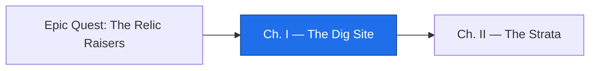

*The site is a folder on your own machine, but treat it as a basement: a program written when the company had one warehouse, a data file whose layout nobody has dared change since, and a comment that names a person who left before you were hired. Your familiar can read all of it in three seconds and explain it beautifully. The question this chapter teaches you to ask is the only one that matters in archaeology: **how would you know if it read it wrong?***

*The real-world skill under the spellcraft: get an unknown legacy program running, and turn an AI's fluent explanation into claims you can check.*

## 📖 The Legend Behind This Quest

*Every relic in the realm is a made thing that outlived its makers. `ARAGE01` was written in 1997, patched for the turn of the millennium in 1999, and changed once more in 2006 on the word of someone called J.R. in Accounting. It still runs. Nobody on payroll can say why it does everything it does — and that is the normal condition of a business system, not a scandal. The Oracle of this age reads such programs with perfect confidence, which is exactly why the guild's first law exists: **every reading is a hypothesis until the relic itself testifies.** You will learn to make it testify.*

## 🎯 Quest Objectives

### Primary Objectives

- [ ] **Raise the dig site** — install a COBOL compiler and build a fixed-format program that pulls in a copybook
- [ ] **Run the relic** — generate its input file, run it, and read the report it writes
- [ ] **Summon the familiar** — ask an AI for a reading that cites paragraphs and comments, and lists what it cannot know
- [ ] **Make the relic testify** — verify one of the familiar's claims by changing an input and rerunning
- [ ] **Open the Chronicle** — commit the relic exactly as found, so every later change has a before

### Mastery Indicators

- [ ] You can explain what a copybook is and why the relic warns "do not change field sizes"
- [ ] You can point to the paragraph that disarms the two-digit-year trap, and say what happens without it
- [ ] Your field notes keep three piles apart: evidence, hypothesis, unknown

## 🗺️ Quest Prerequisites

- **A terminal and Git** — you will create files, run commands, and make one commit.
- **Python 3** — a ten-line script writes the relic's data file with exact widths, because trailing spaces do not survive copy-and-paste.
- **An AI familiar** — Claude Code's print mode (`claude -p`) is used in the spells below. GitHub Copilot Chat, Cursor, or a browser Oracle work the same way: paste the file, use the same prompt, hold it to the same standard.
- **No COBOL knowledge** — the point is that you do not know this tongue yet. Neither did the person who last maintained it.

## 🌍 Choose Your Adventure Platform

*The relic is the same three files everywhere. Only the compiler's summoning differs.*

### 🐧 Linux

```bash
sudo apt-get update && sudo apt-get install -y gnucobol3
cobc --version | head -1
# cobc (GnuCOBOL) 3.1.2.0
```

### 🍎 macOS

```bash
brew install gnucobol
cobc --version | head -1
```

### 🪟 Windows

```powershell
# Install the Penguin's Domain inside the Kingdom, then follow the Linux path in the Ubuntu shell.
wsl --install -d Ubuntu
```

### ☁️ Cloud / Container

```bash
# Any Debian or Ubuntu container (a Codespace, a devcontainer, docker run -it ubuntu:24.04) takes the Linux path:
apt-get update && apt-get install -y gnucobol3 python3 git
```

## 🧙‍♂️ Chapter 1: Raise the Dig Site

### ⚔️ Skills You'll Forge

- Reading a COBOL copybook as a record layout
- Compiling fixed-format COBOL that pulls a copybook in with `COPY`
- Generating fixed-width data with exact byte positions

Make a folder for the expedition and start the Chronicle at once. An archaeologist's first act is to record the site before touching it.

```bash
mkdir relic-raisers && cd relic-raisers
git init -q
```

The copybook is the relic's own record layout: one `01` record, its fields, and their `PIC` clauses. `X(6)` is six characters of text; `9(6)` is six digits; `9(7)V99` is nine digits with an implied decimal point two from the right — nine bytes on disk, no point stored. Read the comment at the top twice.

```cobol
      *================================================================*
      *  INVREC.CPY - OPEN INVOICE RECORD (80 BYTES)                    *
      *  DO NOT CHANGE FIELD SIZES - LAYOUT SHARED WITH ARINV05/ARSTM02 *
      *================================================================*
       01  INV-RECORD.
           05  INV-CUST-ID        PIC X(6).
           05  INV-CUST-NAME      PIC X(20).
           05  INV-NUMBER         PIC X(8).
           05  INV-DUE-DATE       PIC 9(6).
           05  INV-DUE-PARTS REDEFINES INV-DUE-DATE.
               10  INV-DUE-YY     PIC 99.
               10  INV-DUE-MMDD   PIC 9(4).
           05  INV-AMOUNT         PIC 9(7)V99.
           05  INV-STATUS         PIC X.
           05  FILLER             PIC X(30).
```

Save it as `INVREC.CPY`. Now the program itself. COBOL of this vintage is column-sensitive: an asterisk in column 7 makes a comment, and statements begin at column 8 or column 12. Copy it exactly, leading spaces included, into `ARAGE01.cob`.

```cobol
       IDENTIFICATION DIVISION.
       PROGRAM-ID. ARAGE01.
      *================================================================*
      *  ARAGE01 - ACCOUNTS RECEIVABLE AGING                           *
      *  WRITTEN 03/97  D.M.   (CONVERTED FROM RPG II)                 *
      *  MOD 11/99  Y2K WINDOW ADDED - PIVOT 50 (00-49=20XX 50-99=19XX)*
      *  MOD 06/06  STATUS 7 = SHIPPED BUT DISPUTED. EXCLUDE FROM      *
      *             AGING BUCKETS, REPORT SEPARATELY (PER J.R./ACCTG)  *
      *================================================================*
       ENVIRONMENT DIVISION.
       INPUT-OUTPUT SECTION.
       FILE-CONTROL.
           SELECT INVOICE-FILE ASSIGN TO "INVOICES.DAT"
               ORGANIZATION IS LINE SEQUENTIAL.
           SELECT PARM-FILE ASSIGN TO "ASOF.PRM"
               ORGANIZATION IS LINE SEQUENTIAL.
           SELECT REPORT-FILE ASSIGN TO "AGING.RPT"
               ORGANIZATION IS LINE SEQUENTIAL.
       DATA DIVISION.
       FILE SECTION.
       FD  INVOICE-FILE.
       COPY "INVREC.CPY".
       FD  PARM-FILE.
       01  PARM-RECORD.
           05  PARM-ASOF-DATE     PIC 9(6).
           05  FILLER             PIC X(74).
       FD  REPORT-FILE.
       01  REPORT-LINE            PIC X(100).
       WORKING-STORAGE SECTION.
       01  WS-EOF                 PIC X VALUE "N".
       01  WS-ASOF-YYMMDD         PIC 9(6).
       01  WS-ASOF-PARTS REDEFINES WS-ASOF-YYMMDD.
           05  WS-ASOF-YY         PIC 99.
           05  WS-ASOF-MMDD       PIC 9(4).
       01  WS-ASOF-YYYYMMDD       PIC 9(8).
       01  WS-ASOF-INT            PIC 9(8).
       01  WS-DUE-YYYYMMDD        PIC 9(8).
       01  WS-DUE-INT             PIC 9(8).
       01  WS-DAYS                PIC S9(5).
       01  WS-COUNT               PIC 9(5) VALUE 0.
       01  WS-TOTALS.
           05  WS-TOT-CURRENT     PIC 9(9)V99 COMP-3 VALUE 0.
           05  WS-TOT-30          PIC 9(9)V99 COMP-3 VALUE 0.
           05  WS-TOT-60          PIC 9(9)V99 COMP-3 VALUE 0.
           05  WS-TOT-90          PIC 9(9)V99 COMP-3 VALUE 0.
           05  WS-TOT-OVER        PIC 9(9)V99 COMP-3 VALUE 0.
           05  WS-TOT-DISPUTED    PIC 9(9)V99 COMP-3 VALUE 0.
       01  WS-BUCKET              PIC X(8).
       01  HEADER-LINE.
           05  FILLER             PIC X(28)
               VALUE "AR AGING REPORT       AS OF ".
           05  HL-ASOF            PIC 9999/99/99.
       01  COLUMN-LINE            PIC X(80) VALUE
           "CUST    NAME                  INVOICE   DUE DATE      DAYS
      -    "      AMOUNT  BUCKET".
       01  DETAIL-LINE.
           05  DL-CUST            PIC X(6).
           05  FILLER             PIC X(2) VALUE SPACES.
           05  DL-NAME            PIC X(20).
           05  FILLER             PIC X(2) VALUE SPACES.
           05  DL-INV             PIC X(8).
           05  FILLER             PIC X(2) VALUE SPACES.
           05  DL-DUE             PIC 9999/99/99.
           05  FILLER             PIC X(2) VALUE SPACES.
           05  DL-DAYS            PIC -(5)9.
           05  FILLER             PIC X(2) VALUE SPACES.
           05  DL-AMOUNT          PIC Z(7)9.99.
           05  FILLER             PIC X(2) VALUE SPACES.
           05  DL-BUCKET          PIC X(8).
       01  TOTAL-LINE.
           05  TL-LABEL           PIC X(14).
           05  TL-AMOUNT          PIC Z(9)9.99.
       01  COUNT-LINE.
           05  FILLER             PIC X(14) VALUE "INVOICES READ ".
           05  CL-COUNT           PIC Z(4)9.
       PROCEDURE DIVISION.
       MAIN-PARA.
           PERFORM READ-PARM
           OPEN INPUT INVOICE-FILE
           OPEN OUTPUT REPORT-FILE
           MOVE WS-ASOF-YYYYMMDD TO HL-ASOF
           WRITE REPORT-LINE FROM HEADER-LINE
           WRITE REPORT-LINE FROM COLUMN-LINE
           PERFORM UNTIL WS-EOF = "Y"
               READ INVOICE-FILE
                   AT END MOVE "Y" TO WS-EOF
                   NOT AT END PERFORM PROCESS-RECORD
               END-READ
           END-PERFORM
           PERFORM WRITE-TOTALS
           CLOSE INVOICE-FILE REPORT-FILE
           STOP RUN.
       READ-PARM.
           OPEN INPUT PARM-FILE
           READ PARM-FILE
           CLOSE PARM-FILE
           MOVE PARM-ASOF-DATE TO WS-ASOF-YYMMDD
           IF WS-ASOF-YY < 50
               COMPUTE WS-ASOF-YYYYMMDD =
                   20000000 + WS-ASOF-YY * 10000 + WS-ASOF-MMDD
           ELSE
               COMPUTE WS-ASOF-YYYYMMDD =
                   19000000 + WS-ASOF-YY * 10000 + WS-ASOF-MMDD
           END-IF
           COMPUTE WS-ASOF-INT =
               FUNCTION INTEGER-OF-DATE(WS-ASOF-YYYYMMDD).
       PROCESS-RECORD.
           ADD 1 TO WS-COUNT
           IF INV-DUE-YY < 50
               COMPUTE WS-DUE-YYYYMMDD =
                   20000000 + INV-DUE-YY * 10000 + INV-DUE-MMDD
           ELSE
               COMPUTE WS-DUE-YYYYMMDD =
                   19000000 + INV-DUE-YY * 10000 + INV-DUE-MMDD
           END-IF
           COMPUTE WS-DUE-INT =
               FUNCTION INTEGER-OF-DATE(WS-DUE-YYYYMMDD)
           COMPUTE WS-DAYS = WS-ASOF-INT - WS-DUE-INT
           EVALUATE TRUE
               WHEN INV-STATUS = "7"
                   MOVE "DISPUTED" TO WS-BUCKET
                   ADD INV-AMOUNT TO WS-TOT-DISPUTED
               WHEN WS-DAYS <= 0
                   MOVE "CURRENT " TO WS-BUCKET
                   ADD INV-AMOUNT TO WS-TOT-CURRENT
               WHEN WS-DAYS <= 30
                   MOVE "1-30    " TO WS-BUCKET
                   ADD INV-AMOUNT TO WS-TOT-30
               WHEN WS-DAYS <= 60
                   MOVE "31-60   " TO WS-BUCKET
                   ADD INV-AMOUNT TO WS-TOT-60
               WHEN WS-DAYS <= 90
                   MOVE "61-90   " TO WS-BUCKET
                   ADD INV-AMOUNT TO WS-TOT-90
               WHEN OTHER
                   MOVE "OVER 90 " TO WS-BUCKET
                   ADD INV-AMOUNT TO WS-TOT-OVER
           END-EVALUATE
           MOVE INV-CUST-ID TO DL-CUST
           MOVE INV-CUST-NAME TO DL-NAME
           MOVE INV-NUMBER TO DL-INV
           MOVE WS-DUE-YYYYMMDD TO DL-DUE
           MOVE WS-DAYS TO DL-DAYS
           MOVE INV-AMOUNT TO DL-AMOUNT
           MOVE WS-BUCKET TO DL-BUCKET
           WRITE REPORT-LINE FROM DETAIL-LINE.
       WRITE-TOTALS.
           MOVE SPACES TO REPORT-LINE
           WRITE REPORT-LINE
           MOVE "TOTALS" TO REPORT-LINE
           WRITE REPORT-LINE
           MOVE "CURRENT       " TO TL-LABEL
           MOVE WS-TOT-CURRENT TO TL-AMOUNT
           WRITE REPORT-LINE FROM TOTAL-LINE
           MOVE "1-30 DAYS     " TO TL-LABEL
           MOVE WS-TOT-30 TO TL-AMOUNT
           WRITE REPORT-LINE FROM TOTAL-LINE
           MOVE "31-60 DAYS    " TO TL-LABEL
           MOVE WS-TOT-60 TO TL-AMOUNT
           WRITE REPORT-LINE FROM TOTAL-LINE
           MOVE "61-90 DAYS    " TO TL-LABEL
           MOVE WS-TOT-90 TO TL-AMOUNT
           WRITE REPORT-LINE FROM TOTAL-LINE
           MOVE "OVER 90 DAYS  " TO TL-LABEL
           MOVE WS-TOT-OVER TO TL-AMOUNT
           WRITE REPORT-LINE FROM TOTAL-LINE
           MOVE "DISPUTED      " TO TL-LABEL
           MOVE WS-TOT-DISPUTED TO TL-AMOUNT
           WRITE REPORT-LINE FROM TOTAL-LINE
           MOVE WS-COUNT TO CL-COUNT
           WRITE REPORT-LINE FROM COUNT-LINE.
```

The relic reads two files it expects to find beside it: `INVOICES.DAT`, eighty bytes per record, and `ASOF.PRM`, the date the aging is run for. Fixed-width data is unforgiving of a stray space, so forge it with a script rather than a keyboard. Save this as `forge_relic_data.py`.

```python
#!/usr/bin/env python3
"""Write the relic's input files with exact fixed-width layouts.

INVOICES.DAT: 80-byte records — cust(6) name(20) invoice(8) due YYMMDD(6)
amount 9(7)V99 zoned (9 digits, two implied decimals) status(1) filler(30).
ASOF.PRM: the as-of date the aging is run for, YYMMDD.
"""
ROWS = [
    ("C00101", "ACME FASTENERS",      "INV10001", "260830", "000125000", "O"),
    ("C00101", "ACME FASTENERS",      "INV10002", "260701", "000034075", "O"),
    ("C00205", "FRONT RANGE MACHINE", "INV10003", "260925", "000980000", "O"),
    ("C00205", "FRONT RANGE MACHINE", "INV10004", "260601", "000210050", "7"),
    ("C00310", "PLATTE VALLEY DIST",  "INV10005", "260810", "000056000", "O"),
    ("C00310", "PLATTE VALLEY DIST",  "INV10006", "991231", "000007500", "O"),
    ("C00412", "HIGH PLAINS DENTAL",  "INV10007", "260914", "000125000", "O"),
    ("C00412", "HIGH PLAINS DENTAL",  "INV10008", "260401", "000019999", "O"),
]
with open("INVOICES.DAT", "w", newline="\n") as f:
    for cust, name, inv, due, amt, status in ROWS:
        rec = f"{cust:<6}{name:<20}{inv:<8}{due}{amt}{status}" + " " * 30
        assert len(rec) == 80, len(rec)
        f.write(rec + "\n")
with open("ASOF.PRM", "w", newline="\n") as f:
    f.write("260914\n")
print("wrote INVOICES.DAT (8 records) and ASOF.PRM (as of 260914)")
```

Forge the data, prove every record is exactly eighty bytes, then compile and cast the relic.

```bash
python3 forge_relic_data.py
# wrote INVOICES.DAT (8 records) and ASOF.PRM (as of 260914)
awk '{ print length($0) }' INVOICES.DAT | sort -u
# 80
cobc -x -o arage01 ARAGE01.cob
./arage01
cat AGING.RPT
```

On some Ubuntu builds `cobc` prints a one-line warning about `_FORTIFY_SOURCE` being redefined; it is the compiler's C toolchain talking to itself and does not affect the binary. The report is the relic's testimony:

```text
AR AGING REPORT       AS OF 2026/09/14
CUST    NAME                  INVOICE   DUE DATE      DAYS        AMOUNT  BUCKET
C00101  ACME FASTENERS        INV10001  2026/08/30      15      1250.00  1-30
C00101  ACME FASTENERS        INV10002  2026/07/01      75       340.75  61-90
C00205  FRONT RANGE MACHINE   INV10003  2026/09/25     -11      9800.00  CURRENT
C00205  FRONT RANGE MACHINE   INV10004  2026/06/01     105      2100.50  DISPUTED
C00310  PLATTE VALLEY DIST    INV10005  2026/08/10      35       560.00  31-60
C00310  PLATTE VALLEY DIST    INV10006  1999/12/31    9754        75.00  OVER 90
C00412  HIGH PLAINS DENTAL    INV10007  2026/09/14       0      1250.00  CURRENT
C00412  HIGH PLAINS DENTAL    INV10008  2026/04/01     166       199.99  OVER 90

TOTALS
CURRENT            11050.00
1-30 DAYS           1250.00
31-60 DAYS           560.00
61-90 DAYS           340.75
OVER 90 DAYS         274.99
DISPUTED            2100.50
INVOICES READ     8
```

Look at two lines before you go further. `INV10006` is due `991231` in the data and the relic prints `1999/12/31` — not 2099. `INV10004` carries status `7` and lands in a bucket of its own, `DISPUTED`, with 105 days past due that were never counted against the customer. Those two lines are the relic's strata showing through. Now open the Chronicle with the site exactly as found:

```bash
printf 'arage01\nAGING.RPT\n' > .gitignore
git add -A && git commit -q -m "relic: ARAGE01 as found (1997, mod 1999, mod 2006)"
git log --oneline
```

### 🔍 Knowledge Check

- [ ] The copybook says "do not change field sizes — layout shared with ARINV05/ARSTM02". What would break if you widened `INV-AMOUNT` by one digit?
- [ ] `PIC 9(7)V99` occupies how many bytes on disk, and where is the decimal point stored?
- [ ] Which two paragraphs turn a two-digit year into a four-digit one, and what is the pivot?

## 🧙‍♂️ Chapter 2: The First Reading — Summon the Familiar

### ⚔️ Skills You'll Forge

- Prompting a familiar for a reading that cites its evidence
- Recognizing what the code alone cannot tell anyone
- Making the relic testify against the reading

Now the futuristic tool meets the ancient one. Pipe the program into your familiar and ask for a reading — but shape the spell so that fluency cannot pass for knowledge. Three ingredients do the work: demand a citation for every claim, demand a list of unknowns, and never ask "is this correct?", because an Oracle answers yes.

```bash
cat ARAGE01.cob | claude -p "You are reading a COBOL batch program found in a basement. Explain what it does, step by step. For every claim, cite the paragraph name or the header comment it comes from. End with a list titled 'What I cannot tell from the code alone'."
```

`-p` is print mode: the familiar answers once and exits, so the reading lands in your terminal where you can save it. Using Copilot Chat, Cursor, or a browser Oracle instead? Paste the file and use the same words. The standard does not change with the tool.

A careful reading will find, with citations: the two input files and one output file (`FILE-CONTROL`), the century pivot at 50 (`READ-PARM`, `PROCESS-RECORD`, and the `MOD 11/99` comment), the five aging buckets in the `EVALUATE`, and the rule that status `7` is kept out of them (`MOD 06/06`). A careful reading will also admit what no reading can settle: who J.R. was and whether the rule still stands, why the pivot is 50 and not 30, what other status codes exist in real data, what the sibling programs `ARINV05` and `ARSTM02` do with the same layout, and who reads `AGING.RPT` after it is written. Everything on that second list is a question for Chapter III. Everything on the first list is a hypothesis until you test it.

So test one. The familiar says the buckets depend on the as-of date. Change the date and rerun:

```bash
echo 270101 > ASOF.PRM
./arage01
tail -8 AGING.RPT
```

```text
TOTALS
CURRENT                0.00
1-30 DAYS              0.00
31-60 DAYS             0.00
61-90 DAYS             0.00
OVER 90 DAYS       13475.74
DISPUTED            2100.50
INVOICES READ     8
```

Run as of New Year's Day 2027, every open invoice is more than ninety days past due, and the disputed one is still disputed. The relic confirmed two claims at once and you did not have to trust anyone. Put the date back before you forget:

```bash
echo 260914 > ASOF.PRM && ./arage01
```

That is the Prime Rule of archaeology, and it is the whole chapter: **a reading is a hypothesis; a rerun is evidence.** The familiar is not your enemy — it just gave you a map of what to test, in seconds, in a tongue you do not speak. The 🐉 Plausible Ghost only appears when someone skips the rerun.

### 🔍 Knowledge Check

- [ ] Why does the spell demand citations instead of asking whether the explanation is right?
- [ ] Name one claim from the reading that a rerun can test, and one that only a person can answer.
- [ ] What did changing the as-of date prove that reading the code did not?

## 🧙‍♂️ Chapter 3: Field Notes — Evidence, Hypothesis, Unknown

### ⚔️ Skills You'll Forge

- Keeping evidence and inference apart in writing
- Turning unknowns into questions for the Elders

An archaeologist's notebook has three piles and never mixes them. Create `EXPEDITION.md` and fill it from what you did, not from what you were told:

```markdown
# Expedition log: ARAGE01

## Evidence (seen in the relic or its output)
- Reads INVOICES.DAT and ASOF.PRM, writes AGING.RPT — ARAGE01.cob, FILE-CONTROL.
- Two-digit years pivot at 50: 99 -> 1999, 26 -> 2026 — READ-PARM, PROCESS-RECORD; confirmed by INV10006 printing 1999/12/31.
- Status 7 is excluded from the aging buckets and totaled as DISPUTED — EVALUATE, first WHEN; confirmed by INV10004.
- Buckets move with the as-of date — confirmed by rerunning with ASOF.PRM = 270101.

## Hypotheses (from the familiar, not yet tested)
- Amounts are summed exactly (COMP-3 packed decimal), so a port must not use floating point.
- The report feeds a monthly statement run (the copybook names ARSTM02).

## Unknowns (questions for the Elders)
- Who was J.R., and does Accounting still want disputed invoices kept out of aging?
- Why pivot 50? What is the oldest due date in real data?
- What other status codes exist, and what do they mean?
- What do ARINV05 and ARSTM02 do with this layout?
```

Commit it. The notebook is a scroll the next raiser will read before touching anything, and the Unknowns list is the interview guide for Chapter III.

```bash
git add EXPEDITION.md && git commit -q -m "expedition: first field notes"
```

## 🎮 Mastery Challenge

**Objective:** a dig site the next raiser could pick up cold.

- [ ] `./arage01` reproduces the report above byte for byte (`diff` it against a saved copy)
- [ ] `EXPEDITION.md` holds at least three evidence items with locations, two hypotheses, and three unknowns
- [ ] At least one hypothesis was promoted to evidence by a rerun, and the note says which rerun
- [ ] The Chronicle has two entries: the relic as found, then the notes

## 🎁 Rewards & Progression

- 🏺 **First Shard** — you ran the relic and wrote notes that keep evidence and guesswork apart
- 🧱 **Skill unlocked:** compiling and running fixed-format COBOL with a copybook
- 🔍 **Skill unlocked:** turning a familiar's reading into claims with evidence
- **+50 XP**

## 🔁 Reproduce It

Every command and output in this chapter was executed on 2026-09-14 on Ubuntu 24.04 with GnuCOBOL 3.1.2 (`apt` package `gnucobol3`), Python 3.11, and Claude Code 2.1. The three relic files are used unchanged through Chapter VII, so keep them exactly as written here; the campaign's trials, ledger, and gate all assume this byte layout and this report format.

## 🗺️ Quest Network



## 🔮 Next Adventures

The relic runs and you have a list of what you do not know. Next you read its data the way it reads it — field by field — and let the data itself confirm or deny the dictionary.

- ➡️ **Next chapter:** [Chapter II — The Strata](/quests/0110/relic-raisers-02-the-strata/)
- 🏺 **Campaign hub:** [Epic Quest: The Relic Raisers](/quests/codex/relic-raisers/)

## 📚 Resource Codex

- [GnuCOBOL Programmer's Guide](https://gnucobol.sourceforge.io/doc/gnucobol.html) — the reference for `PIC`, `COPY`, `EVALUATE`, and the intrinsic functions the relic uses
- [Claude Code CLI reference](https://docs.claude.com/en/docs/claude-code/cli-reference) — print mode, piping files, and the flags behind `claude -p`
- [GAO: Agencies Need to Plan for Modernizing Critical Decades-Old Legacy Systems](https://www.gao.gov/products/gao-25-107795) — why relics like this one are the rule, not the exception

## 🕸️ Knowledge Graph

*Structured wiki-links connect this quest to the IT-Journey knowledge graph. Open the [Obsidian Graph View](/notes/obsidian/graph/) to explore connections.*

**Campaign hub:** [[Epic Quest: The Relic Raisers]] **Level hub:** [[Level 0011 - Development Tools & AI Integration]] **Previous:** none — first chapter **Next:** [[The Strata: Read the Copybook, Then Let the Data Testify]] **Obsidian docs:** [[Obsidian Knowledge Graph and Wiki Links]]
