---

title: Level 0100 - Frontend Development & Docker
description: Master frontend development workflows with Docker containerization and modern tooling
preview: images/previews/level-0100-frontend-docker.png
permalink: /quests/level-0100/
lastmod: 2025-11-29T23:41:31.769Z

layout: quest-collection
level: 0100
categories: quests
---

# Level 0100: Frontend Development & Docker

*Welcome to the container realm! Level 0100 combines the power of modern frontend development with Docker containerization. Learn to build, package, and deploy web applications with consistency across any environment.*

## Quest Overview

Level 0100 quests focus on:
- **Docker Fundamentals** - Containers, images, and Dockerfiles
- **Frontend Workflows** - Modern web development practices
- **Development Environments** - Consistent, reproducible setups
- **Code Quality** - Automated analysis and improvement

## Available Quests

### 🐳 Docker & Containers

#### [Frontend Docker Quest](frontend-docker.md)
**Quest Type**: Main 🏰 | **Difficulty**: 🟡 Medium | **Estimated Time**: 90-120 minutes

Master Docker for frontend development. Create containerized development environments and learn to deploy web applications with Docker.

**Skills You'll Master:**
- Docker installation and configuration
- Dockerfile creation for frontend apps
- Docker Compose for multi-service setups
- Volume mounting for development workflows

**Prerequisites:** Terminal basics, HTML/CSS/JS fundamentals

---

#### [Frontend Docker - Level 000](lvl-000-frontend-docker.md)
**Quest Type**: Side ⚔️ | **Difficulty**: 🟢 Easy | **Estimated Time**: 30-45 minutes

Begin your Docker journey with the absolute basics. Install Docker and run your first containers.

**Skills You'll Master:**
- Docker Desktop installation
- Basic Docker commands
- Container lifecycle management
- Image pulling and running

**Prerequisites:** Basic terminal knowledge

---

#### [Frontend Docker - Level 001](lvl-001-frontend-docker.md)
**Quest Type**: Side ⚔️ | **Difficulty**: 🟡 Medium | **Estimated Time**: 45-60 minutes

Build on your Docker basics with custom images and Dockerfiles for frontend projects.

**Skills You'll Master:**
- Dockerfile syntax and best practices
- Image building and optimization
- Layer caching strategies
- Multi-stage builds

**Prerequisites:** [Frontend Docker - Level 000](lvl-000-frontend-docker.md)

---

#### [Frontend Docker - Level 010](lvl-010-frontend-docker.md)
**Quest Type**: Side ⚔️ | **Difficulty**: 🔴 Hard | **Estimated Time**: 60-90 minutes

Advanced Docker patterns for frontend development including networking, volumes, and production deployment.

**Skills You'll Master:**
- Docker networking for microservices
- Persistent storage with volumes
- Production optimization techniques
- Container orchestration basics

**Prerequisites:** [Frontend Docker - Level 001](lvl-001-frontend-docker.md)

### 🌐 Frontend Development

#### [Frontend Development Quest](frontend.md)
**Quest Type**: Main 🏰 | **Difficulty**: 🟡 Medium | **Estimated Time**: 120-180 minutes

Comprehensive frontend development covering HTML, CSS, JavaScript, and modern frameworks. Build responsive, interactive web applications.

**Skills You'll Master:**
- Modern HTML5 and CSS3 techniques
- JavaScript ES6+ features
- Responsive design patterns
- Build tools and bundlers

**Prerequisites:** Basic HTML/CSS knowledge

---

#### [Frontend Levels Guide](frontend-levels.md)
**Quest Type**: Bonus 🎁 | **Difficulty**: 🟢 Easy | **Estimated Time**: 20-30 minutes

A roadmap and guide to frontend development progression. Understand the skill levels and path to mastery.

**Skills You'll Master:**
- Frontend development roadmap
- Skill level assessment
- Learning path planning
- Resource discovery

**Prerequisites:** None

### 🔮 Code Quality & Analysis

#### [Sourcery Code Methods](sourcery-code-methods.md)
**Quest Type**: Side ⚔️ | **Difficulty**: 🟡 Medium | **Estimated Time**: 45-60 minutes

Learn automated code analysis and improvement with Sourcery. Write cleaner, more Pythonic code with AI assistance.

**Skills You'll Master:**
- Sourcery integration and setup
- Automated code refactoring
- Code quality metrics
- Best practice enforcement

**Prerequisites:** Python basics, VS Code

## Learning Path Recommendations

### For Docker Newcomers
1. [Frontend Docker - Level 000](lvl-000-frontend-docker.md) - Install and basics
2. [Frontend Docker - Level 001](lvl-001-frontend-docker.md) - Building images
3. [Frontend Docker - Level 010](lvl-010-frontend-docker.md) - Advanced patterns
4. [Frontend Docker Quest](frontend-docker.md) - Full integration

### For Frontend Developers
1. [Frontend Development Quest](frontend.md) - Core skills
2. [Frontend Docker Quest](frontend-docker.md) - Containerization
3. [Sourcery Code Methods](sourcery-code-methods.md) - Code quality

### For DevOps Learners
1. [Frontend Docker - Level 000](lvl-000-frontend-docker.md) through Level 010
2. [Frontend Docker Quest](frontend-docker.md)
3. Progress to Level 0101 for advanced Docker

## Quest Dependencies & Progression

```mermaid
graph TD
    A[Level 0011 Complete] --> B[🐳 Docker Level 000]
    B --> C[🐳 Docker Level 001]
    C --> D[🐳 Docker Level 010]
    D --> E[🏗️ Frontend Docker Quest]
    A --> F[🌐 Frontend Quest]
    F --> E
    E --> G[Level 0101 Quests]
    F --> H[🔮 Sourcery Code]
    H --> G
```

## Quest Completion Benefits

Upon completing Level 0100 quests, you'll unlock:
- **Container Mastery** - Build and deploy with Docker
- **Frontend Excellence** - Modern web development skills
- **Reproducible Environments** - Consistent development setups
- **Code Quality** - Automated improvement tools

## Next Level: Level 0101

After mastering frontend Docker, advance to [Level 0101 - Advanced Docker & DevOps](../0101/README.md) where you'll:
- Build complex Docker Compose setups
- Master LaTeX document generation
- Create professional portfolios

---

*Containers are the future of deployment. Master them now.* 🐳✨
