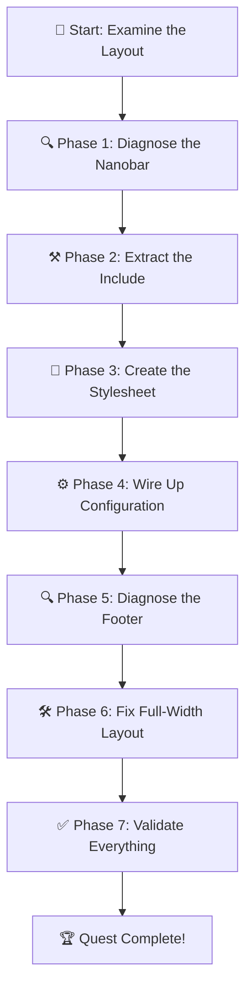

*Greetings, brave artisan! Welcome to The Artisan's Forge — an epic journey that will transform you from a coder who patches things together into a true component architect. This quest guides you through the real-world process of turning hard-coded, inline Jekyll theme elements into modular, configurable, and reusable components.*

*Whether you are a novice learning your first Liquid incantation or a seasoned theme-smith looking to sharpen your craft, this adventure will reward you with practical, production-tested knowledge.*

### 📜 The Legend Behind This Quest

*In the ancient theme-forges of Zer0-Mistakes, a progress bar once lived hard-coded inside a layout — tangled in the markup like a vine choking a tower. And far below, a footer section was trapped inside container walls, unable to stretch its dark wings to the edges of the viewport. Two artisans, guided by an AI familiar, ventured into the codebase to reshape these elements. This quest retells their journey so that you may learn the craft yourself.*

---

## 🎯 Quest Objectives

By the time you complete this quest, you will have mastered:

### Primary Objectives (Required for Quest Completion)

- [ ] **Diagnose an inline component** — Identify a hard-coded UI element in a Jekyll layout and explain why it should be extracted
- [ ] **Create a config-driven include** — Build a `_includes/` component that reads its settings from `_config.yml`
- [ ] **Scope CSS safely** — Write styles with class-based selectors that avoid leaking into unrelated elements
- [ ] **Fix a full-width layout issue** — Remove constraining container markup so a section spans the full viewport

### Secondary Objectives (Bonus Achievements)

- [ ] **Add position modes** — Support both `top` and `bottom` nanobar placement via configuration
- [ ] **Implement step animation** — Make the progress bar advance in discrete segments rather than smoothly
- [ ] **Write a validation test** — Confirm the refactored component builds without errors in CI

### Mastery Indicators

You'll know you've truly mastered this quest when you can:

1. Look at any inline UI element and immediately see how to extract it into a configurable include
2. Write CSS that stays scoped to its component without relying on `!important`
3. Diagnose container-vs-full-width layout issues in under two minutes

---

## 🗺️ Quest Map



---

## ⚔️ Phase 1: Diagnose the Nanobar

*Before you can forge a new tool, you must understand the old one.*

### Step 1.1: Find the Inline Code

Open your theme's main layout file (e.g., `_layouts/default.html` or `_layouts/root.html`). Look for a `<div>` with an inline `<style>` block that creates a thin progress bar — the **nanobar**.

Signs you've found it:
- A `<style>` tag inside the `<body>`, not in `<head>`
- CSS properties like `position: fixed`, `height: 2px` or `3px`, a bright `background-color`
- JavaScript or Liquid logic that calculates scroll progress

### Step 1.2: Document What It Does

Create a checklist of the nanobar's behaviour:

- [ ] Where does it appear? (top of page? bottom?)
- [ ] What colour is it?
- [ ] Does it animate smoothly or jump in steps?
- [ ] How tall is it in pixels?
- [ ] What triggers its progress — scroll position, page sections, something else?

> **🧙 Artisan's Tip:** Use your browser's DevTools → Elements panel to inspect the nanobar in a running site. Right-click → Inspect is your fastest friend.

---

## ⚒️ Phase 2: Extract the Include

*Now we move the code out of the layout and into its own file.*

### Step 2.1: Create the Include File

```bash
# Create the include file
touch _includes/components/nanobar.html
```

Move all the nanobar markup from the layout into this new file. The layout should now contain only:

```liquid

```

### Step 2.2: Add Configuration Guards

Wrap the entire include in a config check so the nanobar only renders when enabled:

```liquid

<div class="nanobar nanobar--{{ site.nanobar.position | default: 'top' }}"
     role="progressbar"
     aria-label="Reading progress"
     aria-valuemin="0"
     aria-valuemax="100"
     aria-valuenow="0">
  <div class="nanobar__bar"></div>
</div>

```

### Step 2.3: Define the Configuration

Add a `nanobar:` block to `_config.yml`:

```yaml
nanobar:
  enabled: true
  position: top        # top | bottom
  height: 3px
  color: "#0d6efd"     # Bootstrap primary blue
  z_index: 1050
  step_animation: false
```

> **🧙 Artisan's Tip:** Using `_config.yml` means site owners can customise the nanobar without touching any HTML or CSS — they only edit a YAML file.

---

## 🎨 Phase 3: Create the Stylesheet

*Style belongs in stylesheets, not inline `<style>` tags.*

### Step 3.1: Create the Sass Partial

```bash
mkdir -p _sass/components
touch _sass/components/_nanobar.scss
```

### Step 3.2: Write Scoped CSS

```scss
// _sass/components/_nanobar.scss
// Nanobar reading-progress indicator
// All selectors scoped under .nanobar to prevent leakage

.nanobar {
  position: fixed;
  left: 0;
  width: 100%;
  height: var(--nanobar-height, 3px);
  background: transparent;
  z-index: var(--nanobar-z-index, 1050);
  pointer-events: none;

  &--top    { top: 0; }
  &--bottom { bottom: 0; }
}

.nanobar__bar {
  width: 0%;
  height: 100%;
  background: var(--nanobar-color, #0d6efd);
  transition: width 0.2s ease-out;
}
```

### Step 3.3: CSS Custom Properties from Config

In the include file, output CSS custom properties from the YAML values:

```liquid

<style>
  :root {
    --nanobar-height: {{ site.nanobar.height | default: '3px' }};
    --nanobar-color: {{ site.nanobar.color | default: '#0d6efd' }};
    --nanobar-z-index: {{ site.nanobar.z_index | default: 1050 }};
  }
</style>

```

> **🧙 Artisan's Tip:** CSS custom properties let you bridge YAML config values into the stylesheet without Sass compilation tricks.

---

## ⚙️ Phase 4: Wire Up the JavaScript

Add a small script that updates the bar width on scroll:

```html
<script>
document.addEventListener('scroll', function() {
  var bar = document.querySelector('.nanobar__bar');
  if (!bar) return;

  var scrollTop = window.scrollY;
  var docHeight = document.documentElement.scrollHeight - window.innerHeight;
  var progress = docHeight > 0 ? (scrollTop / docHeight) * 100 : 0;

  bar.style.width = progress + '%';
  bar.parentElement.setAttribute('aria-valuenow', Math.round(progress));
});
</script>
```

**Checkpoint:** Rebuild your site (`bundle exec jekyll build`) and verify the nanobar appears at the configured position with the configured colour.

---

## 🔍 Phase 5: Diagnose the Footer Issue

*The nanobar is forged. Now turn your attention to the footer.*

### Step 5.1: Identify the Constraint

Open your footer include or layout section. Look for a pattern like this:

```html
<footer>
  <div class="container">  <!-- 👈 This constrains the width -->
    <div class="bg-dark text-light p-4">
      Footer content...
    </div>
  </div>
</footer>
```

The `container` class adds horizontal padding and a `max-width`, preventing the dark background from reaching the viewport edges.

### Step 5.2: Inspect in DevTools

1. Open DevTools → Elements
2. Select the dark footer `<div>`
3. Check the **Box Model** panel — you'll see margins or padding from the `container` parent
4. Toggle the `container` class off in the Styles panel — watch the background snap to full width

---

## 🛠️ Phase 6: Fix the Full-Width Layout

### Step 6.1: Remove the Constraining Classes

Change the footer structure so the dark background section is **outside** any width-constraining wrapper:

```html
<!-- BEFORE (constrained) -->
<div class="container">
  <div class="bg-dark text-light p-4">
    Content here
  </div>
</div>

<!-- AFTER (full-width background, contained content) -->
<div class="bg-dark text-light p-4">
  <div class="container">
    Content here
  </div>
</div>
```

### Step 6.2: Pattern Explanation

| Layer | Class | Purpose |
|-------|-------|---------|
| Outer | `bg-dark text-light p-4` | Full-width dark background |
| Inner | `container` | Centers and constrains the **text content** only |

> **🧙 Artisan's Tip:** The principle is "backgrounds go wide, content stays centred." Apply this pattern any time you need a full-bleed section with contained text.

**Checkpoint:** Rebuild and verify the footer's dark section stretches edge-to-edge while text remains centred.

---

## ✅ Phase 7: Validate Everything

### Build Validation

```bash
# Full Jekyll build — must exit 0
bundle exec jekyll build

# If using Docker:
docker-compose exec -T jekyll bundle exec jekyll build \
  --config '_config.yml,_config_dev.yml'
```

### Visual Checks

- [ ] Nanobar appears at the configured position (top or bottom)
- [ ] Nanobar colour matches `_config.yml` value
- [ ] Nanobar advances as you scroll the page
- [ ] Footer dark section extends to both viewport edges
- [ ] Footer text content is centred and readable
- [ ] Page looks correct on mobile (≤ 576 px) and desktop (≥ 992 px)

### Configuration Toggle

```yaml
# Temporarily disable nanobar — site should render without it
nanobar:
  enabled: false
```

Rebuild and confirm no nanobar appears and no build errors occur.

---

## 🏆 Quest Completion

*Congratulations, artisan! You have forged two powerful improvements:*

1. **A modular, config-driven nanobar** — extracted from inline code into a clean include + stylesheet + config pattern
2. **A full-width footer fix** — freed from constraining containers so its background stretches to the viewport edges

### Rewards Earned

| Reward | Description |
|--------|-------------|
| 🛠️ **Component Architecture** | You can extract any inline element into a reusable, configurable include |
| 🎨 **CSS Scoping Mastery** | Your styles stay contained — no leakage, no `!important` hacks |
| 📐 **Layout Control** | You understand the "backgrounds wide, content centred" pattern |
| ⚙️ **Config-Driven Design** | Site owners can customise components without touching code |

### What's Next?

- **Side Quest:** [Profile Themes](/quests/side-quest-profile-themes/) — Apply your CSS scoping skills to build full theme variants
- **Main Quest:** [Frontend Docker](/quests/frontend-docker/) — Containerise your development environment for cross-platform consistency
- **Challenge:** Find another inline element in your theme and refactor it using the same pattern

---

*Go forth, artisan, and may your components be modular, your styles scoped, and your layouts ever full-width when they need to be.* ⚒️
