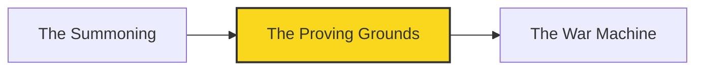

*You summoned the agent in Chapter I, but a summoned spirit with no boundaries is a hazard, not a helper. Before you hand it the keys to your realm, you must build the **Proving Grounds** — a gate every change must pass through, where a tireless sentinel inspects each pull request and renders one verdict: pass, or fail. No vibes. No "looks fine to me." Just a deterministic check that says yes or no, the same way, every single time.*

*The real-world skill you are forging here is **continuous integration as a contract**: a verification harness that emits machine-readable findings, lints your content, and surfaces a single required status check that gates every merge. This is the difference between a repository you hope is healthy and one you can prove is.*

## 📖 The Legend Behind This Quest

In the old kingdoms, a fortress was only as strong as its gatehouse. Anyone could ride up claiming friendship; only the gate decided who passed. Your repository is that fortress, and CI is its gatehouse. When you make `verify` a **required status check**, no pull request — human or agent — can merge without passing through it first. The genius of the Proving Grounds is that the sentinel is *deterministic*: it produces the same findings for the same input, writes them to a frozen contract your future automation can read, and never gets tired, distracted, or charitable. You are about to teach your repo to refuse broken changes on its own.

## 🎯 Quest Objectives

### Primary Objectives

- [ ] Design a frozen, machine-readable `findings.jsonl` contract that any tool — or agent — can parse the same way every run
- [ ] Build a deterministic verification harness that link-checks and front-matter-lints your content and exits non-zero on failure
- [ ] Wire the harness into a GitHub Actions workflow that runs on every pull request
- [ ] Promote `verify` to a **required status check** via branch protection so no merge skips the gate

### Mastery Indicators

- [ ] You can explain why a *frozen* findings schema matters more than the checks themselves
- [ ] You can open a deliberately broken PR and watch `verify` fail before any human reviews it
- [ ] You can read `findings.jsonl` and trace each entry back to the exact file and rule that produced it

## 🗺️ Quest Prerequisites

Before you raise the gatehouse, make sure your camp is stocked. This chapter assumes you arrive with:

- 🏰 **The Summoning, completed** — finish [Chapter I — The Summoning](/quests/0001/self-operating-website-01-the-summoning/) first. You need the agent you awakened there before the gate has anything to guard.
- 🐙 **A GitHub repository you own** — with admin rights, because promoting `verify` to a *required* check lives under branch protection settings only an owner/admin can edit.
- 🔑 **A Claude Code OAuth token** — stored as a repository secret, to drive the agent steps in later chapters of the campaign.
- 🧰 **Local toolchain** — Git, a text editor or IDE, and **Python 3.12+** with `pip` so you can run the harness locally before you ever push it.
- 📦 **One Python dependency** — `pyyaml`, used by the front-matter linter (`pip install pyyaml`). The workflow installs it too, but installing it locally lets you test first.
- 🌿 **Git fluency** — comfort with branches and pull requests, since the whole quest is exercised through a PR that the gate either accepts or refuses.

## 🧙‍♂️ Chapter 1: Forging the Findings Contract

### ⚔️ Skills You'll Forge

- Designing a stable, line-delimited JSON schema (JSONL) for tool output
- Separating *detection* (finding problems) from *reporting* (emitting findings)
- Writing a deterministic checker that other programs — and agents — can trust

Most CI scripts print a wall of human-readable text and exit. That works for a person staring at logs, but your realm is going to be *self-operating* — later chapters hand these results to an agent that fixes problems automatically. An agent cannot reliably parse prose. So the first thing you build is not a check; it is a **contract**: a frozen schema for what a "finding" is.

We use **JSONL** (JSON Lines) — one JSON object per line — because it is append-friendly, stream-friendly, and trivial to read incrementally. The schema is *frozen*: once you ship these field names, you treat them like an API. Downstream tools depend on `file`, `rule`, `severity`, and `message` existing and meaning the same thing forever.

First, give the harness a home on disk:

```bash
mkdir -p scripts/ci
```

Now the emitter. This is the heart of the contract — the part that turns a list of problems into a deterministic, machine-readable artifact:

```python
# scripts/ci/verify.py — the FROZEN findings contract (emitter half)
import json
from pathlib import Path

# The FROZEN contract. Field names and meanings do not change casually.
# severity is one of: "error" | "warning". Only "error" fails the gate.
def emit(findings, out_path="findings.jsonl"):
    # Sort for determinism: same input -> byte-identical output, every run.
    findings.sort(key=lambda f: (f["file"], f["rule"], f["message"]))
    with open(out_path, "w", encoding="utf-8") as fh:
        for f in findings:
            fh.write(json.dumps(f, sort_keys=True, ensure_ascii=False) + "\n")
    errors = [f for f in findings if f["severity"] == "error"]
    return 1 if errors else 0

def finding(file, rule, severity, message):
    return {"file": file, "rule": rule, "severity": severity, "message": message}
```

The load-bearing detail is **determinism**. We sort the findings and serialize with `sort_keys=True`, so the same repository state always produces a byte-identical `findings.jsonl`. That property is what lets you diff two runs, cache results, and — crucially — lets an agent reason about *what changed* rather than re-reading everything. The function returns the process exit code: non-zero if any `error` exists, which is how the gate will fail.

### 🔍 Knowledge Check

- [ ] Why does sorting findings before writing them make the harness easier to automate against?
- [ ] What is the difference between a `"warning"` and an `"error"` in this contract, and which one fails the gate?
- [ ] If you needed to add a new field to a finding later, why must you add it rather than rename an existing one?

## 🧙‍♂️ Chapter 2: The Checks and the Required Gate

### ⚔️ Skills You'll Forge

- Implementing a link-checker and a front-matter linter that feed the contract
- Writing a GitHub Actions workflow triggered on `pull_request`
- Promoting a job to a **required status check** with branch protection

Now you give the sentinel something to inspect. For a Jekyll content repo, two checks earn their keep immediately: **broken site-absolute links** (a link like `/quests/...` pointing at a file that does not exist) and **front-matter linting** (every content file must carry the required keys). Each problem becomes a `finding(...)` entry, so both checks speak the same frozen language.

```python
# scripts/ci/verify.py (continued) — two checks that emit into the same contract
import re
import yaml

REQUIRED_KEYS = {"title", "description", "date", "author"}

def check_frontmatter(md_path, text):
    out = []
    if not text.startswith("---"):
        out.append(finding(md_path, "fm-missing", "error", "no front matter block"))
        return out
    block = text.split("---", 2)[1]
    data = yaml.safe_load(block) or {}
    for key in sorted(REQUIRED_KEYS - set(data)):
        out.append(finding(md_path, "fm-required-key", "error", f"missing key: {key}"))
    return out

def check_links(md_path, text, repo_root):
    # Only checks SITE-ABSOLUTE links, e.g. [text](/quests/foo/). Relative
    # ./ and ../ links are intentionally out of scope for this first gate.
    out = []
    for target in re.findall(r"\]\((/[^)\s#]+)", text):
        # Resolve a site-absolute link to a candidate file on disk.
        candidate = Path(repo_root) / target.lstrip("/")
        if not candidate.exists() and not (candidate.with_suffix(".md")).exists():
            out.append(finding(md_path, "link-broken", "warning", f"dead link: {target}"))
    return out
```

The harness needs a driver: something that walks your content, runs both checks on every Markdown file, accumulates the findings, emits the contract, and exits with the right code. Without this `__main__` block the script would simply define functions and exit `0` — and a gate that always passes is no gate at all. Here is the **complete, assembled `scripts/ci/verify.py`** — copy this one file end to end:

```python
# scripts/ci/verify.py — complete deterministic verification harness
import json
import re
import sys
from pathlib import Path

import yaml

# --- The FROZEN contract -----------------------------------------------------
# Field names and meanings do not change casually.
# severity is one of: "error" | "warning". Only "error" fails the gate.

def finding(file, rule, severity, message):
    return {"file": file, "rule": rule, "severity": severity, "message": message}

def emit(findings, out_path="findings.jsonl"):
    # Sort for determinism: same input -> byte-identical output, every run.
    findings.sort(key=lambda f: (f["file"], f["rule"], f["message"]))
    with open(out_path, "w", encoding="utf-8") as fh:
        for f in findings:
            fh.write(json.dumps(f, sort_keys=True, ensure_ascii=False) + "\n")
    errors = [f for f in findings if f["severity"] == "error"]
    return 1 if errors else 0

# --- The checks --------------------------------------------------------------

REQUIRED_KEYS = {"title", "description", "date", "author"}

def check_frontmatter(md_path, text):
    out = []
    if not text.startswith("---"):
        out.append(finding(md_path, "fm-missing", "error", "no front matter block"))
        return out
    block = text.split("---", 2)[1]
    data = yaml.safe_load(block) or {}
    for key in sorted(REQUIRED_KEYS - set(data)):
        out.append(finding(md_path, "fm-required-key", "error", f"missing key: {key}"))
    return out

def check_links(md_path, text, repo_root):
    # Only checks SITE-ABSOLUTE links, e.g. [text](/quests/foo/). Relative
    # ./ and ../ links are intentionally out of scope for this first gate.
    out = []
    for target in re.findall(r"\]\((/[^)\s#]+)", text):
        candidate = Path(repo_root) / target.lstrip("/")
        if not candidate.exists() and not (candidate.with_suffix(".md")).exists():
            out.append(finding(md_path, "link-broken", "warning", f"dead link: {target}"))
    return out

# --- The driver: walk content, run checks, emit, exit ------------------------

def main():
    repo_root = Path(".")
    findings = []
    for md_path in sorted(repo_root.glob("**/*.md")):
        text = md_path.read_text(encoding="utf-8")
        rel = str(md_path)
        findings.extend(check_frontmatter(rel, text))
        findings.extend(check_links(rel, text, repo_root))
    return emit(findings)

if __name__ == "__main__":
    sys.exit(main())
```

That `if __name__ == "__main__"` block is what makes the gate real: it walks every Markdown file with `Path(".").glob("**/*.md")`, runs both checks, accumulates findings, writes the contract via `emit()`, and `sys.exit()`s the harness's exit code. Now `python scripts/ci/verify.py` returns non-zero whenever any `error`-severity finding exists — exactly the behavior the gate depends on.

**Test it locally before you wire any CI.** A gate you have never run is a guess:

```bash
pip install pyyaml && python scripts/ci/verify.py
```

A clean repo prints nothing and exits `0` (check with `echo $?`); a repo with a missing front-matter key exits `1` and you'll find the offending entry in `findings.jsonl`.

With the harness verified locally, the final piece is the **gatehouse itself** — a workflow that runs the same command on every pull request:


```yaml
# .github/workflows/verify.yml
name: verify
on:
  pull_request:
    branches: [main]
permissions:
  contents: read
jobs:
  verify:
    runs-on: ubuntu-latest
    steps:
      - uses: actions/checkout@v4
      - uses: actions/setup-python@v5
        with:
          python-version: '3.12'
      - name: Install deps
        run: pip install pyyaml
      - name: Run verification harness
        run: python scripts/ci/verify.py
      - name: Upload findings contract
        if: ${{ always() }}   # publish findings even when the gate fails
        uses: actions/upload-artifact@v4
        with:
          name: findings
          path: findings.jsonl
```


> 📝 The ``  ``/``  `` tags are Jekyll escapes for this site's renderer — omit them when you copy the YAML into your own `.github/workflows/`.

Two subtleties make this a real gate. First, `always()` on the upload step means `findings.jsonl` is published as an artifact *even when the harness exits non-zero* — so you can always inspect what failed. Second, the workflow is only advisory until you make it **required**: in your repository settings, under *Branches → Branch protection rules → main*, enable "Require status checks to pass before merging" and select `verify`. From that moment, GitHub itself refuses to merge any PR — yours or an agent's — until the sentinel passes. That single toggle is what turns a script into a contract.

### 🔍 Knowledge Check

- [ ] Why does the upload step use `always()` instead of running only on success?
- [ ] What exactly changes the moment you mark `verify` as a *required* status check in branch protection?
- [ ] Which check above emits an `error` (fails the gate) versus a `warning` (reported but tolerated), and why might you choose differently?

## 🔁 Reproduce It

This chapter mirrors a real build in the `bamr87/lifehacker.dev` repository. Every lesson here is anchored to a merged branch you can read:

- **[bamr87/lifehacker.dev#3](https://github.com/bamr87/lifehacker.dev/pull/3)** (`bamr87/lifehacker.dev@b97e50c1a`) — introduced the deterministic verification harness and froze the `findings.jsonl` contract that downstream automation reads.
- **[bamr87/lifehacker.dev#4](https://github.com/bamr87/lifehacker.dev/pull/4)** (`bamr87/lifehacker.dev@cceeb20b6`) — added link-checking and front-matter linting on top of the contract and wired the `verify` workflow as the repository's first required status check.

Read those two squash-merges side by side and you will see the same progression you just built: contract first, checks second, gate last.

## 🎮 Mastery Challenge

**Objective:** Prove your gate actually refuses broken work.

- [ ] Open a pull request that deletes a required front-matter key from one content file and confirm `verify` fails with an `fm-required-key` error
- [ ] Download the `findings.jsonl` artifact from the failed run and trace the exact entry back to the file and rule that produced it
- [ ] Fix the file, push, and confirm the same `verify` check flips to green and the PR becomes mergeable

## 🎁 Rewards & Progression

- 🏅 **Badge earned:** ✅ Gatekeeper — built the required verify check
- 🛠️ **Skill unlocked:** Deterministic CI gate design
- 🧠 **Skill unlocked:** A frozen machine-readable findings contract
- ⭐ **+75 XP**

## 🗺️ Quest Network



## 🔮 Next Adventures

- ➡️ **Next chapter:** [The War Machine](/quests/1000/self-operating-website-03-the-war-machine/) — scale the single gate into a fleet of automated workflows.
- 🏰 **Campaign hub:** [The Self-Operating Website](/quests/codex/self-operating-website/) — see the full campaign map.
- ⬅️ **Previous chapter:** [The Summoning](/quests/0001/self-operating-website-01-the-summoning/) — where you first summoned the agent.

## 📚 Resource Codex

- [About status checks — GitHub Docs](https://docs.github.com/en/pull-requests/collaborating-with-pull-requests/collaborating-on-repositories-with-code-quality-features/about-status-checks)
- [Events that trigger workflows — GitHub Actions](https://docs.github.com/en/actions/using-workflows/events-that-trigger-workflows)
- [Storing workflow data as artifacts — GitHub Actions](https://docs.github.com/en/actions/using-workflows/storing-workflow-data-as-artifacts)
- [Jekyll front matter documentation](https://jekyllrb.com/docs/front-matter/)

## 🕸️ Knowledge Graph

*Structured wiki-links connect this quest to the IT-Journey knowledge graph. Open the [Obsidian Graph View](/docs/obsidian/graph/) to explore connections.*

**Campaign hub:** [[Epic Quest: The Self-Operating Website]]
**Previous:** [[The Summoning]]
**Next:** [[The War Machine]]
**Obsidian docs:** [[Obsidian Knowledge Graph and Wiki Links]]
