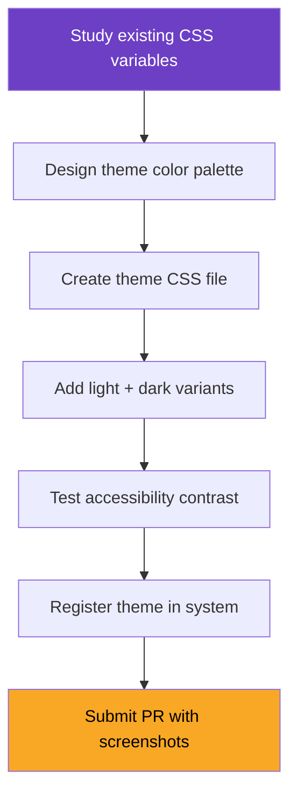

# 🎭 Profile Themes: Unleashing the Style Sorcerer

> *"Color is power. Layout is language. Together, they speak the soul of a creator."*
> — The Style Sorcerer

## 🎯 Quest Objectives

- [ ] Understand the CSS custom property architecture
- [ ] Create a new theme variant
- [ ] Support light and dark modes
- [ ] Ensure accessibility compliance
- [ ] Register the theme for selection in contributor data
- [ ] Submit a PR with screenshots

## 📖 Background

The contributor profile system uses CSS custom properties (variables) for theming. Currently, themes are class-based (Wizard=purple, Warrior=red, etc.). This quest teaches you to create entirely new theme variants beyond class colors — seasonal themes, retro themes, minimalist themes — that any contributor can select.

## 🗺️ Quest Architecture



## 🗺️ Quest Steps

### Step 1: Study the Variable Architecture

Open `assets/css/contributor-profile.css` and identify the custom properties:

```css
/* Key variables used by the profile system */
--contributor-accent: #6c3fc5;     /* Primary accent color */
--contributor-bg: #f5f5f5;         /* Card backgrounds */
--contributor-text: #333;          /* Primary text */
--contributor-muted: #666;         /* Secondary text */
--contributor-border: #e0e0e0;     /* Borders */
--contributor-card-bg: #fff;       /* Card surface */
--xp-bar-fill: <gradient>;        /* XP progress bar */
```

These variables control the entire visual appearance.

### Step 2: Design Your Theme

Choose a theme concept. Examples:

| Theme | Concept | Accent | Background |
|-------|---------|--------|------------|
| `cyberpunk` | Neon on dark | `#00ff41` | `#0d0d0d` |
| `parchment` | Medieval scroll | `#8b4513` | `#f5e6c8` |
| `arctic` | Ice and frost | `#00bcd4` | `#e3f2fd` |
| `sunset` | Warm gradients | `#ff6b35` | `#fff3e0` |
| `terminal` | Green on black | `#33ff33` | `#1a1a1a` |

### Step 3: Create the Theme CSS

Create `assets/css/themes/contributor-theme-YOUR_THEME.css`:

```css
/* Theme: YOUR_THEME_NAME */
/* Author: YOUR_USERNAME */
/* Description: Brief description of the visual concept */

.contributor-theme--YOUR_THEME {
  /* Light mode */
  --contributor-accent: #YOUR_ACCENT;
  --contributor-bg: #YOUR_BG;
  --contributor-text: #YOUR_TEXT;
  --contributor-muted: #YOUR_MUTED;
  --contributor-border: #YOUR_BORDER;
  --contributor-card-bg: #YOUR_CARD_BG;
}

/* Dark mode variant */
@media (prefers-color-scheme: dark) {
  .contributor-theme--YOUR_THEME {
    --contributor-accent: #YOUR_DARK_ACCENT;
    --contributor-bg: #YOUR_DARK_BG;
    --contributor-text: #YOUR_DARK_TEXT;
    --contributor-muted: #YOUR_DARK_MUTED;
    --contributor-border: #YOUR_DARK_BORDER;
    --contributor-card-bg: #YOUR_DARK_CARD_BG;
  }
}

/* XP bar override */
.contributor-theme--YOUR_THEME .xp-bar-fill {
  background: linear-gradient(90deg, #START_COLOR, #END_COLOR);
}

/* Calendar override (optional) */
.contributor-theme--YOUR_THEME .calendar-low    { background: #LEVEL1; }
.contributor-theme--YOUR_THEME .calendar-medium { background: #LEVEL2; }
.contributor-theme--YOUR_THEME .calendar-high   { background: #LEVEL3; }
.contributor-theme--YOUR_THEME .calendar-max    { background: #LEVEL4; }
```

### Step 4: Accessibility Check

Verify your theme meets WCAG AA contrast ratios:

| Element | Minimum Ratio |
|---------|--------------|
| Body text on background | 4.5:1 |
| Large text (headings) on background | 3:1 |
| Interactive elements | 3:1 against adjacent colors |

Use [WebAIM Contrast Checker](https://webaim.org/resources/contrastchecker/) or browser DevTools accessibility panel.

- [ ] All text passes AA contrast
- [ ] Badges are distinguishable
- [ ] XP bar is visible against background

### Step 5: Register the Theme

Add theme support to `_data/contributors/YOUR_USERNAME.yml`:

```yaml
profile:
  theme: YOUR_THEME  # New field — name of the CSS theme
```

Update `_includes/contributor/character_sheet.html` to apply the theme class:

```liquid


  

<div class="contributor-sheet {{ theme_class }}">

```

### Step 6: Load the Theme CSS

In your profile page (or in `character_sheet.html`):

```liquid


<link rel="stylesheet" href="{{ '/assets/css/themes/contributor-theme-' | append: contributor.profile.theme | append: '.css' | relative_url }}">


```

### Step 7: Test & Screenshot

Build the site and verify:

```bash
bundle exec jekyll serve
```

Take screenshots in both light and dark mode for your PR.

- [ ] Theme renders correctly in light mode
- [ ] Theme renders correctly in dark mode
- [ ] No broken layouts or unreadable text
- [ ] Screenshots taken for PR

### Step 8: Submit PR

```bash
git checkout -b feature/contributor-theme-YOUR_THEME
git add assets/css/themes/contributor-theme-YOUR_THEME.css
git commit -m "feat(contributor): add YOUR_THEME profile theme

New theme: YOUR_THEME_NAME
Concept: Brief description
Includes light and dark mode variants.
Passes WCAG AA contrast requirements."
git push origin feature/contributor-theme-YOUR_THEME
```

## 🏆 Reward: Style Sorcerer Badge 🎭

Once your theme PR is merged, you've earned the **Style Sorcerer** badge (+150 XP).

---

> *"You have bent the very fabric of appearance to your will. The realm is more beautiful for it."*
