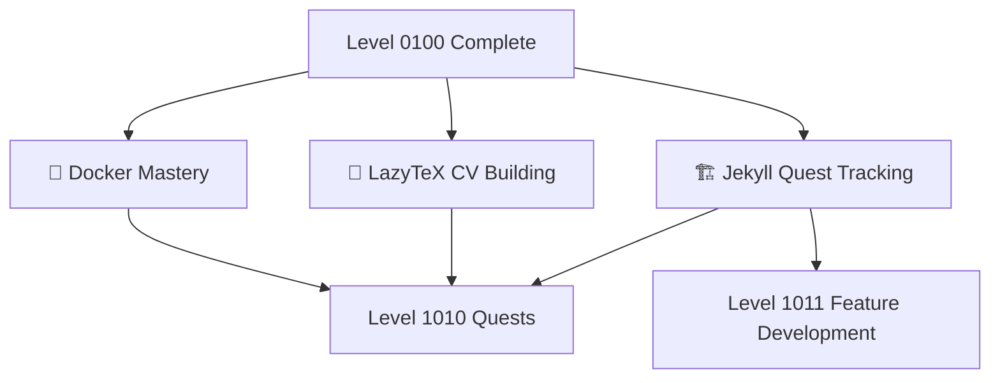

# Level 0101: Advanced Docker & DevOps

*You've mastered the basics. Now it's time to push your container skills further. Level 0101 combines advanced Docker patterns with practical applications like document automation and professional portfolio creation.*

## Quest Overview

Level 0101 quests focus on:
- **Advanced Docker Patterns** - Complex containerization scenarios
- **Document Automation** - LaTeX and professional typesetting
- **Portfolio Development** - Professional CV and resume creation
- **DevOps Practices** - Production-ready workflows

## Available Quests

| Quest | Difficulty | Time | Type | Status |
|-------|------------|------|------|--------|
| [Artifact Management: Build Output Storage and Dependency Caching](/quests/level-0101-artifact-management/) | 🟡 Medium | 45-60 minutes | main_quest | 🔮 Placeholder |
| [CI/CD Fundamentals: Continuous Integration and Continuous Deployment Essentials](/quests/level-0101-cicd-fundamentals/) | 🟡 Medium | 75-90 minutes | main_quest | 🔮 Placeholder |
| [Deployment Pipelines: Production Release Automation Strategies](/quests/level-0101-deployment-pipelines/) | 🟡 Medium | 90-120 minutes | main_quest | 🔮 Placeholder |
| [Docker Containerization Mastery: Level 0101 (5) Quest](/quests/level-0101-docker-mastery/) | 🟡 Medium | 60-90 minutes | main_quest | ✅ Complete |
| [Environment Management: Dev, Staging, and Production Configuration](/quests/level-0101-environment-management/) | 🟡 Medium | 60-75 minutes | main_quest | 🔮 Placeholder |
| [GitHub Actions Basics: Workflow Automation for Modern DevOps](/quests/level-0101-github-actions-basics/) | 🟡 Medium | 60-75 minutes | main_quest | 🔮 Placeholder |
| [Jekyll Quest Tracking: Building Dynamic Collection Layouts](/quests/level-0101-jekyll-quest-tracking/) | 🔴 Hard | 4-6 hours | side_quest | ✅ Complete |
| [Forging the La(zy)TeX CV: Binary Level 0101 (5) Quest](/quests/level-0101-latex-cv-forging/) | 🟡 Medium | 90-120 minutes | main_quest | 🔮 Placeholder |
| [Secrets Management: Secure Configuration and Credential Handling](/quests/level-0101-secrets-management/) | 🟡 Medium | 45-60 minutes | main_quest | 🔮 Placeholder |
| [Testing Integration: Automated Quality Assurance in CI/CD Pipelines](/quests/level-0101-testing-integration/) | 🟡 Medium | 75-90 minutes | main_quest | 🔮 Placeholder |
| [Workflow Optimization: Caching Strategies and Pipeline Parallelization](/quests/level-0101-workflow-optimization/) | 🟡 Medium | 60-75 minutes | main_quest | 🔮 Placeholder |

### 🐳 Advanced Containers

#### [Docker Mastery Example](docker-mastery-example.md)
**Quest Type**: Main 🏰 | **Difficulty**: 🔴 Hard | **Estimated Time**: 120-180 minutes

Push your Docker skills to mastery level. Learn advanced patterns including multi-stage builds, custom networks, and production optimization.

**Skills You'll Master:**
- Multi-stage Docker builds
- Advanced Docker Compose configurations
- Security best practices for containers
- Performance optimization techniques

**Prerequisites:** [Frontend Docker Quest](../0100/frontend-docker.md)

### 📄 Document Automation

#### [The LazyTeX of Building a Curriculum Vitae](the-lazytex-of-building-a-curriculum-vitae.md)
**Quest Type**: Side ⚔️ | **Difficulty**: 🟡 Medium | **Estimated Time**: 60-90 minutes

Master LaTeX for professional document creation. Build a stunning CV that stands out from the crowd using programmable document generation.

**Skills You'll Master:**
- LaTeX fundamentals and syntax
- CV/resume template customization
- PDF generation workflows
- Docker-based LaTeX compilation

**Prerequisites:** Basic terminal, Docker knowledge recommended

### 🏗️ Static Site Engineering

#### [Jekyll Quest Tracking: Building Dynamic Collection Layouts](jekyll-quest-tracking.md)
**Quest Type**: Side ⚔️ | **Difficulty**: 🔴 Hard | **Estimated Time**: 4-6 hours

Master Jekyll's collection system by building a quest tracking interface with dynamic filtering, statistics, and level-aware displays using Liquid templating and frontmatter data.

**Skills You'll Master:**
- Jekyll collections configuration and architecture
- Liquid templating with includes and parameters
- Client-side filtering with JavaScript and data attributes
- Python automation for batch frontmatter management

**Prerequisites:** [Frontend Docker Quest](../0100/frontend-docker.md), Basic Jekyll knowledge

## Learning Path Recommendations

### For DevOps Engineers
1. [Docker Mastery Example](docker-mastery-example.md) - Advanced containerization
2. Progress to Level 1010 for automation and testing

### For Job Seekers
1. [The LazyTeX of Building a Curriculum Vitae](the-lazytex-of-building-a-curriculum-vitae.md)
2. Combine with Level 0001 personal site creation

### For Full-Stack Developers
1. [Docker Mastery Example](docker-mastery-example.md)
2. [The LazyTeX of Building a Curriculum Vitae](the-lazytex-of-building-a-curriculum-vitae.md)
3. Progress to Level 1010

## Quest Dependencies & Progression

```mermaid
graph TD
    A[Level 0100 Complete] --> B[🐳 Docker Mastery]
    A --> C[📄 LazyTeX CV Building]
    A --> E[🏗️ Jekyll Quest Tracking]
    B --> D[Level 1010 Quests]
    C --> D
    E --> D
    E --> F[Level 1011 Feature Development]
```

## Quest Completion Benefits

Upon completing Level 0101 quests, you'll unlock:
- **Container Expertise** - Advanced Docker patterns
- **Document Automation** - Professional LaTeX skills
- **Portfolio Assets** - Ready-to-use CV template
- **DevOps Foundation** - Production deployment knowledge

## Next Level: Level 1010

After mastering Level 0101, advance to [Level 1010 - Automation & Testing](../1010/README.md) where you'll:
- Build automated testing pipelines
- Create hyperlink validation systems
- Implement CI/CD workflows

---

*Professional tools create professional results.* 📄✨
